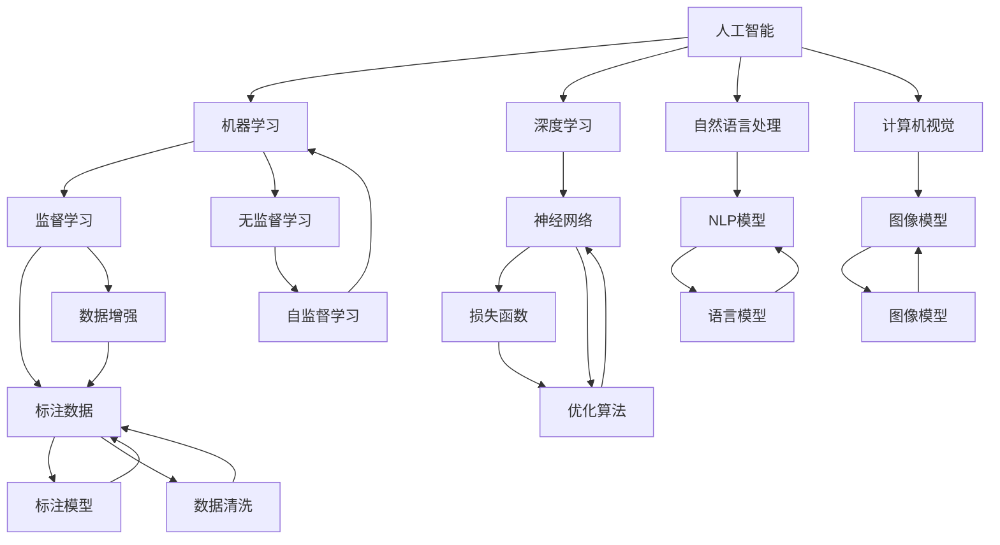
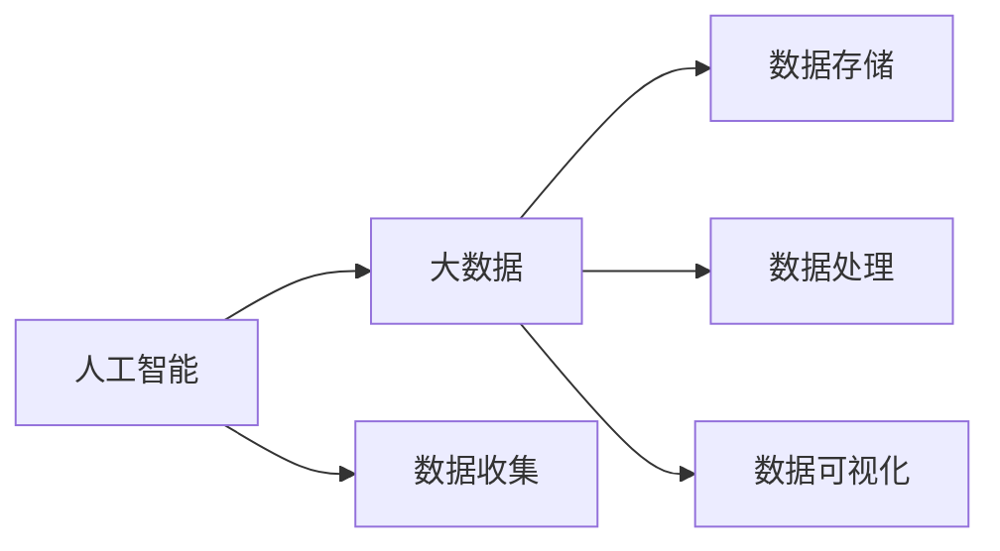
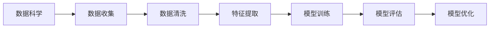
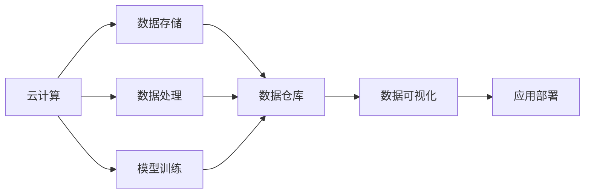
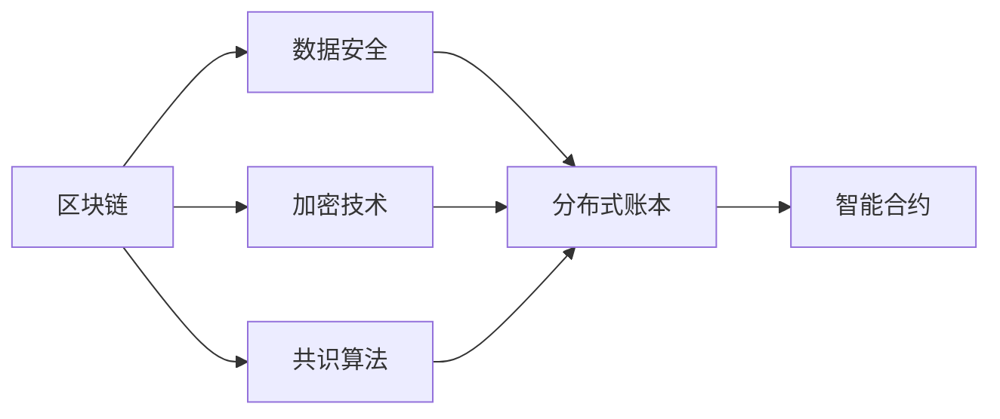

                 

# 人工智能与大数据的未来发展和应用

## 1. 背景介绍

### 1.1 问题由来

近年来，随着人工智能（AI）和大数据技术的快速发展，其在各个领域的应用已经取得了显著进展。例如，AI和大数据在医疗、金融、教育、零售等行业中，已经实现了高效的决策支持、精准的个性化推荐、智能的客户服务等功能。然而，尽管当前AI和大数据应用已经相当广泛，但它们的应用深度和广度仍面临诸多挑战。例如，如何从大规模数据中高效地提取有用的信息？如何构建能够不断学习和适应的智能系统？这些问题成为未来发展的关键方向。

### 1.2 问题核心关键点

当前，AI和大数据的发展主要集中在以下核心关键点上：

- **数据的收集与处理**：收集大规模、高质量的数据是AI和大数据应用的基础。数据的收集通常包括从社交媒体、传感器、Web应用等来源获取数据。数据处理则包括数据清洗、特征提取、数据增强等环节，以提高数据质量。
- **模型的构建与训练**：AI和大数据应用的核心在于构建高效、准确的模型。常用的模型包括深度神经网络、决策树、随机森林等。模型的训练需要大量的标注数据和计算资源。
- **应用场景的适配**：将AI和大数据模型适配到具体的业务场景中，进行模型部署和优化，是实现实际应用的关键。例如，在金融领域，需要设计高效的风控模型；在医疗领域，需要构建精准的诊断模型。
- **技术的集成与优化**：将多种技术手段进行集成，如机器学习、自然语言处理、计算机视觉等，构建更复杂的智能系统。同时，优化算法的效率，提高系统的响应速度和稳定性。

## 2. 核心概念与联系

### 2.1 核心概念概述

为更好地理解AI和大数据的未来发展，本节将介绍几个密切相关的核心概念：

- **人工智能**：AI是指由计算机系统模拟人类智能的过程，包括学习、推理、决策、感知、语言理解等能力。AI的应用涉及机器学习、深度学习、自然语言处理等多个领域。
- **大数据**：大数据是指通过数据收集、存储、分析和可视化等手段，从大规模数据中提取有用信息，支持决策制定和业务优化。大数据技术包括数据仓库、数据挖掘、流处理等。
- **数据科学**：数据科学是指应用数据和统计学方法，对数据进行分析和解释，以发现知识、做出预测和优化决策。数据科学包括数据清洗、特征工程、模型训练、模型评估等步骤。
- **云计算**：云计算是指通过互联网提供计算资源和服务，支持大规模数据处理和AI模型的训练与部署。云计算技术包括云存储、云计算平台、云服务等。
- **区块链**：区块链是指一种去中心化的分布式账本技术，支持数据的安全存储和传输。区块链技术包括共识算法、加密技术、智能合约等。

这些核心概念之间的逻辑关系可以通过以下Mermaid流程图来展示：



这个流程图展示了AI、大数据、数据科学、云计算、区块链等概念之间的联系和相互作用。其中，人工智能是大数据、数据科学、云计算等技术应用的顶层目标。机器学习、深度学习、自然语言处理等技术是实现人工智能的核心手段。监督学习、无监督学习、自监督学习等方法，是模型构建和训练的关键技术。神经网络、语言模型、图像模型等模型是具体的实现形式。标注数据、数据清洗、数据增强等预处理技术，是模型训练的基础。

### 2.2 概念间的关系

这些核心概念之间存在着紧密的联系，形成了AI和大数据应用的完整生态系统。下面我通过几个Mermaid流程图来展示这些概念之间的关系。

#### 2.2.1 AI与大数据的关系



这个流程图展示了人工智能与大数据之间的关系。AI的实现离不开数据的支撑，因此需要从多个渠道收集数据。大数据技术则提供高效的数据存储、处理和可视化手段，支持AI模型的训练和部署。

#### 2.2.2 数据科学的应用流程



这个流程图展示了数据科学的应用流程。从数据收集开始，经过数据清洗、特征提取等预处理环节，构建模型并进行训练和评估。模型优化则是根据评估结果不断调整模型参数，以提高模型性能。

#### 2.2.3 云计算在大数据中的应用



这个流程图展示了云计算在大数据中的应用。云计算提供了高效的数据存储、处理和模型训练平台，支持大规模数据处理和AI模型的部署。数据仓库和数据可视化技术，使得数据科学过程更加高效和可视化。

#### 2.2.4 区块链在数据安全中的应用



这个流程图展示了区块链在数据安全中的应用。区块链通过加密技术、共识算法等手段，支持数据的安全存储和传输。智能合约技术则可以在数据传输过程中，自动执行预设的规则，保证数据的安全性和完整性。

## 3. 核心算法原理 & 具体操作步骤

### 3.1 算法原理概述

AI和大数据的核心算法主要包括以下几种：

- **监督学习**：利用有标签的数据集，通过训练模型来学习输入和输出之间的映射关系。常用的监督学习方法包括决策树、支持向量机、随机森林等。
- **无监督学习**：在没有标签的情况下，通过聚类、降维等技术，发现数据中的潜在结构和规律。常用的无监督学习方法包括K-means、主成分分析等。
- **深度学习**：利用深度神经网络，通过大量的数据和计算资源，学习复杂的非线性映射关系。深度学习在图像识别、语音识别、自然语言处理等领域取得了显著进展。
- **强化学习**：通过与环境的交互，逐步优化决策策略，以最大化奖励。强化学习在游戏、机器人控制等领域得到了广泛应用。

这些算法在数据科学和AI应用中，扮演着重要的角色。它们通过不同的方式，从数据中提取有用的信息，支持模型的构建和训练，并最终实现对实际问题的解决。

### 3.2 算法步骤详解

AI和大数据的应用，通常包括以下几个关键步骤：

**Step 1: 数据收集与预处理**：
1. 从多个渠道收集数据，如社交媒体、传感器、Web应用等。
2. 对收集到的数据进行清洗、去重、去噪等预处理，确保数据质量。
3. 对数据进行特征提取、数据增强等处理，提高数据利用效率。

**Step 2: 模型构建与训练**：
1. 选择合适的算法和模型，如监督学习、深度学习、强化学习等。
2. 根据预处理后的数据，构建模型并进行训练。
3. 在训练过程中，使用交叉验证等技术，避免过拟合。
4. 使用正则化、dropout等技术，提高模型的泛化能力。

**Step 3: 模型评估与优化**：
1. 在测试集上评估模型的性能，如准确率、召回率、F1分数等。
2. 根据评估结果，优化模型的参数和结构。
3. 使用超参数调优等技术，提高模型的性能。

**Step 4: 模型部署与迭代**：
1. 将优化后的模型部署到实际应用中，如推荐系统、智能客服等。
2. 根据实际应用中的反馈，不断迭代和优化模型。
3. 使用A/B测试等手段，评估模型在实际场景中的表现。

### 3.3 算法优缺点

AI和大数据的应用，具有以下优点：
1. 自动化程度高：AI和大数据的应用可以自动化地处理大量数据，提高工作效率。
2. 决策科学化：AI和大数据的应用可以提供基于数据的决策支持，提高决策的科学性和准确性。
3. 应用场景广：AI和大数据的应用可以应用于各个行业，如医疗、金融、教育、零售等。

同时，AI和大数据的应用也存在一些缺点：
1. 对数据的依赖度高：AI和大数据的应用需要大量的高质量数据，数据获取成本高。
2. 技术复杂度高：AI和大数据的应用需要高度专业的技术支持，对技术人才的需求高。
3. 应用风险大：AI和大数据的应用可能存在算法偏见、隐私泄露等问题，需要严格监管。

### 3.4 算法应用领域

AI和大数据的应用领域非常广泛，包括但不限于以下几个方面：

- **金融行业**：AI和大数据可以应用于风险控制、信用评估、欺诈检测、客户服务等。例如，利用深度学习模型进行股票价格预测，利用强化学习模型进行投资组合优化。
- **医疗行业**：AI和大数据可以应用于疾病诊断、治疗方案、患者管理等。例如，利用图像识别技术进行疾病诊断，利用自然语言处理技术分析患者记录。
- **零售行业**：AI和大数据可以应用于个性化推荐、库存管理、客户行为分析等。例如，利用协同过滤算法进行商品推荐，利用时间序列预测技术进行库存优化。
- **智能制造**：AI和大数据可以应用于智能生产、设备维护、供应链管理等。例如，利用机器视觉技术进行缺陷检测，利用强化学习技术进行设备维护调度。
- **智慧城市**：AI和大数据可以应用于城市交通管理、环境监测、智能家居等。例如，利用交通流预测技术优化交通信号灯，利用环境监测技术提高空气质量。

## 4. 数学模型和公式 & 详细讲解 & 举例说明

### 4.1 数学模型构建

**线性回归模型**：
假设有一个线性回归模型 $y = w_0 + w_1x_1 + w_2x_2 + \ldots + w_nx_n + \epsilon$，其中 $w_0, w_1, \ldots, w_n$ 为模型参数，$\epsilon$ 为误差项。目标是找到最优的参数 $w$，使得模型能够最小化预测误差。

### 4.2 公式推导过程

线性回归模型的目标是最小化均方误差（MSE），即：
$$
\min_{w} \frac{1}{N} \sum_{i=1}^N (y_i - \hat{y_i})^2
$$
其中 $y_i$ 为实际值，$\hat{y_i}$ 为模型预测值。

根据最小二乘法，可以得到参数 $w$ 的最优解为：
$$
w = (\mathbf{X}^T\mathbf{X})^{-1}\mathbf{X}^T\mathbf{y}
$$
其中 $\mathbf{X}$ 为自变量矩阵，$\mathbf{y}$ 为目标变量向量。

### 4.3 案例分析与讲解

假设有一个房地产价格预测任务，收集了多个影响房价的因素，如房屋面积、地段、楼层、房龄等。可以使用线性回归模型来预测房价。具体步骤如下：

1. 收集数据，如房屋面积、地段、楼层、房龄等。
2. 将数据转换为矩阵形式，如 $\mathbf{X}$ 为自变量矩阵，$\mathbf{y}$ 为目标变量向量。
3. 使用最小二乘法计算参数 $w$ 的最优解。
4. 在测试集上评估模型的预测效果。
5. 根据评估结果，对模型进行优化和改进。

## 5. 项目实践：代码实例和详细解释说明

### 5.1 开发环境搭建

在进行AI和大数据应用开发前，我们需要准备好开发环境。以下是使用Python进行PyTorch开发的Python环境配置流程：

1. 安装Anaconda：从官网下载并安装Anaconda，用于创建独立的Python环境。

2. 创建并激活虚拟环境：
```bash
conda create -n pytorch-env python=3.8 
conda activate pytorch-env
```

3. 安装PyTorch：根据CUDA版本，从官网获取对应的安装命令。例如：
```bash
conda install pytorch torchvision torchaudio cudatoolkit=11.1 -c pytorch -c conda-forge
```

4. 安装TensorFlow：
```bash
conda install tensorflow
```

5. 安装PyTorch的Distributions库：
```bash
conda install pytorch-distributions
```

6. 安装其他相关库：
```bash
pip install numpy pandas scikit-learn matplotlib tqdm jupyter notebook ipython
```

完成上述步骤后，即可在`pytorch-env`环境中开始AI和大数据应用开发。

### 5.2 源代码详细实现

以下是使用PyTorch进行线性回归模型的代码实现。

```python
import torch
import torch.nn as nn
import torch.optim as optim
import torch.distributions as dist

class LinearRegressionModel(nn.Module):
    def __init__(self, input_size, output_size):
        super(LinearRegressionModel, self).__init__()
        self.linear = nn.Linear(input_size, output_size)

    def forward(self, x):
        y_pred = self.linear(x)
        return y_pred

# 定义数据
x = torch.tensor([[1.0, 2.0, 3.0], [2.0, 3.0, 4.0], [3.0, 4.0, 5.0], [4.0, 5.0, 6.0]])
y = torch.tensor([5.0, 10.0, 15.0, 20.0])

# 定义模型
model = LinearRegressionModel(3, 1)

# 定义损失函数和优化器
loss_fn = nn.MSELoss()
optimizer = optim.Adam(model.parameters(), lr=0.01)

# 训练模型
for epoch in range(100):
    optimizer.zero_grad()
    y_pred = model(x)
    loss = loss_fn(y_pred, y)
    loss.backward()
    optimizer.step()

    if (epoch+1) % 10 == 0:
        print(f"Epoch: {epoch+1}, Loss: {loss.item()}")
```

### 5.3 代码解读与分析

让我们再详细解读一下关键代码的实现细节：

**LinearRegressionModel类**：
- `__init__`方法：定义线性回归模型的结构，包括一个线性层。
- `forward`方法：定义前向传播过程，将输入数据 $x$ 输入到模型中，输出预测结果 $y_pred$。

**训练过程**：
- 定义训练数据 $x$ 和标签 $y$。
- 定义线性回归模型和损失函数。
- 定义优化器。
- 使用训练数据进行模型训练，每次迭代计算损失函数，并更新模型参数。
- 在每个epoch结束后，打印当前epoch的损失值。

这个代码实现展示了如何使用PyTorch进行线性回归模型的训练。可以看出，使用PyTorch构建深度学习模型非常简单，只需要定义模型结构、损失函数和优化器，即可进行模型训练。

## 6. 实际应用场景

### 6.1 金融行业

在金融行业中，AI和大数据的应用非常广泛。例如，利用机器学习模型进行风险控制、信用评估、欺诈检测、客户服务等。

**风险控制**：利用机器学习模型分析客户的信用记录、消费行为等数据，预测客户是否可能违约，从而进行风险控制。

**信用评估**：利用机器学习模型分析客户的收入、负债、消费行为等数据，评估客户的信用风险，确定贷款利率和额度。

**欺诈检测**：利用机器学习模型分析交易数据，识别异常交易行为，及时发现欺诈行为，降低损失。

**客户服务**：利用自然语言处理技术分析客户咨询记录，自动生成常见问题的解答，提高客户满意度。

### 6.2 医疗行业

在医疗行业中，AI和大数据的应用同样广泛。例如，利用深度学习模型进行疾病诊断、治疗方案、患者管理等。

**疾病诊断**：利用机器学习模型分析医学影像、病历记录等数据，诊断疾病。例如，利用卷积神经网络进行医学影像识别。

**治疗方案**：利用机器学习模型分析患者数据，制定个性化的治疗方案。例如，利用决策树模型进行疾病治疗方案推荐。

**患者管理**：利用机器学习模型分析患者数据，预测病情发展，提高治疗效果。例如，利用时间序列预测模型进行病情预测。

### 6.3 零售行业

在零售行业中，AI和大数据的应用同样广泛。例如，利用机器学习模型进行个性化推荐、库存管理、客户行为分析等。

**个性化推荐**：利用协同过滤算法分析用户的历史行为数据，推荐商品。例如，利用深度学习模型进行商品推荐。

**库存管理**：利用时间序列预测模型分析销售数据，优化库存管理。例如，利用ARIMA模型进行库存预测。

**客户行为分析**：利用机器学习模型分析客户行为数据，发现客户偏好和行为规律，提高客户满意度。例如，利用聚类算法进行客户分群。

### 6.4 智能制造

在智能制造中，AI和大数据的应用同样广泛。例如，利用机器学习模型进行智能生产、设备维护、供应链管理等。

**智能生产**：利用机器学习模型分析生产数据，优化生产流程，提高生产效率。例如，利用深度学习模型进行生产调度优化。

**设备维护**：利用机器学习模型分析设备运行数据，预测设备故障，优化维护计划。例如，利用时序预测模型进行设备故障预测。

**供应链管理**：利用机器学习模型分析供应链数据，优化供应链管理。例如，利用强化学习模型进行库存优化。

## 7. 工具和资源推荐

### 7.1 学习资源推荐

为了帮助开发者系统掌握AI和大数据的技术基础和应用技巧，这里推荐一些优质的学习资源：

1. **《机器学习》by 周志华**：系统介绍了机器学习的基本原理和算法，适合入门学习。
2. **《深度学习》by Ian Goodfellow**：全面介绍了深度学习的基本原理和应用，适合进阶学习。
3. **Coursera机器学习课程**：斯坦福大学的入门级课程，由Andrew Ng主讲，系统讲解机器学习算法。
4. **TensorFlow官方文档**：详细介绍了TensorFlow的使用方法，包括模型构建、训练、部署等。
5. **PyTorch官方文档**：详细介绍了PyTorch的使用方法，包括模型构建、训练、部署等。

### 7.2 开发工具推荐

高效的开发离不开优秀的工具支持。以下是几款用于AI和大数据应用开发的常用工具：

1. **Python**：Python是数据科学和AI开发的首选语言，有丰富的第三方库支持。
2. **TensorFlow**：由Google开发的深度学习框架，支持分布式计算，适合大规模模型训练。
3. **PyTorch**：由Facebook开发的深度学习框架，灵活性高，适合快速原型开发。
4. **Jupyter Notebook**：轻量级的交互式编程环境，支持代码执行、数据分析、可视化等。
5. **Google Colab**：免费的云计算平台，支持GPU、TPU等高性能计算资源，适合实验研究和协作开发。

### 7.3 相关论文推荐

AI和大数据的研究领域非常广泛，以下是几篇奠基性的相关论文，推荐阅读：

1. **《神经网络与深度学习》by Ian Goodfellow**：全面介绍了神经网络的基本原理和应用，适合入门学习。
2. **《深度学习》by Goodfellow et al.**：系统介绍了深度学习的基本原理和算法，适合进阶学习。
3. **《大数据时代的机器学习》by Tom Mitchell**：介绍了大数据时代机器学习的基本原理和方法。
4. **《机器学习实战》by Peter Harrington**：通过实战项目，系统讲解机器学习算法和应用。
5. **《TensorFlow实战》by Amit Chawla**：通过实战项目，系统讲解TensorFlow的使用方法和应用。

## 8. 总结：未来发展趋势与挑战

### 8.1 研究成果总结

通过AI和大数据的广泛应用，当前的技术已经取得了显著进展。例如，在金融行业，利用机器学习模型进行风险控制和信用评估，显著提高了金融决策的科学性和准确性。在医疗行业，利用深度学习模型进行疾病诊断和治疗方案推荐，显著提高了医疗服务的质量和效率。在零售行业，利用机器学习模型进行个性化推荐和库存管理，显著提高了客户满意度和经营效率。在智能制造中，利用机器学习模型进行智能生产和管理，显著提高了生产效率和设备维护水平。

### 8.2 未来发展趋势

展望未来，AI和大数据的应用将呈现以下几个趋势：

1. **自动化程度的提升**：随着技术的发展，AI和大数据的自动化程度将进一步提升。例如，利用机器学习模型进行自动驾驶、智能客服等。
2. **模型复杂度的增加**：随着数据量的增加，模型的复杂度也将不断提升。例如，利用深度学习模型进行图像识别、语音识别、自然语言处理等。
3. **应用场景的拓展**：AI和大数据的应用将不断拓展到更多的领域，如智慧城市、智慧教育、智慧农业等。
4. **跨领域融合的加强**：AI和大数据将与云计算、物联网、区块链等技术进行更紧密的融合，形成更复杂的应用场景。
5. **数据隐私和安全保障的提升**：数据隐私和安全问题将成为未来AI和大数据应用的重要挑战，需要通过技术手段进行保障。

### 8.3 面临的挑战

尽管AI和大数据的应用已经取得了显著进展，但在实现广泛应用的过程中，仍面临诸多挑战：

1. **数据质量问题**：数据质量差、数据获取成本高，是当前AI和大数据应用的主要瓶颈。需要进一步提高数据质量，降低数据获取成本。
2. **技术复杂度高**：AI和大数据的应用需要高度专业的技术支持，对技术人才的需求高。需要进一步降低技术门槛，提高技术普及度。
3. **模型偏见问题**：AI和大数据的应用可能存在算法偏见、数据偏见等问题，需要进一步提升模型的公平性和透明性。
4. **隐私和安全问题**：数据隐私和安全问题将成为未来AI和大数据应用的重要挑战，需要通过技术手段进行保障。
5. **跨领域融合的挑战**：AI和大数据与云计算、物联网、区块链等技术的融合，需要解决数据异构、系统集成等挑战。

### 8.4 研究展望

面对AI和大数据应用面临的挑战，未来的研究需要在以下几个方面寻求新的突破：

1. **数据质量的提升**：进一步提高数据质量，降低数据获取成本，是未来AI和大数据应用的关键。需要探索更多的数据获取渠道和技术手段。
2. **技术普及度的提高**：降低技术门槛，提高技术普及度，是未来AI和大数据应用的必然趋势。需要加强技术教育和培训。
3. **模型公平性的提升**：提高模型的公平性和透明性，是未来AI和大数据应用的重要目标。需要进一步提升模型的可解释性和可解释性。
4. **数据隐私和安全的保障**：保护数据隐私和安全，是未来AI和大数据应用的重要任务。需要进一步探索数据保护技术。
5. **跨领域融合的优化**：实现AI和大数据与其他技术的更紧密融合，是未来AI和大数据应用的重大挑战。需要探索更好的数据集成和系统集成方法。

## 9. 附录：常见问题与解答

**Q1：AI和大数据的应用是否适用于所有行业？**

A: AI和大数据的应用适用于大多数行业，但具体应用场景和效果可能因行业而异。例如，在医疗行业，AI和大数据的应用需要处理高度敏感的数据，需要严格的数据保护和隐私控制。在金融行业，AI和大数据的应用需要处理大量的交易数据，需要高度的安全性和准确性。

**Q2：AI和大数据的应用是否需要大量的数据？**

A: AI和大数据的应用通常需要大量的数据。数据的多样性和质量对于模型的性能至关重要。例如，在医疗行业中，需要处理大量的医学影像、病历记录等数据。在金融行业中，需要处理大量的交易数据和用户行为数据。

**Q3：AI和大数据的应用是否需要高度专业的技术支持？**

A: AI和大数据的应用通常需要高度专业的技术支持。例如，在深度学习中，需要大量的计算资源和专业的技术人才。在自然语言处理中，需要深入的语言学知识和高级算法。

**Q4：AI和大数据的应用是否需要跨领域的知识？**

A: AI和大数据的应用需要跨领域的知识。例如，在智慧城市中，需要融合计算机视觉、物联网、大数据等多个领域的技术手段。在智能制造中，需要融合机器学习、物联网、云计算等多个领域的技术手段。

**Q5：AI和大数据的应用是否需要不断的技术更新和迭代？**

A: AI和大数据的应用需要不断的技术更新和迭代。例如，在自然语言处理中，新的语言模型和算法不断涌现，需要持续

