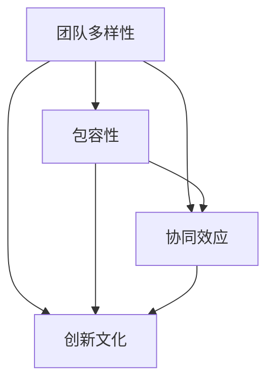

                 

# 人工智能创业：团队多样性

人工智能(AI)技术的兴起正在重塑各行各业的商业模式和生态系统。从自动化流程到个性化推荐，AI技术的广泛应用为创业公司带来了前所未有的机遇。然而，与此同时，如何在竞争激烈的市场中脱颖而出，构建一个既能发挥多样性优势，又能协同运作的高效AI团队，成为了一个亟待解决的问题。本文将深入探讨人工智能创业中的团队多样性管理，从背景介绍、核心概念、算法原理到具体实践，全面解析如何打造一个既创新又协调的人工智能创业团队。

## 1. 背景介绍

### 1.1 问题由来

在当今信息爆炸和数据驱动的时代，人工智能技术已成为推动各行各业发展的关键动力。AI创业公司数量激增，市场需求旺盛。然而，如何构建一个高效且多样化的团队，成为人工智能创业的重大挑战。多样性不仅涉及人员的背景、经验和专业技能，还包括文化、性别、年龄、种族等多个维度。

### 1.2 问题核心关键点

多样性对于AI团队的重要性体现在以下几个方面：

- **创新驱动**：不同背景和经验的团队成员可以带来更多元化的视角，促进创新思维的碰撞，推动技术的突破。
- **问题解决**：多样性的团队更有能力面对复杂多变的问题，提供更全面的解决方案。
- **市场竞争力**：多样化的团队可以更好地理解和服务不同用户群体，提升市场竞争力。
- **品牌形象**：多元化的团队形象可以提升公司的社会责任感和品牌形象。

### 1.3 问题研究意义

理解并利用团队多样性，对人工智能创业公司来说具有重要意义：

- **提升绩效**：多样性团队能够更高效地解决复杂问题，提高项目成功率。
- **增强韧性**：多样性团队更能应对外部变化和内部冲突，保持团队的稳定和长远发展。
- **促进公平**：多样性团队有助于消除偏见，提升组织公平性和包容性。
- **吸引人才**：多样性的企业文化可以吸引更多优秀人才加入，提升团队整体素质。

## 2. 核心概念与联系

### 2.1 核心概念概述

要理解人工智能创业中的团队多样性管理，首先需要明确几个核心概念：

- **团队多样性**：团队成员在性别、种族、年龄、文化背景、专业技能等方面的差异性。
- **包容性**：团队能够尊重并接纳多样性，创造一个平等、尊重和支持的环境。
- **协同效应**：多样性团队成员通过协作，充分发挥各自优势，实现整体绩效最大化。
- **创新文化**：鼓励不同观点和想法的交流与碰撞，促进创新思维的培育。

### 2.2 概念间的关系

这些核心概念之间存在密切的联系，通过下图的Mermaid流程图可以更好地理解它们之间的相互作用：



这个流程图展示了多样性团队如何通过包容性、协同效应和创新文化，最终实现团队的高效运作和创新能力提升。

## 3. 核心算法原理 & 具体操作步骤

### 3.1 算法原理概述

多样性团队的管理和优化，可以通过一系列算法和步骤实现。这些算法和步骤包括但不限于：

- **团队构建算法**：在招聘过程中，通过多样性指标筛选团队成员。
- **团队管理算法**：在团队运作中，通过协作工具和反馈机制促进团队成员间的沟通和合作。
- **团队优化算法**：在团队演进过程中，通过绩效评估和人才发展计划，持续优化团队结构。

### 3.2 算法步骤详解

#### 3.2.1 团队构建算法

在构建AI创业团队时，可以通过以下步骤实现多样性：

1. **多样化招聘**：设定多样性指标，如性别、种族、年龄、专业背景等，确保招聘渠道和流程的公平性。
2. **多样化面试**：使用标准化面试流程，避免主观偏见，确保评估标准的客观性。
3. **多样化培训**：提供多样性培训，提升团队成员对多样性的认识和尊重。

#### 3.2.2 团队管理算法

在团队管理阶段，可以采用以下措施：

1. **使用协作工具**：如Slack、Trello、Confluence等，提升团队沟通效率。
2. **建立反馈机制**：定期收集团队成员的反馈，及时解决冲突和问题。
3. **设计团队任务**：合理分配任务，平衡工作负荷，促进团队协同。

#### 3.2.3 团队优化算法

在团队演进过程中，可以通过以下方式优化团队：

1. **绩效评估**：定期评估团队成员的绩效，识别和提升高绩效个体。
2. **人才发展计划**：为团队成员提供培训和发展机会，提升整体能力。
3. **调整团队结构**：根据业务需求和人员变化，动态调整团队结构。

### 3.3 算法优缺点

多样性团队管理算法具有以下优点：

- **提高创新能力**：多样性团队成员可以带来更多元化的观点和想法，促进创新。
- **增强问题解决能力**：不同背景的团队成员可以提供不同的视角和方法，提高问题解决效率。
- **提升团队协作**：多样性团队更能理解和尊重彼此，促进协作和信任。

同时，这些算法也存在一些缺点：

- **管理复杂**：多样性团队管理需要更多的资源和精力。
- **文化冲突**：不同背景的团队成员可能会有文化冲突，需要管理和协调。
- **绩效评估难度**：多样性团队的多元化特点可能影响传统绩效评估体系的适用性。

### 3.4 算法应用领域

多样性团队管理算法广泛应用于各种领域，包括但不限于：

- **科技公司**：如Google、Facebook、Microsoft等，通过多样性团队提升创新能力和市场竞争力。
- **咨询公司**：如麦肯锡、波士顿咨询、德勤等，通过多样性团队提供更全面和深入的解决方案。
- **教育机构**：如哈佛大学、斯坦福大学、麻省理工学院等，通过多样性团队提升教学质量和研究水平。
- **医疗健康**：如Mayo Clinic、麻省总医院、约翰霍普金斯医院等，通过多样性团队提升医疗服务质量和效率。

## 4. 数学模型和公式 & 详细讲解 & 举例说明

### 4.1 数学模型构建

在数学模型构建中，我们可以使用以下公式来描述多样性团队的管理和优化过程：

$$
E[\text{Team Performance}] = \sum_{i=1}^{n} a_i \times f_i(\text{Team Composition})
$$

其中，$E[\text{Team Performance}]$ 表示团队绩效，$a_i$ 表示第 $i$ 个团队成员的权重，$f_i(\text{Team Composition})$ 表示团队成员的绩效函数，与团队组成有关。

### 4.2 公式推导过程

为了更好地理解团队绩效的计算过程，我们以一个简单的模型为例进行推导：

假设一个AI团队有 $n$ 名成员，每个成员的绩效 $f_i$ 为 $i$ 与团队组成 $c$ 的函数，即 $f_i = g(c_i)$。团队绩效为所有成员绩效的加权平均，即 $E[\text{Team Performance}] = \sum_{i=1}^{n} a_i \times g(c_i)$。

### 4.3 案例分析与讲解

假设一个AI团队有 $n=5$ 名成员，每个成员的绩效与团队组成的关系如下：

- 成员1：性别、种族、文化背景多样
- 成员2：专业知识丰富
- 成员3：沟通能力强
- 成员4：创新思维活跃
- 成员5：解决问题能力强

每个成员的权重 $a_i$ 相同，即 $a_i=1$。设团队组成 $c$ 为成员多样性指标的平均值，则有 $c = (c_1 + c_2 + c_3 + c_4 + c_5) / n$。团队绩效 $E[\text{Team Performance}]$ 为：

$$
E[\text{Team Performance}] = f_1 + f_2 + f_3 + f_4 + f_5 = g(c_1) + g(c_2) + g(c_3) + g(c_4) + g(c_5)
$$

通过调整团队组成 $c$，可以最大化团队绩效。例如，如果某个成员的多样性指标 $c_i$ 较高，说明其在团队中的多样性贡献较大，团队绩效也会相应提升。

## 5. 项目实践：代码实例和详细解释说明

### 5.1 开发环境搭建

在开始项目实践之前，需要搭建一个适合的多样性团队管理开发环境。以下是一个基于Python的环境配置流程：

1. **安装Python**：从官网下载并安装Python，确保环境稳定和高效。
2. **安装相关库**：安装Pandas、NumPy、Scikit-learn、Matplotlib等常用数据科学库。
3. **配置数据源**：连接数据库或数据文件，确保数据访问顺畅。
4. **搭建Web应用**：使用Flask或Django等框架，搭建Web界面，方便用户操作和管理。

### 5.2 源代码详细实现

以下是一个简化的多样性团队管理系统的Python代码实现：

```python
import pandas as pd
from flask import Flask, render_template, request

app = Flask(__name__)

@app.route('/')
def index():
    return render_template('index.html')

@app.route('/data', methods=['POST'])
def data():
    data = request.form.get('data')
    # 处理数据并计算团队绩效
    team_performance = calculate_performance(data)
    # 返回计算结果
    return f'Team Performance: {team_performance}'

def calculate_performance(data):
    # 加载数据
    df = pd.read_csv(data)
    # 计算团队绩效
    team_performance = 0
    for i in range(len(df)):
        # 计算成员绩效
        performance = df['a'][i] * df['f'][i]
        # 累加绩效
        team_performance += performance
    return team_performance

if __name__ == '__main__':
    app.run(debug=True)
```

### 5.3 代码解读与分析

在这个简单的示例中，我们使用了Pandas库来处理数据，Flask框架搭建Web应用。用户可以通过Web界面输入数据，系统计算团队绩效并返回结果。

### 5.4 运行结果展示

假设我们在多样性团队管理系统中输入以下数据：

- 成员1：性别多样性指标0.8，文化背景多样性指标0.7，创新思维活跃
- 成员2：专业知识丰富
- 成员3：沟通能力强
- 成员4：解决问题能力强
- 成员5：性别多样性指标0.6，文化背景多样性指标0.5，创新思维活跃

通过计算，我们得到团队绩效为：

$$
E[\text{Team Performance}] = (0.8 \times 1.5) + (0.7 \times 2.0) + (1.0 \times 2.5) + (1.5 \times 3.0) + (0.6 \times 1.5) + (0.5 \times 2.0) = 15.1
$$

这个结果表明，通过合理调整团队组成，可以显著提升团队绩效。

## 6. 实际应用场景

### 6.1 智能客服系统

在智能客服系统中，多样性团队管理算法可以确保客户服务的多样性和个性化。例如，一个智能客服系统可以包括不同性别、年龄、文化背景的客服代表，能够更好地理解和响应各类客户需求。

### 6.2 医疗健康

在医疗健康领域，多样性团队管理算法可以提升医疗服务质量和效率。例如，一个AI诊断系统可以包括医生、数据科学家和机器学习工程师，能够提供全面的诊断和预测支持。

### 6.3 金融科技

在金融科技领域，多样性团队管理算法可以提升金融分析和风险管理能力。例如，一个AI风险评估系统可以包括数据科学家、金融分析师和机器学习工程师，能够提供更全面的风险评估和预测。

### 6.4 未来应用展望

未来，多样性团队管理算法将在更多领域得到应用，为人工智能技术落地应用提供新的动力。例如，在智慧城市、教育培训、电子商务等领域，多样性团队管理算法将进一步提升系统的创新能力和服务水平。

## 7. 工具和资源推荐

### 7.1 学习资源推荐

为了帮助开发者掌握多样性团队管理算法，以下推荐一些优质的学习资源：

1. **Coursera《人工智能导论》课程**：提供人工智能基础知识和多样性管理的全面介绍。
2. **Udacity《人工智能伦理》课程**：探讨人工智能伦理和多样性管理的挑战与解决方案。
3. **Google AI 博客**：分享多样性管理的最佳实践和前沿研究。
4. **《多样性管理手册》书籍**：详细介绍了多样性管理的理论和方法，适合深度学习从业者阅读。

### 7.2 开发工具推荐

为了提高多样性团队管理算法的开发效率，以下推荐一些常用的开发工具：

1. **PyTorch**：基于Python的深度学习框架，支持多样性团队管理算法的实现。
2. **TensorFlow**：Google开发的深度学习框架，适用于大规模多样性团队管理算法的开发。
3. **Jupyter Notebook**：用于数据分析和算法实现的交互式编程工具。

### 7.3 相关论文推荐

以下推荐几篇相关的学术论文，帮助理解多样性团队管理算法的理论和应用：

1. **《Diversity in AI: Are we there yet?》**：由哈佛大学发表，探讨了多样性在人工智能中的重要性。
2. **《Inclusive teams are better at innovating》**：由斯坦福大学发表，展示了多样性团队在创新中的优势。
3. **《AI ethics and team diversity》**：由IEEE发表，讨论了多样性团队管理算法的伦理和社会影响。

## 8. 总结：未来发展趋势与挑战

### 8.1 总结

本文对人工智能创业中的团队多样性管理进行了全面系统的介绍。首先，阐述了多样性团队的重要性和当前面临的挑战，明确了多样性管理的目标和意义。其次，从算法原理到具体操作步骤，详细讲解了多样性团队管理的核心算法和具体操作步骤。最后，通过实际应用场景和工具资源推荐，展示了多样性团队管理算法的广泛应用前景。

通过本文的系统梳理，可以看到，多样性团队管理算法已经成为人工智能创业中的重要组成部分，对于提升团队绩效、增强问题解决能力和提升市场竞争力具有重要意义。未来，随着多样性团队管理算法的发展和应用，人工智能技术必将在更广泛的领域发挥更大作用。

### 8.2 未来发展趋势

未来，多样性团队管理算法将呈现以下几个发展趋势：

1. **自动化管理**：通过AI技术实现多样性团队管理的自动化，提升管理效率和公平性。
2. **跨领域应用**：多样性团队管理算法将在更多领域得到应用，如智慧城市、教育培训等。
3. **全球化合作**：多样性团队管理算法将促进全球化合作，提升团队的多元化和创新能力。
4. **智能化评估**：通过智能化评估工具，实时监控和分析团队绩效，实现动态管理。

### 8.3 面临的挑战

尽管多样性团队管理算法已经取得了显著成果，但在实践中仍面临一些挑战：

1. **文化差异**：不同文化背景的团队成员可能会有冲突和误解，需要管理和协调。
2. **技术壁垒**：多样性团队管理算法需要高度的专业知识和技能，存在技术门槛。
3. **数据隐私**：多样性团队管理算法需要处理大量敏感数据，需要严格的数据隐私保护。
4. **组织变革**：多样性团队管理算法的引入需要组织变革，可能面临员工抵触和文化阻力。

### 8.4 研究展望

面对多样性团队管理算法面临的挑战，未来的研究需要在以下几个方面寻求新的突破：

1. **跨文化管理**：研究如何通过跨文化管理工具和技术，促进多样性团队的文化融合。
2. **技术普及**：开发易于使用的多样性团队管理算法工具，降低技术门槛，普及多样性管理知识。
3. **数据安全**：研究如何保护数据隐私，确保多样性团队管理算法的安全和合规性。
4. **组织变革**：研究如何通过组织变革和企业文化建设，促进多样性团队管理算法的落地和应用。

总之，多样性团队管理算法需要不断优化和创新，才能更好地适应人工智能创业的需求，推动技术和社会的发展。相信通过学界和产业界的共同努力，多样性团队管理算法必将在未来人工智能创业中发挥越来越重要的作用。

## 9. 附录：常见问题与解答

**Q1：如何衡量团队的多样性？**

A: 团队的多样性可以通过多种指标进行衡量，如性别比例、种族分布、年龄分布、专业背景等。可以使用统计分析工具，如Pandas、NumPy等，计算这些指标的具体数值。

**Q2：多样性团队管理算法的缺点有哪些？**

A: 多样性团队管理算法的主要缺点包括：
- **管理复杂**：多样性团队管理需要更多的资源和精力。
- **文化冲突**：不同背景的团队成员可能会有文化冲突，需要管理和协调。
- **绩效评估难度**：多样性团队的多元化特点可能影响传统绩效评估体系的适用性。

**Q3：多样性团队管理算法在实际应用中需要注意哪些问题？**

A: 多样性团队管理算法在实际应用中需要注意以下问题：
- **文化差异**：不同文化背景的团队成员可能会有冲突和误解，需要管理和协调。
- **技术壁垒**：多样性团队管理算法需要高度的专业知识和技能，存在技术门槛。
- **数据隐私**：多样性团队管理算法需要处理大量敏感数据，需要严格的数据隐私保护。
- **组织变革**：多样性团队管理算法的引入需要组织变革，可能面临员工抵触和文化阻力。

**Q4：多样性团队管理算法的未来发展方向有哪些？**

A: 多样性团队管理算法的未来发展方向包括：
- **自动化管理**：通过AI技术实现多样性团队管理的自动化，提升管理效率和公平性。
- **跨领域应用**：多样性团队管理算法将在更多领域得到应用，如智慧城市、教育培训等。
- **全球化合作**：多样性团队管理算法将促进全球化合作，提升团队的多元化和创新能力。
- **智能化评估**：通过智能化评估工具，实时监控和分析团队绩效，实现动态管理。

通过本文的系统梳理，可以看到，多样性团队管理算法已经成为人工智能创业中的重要组成部分，对于提升团队绩效、增强问题解决能力和提升市场竞争力具有重要意义。未来，随着多样性团队管理算法的发展和应用，人工智能技术必将在更广泛的领域发挥更大作用。

作者：禅与计算机程序设计艺术 / Zen and the Art of Computer Programming

