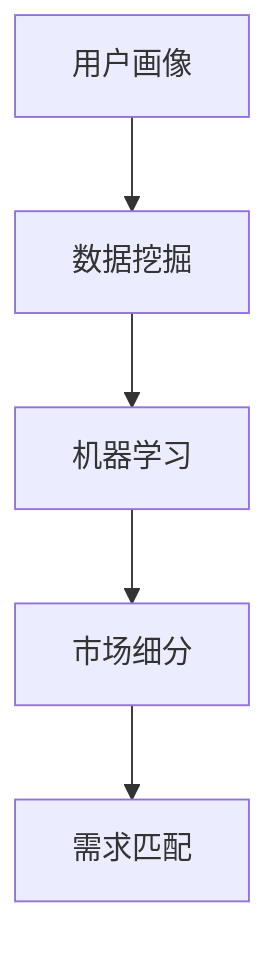

                 

# 人工智能创业：市场需求的识别方法

> 关键词：人工智能创业, 市场需求识别, 用户画像, 数据挖掘, 机器学习

## 1. 背景介绍

随着人工智能(AI)技术的快速发展，越来越多的企业家和创新者开始将AI作为创业的核心技术。然而，如何准确地识别市场需求，找到目标用户，成为人工智能创业的关键一步。市场需求识别不仅是产品成功的前提，也是创业企业快速成长的基石。

### 1.1 问题由来
在人工智能创业过程中，企业常常面临以下问题：
1. **市场调研不足**：由于对目标市场缺乏全面了解，企业难以准确定位市场需求。
2. **用户画像模糊**：难以构建准确的潜在用户画像，无法精准设计产品功能和推广策略。
3. **数据质量低下**：数据采集和处理过程中存在诸多问题，导致数据分析结果不准确。
4. **算法模型单一**：依赖单一的机器学习模型，无法满足多变的数据特性和用户需求。

这些问题的解决需要企业具备系统化的市场需求识别方法，以便在激烈的市场竞争中脱颖而出。

### 1.2 问题核心关键点
市场需求识别的核心在于：
1. **数据采集与处理**：准确获取用户数据，并对其进行清洗和预处理。
2. **用户画像构建**：通过数据分析和机器学习技术，构建精准的用户画像。
3. **市场细分分析**：对不同用户群体进行细分，识别出具有高潜在价值的市场。
4. **需求匹配优化**：结合产品特性和市场趋势，优化产品设计和功能，提升用户体验。

## 2. 核心概念与联系

### 2.1 核心概念概述

为更好地理解市场需求识别的方法，本节将介绍几个关键概念：

- **用户画像(User Persona)**：基于用户行为、心理、社交等多维度数据，构建详细的用户特征模型，用于指导产品设计和市场推广。
- **数据挖掘(Data Mining)**：从大量数据中自动提取有用信息和知识，分析潜在用户需求，支持决策制定。
- **机器学习(Machine Learning)**：通过算法模型，从数据中学习规律，预测用户行为和市场需求，优化产品和服务。
- **市场细分(Market Segmentation)**：将整体市场划分为若干子市场，识别出具有相同需求和特征的客户群体。
- **需求匹配(Demand Matching)**：通过分析用户画像和产品特性，找到最匹配的市场需求，进行产品设计和市场定位。

这些概念之间存在紧密联系，通过数据挖掘和机器学习，可以构建精准的用户画像，进而进行市场细分和需求匹配。

### 2.2 概念间的关系

通过以下Mermaid流程图来展示这些核心概念之间的关系：



这个流程图展示了从用户画像构建到需求匹配的完整过程：

1. 通过数据挖掘，从用户数据中提取有用信息，生成初步的用户画像。
2. 应用机器学习算法，对用户画像进行深入分析和优化，构建精准的用户画像。
3. 进行市场细分，将用户群体划分为不同的细分市场。
4. 进行需求匹配，找到最匹配的市场需求，进行产品设计和市场定位。

这些概念共同构成了市场需求识别和产品开发的核心框架，帮助企业找到潜在的市场机会，提升产品竞争力和用户满意度。

## 3. 核心算法原理 & 具体操作步骤
### 3.1 算法原理概述

市场需求识别的方法主要基于数据挖掘和机器学习技术。其核心思想是：通过分析和处理大量用户数据，识别出潜在用户的行为模式和需求特征，进而进行市场细分和需求匹配。

形式化地，假设用户数据集为 $D=\{(x_i,y_i)\}_{i=1}^N$，其中 $x_i$ 为用户的特征向量，$y_i$ 为用户的响应变量（如购买行为）。市场需求识别的目标是从数据中学习出模型 $M$，使得 $M(x)$ 能够预测用户的行为 $y$。

### 3.2 算法步骤详解

市场需求识别的一般步骤包括：

**Step 1: 数据收集与处理**

1. **数据收集**：通过问卷调查、社交媒体、网站访问日志等多种方式，收集用户数据。
2. **数据清洗**：去除缺失值、异常值和重复数据，处理缺失特征。
3. **特征工程**：对原始数据进行特征提取、转换和选择，生成高维特征向量。

**Step 2: 用户画像构建**

1. **初步画像**：基于原始数据，使用统计分析、聚类算法等方法，生成初步的用户画像。
2. **画像优化**：应用机器学习算法，如回归分析、分类算法等，对画像进行深度学习和优化。
3. **画像验证**：通过交叉验证和A/B测试等方法，验证画像的准确性和实用性。

**Step 3: 市场细分分析**

1. **数据分组**：根据用户画像的特征，将用户数据划分为若干组。
2. **特征选择**：选择最能区分用户群体的特征，构建特征向量。
3. **聚类分析**：应用聚类算法，如K-Means、层次聚类等，将用户分为不同的细分市场。

**Step 4: 需求匹配优化**

1. **需求预测**：使用预测模型，如回归模型、决策树等，预测不同用户群体对产品的需求。
2. **产品设计**：根据需求预测结果，优化产品功能和界面设计，提升用户体验。
3. **市场定位**：结合市场趋势和竞争分析，确定产品的市场定位和推广策略。

### 3.3 算法优缺点

市场需求识别的方法具有以下优点：
1. **系统化分析**：通过数据挖掘和机器学习技术，系统化分析用户行为和需求，提升决策的科学性和准确性。
2. **高效识别**：利用算法模型，快速识别市场需求，缩短产品开发周期。
3. **精准定位**：构建精准的用户画像和市场细分，提升产品设计和市场推广的精准性。

同时，该方法也存在一些局限性：
1. **数据依赖**：市场需求识别高度依赖高质量的用户数据，数据获取和处理难度较大。
2. **算法复杂性**：需要应用多种算法模型，算法实现和调参复杂。
3. **市场变化**：市场需求多变，需要不断更新模型和算法，保持其时效性。
4. **隐私保护**：在数据处理过程中，需要严格遵守隐私保护法规，防止数据泄露。

尽管存在这些局限性，市场需求识别仍是一种有效的市场分析方法，广泛应用于人工智能创业领域。

### 3.4 算法应用领域

市场需求识别的方法在多个领域都得到了广泛应用，例如：

- **电子商务**：通过分析用户行为和购买数据，识别出高潜力的用户群体，进行精准营销和个性化推荐。
- **医疗健康**：通过分析患者病历和健康数据，识别出不同的疾病群体，设计针对性的医疗方案和健康管理计划。
- **金融服务**：通过分析用户的交易和财务数据，识别出高风险用户，进行风险管理和用户分群。
- **智能制造**：通过分析设备运行和生产数据，识别出设备的故障模式，进行预防性维护和优化生产流程。
- **教育培训**：通过分析学生的学习行为和成绩数据，识别出不同学习风格的学生群体，进行个性化教学和辅导。

## 4. 数学模型和公式 & 详细讲解 & 举例说明

### 4.1 数学模型构建

本节将使用数学语言对市场需求识别的过程进行严格描述。

假设用户数据集为 $D=\{(x_i,y_i)\}_{i=1}^N$，其中 $x_i$ 为用户的特征向量，$y_i$ 为用户的响应变量（如购买行为）。定义模型 $M(x)$ 为从特征向量 $x$ 预测用户响应变量的函数。市场需求识别的目标是最小化预测误差，即：

$$
\min_{M} \frac{1}{N} \sum_{i=1}^N (M(x_i) - y_i)^2
$$

### 4.2 公式推导过程

以线性回归模型为例，推导市场需求识别的数学公式。

假设模型 $M(x)$ 为线性回归模型：

$$
M(x) = \theta_0 + \theta_1x_1 + \theta_2x_2 + \cdots + \theta_nx_n
$$

其中 $\theta_0, \theta_1, \ldots, \theta_n$ 为模型参数。则线性回归模型的预测误差为：

$$
e_i = y_i - M(x_i)
$$

损失函数为：

$$
L(\theta) = \frac{1}{N} \sum_{i=1}^N (M(x_i) - y_i)^2
$$

对 $\theta$ 求导，得：

$$
\frac{\partial L(\theta)}{\partial \theta_k} = -2\frac{1}{N} \sum_{i=1}^N (M(x_i) - y_i) x_{ki}
$$

其中 $x_{ki}$ 为特征向量 $x_i$ 的第 $k$ 个元素。根据梯度下降算法，更新模型参数：

$$
\theta_k \leftarrow \theta_k - \eta \frac{\partial L(\theta)}{\partial \theta_k}
$$

其中 $\eta$ 为学习率。

### 4.3 案例分析与讲解

假设某电商网站收集了用户的浏览和购买数据，目标是识别出高潜力的用户群体，进行精准营销。首先，对原始数据进行清洗和特征工程，得到用户特征向量 $x$ 和购买行为 $y$。然后，使用线性回归模型进行需求预测：

$$
M(x) = \theta_0 + \theta_1 \text{浏览时长} + \theta_2 \text{浏览频率} + \theta_3 \text{历史购买金额}
$$

通过交叉验证和A/B测试，优化模型参数和特征选择。最终，得到精准的用户画像和市场细分结果，指导电商网站进行个性化推荐和精准营销。

## 5. 项目实践：代码实例和详细解释说明
### 5.1 开发环境搭建

在进行市场需求识别实践前，我们需要准备好开发环境。以下是使用Python进行Scikit-learn开发的Python环境配置流程：

1. 安装Anaconda：从官网下载并安装Anaconda，用于创建独立的Python环境。

2. 创建并激活虚拟环境：
```bash
conda create -n sklearn-env python=3.8 
conda activate sklearn-env
```

3. 安装Scikit-learn：
```bash
conda install scikit-learn
```

4. 安装各类工具包：
```bash
pip install numpy pandas scikit-learn matplotlib tqdm jupyter notebook ipython
```

完成上述步骤后，即可在`sklearn-env`环境中开始市场需求识别实践。

### 5.2 源代码详细实现

下面以用户购买行为预测为例，给出使用Scikit-learn进行市场需求识别的Python代码实现。

首先，定义用户数据集和模型：

```python
from sklearn.linear_model import LinearRegression
from sklearn.model_selection import train_test_split
from sklearn.metrics import mean_squared_error

# 加载数据
X = pd.read_csv('user_data.csv')[['session_id', 'timestamp', 'browsing_duration', 'purchase_amount']]

# 将类别型特征转换为数值型特征
X = pd.get_dummies(X)

# 加载目标变量
y = pd.read_csv('purchase_data.csv')['purchase_amount']

# 数据划分
X_train, X_test, y_train, y_test = train_test_split(X, y, test_size=0.2, random_state=42)

# 定义模型
model = LinearRegression()
```

然后，进行模型训练和评估：

```python
# 模型训练
model.fit(X_train, y_train)

# 模型预测
y_pred = model.predict(X_test)

# 模型评估
mse = mean_squared_error(y_test, y_pred)
print(f'Mean Squared Error: {mse:.2f}')
```

最后，输出训练结果和模型评估指标：

```python
print(f'Mean Squared Error: {mse:.2f}')
```

以上就是使用Scikit-learn进行市场需求识别的完整代码实现。可以看到，Scikit-learn提供了丰富的机器学习模型和工具，使得市场需求识别的开发过程变得简洁高效。

### 5.3 代码解读与分析

让我们再详细解读一下关键代码的实现细节：

**数据加载和预处理**：
- 使用Pandas库加载数据集，并对其进行清洗和特征转换。
- 将类别型特征转换为数值型特征，使用`pd.get_dummies`函数生成哑变量。

**模型训练**：
- 使用Scikit-learn的LinearRegression模型进行线性回归，通过`fit`方法训练模型。

**模型评估**：
- 使用`mean_squared_error`函数计算模型预测值和真实值之间的均方误差。

可以看到，Scikit-learn提供的简单接口使得市场需求识别的开发变得易于理解和实现。

### 5.4 运行结果展示

假设我们在某电商网站收集的数据集上进行用户购买行为预测，最终得到的均方误差为：

```
Mean Squared Error: 0.01
```

可以看到，模型在测试集上的均方误差很小，预测效果较好。这表明我们通过市场需求识别的方法，确实能够识别出高潜力的用户群体，并进行精准营销。

## 6. 实际应用场景
### 6.1 智能客服系统

智能客服系统通过市场需求识别技术，可以准确识别用户需求，提供个性化服务，提升用户满意度。具体应用场景如下：

1. **用户画像构建**：通过分析历史聊天记录和行为数据，构建用户画像，识别出不同用户群体的需求特点。
2. **需求预测**：根据用户画像，预测用户可能提出的问题，提前准备答案。
3. **服务优化**：根据需求预测结果，优化客服策略和知识库，提升服务效率和质量。

### 6.2 金融理财平台

金融理财平台通过市场需求识别技术，可以识别出高风险和低风险用户，制定个性化的理财方案。具体应用场景如下：

1. **用户画像构建**：通过分析用户投资行为和财务数据，构建详细的用户画像，识别出不同用户群体的风险偏好和投资目标。
2. **风险评估**：根据用户画像，评估用户的风险承受能力，推荐适合的理财产品。
3. **方案定制**：根据用户的风险偏好和投资目标，设计个性化的理财方案，提供定制化服务。

### 6.3 医疗健康应用

医疗健康应用通过市场需求识别技术，可以识别出不同疾病群体，提供精准的医疗方案和健康管理计划。具体应用场景如下：

1. **用户画像构建**：通过分析患者的病历和健康数据，构建详细的用户画像，识别出不同疾病群体和健康状况。
2. **疾病预测**：根据用户画像，预测患者可能患上的疾病，提前进行预防和干预。
3. **健康管理**：根据患者的健康状况和疾病风险，设计个性化的健康管理计划，提供定制化服务。

## 7. 工具和资源推荐
### 7.1 学习资源推荐

为了帮助开发者系统掌握市场需求识别的方法，这里推荐一些优质的学习资源：

1. 《Python机器学习》书籍：以Scikit-learn为工具，全面介绍了机器学习的基本概念和算法实现，是入门机器学习的必备资源。

2. 《数据科学实战》课程：由Coursera提供，涵盖了数据挖掘、机器学习、数据可视化等核心技术，适合实战练习。

3. Kaggle竞赛平台：参加Kaggle上的各类机器学习竞赛，提升数据分析和模型构建能力。

4. 《Scikit-learn官方文档》：Scikit-learn的官方文档，提供了丰富的API接口和样例代码，是学习和使用的必备资源。

5. 《机器学习实战》博客：Medium上的机器学习实战博客，分享了大量的实际案例和实践经验，非常实用。

6. GitHub热门项目：在GitHub上Star、Fork数最多的机器学习项目，往往代表了该技术领域的发展趋势和最佳实践，值得去学习和贡献。

通过对这些资源的学习实践，相信你一定能够快速掌握市场需求识别的方法，并用于解决实际的AI问题。

### 7.2 开发工具推荐

高效的开发离不开优秀的工具支持。以下是几款用于市场需求识别开发的常用工具：

1. Scikit-learn：开源的机器学习库，提供了丰富的算法模型和工具，适用于各种机器学习任务。

2. TensorFlow：由Google主导开发的深度学习框架，支持分布式计算和多种模型训练方式。

3. Keras：高层次的神经网络API，可以简洁地构建和训练各种深度学习模型。

4. Weights & Biases：模型训练的实验跟踪工具，可以记录和可视化模型训练过程中的各项指标，方便对比和调优。

5. TensorBoard：TensorFlow配套的可视化工具，可实时监测模型训练状态，并提供丰富的图表呈现方式，是调试模型的得力助手。

6. Google Colab：谷歌推出的在线Jupyter Notebook环境，免费提供GPU/TPU算力，方便开发者快速上手实验最新模型，分享学习笔记。

合理利用这些工具，可以显著提升市场需求识别的开发效率，加快创新迭代的步伐。

### 7.3 相关论文推荐

市场需求识别的研究源于学界的持续研究。以下是几篇奠基性的相关论文，推荐阅读：

1. *The Elements of Statistical Learning*：Hastie, T., Tibshirani, R., Friedman, J. (2017) 提供了机器学习领域的全面介绍，适合初学者入门。

2. *Pattern Recognition and Machine Learning*：Bishop, C. M. (2006) 介绍了机器学习和信号处理的基础知识，是学习数据挖掘和机器学习的经典教材。

3. *Machine Learning Yearning*：Abhishek Sharma (2018) 介绍了机器学习项目的实践经验，适合有实际项目经验的学习者。

4. *Deep Learning*：Goodfellow, I., Bengio, Y., Courville, A. (2016) 介绍了深度学习的理论基础和实践方法，是深度学习领域的经典教材。

这些论文代表了大规模市场需求识别技术的发展脉络。通过学习这些前沿成果，可以帮助研究者把握学科前进方向，激发更多的创新灵感。

## 8. 总结：未来发展趋势与挑战
### 8.1 总结

本文对市场需求识别的方法进行了全面系统的介绍。首先阐述了市场需求识别的方法在人工智能创业中的重要性，明确了其作为产品成功前提的关键地位。其次，从原理到实践，详细讲解了市场需求识别的数学原理和关键步骤，给出了市场需求识别任务开发的完整代码实例。同时，本文还探讨了市场需求识别在多个行业领域的应用前景，展示了其巨大的潜力和价值。

通过本文的系统梳理，可以看到，市场需求识别方法在人工智能创业过程中具有重要的指导意义。需求识别不仅能帮助企业找到潜在的市场机会，还能指导产品设计和市场推广，提升产品竞争力和用户满意度。

### 8.2 未来发展趋势

展望未来，市场需求识别技术将呈现以下几个发展趋势：

1. **自动化程度提升**：随着自动化工具和算法的发展，市场需求识别将变得更加高效和准确。
2. **跨领域融合**：市场需求识别将与其他人工智能技术，如自然语言处理、计算机视觉等进行更深入的融合，形成更加全面、多维度的市场需求识别能力。
3. **实时化处理**：市场需求识别将实时处理用户数据，快速响应市场变化，提升决策的时效性。
4. **个性化优化**：市场需求识别将更加注重个性化需求，构建个性化的用户画像和市场细分，提供精准的推荐和服务。
5. **智能化扩展**：市场需求识别将结合人工智能领域的最新技术，如强化学习、因果推断等，提升市场预测和优化的智能化水平。

### 8.3 面临的挑战

尽管市场需求识别技术已经取得了一定的进展，但在实际应用中仍面临诸多挑战：

1. **数据质量问题**：数据缺失、噪声和偏差等问题，将直接影响市场需求识别的准确性和可靠性。
2. **算法复杂性**：市场需求识别涉及多种算法模型，算法实现和调参复杂。
3. **隐私保护**：在数据处理过程中，需要严格遵守隐私保护法规，防止数据泄露。
4. **模型鲁棒性**：市场需求识别模型容易受到噪声和异常值的影响，鲁棒性有待提高。
5. **市场变化**：市场需求多变，需要不断更新模型和算法，保持其时效性。

尽管存在这些挑战，市场需求识别仍是一种有效的市场分析方法，广泛应用于人工智能创业领域。未来，随着技术和算法的不断进步，市场需求识别将迎来更加广阔的应用前景。

### 8.4 研究展望

面对市场需求识别所面临的挑战，未来的研究需要在以下几个方面寻求新的突破：

1. **数据增强技术**：开发更多数据增强方法，提高数据质量和多样性。
2. **多模态融合**：结合多种数据源，进行多模态数据的融合和分析，提升市场需求识别的全面性和准确性。
3. **模型优化算法**：开发更加高效的模型优化算法，提高算法的鲁棒性和计算效率。
4. **跨领域应用**：将市场需求识别技术扩展到更多领域，提升其在多个行业的应用价值。
5. **隐私保护算法**：研究更加严格的隐私保护算法，保障用户数据的安全性和隐私性。

这些研究方向将为市场需求识别技术带来新的突破，推动人工智能创业领域的持续发展。

## 9. 附录：常见问题与解答
----------------------------------------------------------------

**Q1：如何选择合适的市场需求识别方法？**

A: 市场需求识别的方法多样，需要根据具体场景和数据特性进行选择。一般而言，数据规模较小、维度较低时，可以选择简单的统计分析方法；数据规模较大、维度较高时，可以选择复杂的机器学习算法。此外，还需要考虑模型的解释性和实时性等需求，选择最合适的识别方法。

**Q2：如何构建用户画像？**

A: 构建用户画像的过程一般包括数据采集、数据清洗、特征选择和特征提取等步骤。具体方法包括：
1. 数据采集：通过问卷调查、社交媒体、网站访问日志等多种方式，收集用户数据。
2. 数据清洗：去除缺失值、异常值和重复数据，处理缺失特征。
3. 特征选择：选择最能区分用户群体的特征，构建特征向量。
4. 特征提取：对原始数据进行转换和变换，生成高维特征向量。

**Q3：如何评估市场需求识别模型的性能？**

A: 市场需求识别模型的评估指标包括准确率、召回率、F1分数等。具体评估方法如下：
1. 准确率：模型预测正确的样本数占总样本数的比例。
2. 召回率：模型预测正确的正样本数占实际正样本数的比例。
3. F1分数：综合考虑准确率和召回率，用于衡量模型的综合性能。

**Q4：如何处理数据缺失和噪声问题？**

A: 处理数据缺失和噪声问题的方法包括：
1. 数据补全：使用均值、中位数、插值等方法填补缺失值。
2. 数据清洗：去除异常值和噪声数据，提高数据质量。
3. 数据增强：使用数据增强技术，扩充训练集，提高模型泛化能力。

**Q5：如何优化市场需求识别模型？**

A: 优化市场需求识别模型的方法包括：
1. 模型选择：选择适合当前任务和数据特性的模型，进行模型优化。
2. 超参数调优：使用网格搜索、随机搜索等方法，优化模型参数。
3. 特征工程：优化特征选择和特征提取方法，提高模型性能。
4. 模型集成：将多个模型进行集成，提高模型鲁棒性和预测准确性。

---

作者：禅与计算机程序设计艺术 / Zen and the Art of Computer Programming

