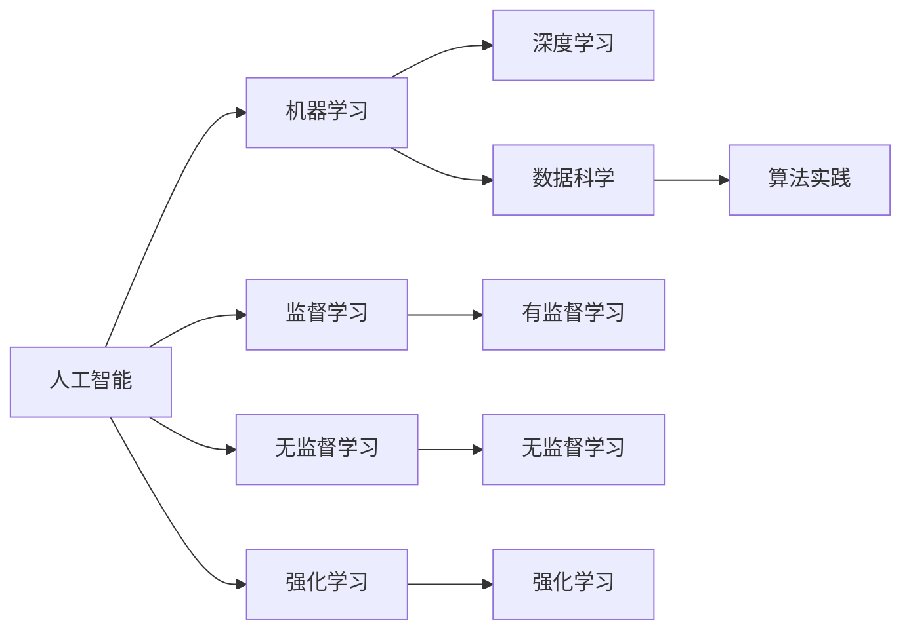

                 

# 人工智能导论原理与代码实战案例讲解

> 关键词：人工智能,机器学习,深度学习,数据科学,算法实践

## 1. 背景介绍

### 1.1 问题由来
人工智能(AI)是当前最炙手可热的技术之一，从自然语言处理(NLP)、计算机视觉(CV)到机器人学习(RL)，AI的应用场景正在不断扩大。然而，由于AI技术的复杂性，很多人对AI的原理和实践感到困惑，甚至产生误解。为帮助广大AI爱好者更好地理解AI的核心概念和实现技术，本文将对人工智能导论进行系统介绍，并配以案例讲解，助你快速上手AI开发。

### 1.2 问题核心关键点
AI的核心是让机器具备智能，从而能自动完成一些人类智能的行为。这一过程主要通过以下几个步骤实现：

1. **数据收集与预处理**：收集足够的数据，对数据进行清洗、标注，形成可用于训练的样本集。
2. **模型训练**：使用训练集数据对模型进行有监督或无监督的训练，调整模型参数。
3. **模型评估**：使用测试集数据评估模型性能，确保模型泛化能力强。
4. **模型应用**：将训练好的模型应用于实际问题，完成推理预测。

### 1.3 问题研究意义
深入了解AI导论和实战案例，不仅有助于掌握AI核心技术，还能增强解决问题的能力。通过本文的学习，你将获得以下收益：
- 理解AI的基本原理和核心算法。
- 学会使用常见的AI框架和工具。
- 掌握AI项目从数据处理到模型评估的全流程。
- 提升解决实际问题的能力。

## 2. 核心概念与联系

### 2.1 核心概念概述
AI涉及众多概念，以下是其中几个核心概念：

- **人工智能**：通过算法使机器具备类似人类的智能行为。
- **机器学习**：通过数据驱动的算法，让机器自动学习规律和模式。
- **深度学习**：一种特殊的机器学习技术，使用多层神经网络进行复杂非线性映射。
- **数据科学**：涵盖数据获取、清洗、分析和建模的全流程，为AI提供数据支撑。
- **算法实践**：将理论算法应用于具体问题，解决实际问题。

### 2.2 概念间的关系

这些核心概念通过以下Mermaid流程图来展示它们之间的关系：



这个流程图展示了AI技术的几个核心方向及其相互关系：

1. 人工智能是总体目标，包括监督学习、无监督学习和强化学习等。
2. 机器学习是核心方法，包含深度学习作为其中一种特殊形式。
3. 数据科学提供了数据支撑，算法实践是将这些方法应用于实际问题。

## 3. 核心算法原理 & 具体操作步骤

### 3.1 算法原理概述
AI的核心算法包括监督学习、无监督学习和强化学习，每种算法都有其特点和应用场景。

- **监督学习**：利用标注数据训练模型，预测新数据的标签。常用算法有线性回归、逻辑回归、决策树、支持向量机等。
- **无监督学习**：不依赖标注数据，通过算法发现数据的隐含结构。常用算法有聚类、降维、关联规则挖掘等。
- **强化学习**：通过试错的方式学习最佳策略，常用算法有Q学习、策略梯度等。

### 3.2 算法步骤详解
以监督学习为例，其基本步骤包括：

1. **数据准备**：收集数据，进行预处理和特征工程，生成训练集和测试集。
2. **模型选择**：选择合适的模型（如线性回归、逻辑回归等）和优化器（如梯度下降、Adam等）。
3. **模型训练**：使用训练集数据对模型进行训练，调整模型参数。
4. **模型评估**：使用测试集数据评估模型性能，如准确率、精确率、召回率等指标。
5. **模型应用**：将训练好的模型应用于实际问题，完成推理预测。

### 3.3 算法优缺点
- **监督学习**：优点是数据标注成本较低，适用于回归和分类问题；缺点是依赖标注数据，容易过拟合。
- **无监督学习**：优点是无需标注数据，适合探索性分析；缺点是算法复杂度高，效果不如监督学习。
- **强化学习**：优点是能解决复杂的动态决策问题；缺点是试错成本高，数据难以收集。

### 3.4 算法应用领域
监督学习广泛应用于图像分类、文本分类、推荐系统等领域；无监督学习用于用户行为分析、基因数据分析等；强化学习用于游戏AI、机器人控制等。

## 4. 数学模型和公式 & 详细讲解  
### 4.1 数学模型构建

以线性回归为例，其数学模型为：

$$
y = \theta_0 + \theta_1 x_1 + \theta_2 x_2 + \ldots + \theta_n x_n
$$

其中 $y$ 为输出变量，$\theta_0, \theta_1, \ldots, \theta_n$ 为模型参数，$x_1, x_2, \ldots, x_n$ 为输入变量。

### 4.2 公式推导过程

以梯度下降算法为例，其核心公式为：

$$
\theta_k \leftarrow \theta_k - \alpha \frac{\partial L}{\partial \theta_k}
$$

其中 $\alpha$ 为学习率，$L$ 为损失函数，$\frac{\partial L}{\partial \theta_k}$ 为损失函数对参数 $\theta_k$ 的偏导数。

### 4.3 案例分析与讲解

以MNIST手写数字识别为例，其数据集包含60000个训练样本和10000个测试样本，每个样本为28x28像素的灰度图像。

```python
from sklearn.datasets import load_digits
from sklearn.model_selection import train_test_split
from sklearn.linear_model import LogisticRegression

# 加载数据集
digits = load_digits()
X = digits.data
y = digits.target

# 划分训练集和测试集
X_train, X_test, y_train, y_test = train_test_split(X, y, test_size=0.2, random_state=42)

# 定义模型
model = LogisticRegression(solver='lbfgs', max_iter=1000)

# 训练模型
model.fit(X_train, y_train)

# 评估模型
score = model.score(X_test, y_test)
print(f"Accuracy: {score:.2f}")
```

## 5. 项目实践：代码实例和详细解释说明

### 5.1 开发环境搭建

在使用Python进行AI开发时，首先需要安装Python解释器和相关的AI框架。以TensorFlow为例，其安装命令如下：

```bash
pip install tensorflow
```

### 5.2 源代码详细实现

以深度学习框架TensorFlow为例，其代码实现如下：

```python
import tensorflow as tf
from tensorflow import keras

# 加载数据集
(x_train, y_train), (x_test, y_test) = keras.datasets.mnist.load_data()

# 数据预处理
x_train = x_train / 255.0
x_test = x_test / 255.0

# 构建模型
model = keras.Sequential([
    keras.layers.Flatten(input_shape=(28, 28)),
    keras.layers.Dense(128, activation='relu'),
    keras.layers.Dense(10, activation='softmax')
])

# 编译模型
model.compile(optimizer='adam', loss='sparse_categorical_crossentropy', metrics=['accuracy'])

# 训练模型
model.fit(x_train, y_train, epochs=5, batch_size=32)

# 评估模型
test_loss, test_acc = model.evaluate(x_test, y_test)
print(f"Test accuracy: {test_acc}")
```

### 5.3 代码解读与分析

以上代码展示了使用TensorFlow进行MNIST数据集的图像识别过程：

1. 数据加载：使用Keras内置函数加载MNIST数据集，将其划分为训练集和测试集。
2. 数据预处理：将像素值归一化到[0, 1]区间。
3. 模型构建：使用Sequential模型，包含两个Dense层，分别进行特征提取和分类。
4. 模型编译：使用Adam优化器，设置损失函数和评估指标。
5. 模型训练：使用训练集数据对模型进行训练，设置迭代次数和批次大小。
6. 模型评估：使用测试集数据评估模型性能。

## 6. 实际应用场景

### 6.1 图像识别

图像识别是AI应用中最常见和成熟的技术之一。深度学习模型如卷积神经网络(CNN)在图像识别任务上表现优异，广泛应用于医学影像分析、视频监控、人脸识别等领域。

### 6.2 自然语言处理

自然语言处理(NLP)是AI的重要分支，通过机器学习技术使计算机具备自然语言理解能力。如聊天机器人、文本分类、情感分析等任务，均能通过深度学习模型实现。

### 6.3 机器人学习

机器人学习通过AI技术使机器人具备自主决策和行动的能力。通过强化学习算法，机器人可以在复杂环境中不断试错，逐步优化行动策略，实现自动导航、物品抓取等任务。

### 6.4 未来应用展望

未来AI技术将更加智能化和普适化，AI应用将覆盖更多领域。从智慧医疗、智能家居到智能交通，AI将深入到人们生活的方方面面，带来革命性的变化。

## 7. 工具和资源推荐

### 7.1 学习资源推荐

1. 《Python机器学习》：由著名机器学习专家Sebastian Raschka撰写，适合初学者入门。
2. Coursera《机器学习》课程：由斯坦福大学Andrew Ng教授主讲，涵盖了机器学习基础和进阶内容。
3. DeepLearning.AI的Coursera课程：涵盖深度学习从理论到实践的各个方面。

### 7.2 开发工具推荐

1. Python：广泛使用的编程语言，生态丰富，适合AI开发。
2. TensorFlow：谷歌开源的深度学习框架，适合大规模工程应用。
3. PyTorch：Facebook开源的深度学习框架，灵活易用，适合研究。
4. Jupyter Notebook：交互式开发环境，便于代码调试和结果展示。

### 7.3 相关论文推荐

1. AlexNet: ImageNet Classification with Deep Convolutional Neural Networks：介绍深度卷积神经网络在图像分类中的应用。
2. Attention is All You Need：提出Transformer模型，开启NLP的预训练大模型时代。
3. GANs Trained by a Two-Stage Minimax-Game Approach: A Theoretical and Empirical Study：提出GANs模型，开创生成对抗网络的研究领域。

## 8. 总结：未来发展趋势与挑战

### 8.1 研究成果总结

AI导论和实战案例讲解为我们系统介绍了AI技术的核心概念和实现方法。通过本文的学习，读者不仅掌握了AI的核心算法和工具，还了解了AI项目开发的全流程。

### 8.2 未来发展趋势

未来AI技术将更加智能化和普适化，AI应用将覆盖更多领域。从智慧医疗、智能家居到智能交通，AI将深入到人们生活的方方面面，带来革命性的变化。

### 8.3 面临的挑战

尽管AI技术取得了巨大进展，但仍面临诸多挑战：

1. **数据隐私和安全**：AI应用需要大量的数据，如何保护用户隐私和安全是一个重要问题。
2. **模型可解释性**：AI模型往往是"黑盒"系统，难以解释其内部工作机制和决策逻辑。
3. **模型公平性**：AI模型可能带有偏见，导致不公平的决策结果。
4. **计算资源限制**：AI模型训练和推理需要大量的计算资源，如何提高效率是一个重要问题。

### 8.4 研究展望

未来AI研究需要从数据隐私、模型可解释性、公平性和计算资源等方面进行深入探索，推动AI技术的进步和应用。

## 9. 附录：常见问题与解答

**Q1: 如何选择合适的AI框架？**

A: 选择AI框架时，需要考虑以下几个因素：
1. **功能完备性**：框架是否支持你的主要任务。
2. **性能**：框架的性能是否满足你的需求。
3. **社区支持**：框架的社区活跃度是否高。
4. **易用性**：框架是否易学易用。

**Q2: 数据预处理有哪些步骤？**

A: 数据预处理包括：
1. **数据清洗**：去除噪声和异常值。
2. **数据标准化**：将数据缩放到[0, 1]或[-1, 1]区间。
3. **特征工程**：提取和构造对模型有用的特征。
4. **数据增强**：通过变换数据，增加样本数量，提高模型泛化能力。

**Q3: 深度学习与机器学习有何区别？**

A: 深度学习是机器学习的一种，通过多层神经网络进行复杂非线性映射。深度学习通常用于处理非结构化数据，如图像和文本；机器学习则包括监督学习、无监督学习和强化学习等，涵盖更广泛的数据类型和任务。

**Q4: 强化学习与监督学习有何区别？**

A: 强化学习通过试错的方式学习最佳策略，通常用于动态决策问题；监督学习利用标注数据训练模型，预测新数据的标签，通常用于静态数据处理。

---

作者：禅与计算机程序设计艺术 / Zen and the Art of Computer Programming

