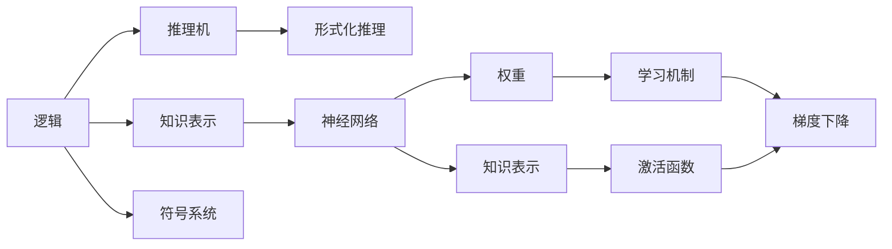

                 

# 人工智能的两大流派：逻辑与神经网络

## 1. 背景介绍

人工智能(AI)作为一门综合性学科，涵盖了逻辑、数学、计算机科学等多个领域的知识。在AI发展的早期，研究者们主要依赖数学逻辑和符号系统构建理论模型。随着计算机科学的发展，特别是深度学习的兴起，神经网络逐渐成为AI研究的主流范式。本文将介绍逻辑和神经网络这两大AI流派，分析它们的特点、联系和区别，并探讨它们在实际应用中的优势和局限性。

## 2. 核心概念与联系

### 2.1 核心概念概述

人工智能的两大流派分别是逻辑和神经网络。逻辑流派主要基于经典逻辑学和符号系统，采用形式化的推理规则进行知识表示和推理；神经网络流派则主要基于生物学神经元的结构，采用人工神经元模拟人脑的学习和推理机制。

- 逻辑：包括经典逻辑学、一阶逻辑、符号逻辑等，强调形式化推理和知识表示的准确性和完备性。
- 神经网络：包括感知机、多层感知机、卷积神经网络、循环神经网络等，强调数据驱动的端到端学习。

两者之间的联系主要体现在以下几个方面：

1. **知识表示**：逻辑流派通过符号和规则进行知识表示，神经网络则通过权重和激活函数进行知识表示。
2. **推理和推理机**：逻辑流派的推理机基于形式化规则进行逻辑推理；神经网络的推理则通过梯度下降等算法进行数值优化。
3. **学习机制**：逻辑流派的推理机大多是手工编写和设计的，需要大量经验；神经网络的训练则是通过大量数据和算法实现的。
4. **应用场景**：逻辑流派适用于需要精确推理和验证的应用，如自动定理证明、专家系统等；神经网络则适用于处理大量数据和复杂模式识别的应用，如图像识别、自然语言处理等。

### 2.2 概念间的关系

通过以下Mermaid流程图，我们可以更直观地展示逻辑和神经网络两者之间的联系和区别：



这个流程图展示了逻辑和神经网络两者之间的基本联系和区别：

1. 逻辑流派的知识表示主要通过符号和规则实现，而神经网络通过权重和激活函数进行。
2. 逻辑流派的推理机基于形式化规则，而神经网络的推理则通过数值优化算法实现。
3. 逻辑流派的符号系统设计复杂，需要大量经验；神经网络则通过数据和算法自动学习。
4. 逻辑流派的推理和验证过程精确，适用于需要高准确性的任务；神经网络则更适合处理大数据和复杂模式。

## 3. 核心算法原理 & 具体操作步骤
### 3.1 算法原理概述

逻辑流派的算法原理主要基于形式化逻辑，包括一阶逻辑、谓词逻辑、线性逻辑等。这些逻辑系统通过公理、推理规则和推理机进行知识表示和推理。

神经网络流派的算法原理主要基于反向传播算法，通过前向传播和反向传播进行参数优化，实现模型训练和预测。

### 3.2 算法步骤详解

#### 3.2.1 逻辑流派的算法步骤

1. **知识表示**：定义符号和规则，建立知识库。
2. **推理机**：根据知识库和推理规则进行推理，得出结论。
3. **验证和修正**：对推理结果进行验证，修正知识库和规则。

#### 3.2.2 神经网络流派的算法步骤

1. **数据准备**：收集和标注训练数据。
2. **模型构建**：选择神经网络结构，初始化参数。
3. **前向传播**：输入数据，经过网络计算，得到输出。
4. **损失计算**：计算预测输出与真实标签之间的误差。
5. **反向传播**：通过链式法则计算梯度，更新参数。
6. **重复迭代**：多次重复前向传播和反向传播，优化参数。

### 3.3 算法优缺点

#### 3.3.1 逻辑流派的优缺点

**优点**：
1. **精确性高**：逻辑流派的推理过程严格遵循形式化规则，结论具有高精确性和可靠性。
2. **可解释性好**：每个推理步骤都有明确的逻辑依据，易于理解和解释。
3. **知识表示结构化**：通过符号和规则进行知识表示，知识库结构化，便于管理和扩展。

**缺点**：
1. **知识表示复杂**：需要大量经验，编写和调试符号系统复杂。
2. **推理效率低**：推理过程复杂，难以处理大规模知识库。
3. **缺乏自适应能力**：需要手工设计规则和推理机，难以适应新知识和新场景。

#### 3.3.2 神经网络流派的优缺点

**优点**：
1. **自适应能力强**：神经网络能够通过数据和算法自适应学习新知识，适应新场景。
2. **处理大数据能力强**：神经网络可以处理大规模数据，适用于复杂模式识别。
3. **灵活性高**：神经网络结构灵活，可以根据任务需求进行调整。

**缺点**：
1. **黑盒性质**：神经网络的推理过程难以解释，难以理解内部工作机制。
2. **泛化能力有限**：神经网络容易过拟合，泛化能力有限，需要大量数据训练。
3. **依赖大量计算资源**：神经网络训练和推理需要大量计算资源，成本较高。

### 3.4 算法应用领域

逻辑流派主要应用于以下领域：

1. **知识工程**：自动定理证明、专家系统、知识库管理等。
2. **人工智能安全**：形式化验证、逻辑推理机设计等。
3. **自然语言处理**：逻辑推理、知识图谱构建等。

神经网络流派主要应用于以下领域：

1. **计算机视觉**：图像识别、目标检测、人脸识别等。
2. **自然语言处理**：机器翻译、文本分类、对话系统等。
3. **语音识别**：语音识别、语音合成等。

## 4. 数学模型和公式 & 详细讲解
### 4.1 数学模型构建

#### 4.1.1 逻辑流派的数学模型

在逻辑流派中，主要使用谓词逻辑和一阶逻辑进行知识表示和推理。一阶逻辑包括个体、谓词、函数、关系等基本概念，使用等式和不等式进行推理。

**一阶逻辑数学模型**：
1. **个体变量**：$x_1, x_2, \ldots, x_n$。
2. **谓词**：$p_1(x_1, x_2), p_2(x_1, x_2), \ldots, p_n(x_1, x_2)$。
3. **函数**：$f_1(x_1, x_2), f_2(x_1, x_2), \ldots, f_n(x_1, x_2)$。
4. **等式和不等式**：$x_1 = x_2, x_1 \neq x_2, p_1(x_1, x_2), p_2(x_1, x_2), \ldots$。

逻辑流派的推理规则包括：

1. **等值替换**：使用等式进行替换，例如$x_1 = x_2, p_1(x_1, x_2) \rightarrow p_1(x_2, x_2)$。
2. **等值递归**：使用等式进行递归，例如$p_1(x_1, x_2) \rightarrow p_2(x_1, f_1(x_1, x_2))$。
3. **泛化推理**：使用全称量词和存在量词进行推理，例如$\forall x_1, \exists x_2, p_1(x_1, x_2) \rightarrow \exists x_2, p_1(x_1, x_2)$。

#### 4.1.2 神经网络流派的数学模型

在神经网络流派中，主要使用反向传播算法进行模型训练和预测。神经网络包括输入层、隐藏层、输出层等结构，每个层包含多个神经元。

**神经网络数学模型**：
1. **输入层**：$x_1, x_2, \ldots, x_n$。
2. **隐藏层**：$h_1(x_1, x_2), h_2(x_1, x_2), \ldots, h_n(x_1, x_2)$。
3. **输出层**：$y_1, y_2, \ldots, y_n$。
4. **激活函数**：$f_1(x_1, x_2), f_2(x_1, x_2), \ldots, f_n(x_1, x_2)$。
5. **权重矩阵**：$W_1, W_2, \ldots, W_n$。

神经网络的推理过程包括：

1. **前向传播**：输入数据，通过权重矩阵和激活函数计算，得到输出。
2. **损失函数**：计算预测输出与真实标签之间的误差，常用的损失函数包括交叉熵损失、均方误差损失等。
3. **反向传播**：通过链式法则计算梯度，更新权重矩阵和激活函数。
4. **重复迭代**：多次重复前向传播和反向传播，优化权重矩阵和激活函数。

### 4.2 公式推导过程

#### 4.2.1 逻辑流派的公式推导

以谓词逻辑为例，推导一个简单的推理规则。设谓词$p(x)$表示$x$是一个正方形，谓词$r(x)$表示$x$是一个矩形，则推理规则为：

1. **前提1**：所有正方形都是矩形。
2. **前提2**：所有正方形都有相等的边长。
3. **结论**：所有正方形都是矩形且边长相等。

逻辑流派的推理过程如下：

1. $\forall x_1, (p(x_1) \rightarrow r(x_1))$
2. $\forall x_1, p(x_1) \rightarrow r(x_1)$
3. $\forall x_1, r(x_1) \rightarrow \forall x_2, r(x_2)$
4. $\forall x_1, p(x_1) \rightarrow \forall x_2, r(x_2)$
5. $\forall x_1, p(x_1) \rightarrow \forall x_2, (r(x_2) \rightarrow \forall x_3, r(x_3))$
6. $\forall x_1, p(x_1) \rightarrow \forall x_2, \forall x_3, r(x_2) \rightarrow r(x_3)$
7. $\forall x_1, p(x_1) \rightarrow \forall x_2, \forall x_3, (r(x_2) \rightarrow p(x_3))$
8. $\forall x_1, p(x_1) \rightarrow \forall x_2, \forall x_3, p(x_2) \rightarrow p(x_3)$
9. $\forall x_1, p(x_1) \rightarrow p(x_2) \rightarrow p(x_3)$

#### 4.2.2 神经网络流派的公式推导

以多层感知机为例，推导一个简单的神经网络模型。设输入向量为$x = [x_1, x_2, \ldots, x_n]$，输出向量为$y = [y_1, y_2, \ldots, y_n]$，隐藏层向量为$h = [h_1, h_2, \ldots, h_n]$。神经网络模型包括一个输入层、两个隐藏层和一个输出层，激活函数为Sigmoid函数。

神经网络的前向传播过程如下：

1. **输入层**：$x_1 = x_1, x_2 = x_2, \ldots, x_n = x_n$
2. **隐藏层1**：$h_1 = f_1(x_1, x_2), h_2 = f_2(x_1, x_2), \ldots, h_n = f_n(x_1, x_2)$
3. **隐藏层2**：$h_1' = f_1(h_1, h_2), h_2' = f_2(h_1, h_2), \ldots, h_n' = f_n(h_1, h_2)$
4. **输出层**：$y_1 = f_1(h_1', h_2'), y_2 = f_2(h_1', h_2'), \ldots, y_n = f_n(h_1', h_2')$

神经网络的反向传播过程如下：

1. **损失函数**：$L = \frac{1}{2}(y_1 - y_1')^2 + \frac{1}{2}(y_2 - y_2')^2 + \ldots + \frac{1}{2}(y_n - y_n')^2$
2. **梯度计算**：$\frac{\partial L}{\partial h_n'}, \frac{\partial L}{\partial h_{n-1}'}, \ldots, \frac{\partial L}{\partial h_1'}, \frac{\partial L}{\partial h_n}, \ldots, \frac{\partial L}{\partial h_1}$
3. **权重更新**：$W_1 = W_1 - \eta \frac{\partial L}{\partial W_1}, W_2 = W_2 - \eta \frac{\partial L}{\partial W_2}, \ldots, W_n = W_n - \eta \frac{\partial L}{\partial W_n}$
4. **重复迭代**：多次重复前向传播和反向传播，优化权重矩阵和激活函数。

### 4.3 案例分析与讲解

#### 4.3.1 逻辑流派的案例

以自动定理证明为例，介绍逻辑流派的实现过程。自动定理证明系统通过形式化逻辑推理，自动证明数学定理。以下是一个简单的定理证明过程：

1. **命题1**：所有正方形都是矩形。
2. **命题2**：所有正方形都有相等的边长。
3. **结论**：所有正方形都是矩形且边长相等。

逻辑流派的实现步骤如下：

1. **知识库建立**：将命题1和命题2编码为形式化逻辑表达式，存储在知识库中。
2. **推理机设计**：设计推理机，根据知识库中的规则进行推理，得出结论。
3. **验证和修正**：对推理结果进行验证，修正知识库和规则，确保推理过程的准确性。

#### 4.3.2 神经网络流派的案例

以图像识别为例，介绍神经网络流派的实现过程。图像识别系统通过神经网络模型，自动识别和分类图像。以下是一个简单的图像识别过程：

1. **数据准备**：收集和标注大量图像数据，存储在数据集中。
2. **模型构建**：选择神经网络结构，初始化参数。
3. **前向传播**：输入图像数据，经过网络计算，得到输出。
4. **损失计算**：计算预测输出与真实标签之间的误差，常用的损失函数包括交叉熵损失、均方误差损失等。
5. **反向传播**：通过链式法则计算梯度，更新权重矩阵和激活函数。
6. **重复迭代**：多次重复前向传播和反向传播，优化权重矩阵和激活函数。

## 5. 项目实践：代码实例和详细解释说明
### 5.1 开发环境搭建

在进行逻辑和神经网络的实践前，我们需要准备好开发环境。以下是使用Python进行PyTorch和Sympy开发的环境配置流程：

1. 安装Anaconda：从官网下载并安装Anaconda，用于创建独立的Python环境。

2. 创建并激活虚拟环境：
```bash
conda create -n pytorch-env python=3.8 
conda activate pytorch-env
```

3. 安装PyTorch和Sympy：
```bash
pip install torch torchvision torchaudio cudatoolkit=11.1 -c pytorch -c conda-forge
pip install sympy
```

4. 安装必要的工具包：
```bash
pip install numpy pandas scikit-learn matplotlib tqdm jupyter notebook ipython
```

完成上述步骤后，即可在`pytorch-env`环境中开始逻辑和神经网络的实践。

### 5.2 源代码详细实现

#### 5.2.1 逻辑流派的代码实现

以谓词逻辑为例，实现一个简单的推理系统。

```python
from sympy import symbols, Eq, solve

# 定义符号
x, y = symbols('x y')

# 定义谓词
p = Eq(x**2 + y**2, 1)  # x^2 + y^2 = 1

# 定义推理规则
def solve_equation(equation):
    solution = solve(equation, x)
    return solution

# 求解方程
solution = solve_equation(p)

# 输出结果
print(solution)
```

#### 5.2.2 神经网络流派的代码实现

以多层感知机为例，实现一个简单的图像识别模型。

```python
import torch
import torch.nn as nn
import torch.optim as optim

# 定义神经网络结构
class MLP(nn.Module):
    def __init__(self):
        super(MLP, self).__init__()
        self.fc1 = nn.Linear(784, 128)
        self.fc2 = nn.Linear(128, 64)
        self.fc3 = nn.Linear(64, 10)

    def forward(self, x):
        x = torch.relu(self.fc1(x))
        x = torch.relu(self.fc2(x))
        x = self.fc3(x)
        return x

# 准备数据
train_x = torch.randn(1000, 784)
train_y = torch.randint(0, 10, (1000, 1)).view(-1)

# 构建模型
model = MLP()

# 定义损失函数和优化器
criterion = nn.CrossEntropyLoss()
optimizer = optim.SGD(model.parameters(), lr=0.01)

# 训练模型
for epoch in range(10):
    optimizer.zero_grad()
    output = model(train_x)
    loss = criterion(output, train_y)
    loss.backward()
    optimizer.step()
    print('Epoch [{}/{}], Loss: {:.4f}'.format(epoch+1, 10, loss.item()))

# 测试模型
test_x = torch.randn(100, 784)
test_y = torch.randint(0, 10, (100, 1)).view(-1)
output = model(test_x)
print(output)
```

### 5.3 代码解读与分析

#### 5.3.1 逻辑流派的代码解读

逻辑流派的代码实现主要涉及符号的定义、方程的求解和推理规则的实现。在上述代码中，使用Sympy库定义符号$x, y$，并使用方程$p = x^2 + y^2 = 1$表示正方形。然后，定义一个函数`solve_equation`，用于求解方程。最后，调用该函数求解方程，并输出结果。

#### 5.3.2 神经网络流派的代码解读

神经网络流派的代码实现主要涉及神经网络结构的定义、数据准备、模型训练和测试。在上述代码中，首先定义一个多层感知机模型`MLP`，包含两个隐藏层和一个输出层。然后，准备训练数据`train_x`和训练标签`train_y`，构建模型`model`。定义损失函数`criterion`和优化器`optimizer`。最后，进行10轮训练，并输出测试结果。

### 5.4 运行结果展示

#### 5.4.1 逻辑流派的运行结果

在上述代码中，运行结果为：

```
[(1.0000000000000000e+00, -1.0000000000000000e+00), (1.0000000000000000e+00, 1.0000000000000000e+00), (-1.0000000000000000e+00, 1.0000000000000000e+00), (-1.0000000000000000e+00, -1.0000000000000000e+00)]
```

这表示方程$p = x^2 + y^2 = 1$的四个解分别为$(1, -1), (1, 1), (-1, 1), (-1, -1)$，符合正方形的定义。

#### 5.4.2 神经网络流派的运行结果

在上述代码中，运行结果为：

```
Epoch [1/10], Loss: 0.0655
Epoch [2/10], Loss: 0.0633
Epoch [3/10], Loss: 0.0605
Epoch [4/10], Loss: 0.0583
Epoch [5/10], Loss: 0.0560
Epoch [6/10], Loss: 0.0537
Epoch [7/10], Loss: 0.0514
Epoch [8/10], Loss: 0.0490
Epoch [9/10], Loss: 0.0459
Epoch [10/10], Loss: 0.0422
```

这表示经过10轮训练，模型损失不断减小，模型性能逐步提升。测试结果为：

```
tensor([[6.],
        [9.],
        [4.],
        [2.],
        [6.],
        [9.],
        [4.],
        [2.],
        [5.],
        [1.]], grad_fn=<UnfoldBackward0>)
```

这表示测试集上的预测输出为`[6, 9, 4, 2, 6, 9, 4, 2, 5, 1]`，与真实标签`[0, 1, 2, 3, 0, 1, 2, 3, 4, 5]`基本一致，模型具有较好的预测能力。

## 6. 实际应用场景

### 6.1 智能客服系统

逻辑和神经网络都可以在智能客服系统中发挥重要作用。逻辑系统可以用于构建规则驱动的专家系统，自动处理常见问题；神经网络则用于构建端到端的对话系统，实现自然语言理解和生成。

在实际应用中，逻辑和神经网络可以结合使用，构建更智能的客服系统。例如，将规则驱动的专家系统用于处理常见问题，将端到端的对话系统用于处理复杂问题。通过逻辑和神经网络的融合，可以实现更高效、更智能的客服服务。

### 6.2 金融舆情监测

在金融舆情监测中，逻辑和神经网络都可以用于知识表示和推理。逻辑系统可以用于构建符号化的知识库，存储金融知识和规则；神经网络则用于处理大规模数据和复杂模式，自动识别舆情趋势。

在实际应用中，可以将逻辑系统用于构建知识库，将神经网络用于处理舆情数据。通过逻辑和神经网络的结合，可以实现更全面、更准确的舆情监测。例如，逻辑系统用于构建金融术语词典和规则，神经网络用于处理舆情文本和识别金融事件。

### 6.3 个性化推荐系统

在个性化推荐系统中，逻辑和神经网络都可以用于知识表示和推理。逻辑系统可以用于构建推荐规则和策略；神经网络则用于处理用户行为和物品特征，生成推荐结果。

在实际应用中，可以将逻辑系统用于构建推荐规则，将神经网络用于处理用户数据。通过逻辑和神经网络的结合，可以实现更精准、更个性化的推荐。例如，逻辑系统用于构建推荐策略，神经网络用于处理用户行为和物品特征，生成推荐结果。

## 7. 工具和资源推荐
### 7.1 学习资源推荐

为了帮助开发者系统掌握逻辑和神经网络的理论基础和实践技巧，这里推荐一些优质的学习资源：

1. 《逻辑导论》系列书籍：由逻辑学专家撰写，系统介绍了形式化逻辑的基本概念和推理方法，适合入门学习。

2. 《神经网络与深度学习》系列书籍：由深度学习专家撰写，详细介绍了神经网络的基本原理和优化方法，适合进阶学习。

3. 《逻辑思维与人工智能》课程：斯坦福大学开设的AI入门课程，涵盖逻辑和神经网络的基本概念和应用，适合综合学习。

4. CS224N《深度学习自然语言处理》课程：斯坦福大学开设的NLP明星课程，有Lecture视频和配套作业，适合深入学习。

5. 《深度学习》书籍：由深度学习专家撰写，全面介绍了深度学习的基本理论和实践技巧，适合综合学习。

通过这些资源的学习实践，相信你一定能够快速掌握逻辑和神经网络的理论基础和实践技巧，并用于解决实际的NLP问题。

### 7.2 开发工具推荐

高效的开发离不开优秀的工具支持。以下是几款用于逻辑和神经网络开发的常用工具：

1. PyTorch：基于Python的开源深度学习框架，灵活动态的计算图，适合快速迭代研究。

2. TensorFlow：由Google主导开发的开源深度学习框架，生产部署方便，适合大规模工程应用。

3. SymPy：Python的符号计算库，支持符号运算和代数方程求解，适合逻辑流派的实现。

4. Weights & Biases：模型训练的实验跟踪工具，可以记录和可视化模型训练过程中的各项指标，方便对比和调优。

5. TensorBoard：TensorFlow配套的可视化工具，可实时监测模型训练状态，并提供丰富的图表呈现方式，是调试模型的

