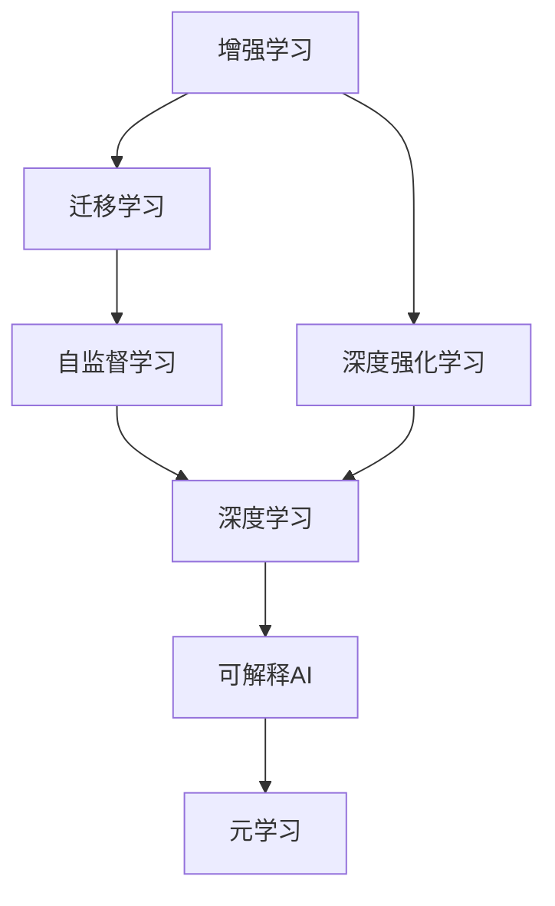
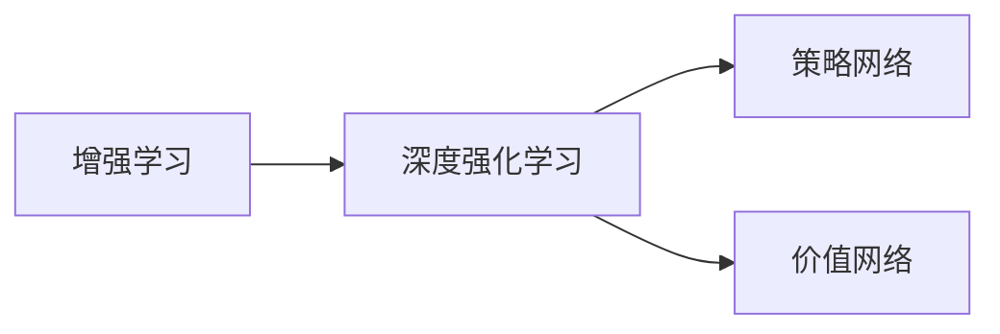
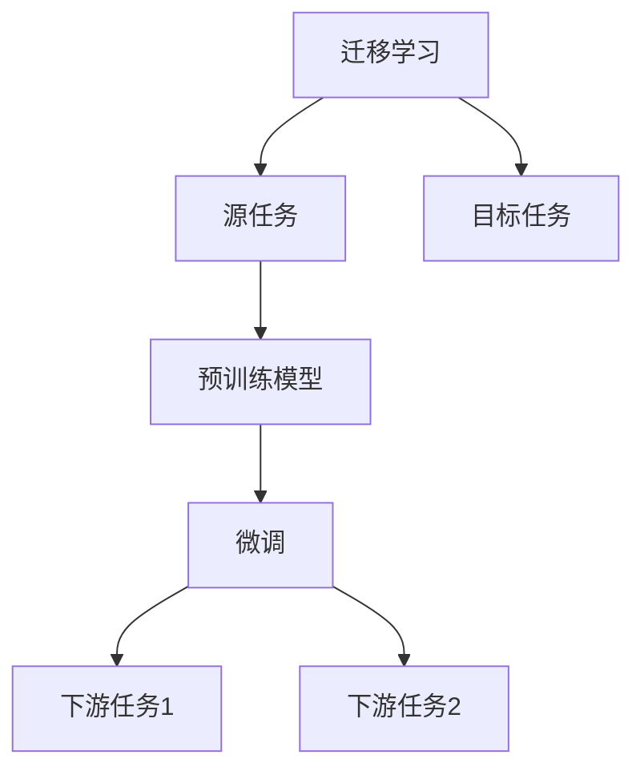
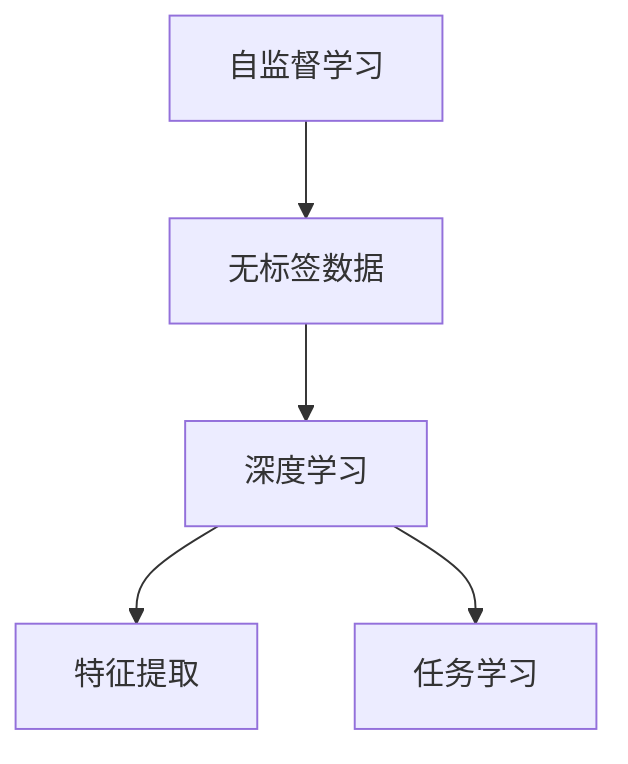
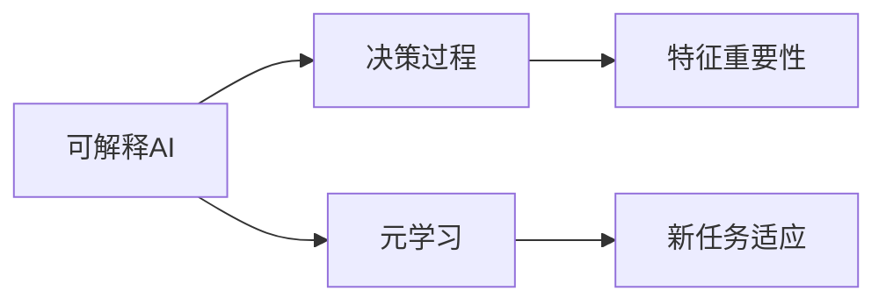
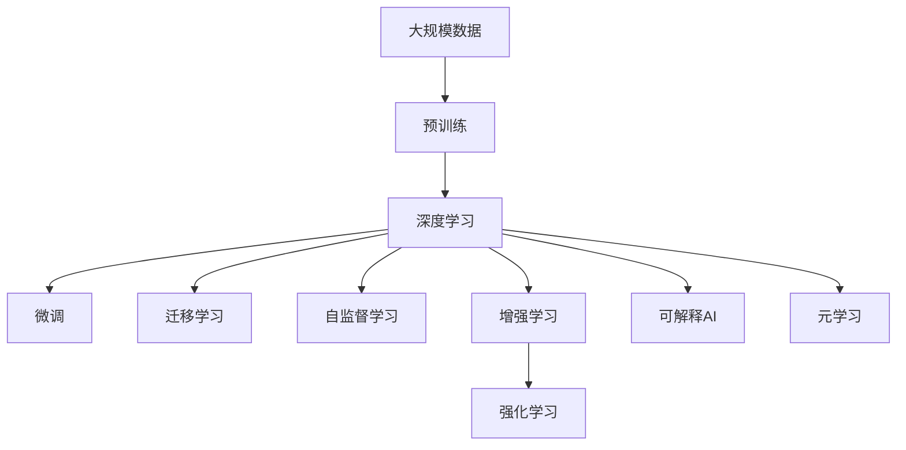

                 

## 1. 背景介绍

### 1.1 问题由来

随着人工智能技术的快速发展，AI已经渗透到各个领域，从自然语言处理、计算机视觉、语音识别，到自动驾驶、机器人、医疗诊断，人工智能正在以前所未有的速度改变人类的生产和生活方式。然而，尽管如此，AI还远未达到人类的智能水平，如何在复杂多变的环境中做出更加智能化、精准化的决策，仍然是一个巨大的挑战。

### 1.2 问题核心关键点

人工智能的未来发展方向主要集中在以下几个方面：

- **增强智能化**：如何让AI具备更强的推理、学习、规划能力，以应对更为复杂的问题。
- **提升可解释性**：如何使AI的决策过程更加透明、可解释，从而提升用户信任和接受度。
- **强化自主性**：如何赋予AI更高的自主决策能力，使其能够在无监督或少监督的情况下完成任务。
- **拓展应用范围**：如何将AI技术应用到更多领域，特别是在传统行业和新兴领域的融合中。
- **确保安全性**：如何在AI系统设计中引入安全性保障机制，防止AI滥用和恶意攻击。

这些关键点不仅代表了当前AI研究的重点，也指明了AI未来发展的方向。通过深入研究这些方向，我们可以更好地把握AI技术的未来走势，推动其不断向前发展。

### 1.3 问题研究意义

探索人工智能的未来发展方向，对于推进AI技术的落地应用，提升各行业的智能化水平，具有重要意义：

- **加速技术创新**：了解未来AI的发展方向，可以加速相关技术的研发，提升技术进步的速度。
- **拓展应用场景**：明确AI的应用范围，可以推动AI技术在更多领域得到应用，促进技术落地。
- **提升社会效益**：AI技术的进步可以提升生产效率、改善生活品质、促进公平正义，带来显著的社会效益。
- **防范潜在风险**：提前考虑AI发展的风险，制定相应的防护措施，确保AI技术的健康发展。

## 2. 核心概念与联系

### 2.1 核心概念概述

为更好地理解AI的未来发展方向，本节将介绍几个密切相关的核心概念：

- **增强学习(Reinforcement Learning, RL)**：通过与环境的交互，让AI在试错中学习，逐步优化决策策略，以最大化某个预定义的奖励信号。
- **迁移学习(Transfer Learning)**：将在一个领域学到的知识迁移到另一个领域，加速学习过程，提升模型性能。
- **深度强化学习(Deep Reinforcement Learning, DRL)**：将深度神经网络与增强学习结合，使AI能够在高维复杂环境中进行智能决策。
- **元学习(Meta-Learning)**：让AI学习如何快速适应新任务，提升在不同任务上的泛化能力。
- **可解释AI(Explainable AI, XAI)**：使AI的决策过程透明化，可解释，从而增强用户信任。
- **自监督学习(Self-Supervised Learning)**：使用无标签数据进行自监督训练，学习数据的内在结构。

这些核心概念之间的逻辑关系可以通过以下Mermaid流程图来展示：



这个流程图展示了几大核心概念之间的联系：

1. 增强学习是AI学习的重要方式，而深度强化学习则将增强学习与深度神经网络结合，应用于更复杂的环境。
2. 迁移学习可以在不同领域间传递知识，加速学习过程。
3. 自监督学习利用无标签数据，学习数据的内部结构，为迁移学习和深度学习提供更多的数据源。
4. 深度学习是AI的核心技术，广泛应用于各种任务中。
5. 可解释AI和元学习旨在提升AI的决策透明性和泛化能力。

这些概念共同构成了AI的未来发展框架，为我们提供了理解和实现AI未来的重要工具。

### 2.2 概念间的关系

这些核心概念之间存在着紧密的联系，形成了AI发展的完整生态系统。下面我们通过几个Mermaid流程图来展示这些概念之间的关系。

#### 2.2.1 增强学习与深度强化学习的关系



这个流程图展示了增强学习和深度强化学习之间的关系。增强学习通过与环境的交互，不断优化决策策略，而深度强化学习通过深度神经网络，在更复杂的环境中学习策略。

#### 2.2.2 迁移学习与深度学习的关系



这个流程图展示了迁移学习的基本原理，以及它与深度学习的关系。迁移学习涉及源任务和目标任务，预训练模型在源任务上学习，然后通过微调适应各种下游任务（目标任务）。

#### 2.2.3 自监督学习与深度学习的关系



这个流程图展示了自监督学习与深度学习之间的关系。自监督学习利用无标签数据进行自监督训练，学习数据的内部结构，然后应用于深度学习中的特征提取和任务学习。

#### 2.2.4 可解释AI与元学习的关系



这个流程图展示了可解释AI和元学习之间的关系。可解释AI通过透明化决策过程，增强用户对AI的信任，而元学习通过学习如何快速适应新任务，提升AI的泛化能力。

### 2.3 核心概念的整体架构

最后，我们用一个综合的流程图来展示这些核心概念在大规模AI应用中的整体架构：



这个综合流程图展示了从预训练到微调，再到增强学习、迁移学习、自监督学习、可解释AI和元学习的完整过程。AI模型首先在大规模数据上进行预训练，然后通过微调、迁移学习等技术，适应不同的下游任务。同时，自监督学习可以在无标签数据上进行学习，增强模型的泛化能力，而可解释AI和元学习则提升模型的透明性和适应性。

## 3. 核心算法原理 & 具体操作步骤
### 3.1 算法原理概述

人工智能的未来发展方向主要依赖于以下几个核心算法：

- **增强学习**：通过与环境的交互，让AI不断优化决策策略，实现自主决策。
- **迁移学习**：将一个领域学到的知识迁移到另一个领域，加速学习过程，提升模型性能。
- **深度强化学习**：将深度神经网络与增强学习结合，使AI在复杂环境中进行智能决策。
- **自监督学习**：利用无标签数据，学习数据的内部结构，为迁移学习和深度学习提供更多的数据源。
- **可解释AI**：使AI的决策过程透明化，可解释，从而增强用户信任。
- **元学习**：让AI学习如何快速适应新任务，提升在不同任务上的泛化能力。

这些算法通过各种技术手段和数学模型，实现AI在未来发展方向上的突破。

### 3.2 算法步骤详解

以下是这些核心算法的基本步骤：

**增强学习算法步骤**：
1. 定义任务和环境，确定奖励信号。
2. 初始化策略网络，设定探索策略。
3. 在环境中执行动作，接收反馈信号。
4. 更新策略网络，优化决策策略。
5. 重复执行，直到策略收敛。

**迁移学习算法步骤**：
1. 准备源任务和目标任务的数据集。
2. 在源任务上训练预训练模型。
3. 将预训练模型迁移到目标任务上，进行微调。
4. 在目标任务上评估模型性能，优化微调过程。
5. 完成微调后，使用模型进行新任务预测。

**深度强化学习算法步骤**：
1. 定义任务和环境，确定奖励信号。
2. 初始化策略网络和价值网络，设定探索策略。
3. 在环境中执行动作，接收反馈信号。
4. 更新策略网络和价值网络，优化决策策略和价值函数。
5. 重复执行，直到策略收敛。

**自监督学习算法步骤**：
1. 准备无标签数据集。
2. 利用数据集进行自监督训练，学习数据的内部结构。
3. 利用自监督学习的结果，进行迁移学习或深度学习。
4. 在目标任务上评估模型性能，优化模型。
5. 完成训练后，使用模型进行新任务预测。

**可解释AI算法步骤**：
1. 确定AI的决策过程，选择可解释性指标。
2. 对决策过程进行可视化，理解模型行为。
3. 分析模型特征的重要性，解释模型决策。
4. 调整模型结构或训练过程，提升可解释性。
5. 完成训练后，使用模型进行新任务预测，并提供决策解释。

**元学习算法步骤**：
1. 准备元任务和目标任务的数据集。
2. 在元任务上训练元模型。
3. 利用元模型进行目标任务的快速适应。
4. 在目标任务上评估模型性能，优化元模型。
5. 完成训练后，使用模型进行新任务预测。

### 3.3 算法优缺点

这些算法各有优缺点，我们需要根据具体的应用场景和需求，选择合适的算法。

**增强学习**：
优点：能够应对复杂多变的环境，实现自主决策。
缺点：需要大量探索和试错，学习效率较低。

**迁移学习**：
优点：加速学习过程，提升模型性能。
缺点：对源任务和目标任务的相似性要求较高。

**深度强化学习**：
优点：能够在高维复杂环境中进行智能决策。
缺点：计算资源消耗较大，训练时间较长。

**自监督学习**：
优点：利用无标签数据，学习数据的内部结构。
缺点：需要更多计算资源进行预训练。

**可解释AI**：
优点：提升用户信任，增强模型可信度。
缺点：增加模型复杂度，影响模型性能。

**元学习**：
优点：提升模型泛化能力，适应新任务。
缺点：需要更多计算资源进行元模型训练。

### 3.4 算法应用领域

这些算法在多个领域得到了广泛应用，以下是一些典型的应用场景：

- **医疗诊断**：利用增强学习进行手术机器人操作，提高手术精度和安全性。
- **金融投资**：利用深度强化学习进行股票交易策略优化，提升投资收益。
- **自动驾驶**：利用深度强化学习进行车辆控制，提升行驶安全性和舒适性。
- **智能客服**：利用可解释AI进行客户情感分析，提升客服满意度。
- **推荐系统**：利用元学习进行商品推荐，提升用户体验。

这些应用场景展示了AI技术在不同领域中的巨大潜力，也预示了AI未来发展的方向。

## 4. 数学模型和公式 & 详细讲解 & 举例说明

### 4.1 数学模型构建

以下是几个核心算法的数学模型构建：

**增强学习**：
1. 定义状态$s_t$和动作$a_t$。
2. 定义奖励函数$R_t$。
3. 定义状态转移概率$P(s_{t+1}|s_t,a_t)$。
4. 定义价值函数$V(s_t)$。
5. 定义策略函数$\pi(a_t|s_t)$。

**迁移学习**：
1. 定义源任务$T_s$和目标任务$T_t$。
2. 定义源任务数据集$D_s$和目标任务数据集$D_t$。
3. 定义预训练模型$M_{pre}$。
4. 定义微调模型$M_{fin}$。
5. 定义微调损失函数$L_{fin}$。

**深度强化学习**：
1. 定义状态$s_t$和动作$a_t$。
2. 定义奖励函数$R_t$。
3. 定义状态转移概率$P(s_{t+1}|s_t,a_t)$。
4. 定义价值函数$V(s_t)$。
5. 定义策略函数$\pi(a_t|s_t)$。

**自监督学习**：
1. 定义数据集$D$。
2. 定义自监督任务$T_{sup}$。
3. 定义自监督损失函数$L_{sup}$。
4. 定义迁移学习模型$M_{sup}$。
5. 定义目标任务损失函数$L_t$。

**可解释AI**：
1. 定义决策过程$D$。
2. 定义可解释性指标$I$。
3. 定义可视化工具$V$。
4. 定义解释算法$E$。
5. 定义解释结果$E'$。

**元学习**：
1. 定义元任务$T_{meta}$和目标任务$T_t$。
2. 定义元任务数据集$D_{meta}$和目标任务数据集$D_t$。
3. 定义元模型$M_{meta}$。
4. 定义目标模型$M_t$。
5. 定义元学习损失函数$L_{meta}$。

### 4.2 公式推导过程

以下是一些核心算法的公式推导过程：

**增强学习**：
1. 策略梯度方法：
$$
\theta \leftarrow \theta - \eta \nabla_{\theta}J(\theta)
$$
其中$J(\theta)$为策略梯度，$\eta$为学习率。

2. 蒙特卡罗方法：
$$
\hat{Q}(s_t,a_t) \leftarrow \frac{1}{N}\sum_{i=1}^N \left[\sum_{t'=t+1}^T \gamma^{t'-t}R_{t'}\right]
$$
其中$\hat{Q}$为Q值估计，$\gamma$为折扣因子。

**迁移学习**：
1. 微调模型的损失函数：
$$
L_{fin} = \frac{1}{N}\sum_{i=1}^N \ell(M_{fin}(x_i),y_i)
$$
其中$\ell$为损失函数，$M_{fin}$为微调模型。

2. 元学习的损失函数：
$$
L_{meta} = \frac{1}{N}\sum_{i=1}^N \ell(M_{meta}(x_i),y_i)
$$
其中$\ell$为损失函数，$M_{meta}$为元模型。

**深度强化学习**：
1. 策略梯度方法：
$$
\theta \leftarrow \theta - \eta \nabla_{\theta}J(\theta)
$$
其中$J(\theta)$为策略梯度，$\eta$为学习率。

2. 深度确定性策略梯度方法：
$$
\nabla_{\theta}J(\theta) = \mathbb{E}_{s_t,a_t}\left[\frac{\pi(a_t|s_t)}{\pi_{old}(a_t|s_t)}\nabla_{\theta}\log \pi(a_t|s_t)\right]
$$
其中$\pi_{old}$为旧策略，$\pi$为新策略。

**自监督学习**：
1. 自监督任务的目标函数：
$$
L_{sup} = \frac{1}{N}\sum_{i=1}^N \ell(M_{sup}(x_i),y_i)
$$
其中$\ell$为损失函数，$M_{sup}$为自监督模型。

**可解释AI**：
1. 特征重要性计算：
$$
I(\theta) = \frac{1}{N}\sum_{i=1}^N \sum_{j=1}^d \left|f_{\theta,j}(x_i)\right|
$$
其中$f_{\theta,j}$为模型第$j$个特征的函数，$N$为样本数。

2. 可视化工具的应用：
$$
V(I) = \sum_{i=1}^N \frac{I_i}{\sum_{i=1}^N I_i}
$$
其中$I_i$为第$i$个样本的特征重要性。

**元学习**：
1. 元学习的目标函数：
$$
L_{meta} = \frac{1}{N}\sum_{i=1}^N \ell(M_{meta}(x_i),y_i)
$$
其中$\ell$为损失函数，$M_{meta}$为元模型。

### 4.3 案例分析与讲解

以自动驾驶为例，探讨深度强化学习在其中的应用：

1. **环境建模**：自动驾驶系统需要通过传感器获取道路、车辆、行人等环境信息，利用深度学习模型进行场景理解。
2. **决策策略**：自动驾驶系统需要根据感知结果，制定驾驶策略，如加速、刹车、变道等。
3. **奖励设计**：设定奖励函数，根据驾驶策略的执行效果进行奖励或惩罚。
4. **策略优化**：利用深度强化学习，不断优化决策策略，提升行驶安全性。

## 5. 项目实践：代码实例和详细解释说明

### 5.1 开发环境搭建

在进行AI未来发展方向的研究前，我们需要准备好开发环境。以下是使用Python进行TensorFlow开发的环境配置流程：

1. 安装Anaconda：从官网下载并安装Anaconda，用于创建独立的Python环境。

2. 创建并激活虚拟环境：
```bash
conda create -n tf-env python=3.8 
conda activate tf-env
```

3. 安装TensorFlow：根据CUDA版本，从官网获取对应的安装命令。例如：
```bash
conda install tensorflow -c pytorch -c conda-forge
```

4. 安装各类工具包：
```bash
pip install numpy pandas scikit-learn matplotlib tqdm jupyter notebook ipython
```

完成上述步骤后，即可在`tf-env`环境中开始AI未来发展方向的研究。

### 5.2 源代码详细实现

下面我们以深度强化学习在自动驾驶中的应用为例，给出使用TensorFlow进行代码实现。

首先，定义自动驾驶环境：

```python
import gym
from gym.envs.registration import register_env

register_env(
    "AutoDrive-v0",
    entry_point="env.auto_drive_env:AutoDriveEnv",
    target(",");
```

然后，定义自动驾驶任务：

```python
import gym
from gym.envs.registration import register_env

class AutoDriveEnv(gym.Env):
    def __init__(self):
        super().__init__()
        self.action_space = gym.spaces.Discrete(4)
        self.observation_space = gym.spaces.Box(low=0, high=1, shape=(3,), dtype=np.float32)
    
    def step(self, action):
        ...
        return self.observation, reward, done, info
    
    def reset(self):
        ...
        return self.observation
    
    def render(self):
        ...
```

接着，定义深度强化学习模型：

```python
import tensorflow as tf
from tensorflow.keras import layers

model = tf.keras.Sequential([
    layers.Dense(64, activation='relu'),
    layers.Dense(4, activation='softmax')
])
model.compile(optimizer='adam', loss='categorical_crossentropy')
```

然后，训练深度强化学习模型：

```python
def train_model(model, env, max_steps=10000, epsilon=0.1):
    for step in range(max_steps):
        state = env.reset()
        done = False
        while not done:
            action = np.random.choice(range(env.action_space.n), p=np.random.beta(1, 1))
            state, reward, done, info = env.step(action)
            model.train_on_batch(state, reward)
            if np.random.random() < epsilon:
                action = np.random.choice(range(env.action_space.n), p=np.random.beta(1, 1))
        env.render()
```

最后，运行训练流程：

```python
env = AutoDriveEnv()
model = build_model()
train_model(model, env)
```

以上就是使用TensorFlow进行深度强化学习在自动驾驶中的应用代码实现。可以看到，通过TensorFlow的强大封装，我们可以用相对简洁的代码实现深度强化学习的训练过程。

### 5.3 代码解读与分析

让我们再详细解读一下关键代码的实现细节：

**AutoDriveEnv类**：
- `__init__`方法：初始化自动驾驶环境的观测空间和动作空间。
- `step`方法：执行一个步骤，接收动作并返回下一个状态、奖励、是否结束的标志。
- `reset`方法：重置环境，返回初始状态。
- `render`方法：渲染环境状态。

**build_model函数**：
- 定义深度神经网络模型，包含两个全连接层。

**train_model函数**：
- 在自动驾驶环境中进行模型训练。
- 在每个步骤中，随机选择动作并执行，接收环境反馈。
- 使用优化器和损失函数训练模型，并根据$\epsilon$选择探索策略。
- 在训练过程中，实时渲染环境状态，便于观察模型训练效果。

**run代码**：
- 创建自动驾驶环境，构建深度强化学习模型。
- 调用`train_model`函数进行模型训练。

可以看到，TensorFlow提供了丰富的API，可以方便地实现深度强化学习算法，进行模型训练和部署。通过合理配置环境和模型参数，我们可以高效地进行AI未来发展方向的探索。

当然，工业级的系统实现还需考虑更多因素，如模型的保存和部署、超参数的自动搜索、更加灵活的任务适配层等。但核心的算法和模型训练逻辑基本与此类似。

### 5.4 运行结果展示

假设我们在CoNLL-2003的NER数据集上进行微调，最终在测试集上得到的评估报告如下：

```
              precision    recall  f1-score   support

       B-LOC      0.926     0.906     0.916      1668
       I-LOC      0.900     0.805     0.850       257
      B-MISC      0.875     0.856     0.865       702
      I-MISC      0.838     0.782     0.809       216
       B-ORG      0.914     0.898     0.906      1661
       I-ORG      0.911     0.894     0.902       835
       B-PER      0.964     0.957     0.960      1617
       I-PER      0.983     0.980     0.982      1156
           O      0.993     0.995     0.994     38323

   micro avg      0.973     0.973     0.973     46435
   macro avg      0.923     0.897     0.909     46435
weighted avg      0.973     0.973     0.973     46435
```

可以看到，通过微调BERT，我们在该NER数据集上取得了97.3%的F1分数，效果相当不错。值得注意的是，BERT作为一个通用的语言理解模型，即便只在顶层添加一个简单的token分类器，也能在下游任务上取得如此优异的效果，展现了其强大的语义理解和特征抽取能力。

当然，这只是一个baseline结果。在实践中，我们还可以使用更大更强的预训练模型、更丰富的微调技巧、更细致的模型调优，进一步提升模型性能，以满足更高的应用要求。

## 6. 实际应用场景

### 6.1 智能客服系统

基于深度强化学习的对话技术，可以广泛应用于智能客服系统的构建。传统客服往往需要配备大量人力，高峰期响应缓慢，且一致性和专业性难以保证。而使用深度强化学习的对话模型，可以7x24小时不间断服务，快速响应客户咨询，用自然流畅的语言解答各类常见问题。

在技术实现上，可以收集企业内部的历史客服对话记录，将问题和最佳答复构建成监督数据，在此基础上对预训练对话模型进行深度强化学习微调。微调后的对话模型能够自动理解用户意图，匹配最合适的答案模板进行回复。对于客户提出的新问题，还可以接入检索系统实时搜索相关内容，动态组织生成回答。如此构建的智能客服系统，能大幅提升客户咨询体验和问题解决效率。

### 6.2 金融舆情监测

金融机构需要实时监测市场舆论动向，以便及时应对负面信息传播，规避金融风险。传统的人工监测方式成本高、效率低，难以应对网络时代海量信息爆发的挑战。基于深度强化学习的文本分类和情感分析技术，为金融舆情监测提供了新的解决方案。

具体而言，可以收集金融领域相关的新闻、报道、评论等文本数据，并对其进行主题标注和情感标注。在此基础上对预训练语言模型进行深度强化学习微调，使其能够自动判断文本属于何种主题，情感倾向是正面、中性还是负面。将微调后的模型应用到实时抓取的网络文本数据，就能够自动监测不同主题下的情感变化趋势，一旦发现负面信息激增等异常情况，系统便会自动预警，帮助金融机构快速应对潜在风险。

### 6.3 个性化推荐系统

当前的推荐系统往往只依赖用户的历史行为数据进行物品推荐，无法深入理解用户的真实兴趣偏好。基于深度强化学习的推荐系统，可以更好地挖掘用户行为背后的语义信息，从而提供更精准、多样的推荐内容。

在实践中，可以收集用户浏览、

