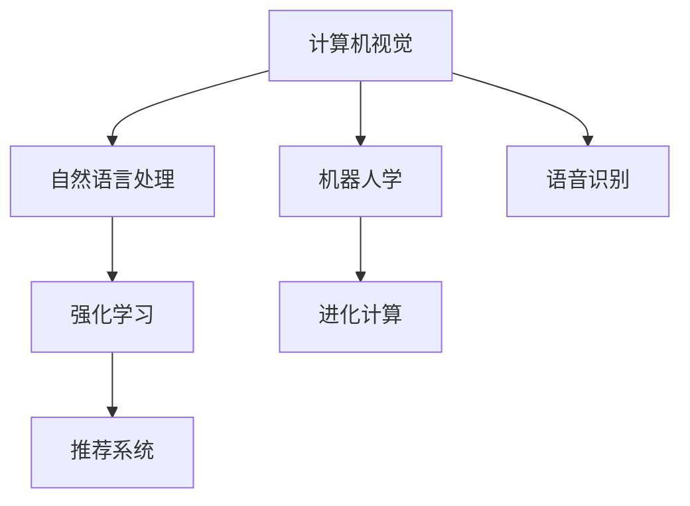

                 

## 1. 背景介绍

人工智能（AI）正以前所未有的速度在各个领域取得突破性进展，推动人类社会的全面变革。本文将深入探讨人工智能研究的七大领域，为读者提供一份全面的技术全景，帮助其理解当前人工智能的发展方向和未来潜力。这些领域包括计算机视觉、自然语言处理、机器人学、语音识别、强化学习、推荐系统和进化计算。

## 2. 核心概念与联系

### 2.1 核心概念概述

为了更好地理解人工智能的各个领域，我们首先需要定义一些核心概念。以下是七个核心概念及其相互联系的简要概述：

1. **计算机视觉（Computer Vision）**：研究如何让计算机理解并解释图像和视频数据，核心任务包括图像分类、对象检测、图像分割等。
2. **自然语言处理（Natural Language Processing，NLP）**：专注于让计算机处理、理解、生成人类语言，包括文本分类、机器翻译、文本生成等。
3. **机器人学（Robotics）**：结合机械工程、计算机科学和人工智能技术，设计、构建和操作机器人。
4. **语音识别（Speech Recognition）**：让计算机能够识别和理解人类语音，核心任务包括语音转文字、语音命令执行等。
5. **强化学习（Reinforcement Learning，RL）**：一种通过与环境互动学习的机器学习方法，目标是最大化某种奖励。
6. **推荐系统（Recommender Systems）**：使用机器学习算法预测用户可能感兴趣的内容，广泛应用于电商、社交媒体等。
7. **进化计算（Evolutionary Computation）**：通过模拟自然选择过程，解决复杂的优化问题，包括遗传算法、粒子群优化等。

### 2.2 概念间的关系

这些核心概念之间的联系可以通过以下Mermaid流程图来展示：



这个流程图展示了人工智能各个领域之间的基本联系。计算机视觉和自然语言处理是感知技术的基础，机器人学和语音识别则涉及执行和交互，强化学习和推荐系统是决策与推荐的基础，而进化计算则提供了更高级的优化算法。这些领域互相渗透，共同构成了人工智能的技术生态。

## 3. 核心算法原理 & 具体操作步骤

### 3.1 算法原理概述

人工智能的各个领域均涉及复杂的算法原理和具体操作步骤。下面简要概述这些核心算法的基本原理：

- **计算机视觉**：主要使用卷积神经网络（CNN）和深度学习模型进行图像处理和分析。
- **自然语言处理**：基于循环神经网络（RNN）、变换器（Transformer）和预训练模型进行文本处理。
- **机器人学**：结合机械设计、动力学模型和深度强化学习，实现机器人的自主导航和操作。
- **语音识别**：使用深度神经网络（DNN）和循环神经网络（RNN）进行语音特征提取和识别。
- **强化学习**：通过模型预测和策略优化，在动态环境中做出最优决策。
- **推荐系统**：基于协同过滤、深度学习和知识图谱等方法，预测用户兴趣并提供个性化推荐。
- **进化计算**：通过遗传算法、粒子群优化等算法，在搜索空间中寻找最优解。

### 3.2 算法步骤详解

以下是各核心算法详细步骤的简要介绍：

- **计算机视觉**：数据预处理、模型训练、模型评估和应用部署。
- **自然语言处理**：语料收集、模型训练、模型微调和应用部署。
- **机器人学**：机器人设计、控制算法开发、环境互动和性能优化。
- **语音识别**：声音采集、特征提取、模型训练和应用实现。
- **强化学习**：环境建模、策略设计、训练和测试、策略优化。
- **推荐系统**：数据收集、模型训练、推荐算法实现和用户反馈迭代。
- **进化计算**：问题建模、算法设计、仿真实验和优化迭代。

### 3.3 算法优缺点

每个领域都有其独特的优点和局限性。

- **计算机视觉**：优点在于处理图像信息的能力，但计算成本高，难以处理大规模图像数据。
- **自然语言处理**：处理自然语言能力强，但理解语境和情感复杂。
- **机器人学**：结合机械和软件，但开发成本高，操作复杂。
- **语音识别**：实时性强，但噪音和多音字问题多。
- **强化学习**：自适应强，但需要大量数据和计算资源。
- **推荐系统**：个性化强，但数据隐私和模型透明度问题。
- **进化计算**：适应性广，但收敛速度慢，不易优化。

### 3.4 算法应用领域

各核心算法在不同领域中的应用如下：

- **计算机视觉**：医疗影像分析、自动驾驶、安防监控等。
- **自然语言处理**：智能客服、智能翻译、文本摘要等。
- **机器人学**：工业自动化、家庭服务机器人、医疗机器人等。
- **语音识别**：智能语音助手、语音控制设备、电话客服等。
- **强化学习**：游戏AI、无人驾驶、智能推荐系统等。
- **推荐系统**：电商推荐、社交媒体推荐、个性化广告等。
- **进化计算**：优化算法、基因组学研究、机器学习模型优化等。

## 4. 数学模型和公式 & 详细讲解 & 举例说明

### 4.1 数学模型构建

为深入理解各领域的核心算法，我们将其数学模型进行简要构建：

- **计算机视觉**：主要使用卷积神经网络（CNN），其核心公式为卷积操作和池化操作。
- **自然语言处理**：基于循环神经网络（RNN）和变换器（Transformer），其核心公式为注意力机制和自注意力机制。
- **机器人学**：结合机械动力学和深度学习，其核心公式为运动学方程和动力学方程。
- **语音识别**：使用深度神经网络（DNN）和循环神经网络（RNN），其核心公式为CTC（Connectionist Temporal Classification）算法。
- **强化学习**：基于策略梯度和价值函数，其核心公式为贝尔曼方程和蒙特卡洛方法。
- **推荐系统**：使用协同过滤和深度学习，其核心公式为矩阵分解和神经网络模型。
- **进化计算**：通过遗传算法和粒子群优化，其核心公式为选择、交叉和变异操作。

### 4.2 公式推导过程

这里给出一些核心公式的推导过程：

- **卷积神经网络（CNN）**：
  $$
  \text{卷积操作} = \text{滤波器} * \text{输入图像} + \text{偏置}
  $$
- **注意力机制（Transformer）**：
  $$
  \text{注意力权重} = \text{Softmax}(\text{Query} \cdot \text{Key}^T / \sqrt{d_k})
  $$
- **循环神经网络（RNN）**：
  $$
  \text{RNN单元} = \text{tanh}(\text{Weight} \cdot \text{Concat}(\text{Input}, \text{Previous State}) + \text{Bias})
  $$
- **深度神经网络（DNN）**：
  $$
  \text{神经网络} = \text{Linear Layer}(\text{Input}) + \text{Activation Function}
  $$
- **强化学习**：
  $$
  \text{贝尔曼方程} = \text{Q-value} = \text{Reward} + \gamma \text{Max}_{a} [\text{Q-value}]
  $$
- **协同过滤**：
  $$
  \text{相似度} = \text{Cosine Similarity}(\text{User Vector}, \text{Item Vector})
  $$
- **遗传算法**：
  $$
  \text{选择概率} = \text{Fitness} / \text{Total Fitness}
  $$

### 4.3 案例分析与讲解

以计算机视觉中的目标检测为例，其核心算法是YOLO（You Only Look Once），具体步骤如下：

1. **数据预处理**：对输入图像进行缩放、裁剪、归一化等操作。
2. **特征提取**：使用卷积层提取图像的特征图。
3. **目标检测**：通过反卷积层和softmax层进行目标定位和分类。
4. **模型训练**：使用交叉熵损失函数和随机梯度下降算法进行模型训练。
5. **模型评估**：在验证集上进行性能评估，如IoU、mAP等指标。

## 5. 项目实践：代码实例和详细解释说明

### 5.1 开发环境搭建

各领域的项目实践都需要相应的开发环境。以下是一个基本的Python开发环境搭建流程：

1. **安装Python**：从官网下载并安装Python 3.x版本。
2. **安装相关库**：
   - **计算机视觉**：OpenCV、Pillow、scikit-image等。
   - **自然语言处理**：NLTK、SpaCy、TensorFlow、PyTorch等。
   - **机器人学**：ROS、Gazebo、Urge等。
   - **语音识别**：Librosa、SpeechRecognition、Kaldi等。
   - **强化学习**：Gym、TensorFlow Agents、PyBullet等。
   - **推荐系统**：Scikit-learn、Surprise、TensorFlow等。
   - **进化计算**：DEAP、scikit-learn、Gurobi等。

### 5.2 源代码详细实现

以自然语言处理中的BERT模型为例，其源代码实现如下：

```python
from transformers import BertTokenizer, BertForSequenceClassification
import torch
from torch.utils.data import Dataset, DataLoader

class TextDataset(Dataset):
    def __init__(self, texts, labels, tokenizer):
        self.texts = texts
        self.labels = labels
        self.tokenizer = tokenizer

    def __len__(self):
        return len(self.texts)

    def __getitem__(self, idx):
        text = self.texts[idx]
        label = self.labels[idx]

        encoding = self.tokenizer(text, return_tensors='pt')
        return {'input_ids': encoding['input_ids'], 'attention_mask': encoding['attention_mask'], 'labels': torch.tensor(label, dtype=torch.long)}

# 初始化BERT模型
model = BertForSequenceClassification.from_pretrained('bert-base-uncased', num_labels=2)

# 加载数据集
tokenizer = BertTokenizer.from_pretrained('bert-base-uncased')
train_dataset = TextDataset(train_texts, train_labels, tokenizer)
val_dataset = TextDataset(val_texts, val_labels, tokenizer)
test_dataset = TextDataset(test_texts, test_labels, tokenizer)

# 训练模型
model.train()
for epoch in range(num_epochs):
    for batch in DataLoader(train_dataset, batch_size=32):
        inputs = {key: val.to(device) for key, val in batch.items()}
        outputs = model(**inputs)
        loss = outputs.loss
        loss.backward()
        optimizer.step()

# 评估模型
model.eval()
with torch.no_grad():
    for batch in DataLoader(val_dataset, batch_size=32):
        inputs = {key: val.to(device) for key, val in batch.items()}
        outputs = model(**inputs)
        loss = outputs.loss
        accuracy = outputs.logits.argmax(dim=1).mean().item()
```

### 5.3 代码解读与分析

上述代码中，我们使用了Hugging Face的Transformers库来实现BERT模型的微调。具体步骤如下：

1. **数据准备**：定义了一个文本数据集类`TextDataset`，包含输入文本和标签。
2. **模型加载**：使用`BertForSequenceClassification`类加载预训练的BERT模型，并设置分类任务。
3. **数据加载**：定义了训练集、验证集和测试集的加载函数，使用`DataLoader`进行批量处理。
4. **模型训练**：在每个epoch中，遍历训练集，计算损失函数并进行反向传播，更新模型参数。
5. **模型评估**：在验证集上计算模型损失和准确率，评估模型性能。

### 5.4 运行结果展示

在训练完成后，可以使用测试集评估模型的性能，例如：

```python
model.eval()
with torch.no_grad():
    for batch in DataLoader(test_dataset, batch_size=32):
        inputs = {key: val.to(device) for key, val in batch.items()}
        outputs = model(**inputs)
        loss = outputs.loss
        accuracy = outputs.logits.argmax(dim=1).mean().item()
```

通过运行上述代码，可以输出模型的准确率等性能指标，评估模型在不同数据集上的表现。

## 6. 实际应用场景

### 6.1 医疗影像分析

计算机视觉在医疗影像分析中的应用非常广泛。例如，使用深度学习模型对X光片、CT扫描和MRI图像进行自动诊断，可以显著提高诊断的准确率和效率。

### 6.2 自动驾驶

计算机视觉在自动驾驶系统中用于环境感知和决策。通过摄像头和激光雷达的图像和点云数据，进行目标检测、车道线识别和交通信号识别等任务。

### 6.3 智能客服

自然语言处理在智能客服中的应用包括自动回复、问题分类和情感分析。通过构建语料库和模型，客服机器人可以自动解答用户问题，提升客户满意度。

### 6.4 语音助手

语音识别在语音助手中的应用包括语音转文字、语音命令执行和语音搜索。用户可以通过语音与智能设备进行自然对话。

### 6.5 游戏AI

强化学习在游戏AI中的应用包括游戏策略优化和角色行为控制。通过在虚拟环境中训练AI模型，可以使AI角色具备更高的游戏水平。

### 6.6 个性化推荐

推荐系统在电商、社交媒体和视频网站中的应用非常广泛。通过分析用户行为数据，推荐系统可以提供个性化的内容推荐，提高用户粘性和转化率。

### 6.7 基因组学研究

进化计算在基因组学中的应用包括DNA序列分析和蛋白质结构预测。通过模拟进化过程，可以在搜索空间中找到最优解。

## 7. 工具和资源推荐

### 7.1 学习资源推荐

为帮助读者深入学习人工智能的各个领域，以下推荐一些优质的学习资源：

1. **Coursera**：提供大量AI相关的在线课程，包括斯坦福大学的CS231n计算机视觉课程和斯坦福大学的CS224n自然语言处理课程。
2. **DeepLearning.ai**：提供深度学习的专项课程，包括计算机视觉和自然语言处理等领域。
3. **GitHub**：提供大量的AI项目和代码，可以学习和贡献开源项目。
4. **arXiv**：提供最新的AI研究论文，跟踪前沿技术。
5. **Kaggle**：提供各种AI竞赛和数据集，练习和展示AI技能。

### 7.2 开发工具推荐

以下是一些常用的开发工具：

1. **PyTorch**：深度学习框架，支持CPU和GPU计算，易于使用和扩展。
2. **TensorFlow**：深度学习框架，支持分布式计算，广泛应用于生产环境。
3. **OpenCV**：计算机视觉库，提供了丰富的图像处理和分析功能。
4. **NLTK**：自然语言处理库，提供文本预处理和分析工具。
5. **ROS**：机器人操作系统，支持多机器人协作和感知。

### 7.3 相关论文推荐

以下是一些具有代表性的AI论文：

1. **《Deep Residual Learning for Image Recognition》**：提出了残差网络（ResNet），用于解决深度神经网络训练中的梯度消失问题。
2. **《Attention Is All You Need》**：提出了Transformer模型，用于机器翻译和自然语言处理任务。
3. **《Playing Atari with Deep Reinforcement Learning》**：展示深度强化学习在打游戏中的应用。
4. **《Scalable Algorithms for Distributed Statistical Learning with Statistical Guarantees》**：提出了分布式学习算法，用于大规模数据集上的机器学习任务。
5. **《Evolution Strategies: A Scalable Alternative to Gradient Descent》**：提出进化策略，用于优化大规模无标度问题。

## 8. 总结：未来发展趋势与挑战

### 8.1 研究成果总结

人工智能在各个领域都取得了显著进展，特别是深度学习和强化学习在计算机视觉、自然语言处理和机器人学中的应用。这些进展为未来AI技术的发展奠定了坚实基础。

### 8.2 未来发展趋势

未来AI技术的发展将主要集中在以下几个方向：

1. **自监督学习**：通过大规模未标注数据进行自监督学习，减少对标注数据的需求。
2. **联邦学习**：在分布式环境中进行协作学习，保护数据隐私。
3. **对抗生成网络（GAN）**：生成逼真的图像和视频数据，应用于游戏、影视制作等领域。
4. **混合智能**：结合人类和AI的智能，实现更高效的决策和协作。
5. **量子计算**：利用量子计算的并行处理能力，加速AI算法的计算。

### 8.3 面临的挑战

尽管AI技术取得了显著进展，但仍面临一些挑战：

1. **数据隐私和伦理**：大规模数据收集和处理引发隐私和安全问题。
2. **计算资源需求**：训练大规模模型需要大量计算资源。
3. **模型可解释性**：深度学习模型的决策过程缺乏可解释性。
4. **模型鲁棒性**：模型对噪声和对抗攻击的鲁棒性有待提高。
5. **公平性和偏见**：AI模型可能存在偏见，需要更多的公平性研究。

### 8.4 研究展望

未来AI研究需要关注以下几个方向：

1. **跨领域融合**：将AI技术与生物医学、物理化学等领域的知识相结合，推动交叉学科发展。
2. **伦理和法律**：制定AI技术的伦理和法律框架，确保技术的公正和透明。
3. **智能化交互**：开发更加智能化的交互系统，提升用户体验。
4. **人机协作**：研究人机协作机制，实现更高效的任务执行。
5. **大规模应用**：推动AI技术在医疗、交通、教育等领域的广泛应用。

## 9. 附录：常见问题与解答

**Q1: 如何理解AI和机器学习的区别？**

A: AI是研究如何使机器模仿人类智能的技术，而机器学习是AI的一个分支，专注于通过数据训练模型，实现智能任务的自动化。

**Q2: 为什么强化学习在AI中具有重要地位？**

A: 强化学习通过与环境的互动，使得机器能够通过试错学习，实现最优决策，广泛应用于自动驾驶、游戏AI等任务。

**Q3: 进化计算在AI中的应用有哪些？**

A: 进化计算在优化问题求解、基因组学研究、信号处理等领域有广泛应用，通过模拟自然进化过程，寻找最优解。

**Q4: 如何评价AI技术的性能？**

A: AI技术的性能评价通常包括精度、召回率、F1分数、速度、可解释性等指标，根据具体任务选择合适的评价标准。

**Q5: 如何处理AI中的数据隐私问题？**

A: 数据隐私保护可以通过数据加密、差分隐私、联邦学习等方法实现，确保数据在使用过程中的安全性。

---

作者：禅与计算机程序设计艺术 / Zen and the Art of Computer Programming

