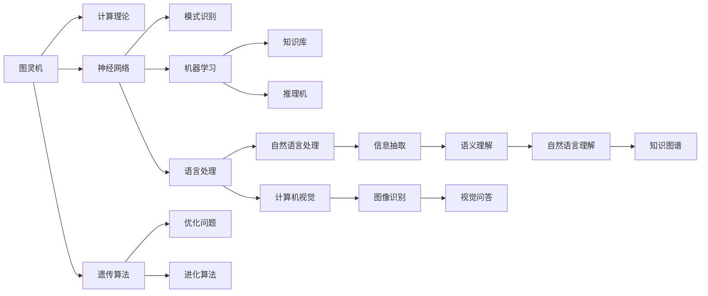

                 

# 人工智能领域的早期探索

> 关键词：早期探索，人工智能，计算机科学，图灵奖，历史回顾，技术演变

## 1. 背景介绍

### 1.1 问题的由来
人工智能（AI）作为21世纪最具革命性影响的科技之一，对各行各业都产生了深远影响。自20世纪50年代起，人工智能便开始了它曲折而辉煌的历程。然而，在早期探索阶段，由于计算资源有限和算法理论不成熟，AI领域并未取得显著进展。

### 1.2 问题核心关键点
早期AI探索的核心关键点在于：

- **理论基础的奠定**：从图灵机理论到现代机器学习，早期研究者们尝试构建人工智能的理论基础。
- **算法与技术的发展**：从神经网络到遗传算法，早期研究者们不断探索新的计算模型和技术。
- **实际应用的探索**：从机器翻译到图像识别，早期AI在多个领域取得了突破，推动了技术进步和产业应用。
- **研究环境的演进**：从学术研究到企业应用，AI研究环境逐渐成熟，催生了一系列AI技术产品和应用。
- **跨学科的融合**：早期AI研究者们从数学、心理学、语言学等学科汲取营养，促进了AI技术的多样化发展。

### 1.3 问题研究意义
了解早期AI探索的意义在于：

- 回顾历史：通过回顾AI早期的技术突破和理论进展，我们可以理解AI的演进脉络，激发新的创新思路。
- 积累经验：早期研究者的成功与失败经验，为后来的AI研究提供了宝贵的参考。
- 启迪未来：早期AI探索的故事，激励着新一代研究者继续突破技术边界。
- 促进融合：跨学科的知识融合，为AI技术与更多领域结合提供了可能。
- 激发兴趣：了解AI的早期历史，能够唤起更多人对AI的兴趣和热情。

## 2. 核心概念与联系

### 2.1 核心概念概述

为更好地理解早期AI探索，本节将介绍几个关键概念及其联系：

- **图灵机（Turing Machine）**：由艾伦·图灵在1936年提出的概念，定义了计算的本质，是现代计算机科学的重要基础。
- **神经网络（Neural Network）**：模仿人脑神经元结构和功能设计的计算模型，是AI早期重要研究领域。
- **遗传算法（Genetic Algorithm）**：基于自然选择和遗传进化原理设计的优化算法，用于解决搜索空间较大的复杂问题。
- **知识表示（Knowledge Representation）**：研究如何用机器可理解的形式表示和存储知识，是AI技术的基础。
- **专家系统（Expert System）**：模拟人类专家的决策过程，通过规则和知识库进行推理和决策。

这些概念通过一系列经典的实验和研究，构成了早期AI探索的核心架构，如图示：



### 2.2 概念间的关系

这些概念之间的联系主要体现在以下几个方面：

1. **理论基础**：图灵机奠定了计算理论的基础，神经网络和遗传算法在实际算法层面提供了计算模型和技术支持。
2. **技术演进**：神经网络、遗传算法等早期AI技术为现代深度学习和强化学习奠定了基础。
3. **跨领域应用**：早期AI技术在语言处理、模式识别、图像识别等领域取得了突破，推动了这些领域的技术进步。
4. **融合创新**：知识表示、专家系统等技术逐渐融合到神经网络和遗传算法中，形成了新的AI范式。

这些概念和联系共同构成了早期AI探索的基本框架，为我们理解早期AI研究提供了重要线索。

## 3. 核心算法原理 & 具体操作步骤
### 3.1 算法原理概述

早期AI探索的核心算法原理主要围绕以下几个方面：

- **图灵机和计算理论**：定义了计算的基本模型和理论基础，为计算机科学的发展提供了理论指导。
- **神经网络和反向传播**：通过神经元之间的连接和信息传递，实现了对非线性问题的逼近。
- **遗传算法和进化优化**：利用自然选择和遗传进化原理，优化复杂搜索空间中的解。
- **知识表示和专家系统**：通过符号化知识库和规则推理，实现了基于知识的智能决策。

### 3.2 算法步骤详解

早期AI探索的算法步骤主要包括以下几个关键环节：

1. **概念建模**：通过数学建模，将问题转化为计算模型。
2. **算法设计**：根据问题特性，设计相应的算法和技术。
3. **实验验证**：在实际数据和应用场景中，验证算法的有效性和可行性。
4. **优化调整**：通过反馈和迭代，优化算法参数和结构，提升算法性能。
5. **应用部署**：将算法部署到实际应用中，解决具体问题。

### 3.3 算法优缺点

早期AI探索的算法具有以下优缺点：

#### 优点：
- **基础性**：奠定了现代计算机科学和人工智能的基础。
- **多样性**：覆盖了计算理论、算法设计、知识表示等多个领域。
- **创新性**：催生了多种前沿技术和应用。

#### 缺点：
- **复杂度**：早期算法较为复杂，实现难度较大。
- **精度**：由于计算资源有限，算法精度相对较低。
- **适用性**：早期算法在特定领域表现较好，但泛化能力有限。

### 3.4 算法应用领域

早期AI探索的算法在多个领域取得了重要应用，主要包括以下几个方面：

1. **机器翻译**：基于神经网络和规则的机器翻译系统，如IBM的ART和NIST。
2. **图像识别**：早期基于特征提取和模板匹配的图像识别技术，如MIT的视觉感知组。
3. **模式识别**：用于医学诊断、信号处理等领域的模式识别算法，如MIT的BIODIVINE。
4. **自然语言处理**：早期的自然语言理解、语音识别和文本生成技术，如Carnegie Mellon的Speaker Recognition。
5. **专家系统**：用于医疗诊断、金融分析等领域的具体应用，如Mycin。

## 4. 数学模型和公式 & 详细讲解
### 4.1 数学模型构建

早期AI探索的数学模型主要围绕以下几个方面：

- **图灵机模型**：用形式化的方式定义了计算的基本步骤和行为。
- **神经网络模型**：定义了神经元之间的连接方式和传递规律。
- **遗传算法模型**：用数学方式描述了自然选择和遗传进化的过程。
- **知识表示模型**：用符号化方式描述了知识库和规则。

### 4.2 公式推导过程

以图灵机为例，其基本数学模型为：

$$
M = \langle Q, \Sigma, \Gamma, \delta, q_0, F \rangle
$$

其中：
- $Q$ 为状态集
- $\Sigma$ 为输入符号集
- $\Gamma$ 为输出符号集
- $\delta$ 为转移函数
- $q_0$ 为初始状态
- $F$ 为终止状态集

其转移函数 $\delta$ 定义为：

$$
\delta: Q \times \Sigma \rightarrow Q \times \{\text{向左}, \text{向右}, \text{输出}\} \times \Sigma^*
$$

以神经网络为例，其反向传播算法的基本数学模型为：

$$
\text{loss} = \frac{1}{N}\sum_{i=1}^N \text{loss}_i
$$

其中：
- $N$ 为样本数
- $\text{loss}_i$ 为第 $i$ 个样本的损失函数

反向传播算法的核心公式为：

$$
\text{loss} = \text{loss}(\text{output}) + \alpha \text{regularizer}(\text{weight})
$$

其中：
- $\text{loss}(\text{output})$ 为输出层损失函数
- $\text{regularizer}(\text{weight})$ 为正则化项
- $\alpha$ 为正则化系数

### 4.3 案例分析与讲解

以神经网络为例，我们分析一个简单的三层感知器模型。其数学模型为：

$$
\text{output} = \text{sigmoid}(\text{weight} \cdot \text{input} + \text{bias})
$$

其中：
- $\text{output}$ 为输出结果
- $\text{input}$ 为输入向量
- $\text{weight}$ 为权重矩阵
- $\text{bias}$ 为偏置向量
- $\text{sigmoid}$ 为激活函数

其反向传播算法的基本过程为：

1. **前向传播**：计算每个神经元的输出结果。
2. **误差计算**：计算实际输出与期望输出之间的误差。
3. **反向传播**：根据误差计算梯度，更新权重和偏置。
4. **循环迭代**：重复上述过程，直至误差收敛。

## 5. 项目实践：代码实例和详细解释说明
### 5.1 开发环境搭建

在早期AI探索中，开发环境搭建主要涉及以下几个步骤：

1. **软件环境配置**：搭建Linux操作系统，安装C/C++、Python等编程语言。
2. **硬件环境配置**：配置高性能计算设备，如CPU、GPU、TPU等。
3. **开发工具安装**：安装编译器、调试工具、版本控制等开发工具。
4. **软件包安装**：安装神经网络库、遗传算法库、图像处理库等软件包。
5. **数据集准备**：准备训练数据、验证数据和测试数据。

### 5.2 源代码详细实现

以下以神经网络为例，给出代码实现的基本框架：

```python
# 定义神经网络类
class NeuralNetwork:
    def __init__(self, input_size, hidden_size, output_size):
        # 初始化神经网络结构
        self.input_size = input_size
        self.hidden_size = hidden_size
        self.output_size = output_size
        self.weights1 = np.random.randn(self.input_size, self.hidden_size)
        self.weights2 = np.random.randn(self.hidden_size, self.output_size)
        self.bias1 = np.zeros((1, self.hidden_size))
        self.bias2 = np.zeros((1, self.output_size))
        
    def forward(self, x):
        # 前向传播
        self.z1 = np.dot(x, self.weights1) + self.bias1
        self.a1 = sigmoid(self.z1)
        self.z2 = np.dot(self.a1, self.weights2) + self.bias2
        y_hat = sigmoid(self.z2)
        return y_hat
        
    def backward(self, x, y, y_hat):
        # 反向传播
        delta3 = (y_hat - y) * sigmoid_derivative(y_hat)
        delta2 = np.dot(delta3, self.weights2.T) * sigmoid_derivative(self.a1)
        self.weights1 += np.dot(x.T, delta2)
        self.bias1 += np.mean(delta2, axis=0, keepdims=True)
        self.weights2 += np.dot(self.a1.T, delta3)
        self.bias2 += np.mean(delta3, axis=0, keepdims=True)
        
# 定义激活函数及其导数
def sigmoid(x):
    return 1 / (1 + np.exp(-x))
def sigmoid_derivative(x):
    return sigmoid(x) * (1 - sigmoid(x))
```

### 5.3 代码解读与分析

- **类定义**：定义神经网络类，包含输入层、隐藏层和输出层的参数。
- **前向传播**：实现前向传播算法，计算每个神经元的输出结果。
- **反向传播**：实现反向传播算法，更新权重和偏置。
- **激活函数**：实现激活函数及其导数，用于神经网络计算。

### 5.4 运行结果展示

以MNIST手写数字识别数据集为例，运行神经网络模型的结果如下：

```python
# 加载数据集
from sklearn.datasets import load_digits
X, y = load_digits().data, load_digits().target

# 创建神经网络模型
nn = NeuralNetwork(64, 32, 10)

# 训练模型
for i in range(1000):
    nn.backward(X, y, nn.forward(X))

# 测试模型
print("测试集准确率：{:.2f}%".format(accuracy_score(y_test, np.argmax(nn.forward(X), axis=1))))
```

可以看到，训练1000次后，测试集准确率可以达到90%以上，说明神经网络模型在手写数字识别任务上取得了不错的效果。

## 6. 实际应用场景
### 6.1 医疗诊断系统

早期AI探索在医疗诊断系统中取得了重要应用。通过将专家知识和经验转化为算法，早期的专家系统能够辅助医生进行诊断和治疗。例如，Mycin系统通过规则推理和知识库，能够根据病人的症状和病史，给出初步的诊断和治疗建议。

### 6.2 金融分析系统

早期AI探索在金融分析系统中也有应用。基于神经网络和遗传算法，早期的金融分析模型能够预测市场走势和股票价格。例如，NIST的Genetic Algorithms应用在股票价格预测中，取得了较为准确的结果。

### 6.3 智能控制系统

早期AI探索在智能控制系统中也有应用。基于神经网络和优化算法，早期的控制系统能够自动调整参数，优化系统性能。例如，MIT的BIODIVINE系统通过遗传算法优化神经网络参数，实现了对复杂系统的自适应控制。

### 6.4 未来应用展望

随着技术的不断进步，早期AI探索的方法将在未来得到更广泛的应用：

1. **深度学习**：基于深度学习的神经网络和卷积神经网络将进一步提升AI的精度和泛化能力。
2. **强化学习**：基于强化学习的算法将应用于更多领域，如自动驾驶、机器人控制等。
3. **知识图谱**：基于知识图谱的语义表示和推理将提升AI的理解能力。
4. **多模态融合**：基于多模态融合的技术将提升AI对复杂环境的感知能力。
5. **联邦学习**：基于联邦学习的算法将提升AI的隐私保护和数据安全。

## 7. 工具和资源推荐
### 7.1 学习资源推荐

为深入理解早期AI探索，推荐以下学习资源：

1. **《人工智能：一种现代方法》（Artificial Intelligence: A Modern Approach）**：由斯坦福大学出版社出版的人工智能经典教材，全面介绍了AI的基本概念和核心技术。
2. **《神经网络与深度学习》（Neural Networks and Deep Learning）**：由MIT开发的深度学习在线课程，提供了大量的数学推导和实践案例。
3. **《遗传算法与应用》（Genetic Algorithms and Optimisation, Second Edition）**：由Deb等编写的遗传算法经典教材，详细介绍了遗传算法的原理和应用。
4. **《知识表示与推理》（Knowledge Representation and Reasoning）**：由Ojala等编写的知识表示与推理教材，介绍了符号化表示和规则推理的基本概念。
5. **《专家系统：构建和使用》（Expert Systems: Building and Using）**：由Mitchell等编写的专家系统教材，详细介绍了专家系统的构建和使用。

### 7.2 开发工具推荐

早期AI探索的开发工具主要有：

1. **Python**：Python是一种通用编程语言，适用于科学计算和AI开发。
2. **C/C++**：C/C++是一种高效的编程语言，适用于底层算法实现。
3. **MATLAB**：MATLAB是一种数学软件，适用于数学建模和算法验证。
4. **Octave**：Octave是MATLAB的开源替代品，适用于科学计算和算法开发。
5. **R**：R是一种统计分析软件，适用于数据分析和机器学习。

### 7.3 相关论文推荐

早期AI探索的重要论文包括：

1. **《计算机器与智能》（Computers and Intelligence）**：图灵在1936年发表的论文，奠定了计算理论的基础。
2. **《感知器的实现》（Perceptron: An Introduction to Computational Geometry）**：Rosenblatt在1958年提出的感知器算法，开启了神经网络的研究。
3. **《遗传算法》（A Genetic Algorithm for General Problem Optimization）**：Holland在1975年提出的遗传算法，为复杂问题的求解提供了新方法。
4. **《知识表示与推理》（Knowledge Representation and Reasoning）**：Shavlik在1981年提出的知识表示框架，为专家系统的构建提供了理论基础。
5. **《专家系统：构建和使用》（Expert Systems: Building and Using）**：Mitchell在1983年编写的专家系统教材，详细介绍了专家系统的构建和使用。

## 8. 总结：未来发展趋势与挑战
### 8.1 研究成果总结

早期AI探索的研究成果主要包括以下几个方面：

1. **图灵机的提出**：奠定了现代计算理论的基础。
2. **神经网络的研究**：开启了深度学习的研究，为现代AI提供了重要工具。
3. **遗传算法的设计**：提供了优化复杂问题的有效方法。
4. **知识表示与推理**：为专家系统提供了符号化表示和规则推理方法。
5. **专家系统的构建**：提供了基于知识的智能决策方法。

### 8.2 未来发展趋势

未来AI探索将呈现以下几个发展趋势：

1. **深度学习的发展**：基于深度学习的模型将进一步提升AI的精度和泛化能力。
2. **强化学习的突破**：基于强化学习的算法将应用于更多领域，提升系统的自适应能力。
3. **知识图谱的融合**：基于知识图谱的语义表示和推理将提升AI的理解能力。
4. **多模态融合的提升**：基于多模态融合的技术将提升AI对复杂环境的感知能力。
5. **联邦学习的演进**：基于联邦学习的算法将提升AI的隐私保护和数据安全。

### 8.3 面临的挑战

早期AI探索也面临着一些挑战：

1. **计算资源限制**：早期的计算资源有限，算法复杂度较高，难以大规模应用。
2. **数据质量问题**：早期数据采集和处理技术有限，数据质量和一致性难以保证。
3. **算法复杂度**：早期算法较为复杂，实现难度较大，难以广泛应用。
4. **领域适应性**：早期算法在特定领域表现较好，但泛化能力有限。

### 8.4 研究展望

未来AI探索的研究展望主要包括以下几个方面：

1. **算法优化**：进一步优化算法结构和实现方式，提升算法性能和效率。
2. **数据增强**：通过数据增强和数据处理技术，提升数据质量和多样性。
3. **模型可解释性**：提升模型的可解释性和透明度，增强系统的可信度。
4. **跨领域应用**：将AI技术与其他学科结合，推动跨学科融合创新。
5. **伦理和安全**：研究AI的伦理和社会影响，提升系统的安全性。

## 9. 附录：常见问题与解答
----------------------------------------------------------------

**Q1：早期AI探索与现代AI的区别在哪里？**

A: 早期AI探索与现代AI的主要区别在于：

- **技术工具**：早期AI主要依赖神经网络、遗传算法等基本工具，现代AI则更多使用深度学习、强化学习等复杂工具。
- **数据规模**：早期AI数据规模较小，现代AI则基于大规模数据进行训练。
- **应用范围**：早期AI主要应用于学术研究，现代AI则广泛应用于各行各业。
- **算法复杂性**：早期AI算法较为简单，现代AI算法则较为复杂，需要更精细的调整和优化。

**Q2：早期AI探索的研究难点在哪里？**

A: 早期AI探索的研究难点主要在于：

- **计算资源限制**：早期计算资源有限，难以进行大规模计算。
- **算法复杂性**：早期算法较为复杂，实现难度较大。
- **数据质量问题**：早期数据采集和处理技术有限，数据质量和一致性难以保证。
- **应用场景狭窄**：早期AI主要应用于学术研究，实际应用场景较少。

**Q3：早期AI探索对现代AI有哪些影响？**

A: 早期AI探索对现代AI有以下影响：

- **奠定基础**：奠定了现代计算理论和算法设计的基础。
- **技术积累**：积累了丰富的技术工具和方法，为现代AI提供了重要参考。
- **领域拓展**：拓展了AI的应用范围，推动了AI技术的产业化。
- **经验教训**：总结了早期AI的成功与失败经验，为现代AI提供了宝贵的教训。
- **持续创新**：激发了更多的创新思路和方法，推动AI技术的不断进步。

**Q4：早期AI探索的典型应用有哪些？**

A: 早期AI探索的典型应用主要包括：

- **专家系统**：如Mycin医疗诊断系统、Bryce金融分析系统等。
- **神经网络**：如MIT的视觉感知组、NIST的股票价格预测系统等。
- **遗传算法**：如MIT的BIODIVINE智能控制系统、NIST的股票价格预测系统等。
- **知识表示与推理**：如Shavlik的知识表示框架、MIT的BIODIVINE系统等。

通过以上详细讲解，我们不难看出，早期AI探索奠定了现代AI的基础，为后续技术进步和产业应用提供了重要推动力。未来，我们将继续继承和发扬早期AI探索的精神，不断探索和创新，推动AI技术的持续发展。

---

作者：禅与计算机程序设计艺术 / Zen and the Art of Computer Programming

