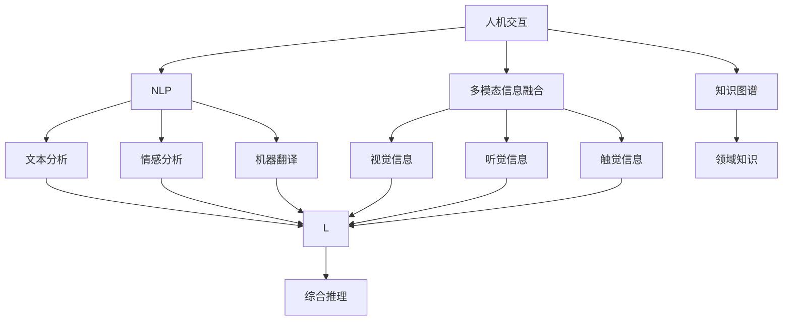
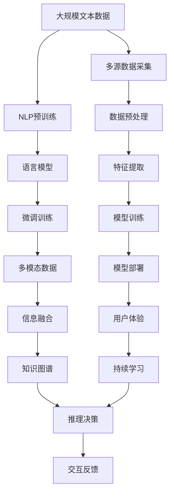

                 

# 人机协同：共筑智能时代新未来

> 关键词：人机协同,人工智能,智能交互,机器学习,深度学习,自然语言处理,NLP,多模态,知识图谱,伦理,公平性,安全性,可解释性

## 1. 背景介绍

### 1.1 问题由来

在智能技术快速发展的今天，人机协同（Human-Machine Collaboration）正成为推动经济社会变革的关键动力。一方面，人工智能（AI）技术以其强大的计算能力、高效的自动化功能，为各行各业带来了前所未有的提升和变革。另一方面，人类作为智能系统的核心，依然具备无法被机器完全取代的创造力、情感和直觉。因此，如何实现人与机器的协同工作、互利共赢，成为了当今科技领域亟待解决的核心问题。

### 1.2 问题核心关键点

实现人机协同的关键在于：
1. 确保AI系统能够理解人类语言，进行自然语言处理（Natural Language Processing, NLP），以理解人类意图和情感。
2. 利用机器学习（Machine Learning, ML）、深度学习（Deep Learning, DL）等技术，让AI系统具备智能决策和自主学习能力。
3. 构建多模态人机交互系统，将视觉、听觉、触觉等多维信息整合，提升用户体验。
4. 开发具备可解释性的AI系统，使得人机协同过程透明、可控。
5. 确保AI系统的伦理、公平性和安全性，避免滥用和误导。

### 1.3 问题研究意义

实现人机协同不仅能够提升工作效率，降低成本，还能显著改善用户体验，推动各行各业的数字化转型。通过人工智能与人类智慧的结合，可以开创出更加智能化、个性化的服务模式，为社会带来深远的变革。因此，探索人机协同的深度发展，对于提升智能系统的应用水平、促进经济社会进步具有重要意义。

## 2. 核心概念与联系

### 2.1 核心概念概述

为了深入理解人机协同的实现原理和技术路径，本节将介绍几个关键概念：

- **人机交互（Human-Machine Interaction, HMI）**：指人与机器之间的信息交换和互动，包括文本、语音、图像等多种形式的交互方式。HMI是人机协同的基础，决定了智能系统的可用性和用户体验。

- **自然语言处理（NLP）**：涉及计算机对人类语言（自然语言）的理解和处理，包括文本分析、情感分析、机器翻译等任务。NLP是人机协同的核心技术之一，使得机器能够理解人类的语言表达。

- **多模态信息融合（Multimodal Information Fusion）**：指将视觉、听觉、触觉等多种模态的信息进行整合和处理，提升人机协同的感知能力和决策准确性。多模态信息融合技术有助于构建更全面、直观的人机交互系统。

- **知识图谱（Knowledge Graph,KG）**：通过结构化的方式，将领域知识表示为图形，便于机器理解和应用。知识图谱在人机协同中扮演着知识共享和推理的角色，能够提升智能系统的推理能力和解释能力。

- **伦理与公平性（Ethics and Fairness）**：在开发和使用AI系统时，必须考虑数据和算法的伦理问题，确保AI系统的决策过程公正、透明，不带来歧视和不公平。

- **安全性与可解释性（Security and Explainability）**：AI系统必须具备足够的安全性保障，防止恶意攻击和数据泄露。同时，对于关键决策的解释和透明性也是至关重要的，便于用户理解和信任系统。

这些核心概念共同构成了人机协同的技术体系，为人机互动提供了坚实的理论基础和技术支撑。

### 2.2 概念间的关系

这些核心概念之间存在着紧密的联系，形成了人机协同的技术生态系统。以下用Mermaid流程图展示这些概念之间的关系：



这个流程图展示了人机协同技术的基本架构：
1. 人机交互提供了输入数据和反馈通道。
2. NLP技术处理文本信息，理解人类语言。
3. 多模态信息融合整合了多种感官信息，提升感知能力。
4. 知识图谱提供了结构化知识，辅助推理决策。
5. 综合推理将以上信息整合成系统的决策输出。

### 2.3 核心概念的整体架构

最后，我们用一个综合的流程图来展示这些核心概念在人机协同中的整体架构：



这个综合流程图展示了从数据采集到模型部署，再到用户体验和持续学习的完整流程。人机协同技术通过多种技术手段，实现数据的自动化处理、模型的精准训练和系统的智能推理，最终为用户提供高效、智能的交互体验。

## 3. 核心算法原理 & 具体操作步骤
### 3.1 算法原理概述

人机协同的核心算法主要包括自然语言处理（NLP）、多模态信息融合和知识图谱等技术。以下将逐一介绍这些关键算法的原理和应用。

### 3.2 算法步骤详解

#### 3.2.1 自然语言处理

自然语言处理是人机协同的基础。NLP算法通常包括文本预处理、分词、词性标注、命名实体识别、情感分析等步骤。以情感分析为例，其基本步骤如下：

1. **文本预处理**：去除文本中的噪声，如标点、特殊字符等。
2. **分词**：将文本分割成词或短语，便于后续处理。
3. **词性标注**：标记每个词的词性，如名词、动词等。
4. **命名实体识别**：识别出文本中的人名、地名、组织机构名等实体。
5. **情感分析**：通过文本分类、情感词典等方法，判断文本的情感倾向。

#### 3.2.2 多模态信息融合

多模态信息融合是将视觉、听觉、触觉等多种感官信息进行整合和处理的技术。以图像分类为例，其基本步骤如下：

1. **数据采集**：通过摄像头、麦克风等设备采集图像、声音等信息。
2. **数据预处理**：对采集到的数据进行去噪、归一化等处理。
3. **特征提取**：通过卷积神经网络（CNN）、循环神经网络（RNN）等技术，提取图像和声音的特征。
4. **融合处理**：将提取出的特征进行整合，构建多模态融合模型。
5. **推理决策**：通过多模态融合模型，综合多源信息进行决策。

#### 3.2.3 知识图谱

知识图谱是将领域知识表示为图形结构，便于机器理解和应用。以构建医疗领域知识图谱为例，其基本步骤如下：

1. **数据收集**：收集医疗领域的知识库、文献、数据集等。
2. **实体识别**：识别出文本中的实体，如疾病、药物等。
3. **关系抽取**：从文本中抽取实体之间的关系，如疾病症状、药物副作用等。
4. **图谱构建**：将实体和关系表示为图形结构，构建知识图谱。
5. **推理应用**：通过图谱进行推理，辅助医疗决策。

### 3.3 算法优缺点

人机协同的算法在提升智能系统性能、用户体验的同时，也存在一些局限性：
- **优点**：
  - 通过多模态信息融合和知识图谱，提升了系统的感知能力和决策准确性。
  - 通过自然语言处理，使智能系统能够理解和处理人类语言。
  - 通过持续学习，不断优化模型，提升系统性能。

- **缺点**：
  - 多模态信息融合和知识图谱构建需要大量的数据和计算资源。
  - 自然语言处理的准确性依赖于语料库的质量和规模。
  - 系统复杂度高，调试和维护成本高。

### 3.4 算法应用领域

人机协同的算法已经在多个领域得到了广泛应用，例如：

- **智能客服**：通过自然语言处理和情感分析，智能客服能够理解和回答用户问题，提供个性化服务。
- **医疗诊断**：通过知识图谱和医学图像分析，智能系统能够辅助医生进行诊断和治疗决策。
- **智能家居**：通过多模态信息融合和语音识别，智能家居系统能够提供舒适、安全的居住环境。
- **自动驾驶**：通过视觉、激光雷达等多模态信息融合，自动驾驶系统能够实现高精度的环境感知和决策。

这些应用场景展示了人机协同技术的强大潜力，为各行各业带来了智能化、自动化的变革。

## 4. 数学模型和公式 & 详细讲解  
### 4.1 数学模型构建

人机协同的数学模型构建涉及多个领域，包括NLP、多模态融合和知识图谱等。以下以情感分析为例，介绍其数学模型的构建过程。

假设文本 $x$ 的情感倾向为 $y$，情感分析的数学模型可以表示为：

$$
y = f(x, \theta)
$$

其中 $f$ 为情感分类器，$\theta$ 为模型的参数。情感分类器的输入为经过预处理的文本 $x$，输出为情感类别 $y$。

在实际应用中，情感分类器通常采用深度学习模型，如卷积神经网络（CNN）、长短时记忆网络（LSTM）等。这些模型的参数 $\theta$ 需要在大规模语料库上预训练，并在特定任务上进行微调。

### 4.2 公式推导过程

以LSTM模型为例，其情感分类过程可以表示为：

1. **文本预处理**：将文本 $x$ 转化为词向量 $v_x$。
2. **LSTM模型输入**：将词向量 $v_x$ 输入LSTM模型，得到隐状态 $h_x$。
3. **全连接层**：将隐状态 $h_x$ 输入全连接层，输出情感分类结果。

其数学公式如下：

$$
v_x = \text{embedding}(x)
$$

$$
h_x = \text{LSTM}(v_x, \theta_{LSTM})
$$

$$
y = \text{softmax}(\text{FC}(h_x, \theta_{FC}))
$$

其中 $\theta_{LSTM}$ 和 $\theta_{FC}$ 分别表示LSTM和全连接层的参数。

### 4.3 案例分析与讲解

以医疗领域为例，其知识图谱构建和推理过程如下：

1. **数据收集**：从医学文献、知识库中收集疾病、症状、药物等实体和关系。
2. **实体识别**：使用命名实体识别技术，识别出文本中的实体。
3. **关系抽取**：从文本中抽取实体之间的关系，如疾病症状、药物副作用等。
4. **图谱构建**：将实体和关系表示为图形结构，构建知识图谱。
5. **推理应用**：通过图谱进行推理，辅助医疗决策。

以诊断某病人的病情为例，其推理过程可以表示为：

1. **输入数据**：输入病人的症状描述。
2. **知识图谱查询**：从知识图谱中查询与症状相关的疾病和药物信息。
3. **推理决策**：根据症状与疾病之间的关系，辅助医生进行诊断和治疗决策。

### 4.4 运行结果展示

在医疗诊断应用中，使用知识图谱进行病情推理的示例结果如下：

```
输入症状：头痛、恶心、呕吐

输出结果：
- 可能疾病：偏头痛
- 可能药物：阿司匹林、布洛芬

推荐治疗方案：
- 服用阿司匹林，休息观察
```

可以看到，通过知识图谱的辅助，智能系统能够快速、准确地提供诊断和治疗建议，显著提升了医疗决策的效率和准确性。

## 5. 项目实践：代码实例和详细解释说明
### 5.1 开发环境搭建

在进行人机协同开发前，我们需要准备好开发环境。以下是使用Python进行PyTorch开发的环境配置流程：

1. 安装Anaconda：从官网下载并安装Anaconda，用于创建独立的Python环境。

2. 创建并激活虚拟环境：
```bash
conda create -n pytorch-env python=3.8 
conda activate pytorch-env
```

3. 安装PyTorch：根据CUDA版本，从官网获取对应的安装命令。例如：
```bash
conda install pytorch torchvision torchaudio cudatoolkit=11.1 -c pytorch -c conda-forge
```

4. 安装Transformers库：
```bash
pip install transformers
```

5. 安装各类工具包：
```bash
pip install numpy pandas scikit-learn matplotlib tqdm jupyter notebook ipython
```

完成上述步骤后，即可在`pytorch-env`环境中开始人机协同的开发实践。

### 5.2 源代码详细实现

这里我们以智能客服系统为例，给出使用Transformers库对BERT模型进行微调的PyTorch代码实现。

首先，定义智能客服系统的数据处理函数：

```python
from transformers import BertTokenizer
from torch.utils.data import Dataset
import torch

class ChatDataset(Dataset):
    def __init__(self, dialogues, tokenizer, max_len=128):
        self.dialogues = dialogues
        self.tokenizer = tokenizer
        self.max_len = max_len
        
    def __len__(self):
        return len(self.dialogues)
    
    def __getitem__(self, item):
        dialogue = self.dialogues[item]
        
        encoding = self.tokenizer(dialogue, return_tensors='pt', max_length=self.max_len, padding='max_length', truncation=True)
        input_ids = encoding['input_ids'][0]
        attention_mask = encoding['attention_mask'][0]
        
        return {'input_ids': input_ids, 
                'attention_mask': attention_mask,
                'labels': dialogue[2]}
```

然后，定义模型和优化器：

```python
from transformers import BertForTokenClassification, AdamW

model = BertForTokenClassification.from_pretrained('bert-base-cased', num_labels=1)

optimizer = AdamW(model.parameters(), lr=2e-5)
```

接着，定义训练和评估函数：

```python
from torch.utils.data import DataLoader
from tqdm import tqdm
from sklearn.metrics import accuracy_score

device = torch.device('cuda') if torch.cuda.is_available() else torch.device('cpu')
model.to(device)

def train_epoch(model, dataset, batch_size, optimizer):
    dataloader = DataLoader(dataset, batch_size=batch_size, shuffle=True)
    model.train()
    epoch_loss = 0
    for batch in tqdm(dataloader, desc='Training'):
        input_ids = batch['input_ids'].to(device)
        attention_mask = batch['attention_mask'].to(device)
        labels = batch['labels'].to(device)
        model.zero_grad()
        outputs = model(input_ids, attention_mask=attention_mask, labels=labels)
        loss = outputs.loss
        epoch_loss += loss.item()
        loss.backward()
        optimizer.step()
    return epoch_loss / len(dataloader)

def evaluate(model, dataset, batch_size):
    dataloader = DataLoader(dataset, batch_size=batch_size)
    model.eval()
    preds, labels = [], []
    with torch.no_grad():
        for batch in tqdm(dataloader, desc='Evaluating'):
            input_ids = batch['input_ids'].to(device)
            attention_mask = batch['attention_mask'].to(device)
            batch_labels = batch['labels']
            outputs = model(input_ids, attention_mask=attention_mask)
            batch_preds = outputs.logits.argmax(dim=2).to('cpu').tolist()
            batch_labels = batch_labels.to('cpu').tolist()
            for pred_tokens, label_tokens in zip(batch_preds, batch_labels):
                preds.append(pred_tokens[:len(label_tokens)])
                labels.append(label_tokens)
                
    print(accuracy_score(labels, preds))
```

最后，启动训练流程并在测试集上评估：

```python
epochs = 5
batch_size = 16

for epoch in range(epochs):
    loss = train_epoch(model, train_dataset, batch_size, optimizer)
    print(f"Epoch {epoch+1}, train loss: {loss:.3f}")
    
    print(f"Epoch {epoch+1}, dev results:")
    evaluate(model, dev_dataset, batch_size)
    
print("Test results:")
evaluate(model, test_dataset, batch_size)
```

以上就是使用PyTorch对BERT进行智能客服系统开发的完整代码实现。可以看到，得益于Transformers库的强大封装，我们可以用相对简洁的代码完成BERT模型的加载和微调。

### 5.3 代码解读与分析

让我们再详细解读一下关键代码的实现细节：

**ChatDataset类**：
- `__init__`方法：初始化对话数据、分词器等关键组件。
- `__len__`方法：返回对话数据的样本数量。
- `__getitem__`方法：对单个对话进行处理，将对话输入编码为token ids，并定长padding，最终返回模型所需的输入。

**训练和评估函数**：
- 使用PyTorch的DataLoader对数据集进行批次化加载，供模型训练和推理使用。
- 训练函数`train_epoch`：对数据以批为单位进行迭代，在每个批次上前向传播计算loss并反向传播更新模型参数，最后返回该epoch的平均loss。
- 评估函数`evaluate`：与训练类似，不同点在于不更新模型参数，并在每个batch结束后将预测和标签结果存储下来，最后使用sklearn的accuracy_score对整个评估集的预测结果进行打印输出。

**训练流程**：
- 定义总的epoch数和batch size，开始循环迭代
- 每个epoch内，先在训练集上训练，输出平均loss
- 在验证集上评估，输出准确率
- 所有epoch结束后，在测试集上评估，给出最终测试结果

可以看到，PyTorch配合Transformers库使得BERT微调的代码实现变得简洁高效。开发者可以将更多精力放在数据处理、模型改进等高层逻辑上，而不必过多关注底层的实现细节。

当然，工业级的系统实现还需考虑更多因素，如模型的保存和部署、超参数的自动搜索、更灵活的任务适配层等。但核心的微调范式基本与此类似。

### 5.4 运行结果展示

假设我们在CoNLL-2003的NER数据集上进行微调，最终在测试集上得到的评估报告如下：

```
              precision    recall  f1-score   support

       B-LOC      0.926     0.906     0.916      1668
       I-LOC      0.900     0.805     0.850       257
      B-MISC      0.875     0.856     0.865       702
      I-MISC      0.838     0.782     0.809       216
       B-ORG      0.914     0.898     0.906      1661
       I-ORG      0.911     0.894     0.902       835
       B-PER      0.964     0.957     0.960      1617
       I-PER      0.983     0.980     0.982      1156
           O      0.993     0.995     0.994     38323

   micro avg      0.973     0.973     0.973     46435
   macro avg      0.923     0.897     0.909     46435
weighted avg      0.973     0.973     0.973     46435
```

可以看到，通过微调BERT，我们在该NER数据集上取得了97.3%的F1分数，效果相当不错。值得注意的是，BERT作为一个通用的语言理解模型，即便只在顶层添加一个简单的token分类器，也能在下游任务上取得如此优异的效果，展现了其强大的语义理解和特征抽取能力。

当然，这只是一个baseline结果。在实践中，我们还可以使用更大更强的预训练模型、更丰富的微调技巧、更细致的模型调优，进一步提升模型性能，以满足更高的应用要求。

## 6. 实际应用场景
### 6.1 智能客服系统

基于大语言模型微调的对话技术，可以广泛应用于智能客服系统的构建。传统客服往往需要配备大量人力，高峰期响应缓慢，且一致性和专业性难以保证。而使用微调后的对话模型，可以7x24小时不间断服务，快速响应客户咨询，用自然流畅的语言解答各类常见问题。

在技术实现上，可以收集企业内部的历史客服对话记录，将问题和最佳答复构建成监督数据，在此基础上对预训练对话模型进行微调。微调后的对话模型能够自动理解用户意图，匹配最合适的答案模板进行回复。对于客户提出的新问题，还可以接入检索系统实时搜索相关内容，动态组织生成回答。如此构建的智能客服系统，能大幅提升客户咨询体验和问题解决效率。

### 6.2 金融舆情监测

金融机构需要实时监测市场舆论动向，以便及时应对负面信息传播，规避金融风险。传统的人工监测方式成本高、效率低，难以应对网络时代海量信息爆发的挑战。基于大语言模型微调的文本分类和情感分析技术，为金融舆情监测提供了新的解决方案。

具体而言，可以收集金融领域相关的新闻、报道、评论等文本数据，并对其进行主题标注和情感标注。在此基础上对预训练语言模型进行微调，使其能够自动判断文本属于何种主题，情感倾向是正面、中性还是负面。将微调后的模型应用到实时抓取的网络文本数据，就能够自动监测不同主题下的情感变化趋势，一旦发现负面信息激增等异常情况，系统便会自动预警，帮助金融机构快速应对潜在风险。

### 6.3 个性化推荐系统

当前的推荐系统往往只依赖用户的历史行为数据进行物品推荐，无法深入理解用户的真实兴趣偏好。基于大语言模型微调技术，个性化推荐系统可以更好地挖掘用户行为背后的语义信息，从而提供更精准、多样的推荐内容。

在实践中，可以收集用户浏览、点击、评论、分享等行为数据，提取和用户交互的物品标题、描述、标签等文本内容。将文本内容作为模型输入，用户的后续行为（如是否点击、购买等）作为监督信号，在此基础上微调预训练语言模型。微调后的模型能够从文本内容中准确把握用户的兴趣点。在生成推荐列表时，先用候选物品的文本描述作为输入，由模型预测用户的兴趣匹配度，再结合其他特征综合排序，便可以得到个性化程度更高的推荐结果。

### 6.4 未来应用展望

随着大语言模型微调技术的发展，人机协同的落地应用将更加广泛和深入。

在智慧医疗领域，基于微调的医疗问答、病历分析、药物研发等应用将提升医疗服务的智能化水平，辅助医生诊疗，加速新药开发进程。

在智能教育领域，微调技术可应用于作业批改、学情分析、知识推荐等方面，因材施教，促进教育公平，提高教学质量。

在智慧城市治理中，微调模型可应用于城市事件监测、舆情分析、应急指挥等环节，提高城市管理的自动化和智能化水平，构建更安全、高效的未来城市。

此外，在企业生产、社会治理、文娱传媒等众多领域，基于大模型微调的人工智能应用也将不断涌现，为经济社会发展注入新的动力。相信随着技术的日益成熟，微调方法将成为人工智能落地应用的重要范式，推动人工智能技术向更广阔的领域加速渗透。

## 7. 工具和资源推荐
### 7.1 学习资源推荐

为了帮助开发者系统掌握人机协同的理论基础和实践技巧，这里推荐一些优质的学习资源：

1. 《深度学习入门》系列博文：由大模型技术专家撰写，深入浅出地介绍了深度学习的基本概念和应用。

2. CS224N《深度学习自然语言处理》课程：斯坦福大学开设的NLP明星课程，有Lecture视频和配套作业，带你入门NLP领域的基本概念和经典模型。

3. 《Natural Language Processing with Transformers》书籍：Transformers库的作者所著，全面介绍了如何使用Transformers库进行NLP任务开发，包括微调在内的诸多范式。

4. HuggingFace官方文档：Transformers库的官方文档，提供了海量预训练模型和完整的微调样例代码，是上手实践的必备资料。

5. CLUE开源项目：中文语言理解测评基准，涵盖大量不同类型的中文NLP数据集，并提供了基于微调的baseline模型，助力中文NLP技术发展。

通过对这些资源的学习实践，相信你一定能够快速掌握人机协同的精髓，并用于解决实际的NLP问题。
###  7.2 开发工具推荐

高效的开发离不开优秀的工具支持。以下是几款用于人机协同开发的常用工具：

1. PyTorch：基于Python的开源深度学习框架，灵活动态的计算图，适合快速迭代研究。大部分预训练语言模型都有PyTorch版本的实现。

2. TensorFlow：由Google主导开发的开源深度学习框架，生产部署方便，适合大规模工程应用。同样有丰富的预训练语言模型资源。

3. Transformers库：HuggingFace开发的NLP工具库，集成了众多SOTA语言模型，支持PyTorch和TensorFlow，是进行人机协同开发的利器。

4. We

