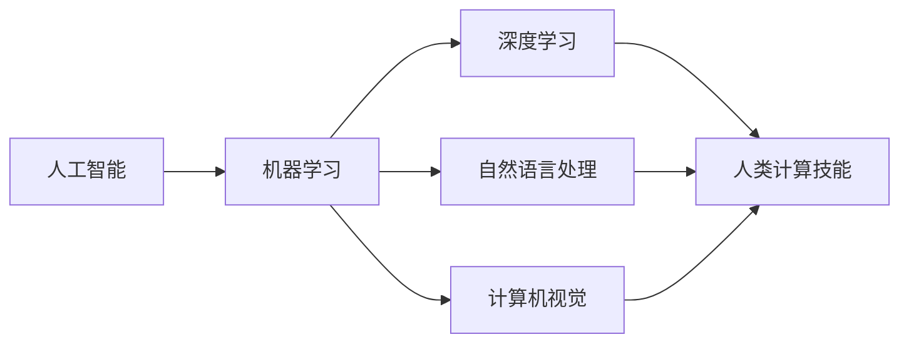
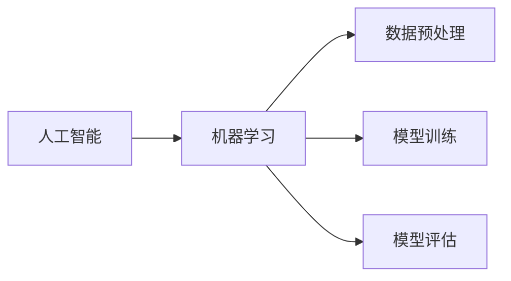
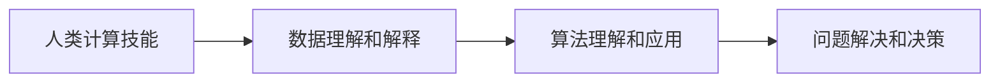
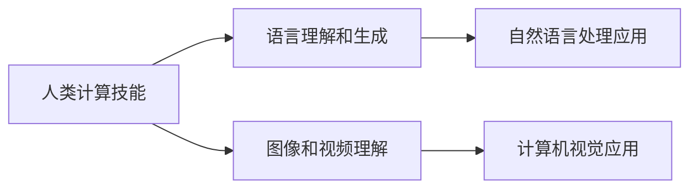
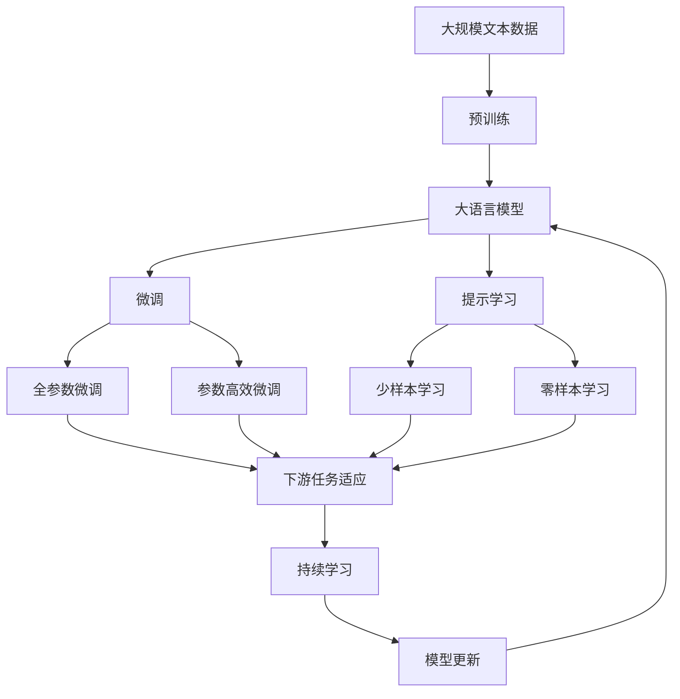

                 

# 人类计算：AI时代的未来技能发展

## 1. 背景介绍

### 1.1 问题由来
在AI时代，计算已经不再局限于传统意义上的数值计算，而是扩展到了更广泛的领域，包括模式识别、自然语言处理、机器视觉等。这种变化对人类计算技能提出了新的要求。传统计算机擅长处理大量数据，但人类在这方面的处理能力相对有限。因此，如何利用人工智能技术，提升人类在计算方面的能力，成为当前研究的热点问题。

### 1.2 问题核心关键点
人类计算技能的发展，与AI技术的进步密切相关。AI技术的发展不仅改变了计算机处理数据的方式，也为人类计算能力的提升提供了新的工具和方法。AI技术的核心在于算法和模型，而人类计算技能的核心在于理解和应用这些算法和模型。因此，AI时代下的人类计算，不仅要掌握传统的数据处理技能，还需要学习新的算法和模型，以适应日益复杂的数据处理需求。

### 1.3 问题研究意义
研究AI时代的未来技能发展，对于推动人类计算技能与AI技术的融合，具有重要意义：

1. **提升数据处理能力**：AI技术可以处理海量数据，而人类计算技能可以在AI的帮助下，更好地理解和解释这些数据，提升数据处理能力。
2. **促进跨学科应用**：AI技术与不同学科的结合，可以带来更多创新应用，而人类计算技能可以为这些应用提供理论基础和实际操作方法。
3. **推动教育改革**：未来的教育应该注重培养学生的计算思维和创新能力，适应AI时代的计算需求。
4. **促进产业升级**：通过提升人类计算技能，可以加速传统行业的数字化转型，推动产业升级。
5. **赋能职业发展**：新型的AI技能将成为未来职业的核心竞争力，而人类计算技能将是这些技能的基础。

## 2. 核心概念与联系

### 2.1 核心概念概述

为更好地理解AI时代的未来技能发展，本节将介绍几个密切相关的核心概念：

- **人工智能（AI）**：一种模拟人类智能的技术，包括机器学习、深度学习、自然语言处理、计算机视觉等领域。
- **机器学习（ML）**：通过算法和模型，让计算机从数据中自动学习和改进，而无需明确编程。
- **深度学习（DL）**：一种基于神经网络结构的机器学习技术，可以处理复杂的非线性关系。
- **自然语言处理（NLP）**：使计算机能够理解、分析和生成人类语言的技术。
- **计算机视觉（CV）**：使计算机能够处理和理解图像和视频的技术。
- **人类计算技能**：人类在数据处理、算法理解、问题解决等方面的能力，尤其是在处理大规模数据、复杂模型、多模态信息等方面的能力。

这些核心概念之间的逻辑关系可以通过以下Mermaid流程图来展示：



这个流程图展示了大语言模型微调过程中各个核心概念之间的关系：

1. AI技术通过机器学习、深度学习等方法，从数据中提取规律和知识。
2. 机器学习和深度学习需要算法和模型，这些算法和模型是人工智能的核心。
3. 人类计算技能是在AI技术的辅助下，提升的数据处理、算法理解、问题解决等方面的能力。
4. NLP和CV是AI技术的具体应用，能够提升人类计算技能在特定领域的应用。

### 2.2 概念间的关系

这些核心概念之间存在着紧密的联系，形成了AI时代未来技能发展的完整生态系统。下面我通过几个Mermaid流程图来展示这些概念之间的关系。

#### 2.2.1 AI与ML的关系



这个流程图展示了AI与机器学习的关系：

1. AI技术通过机器学习，从数据中提取规律和知识。
2. 机器学习包括数据预处理、模型训练和模型评估等环节，是AI技术的重要组成部分。

#### 2.2.2 人类计算技能与AI技能的关系



这个流程图展示了人类计算技能与AI技能的关系：

1. 人类计算技能是在AI技术的辅助下，提升的数据理解和解释、算法理解和应用、问题解决和决策等方面的能力。
2. 人类计算技能需要借助AI技术，才能更好地处理复杂数据、应用复杂模型、解决复杂问题。

#### 2.2.3 人类计算技能与NLP、CV等应用的关系



这个流程图展示了人类计算技能与NLP、CV等应用的关系：

1. 人类计算技能可以通过NLP和CV等AI应用，提升在自然语言理解和生成、图像和视频理解等方面的能力。
2. NLP和CV等应用需要人类计算技能的支持，才能更好地理解和处理自然语言、图像和视频等数据。

### 2.3 核心概念的整体架构

最后，我们用一个综合的流程图来展示这些核心概念在大语言模型微调过程中的整体架构：



这个综合流程图展示了从预训练到微调，再到持续学习的完整过程。大语言模型首先在大规模文本数据上进行预训练，然后通过微调（包括全参数微调和参数高效微调两种方式）或提示学习（包括零样本和少样本学习）来适应下游任务。最后，通过持续学习技术，模型可以不断学习新知识，同时避免遗忘旧知识。 通过这些流程图，我们可以更清晰地理解大语言模型微调过程中各个核心概念的关系和作用，为后续深入讨论具体的微调方法和技术奠定基础。

## 3. 核心算法原理 & 具体操作步骤
### 3.1 算法原理概述

人类计算技能的发展，与AI技术的应用密切相关。AI技术的核心在于算法和模型，而人类计算技能的核心在于理解和应用这些算法和模型。因此，AI时代下的人类计算，不仅要掌握传统的数据处理技能，还需要学习新的算法和模型，以适应日益复杂的数据处理需求。

AI时代下的算法和模型，主要包括深度学习、自然语言处理、计算机视觉等领域。以下以深度学习为例，介绍其核心算法原理：

深度学习是一种基于神经网络结构的机器学习技术。其主要思想是通过多层神经网络，构建复杂的非线性映射关系，从而实现对数据的自动学习和建模。深度学习的基本算法流程包括以下几个步骤：

1. **数据预处理**：将原始数据进行归一化、清洗、标注等处理，准备好用于模型训练的数据。
2. **模型构建**：设计并构建神经网络模型，包括定义网络结构、设置初始权重等。
3. **模型训练**：使用训练数据集对模型进行迭代训练，通过反向传播算法计算梯度，更新模型参数。
4. **模型评估**：使用验证数据集对模型进行评估，计算模型的性能指标，如准确率、召回率等。
5. **模型应用**：将训练好的模型应用于实际问题，进行预测、分类、回归等任务。

### 3.2 算法步骤详解

以下以深度学习为例，详细介绍其核心算法步骤：

**Step 1: 数据预处理**

数据预处理是深度学习模型训练的第一步。预处理过程主要包括：

1. 数据清洗：去除数据中的噪声、缺失值等，保证数据质量。
2. 数据归一化：将数据进行归一化处理，使其在相同的尺度上。
3. 数据标注：对数据进行标注，将其转换为模型可接受的格式。
4. 数据划分：将数据划分为训练集、验证集和测试集，用于模型训练、验证和测试。

**Step 2: 模型构建**

模型构建是深度学习模型的核心。主要包括以下几个步骤：

1. 定义网络结构：根据任务需求，选择合适的神经网络结构，如卷积神经网络（CNN）、循环神经网络（RNN）等。
2. 设置初始权重：对模型的权重进行初始化，通常使用随机初始化或预训练模型初始化。
3. 定义损失函数：根据任务需求，选择合适的损失函数，如交叉熵损失、均方误差损失等。
4. 定义优化器：根据任务需求，选择合适的优化器，如Adam、SGD等。

**Step 3: 模型训练**

模型训练是深度学习模型的重要步骤。主要包括以下几个步骤：

1. 前向传播：将训练数据输入模型，计算模型的输出。
2. 计算损失：计算模型的输出与真实标签之间的损失。
3. 反向传播：通过反向传播算法，计算梯度，更新模型参数。
4. 迭代训练：不断迭代训练，直至模型收敛。

**Step 4: 模型评估**

模型评估是深度学习模型的重要环节。主要包括以下几个步骤：

1. 计算性能指标：使用验证数据集计算模型的性能指标，如准确率、召回率等。
2. 调整模型参数：根据性能指标，调整模型参数，以优化模型性能。
3. 评估模型效果：使用测试数据集评估模型的效果，确保模型的泛化能力。

**Step 5: 模型应用**

模型应用是深度学习模型的最终环节。主要包括以下几个步骤：

1. 数据输入：将待预测数据输入模型。
2. 计算输出：计算模型的输出，得到预测结果。
3. 应用结果：将预测结果应用于实际问题，解决实际问题。

### 3.3 算法优缺点

深度学习算法具有以下优点：

1. 自动学习能力：深度学习算法可以自动从数据中学习规律和知识，无需手动编程。
2. 处理复杂数据：深度学习算法可以处理复杂的非线性关系，适用于大规模、高维度的数据。
3. 应用广泛：深度学习算法可以应用于图像、语音、自然语言处理等多个领域。

深度学习算法也存在一些缺点：

1. 计算资源需求高：深度学习算法需要大量的计算资源，包括高性能的CPU、GPU等。
2. 数据需求大：深度学习算法需要大量的标注数据，数据获取成本高。
3. 模型复杂度高：深度学习算法需要设计复杂的神经网络结构，调试难度大。
4. 过拟合风险高：深度学习算法容易过拟合，需要采取一些正则化技术来避免过拟合。

### 3.4 算法应用领域

深度学习算法已经广泛应用于各个领域，以下是几个典型的应用领域：

- **图像识别**：如人脸识别、物体检测、图像分类等。
- **自然语言处理**：如文本分类、机器翻译、情感分析等。
- **语音识别**：如语音识别、语音合成、语音情感识别等。
- **医疗诊断**：如医学影像分析、疾病预测、基因组学等。
- **金融分析**：如股票预测、信用评分、风险评估等。
- **智能制造**：如智能制造、工业视觉、质量检测等。

## 4. 数学模型和公式 & 详细讲解  
### 4.1 数学模型构建

深度学习算法基于神经网络结构，主要通过反向传播算法进行训练。以下以卷积神经网络（CNN）为例，介绍其数学模型构建：

卷积神经网络是一种常用的深度学习模型，主要由卷积层、池化层、全连接层等组成。其数学模型构建过程包括以下几个步骤：

1. **输入层**：输入数据，通常为图像、文本等高维数据。
2. **卷积层**：通过卷积操作，提取输入数据的特征。
3. **池化层**：通过池化操作，降低特征的维度，减少计算量。
4. **全连接层**：通过全连接操作，将特征映射到输出结果。
5. **输出层**：输出结果，通常为分类、回归等任务的结果。

**Step 1: 定义输入和输出**

设输入数据为 $x \in \mathbb{R}^{n_1 \times n_2 \times d}$，输出结果为 $y \in \mathbb{R}^{1 \times 1 \times k}$。

**Step 2: 定义卷积操作**

设卷积核为 $w \in \mathbb{R}^{f_1 \times f_2 \times d \times k}$，其中 $f_1$、$f_2$ 为卷积核的大小，$k$ 为输出的通道数。

卷积操作定义为：

$$
y = \sigma(\sum_{i=1}^{k} \sum_{j=1}^{d} \sum_{l=1}^{f_1} \sum_{m=1}^{f_2} w_{i,j,l,m} * x_{i,j,l,m} + b_i
$$

其中 $\sigma$ 为激活函数，$*$ 为卷积操作，$b_i$ 为偏置项。

**Step 3: 定义池化操作**

设池化操作为 $P(\cdot)$，通常采用最大池化或平均池化等方法。

池化操作定义为：

$$
y = P(\sigma(\sum_{i=1}^{k} \sum_{j=1}^{d} \sum_{l=1}^{f_1} \sum_{m=1}^{f_2} w_{i,j,l,m} * x_{i,j,l,m} + b_i)
$$

**Step 4: 定义全连接层**

设全连接层的权重为 $W \in \mathbb{R}^{k \times s}$，偏置项为 $b \in \mathbb{R}^{s}$，其中 $s$ 为输出的维度。

全连接层定义为：

$$
z = Wx + b
$$

**Step 5: 定义输出层**

设输出层为 $y \in \mathbb{R}^{1 \times 1 \times k}$。

输出层定义为：

$$
y = softmax(z)
$$

### 4.2 公式推导过程

以下以卷积神经网络（CNN）为例，详细推导其前向传播和反向传播算法的公式。

**前向传播算法**

前向传播算法用于计算模型的输出，主要包括以下几个步骤：

1. 卷积层：将输入数据与卷积核进行卷积操作，得到卷积结果。
2. 池化层：对卷积结果进行池化操作，降低特征的维度。
3. 全连接层：将池化结果与全连接层的权重和偏置项进行矩阵乘法和偏置项加和操作，得到全连接层的输出。
4. 输出层：对全连接层的输出进行激活函数操作，得到最终的输出结果。

前向传播算法的公式推导如下：

$$
y_1 = \sigma(\sum_{i=1}^{k} \sum_{j=1}^{d} \sum_{l=1}^{f_1} \sum_{m=1}^{f_2} w_{i,j,l,m} * x_{i,j,l,m} + b_i)
$$

$$
y_2 = P(y_1)
$$

$$
z = Wy_2 + b
$$

$$
y = softmax(z)
$$

**反向传播算法**

反向传播算法用于计算梯度，更新模型参数。主要包括以下几个步骤：

1. 输出层：计算输出层与真实标签之间的交叉熵损失。
2. 全连接层：计算全连接层的梯度。
3. 卷积层：计算卷积层的梯度。
4. 输入层：更新模型参数。

反向传播算法的公式推导如下：

$$
l = -\sum_{i=1}^{k} y_i \log y_i
$$

$$
\frac{\partial l}{\partial z} = y - \hat{y}
$$

$$
\frac{\partial l}{\partial W} = y_2^T \frac{\partial l}{\partial z}
$$

$$
\frac{\partial l}{\partial b} = \frac{\partial l}{\partial z}
$$

$$
\frac{\partial l}{\partial y_1} = \frac{\partial l}{\partial z} * \frac{\partial z}{\partial y_1}
$$

$$
\frac{\partial l}{\partial w} = x * \frac{\partial l}{\partial y_1}
$$

$$
\frac{\partial l}{\partial x} = w^T * \frac{\partial l}{\partial y_1}
$$

其中 $l$ 为输出层与真实标签之间的交叉熵损失，$y$ 为输出层的实际输出，$\hat{y}$ 为输出层的期望输出。

### 4.3 案例分析与讲解

以下以图像分类任务为例，详细讲解深度学习算法在实际应用中的具体实现。

**案例背景**

图像分类任务是指将输入的图像数据进行分类，如识别猫、狗等动物。该任务通常采用卷积神经网络（CNN）进行建模。

**案例实现**

1. 数据预处理：将原始图像数据进行归一化、清洗、标注等处理，准备好用于模型训练的数据。
2. 模型构建：设计并构建卷积神经网络（CNN）模型，包括定义网络结构、设置初始权重等。
3. 模型训练：使用训练数据集对模型进行迭代训练，通过反向传播算法计算梯度，更新模型参数。
4. 模型评估：使用验证数据集对模型进行评估，计算模型的性能指标，如准确率、召回率等。
5. 模型应用：将训练好的模型应用于实际问题，进行图像分类等任务。

以下是一个简单的卷积神经网络（CNN）模型的实现代码：

```python
import torch
import torch.nn as nn
import torch.optim as optim
import torchvision.transforms as transforms
import torchvision.datasets as datasets

# 定义网络结构
class CNN(nn.Module):
    def __init__(self):
        super(CNN, self).__init__()
        self.conv1 = nn.Conv2d(3, 32, kernel_size=3, stride=1, padding=1)
        self.relu1 = nn.ReLU()
        self.pool1 = nn.MaxPool2d(kernel_size=2, stride=2)
        self.conv2 = nn.Conv2d(32, 64, kernel_size=3, stride=1, padding=1)
        self.relu2 = nn.ReLU()
        self.pool2 = nn.MaxPool2d(kernel_size=2, stride=2)
        self.fc1 = nn.Linear(7*7*64, 128)
        self.relu3 = nn.ReLU()
        self.fc2 = nn.Linear(128, 10)

    def forward(self, x):
        x = self.conv1(x)
        x = self.relu1(x)
        x = self.pool1(x)
        x = self.conv2(x)
        x = self.relu2(x)
        x = self.pool2(x)
        x = x.view(-1, 7*7*64)
        x = self.fc1(x)
        x = self.relu3(x)
        x = self.fc2(x)
        return x

# 定义数据预处理
transform = transforms.Compose([
    transforms.Resize(224),
    transforms.ToTensor(),
    transforms.Normalize(mean=[0.485, 0.456, 0.406], std=[0.229, 0.224, 0.225])
])

# 定义训练集和测试集
train_dataset = datasets.CIFAR10(root='./data', train=True, download=True, transform=transform)
train_loader = torch.utils.data.DataLoader(train_dataset, batch_size=64, shuffle=True)

test_dataset = datasets.CIFAR10(root='./data', train=False, download=True, transform=transform)
test_loader = torch.utils.data.DataLoader(test_dataset, batch_size=64, shuffle=False)

# 定义模型、优化器、损失函数
model = CNN()
optimizer = optim.Adam(model.parameters(), lr=0.001)
criterion = nn.CrossEntropyLoss()

# 训练模型
for epoch in range(10):
    for i, (images, labels) in enumerate(train_loader):
        images, labels = images.to(device), labels.to(device)
        optimizer.zero_grad()
        outputs = model(images)
        loss = criterion(outputs, labels)
        loss.backward()
        optimizer.step()
        if (i+1) % 100 == 0:
            print(f'Epoch [{epoch+1}/{10}], Step [{i+1}], Loss: {loss.item():.4f}')

# 评估模型
correct = 0
total = 0
with torch.no_grad():
    for images, labels in test_loader:
        images, labels = images.to(device), labels.to(device)
        outputs = model(images)
        _, predicted = torch.max(outputs.data, 1)
        total += labels.size(0)
        correct += (predicted == labels).sum().item()

print(f'Accuracy of the model on the test images: {100 * correct / total:.2f}%')
```

通过以上代码，我们可以看到，深度学习算法在图像分类任务中的应用，主要通过定义卷积神经网络（CNN）模型、设置优化器和损失函数、迭代训练和评估等步骤，实现对图像数据的自动分类。

## 5. 项目实践：代码实例和详细解释说明
### 5.1 开发环境搭建

在进行深度学习算法开发前，我们需要准备好开发环境。以下是使用Python进行PyTorch开发的环境配置流程：

1. 安装Anaconda：从官网下载并安装Anaconda，用于创建独立的Python环境。

2. 创建并激活虚拟环境：
```bash
conda create -n pytorch-env python=3.8 
conda activate pytorch-env
```

3. 安装PyTorch：根据CUDA版本，从官网获取对应的安装命令。例如：
```bash
conda install pytorch torchvision torchaudio cudatoolkit=11.1 -c pytorch -c conda-forge
```

4. 安装TensorFlow：从官网下载对应的安装命令。例如：
```bash
conda install tensorflow
```

5. 安装各类工具包：
```bash
pip install numpy pandas scikit-learn matplotlib tqdm jupyter notebook ipython
```

完成上述步骤后，即可在`pytorch-env`环境中开始深度学习算法的开发。

### 5.2 源代码详细实现

这里我们以图像分类任务为例，给出使用PyTorch进行深度学习算法的PyTorch代码实现。

首先，定义图像分类任务的数据处理函数：

```python
import torch
import torch.nn as nn
import torch.optim as optim
import torchvision.transforms as transforms
import torchvision.datasets as datasets

# 定义数据预处理
transform = transforms.Compose([
    transforms.Resize(224),
    transforms.ToTensor(),
    transforms.Normalize(mean=[0.485, 0.456, 0.406], std=[0.229, 0.224, 0.225])
])

# 定义训练集和测试集
train_dataset = datasets.CIFAR10(root='./data', train=True, download=True, transform=transform)
train_loader = torch.utils.data.DataLoader(train_dataset, batch_size=64, shuffle=True)

test_dataset = datasets.CIFAR10(root='./data', train=False, download=True, transform=transform)
test_loader = torch.utils.data.DataLoader(test_dataset, batch_size=64, shuffle=False)
```

然后，定义模型和优化器：

```python
# 定义网络结构
class CNN(nn.Module):
    def __init__(self):
        super(CNN, self).__init__()
        self.conv1 = nn.Conv2d(3, 32, kernel_size=3, stride=1, padding=1)
        self.relu1 = nn.ReLU()
        self.pool1 = nn.MaxPool2d(kernel_size=2, stride=2)
        self.conv2 = nn.Conv2d(32, 64, kernel_size=3, stride=1, padding=1)
        self.relu2 = nn.ReLU()
        self.pool2 = nn.MaxPool2d(kernel_size=2, stride=2)
        self.fc1 = nn.Linear(7*7*64, 128)
        self.relu3 = nn.ReLU()
        self.fc2 = nn.Linear(128, 10)

    def forward(self, x):
        x = self.conv1(x)
        x = self.relu1(x)
        x = self.pool1(x)
        x = self.conv2(x)
        x = self.relu2(x)
        x = self.pool2(x)
        x = x.view(-1, 7*7*64)
        x = self.fc1(x)
        x = self.relu3(x)
        x = self.fc2(x)
        return x

# 定义模型、优化器、损失函数
model = CNN()
optimizer = optim.Adam(model.parameters(), lr=0.001)
criterion = nn.CrossEntropyLoss()
```

接着，定义训练和评估函数：

```python
# 定义训练函数
def train_epoch(model, device, train_loader, optimizer, criterion):
    model.train()
    epoch_loss = 0
    for batch in train_loader:
        images, labels = batch[0].to(device), batch[1].to(device)
        optimizer.zero_grad()
        outputs = model(images)
        loss = criterion(outputs

