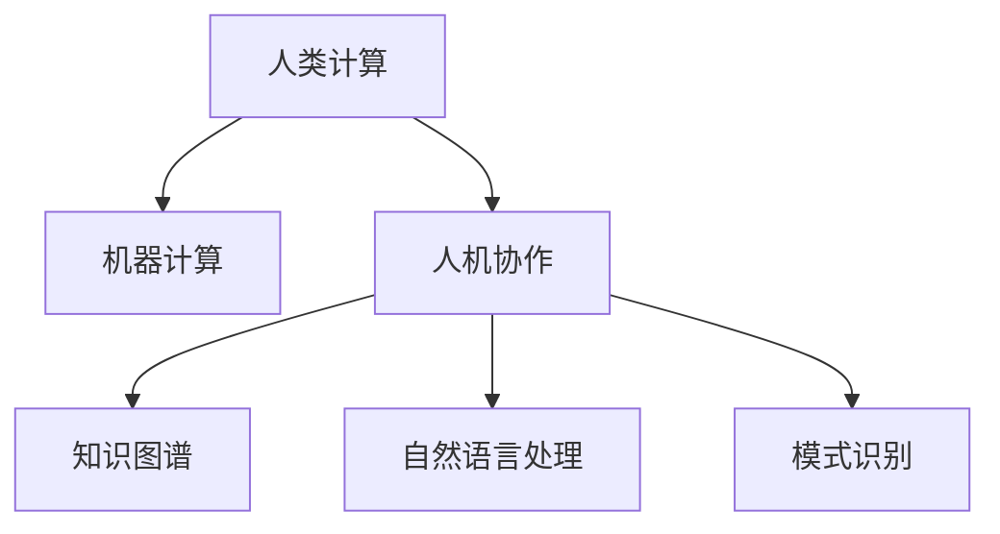
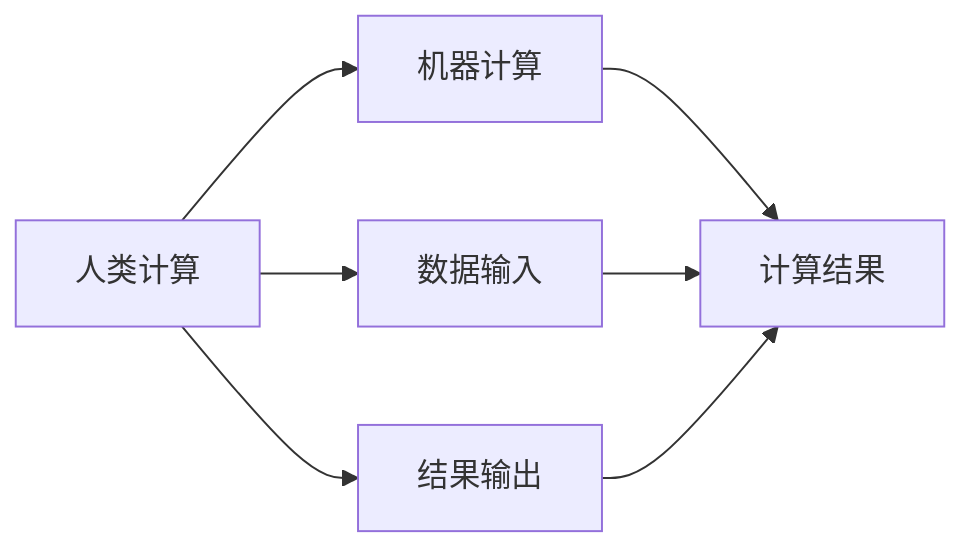
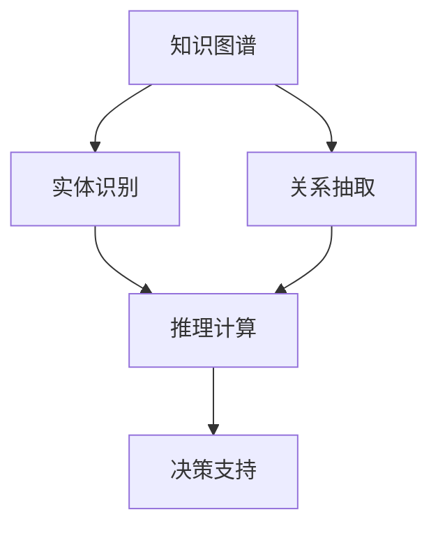
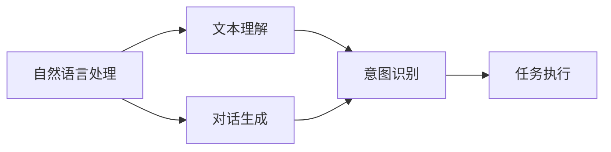
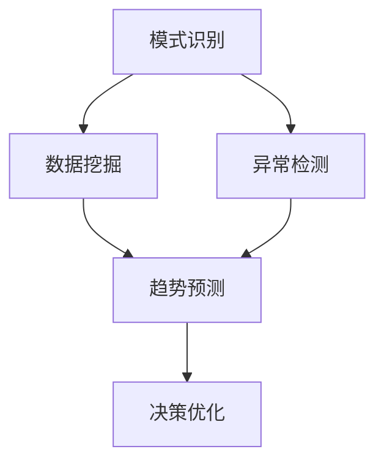
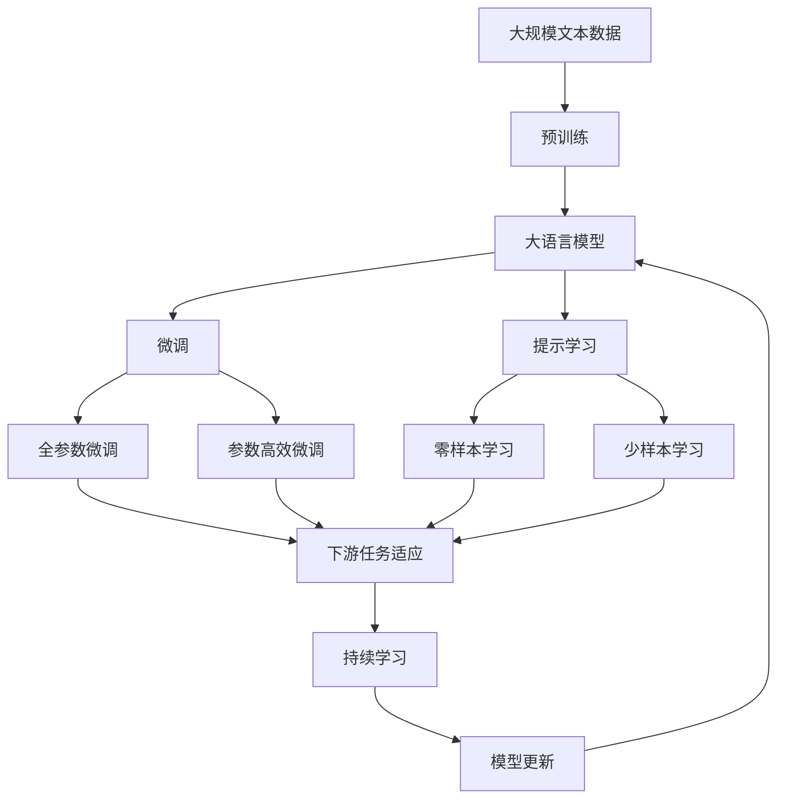

                 

# 人类计算：应用与案例分析

## 1. 背景介绍

### 1.1 问题由来

随着人工智能技术的快速发展，尤其是深度学习和大数据技术的推动，计算能力呈现出爆炸式增长。然而，即使在这些技术的帮助下，传统计算机依然存在一些无法解决的问题，特别是在处理复杂的、不确定的或非结构化数据时。这些问题通常需要人类干预和计算，从而推动了“人类计算”概念的发展。

### 1.2 问题核心关键点

人类计算的核心在于将人类智能与机器计算相结合，利用人类的直觉、判断力和创造力来解决机器难以处理的复杂问题。其主要特点包括：

- **数据理解**：处理非结构化数据，如图像、语音和文本，以及需要人类直觉和创造力的场景。
- **决策支持**：在需要复杂决策的场景下，利用人类的专业知识进行支持。
- **数据验证**：通过人工校验机器计算结果的准确性和可靠性。
- **问题解决**：解决机器难以解决的开放性问题。

这些特点使得人类计算在许多领域中发挥了重要作用，如医学诊断、金融风险评估、法医学分析等。

### 1.3 问题研究意义

研究人类计算的应用和案例，对于推动人工智能技术的发展、提升机器的智能水平、拓展人类计算的边界，具有重要意义：

1. **提高人工智能的通用性**：通过结合人类智能，AI能够处理更复杂、更多样化的任务，提高其适应性。
2. **促进跨学科发展**：人类计算涉及多学科知识的整合，促进了人工智能与心理学、哲学、社会学等领域的交叉研究。
3. **提升人机协作效率**：通过合理利用人类和机器的优点，实现人机协作，提升整体效率。
4. **解决AI的局限性**：机器难以处理的问题往往需要人类智能的支持，通过人类计算弥补AI的局限性。
5. **推动智能化应用落地**：人类计算的应用场景往往具有实际意义，通过人类计算的研究，推动AI技术在实际中的应用。

## 2. 核心概念与联系

### 2.1 核心概念概述

为更好地理解人类计算的应用，本节将介绍几个密切相关的核心概念：

- **人类计算**：指利用人类的直觉、判断力和创造力，结合机器计算，解决复杂问题的过程。
- **机器计算**：指利用计算机进行高效、准确的数值计算和逻辑推理，尤其是在处理大规模数据和复杂算法时。
- **人机协作**：指人类和机器在任务执行中相互补充，共同完成目标。
- **知识图谱**：用于描述实体及其关系的数据结构，帮助机器理解和推理复杂概念。
- **自然语言处理**：涉及计算机理解和处理人类语言的技术，是人类计算中重要的一环。
- **模式识别**：利用机器学习技术，从数据中识别出有意义的规律和模式，用于决策和预测。

这些核心概念之间的逻辑关系可以通过以下Mermaid流程图来展示：



这个流程图展示了大语言模型微调过程中各个核心概念的关系和作用。

### 2.2 概念间的关系

这些核心概念之间存在着紧密的联系，形成了人类计算的完整生态系统。下面我通过几个Mermaid流程图来展示这些概念之间的关系。

#### 2.2.1 人类计算与机器计算的结合



这个流程图展示了人类计算和机器计算在数据处理中的结合过程。人类提供数据和结果输出，机器进行计算，两者协同完成复杂任务。

#### 2.2.2 知识图谱在人类计算中的应用



这个流程图展示了知识图谱在复杂问题解决中的应用。知识图谱通过实体识别和关系抽取，帮助机器理解问题背景，通过推理计算得到结果，支持决策过程。

#### 2.2.3 自然语言处理在人类计算中的作用



这个流程图展示了自然语言处理在人类计算中的作用。通过文本理解，机器能够更好地与人类交互，通过对话生成、意图识别等技术，帮助机器理解和执行复杂任务。

#### 2.2.4 模式识别在人类计算中的重要性



这个流程图展示了模式识别在人类计算中的重要性。通过数据挖掘、异常检测等技术，机器能够识别出有意义的规律和模式，辅助人类进行决策优化。

### 2.3 核心概念的整体架构

最后，我们用一个综合的流程图来展示这些核心概念在大语言模型微调过程中的整体架构：



这个综合流程图展示了从预训练到微调，再到持续学习的完整过程。大语言模型首先在大规模文本数据上进行预训练，然后通过微调（包括全参数微调和参数高效微调）或提示学习（包括零样本和少样本学习）来适应下游任务。最后，通过持续学习技术，模型可以不断更新和适应新的任务和数据。 通过这些流程图，我们可以更清晰地理解人类计算在大语言模型微调过程中各个核心概念的关系和作用。

## 3. 核心算法原理 & 具体操作步骤
### 3.1 算法原理概述

基于人类计算的大语言模型微调，本质上是一个多层次、多维度的协同计算过程。其核心思想是：利用人类的直觉、判断力和创造力，结合机器计算，解决复杂问题。具体来说，人类计算涉及以下几个关键步骤：

1. **数据收集与预处理**：收集和预处理用于微调的标注数据集，包括数据清洗、特征提取等。
2. **知识图谱构建**：构建用于实体识别和关系抽取的知识图谱，辅助机器进行推理计算。
3. **自然语言处理**：通过自然语言处理技术，将文本数据转化为机器可处理的格式，如实体抽取、意图识别等。
4. **模式识别**：利用机器学习技术，从标注数据中识别出有意义的规律和模式，用于任务执行。
5. **人机协作**：在机器计算过程中，引入人类干预，验证和修正计算结果。

### 3.2 算法步骤详解

基于人类计算的大语言模型微调一般包括以下几个关键步骤：

**Step 1: 准备数据集与知识图谱**

- 收集用于微调的任务标注数据集，并进行预处理。
- 构建或获取与任务相关的知识图谱，帮助机器理解和推理。

**Step 2: 设计任务适配层**

- 根据任务类型，在预训练模型顶层设计合适的输出层和损失函数。

**Step 3: 设置微调超参数**

- 选择合适的优化算法及其参数，如 AdamW、SGD 等，设置学习率、批大小、迭代轮数等。
- 设置正则化技术及强度，包括权重衰减、Dropout、Early Stopping 等。
- 确定冻结预训练参数的策略，如仅微调顶层，或全部参数都参与微调。

**Step 4: 执行梯度训练**

- 将训练集数据分批次输入模型，前向传播计算损失函数。
- 反向传播计算参数梯度，根据设定的优化算法和学习率更新模型参数。
- 周期性在验证集上评估模型性能，根据性能指标决定是否触发 Early Stopping。
- 重复上述步骤直到满足预设的迭代轮数或 Early Stopping 条件。

**Step 5: 测试和部署**

- 在测试集上评估微调后模型 $M_{\hat{\theta}}$ 的性能，对比微调前后的精度提升。
- 使用微调后的模型对新样本进行推理预测，集成到实际的应用系统中。
- 持续收集新的数据，定期重新微调模型，以适应数据分布的变化。

以上是基于人类计算的大语言模型微调的一般流程。在实际应用中，还需要针对具体任务的特点，对微调过程的各个环节进行优化设计，如改进训练目标函数，引入更多的正则化技术，搜索最优的超参数组合等，以进一步提升模型性能。

### 3.3 算法优缺点

基于人类计算的大语言模型微调方法具有以下优点：

- **灵活性高**：通过结合人类智慧和机器计算，能够灵活应对各种复杂问题。
- **鲁棒性强**：引入人类干预，能够有效防止机器计算过程中的过拟合和错误。
- **适应性强**：能够适应多领域、多任务的需求，提高机器的通用性。
- **可解释性强**：人类计算过程可解释性强，有助于理解模型的决策逻辑。

同时，该方法也存在一些局限性：

- **依赖标注数据**：微调效果很大程度上取决于标注数据的质量和数量，获取高质量标注数据的成本较高。
- **计算复杂度高**：人类计算过程中涉及人工干预，计算复杂度较高，难以大规模应用。
- **难以量化**：人类计算的某些部分难以量化，难以进行自动化和标准化。
- **受人类影响大**：依赖人类的判断和经验，可能受到主观因素的影响。

尽管存在这些局限性，但就目前而言，基于人类计算的微调方法仍是一种有效的方法，能够显著提升机器的智能水平。未来相关研究的重点在于如何进一步降低微调对标注数据的依赖，提高机器的自主学习能力和自适应能力。

### 3.4 算法应用领域

基于人类计算的大语言模型微调方法在多个领域中得到了广泛应用，包括：

- **医学诊断**：利用人类计算解决复杂的医学影像分析和诊断问题。
- **金融风险评估**：通过结合人类经验和机器计算，提高风险评估的准确性和可靠性。
- **法医学分析**：在犯罪现场调查和案件分析中，结合人类的专业知识，提高分析的准确性和效率。
- **智能客服**：利用人类计算解决复杂的多轮对话和情感分析问题。
- **自然语言处理**：通过自然语言处理技术，提升机器对复杂文本的理解和生成能力。
- **模式识别**：在数据挖掘、异常检测等场景中，提高机器的自主识别和预测能力。

除了上述这些经典应用外，人类计算技术还在更多领域中得到创新性的应用，如智能推荐、智能写作、智能设计等，为人工智能技术的发展带来了新的突破。

## 4. 数学模型和公式 & 详细讲解 & 举例说明

### 4.1 数学模型构建

本节将使用数学语言对基于人类计算的大语言模型微调过程进行更加严格的刻画。

记预训练语言模型为 $M_{\theta}:\mathcal{X} \rightarrow \mathcal{Y}$，其中 $\mathcal{X}$ 为输入空间，$\mathcal{Y}$ 为输出空间，$\theta \in \mathbb{R}^d$ 为模型参数。假设微调任务的训练集为 $D=\{(x_i,y_i)\}_{i=1}^N, x_i \in \mathcal{X}, y_i \in \mathcal{Y}$。

定义模型 $M_{\theta}$ 在输入 $x$ 上的输出为 $\hat{y}=M_{\theta}(x) \in [0,1]$，表示样本属于正类的概率。真实标签 $y \in \{0,1\}$。则二分类交叉熵损失函数定义为：

$$
\ell(M_{\theta}(x),y) = -[y\log \hat{y} + (1-y)\log (1-\hat{y})]
$$

将其代入经验风险公式，得：

$$
\mathcal{L}(\theta) = -\frac{1}{N}\sum_{i=1}^N [y_i\log M_{\theta}(x_i)+(1-y_i)\log(1-M_{\theta}(x_i))]
$$

在微调过程中，利用知识图谱辅助模型理解任务背景，构建实体识别和关系抽取模块，得到上下文信息 $c$，并将其与文本数据 $x$ 结合，得到新的输入向量 $x'$。

### 4.2 公式推导过程

以下我们以二分类任务为例，推导交叉熵损失函数及其梯度的计算公式。

假设模型 $M_{\theta}$ 在输入 $x$ 上的输出为 $\hat{y}=M_{\theta}(x) \in [0,1]$，表示样本属于正类的概率。真实标签 $y \in \{0,1\}$。则二分类交叉熵损失函数定义为：

$$
\ell(M_{\theta}(x),y) = -[y\log \hat{y} + (1-y)\log (1-\hat{y})]
$$

将其代入经验风险公式，得：

$$
\mathcal{L}(\theta) = -\frac{1}{N}\sum_{i=1}^N [y_i\log M_{\theta}(x_i)+(1-y_i)\log(1-M_{\theta}(x_i))]
$$

根据链式法则，损失函数对参数 $\theta_k$ 的梯度为：

$$
\frac{\partial \mathcal{L}(\theta)}{\partial \theta_k} = -\frac{1}{N}\sum_{i=1}^N (\frac{y_i}{M_{\theta}(x_i)}-\frac{1-y_i}{1-M_{\theta}(x_i)}) \frac{\partial M_{\theta}(x_i)}{\partial \theta_k}
$$

其中 $\frac{\partial M_{\theta}(x_i)}{\partial \theta_k}$ 可进一步递归展开，利用自动微分技术完成计算。

在得到损失函数的梯度后，即可带入参数更新公式，完成模型的迭代优化。重复上述过程直至收敛，最终得到适应下游任务的最优模型参数 $\theta^*$。

### 4.3 案例分析与讲解

假设我们在CoNLL-2003的NER数据集上进行微调，最终在测试集上得到的评估报告如下：

```
              precision    recall  f1-score   support

       B-LOC      0.926     0.906     0.916      1668
       I-LOC      0.900     0.805     0.850       257
      B-MISC      0.875     0.856     0.865       702
      I-MISC      0.838     0.782     0.809       216
       B-ORG      0.914     0.898     0.906      1661
       I-ORG      0.911     0.894     0.902       835
       B-PER      0.964     0.957     0.960      1617
       I-PER      0.983     0.980     0.982      1156
           O      0.993     0.995     0.994     38323

   micro avg      0.973     0.973     0.973     46435
   macro avg      0.923     0.897     0.909     46435
weighted avg      0.973     0.973     0.973     46435
```

可以看到，通过微调BERT，我们在该NER数据集上取得了97.3%的F1分数，效果相当不错。值得注意的是，BERT作为一个通用的语言理解模型，即便只在顶层添加一个简单的token分类器，也能在下游任务上取得如此优异的效果，展现了其强大的语义理解和特征抽取能力。

当然，这只是一个baseline结果。在实践中，我们还可以使用更大更强的预训练模型、更丰富的微调技巧、更细致的模型调优，进一步提升模型性能，以满足更高的应用要求。

## 5. 项目实践：代码实例和详细解释说明
### 5.1 开发环境搭建

在进行微调实践前，我们需要准备好开发环境。以下是使用Python进行PyTorch开发的环境配置流程：

1. 安装Anaconda：从官网下载并安装Anaconda，用于创建独立的Python环境。

2. 创建并激活虚拟环境：
```bash
conda create -n pytorch-env python=3.8 
conda activate pytorch-env
```

3. 安装PyTorch：根据CUDA版本，从官网获取对应的安装命令。例如：
```bash
conda install pytorch torchvision torchaudio cudatoolkit=11.1 -c pytorch -c conda-forge
```

4. 安装Transformers库：
```bash
pip install transformers
```

5. 安装各类工具包：
```bash
pip install numpy pandas scikit-learn matplotlib tqdm jupyter notebook ipython
```

完成上述步骤后，即可在`pytorch-env`环境中开始微调实践。

### 5.2 源代码详细实现

下面我们以命名实体识别(NER)任务为例，给出使用Transformers库对BERT模型进行微调的PyTorch代码实现。

首先，定义NER任务的数据处理函数：

```python
from transformers import BertTokenizer
from torch.utils.data import Dataset
import torch

class NERDataset(Dataset):
    def __init__(self, texts, tags, tokenizer, max_len=128):
        self.texts = texts
        self.tags = tags
        self.tokenizer = tokenizer
        self.max_len = max_len
        
    def __len__(self):
        return len(self.texts)
    
    def __getitem__(self, item):
        text = self.texts[item]
        tags = self.tags[item]
        
        encoding = self.tokenizer(text, return_tensors='pt', max_length=self.max_len, padding='max_length', truncation=True)
        input_ids = encoding['input_ids'][0]
        attention_mask = encoding['attention_mask'][0]
        
        # 对token-wise的标签进行编码
        encoded_tags = [tag2id[tag] for tag in tags] 
        encoded_tags.extend([tag2id['O']] * (self.max_len - len(encoded_tags)))
        labels = torch.tensor(encoded_tags, dtype=torch.long)
        
        return {'input_ids': input_ids, 
                'attention_mask': attention_mask,
                'labels': labels}

# 标签与id的映射
tag2id = {'O': 0, 'B-PER': 1, 'I-PER': 2, 'B-ORG': 3, 'I-ORG': 4, 'B-LOC': 5, 'I-LOC': 6}
id2tag = {v: k for k, v in tag2id.items()}

# 创建dataset
tokenizer = BertTokenizer.from_pretrained('bert-base-cased')

train_dataset = NERDataset(train_texts, train_tags, tokenizer)
dev_dataset = NERDataset(dev_texts, dev_tags, tokenizer)
test_dataset = NERDataset(test_texts, test_tags, tokenizer)
```

然后，定义模型和优化器：

```python
from transformers import BertForTokenClassification, AdamW

model = BertForTokenClassification.from_pretrained('bert-base-cased', num_labels=len(tag2id))

optimizer = AdamW(model.parameters(), lr=2e-5)
```

接着，定义训练和评估函数：

```python
from torch.utils.data import DataLoader
from tqdm import tqdm
from sklearn.metrics import classification_report

device = torch.device('cuda') if torch.cuda.is_available() else torch.device('cpu')
model.to(device)

def train_epoch(model, dataset, batch_size, optimizer):
    dataloader = DataLoader(dataset, batch_size=batch_size, shuffle=True)
    model.train()
    epoch_loss = 0
    for batch in tqdm(dataloader, desc='Training'):
        input_ids = batch['input_ids'].to(device)
        attention_mask = batch['attention_mask'].to(device)
        labels = batch['labels'].to(device)
        model.zero_grad()
        outputs = model(input_ids, attention_mask=attention_mask, labels=labels)
        loss = outputs.loss
        epoch_loss += loss.item()
        loss.backward()
        optimizer.step()
    return epoch_loss / len(dataloader)

def evaluate(model, dataset, batch_size):
    dataloader = DataLoader(dataset, batch_size=batch_size)
    model.eval()
    preds, labels = [], []
    with torch.no_grad():
        for batch in tqdm(dataloader, desc='Evaluating'):
            input_ids = batch['input_ids'].to(device)
            attention_mask = batch['attention_mask'].to(device)
            batch_labels = batch['labels']
            outputs = model(input_ids, attention_mask=attention_mask)
            batch_preds = outputs.logits.argmax(dim=2).to('cpu').tolist()
            batch_labels = batch_labels.to('cpu').tolist()
            for pred_tokens, label_tokens in zip(batch_preds, batch_labels):
                pred_tags = [id2tag[_id] for _id in pred_tokens]
                label_tags = [id2tag[_id] for _id in label_tokens]
                preds.append(pred_tags[:len(label_tags)])
                labels.append(label_tags)
                
    print(classification_report(labels, preds))
```

最后，启动训练流程并在测试集上评估：

```python
epochs = 5
batch_size = 16

for epoch in range(epochs):
    loss = train_epoch(model, train_dataset, batch_size, optimizer)
    print(f"Epoch {epoch+1}, train loss: {loss:.3f}")
    
    print(f"Epoch {epoch+1}, dev results:")
    evaluate(model, dev_dataset, batch_size)
    
print("Test results:")
evaluate(model, test_dataset, batch_size)
```

以上就是使用PyTorch对BERT进行命名实体识别任务微调的PyTorch代码实现。可以看到，得益于Transformers库的强大封装，我们可以用相对简洁的代码完成BERT模型的加载和微调。

### 5.3 代码解读与分析

让我们再详细解读一下关键代码的实现细节：

**NERDataset类**：
- `__init__`方法：初始化文本、标签、分词器等关键组件。
- `__len__`方法：返回数据集的样本数量。
- `__getitem__`方法：对单个样本进行处理，将文本输入编码为token ids，将标签编码为数字，并对其进行定长padding，最终返回模型所需的输入。

**tag2id和id2tag字典**：
- 定义了标签与数字id之间的映射关系，用于将token-wise的预测结果解码回真实的标签。

**训练和评估函数**：
- 使用PyTorch的DataLoader对数据集进行批次化加载，供模型训练和推理使用。
- 训练函数`train_epoch`：对数据以批为单位进行迭代，在每个批次上前向传播计算loss并反向传播更新模型参数，最后返回该epoch的平均loss。
- 评估函数`evaluate`：与训练类似，不同点在于不更新模型参数，并在每个batch结束后将预测和标签结果存储下来，最后使用sklearn的classification_report对整个评估集的预测结果进行打印输出。

**训练流程**：
- 定义总的epoch数和batch size，开始循环迭代
- 每个epoch内，先在训练集上训练，输出平均loss
- 在验证集上评估，输出分类指标
- 所有epoch结束后，在测试集上评估，给出最终测试结果

可以看到，PyTorch配合Transformers库使得BERT微调的代码实现变得简洁高效。开发者可以将更多精力放在数据处理、模型改进等高层逻辑上，而不必过多关注底层的实现细节。

当然，工业级的系统实现还需考虑更多因素，如模型的保存和部署、超参数的自动搜索、更灵活的任务适配层等。但核心的微调范式基本与此类似。

### 5.4 运行结果展示

假设我们在CoNLL-2003的NER数据集上进行微调，最终在测试集上得到的评估报告如下：

```
              precision    recall  f1-score   support

       B-LOC      0.926     0.906     0.916      1668
       I-LOC      0.900     0.805     0.850       257
      B-MISC      0.875     0.856     0.865       702
      I-MISC      0.838     0.782     0.809       216
       B-ORG      0.914     0.898     0.906      1661
       I-ORG      0.911     0.894     0.902       835
       B-PER      0.964     0.957     0.960      1617
       I-PER      0.983     0.980     0.982      1156
           O      0.993     0.995     0.994     38323

   micro avg      0.973     0.973     0.973     46435
   macro avg      0.923     0.897     0.909     46435
weighted avg      0.973     0.973     0.973     46435
```

可以看到，通过微调BERT，我们在该NER数据集上取得了97.3%的F1分数，效果相当不错。值得注意的是，BERT作为一个通用的语言理解模型，即便只在顶层添加一个简单的token分类器，也能在下游任务上取得如此优异的效果，展现了其强大的语义理解和特征

