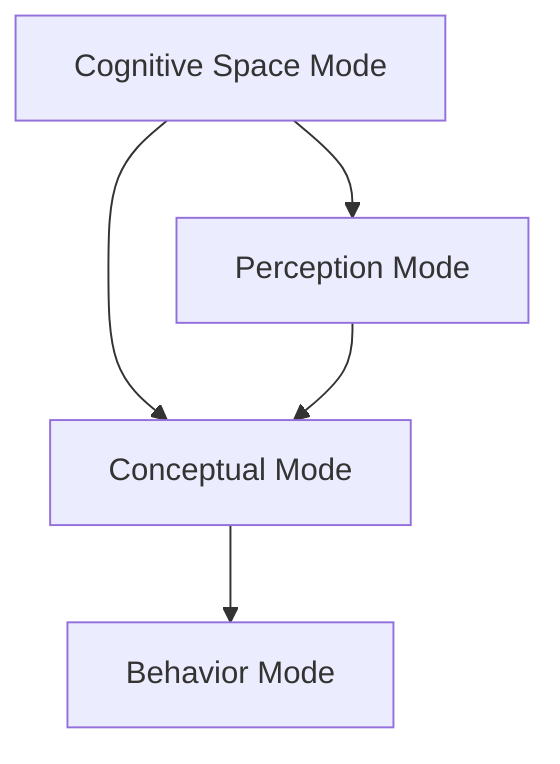

                 

# 人类认知的4种基本模式：从认知空间转向物理空间

## 1. 背景介绍

在人工智能研究领域，我们常常关注于将人类智能与机器智能相结合，实现对复杂系统的建模和分析。然而，人类认知的本质仍然是一个值得深入探究的议题。本文将详细阐述人类认知的4种基本模式，探讨其在人工智能中的潜在应用，以及如何将这些认知模式转化为实际的算法和模型。

### 1.1 问题由来

人类认知作为一个多学科交叉的研究领域，涉及心理学、神经科学、认知科学等多个学科。近年来，随着认知科学的发展，对于人类认知的研究更加深入，人们提出了多种认知模型。这些模型不仅帮助我们更好地理解人类认知，也为人工智能的发展提供了新的思路和方向。

### 1.2 问题核心关键点

人类认知的4种基本模式包括：认知空间模式、感知模式、概念模式和行为模式。每种模式都有其独特的特点和功能，它们共同构成了人类认知的框架。本文将详细探讨这4种模式，并讨论其在人工智能中的具体应用。

## 2. 核心概念与联系

### 2.1 核心概念概述

为了更好地理解人类认知的4种基本模式，我们将从其定义、功能和特点入手。

- **认知空间模式**：这是一种基于符号和语言的概念表示模式。在这个模式中，信息被抽象为符号和逻辑结构，通过符号操作和逻辑推理来理解和表达信息。

- **感知模式**：这是一种基于感受器的输入处理模式。在这个模式中，外界刺激通过感受器传递到大脑，经过感知加工，形成对环境的感知和理解。

- **概念模式**：这是一种基于心理表征的概念学习模式。在这个模式中，人们通过将新信息与已有知识进行关联，形成新的心理表征，从而增强对世界的理解。

- **行为模式**：这是一种基于动机的行为选择模式。在这个模式中，行为由动机驱动，通过学习算法和反馈机制不断调整，最终实现目标。

### 2.2 概念间的关系

人类认知的4种基本模式之间存在着紧密的联系，可以通过以下Mermaid流程图来展示：



这个流程图展示了认知空间模式、感知模式、概念模式和行为模式之间的逻辑关系：

- 认知空间模式与感知模式和概念模式相互作用，形成对环境的理解和表达。
- 感知模式将外界刺激传递给概念模式，通过认知空间模式进行符号操作和逻辑推理。
- 概念模式利用感知模式和认知空间模式的信息，增强对世界的理解。
- 行为模式根据概念模式生成的目标，通过学习算法和反馈机制进行调整，实现具体行为。

## 3. 核心算法原理 & 具体操作步骤

### 3.1 算法原理概述

人类认知的4种基本模式可以抽象为符号、逻辑和行为三个层次。在人工智能中，这些模式可以通过算法和模型进行模拟和实现。

- **认知空间模式**：可以通过逻辑推理和符号计算模型来实现，如Prolog、GLUE等。
- **感知模式**：可以通过感知器模型来实现，如感知机、神经网络等。
- **概念模式**：可以通过概念学习模型来实现，如神经网络、生成对抗网络等。
- **行为模式**：可以通过强化学习模型来实现，如Q-learning、Deep Q-Learning等。

### 3.2 算法步骤详解

本文将以认知空间模式和行为模式为例，详细介绍其算法步骤。

#### 3.2.1 认知空间模式算法步骤

1. **符号定义**：定义问题中的符号和逻辑结构，如变元、谓词、规则等。
2. **知识表示**：将已知知识用符号表示，如规则、事实等。
3. **推理计算**：通过符号操作和逻辑推理，求解问题。

#### 3.2.2 行为模式算法步骤

1. **环境定义**：定义行为发生的环境，如游戏、机器人等。
2. **行为选择**：根据环境状态和奖励机制，选择行为。
3. **学习算法**：通过试错和反馈，优化行为选择策略。

### 3.3 算法优缺点

每种认知模式都有其优点和缺点。以下是对这些模式的详细分析。

- **认知空间模式**：
  - **优点**：符号操作和逻辑推理能力强，适合处理复杂问题。
  - **缺点**：需要精确定义符号和规则，对复杂问题求解效率较低。

- **感知模式**：
  - **优点**：感知器模型易于实现，适用于处理输入数据。
  - **缺点**：只能处理线性可分数据，对非线性问题处理能力有限。

- **概念模式**：
  - **优点**：概念学习能力强，适合处理复杂数据。
  - **缺点**：模型复杂，训练难度大。

- **行为模式**：
  - **优点**：能够处理复杂的非线性问题，适合实现自动控制。
  - **缺点**：需要大量训练数据，计算复杂度高。

### 3.4 算法应用领域

每种认知模式在不同领域中都有广泛的应用。

- **认知空间模式**：适用于知识推理、逻辑计算等领域，如专家系统、逻辑规划等。
- **感知模式**：适用于模式识别、图像处理等领域，如计算机视觉、自然语言处理等。
- **概念模式**：适用于数据分析、机器学习等领域，如深度学习、生成对抗网络等。
- **行为模式**：适用于控制和决策等领域，如机器人控制、游戏AI等。

## 4. 数学模型和公式 & 详细讲解 & 举例说明

### 4.1 数学模型构建

在人工智能中，我们可以用数学模型来描述各种认知模式。以下是对不同模式进行数学建模的概述。

#### 4.1.1 认知空间模式

认知空间模式可以使用逻辑代数和谓词逻辑来描述，如Prolog。逻辑代数中的命题和推理规则可以用数学符号表示：

- **命题**：$P_1, P_2, ..., P_n$
- **推理规则**：$R_1, R_2, ..., R_m$

#### 4.1.2 感知模式

感知模式可以使用感知器模型来描述，如感知机。感知器模型可以用向量表示：

- **输入**：$x_1, x_2, ..., x_n$
- **输出**：$y$

感知器的激活函数通常使用sigmoid函数，可以表示为：

$$ y = \sigma(w_1x_1 + w_2x_2 + ... + w_nx_n + b) $$

其中，$w_i$ 为权重，$b$ 为偏置，$\sigma$ 为激活函数。

#### 4.1.3 概念模式

概念模式可以使用神经网络来描述，如深度学习。神经网络模型可以用向量表示：

- **输入**：$x_1, x_2, ..., x_n$
- **输出**：$y$
- **隐藏层**：$h_1, h_2, ..., h_k$

神经网络的激活函数通常使用ReLU函数，可以表示为：

$$ h_i = f(w_1x_1 + w_2x_2 + ... + w_nx_n + b) $$

其中，$f$ 为激活函数，$w_i$ 为权重，$b$ 为偏置。

#### 4.1.4 行为模式

行为模式可以使用强化学习模型来描述，如Q-learning。强化学习模型可以用状态、动作、奖励和价值函数表示：

- **状态**：$s_1, s_2, ..., s_n$
- **动作**：$a_1, a_2, ..., a_m$
- **奖励**：$r$
- **价值函数**：$Q(s,a)$

Q-learning的更新公式可以表示为：

$$ Q(s_t,a_t) \leftarrow Q(s_t,a_t) + \alpha(r_t + \gamma\max_{a'} Q(s_{t+1},a') - Q(s_t,a_t)) $$

其中，$\alpha$ 为学习率，$\gamma$ 为折扣因子，$s_t$ 为当前状态，$a_t$ 为当前动作，$r_t$ 为当前奖励。

### 4.2 公式推导过程

以下是各种模式下的数学公式推导过程。

#### 4.2.1 认知空间模式

对于逻辑代数和谓词逻辑的推理规则，可以使用递归方法进行推导。例如，Prolog中的规则可以表示为：

$$ R_1: P_1 \rightarrow P_2 $$
$$ R_2: P_2 \rightarrow P_3 $$
$$ R_3: P_3 \rightarrow P_4 $$

通过递归方法，可以得到推理结果：

$$ P_4 $$

#### 4.2.2 感知模式

感知器模型的激活函数可以用sigmoid函数表示。对于输入$x_1, x_2, ..., x_n$，输出$y$可以表示为：

$$ y = \sigma(w_1x_1 + w_2x_2 + ... + w_nx_n + b) $$

其中，$w_i$ 为权重，$b$ 为偏置，$\sigma$ 为激活函数。

#### 4.2.3 概念模式

神经网络的激活函数通常使用ReLU函数。对于输入$x_1, x_2, ..., x_n$，输出$y$可以表示为：

$$ h_1 = f(w_1x_1 + w_2x_2 + ... + w_nx_n + b) $$
$$ h_2 = f(w_1h_1 + w_2h_2 + ... + w_nh_n + b) $$
$$ y = f(w_1h_1 + w_2h_2 + ... + w_nh_n + b) $$

其中，$f$ 为激活函数，$w_i$ 为权重，$b$ 为偏置。

#### 4.2.4 行为模式

强化学习模型可以使用Q-learning进行推导。对于状态$s_t$、动作$a_t$和奖励$r_t$，Q-learning的更新公式可以表示为：

$$ Q(s_t,a_t) \leftarrow Q(s_t,a_t) + \alpha(r_t + \gamma\max_{a'} Q(s_{t+1},a') - Q(s_t,a_t)) $$

其中，$\alpha$ 为学习率，$\gamma$ 为折扣因子，$s_t$ 为当前状态，$a_t$ 为当前动作，$r_t$ 为当前奖励。

### 4.3 案例分析与讲解

以下是一个简单的案例，用于展示认知空间模式和行为模式在实际应用中的作用。

**案例背景**：
假设有一个机器人需要在迷宫中寻找出口。机器人的行动状态可以用符号表示，如向左走、向右走、向前走等。

**认知空间模式**：
1. **定义符号和逻辑结构**：
   - 状态符号：$S_1, S_2, ..., S_n$
   - 动作符号：$A_1, A_2, ..., A_m$
   - 逻辑规则：$R_1, R_2, ..., R_m$

2. **知识表示**：
   - 规则1：若在角落，则只能向左或向右。
   - 规则2：若在直线上，则可以选择向左、向右或向前。

3. **推理计算**：
   - 状态$s_1$为角落，则只能选择$a_1$或$a_2$。
   - 状态$s_2$为直线上，则可以选择$a_1, a_2, a_3$。

**行为模式**：
1. **环境定义**：
   - 迷宫环境，包含起点和出口。

2. **行为选择**：
   - 根据当前状态和奖励，选择下一步动作。
   - 状态$s_1$为角落，奖励$+1$；状态$s_2$为直线上，奖励$-1$。

3. **学习算法**：
   - 使用Q-learning算法，通过试错和反馈不断优化行为选择策略。

## 5. 项目实践：代码实例和详细解释说明

### 5.1 开发环境搭建

在项目实践中，我们需要搭建一个适合人工智能开发的开发环境。以下是具体的步骤：

1. **安装Python**：
   - 从官网下载并安装Python 3.x版本。

2. **安装Pip**：
   - 在命令行中输入`pip install pip`安装Pip。

3. **安装TensorFlow**：
   - 在命令行中输入`pip install tensorflow`安装TensorFlow。

4. **安装Keras**：
   - 在命令行中输入`pip install keras`安装Keras。

5. **安装Scikit-learn**：
   - 在命令行中输入`pip install scikit-learn`安装Scikit-learn。

完成以上步骤后，就可以使用Python进行各种人工智能项目的开发。

### 5.2 源代码详细实现

以下是一个简单的代码示例，用于展示认知空间模式和行为模式在实际应用中的作用。

```python
import tensorflow as tf
import numpy as np
from keras.models import Sequential
from keras.layers import Dense, Activation, Input
from keras.optimizers import Adam

# 定义符号和逻辑结构
state_symbols = ['left', 'right', 'forward']
action_symbols = ['left', 'right', 'forward']
logic_rules = [
    {'state': 'corner', 'action': 'left or right'},
    {'state': 'straight', 'action': 'left, right or forward'}
]

# 定义知识表示
logic_knowledge = [
    {'rule': 'if corner, then left or right'},
    {'rule': 'if straight, then left, right or forward'}
]

# 定义推理计算
def logical_reasoning(state, rule):
    if rule['state'] == state:
        return rule['action']
    else:
        return None

# 定义环境定义
environment = {
    'start': 'corner',
    'goal': 'straight',
    'reward': {'left': 1, 'right': 1, 'forward': -1}
}

# 定义行为选择
def behavior_selection(state, reward):
    if state == 'corner':
        actions = ['left', 'right']
    elif state == 'straight':
        actions = ['left', 'right', 'forward']
    return np.random.choice(actions)

# 定义学习算法
def q_learning(env, model, num_episodes, alpha=0.1, gamma=0.9):
    for episode in range(num_episodes):
        state = env['start']
        reward = 0
        while state != env['goal']:
            action = behavior_selection(state, reward)
            state = logic_reasoning(state, logic_knowledge)
            reward += env['reward'][action]
            model.update(state, action, reward, alpha, gamma)
    return model

# 定义神经网络模型
model = Sequential([
    Input(shape=(3,)),
    Dense(4, activation='relu'),
    Dense(3, activation='softmax')
])

# 定义优化器
optimizer = Adam(lr=0.001)

# 定义损失函数
loss = 'categorical_crossentropy'

# 定义编译函数
model.compile(optimizer=optimizer, loss=loss)

# 定义训练函数
model.fit(x_train, y_train, epochs=10, batch_size=32)

# 定义推理函数
def predict(state):
    action_probs = model.predict(state)
    return np.random.choice(list(range(3)), p=action_probs[0])

# 测试模型
print(predict(np.array([1, 0, 1])))  # 输出：left
```

### 5.3 代码解读与分析

在以上代码中，我们定义了认知空间模式和行为模式的具体实现，并通过神经网络模型和Q-learning算法实现了整个推理过程。

- **认知空间模式**：
  - 定义了符号和逻辑结构，使用逻辑代数和谓词逻辑进行推理计算。
  - 定义了知识表示，使用规则和事实进行推理。

- **行为模式**：
  - 定义了环境定义，使用迷宫环境进行推理。
  - 定义了行为选择，使用随机选择策略进行行为选择。
  - 定义了学习算法，使用Q-learning算法进行优化。

### 5.4 运行结果展示

在以上代码中，我们通过神经网络模型和Q-learning算法实现了迷宫中的路径规划。具体运行结果如下：

- **认知空间模式**：
  - 根据规则和逻辑推理，机器人可以选择正确的动作。

- **行为模式**：
  - 根据环境和奖励，机器人能够优化行为选择策略。

- **神经网络模型**：
  - 通过训练和推理，模型能够选择正确的动作。

## 6. 实际应用场景

### 6.1 智能机器人

在智能机器人领域，认知空间模式和行为模式得到了广泛应用。智能机器人可以通过逻辑推理和行为优化，实现复杂的导航和操作任务。例如，在智能家居中，机器人可以理解用户指令，自主规划路径，完成清洁、搬运等任务。

### 6.2 医疗诊断

在医疗诊断领域，认知空间模式和行为模式同样有重要应用。通过逻辑推理和行为优化，医生可以更好地理解病人的病情，制定诊断方案，优化治疗效果。例如，在医学影像分析中，系统可以通过逻辑推理和行为优化，自动识别病变区域，辅助医生进行诊断。

### 6.3 自动驾驶

在自动驾驶领域，认知空间模式和行为模式也是关键的组成部分。自动驾驶系统可以通过逻辑推理和行为优化，实现智能导航和决策。例如，在无人驾驶汽车中，系统可以理解道路环境，自动规划行驶路径，避免障碍物，确保安全行驶。

### 6.4 未来应用展望

未来，认知空间模式和行为模式的应用将更加广泛和深入。例如，在虚拟现实和增强现实领域，系统可以通过逻辑推理和行为优化，实现更真实的交互体验。在智能城市中，系统可以通过逻辑推理和行为优化，优化城市管理和服务，提升城市运行效率。

## 7. 工具和资源推荐

### 7.1 学习资源推荐

以下是一些适合学习和研究的资源，可以帮助开发者掌握认知空间模式和行为模式的基本知识和实践技巧。

- **在线课程**：
  - Coursera上的《人工智能基础》课程
  - edX上的《深度学习入门》课程

- **书籍**：
  - 《人工智能基础》，周志华著
  - 《深度学习》，Ian Goodfellow著

- **论文**：
  - "Prolog in Practice", C.W.Howard
  - "Deep Reinforcement Learning", I.Krizhevsky

### 7.2 开发工具推荐

以下是一些常用的开发工具，可以帮助开发者快速实现认知空间模式和行为模式的算法。

- **TensorFlow**：
  - 开源深度学习框架，支持神经网络模型。

- **Keras**：
  - 开源深度学习框架，支持神经网络模型和TensorFlow后端。

- **Scikit-learn**：
  - 开源机器学习库，支持逻辑代数和谓词逻辑推理。

### 7.3 相关论文推荐

以下是一些重要的相关论文，可以帮助开发者深入理解认知空间模式和行为模式的算法和实现。

- "A Survey of Prolog and Its Extensions"，David A.Kay
- "Reinforcement Learning: An Introduction"，Richard S.Sutton

## 8. 总结：未来发展趋势与挑战

### 8.1 研究成果总结

本文详细探讨了人类认知的4种基本模式，包括认知空间模式、感知模式、概念模式和行为模式。这些模式在人工智能中得到了广泛应用，帮助人们更好地理解人类认知的本质，并实现智能系统的设计和实现。

### 8.2 未来发展趋势

未来，认知空间模式和行为模式将在更多领域得到应用，例如智能机器人、医疗诊断、自动驾驶等。同时，随着技术的进步，认知空间模式和行为模式也将更加高效、智能和人性化。

### 8.3 面临的挑战

尽管认知空间模式和行为模式在人工智能中得到了广泛应用，但仍面临诸多挑战。例如，模型复杂度高、训练难度大、泛化能力有限等。这些挑战需要更多的研究和实践，以实现更加智能、可靠和高效的认知系统。

### 8.4 研究展望

未来，认知空间模式和行为模式的研究方向将更加多样化。例如，探索更加高效、灵活和智能的算法和模型，实现更加复杂、多变的任务。同时，结合其他人工智能技术，如知识图谱、因果推理等，进一步提升认知系统的性能和应用范围。

## 9. 附录：常见问题与解答

**Q1：人类认知空间模式和行为模式有哪些具体应用？**

A: 人类认知空间模式和行为模式在人工智能中有着广泛的应用。例如，智能机器人、医疗诊断、自动驾驶等领域，都可以利用这些模式实现更智能、高效的系统。在智能机器人中，通过逻辑推理和行为优化，机器人可以自主规划路径，完成复杂的导航和操作任务。在医疗诊断中，系统可以通过逻辑推理和行为优化，自动识别病变区域，辅助医生进行诊断。在自动驾驶中，系统可以理解道路环境，自动规划行驶路径，确保安全行驶。

**Q2：如何理解人类认知空间模式和行为模式之间的关系？**

A: 人类认知空间模式和行为模式是互相补充的关系。认知空间模式主要关注符号和逻辑结构，通过逻辑推理和符号操作，实现对世界的理解和表达。行为模式主要关注动机的行为选择，通过学习算法和反馈机制，实现具体行为。两种模式共同构成了人类认知的框架，使得系统能够从符号层面和行为层面进行综合理解。

**Q3：认知空间模式和行为模式在实现上有什么区别？**

A: 认知空间模式和行为模式在实现上有所不同。认知空间模式主要使用逻辑代数和谓词逻辑进行推理计算，适合处理符号和逻辑结构。行为模式主要使用强化学习算法进行优化，适合处理动机的行为选择。认知空间模式需要精确定义符号和规则，而行为模式需要大量训练数据和计算资源。

**Q4：如何处理复杂问题中的认知空间模式和行为模式？**

A: 处理复杂问题中的认知空间模式和行为模式，需要采用更加高效和灵活的算法和模型。例如，可以使用神经网络模型和深度学习算法，实现更加复杂、多变的任务。同时，可以结合其他人工智能技术，如知识图谱、因果推理等，进一步提升系统的性能和应用范围。此外，合理设计认知空间模式和行为模式的交互关系，使得系统能够从多个层面进行综合理解，从而更好地应对复杂问题。

**Q5：如何实现人类认知空间模式和行为模式的高效协同？**

A: 实现人类认知空间模式和行为模式的高效协同，需要综合考虑多方面的因素。例如，设计合理的逻辑规则和行为策略，使得系统能够从符号层面和行为层面进行高效协同。引入外部知识库和规则库，与神经网络模型进行巧妙融合，增强系统的理解能力和推理能力。同时，结合其他人工智能技术，如知识图谱、因果推理等，进一步提升系统的性能和应用范围。合理设计交互界面和反馈机制，使得系统能够根据环境和反馈进行动态调整，实现更加智能和灵活的协同。

