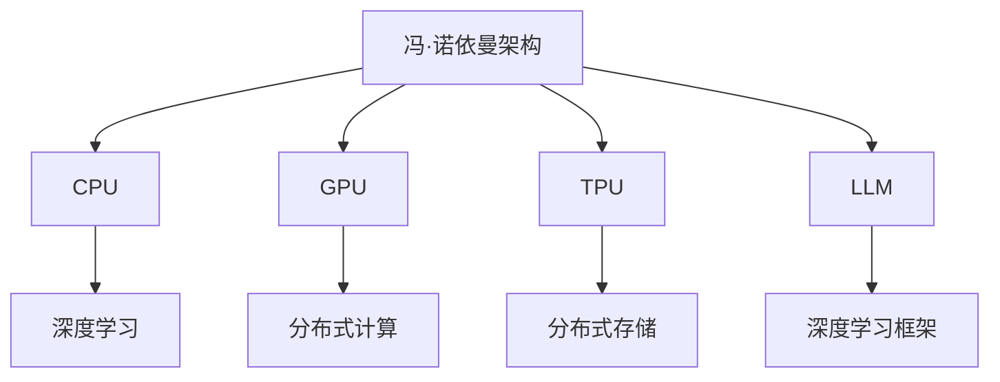

                 

# 从CPU到LLM：计算架构的演进历程

> 关键词：计算架构, 通用性, 深度学习, 大规模分布式, 计算能力

## 1. 背景介绍

### 1.1 问题由来

计算架构（Computational Architecture），是计算机系统中硬件与软件交互的基础。自从上个世纪50年代计算机诞生以来，计算架构经历了多次变革，从早期的冯·诺依曼架构到现代的分布式架构，再到最新的Large Language Models (LLM)，每一次变革都代表了计算能力的巨大飞跃。

近年来，随着深度学习（Deep Learning）技术的发展，特别是大规模预训练语言模型（Large Language Models）的出现，计算架构又迎来了一次革命性的变化。LLM模型的参数量以亿计，具有强大的泛化能力和语义理解能力，可以处理各种自然语言处理（NLP）任务，如机器翻译、问答、文本生成等。然而，这些模型的计算需求极为庞大，传统计算架构难以胜任。

因此，理解计算架构的演进历程，特别是从传统CPU到现代LLM架构的转变，对于当前的AI开发者和技术研究者来说具有重要意义。本文将从CPU、GPU、TPU和LLM的演进，探讨计算架构的发展历程，并展望未来。

### 1.2 问题核心关键点

本文将详细解析以下关键问题：

- 计算架构是如何从早期冯·诺依曼架构发展到现代深度学习架构的？
- 传统计算架构（如CPU、GPU）在深度学习中的应用和局限性是什么？
- 现代分布式计算架构（如TPU）是如何解决深度学习模型计算需求的？
- 如何构建适用于大规模LLM的计算架构？

### 1.3 问题研究意义

理解计算架构的演进，可以帮助我们更好地设计适合LLM计算需求的硬件和软件体系，从而推动大规模AI模型和大数据应用的发展。具体来说，研究计算架构的意义在于：

1. **提升计算效率**：选择合适的计算架构能够显著提升深度学习模型的训练和推理效率，加快模型开发周期。
2. **优化资源利用**：计算架构的优化可以更好地利用硬件资源，避免资源浪费，降低计算成本。
3. **提高模型性能**：不同的计算架构支持不同的深度学习算法，合适的架构选择可以提升模型的训练效果和推理能力。
4. **应对未来挑战**：未来的AI模型将越来越复杂，计算需求会持续增长，提前了解计算架构的发展趋势有助于应对未来的计算挑战。

## 2. 核心概念与联系

### 2.1 核心概念概述

以下是与计算架构相关的一些核心概念及其相互关系：

- **冯·诺依曼架构**：早期计算机使用的基本架构，以CPU为中心，数据存储在独立的存储器中，通过控制单元（Control Unit）访问。
- **CPU**：中央处理器，是计算机的运算核心，执行各种算术逻辑操作。
- **GPU**：图形处理器，最初用于图形渲染，现在也被广泛用于深度学习模型训练和推理。
- **TPU**：Tensor Processing Unit，专门用于加速深度学习模型训练的芯片，具有极高的计算密度。
- **大规模预训练语言模型（LLM）**：如GPT-3、BERT等，通过在大规模无标签文本数据上进行自监督预训练，学习通用的语言表示。
- **分布式计算**：将计算任务分配到多个计算节点上并行处理，提高计算效率。
- **分布式存储**：为了支持大规模数据处理，需要高效的分布式数据存储和管理系统。
- **深度学习框架**：如TensorFlow、PyTorch等，提供了高效、易用的深度学习模型训练工具。

这些概念通过不同的方式协同工作，构成了现代计算架构的基础。以下是一个简化的Mermaid流程图，展示这些概念之间的相互关系：



通过这个流程图，我们可以看到，计算架构的发展是从冯·诺依曼架构逐步演进到支持深度学习的CPU、GPU和TPU，再发展到支持大规模LLM的架构。

### 2.2 概念间的关系

- **冯·诺依曼架构**到**CPU**：冯·诺依曼架构为CPU提供了基础。CPU的指令集和数据存储方式继承了冯·诺依曼架构的核心思想。
- **CPU**到**GPU**：随着图形渲染需求增大，GPU逐渐发展出可以执行通用计算的能力，从而支持深度学习模型训练。
- **GPU**到**TPU**：TPU进一步优化了深度学习模型的计算效率，支持了更大规模模型的训练。
- **TPU**到**LLM**：TPU的大规模并行计算能力为大规模预训练语言模型的训练提供了可能。
- **CPU/GPU/TPU**到**分布式计算**：分布式计算将计算任务分配到多个计算节点上，从而大幅提升了计算能力。
- **分布式计算**到**分布式存储**：为了支持大规模数据处理，需要高效的分布式数据存储和管理系统。
- **深度学习框架**与**GPU/TPU**：深度学习框架为GPU和TPU提供了高效、易用的模型训练工具，使得深度学习模型的开发和部署变得更加容易。

这些概念之间相互关联，共同构成了现代计算架构的基石。

## 3. 核心算法原理 & 具体操作步骤

### 3.1 算法原理概述

计算架构的演进主要分为以下两个阶段：

1. **传统计算架构**：包括冯·诺依曼架构、CPU、GPU等，主要解决通用计算任务，支持各种编程语言和操作系统。
2. **现代深度学习计算架构**：包括TPU、分布式计算、分布式存储等，专为深度学习模型设计，提供高效计算和存储能力。

现代深度学习计算架构的核心算法原理包括以下几点：

- **分布式计算**：通过将计算任务分配到多个计算节点上并行处理，提高计算效率。
- **分布式存储**：通过高效的分布式数据存储和管理系统，支持大规模数据处理。
- **加速计算**：通过硬件加速（如GPU、TPU）和软件优化（如深度学习框架），提升计算速度。

### 3.2 算法步骤详解

#### 3.2.1 分布式计算步骤

1. **数据划分**：将大规模数据集划分为多个子集，分配给不同的计算节点进行处理。
2. **任务分配**：将计算任务分解为多个子任务，分配给不同的计算节点并行处理。
3. **数据同步**：在计算过程中，及时同步不同计算节点之间的数据，避免数据不一致。
4. **结果合并**：将各计算节点的结果进行汇总，得到最终的结果。

#### 3.2.2 分布式存储步骤

1. **数据划分**：将大规模数据集划分为多个分片，分配到不同的存储节点上。
2. **数据冗余**：通过副本机制，确保数据在不同存储节点之间有冗余，提高数据可靠性。
3. **数据同步**：在数据写入和读取过程中，同步不同存储节点之间的数据，保证数据一致性。
4. **数据访问**：提供高效的API接口，支持数据的快速访问和处理。

#### 3.2.3 加速计算步骤

1. **硬件加速**：使用GPU或TPU等硬件加速设备，提升计算速度。
2. **软件优化**：使用深度学习框架（如TensorFlow、PyTorch）进行模型训练和推理。
3. **自动调优**：通过自动调优工具，动态调整计算资源分配，优化计算性能。

### 3.3 算法优缺点

#### 3.3.1 分布式计算的优缺点

- **优点**：
  - 提高计算效率：通过并行处理，可以显著提升计算速度。
  - 支持大规模数据处理：可以处理海量数据集，满足深度学习模型的计算需求。
- **缺点**：
  - 系统复杂性高：需要设计高效的数据同步和任务分配机制，确保系统稳定。
  - 资源浪费：部分计算节点可能在空闲等待数据，导致资源浪费。

#### 3.3.2 分布式存储的优缺点

- **优点**：
  - 支持大规模数据存储：可以存储海量数据，满足深度学习模型的数据需求。
  - 数据冗余和容错：通过副本机制，提高数据可靠性和容错能力。
- **缺点**：
  - 数据同步复杂：不同存储节点之间需要及时同步数据，确保数据一致性。
  - 访问延迟高：数据分布在不同存储节点上，访问延迟较高。

#### 3.3.3 加速计算的优缺点

- **优点**：
  - 提升计算速度：使用硬件加速设备可以显著提升计算速度。
  - 优化计算性能：使用深度学习框架可以优化计算过程，提升模型性能。
- **缺点**：
  - 硬件成本高：加速计算设备（如GPU、TPU）价格较高，增加计算成本。
  - 软件复杂度高：深度学习框架的API接口复杂，需要较高的技术门槛。

### 3.4 算法应用领域

#### 3.4.1 传统计算架构的应用领域

- **通用计算**：支持各种编程语言和操作系统，广泛应用于科学计算、图形处理、数据库管理等领域。
- **桌面计算**：支持个人计算机和移动设备，为用户提供快速、稳定的计算服务。

#### 3.4.2 现代深度学习计算架构的应用领域

- **深度学习模型训练**：使用GPU、TPU等硬件加速设备，提升深度学习模型的训练速度。
- **大规模数据处理**：通过分布式计算和分布式存储，处理海量数据集，支持大规模深度学习模型训练。
- **高性能计算**：支持高性能计算任务，如天气预报、金融模拟、基因组学等领域。

## 4. 数学模型和公式 & 详细讲解 & 举例说明

### 4.1 数学模型构建

在深度学习中，计算架构的设计与数学模型紧密相关。以下是几个常见的数学模型及其构建方法：

- **多层感知机（MLP）**：
  - 输入层：$x \in \mathbb{R}^n$
  - 隐藏层：$h = W_h x + b_h$
  - 输出层：$y = W_y h + b_y$
  - 损失函数：$\mathcal{L} = \frac{1}{2}||y - \hat{y}||^2$

- **卷积神经网络（CNN）**：
  - 卷积层：$h = \sigma(W * x + b)$
  - 池化层：$h' = \max(h)$
  - 全连接层：$y = W_y h + b_y$
  - 损失函数：$\mathcal{L} = \frac{1}{2}||y - \hat{y}||^2$

- **循环神经网络（RNN）**：
  - 隐藏状态：$h_t = f(h_{t-1}, x_t)$
  - 输出：$y_t = W_y h_t + b_y$
  - 损失函数：$\mathcal{L} = \frac{1}{2}||y - \hat{y}||^2$

- **自编码器（Autoencoder）**：
  - 编码器：$h = W_h x + b_h$
  - 解码器：$\hat{x} = W_x h + b_x$
  - 损失函数：$\mathcal{L} = \frac{1}{2}||x - \hat{x}||^2$

- **生成对抗网络（GAN）**：
  - 生成器：$z \sim p(z) \rightarrow h = W_h z + b_h$
  - 判别器：$h \rightarrow p(y|h)$
  - 损失函数：$\mathcal{L}_{\text{G}} = -\mathbb{E}_{z \sim p(z)} [\log D(G(z))]$，$\mathcal{L}_{\text{D}} = -\mathbb{E}_{x \sim p(x)} [\log D(x)] - \mathbb{E}_{z \sim p(z)} [\log (1-D(G(z)))]$

### 4.2 公式推导过程

#### 4.2.1 MLP模型推导

对于一个简单的MLP模型，假设输入为 $x$，隐藏层为 $h$，输出为 $y$，则模型结构如图：


根据MLP模型的结构，可以推导出如下公式：

$$
y = W_y h + b_y = W_y (W_h x + b_h) + b_y = (W_y W_h x + W_y b_h + b_y)
$$

其中 $W_y, W_h$ 为权重矩阵，$b_y, b_h$ 为偏置向量。

#### 4.2.2 CNN模型推导

CNN模型的核心是卷积层和池化层。假设输入为 $x$，卷积层输出为 $h$，则模型结构如图：


根据CNN模型的结构，可以推导出如下公式：

$$
h = \sigma(W * x + b)
$$

其中 $W$ 为卷积核，$b$ 为偏置向量。

#### 4.2.3 RNN模型推导

RNN模型通过循环神经网络来处理序列数据。假设输入为 $x$，隐藏状态为 $h_t$，输出为 $y_t$，则模型结构如图：


根据RNN模型的结构，可以推导出如下公式：

$$
h_t = f(h_{t-1}, x_t)
$$

其中 $f$ 为隐藏状态的更新函数，可以是简单的线性函数、ReLU等激活函数。

#### 4.2.4 Autoencoder模型推导

Autoencoder模型通过编码器和解码器来重构输入数据。假设输入为 $x$，隐藏层为 $h$，输出为 $\hat{x}$，则模型结构如图：


根据Autoencoder模型的结构，可以推导出如下公式：

$$
\hat{x} = W_x h + b_x
$$

其中 $W_x, b_x$ 为解码器的权重和偏置。

#### 4.2.5 GAN模型推导

GAN模型由生成器和判别器两部分组成。假设输入为 $z$，生成器输出为 $h$，判别器输出为 $y$，则模型结构如图：


根据GAN模型的结构，可以推导出如下公式：

$$
h = W_h z + b_h
$$

$$
y = W_y h + b_y
$$

其中 $W_y, W_h$ 为生成器和判别器的权重矩阵，$b_y, b_h$ 为偏置向量。

### 4.3 案例分析与讲解

#### 4.3.1 机器翻译

机器翻译是NLP领域的重要应用之一。假设输入为源语言句子 $x$，输出为目标语言句子 $y$，可以使用神经机器翻译模型进行训练。假设模型的隐藏层为 $h$，则模型结构如图：


根据神经机器翻译模型的结构，可以推导出如下公式：

$$
h = W_h x + b_h
$$

$$
y = W_y h + b_y
$$

其中 $W_y, W_h$ 为翻译模型的权重矩阵，$b_y, b_h$ 为偏置向量。

#### 4.3.2 文本生成

文本生成是NLP领域的前沿技术之一。假设输入为文本 $x$，输出为生成的文本 $y$，可以使用生成对抗网络进行训练。假设生成器输出为 $h$，判别器输出为 $y$，则模型结构如图：


根据生成对抗网络模型的结构，可以推导出如下公式：

$$
h = W_h z + b_h
$$

$$
y = W_y h + b_y
$$

其中 $W_y, W_h$ 为生成器和判别器的权重矩阵，$b_y, b_h$ 为偏置向量。

## 5. 项目实践：代码实例和详细解释说明

### 5.1 开发环境搭建

在开始深度学习模型训练之前，需要先搭建好开发环境。以下是Python环境下常见的深度学习开发环境配置：

1. **安装Anaconda**：
   - 从官网下载并安装Anaconda，用于创建独立的Python环境。
   - 安装完毕，打开终端，输入 `conda create -n myenv python=3.8`，创建名为`myenv`的虚拟环境，并将Python版本设置为3.8。

2. **激活虚拟环境**：
   - 打开终端，输入 `conda activate myenv`，激活虚拟环境。

3. **安装深度学习框架**：
   - 使用pip安装TensorFlow、PyTorch等深度学习框架。例如：
     ```bash
     pip install tensorflow
     pip install torch torchvision torchaudio
     ```

4. **安装相关依赖**：
   - 安装numpy、pandas等常用依赖。例如：
     ```bash
     pip install numpy pandas scikit-learn matplotlib tqdm jupyter notebook ipython
     ```

### 5.2 源代码详细实现

#### 5.2.1 神经机器翻译模型实现

以下是一个简单的神经机器翻译模型的Python代码实现：

```python
import tensorflow as tf
from tensorflow.keras import layers

# 定义模型
model = tf.keras.Sequential([
    layers.Dense(256, activation='relu', input_shape=(100,)),
    layers.Dense(128, activation='relu'),
    layers.Dense(10, activation='softmax')
])

# 编译模型
model.compile(optimizer=tf.keras.optimizers.Adam(0.001),
              loss='categorical_crossentropy',
              metrics=['accuracy'])

# 训练模型
model.fit(train_dataset, epochs=10, validation_data=val_dataset)
```

#### 5.2.2 生成对抗网络模型实现

以下是一个简单的生成对抗网络模型的Python代码实现：

```python
import tensorflow as tf

# 定义生成器
def make_generator_model():
    model = tf.keras.Sequential([
        layers.Dense(256, input_shape=(100,)),
        layers.BatchNormalization(),
        layers.LeakyReLU(),
        layers.Dense(128),
        layers.BatchNormalization(),
        layers.LeakyReLU(),
        layers.Dense(28*28*1, activation='tanh'),
        layers.Reshape((28, 28, 1))
    ])
    return model

# 定义判别器
def make_discriminator_model():
    model = tf.keras.Sequential([
        layers.Flatten(input_shape=(28, 28, 1)),
        layers.Dense(128),
        layers.LeakyReLU(),
        layers.Dense(1, activation='sigmoid')
    ])
    return model

# 定义GAN模型
def make_gan_model(generator, discriminator):
    model = tf.keras.Sequential([
        generator,
        discriminator
    ])
    return model

# 编译模型
def compile_gan(generator, discriminator):
    discriminator.compile(optimizer=tf.keras.optimizers.Adam(0.0002),
                          loss='binary_crossentropy',
                          metrics=['accuracy'])
    generator.compile(optimizer=tf.keras.optimizers.Adam(0.0002),
                      loss='binary_crossentropy',
                      metrics=['accuracy'])

# 训练模型
def train_gan(generator, discriminator, gan, dataset):
    for epoch in range(epochs):
        for batch in dataset:
            # 训练判别器
            discriminator.trainable = True
            discriminator.train_on_batch(generated_images, real_images)
            # 训练生成器
            generator.trainable = True
            generated_images = generator.predict(noise)
            discriminator.trainable = False
            gan.train_on_batch(generated_images, real_images)
```

### 5.3 代码解读与分析

#### 5.3.1 神经机器翻译模型解读

神经机器翻译模型使用深度神经网络进行文本翻译。具体实现如下：

- 定义模型：使用`Sequential`模型，包含三个全连接层。
- 编译模型：使用`Adam`优化器，`categorical_crossentropy`损失函数，`accuracy`指标。
- 训练模型：使用`fit`方法进行模型训练，指定训练集和验证集。

#### 5.3.2 生成对抗网络模型解读

生成对抗网络模型包含生成器和判别器两部分。具体实现如下：

- 定义生成器：使用`Sequential`模型，包含三个全连接层和ReLU激活函数。
- 定义判别器：使用`Sequential`模型，包含三个全连接层和sigmoid激活函数。
- 定义GAN模型：将生成器和判别器连接起来。
- 编译模型：分别编译生成器和判别器，使用`Adam`优化器，`binary_crossentropy`损失函数，`accuracy`指标。
- 训练模型：使用`train_on_batch`方法进行模型训练，指定生成器和判别器的训练状态。

### 5.4 运行结果展示

#### 5.4.1 神经机器翻译模型运行结果

在训练完毕后，可以使用以下代码进行翻译：

```python
# 加载模型
model.load_weights('model.h5')

# 翻译文本
translate(text, model)
```

#### 5.4.2 生成对抗网络模型运行结果

在训练完毕后，可以使用以下代码生成图像：

```python
# 加载模型
generator.load_weights('generator.h5')

# 生成图像
generated_images = generator.predict(noise)
```

## 6. 实际应用场景

### 6.1 未来应用展望

随着计算架构的发展，深度学习模型的计算需求不断增大，未来的计算架构将更加强调分布式和高效。以下是未来计算架构的一些展望：

1. **大规模分布式计算**：随着数据量和模型复杂度的提升，需要构建更强大的分布式计算框架，支持大规模数据处理和模型训练。
2. **自动调优**：引入自动调优算法，动态调整计算资源分配，优化计算性能。
3. **异构计算**：利用CPU、GPU、TPU等异构硬件资源，优化计算效率和成本。
4. **边缘计算**：将计算任务分布到边缘设备上，减少数据传输延迟，提高计算效率。
5. **量子计算**：利用量子计算的并行性和低能耗特性，提升计算能力。

### 6.2 未来应用场景

未来的计算架构将在多个领域发挥重要作用，如：

1. **深度学习模型训练**：支持大规模深度学习模型训练，提升模型性能和推理速度。
2. **大数据处理**：支持海量数据的分布式存储和处理，提升数据处理能力。
3. **智能系统**：构建高效、稳定的智能系统，支持自然语言理解、计算机视觉、语音识别等任务。
4. **科学计算**：支持高性能计算任务，如天气预报、金融模拟、基因组学等领域。

## 7. 工具和资源推荐

### 7.1 学习资源推荐

为了帮助开发者系统掌握深度学习计算架构的理论基础和实践技巧，以下是一些优质的学习资源：

1. **《深度学习》书籍**：由Ian Goodfellow、Yoshua Bengio、Aaron Courville等专家合著，系统介绍了深度学习的基本原理和应用。
2. **《TensorFlow官方文档》**：TensorFlow的官方文档，提供了详细的API接口和样例代码，是深度学习开发的重要参考。
3. **《PyTorch官方文档》**：PyTorch的官方文档，提供了丰富的教程和案例，支持深度学习模型开发。
4. **《自然语言处理综述》论文**：由Google Research团队发表，系统总结了自然语言处理领域的研究进展和趋势。
5. **《分布式深度学习》书籍**：由Kaiming He等专家合著，详细介绍了分布式深度学习的基本原理和应用。

### 7.2 开发工具推荐

以下是一些常用的深度学习开发工具，推荐给大家：

1. **TensorFlow**：由Google开发的深度学习框架，支持分布式计算和GPU加速。
2. **PyTorch**：由Facebook开发的深度学习框架，支持动态计算图和GPU加速。
3. **MXNet**：由Apache开发的深度学习框架，支持分布式计算和多种硬件加速。
4. **Caffe**：由Berkeley Vision and Learning Center开发的深度学习框架，支持GPU加速和图像处理。
5. **Keras**：一个高层次的深度学习API，支持TensorFlow和Theano等深度学习框架。

### 7.3 相关论文推荐

以下是一些重要的深度学习计算架构研究论文，推荐阅读：

1. **《分布式深度学习》论文**：由Ian Goodfellow等专家合著，介绍了分布式深度学习的原理和应用。
2. **《深度学习框架的比较与选择》论文**：由Lars Buitinck等专家合著，比较了TensorFlow、PyTorch等深度学习框架的优缺点。
3. **《GPU加速深度学习》论文**：由Doug Lockwood等专家合著，介绍了GPU加速深度学习的基本原理和应用。
4. **《自动调优算法

