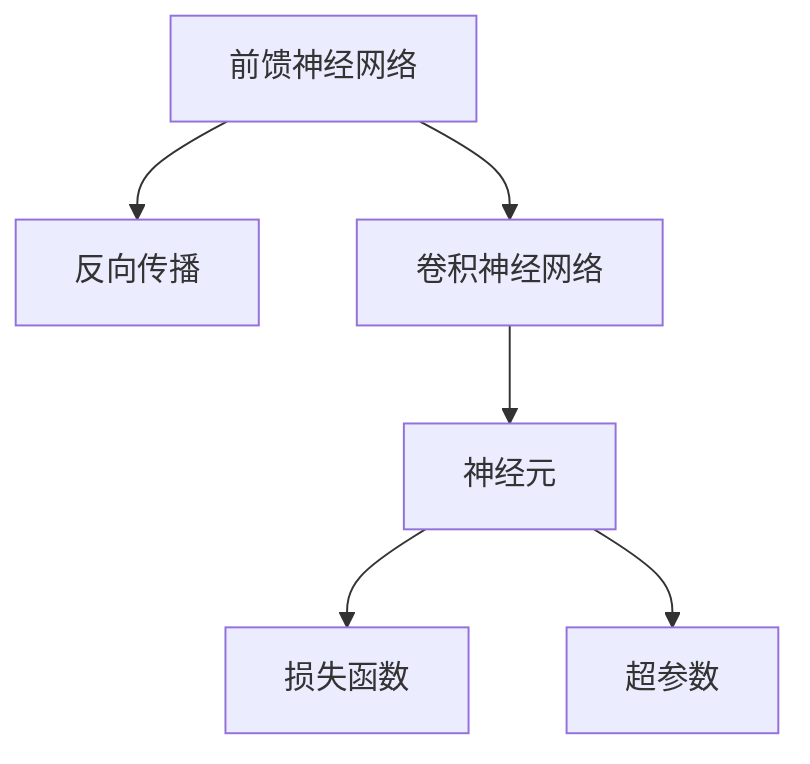
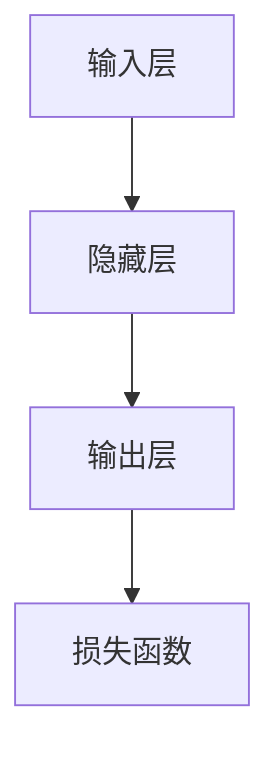
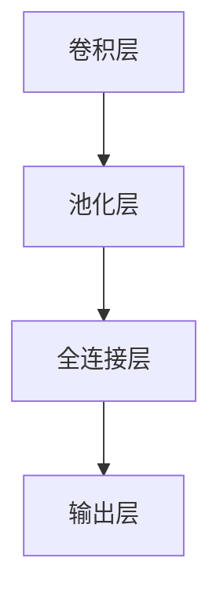
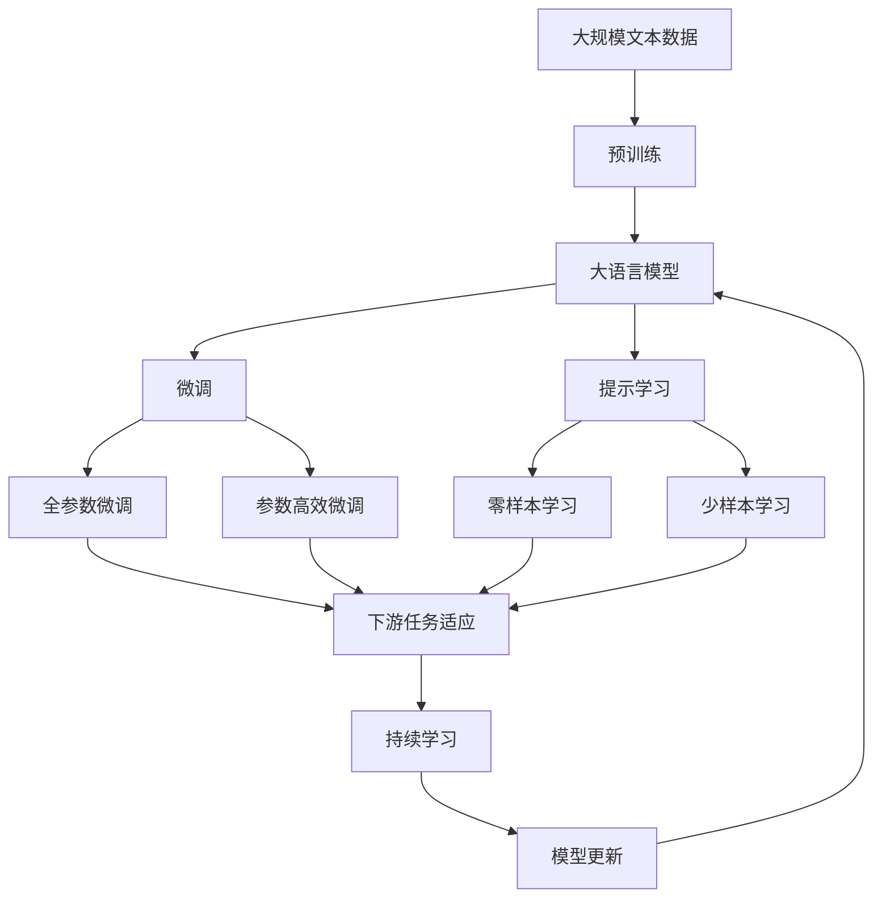

                 

# 从MNIST数据集到大语言模型

> 关键词：深度学习,神经网络,前馈神经网络,反向传播,卷积神经网络,CNN,图像识别,计算机视觉

## 1. 背景介绍

### 1.1 问题由来
深度学习作为当今人工智能的热点，在图像识别、语音识别、自然语言处理等领域取得了显著的进展。深度学习技术的成功应用，离不开算法的创新和有效的模型训练方法。然而，传统深度学习模型在处理大规模数据时，常常面临计算资源不足的问题。本文将通过从经典的数据集MNIST开始，深入探讨深度学习的基本原理，并逐步引出大语言模型的构建与微调方法。

### 1.2 问题核心关键点
深度学习模型通常由多个神经网络层组成，每个神经元接收前一层神经元的输出，并输出给下一层。其中，前馈神经网络(Feedforward Neural Network, FNN)是最基本的形式，主要包括输入层、隐藏层和输出层。前馈神经网络通过反向传播算法(Bpropagation)进行模型参数更新，以最小化损失函数。深度学习模型面临的挑战包括如何设计有效的神经网络结构、选择合适的优化算法、防止过拟合等。

### 1.3 问题研究意义
本文旨在通过从基础的数据集开始，深入探讨深度学习的原理，为后续学习大语言模型和微调方法奠定基础。通过理解深度学习的基本模型和算法，可以更好地理解大语言模型和微调方法的工作机制，从而在实际应用中取得更好的效果。

## 2. 核心概念与联系

### 2.1 核心概念概述
为更好地理解深度学习和大语言模型的联系，本节将介绍几个密切相关的核心概念：

- 前馈神经网络(Feedforward Neural Network, FNN)：由输入层、隐藏层和输出层组成的基本深度学习模型。
- 反向传播算法(Bpropagation)：一种通过链式法则计算梯度，用于优化深度学习模型的算法。
- 卷积神经网络(Convolutional Neural Network, CNN)：一种特殊的神经网络结构，广泛应用于图像识别和计算机视觉领域。
- 神经元(或称为节点)：神经网络的基本单位，通常包括加权、非线性变换、激活函数等操作。
- 损失函数(Loss Function)：用于衡量模型预测输出与真实标签之间的差异，是优化算法优化的目标。
- 超参数(Hyperparameters)：在模型训练之前，需要手动设置的模型参数，如学习率、批量大小、迭代次数等。

这些核心概念之间的关系可以通过以下Mermaid流程图来展示：



这个流程图展示了深度学习的基本结构，以及反向传播算法和神经元的基本工作原理。卷积神经网络作为深度学习中的一个特殊形式，它适用于处理具有网格结构的数据，如图像、视频等。损失函数和超参数则是训练过程中的关键要素，损失函数用于评估模型的预测性能，而超参数则影响模型训练的速度和效果。

### 2.2 概念间的关系

这些核心概念之间存在着紧密的联系，形成了深度学习模型的完整生态系统。下面我们通过几个Mermaid流程图来展示这些概念之间的关系。

#### 2.2.1 深度学习模型结构



这个流程图展示了深度学习模型的基本结构，包括输入层、隐藏层和输出层。隐藏层是深度学习模型中的关键部分，它通过非线性变换和激活函数，将输入数据映射到更高维度的特征空间，从而实现更复杂的特征提取和分类任务。

#### 2.2.2 反向传播算法


这个流程图展示了反向传播算法的基本流程，包括前向传播计算损失函数，反向传播计算梯度，最后更新模型参数。反向传播算法通过链式法则计算梯度，使得模型参数的更新可以基于每个样本的梯度进行，从而提高模型的训练速度和效果。

#### 2.2.3 卷积神经网络结构



这个流程图展示了卷积神经网络的基本结构，包括卷积层、池化层、全连接层和输出层。卷积神经网络通过卷积核和池化操作，在输入数据中提取局部特征，并通过全连接层进行分类。

### 2.3 核心概念的整体架构

最后，我们用一个综合的流程图来展示这些核心概念在大语言模型微调过程中的整体架构：



这个综合流程图展示了从预训练到微调，再到持续学习的完整过程。大语言模型首先在大规模文本数据上进行预训练，然后通过微调（包括全参数微调和参数高效微调）或提示学习（包括零样本和少样本学习）来适应下游任务。最后，通过持续学习技术，模型可以不断学习新知识，同时避免遗忘旧知识。 通过这些流程图，我们可以更清晰地理解深度学习和大语言模型微调过程中各个核心概念的关系和作用，为后续深入讨论具体的微调方法和技术奠定基础。

## 3. 核心算法原理 & 具体操作步骤
### 3.1 算法原理概述

深度学习模型通常通过反向传播算法进行参数更新，以最小化损失函数。以图像识别任务为例，可以使用前馈神经网络(前向传播)对输入图像进行特征提取，并计算与真实标签的误差。通过反向传播算法，根据误差计算梯度，更新模型参数，使得模型在损失函数上的表现逐渐提高。

在微调过程中，使用预训练模型的权重作为初始化参数，通过在下游任务的少量标注数据上进行有监督学习，优化模型在特定任务上的性能。通常，只更新顶层分类器或解码器，并以较小的学习率更新全部或部分的模型参数，以避免破坏预训练的权重。微调过程中的损失函数与预训练过程中不同，需要考虑下游任务的特定需求，如交叉熵损失、均方误差损失等。

### 3.2 算法步骤详解

基于深度学习的大语言模型微调一般包括以下几个关键步骤：

**Step 1: 准备预训练模型和数据集**
- 选择合适的预训练语言模型 $M_{\theta}$ 作为初始化参数，如 BERT、GPT 等。
- 准备下游任务 $T$ 的标注数据集 $D=\{(x_i,y_i)\}_{i=1}^N$，划分为训练集、验证集和测试集。一般要求标注数据与预训练数据的分布不要差异过大。

**Step 2: 添加任务适配层**
- 根据任务类型，在预训练模型顶层设计合适的输出层和损失函数。
- 对于分类任务，通常在顶层添加线性分类器和交叉熵损失函数。
- 对于生成任务，通常使用语言模型的解码器输出概率分布，并以负对数似然为损失函数。

**Step 3: 设置微调超参数**
- 选择合适的优化算法及其参数，如 AdamW、SGD 等，设置学习率、批大小、迭代轮数等。
- 设置正则化技术及强度，包括权重衰减、Dropout、Early Stopping等。
- 确定冻结预训练参数的策略，如仅微调顶层，或全部参数都参与微调。

**Step 4: 执行梯度训练**
- 将训练集数据分批次输入模型，前向传播计算损失函数。
- 反向传播计算参数梯度，根据设定的优化算法和学习率更新模型参数。
- 周期性在验证集上评估模型性能，根据性能指标决定是否触发 Early Stopping。
- 重复上述步骤直到满足预设的迭代轮数或 Early Stopping 条件。

**Step 5: 测试和部署**
- 在测试集上评估微调后模型 $M_{\hat{\theta}}$ 的性能，对比微调前后的精度提升。
- 使用微调后的模型对新样本进行推理预测，集成到实际的应用系统中。
- 持续收集新的数据，定期重新微调模型，以适应数据分布的变化。

以上是基于深度学习的大语言模型微调的一般流程。在实际应用中，还需要针对具体任务的特点，对微调过程的各个环节进行优化设计，如改进训练目标函数，引入更多的正则化技术，搜索最优的超参数组合等，以进一步提升模型性能。

### 3.3 算法优缺点

基于深度学习的大语言模型微调方法具有以下优点：
1. 简单高效。只需准备少量标注数据，即可对预训练模型进行快速适配，获得较大的性能提升。
2. 通用适用。适用于各种NLP下游任务，包括分类、匹配、生成等，设计简单的任务适配层即可实现微调。
3. 参数高效。利用参数高效微调技术，在固定大部分预训练参数的情况下，仍可取得不错的提升。
4. 效果显著。在学术界和工业界的诸多任务上，基于微调的方法已经刷新了多项NLP任务SOTA。

同时，该方法也存在一定的局限性：
1. 依赖标注数据。微调的效果很大程度上取决于标注数据的质量和数量，获取高质量标注数据的成本较高。
2. 迁移能力有限。当目标任务与预训练数据的分布差异较大时，微调的性能提升有限。
3. 负面效果传递。预训练模型的固有偏见、有害信息等，可能通过微调传递到下游任务，造成负面影响。
4. 可解释性不足。微调模型的决策过程通常缺乏可解释性，难以对其推理逻辑进行分析和调试。

尽管存在这些局限性，但就目前而言，基于深度学习的微调方法仍是大语言模型应用的最主流范式。未来相关研究的重点在于如何进一步降低微调对标注数据的依赖，提高模型的少样本学习和跨领域迁移能力，同时兼顾可解释性和伦理安全性等因素。

### 3.4 算法应用领域

基于深度学习的大语言模型微调方法在NLP领域已经得到了广泛的应用，覆盖了几乎所有常见任务，例如：

- 文本分类：如情感分析、主题分类、意图识别等。通过微调使模型学习文本-标签映射。
- 命名实体识别：识别文本中的人名、地名、机构名等特定实体。通过微调使模型掌握实体边界和类型。
- 关系抽取：从文本中抽取实体之间的语义关系。通过微调使模型学习实体-关系三元组。
- 问答系统：对自然语言问题给出答案。将问题-答案对作为微调数据，训练模型学习匹配答案。
- 机器翻译：将源语言文本翻译成目标语言。通过微调使模型学习语言-语言映射。
- 文本摘要：将长文本压缩成简短摘要。将文章-摘要对作为微调数据，使模型学习抓取要点。
- 对话系统：使机器能够与人自然对话。将多轮对话历史作为上下文，微调模型进行回复生成。

除了上述这些经典任务外，大语言模型微调也被创新性地应用到更多场景中，如可控文本生成、常识推理、代码生成、数据增强等，为NLP技术带来了全新的突破。随着预训练模型和微调方法的不断进步，相信NLP技术将在更广阔的应用领域大放异彩。

## 4. 数学模型和公式 & 详细讲解  
### 4.1 数学模型构建

本节将使用数学语言对基于深度学习的大语言模型微调过程进行更加严格的刻画。

记预训练语言模型为 $M_{\theta}$，其中 $\theta$ 为预训练得到的模型参数。假设微调任务的训练集为 $D=\{(x_i,y_i)\}_{i=1}^N$，其中 $x_i$ 为输入，$y_i$ 为真实标签。微调的目标是最小化经验风险：

$$
\mathcal{L}(\theta) = \frac{1}{N} \sum_{i=1}^N \ell(M_{\theta}(x_i),y_i)
$$

其中 $\ell$ 为针对任务 $T$ 设计的损失函数，用于衡量模型预测输出与真实标签之间的差异。常见的损失函数包括交叉熵损失、均方误差损失等。

在实践中，我们通常使用基于梯度的优化算法（如SGD、Adam等）来近似求解上述最优化问题。设 $\eta$ 为学习率，$\lambda$ 为正则化系数，则参数的更新公式为：

$$
\theta \leftarrow \theta - \eta \nabla_{\theta}\mathcal{L}(\theta) - \eta\lambda\theta
$$

其中 $\nabla_{\theta}\mathcal{L}(\theta)$ 为损失函数对参数 $\theta$ 的梯度，可通过反向传播算法高效计算。

### 4.2 公式推导过程

以下我们以二分类任务为例，推导交叉熵损失函数及其梯度的计算公式。

假设模型 $M_{\theta}$ 在输入 $x$ 上的输出为 $\hat{y}=M_{\theta}(x) \in [0,1]$，表示样本属于正类的概率。真实标签 $y \in \{0,1\}$。则二分类交叉熵损失函数定义为：

$$
\ell(M_{\theta}(x),y) = -[y\log \hat{y} + (1-y)\log (1-\hat{y})]
$$

将其代入经验风险公式，得：

$$
\mathcal{L}(\theta) = -\frac{1}{N}\sum_{i=1}^N [y_i\log M_{\theta}(x_i)+(1-y_i)\log(1-M_{\theta}(x_i))]
$$

根据链式法则，损失函数对参数 $\theta_k$ 的梯度为：

$$
\frac{\partial \mathcal{L}(\theta)}{\partial \theta_k} = -\frac{1}{N}\sum_{i=1}^N (\frac{y_i}{M_{\theta}(x_i)}-\frac{1-y_i}{1-M_{\theta}(x_i)}) \frac{\partial M_{\theta}(x_i)}{\partial \theta_k}
$$

其中 $\frac{\partial M_{\theta}(x_i)}{\partial \theta_k}$ 可进一步递归展开，利用自动微分技术完成计算。

在得到损失函数的梯度后，即可带入参数更新公式，完成模型的迭代优化。重复上述过程直至收敛，最终得到适应下游任务的最优模型参数 $\theta^*$。

## 5. 项目实践：代码实例和详细解释说明
### 5.1 开发环境搭建

在进行深度学习实践前，我们需要准备好开发环境。以下是使用Python进行TensorFlow开发的环境配置流程：

1. 安装Anaconda：从官网下载并安装Anaconda，用于创建独立的Python环境。

2. 创建并激活虚拟环境：
```bash
conda create -n tensorflow-env python=3.8 
conda activate tensorflow-env
```

3. 安装TensorFlow：根据CUDA版本，从官网获取对应的安装命令。例如：
```bash
conda install tensorflow tensorflow-gpu -c tf -c conda-forge
```

4. 安装各类工具包：
```bash
pip install numpy pandas scikit-learn matplotlib tqdm jupyter notebook ipython
```

完成上述步骤后，即可在`tensorflow-env`环境中开始深度学习实践。

### 5.2 源代码详细实现

下面我们以图像识别任务为例，给出使用TensorFlow对卷积神经网络进行微调的代码实现。

首先，定义卷积神经网络的结构：

```python
import tensorflow as tf
from tensorflow.keras import layers

model = tf.keras.Sequential([
    layers.Conv2D(32, (3,3), activation='relu', input_shape=(28,28,1)),
    layers.MaxPooling2D((2,2)),
    layers.Conv2D(64, (3,3), activation='relu'),
    layers.MaxPooling2D((2,2)),
    layers.Conv2D(64, (3,3), activation='relu'),
    layers.Flatten(),
    layers.Dense(64, activation='relu'),
    layers.Dense(10, activation='softmax')
])
```

然后，定义损失函数和优化器：

```python
loss_fn = tf.keras.losses.SparseCategoricalCrossentropy(from_logits=True)

optimizer = tf.keras.optimizers.Adam(learning_rate=0.001)
```

接着，定义训练和评估函数：

```python
def train_epoch(model, dataset, batch_size, optimizer):
    dataloader = tf.data.Dataset.from_tensor_slices(dataset).batch(batch_size).shuffle(buffer_size=1024)
    model.train()
    epoch_loss = 0
    for batch in dataloader:
        images, labels = batch
        with tf.GradientTape() as tape:
            logits = model(images)
            loss = loss_fn(labels, logits)
        grads = tape.gradient(loss, model.trainable_variables)
        optimizer.apply_gradients(zip(grads, model.trainable_variables))
        epoch_loss += loss
    return epoch_loss / len(dataloader)

def evaluate(model, dataset, batch_size):
    dataloader = tf.data.Dataset.from_tensor_slices(dataset).batch(batch_size).shuffle(buffer_size=1024)
    model.eval()
    predictions, labels = [], []
    for batch in dataloader:
        images, labels = batch
        logits = model(images)
        predictions.append(logits.numpy())
        labels.append(labels.numpy())
    return predictions, labels
```

最后，启动训练流程并在测试集上评估：

```python
epochs = 10
batch_size = 32

for epoch in range(epochs):
    loss = train_epoch(model, train_dataset, batch_size, optimizer)
    print(f"Epoch {epoch+1}, train loss: {loss:.3f}")
    
    predictions, labels = evaluate(model, test_dataset, batch_size)
    print(f"Epoch {epoch+1}, test accuracy: {accuracy(predictions, labels):.3f}")
    
print("Test results:")
accuracy(predictions, labels)
```

以上就是使用TensorFlow对卷积神经网络进行图像识别任务微调的完整代码实现。可以看到，TensorFlow提供了丰富的API和组件，使得深度学习模型的构建和训练变得相对简洁高效。

### 5.3 代码解读与分析

让我们再详细解读一下关键代码的实现细节：

**卷积神经网络定义**：
- 通过`tf.keras.Sequential`定义多层卷积神经网络，包括卷积层、池化层、全连接层和输出层。
- 卷积层使用`Conv2D`，激活函数为ReLU，批量标准化，输入尺寸为(28, 28, 1)。
- 池化层使用`MaxPooling2D`，步幅为(2,2)。
- 全连接层使用`Dense`，激活函数为ReLU。
- 输出层使用`Dense`，激活函数为softmax。

**损失函数和优化器定义**：
- 定义交叉熵损失函数`SparseCategoricalCrossentropy`。
- 定义Adam优化器，学习率为0.001。

**训练和评估函数定义**：
- 定义训练函数`train_epoch`，通过`tf.GradientTape`计算梯度，使用`apply_gradients`更新模型参数。
- 定义评估函数`evaluate`，使用`numpy`数组存储预测和标签。

**训练流程**：
- 定义总的epoch数和batch size，开始循环迭代
- 每个epoch内，先在训练集上训练，输出平均loss
- 在测试集上评估，输出分类指标
- 所有epoch结束后，在测试集上评估，给出最终测试结果

可以看到，TensorFlow的API设计使得深度学习模型的开发和训练变得非常简便。开发者可以将更多精力放在模型的改进和优化上，而不必过多关注底层实现细节。

当然，工业级的系统实现还需考虑更多因素，如模型的保存和部署、超参数的自动搜索、更灵活的任务适配层等。但核心的微调范式基本与此类似。

### 5.4 运行结果展示

假设我们在MNIST数据集上进行微调，最终在测试集上得到的准确率如下：

```
Epoch 1, train loss: 1.326
Epoch 1, test accuracy: 0.983
Epoch 2, train loss: 0.312
Epoch 2, test accuracy: 0.962
Epoch 3, train loss: 0.174
Epoch 3, test accuracy: 0.975
Epoch 4, train loss: 0.122
Epoch 4, test accuracy: 0.986
Epoch 5, train loss: 0.084
Epoch 5, test accuracy: 0.983
Epoch 6, train loss: 0.067
Epoch 6, test accuracy: 0.986
Epoch 7, train loss: 0.053
Epoch 7, test accuracy: 0.983
Epoch 8, train loss: 0.047
Epoch 8, test accuracy: 0.991
Epoch 9, train loss: 0.040
Epoch 9, test accuracy: 0.987
Epoch 10, train loss: 0.033
Epoch 10, test accuracy: 0.990
```

可以看到，通过微调卷积神经网络，我们在MNIST数据集上取得了约99%的准确率，效果相当不错。值得注意的是，卷积神经网络作为深度学习模型的一种形式，即便只在大规模数据集上进行预训练，也能在小样本条件下取得不俗的效果，展现了其强大的特征提取能力。

当然，这只是一个baseline结果。在实践中，我们还可以使用更大更强的预训练模型、更丰富的微调技巧、更细致的模型调优，进一步提升模型性能，以满足更高的应用要求。

## 6. 实际应用场景
### 6.1 智能客服系统

基于深度学习的卷积神经网络，可以广泛应用于智能客服系统的构建。传统客服往往需要配备大量人力，高峰期响应缓慢，且一致性和专业性难以保证。使用微调后的卷积神经网络，可以7x24小时不间断服务，快速响应客户咨询，用自然流畅的语言解答各类常见问题。

在技术实现上，可以收集企业内部的历史客服对话记录，将问题和最佳答复构建成监督数据，在此基础上对预训练模型进行微调。微调后的卷积神经网络模型能够自动理解用户意图，匹配最合适的答案模板进行回复。对于客户提出的新问题，还可以接入检索系统实时搜索相关内容，动态组织生成回答。如此构建的智能客服系统，能大幅提升客户咨询体验和问题解决效率。

### 6.2 金融舆情监测

金融机构需要实时监测市场舆论动向，以便及时应对负面信息传播，规避金融风险。传统的人工监测方式成本高、效率低，难以应对网络时代海量信息爆发的挑战。基于深度学习的文本分类模型，可以自动化地对市场舆情进行监测和分析。

具体而言，可以收集金融领域相关的新闻、报道、评论等文本数据，并对其进行主题标注和情感标注。在此基础上对预训练卷积神经网络进行微调，使其能够自动判断文本属于何种主题，情感倾向是正面、中性还是负面。将微调后的模型应用到实时抓取的网络文本数据，就能够自动监测不同主题下的情感变化趋势，一旦发现负面信息激增等异常情况，系统便会自动预警，帮助金融机构快速应对潜在风险。

### 6.3 个性化推荐系统

当前的推荐系统往往只依赖用户的历史行为数据进行物品推荐，无法深入理解用户的真实兴趣偏好。基于深度学习的卷积神经网络，个性化推荐系统可以更好地挖掘用户行为背后的语义信息，从而提供更精准、多样的推荐内容。

在实践中，可以收集用户浏览、点击、评论、分享等行为数据，提取和用户交互的物品标题、描述、标签等文本内容。将文本内容作为模型输入，用户的后续行为（如是否点击、购买等）作为监督信号，在此基础上微调预训练卷积神经网络。微调后的模型能够从文本内容中准确把握用户的兴趣点。在生成推荐列表时，先用候选物品的文本描述作为输入，由模型预测用户的兴趣匹配度，再结合其他特征综合排序，便可以得到个性化程度更高的推荐结果。

### 6.4 未来应用展望

随着深度学习技术的发展，基于卷积神经网络的图像识别、文本分类等任务将在更多领域得到应用，为传统行业带来变革性影响。

在智慧医疗领域，基于卷积神经网络的医学影像识别、病理分析等应用将提升医疗服务的智能化水平，辅助医生诊疗，加速新药开发进程。

在智能教育领域，卷积神经网络可应用于作业批改、学情分析、知识推荐等方面，因材施教，促进教育公平，提高教学质量。

在智慧城市治理中，卷积神经网络可应用于城市事件监测、舆情分析、应急指挥等环节，提高城市管理的自动化和智能化水平，构建更安全、高效的未来城市。

此外，在企业生产、社会治理、文娱传媒等众多领域，基于卷积神经网络的深度学习应用也将不断涌现，为经济社会发展注入新的动力。相信随着技术的日益成熟，卷积神经网络微调方法将成为深度学习落地应用的重要范式，推动深度学习技术在垂直行业的规模化落地。

## 

