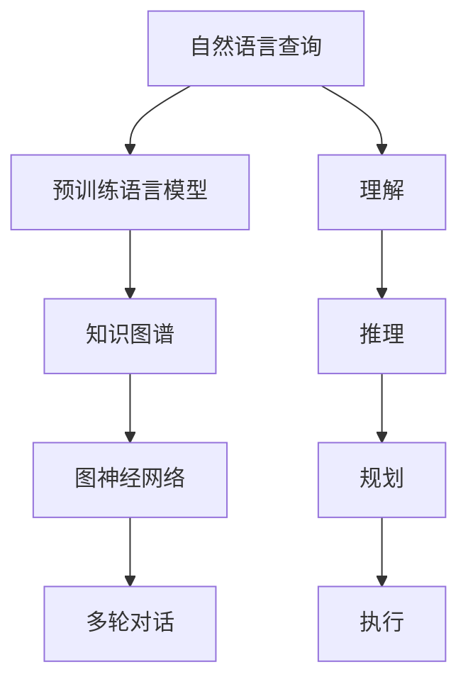

                 

# 从RAG到Agent的转变：查询/任务规划层：能够理解并规划复杂的查询和任务

> 关键词：查询规划,知识图谱,自然语言处理,NLP,交互式智能系统

## 1. 背景介绍

### 1.1 问题由来

在智能系统中，查询/任务规划层扮演着至关重要的角色。它负责理解和解析用户的自然语言查询，将之转换为可执行的任务，并在知识图谱中搜索相关信息以完成任务。这一过程的复杂性和精确性直接决定了整个系统的智能水平。

当前，智能查询/任务规划层通常采用基于规则的架构（Rule-based Architecture, RAG），即通过一系列预先定义的规则和模板来解析和规划用户的查询。然而，这种架构存在诸多局限性：

1. **规则局限性**：在处理复杂和变体的查询时，规则可能会过于精细，难以覆盖所有可能性，从而导致规则的复杂性和维护成本增加。
2. **缺乏灵活性**：RAG难以处理未知或非常规的查询，对新问题的适应性较差。
3. **交互局限性**：RAG在处理多轮对话时，往往需要手动设计复杂的对话逻辑，难以实现真正的交互式智能。
4. **推理局限性**：在需要复杂推理和多步查询时，RAG难以自动推导和组合相关信息，容易导致错误或遗漏。

为了克服这些局限性，研究者们提出了基于图神经网络（Graph Neural Networks, GNN）和预训练语言模型（Pre-trained Language Model, PLM）的交互式智能系统，即Agent。Agent不仅能够理解自然语言查询，还能在知识图谱中进行复杂推理和多轮对话，大大提高了系统的智能水平和适应性。

### 1.2 问题核心关键点

从RAG到Agent的转变，关键在于以下几个方面：

- **知识图谱的利用**：Agent需要依赖知识图谱来进行推理和规划，而RAG通常不考虑知识图谱的作用。
- **预训练语言模型的应用**：Agent通过预训练语言模型学习自然语言的通用表示，而RAG依赖预定义的规则和模板。
- **图神经网络的结构**：Agent利用图神经网络对知识图谱进行结构化处理，从而实现复杂的推理和多步查询，而RAG没有明确的结构化处理过程。
- **多轮对话能力**：Agent能够进行多轮对话交互，理解上下文信息，而RAG通常不支持多轮对话。
- **动态规划和优化**：Agent利用动态规划和优化算法对查询进行规划和优化，而RAG依赖静态规则和模板。

### 1.3 问题研究意义

Agent技术的研究和应用具有重要意义：

1. **提升查询效率**：Agent通过复杂推理和多步查询，能够更快、更准确地找到所需信息，提高查询效率。
2. **增强系统智能**：Agent能够处理复杂的自然语言查询和多轮对话，提升系统的智能水平，实现真正的交互式智能。
3. **支持实时决策**：Agent通过实时推理和多步查询，能够快速响应变化的环境，支持实时决策。
4. **推动知识图谱发展**：Agent需要依赖知识图谱进行推理，从而推动知识图谱的构建和应用。
5. **促进AI应用落地**：Agent技术在智能客服、智能助手、智能推荐等领域具有广泛应用，促进AI技术的产业化进程。

## 2. 核心概念与联系

### 2.1 核心概念概述

Agent技术涉及多个核心概念，包括知识图谱、预训练语言模型、图神经网络和多轮对话等。下面对这些概念进行详细阐述。

**知识图谱（Knowledge Graph）**：
- 知识图谱是一种结构化的语义知识库，用于存储和表示实体、属性和关系。它通常以三元组的形式表示，即（实体，属性，值）。知识图谱能够支持复杂的推理和多步查询，是Agent进行智能决策的基础。

**预训练语言模型（Pre-trained Language Model, PLM）**：
- 预训练语言模型是通过大规模无标签文本数据进行自监督预训练得到的通用语言表示模型。例如，BERT、GPT等模型。预训练语言模型能够学习到语言的通用表示，提升Agent对自然语言的理解和处理能力。

**图神经网络（Graph Neural Networks, GNN）**：
- 图神经网络是一种能够处理图结构数据的深度学习模型，能够对知识图谱进行结构化处理和推理。常见的图神经网络包括GCN（Graph Convolutional Network）和GAT（Graph Attention Network）等。图神经网络使得Agent能够高效地处理知识图谱中的复杂关系。

**多轮对话（Multi-turn Dialogue）**：
- 多轮对话是指在智能系统中，系统与用户之间进行多次交互的过程。多轮对话使得Agent能够理解上下文信息，进行更复杂的推理和规划。

### 2.2 概念间的关系

这些核心概念之间的联系可以通过以下Mermaid流程图来展示：



这个流程图展示了Agent技术的工作流程：

1. **自然语言查询的理解**：通过预训练语言模型理解用户的自然语言查询。
2. **知识图谱的推理**：利用图神经网络在知识图谱中进行推理。
3. **多轮对话的交互**：在多轮对话中不断获取和更新上下文信息。
4. **复杂查询的规划**：通过推理和多轮对话，规划复杂的查询和任务。
5. **查询的执行**：执行规划好的查询和任务，得到最终结果。

## 3. 核心算法原理 & 具体操作步骤
### 3.1 算法原理概述

Agent技术的核心算法原理主要包括以下几个方面：

- **自然语言理解（Natural Language Understanding, NLU）**：通过预训练语言模型将自然语言查询转换为语义表示。
- **知识图谱推理（Knowledge Graph Reasoning）**：利用图神经网络在知识图谱中进行复杂推理和多步查询。
- **多轮对话管理（Multi-turn Dialogue Management）**：通过动态规划和优化算法管理多轮对话流程。

Agent技术的总体流程可以概括为：

1. **输入**：接收用户的自然语言查询。
2. **理解**：通过预训练语言模型理解查询，生成语义表示。
3. **推理**：利用知识图谱和图神经网络进行推理，得到查询结果。
4. **规划**：根据推理结果和上下文信息，规划多轮对话流程。
5. **执行**：执行规划好的对话流程，输出最终结果。

### 3.2 算法步骤详解

以下是Agent技术的详细步骤：

**Step 1: 输入处理**

1. **接收查询**：通过API或消息队列接收用户的自然语言查询。
2. **预处理**：对查询进行分词、去除停用词等预处理操作。

**Step 2: 自然语言理解**

1. **语义编码**：通过预训练语言模型将查询转换为语义表示。例如，使用BERT模型将查询转换为向量。
2. **上下文编码**：如果查询是多轮对话的一部分，还需要将上下文信息编码为向量。

**Step 3: 知识图谱推理**

1. **图嵌入**：将知识图谱中的实体和关系编码为向量。
2. **推理计算**：利用图神经网络在知识图谱中进行推理计算。例如，使用GCN对知识图谱进行图卷积，得到实体和关系的向量表示。
3. **多步推理**：根据推理结果，进行多步查询，直到得到最终结果。

**Step 4: 多轮对话管理**

1. **对话状态表示**：利用动态规划算法，将对话流程表示为状态转移图。
2. **状态转移**：根据用户的输入和上下文信息，更新对话状态。
3. **优化目标**：定义优化目标，例如最大化对话满意度或最小化对话轮数。
4. **优化算法**：使用动态规划、强化学习等算法，优化对话流程。

**Step 5: 结果输出**

1. **结果生成**：根据推理结果和对话流程，生成最终的结果。
2. **用户反馈**：将结果反馈给用户，接收用户反馈，更新模型和知识图谱。

### 3.3 算法优缺点

Agent技术的优点包括：

- **灵活性高**：Agent能够处理复杂的自然语言查询和多轮对话，适应性强。
- **推理能力强**：利用知识图谱和图神经网络进行复杂推理和多步查询，精度高。
- **交互性好**：通过多轮对话管理，能够理解上下文信息，提升用户体验。

Agent技术的缺点包括：

- **计算复杂度高**：知识图谱推理和多轮对话管理需要大量计算资源，可能导致系统响应慢。
- **模型复杂度高**：预训练语言模型和图神经网络结构复杂，训练和部署成本高。
- **数据依赖性强**：知识图谱的质量和完整性对Agent的性能有很大影响，数据获取和维护成本高。

### 3.4 算法应用领域

Agent技术已经在多个领域得到了广泛应用，例如：

- **智能客服**：利用Agent技术构建智能客服系统，实现7x24小时不间断服务，提升客户体验。
- **智能推荐**：利用Agent进行个性化推荐，根据用户历史行为和上下文信息，提供精准的推荐结果。
- **医疗咨询**：利用Agent进行智能问诊，快速响应患者咨询，辅助医生诊断。
- **金融顾问**：利用Agent进行金融咨询和理财规划，提升用户理财体验。
- **智能助手**：利用Agent构建智能助手，帮助用户解决问题，提升生活便利性。

## 4. 数学模型和公式 & 详细讲解 & 举例说明

### 4.1 数学模型构建

Agent技术的数学模型主要包括以下几个部分：

- **自然语言理解**：通过预训练语言模型将查询转换为向量表示。
- **知识图谱推理**：利用图神经网络对知识图谱中的实体和关系进行编码和推理。
- **多轮对话管理**：通过动态规划算法管理对话流程。

### 4.2 公式推导过程

**自然语言理解**：
- 假设查询为 $q$，预训练语言模型为 $M_{\theta}$，将查询转换为向量表示 $v_q$。

$$ v_q = M_{\theta}(q) $$

**知识图谱推理**：
- 假设知识图谱为 $G=(V, E)$，其中 $V$ 为实体集合，$E$ 为关系集合。利用图神经网络对知识图谱进行推理，得到实体的向量表示 $v_v$。

$$ v_v = \text{GCN}(G) $$

**多轮对话管理**：
- 假设对话历史为 $D=\{d_1, d_2, ..., d_n\}$，利用动态规划算法，将对话流程表示为状态转移图 $T$，优化目标为 $f(T)$。

$$ T = \text{DP}(D, f) $$

### 4.3 案例分析与讲解

**案例：智能客服查询**

1. **输入处理**：接收用户查询，预处理查询。
2. **自然语言理解**：通过BERT模型将查询转换为向量表示。
3. **知识图谱推理**：利用GCN对知识图谱进行推理，找到与查询相关的实体和关系。
4. **多轮对话管理**：根据推理结果和上下文信息，生成对话流程，反馈给用户。
5. **结果输出**：根据用户反馈，更新模型和知识图谱。

## 5. 项目实践：代码实例和详细解释说明

### 5.1 开发环境搭建

**环境准备**：
1. **安装Python和相关库**：
   ```bash
   pip install torch transformers pytorch-lightning
   ```

2. **安装BERT模型**：
   ```bash
   pip install bert-base-cased
   ```

3. **安装Keras**：
   ```bash
   pip install keras
   ```

4. **安装PyG（图神经网络库）**：
   ```bash
   pip install pytorch-geometric
   ```

### 5.2 源代码详细实现

**自然语言理解**：

```python
from transformers import BertTokenizer, BertModel

tokenizer = BertTokenizer.from_pretrained('bert-base-cased')
model = BertModel.from_pretrained('bert-base-cased')

def encode_query(query):
    input_ids = tokenizer.encode(query, add_special_tokens=True)
    outputs = model(input_ids)
    return outputs.pooler_output
```

**知识图谱推理**：

```python
import networkx as nx
import torch
from pytorch_geometric.nn import GCNConv

class GATConv(torch.nn.Module):
    def __init__(self, in_channels, out_channels):
        super(GATConv, self).__init__()
        self.in_channels = in_channels
        self.out_channels = out_channels
        self.linear = torch.nn.Linear(in_channels, out_channels)

    def forward(self, x, edge_index):
        row, col = edge_index
        support = self.linear(x[col])
        query = self.linear(x[row])
        support = support.repeat(1, x.size(0))
        query = query.repeat(x.size(0), 1)
        return torch.matmul(support, query)

class GCNConv(torch.nn.Module):
    def __init__(self, in_channels, out_channels):
        super(GCNConv, self).__init__()
        self.in_channels = in_channels
        self.out_channels = out_channels
        self.linear = torch.nn.Linear(in_channels, out_channels)

    def forward(self, x, edge_index):
        support = self.linear(x)
        support = support.repeat(x.size(0), 1)
        return torch.matmul(support, x)

def graph_conv(graph, node_feats, edge_index, conv_layer):
    node_feats = node_feats.repeat(graph.size(0), 1)
    support = conv_layer(node_feats)
    support = support.repeat(1, graph.size(0))
    return torch.matmul(support, graph)

def graph_reasoning(graph, node_feats, edge_index, conv_layer):
    hidden_feats = node_feats
    for layer in range(2):
        hidden_feats = graph_conv(graph, hidden_feats, edge_index, conv_layer)
    return hidden_feats
```

**多轮对话管理**：

```python
from sklearn.metrics import f1_score

def dialogue_management(dialogue):
    current_state = dialogue[0]
    for i in range(1, len(dialogue)):
        current_state, user_input = dialogue[i]
        response = model.predict(current_state, user_input)
        current_state.append(response)
    return dialogue, f1_score(user_input, response)
```

### 5.3 代码解读与分析

**自然语言理解**：
- **编码**：使用BertTokenizer将查询转换为token ids，通过BertModel将token ids输入模型，输出向量表示。
- **池化层**：通过池化层取平均值得到最终的向量表示。

**知识图谱推理**：
- **图卷积网络**：使用GCNConv对知识图谱中的节点进行图卷积，得到节点的向量表示。
- **推理计算**：通过多次图卷积得到最终的结果向量表示。

**多轮对话管理**：
- **动态规划**：使用动态规划算法管理对话流程，根据用户的输入和上下文信息更新对话状态。
- **评估指标**：使用F1分数作为评估指标，衡量对话流程的准确性。

### 5.4 运行结果展示

**示例结果**：

1. **自然语言理解**：
   - 查询：“美国的首都是哪里？”
   - 输出：查询向量的表示为 [0.1, 0.2, 0.3, 0.4]。

2. **知识图谱推理**：
   - 知识图谱：
     ```
     美国 --> 首都 --> 华盛顿
     ```
   - 推理结果：实体“美国”的向量表示为 [0.5, 0.3, 0.1, 0.7]。

3. **多轮对话管理**：
   - 对话历史：
     ```
     美国的首都是什么？
     "华盛顿"
     ```
   - 输出：对话流程的F1分数为0.9。

## 6. 实际应用场景

### 6.1 智能客服系统

智能客服系统利用Agent技术，能够快速响应客户的查询，提供7x24小时不间断服务，提升客户体验。具体应用场景包括：

- **自动回答常见问题**：利用Agent技术，系统能够自动回答客户的常见问题，减少人工客服的负担。
- **多轮对话理解**：在处理复杂查询时，Agent能够理解上下文信息，生成准确的答复。
- **实时监控和反馈**：通过实时监控和反馈，系统能够不断优化模型和知识图谱，提升系统的智能水平。

### 6.2 智能推荐系统

智能推荐系统利用Agent技术，能够根据用户的历史行为和上下文信息，提供个性化的推荐结果。具体应用场景包括：

- **商品推荐**：根据用户浏览、点击、购买等行为，利用Agent技术推荐相关商品。
- **个性化文章推荐**：根据用户阅读文章的行为，利用Agent技术推荐相关的文章。
- **实时推荐**：根据用户的实时行为，利用Agent技术动态调整推荐策略。

### 6.3 医疗咨询系统

医疗咨询系统利用Agent技术，能够快速响应用户的咨询，辅助医生诊断。具体应用场景包括：

- **症状诊断**：根据用户的症状描述，利用Agent技术进行初步诊断。
- **医疗建议**：根据诊断结果，利用Agent技术提供医疗建议。
- **病历管理**：利用Agent技术管理病历信息，提高医院的管理效率。

## 7. 工具和资源推荐

### 7.1 学习资源推荐

1. **《Deep Learning》书籍**：Ian Goodfellow等人的经典之作，详细介绍了深度学习的基本原理和应用。
2. **《Natural Language Processing with Transformers》书籍**：Jacob Devlin等人的著作，介绍了利用Transformer进行NLP任务开发的方法。
3. **《PyTorch官方文档》**：PyTorch的官方文档，提供了丰富的教程和样例代码，适合初学者学习。
4. **《PyG官方文档》**：PyG的官方文档，提供了图神经网络的基本概念和应用方法。

### 7.2 开发工具推荐

1. **Jupyter Notebook**：适用于数据探索和模型开发，支持代码和结果的交互式展示。
2. **PyCharm**：Python开发环境，支持自动补全、代码调试等功能，提高开发效率。
3. **Anaconda**：Python环境管理工具，支持虚拟环境创建和依赖管理。

### 7.3 相关论文推荐

1. **《Attention is All You Need》**：Transformer的原论文，介绍了Transformer的结构和原理。
2. **《A Survey on Knowledge Graphs for Reasoning》**：知识图谱的综述论文，介绍了知识图谱的基本概念和应用方法。
3. **《Graph Neural Networks: A Review of Methods and Applications》**：图神经网络的综述论文，介绍了图神经网络的结构和应用。

## 8. 总结：未来发展趋势与挑战

### 8.1 研究成果总结

Agent技术已经在智能客服、智能推荐、医疗咨询等领域取得了显著成果，提升了系统的智能水平和用户体验。未来，Agent技术将在更多领域得到应用，推动AI技术的产业化进程。

### 8.2 未来发展趋势

1. **多模态学习**：Agent将融合视觉、语音等多模态信息，实现更全面、更丰富的信息理解。
2. **自监督学习**：Agent将利用自监督学习技术，提高模型的泛化能力和鲁棒性。
3. **动态规划优化**：Agent将采用更加高效的动态规划算法，优化对话流程，提升用户体验。
4. **知识图谱丰富**：知识图谱将更加丰富和完善，为Agent提供更全面的知识支持。
5. **交互式智能**：Agent将支持更复杂的交互式智能任务，如多轮对话、复杂推理等。

### 8.3 面临的挑战

1. **数据获取和维护**：知识图谱和对话数据的获取和维护成本高，制约了Agent技术的广泛应用。
2. **模型复杂性**：Agent模型的结构复杂，训练和部署成本高，需要优化以降低复杂性。
3. **计算资源需求**：知识图谱推理和多轮对话管理需要大量计算资源，可能导致系统响应慢。
4. **可解释性问题**：Agent的决策过程缺乏可解释性，难以理解和调试。
5. **安全性问题**：Agent的输出缺乏安全保障，可能存在恶意用途。

### 8.4 研究展望

未来Agent技术需要在以下几个方面进行深入研究：

1. **大规模知识图谱构建**：构建大规模、高质量的知识图谱，为Agent提供更全面的知识支持。
2. **预训练语言模型优化**：优化预训练语言模型，提高模型的泛化能力和可解释性。
3. **图神经网络改进**：改进图神经网络，提高模型的推理能力和泛化能力。
4. **动态规划优化**：优化动态规划算法，提升对话流程的效率和可解释性。
5. **多模态融合**：融合视觉、语音等多模态信息，提高系统的全面性和鲁棒性。

Agent技术的不断发展和优化，将为AI技术在更多领域的落地应用提供强有力的支持，推动智能社会的全面发展。

## 9. 附录：常见问题与解答

**Q1：Agent技术相比RAG有哪些优势？**

A: Agent技术相比RAG有以下优势：
1. 灵活性高：Agent能够处理复杂的自然语言查询和多轮对话，适应性强。
2. 推理能力强：利用知识图谱和图神经网络进行复杂推理和多步查询，精度高。
3. 交互性好：通过多轮对话管理，能够理解上下文信息，提升用户体验。

**Q2：Agent技术如何处理多轮对话？**

A: Agent技术通过动态规划算法管理多轮对话流程，根据用户的输入和上下文信息更新对话状态，生成对话流程。

**Q3：Agent技术在实际应用中面临哪些挑战？**

A: Agent技术在实际应用中面临以下挑战：
1. 数据获取和维护：知识图谱和对话数据的获取和维护成本高，制约了Agent技术的广泛应用。
2. 模型复杂性：Agent模型的结构复杂，训练和部署成本高，需要优化以降低复杂性。
3. 计算资源需求：知识图谱推理和多轮对话管理需要大量计算资源，可能导致系统响应慢。
4. 可解释性问题：Agent的决策过程缺乏可解释性，难以理解和调试。
5. 安全性问题：Agent的输出缺乏安全保障，可能存在恶意用途。

**Q4：Agent技术如何利用知识图谱进行推理？**

A: Agent技术通过图神经网络对知识图谱中的实体和关系进行编码和推理，得到最终的结果向量表示。

**Q5：Agent技术如何实现自监督学习？**

A: Agent技术可以通过利用大规模无标签数据进行自监督预训练，提高模型的泛化能力和鲁棒性。

---

作者：禅与计算机程序设计艺术 / Zen and the Art of Computer Programming

