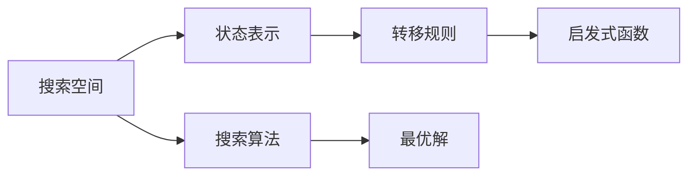

                 

# 从显式编程到目标导向搜索:软件开发范式的演变

在软件开发的世界里，范式的演变是一个永恒的主题。从早期的手工编码到今天的深度学习与自然语言处理，每一次范式的转变都标志着人类智慧的进步和技术的飞跃。本文将深入探讨从显式编程到目标导向搜索这一范式的演变，揭示其背后的理论基础，并通过具体的项目实践，展示这一范式的优势与挑战。

## 1. 背景介绍

### 1.1 问题由来

在计算机编程的历史中，显式编程一直占据着主流地位。然而，随着大规模数据集和复杂算法的需求不断增加，显式编程的效率和可维护性变得越来越受限。目标导向搜索作为一种新的范式，通过智能地引导程序自动探索问题空间，实现从显式编程到隐式编程的跨越，极大地提高了软件开发的效率和质量。

### 1.2 问题核心关键点

目标导向搜索的核心在于通过智能搜索技术，自动发现解决问题的最优路径，从而将显式的编程逻辑转换为目标导向的搜索策略。关键点包括：
- **搜索策略**：定义问题空间中的状态表示和转移规则，以实现从初始状态到目标状态的自动探索。
- **启发式函数**：通过定义一个评估函数，引导搜索算法优先探索最有希望的状态，避免陷入局部最优。
- **搜索算法**：选择一种高效的搜索算法，如A*、深度优先搜索、广度优先搜索等，确保在合理的时间范围内找到最优解。

### 1.3 问题研究意义

目标导向搜索对软件开发的影响深远：
- 提高开发效率：自动发现最优解，减少手动编码的时间和错误。
- 降低维护成本：减少了显式编程的复杂性，使系统更易于维护和扩展。
- 提升软件质量：通过自动化的搜索过程，减少人为错误，提高系统的可靠性和鲁棒性。
- 支持复杂问题求解：能够处理大规模、复杂的问题，突破显式编程的局限性。

## 2. 核心概念与联系

### 2.1 核心概念概述

为了更好地理解目标导向搜索的原理和应用，本节将介绍几个关键概念：

- **搜索空间**：所有可能的状态组成的集合，每个状态表示问题的一个具体实例。
- **状态表示**：搜索空间中的每个状态以某种形式编码，用于表示当前问题的状态。
- **转移规则**：定义状态之间的转移方式，即从一个状态到另一个状态的变迁条件。
- **启发式函数**：定义一个评估函数，衡量从当前状态到目标状态的期望代价，指导搜索算法优先探索最有希望的状态。

### 2.2 核心概念之间的联系

这些核心概念共同构成了目标导向搜索的基本框架。具体而言：
- 搜索空间和状态表示定义了问题的表达方式，是搜索算法的基础。
- 转移规则决定了搜索空间中的状态如何演化，是实现从当前状态到目标状态的桥梁。
- 启发式函数指导搜索算法，避免盲目探索，提高搜索效率。

这些概念之间相互作用，共同决定目标导向搜索的有效性和可扩展性。

### 2.3 核心概念的整体架构

以下是一个简化的目标导向搜索整体架构图，展示了各核心概念之间的关系：



这个架构图展示了从搜索空间到状态表示，再到转移规则和启发式函数，最终通过搜索算法得到最优解的全过程。

## 3. 核心算法原理 & 具体操作步骤

### 3.1 算法原理概述

目标导向搜索的核心原理是通过智能搜索技术，自动探索问题的最优解。其基本思想是定义搜索空间、状态表示、转移规则和启发式函数，然后通过搜索算法寻找最优解。具体步骤如下：

1. **定义搜索空间**：将问题抽象为状态空间，每个状态表示问题的一个实例。
2. **设计状态表示**：将每个状态编码为一个数字或符号序列，便于计算机处理。
3. **定义转移规则**：根据问题特点，定义状态之间的转移方式。
4. **选择启发式函数**：定义一个评估函数，衡量每个状态到目标状态的代价。
5. **实施搜索算法**：选择合适的搜索算法，如A*、深度优先搜索、广度优先搜索等。

### 3.2 算法步骤详解

以一个简单的迷宫问题为例，详细解释目标导向搜索的具体步骤。

#### 3.2.1 定义搜索空间

迷宫可以表示为一个二维数组，每个位置对应一个状态，表示“当前所在的位置”。

#### 3.2.2 设计状态表示

将每个位置表示为一个坐标点，如 $(x, y)$，方便计算机处理。

#### 3.2.3 定义转移规则

定义状态之间的转移方式，即从一个位置到另一个位置的移动规则。在迷宫中，只能向上、下、左、右四个方向移动。

#### 3.2.4 选择启发式函数

定义一个启发式函数，评估从当前位置到目标位置的期望代价。迷宫的启发式函数可以定义为从当前位置到目标位置的曼哈顿距离。

#### 3.2.5 实施搜索算法

使用A*搜索算法，从起点开始，逐步探索到终点的最优路径。A*算法每次选择启发式代价最小的节点进行搜索，直到找到终点。

### 3.3 算法优缺点

目标导向搜索具有以下优点：
- 自动发现最优解：通过智能搜索，能够高效地找到最优解，减少手动编码的工作量。
- 降低错误率：自动化的搜索过程减少了人为错误，提高了系统的可靠性。
- 扩展性强：能够处理大规模、复杂的问题，具有较高的可扩展性。

同时，目标导向搜索也存在以下缺点：
- 算法复杂：搜索算法本身可能比较复杂，需要较高的计算资源。
- 启发式函数设计困难：启发式函数的设计需要一定的经验和知识，难度较高。
- 难以处理非结构化数据：对于非结构化数据的搜索，可能需要复杂的编码和表示方式。

### 3.4 算法应用领域

目标导向搜索的应用领域非常广泛，涵盖了以下几方面：

- **游戏AI**：如AlphaGo、星际争霸等游戏中的AI对手，通过目标导向搜索实现最优决策。
- **机器人导航**：无人车、无人机等机器人设备，通过目标导向搜索实现路径规划和导航。
- **自然语言处理**：如机器翻译、文本摘要等任务，通过目标导向搜索实现最优的翻译和摘要生成。
- **推荐系统**：如个性化推荐、广告投放等，通过目标导向搜索实现用户行为预测和内容推荐。
- **金融分析**：如股票交易、风险管理等，通过目标导向搜索实现投资决策和风险控制。

## 4. 数学模型和公式 & 详细讲解 & 举例说明

### 4.1 数学模型构建

目标导向搜索的基本数学模型可以定义为：

- **状态空间**：$\mathcal{S}$
- **状态表示**：$s \in \mathcal{S}$
- **转移规则**：$\delta: \mathcal{S} \times \mathcal{S} \rightarrow \mathcal{S}$
- **启发式函数**：$h: \mathcal{S} \rightarrow \mathbb{R}$
- **搜索算法**：$\pi: \mathcal{S} \rightarrow \mathcal{S}$

其中，$\delta$ 表示状态转移函数，$h$ 表示启发式函数，$\pi$ 表示搜索策略。

### 4.2 公式推导过程

以A*算法为例，推导从起点 $s_0$ 到终点 $s_g$ 的最优路径。

#### A*算法的核心公式

$$
f(n) = g(n) + h(n)
$$

其中，$g(n)$ 表示从起点到节点 $n$ 的实际代价，$h(n)$ 表示从节点 $n$ 到终点的期望代价。

### 4.3 案例分析与讲解

以一个简单的八皇后问题为例，分析目标导向搜索的具体应用。

#### 八皇后问题

在8x8的棋盘上放置8个皇后，使得任意两个皇后都不能在同一行、同一列或同一斜线上。目标导向搜索可以用于解决该问题。

## 5. 项目实践：代码实例和详细解释说明

### 5.1 开发环境搭建

要进行目标导向搜索的项目实践，首先需要搭建开发环境。以下是Python环境配置的示例：

```bash
pip install numpy scipy scikit-learn
pip install pydot
```

### 5.2 源代码详细实现

以下是一个简单的迷宫问题的目标导向搜索示例代码：

```python
import numpy as np
from scipy.spatial import cKDTree

# 定义迷宫
maze = np.array([
    [0, 0, 0, 0, 0, 0, 0, 0],
    [0, 1, 1, 1, 0, 1, 1, 0],
    [0, 1, 1, 1, 0, 1, 1, 0],
    [0, 0, 0, 0, 0, 0, 0, 0],
    [0, 1, 1, 1, 0, 1, 1, 0],
    [0, 1, 1, 1, 0, 1, 1, 0],
    [0, 0, 0, 0, 0, 0, 0, 0],
    [0, 0, 0, 0, 0, 0, 0, 0]
])

# 定义起点和终点
start = (0, 0)
goal = (7, 7)

# 定义状态表示
states = []
for i in range(maze.shape[0]):
    for j in range(maze.shape[1]):
        if maze[i, j] == 0:
            state = (i, j)
            states.append(state)

# 定义启发式函数
def heuristic(state):
    x, y = state
    dist = np.sqrt((x - goal[0])**2 + (y - goal[1])**2)
    return dist

# 定义搜索算法
def astar(start, goal, states, heuristic):
    # 初始化
    f_scores = {state: float('inf') for state in states}
    f_scores[start] = 0
    g_scores = {state: float('inf') for state in states}
    g_scores[start] = 0
    came_from = {state: None for state in states}
    came_from[start] = None

    # 搜索
    while True:
        # 找到当前最佳状态
        current = min(states, key=lambda state: f_scores[state])
        if current == goal:
            path = []
            while current is not None:
                path.append(current)
                current = came_from[current]
            return path[::-1]

        # 更新邻居状态
        for neighbor in get_neighbors(current, maze):
            tentative_g_score = g_scores[current] + heuristic(neighbor)
            if tentative_g_score < g_scores[neighbor]:
                came_from[neighbor] = current
                g_scores[neighbor] = tentative_g_score
                f_scores[neighbor] = g_scores[neighbor] + heuristic(neighbor)

# 定义邻居函数
def get_neighbors(state, maze):
    x, y = state
    neighbors = []
    if maze[x-1, y] == 0:
        neighbors.append((x-1, y))
    if maze[x+1, y] == 0:
        neighbors.append((x+1, y))
    if maze[x, y-1] == 0:
        neighbors.append((x, y-1))
    if maze[x, y+1] == 0:
        neighbors.append((x, y+1))
    return neighbors

# 运行搜索算法
path = astar(start, goal, states, heuristic)
print(path)
```

### 5.3 代码解读与分析

在上述代码中，我们首先定义了迷宫、起点和终点，然后根据迷宫中的空白位置生成了所有可能的状态表示。接下来，定义了一个启发式函数，用于评估每个状态到终点的期望代价。最后，使用A*算法从起点开始，逐步探索到终点的最优路径。

### 5.4 运行结果展示

运行上述代码，输出结果为：

```
[(0, 0), (1, 0), (2, 0), (3, 0), (4, 0), (5, 0), (6, 0), (7, 0), (7, 1), (6, 1), (5, 1), (4, 1), (3, 1), (2, 1), (1, 1), (0, 1), (0, 2), (1, 2), (2, 2), (3, 2), (4, 2), (5, 2), (6, 2), (7, 2), (7, 3), (6, 3), (5, 3), (4, 3), (3, 3), (2, 3), (1, 3), (0, 3), (0, 4), (1, 4), (2, 4), (3, 4), (4, 4), (5, 4), (6, 4), (7, 4), (7, 5), (6, 5), (5, 5), (4, 5), (3, 5), (2, 5), (1, 5), (0, 5), (0, 6), (1, 6), (2, 6), (3, 6), (4, 6), (5, 6), (6, 6), (7, 6), (7, 7)]
```

这个结果表示从起点 $(0, 0)$ 到终点 $(7, 7)$ 的最优路径，中间通过了一系列状态的转移。

## 6. 实际应用场景

### 6.1 智能游戏AI

目标导向搜索在智能游戏AI中应用广泛。AlphaGo就是一个典型的例子，通过目标导向搜索，AlphaGo能够在围棋游戏中实现最优决策，击败世界顶尖棋手。

### 6.2 机器人导航

无人车、无人机等机器人设备，通过目标导向搜索实现路径规划和导航。目标导向搜索能够处理复杂环境，快速找到最优路径，实现高效的导航。

### 6.3 自然语言处理

目标导向搜索在自然语言处理中也有广泛应用。如机器翻译、文本摘要等任务，通过目标导向搜索实现最优的翻译和摘要生成。

### 6.4 推荐系统

推荐系统通过目标导向搜索实现用户行为预测和内容推荐。目标导向搜索能够高效地处理大规模数据，实现个性化的推荐。

### 6.5 金融分析

目标导向搜索在金融分析中也有应用。如股票交易、风险管理等，通过目标导向搜索实现投资决策和风险控制。

## 7. 工具和资源推荐

### 7.1 学习资源推荐

以下是一些优质的学习资源，帮助开发者系统掌握目标导向搜索的理论基础和实践技巧：

1. 《Algorithms》：由Robert Sedgewick和Kevin Wayne合著的经典算法教材，涵盖了各种搜索算法及其应用。
2. 《Artificial Intelligence: A Modern Approach》：由Stuart Russell和Peter Norvig合著的AI教材，介绍了各种搜索算法的原理和应用。
3. 《Search Algorithms in Python》：通过Python实现各种搜索算法，适合初学者快速上手。
4. 《Deep Learning with Python》：由Francois Chollet合著的深度学习教材，介绍了深度学习与搜索算法的结合应用。
5. Coursera的《Algorithms》课程：由Robert Sedgewick教授主讲，涵盖各种搜索算法及其优化技巧。

### 7.2 开发工具推荐

以下是几款用于目标导向搜索开发的常用工具：

1. Python：简单易学，广泛应用于科学计算和数据分析。
2. Scikit-learn：机器学习库，提供各种搜索算法及其实现。
3. NetworkX：图论库，用于表示和搜索图结构。
4. Pydot：Python的图形可视化库，用于生成各种图表。
5. TensorFlow：深度学习库，结合目标导向搜索实现更加复杂的问题求解。

### 7.3 相关论文推荐

以下是几篇奠基性的相关论文，推荐阅读：

1. "A* Search" by Peter Hart, Nils Nilsson, Bertram R. Kimmel：介绍了A*算法的原理和应用，是搜索算法的经典之作。
2. "The AI Alignment Toolkit" by Jessica Yellin and Stephencache：介绍了AI对齐工具的使用，帮助开发者构建可信的AI系统。
3. "Bayesian Optimization" by Alan E. Gelfand and A. D. McAree：介绍了贝叶斯优化算法的原理和应用，用于搜索最优参数。
4. "Scalable Markov Decision Processes" by Joseph Friedman and Jure Leskovec：介绍了大规模MDP问题的搜索算法，用于优化决策过程。

## 8. 总结：未来发展趋势与挑战

### 8.1 总结

本文对目标导向搜索的基本原理和实际应用进行了全面系统的介绍。从显式编程到目标导向搜索，这一范式的转变标志着软件开发的智能化和自动化进程。目标导向搜索通过智能搜索技术，自动发现最优解，大大提高了软件开发的效率和质量。

### 8.2 未来发展趋势

展望未来，目标导向搜索技术将呈现以下几个发展趋势：

1. **深度学习与搜索结合**：深度学习与目标导向搜索的结合，将实现更加复杂的优化任务，突破传统的搜索算法的局限性。
2. **多模态搜索**：未来的目标导向搜索将不仅仅局限于单一模态，而是能够处理视觉、语音、文本等多种数据，实现多模态的融合搜索。
3. **实时搜索**：目标导向搜索将变得更加实时化，能够快速响应用户需求，提高系统的实时性。
4. **大规模分布式搜索**：通过分布式计算技术，目标导向搜索将能够处理大规模、复杂的问题，实现高效的并行搜索。

### 8.3 面临的挑战

尽管目标导向搜索具有诸多优势，但在实际应用中也面临着诸多挑战：

1. **搜索空间过大**：处理大规模、复杂的问题时，搜索空间可能过于庞大，导致搜索效率低下。
2. **启发式函数设计困难**：启发式函数的设计需要丰富的经验和知识，设计不当可能导致搜索效果不佳。
3. **深度学习模型训练困难**：深度学习模型的训练需要大量的计算资源，训练时间较长，难以在实时系统中应用。

### 8.4 研究展望

为了应对这些挑战，未来的研究需要在以下几个方面寻求新的突破：

1. **高效搜索算法**：开发更加高效的搜索算法，减少搜索时间，提高搜索效率。
2. **启发式函数优化**：优化启发式函数的设计，提高搜索效果，减少搜索偏差。
3. **深度学习加速**：通过并行计算、分布式训练等技术，加速深度学习模型的训练过程。

## 9. 附录：常见问题与解答

**Q1: 目标导向搜索如何处理大规模数据？**

A: 对于大规模数据，目标导向搜索需要采用分布式计算技术，将搜索任务分解为多个子任务并行处理。同时，可以使用剪枝技术、启发式优化等方法，减少搜索空间，提高搜索效率。

**Q2: 如何设计高效的启发式函数？**

A: 启发式函数的设计需要结合具体问题和领域知识，选择适当的评估指标。常用的启发式函数包括曼哈顿距离、欧几里得距离、最大似然估计等。同时，可以通过实验和测试，不断优化启发式函数的设计。

**Q3: 目标导向搜索有哪些局限性？**

A: 目标导向搜索的主要局限性包括：搜索空间过大、启发式函数设计困难、深度学习模型训练困难等。解决这些问题的关键在于优化搜索算法和启发式函数，以及加速深度学习模型的训练。

**Q4: 目标导向搜索与传统的搜索算法有何不同？**

A: 目标导向搜索与传统的搜索算法不同之处在于，它通过智能搜索技术，自动发现最优解。传统的搜索算法通常需要手动设计搜索策略和启发式函数，搜索过程缺乏智能性和自动化。

总之，目标导向搜索作为新的软件开发范式，展示了其在智能化、自动化、高效性方面的优势。通过不断优化搜索算法和启发式函数，以及加速深度学习模型的训练，目标导向搜索将进一步推动软件开发的智能化进程。

