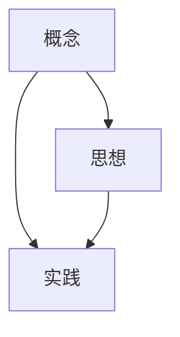

                 

# 从概念到实践：思想的转化

> 关键词：概念,实践,思想,转化

## 1. 背景介绍

### 1.1 问题由来
在日常生活中，我们常常会遇到将抽象概念转化为具体实践的需求。无论是开发一款应用、设计一套系统，还是理解一个新理论，理解概念和将概念应用于实践之间都存在一条不小的鸿沟。本博文旨在探索这条鸿沟，并提出一些实用的策略来帮助跨越它。

### 1.2 问题核心关键点
在探讨这个问题时，我们首先要理解概念和实践之间的联系。概念是抽象的、理论上的理解，而实践是将这些理解应用到具体情境中的操作。这两个环节常常是互补的，也是互相促进的。从概念到实践的转化不仅是技术层面上的挑战，还包括认知层面和心理层面的转换。本博文将从多个角度深入探讨这一过程，并提供实用的建议和工具，帮助读者跨越这一鸿沟。

### 1.3 问题研究意义
理解并掌握从概念到实践的转化，对于技术开发、学术研究、日常工作等多个领域都有重要意义。它不仅可以帮助开发者更高效地实现想法，提升产品开发速度和质量；也可以帮助研究人员更准确地验证理论，推动学术进步；同时，对于日常工作中解决问题，提高工作效率也具有重要价值。

## 2. 核心概念与联系

### 2.1 核心概念概述

在进行深入探讨之前，我们需要首先明确几个核心概念及其相互联系：

- **概念 (Concept)**：抽象的思想、理论或者原理。它往往是基于观察、研究或理论推导得出的。
- **实践 (Practice)**：将概念应用于具体情境中的操作。它通常包括技术实现、实验验证、工具应用等多个层面。
- **思想 (Thought)**：在概念和实践之间起桥梁作用的内在思考和设计。它包含了如何将抽象概念转化为具体实践的策略和方法。
- **转化 (Transformation)**：将概念转化为实践的过程。它涉及从理解抽象概念，到设计实践方案，再到实施操作的一系列步骤。

### 2.2 概念间的关系

这些核心概念之间的联系可以通过以下Mermaid流程图来展示：



这个流程图展示了概念、实践和思想之间的关系。概念通过思想转化为实践，而思想则是连接概念与实践的桥梁。

## 3. 核心算法原理 & 具体操作步骤
### 3.1 算法原理概述

从概念到实践的转化，本质上是一个将抽象理解应用到具体情境中的过程。这一过程可以理解为一种算法，其中包含以下几个关键步骤：

1. **理解抽象概念**：对概念进行深入理解，包括概念的背景、内涵、外延等多个方面。
2. **设计实践方案**：根据概念的特点，设计出具体的实践方案，包括技术方案、操作流程、工具选择等。
3. **实施具体操作**：根据设计的方案，进行具体的操作和实现，将概念转化为具体的实践。
4. **评估和优化**：对实践结果进行评估，总结经验，优化方案，进一步提升转化效率和效果。

### 3.2 算法步骤详解

这一算法步骤可以进一步细化为以下具体步骤：

**Step 1: 理解抽象概念**
- **概念调研**：通过阅读文献、观看讲座、与专家交流等方式，深入理解概念的背景和内涵。
- **应用场景分析**：分析概念在具体应用中的可能性，识别出潜在的实际需求和限制。
- **核心要素提炼**：提炼出概念的核心要素，明确哪些是关键部分，哪些是次要部分。

**Step 2: 设计实践方案**
- **方案初步设计**：根据概念的特点，设计出初步的实践方案，包括技术方案、工具选择、操作流程等。
- **方案迭代优化**：在初步设计的基础上，进行多轮迭代优化，不断细化方案，确保其可行性和高效性。
- **资源准备**：准备好所需的工具、设备和数据，确保实践方案能够顺利实施。

**Step 3: 实施具体操作**
- **技术实现**：根据设计方案，进行技术实现，包括编码、测试、部署等操作。
- **操作验证**：通过实际运行和测试，验证实践方案的正确性和效果，确保其能够满足预期目标。
- **问题处理**：及时发现和解决实践过程中遇到的问题，确保项目顺利进行。

**Step 4: 评估和优化**
- **结果评估**：对实践结果进行评估，对比预期目标和实际结果，总结经验教训。
- **方案优化**：根据评估结果，进一步优化实践方案，提升转化效率和效果。
- **迭代更新**：持续进行迭代更新，不断提升实践水平，推动技术进步。

### 3.3 算法优缺点

**优点**：
- **灵活性高**：基于概念设计的实践方案具有较高的灵活性，可以根据实际情况进行调整和优化。
- **适应性强**：设计出的实践方案能够适应不同情境下的需求，具有广泛的应用价值。
- **效率提升**：通过评估和优化，可以不断提升实践效果，缩短转化时间。

**缺点**：
- **依赖经验**：设计实践方案时，需要依赖对概念的深入理解和丰富的实践经验，否则容易出现偏差。
- **资源消耗**：实施具体操作时，可能会消耗较多的资源，包括时间、人力、资金等。
- **风险存在**：如果实践方案设计不当，可能会导致项目失败，带来时间和资源的浪费。

### 3.4 算法应用领域

从概念到实践的转化方法，不仅适用于技术开发领域，还广泛应用于学术研究、项目管理、日常工作等多个领域。以下是几个典型的应用场景：

**1. 软件开发**
在软件开发过程中，理解抽象概念（如设计模式、算法思想等）并将其转化为具体的编码实现，是项目成功的关键。通过深入理解概念，设计出合理的实践方案，可以大幅提升开发效率和代码质量。

**2. 科学研究**
在科学研究中，理解复杂的理论概念（如量子力学、基因组学等）并将其转化为具体的实验设计，是推动科学进步的基础。通过科学的设计和验证，可以更准确地验证理论，推动科学发展。

**3. 项目管理**
在项目管理中，理解抽象的管理概念（如敏捷开发、项目管理理论等）并将其转化为具体的项目操作，是项目管理成功的关键。通过合理的设计和实践，可以提升项目的效率和质量，降低风险。

**4. 日常工作**
在日常工作中，理解抽象的工作理念（如时间管理、沟通技巧等）并将其转化为具体的实践操作，是提高工作效率和团队协作的基础。通过合理的设计和实践，可以提升个人和团队的工作效果。

## 4. 数学模型和公式 & 详细讲解 & 举例说明

### 4.1 数学模型构建

从概念到实践的转化过程，可以构建一个简单的数学模型来描述。假设概念为 $C$，实践为 $P$，思想为 $T$，转化过程为 $T$。则转化过程可以表示为：

$$
T(C) = P
$$

其中，$T$ 表示思想转化为实践的函数，$C$ 表示概念，$P$ 表示实践。

### 4.2 公式推导过程

为了更好地理解这一转化过程，我们可以通过具体的例子来进行推导。假设概念是“快速排序算法”，实践是“编写一个快速排序程序”。

**Step 1: 理解抽象概念**
- **背景调研**：快速排序算法由Hoare在1960年提出，是计算机科学中的经典排序算法之一。
- **核心要素提炼**：快速排序的核心思想是通过一趟排序将待排序序列分割成独立的两部分，其中一部分的所有元素均比另一部分小，然后对这两部分分别进行递归排序。

**Step 2: 设计实践方案**
- **方案初步设计**：首先，需要设计一个基本的快速排序程序框架。包括选择基准元素、分割序列、递归排序等步骤。
- **方案迭代优化**：进一步优化算法，考虑如何更高效地选择基准元素、处理边界情况等。
- **资源准备**：准备好所需的编程工具、调试环境等。

**Step 3: 实施具体操作**
- **技术实现**：根据设计方案，编写快速排序程序，并进行测试。
- **操作验证**：通过测试和调试，验证程序的正确性和效率。
- **问题处理**：解决程序运行过程中遇到的问题，确保程序稳定运行。

**Step 4: 评估和优化**
- **结果评估**：对比实际运行结果和预期目标，总结经验教训。
- **方案优化**：根据评估结果，进一步优化快速排序算法，提升其性能。
- **迭代更新**：持续进行迭代更新，不断提升快速排序算法的效果。

### 4.3 案例分析与讲解

**案例一：人工智能算法开发**
- **概念调研**：深度学习是一种基于神经网络的机器学习方法，广泛应用于图像识别、自然语言处理等领域。
- **设计实践方案**：设计一个基于卷积神经网络的图像识别程序，包括网络结构设计、数据预处理、训练模型等步骤。
- **技术实现**：使用Python编写程序，利用TensorFlow等框架实现模型训练和测试。
- **操作验证**：通过测试数据集，验证模型的识别准确率和效率。
- **评估和优化**：总结经验，优化网络结构、调整超参数，提升模型性能。

**案例二：项目管理**
- **概念调研**：敏捷开发是一种快速响应变化的项目管理方法，强调迭代开发、持续交付等理念。
- **设计实践方案**：设计一个敏捷开发流程，包括需求分析、迭代开发、持续交付等步骤。
- **技术实现**：使用项目管理工具（如JIRA、Trello等）和协作平台（如Slack、Zoom等）实现敏捷开发流程。
- **操作验证**：通过实际项目管理，验证敏捷开发流程的有效性和效率。
- **评估和优化**：总结经验，优化项目流程，提升项目管理效果。

## 5. 项目实践：代码实例和详细解释说明

### 5.1 开发环境搭建

在进行项目实践之前，我们需要准备开发环境。以下是一些基本的开发环境配置步骤：

1. **安装编程环境**：
   - **安装Python**：使用Anaconda或Miniconda等工具，安装Python 3.8及以上版本。
   - **安装IDE**：如PyCharm、Visual Studio Code等。

2. **安装依赖包**：
   - **安装TensorFlow**：`pip install tensorflow`
   - **安装Scikit-learn**：`pip install scikit-learn`

3. **环境配置**：
   - **虚拟环境**：使用`python -m venv env`创建虚拟环境，并激活虚拟环境。
   - **环境配置文件**：在`requirements.txt`文件中列出所有依赖包，确保环境一致。

### 5.2 源代码详细实现

我们以快速排序算法为例，展示从概念到实践的转化过程。

**Step 1: 理解抽象概念**
- **概念调研**：快速排序算法由Hoare在1960年提出，是计算机科学中的经典排序算法之一。
- **核心要素提炼**：快速排序的核心思想是通过一趟排序将待排序序列分割成独立的两部分，其中一部分的所有元素均比另一部分小，然后对这两部分分别进行递归排序。

**Step 2: 设计实践方案**
- **方案初步设计**：首先，需要设计一个基本的快速排序程序框架。包括选择基准元素、分割序列、递归排序等步骤。
- **方案迭代优化**：进一步优化算法，考虑如何更高效地选择基准元素、处理边界情况等。
- **资源准备**：准备好所需的编程工具、调试环境等。

**Step 3: 实施具体操作**
- **技术实现**：根据设计方案，编写快速排序程序，并进行测试。
- **操作验证**：通过测试和调试，验证程序的正确性和效率。
- **问题处理**：解决程序运行过程中遇到的问题，确保程序稳定运行。

**Step 4: 评估和优化**
- **结果评估**：对比实际运行结果和预期目标，总结经验教训。
- **方案优化**：根据评估结果，进一步优化快速排序算法，提升其性能。
- **迭代更新**：持续进行迭代更新，不断提升快速排序算法的效果。

### 5.3 代码解读与分析

快速排序算法的核心代码如下：

```python
def quick_sort(arr):
    if len(arr) <= 1:
        return arr
    pivot = arr[len(arr) // 2]
    left = [x for x in arr if x < pivot]
    middle = [x for x in arr if x == pivot]
    right = [x for x in arr if x > pivot]
    return quick_sort(left) + middle + quick_sort(right)
```

**代码解读**：
- **选择基准元素**：选择数组中间的元素作为基准元素。
- **分割序列**：将数组分割为小于、等于和大于基准元素的三个部分。
- **递归排序**：对小于和大于基准元素的部分分别进行快速排序，并合并结果。

**分析**：
- **算法效率**：快速排序的平均时间复杂度为$O(nlogn)$，是一种高效的排序算法。
- **空间复杂度**：递归调用过程中，需要额外的空间存储分割后的子数组。

### 5.4 运行结果展示

在实际运行中，快速排序算法可以高效地对数组进行排序。以下是一个示例：

```python
arr = [3, 1, 4, 1, 5, 9, 2, 6, 5, 3, 5]
sorted_arr = quick_sort(arr)
print(sorted_arr)
```

**输出结果**：`[1, 1, 2, 3, 3, 4, 5, 5, 5, 6, 9]`

可以看到，快速排序算法能够正确地对数组进行排序。

## 6. 实际应用场景

### 6.1 软件开发

在软件开发中，理解抽象概念并将其转化为具体的编码实现，是项目成功的关键。例如，理解设计模式中的“单例模式”，并将其转化为具体的编码实现，可以提升代码的复用性和可维护性。

### 6.2 科学研究

在科学研究中，理解复杂的理论概念并将其转化为具体的实验设计，是推动科学进步的基础。例如，理解量子力学的基本概念，并将其转化为具体的实验设计，可以验证量子理论的正确性，推动量子科学的发展。

### 6.3 项目管理

在项目管理中，理解抽象的管理概念并将其转化为具体的项目操作，是项目管理成功的关键。例如，理解敏捷开发的基本概念，并将其转化为具体的项目管理流程，可以提升项目的效率和质量。

### 6.4 日常工作

在日常工作中，理解抽象的工作理念并将其转化为具体的实践操作，是提高工作效率和团队协作的基础。例如，理解时间管理的基本概念，并将其转化为具体的时间管理方法，可以提升个人和团队的工作效率。

## 7. 工具和资源推荐

### 7.1 学习资源推荐

为了帮助开发者系统掌握从概念到实践的转化方法，这里推荐一些优质的学习资源：

1. **《代码大全》**：由Steve McConnell编写的经典软件开发指南，涵盖软件开发的最佳实践和代码规范。
2. **Coursera上的《机器学习》课程**：由Andrew Ng教授讲授的机器学习课程，系统介绍机器学习的概念和算法。
3. **《深入理解计算机系统》**：由Randal E. Bryant和David R. O'Hallaron编写的计算机系统基础入门书籍，涵盖计算机系统的工作原理和设计思想。
4. **Google的《设计模式》**：由GoF编写的设计模式经典著作，涵盖常用的设计模式及其应用场景。
5. **《软件测试》**：由Michael Feathers撰写的软件测试入门书籍，涵盖软件测试的基本概念和实践方法。

### 7.2 开发工具推荐

高效的开发离不开优秀的工具支持。以下是几款用于从概念到实践的转化开发的常用工具：

1. **PyCharm**：强大的IDE工具，支持Python、Java等多种语言，具备代码自动补全、调试、版本控制等功能。
2. **JIRA**：流行的项目管理工具，支持敏捷开发、缺陷跟踪、任务管理等功能。
3. **Trello**：协作工具，支持看板管理、任务分配、文件共享等功能。
4. **Confluence**：协作文档工具，支持知识管理、协作编辑、文档存档等功能。
5. **GitHub**：版本控制系统，支持代码托管、协作开发、代码审查等功能。

### 7.3 相关论文推荐

从概念到实践的转化方法在学术界和工业界都有广泛的研究。以下是几篇奠基性的相关论文，推荐阅读：

1. **《The Mythical Man-Month: Essays on Software Engineering》**：由Frederick P. Brooks撰写的软件工程经典著作，探讨了软件开发的复杂性和管理方法。
2. **《Software Engineering: Principles and Practice》**：由Martin Fowler、Kent Beck等撰写的软件工程入门书籍，涵盖软件工程的基本概念和实践方法。
3. **《Design Patterns: Elements of Reusable Object-Oriented Software》**：由GoF编写的设计模式经典著作，涵盖常用的设计模式及其应用场景。
4. **《The Pragmatic Programmer》**：由Andrew Hunt和David Thomas撰写的软件开发指南，涵盖编程技巧、项目管理和软件开发实践。
5. **《The Lean Startup》**：由Eric Ries撰写的创业指南，涵盖产品开发、市场测试和业务模式设计。

这些论文代表了大规模软件开发和项目管理的研究脉络。通过学习这些前沿成果，可以帮助研究者把握学科前进方向，激发更多的创新灵感。

## 8. 总结：未来发展趋势与挑战

### 8.1 研究成果总结

从概念到实践的转化方法，在多个领域都有广泛的应用。其核心思想是通过理解抽象概念，设计具体的实践方案，并通过实施操作将其转化为具体的成果。这一方法不仅适用于技术开发，还适用于科学研究、项目管理等多个领域。

### 8.2 未来发展趋势

展望未来，从概念到实践的转化方法将呈现以下几个发展趋势：

1. **智能化提升**：随着人工智能技术的发展，从概念到实践的转化将越来越多地依赖于智能化工具，如自然语言处理、机器学习等。
2. **可视化增强**：将概念和实践过程可视化，帮助开发者更好地理解和应用抽象概念。
3. **自动化增强**：通过自动化工具和智能算法，加速从概念到实践的转化过程，提高工作效率。
4. **跨领域融合**：将不同领域的概念和实践进行融合，推动跨学科创新。

### 8.3 面临的挑战

尽管从概念到实践的转化方法在多个领域都有广泛的应用，但在实际应用过程中，仍面临以下挑战：

1. **理解难度高**：抽象概念往往难以理解，需要具备较强的背景知识和专业知识。
2. **设计复杂**：从概念到实践的转化设计需要考虑多个因素，如技术实现、资源限制等，设计过程复杂。
3. **实现难度大**：从概念到实践的实现需要克服多个技术难题，如编程错误、性能瓶颈等。
4. **维护难度高**：从概念到实践的维护需要持续投入时间和精力，确保系统的稳定性和可靠性。

### 8.4 研究展望

未来，从概念到实践的转化研究需要从多个方面进行探索：

1. **智能化工具的开发**：开发更多的智能化工具，如自然语言处理工具、机器学习工具等，提升从概念到实践的转化效率。
2. **跨学科融合**：推动跨学科的研究和应用，将不同领域的概念和实践进行融合，促进创新。
3. **自动化技术的研发**：研究自动化技术，如自动化设计、自动化测试等，提升从概念到实践的转化效率。
4. **标准化流程的建立**：建立标准化的从概念到实践的转化流程，提升转化过程的规范性和可重复性。

## 9. 附录：常见问题与解答

### Q1: 从概念到实践的转化方法适用于所有场景吗？

A: 从概念到实践的转化方法适用于大多数场景，但也需要根据具体情况进行灵活调整。在一些特定领域或特殊场景下，可能需要结合其他方法或工具，才能更好地实现转化。

### Q2: 如何提高从概念到实践的转化效率？

A: 提高转化效率可以从以下几个方面入手：
1. **理解抽象概念**：深入理解概念的内涵和外延，确保对概念的全面掌握。
2. **设计合理的实践方案**：根据概念的特点，设计出合理的实践方案，避免冗余和错误。
3. **使用智能化工具**：利用智能化工具和自动化技术，如自然语言处理、机器学习等，提升转化效率。
4. **持续优化和迭代**：根据实际效果和反馈，持续优化和迭代实践方案，提升转化效果。

### Q3: 从概念到实践的转化过程中，如何处理复杂性？

A: 处理复杂性可以从以下几个方面入手：
1. **分步骤设计**：将复杂过程分解为多个步骤，逐步设计和实施。
2. **利用模块化设计**：将复杂系统设计为模块化的组件，便于理解和维护。
3. **使用标准化流程**：建立标准化的从概念到实践的转化流程，提升转化过程的规范性和可重复性。
4. **引入跨学科知识**：利用跨学科的知识和方法，提升对复杂问题的理解和处理能力。

### Q4: 如何提升从概念到实践的转化过程的可视化效果？

A: 提升可视化效果可以从以下几个方面入手：
1. **使用可视化工具**：利用可视化工具，如UML、流程图等，将抽象概念和实践过程可视化。
2. **增加文档和注释**：在代码和文档中增加详细的注释和解释，帮助理解抽象概念和实践过程。
3. **利用原型设计**：在实施前进行原型设计，可视化地展示实践方案的各个环节。
4. **进行可视化演示**：利用视频、演示等形式，直观展示从概念到实践的转化过程。

**作者：禅与计算机程序设计艺术 / Zen and the Art of Computer Programming**

