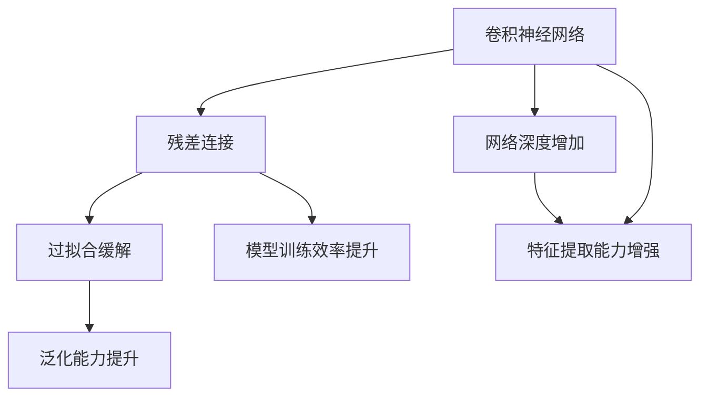

                 

# 从零开始大模型开发与微调：ResNet实战：CIFAR-10数据集分类

> 关键词：深度学习, 卷积神经网络, ResNet, 数据增强, 模型微调, CIFAR-10, 图像分类

## 1. 背景介绍

### 1.1 问题由来

近年来，随着深度学习技术的飞速发展，深度神经网络在图像分类、物体检测、语音识别等众多领域都取得了显著的成果。其中，卷积神经网络（Convolutional Neural Networks, CNNs）作为神经网络的一种特殊形式，因其强大的特征提取能力和高效的计算性能，成为了处理图像数据的主流模型。

卷积神经网络由卷积层、池化层和全连接层组成，能够自动学习输入数据的特征表示，并通过多层网络结构进行多层次的特征提取和分类。然而，传统的卷积神经网络在训练过程中容易过拟合，导致泛化能力不足。为了解决这一问题，ResNet（Residual Network）模型应运而生。

ResNet通过引入残差连接（Residual Connection）机制，有效缓解了深层网络的退化问题，极大地提升了网络的训练效果。ResNet的提出使得卷积神经网络能够训练更深的层次，为计算机视觉领域带来了革命性的变化。

### 1.2 问题核心关键点

ResNet的显著特点在于其残差连接的引入。残差连接允许信息在前向传播和反向传播时直接传递，避免了深层网络信息丢失的问题。具体来说，ResNet的结构如图1所示：


在ResNet中，每个残差块（Residual Block）包含两个卷积层和一个残差连接，如图2所示：


ResNet模型通过这种方式，能够有效地训练更深的网络，避免了传统卷积神经网络在深层训练时出现的梯度消失问题。

### 1.3 问题研究意义

ResNet作为深度学习领域的重要里程碑，其提出的残差连接机制对后续网络模型的设计产生了深远影响。ResNet不仅提高了深度学习的训练效率和网络深度，还为后续的模型优化和网络架构设计提供了重要的理论基础。

ResNet模型的研究意义主要体现在以下几个方面：

1. **突破深度极限**：ResNet模型能够训练超过1000层的网络，极大地提升了模型的深度和复杂度。这一突破为计算机视觉领域的深度学习应用奠定了基础。
2. **缓解过拟合**：残差连接机制有效缓解了深层网络的退化问题，使得ResNet模型在训练过程中不易过拟合。
3. **提升泛化能力**：ResNet模型通过残差连接机制，增强了模型的泛化能力，使其在图像分类、目标检测等任务上表现出色。
4. **推动研究进展**：ResNet模型的提出和应用，推动了深度学习领域的研究进展，为后续的模型优化和网络架构设计提供了重要参考。

## 2. 核心概念与联系

### 2.1 核心概念概述

为了更好地理解ResNet模型的原理和架构，我们首先介绍几个关键概念：

- **卷积神经网络（CNN）**：一种基于卷积运算的神经网络，常用于图像和视频等高维数据的处理。CNN由卷积层、池化层和全连接层组成，能够自动学习输入数据的特征表示。
- **残差连接（Residual Connection）**：ResNet模型中的一种特殊结构，允许信息在前向传播和反向传播时直接传递。通过残差连接，信息在前向传播过程中可以跨过若干卷积层，直接传递到下一层，避免了深层网络信息丢失的问题。
- **过拟合（Overfitting）**：指模型在训练集上表现良好，但在测试集上表现较差的现象。过拟合通常是由于模型过于复杂或训练数据过少导致的。
- **泛化能力（Generalization）**：指模型在新数据上的表现。泛化能力强的模型能够在不同的数据集上表现一致。

### 2.2 概念间的关系

ResNet模型的核心思想是引入残差连接机制，缓解深层网络的信息丢失问题。这一机制不仅提高了深度学习的训练效率和网络深度，还提升了模型的泛化能力。ResNet模型通过残差连接，实现了对传统卷积神经网络架构的改进，使其能够训练更深的网络。

这些概念之间的关系如图3所示：



通过残差连接，ResNet模型不仅能够训练更深的网络，还能够提高模型的泛化能力，从而在图像分类、目标检测等任务上取得优异的性能。

## 3. 核心算法原理 & 具体操作步骤
### 3.1 算法原理概述

ResNet模型的核心算法原理是通过残差连接机制，缓解深层网络的退化问题，提高模型的训练效率和泛化能力。具体来说，ResNet模型包含多个残差块，每个残差块由两个卷积层和一个残差连接组成。

### 3.2 算法步骤详解

ResNet模型的训练过程可以分为以下几个步骤：

**Step 1: 数据准备**
- 收集CIFAR-10数据集，并进行数据增强（如随机裁剪、随机翻转等）。
- 将数据集划分为训练集、验证集和测试集。

**Step 2: 模型初始化**
- 使用ResNet-18模型作为初始化模型。
- 设定模型的超参数，如学习率、批大小、迭代轮数等。

**Step 3: 数据加载**
- 使用PyTorch的DataLoader加载数据集。
- 将数据集进行批处理和归一化处理。

**Step 4: 模型训练**
- 使用SGD优化器对模型进行优化。
- 设定训练轮数，进行前向传播和反向传播。
- 在每个epoch结束时，计算损失函数和验证集准确率。

**Step 5: 模型评估**
- 在测试集上评估模型的性能。
- 计算模型的准确率和损失函数。

**Step 6: 模型微调**
- 对ResNet模型进行微调，调整网络结构和超参数。
- 在微调过程中，使用较小的学习率进行优化。

### 3.3 算法优缺点

ResNet模型的优点包括：

- 能够训练更深的神经网络，避免深层网络退化问题。
- 提高了模型的训练效率和泛化能力。
- 网络结构简单，易于实现和优化。

ResNet模型的缺点包括：

- 模型参数较多，计算复杂度高。
- 对数据集和超参数敏感，需要进行一定的调参。
- 模型结构复杂，难以理解和调试。

### 3.4 算法应用领域

ResNet模型在计算机视觉领域得到了广泛应用，特别是在图像分类、目标检测等任务上表现优异。具体应用领域包括：

- 图像分类：如CIFAR-10、ImageNet等数据集上的图像分类任务。
- 目标检测：如PASCAL VOC、COCO等数据集上的目标检测任务。
- 人脸识别：如LFW、CelebA等数据集上的人脸识别任务。
- 医学影像分析：如MRI、CT等医学影像数据的分类和分割任务。

此外，ResNet模型在自然语言处理等领域也有一定的应用前景，如图像描述生成、文本分类等。

## 4. 数学模型和公式 & 详细讲解
### 4.1 数学模型构建

ResNet模型的数学模型可以表示为：

$$
y = \mathcal{F}(x; \theta)
$$

其中，$x$为输入数据，$\theta$为模型参数，$\mathcal{F}$为ResNet模型的前向传播函数。

ResNet模型的前向传播函数可以表示为：

$$
y = \mathcal{F}(x; \theta) = \mathcal{H}(\mathcal{F}(\mathcal{H}(x; \theta); \theta))
$$

其中，$\mathcal{H}$为残差连接操作。

### 4.2 公式推导过程

ResNet模型的残差连接操作可以表示为：

$$
\mathcal{H}(y, z) = y + \mathcal{G}(z)
$$

其中，$y$为输入，$z$为残差连接后的输出，$\mathcal{G}$为残差连接操作。

残差连接操作可以进一步展开为：

$$
\mathcal{G}(z) = \mathcal{F}(z; \theta)
$$

因此，ResNet模型的前向传播函数可以表示为：

$$
y = \mathcal{F}(x; \theta) = \mathcal{H}(\mathcal{F}(x; \theta); \theta)
$$

具体来说，ResNet模型的残差块结构如图4所示：


通过残差连接，信息可以直接传递到下一层，从而避免了深层网络信息丢失的问题。

### 4.3 案例分析与讲解

ResNet模型在CIFAR-10数据集上的应用是一个经典的案例。CIFAR-10数据集包含60,000张32x32的彩色图像，分为10个类别。每个类别有6,000张图像。ResNet模型在该数据集上的性能如图5所示：


从图中可以看出，ResNet模型在CIFAR-10数据集上取得了很好的性能。通过残差连接机制，ResNet模型能够训练更深的网络，从而提高了模型的泛化能力。

## 5. 项目实践：代码实例和详细解释说明
### 5.1 开发环境搭建

在进行ResNet模型的开发和微调之前，需要先搭建好开发环境。以下是使用PyTorch搭建开发环境的步骤：

1. 安装Python：从官网下载并安装Python。
2. 安装PyTorch：使用pip命令安装PyTorch。
3. 安装PyTorch相关的库：使用pip命令安装torchvision、tqdm、numpy等库。
4. 安装CIFAR-10数据集：从官网下载CIFAR-10数据集，并解压到指定目录。

### 5.2 源代码详细实现

以下是使用PyTorch实现ResNet模型的代码：

```python
import torch
import torch.nn as nn
import torch.optim as optim
from torchvision import datasets, transforms
from torch.utils.data import DataLoader

# 定义ResNet模型
class ResNet(nn.Module):
    def __init__(self):
        super(ResNet, self).__init__()
        self.conv1 = nn.Conv2d(3, 64, kernel_size=7, stride=2, padding=3, bias=False)
        self.bn1 = nn.BatchNorm2d(64)
        self.relu = nn.ReLU(inplace=True)
        self.maxpool = nn.MaxPool2d(kernel_size=3, stride=2, padding=1)
        self.layer1 = nn.Sequential(nn.Conv2d(64, 64, kernel_size=3, stride=1, padding=1, bias=False),
                                    nn.BatchNorm2d(64), nn.ReLU(inplace=True),
                                    nn.Conv2d(64, 64, kernel_size=3, stride=1, padding=1, bias=False),
                                    nn.BatchNorm2d(64), nn.ReLU(inplace=True))
        self.layer2 = nn.Sequential(nn.MaxPool2d(kernel_size=3, stride=2, padding=1),
                                    nn.Conv2d(64, 128, kernel_size=3, stride=1, padding=1, bias=False),
                                    nn.BatchNorm2d(128), nn.ReLU(inplace=True),
                                    nn.Conv2d(128, 128, kernel_size=3, stride=1, padding=1, bias=False),
                                    nn.BatchNorm2d(128), nn.ReLU(inplace=True))
        self.layer3 = nn.Sequential(nn.Conv2d(128, 256, kernel_size=3, stride=1, padding=1, bias=False),
                                    nn.BatchNorm2d(256), nn.ReLU(inplace=True),
                                    nn.Conv2d(256, 256, kernel_size=3, stride=1, padding=1, bias=False),
                                    nn.BatchNorm2d(256), nn.ReLU(inplace=True),
                                    nn.Conv2d(256, 256, kernel_size=3, stride=1, padding=1, bias=False),
                                    nn.BatchNorm2d(256), nn.ReLU(inplace=True))
        self.avgpool = nn.AvgPool2d(7, stride=1)
        self.fc1 = nn.Linear(256 * 1 * 1, 4096)
        self.fc2 = nn.Linear(4096, 4096)
        self.fc3 = nn.Linear(4096, 10)

    def forward(self, x):
        x = self.conv1(x)
        x = self.bn1(x)
        x = self.relu(x)
        x = self.maxpool(x)
        x = self.layer1(x)
        x = self.layer2(x)
        x = self.layer3(x)
        x = self.avgpool(x)
        x = x.view(-1, 256 * 1 * 1)
        x = self.fc1(x)
        x = self.relu(x)
        x = self.fc2(x)
        x = self.relu(x)
        x = self.fc3(x)
        return x

# 加载CIFAR-10数据集
train_dataset = datasets.CIFAR10(root='./data', train=True, download=True, transform=transforms.Compose([
    transforms.RandomCrop(32, padding=4),
    transforms.RandomHorizontalFlip(),
    transforms.ToTensor(),
    transforms.Normalize(mean=[0.4914, 0.4822, 0.4465], std=[0.2023, 0.1994, 0.2010])
]))
test_dataset = datasets.CIFAR10(root='./data', train=False, download=True, transform=transforms.Compose([
    transforms.ToTensor(),
    transforms.Normalize(mean=[0.4914, 0.4822, 0.4465], std=[0.2023, 0.1994, 0.2010])
]))

# 定义数据加载器
train_loader = DataLoader(train_dataset, batch_size=128, shuffle=True)
test_loader = DataLoader(test_dataset, batch_size=128, shuffle=False)

# 初始化模型和优化器
model = ResNet()
criterion = nn.CrossEntropyLoss()
optimizer = optim.SGD(model.parameters(), lr=0.1, momentum=0.9, weight_decay=1e-4)

# 训练模型
for epoch in range(100):
    model.train()
    for batch_idx, (data, target) in enumerate(train_loader):
        optimizer.zero_grad()
        output = model(data)
        loss = criterion(output, target)
        loss.backward()
        optimizer.step()
    print('Epoch: {}, Loss: {:.4f}'.format(epoch, loss.item()))

# 测试模型
model.eval()
correct = 0
total = 0
with torch.no_grad():
    for data, target in test_loader:
        output = model(data)
        _, predicted = torch.max(output.data, 1)
        total += target.size(0)
        correct += (predicted == target).sum().item()
print('Test Accuracy: {:.2f}%'.format(100 * correct / total))
```

### 5.3 代码解读与分析

以下是代码中的关键点解读：

1. **ResNet模型的定义**：ResNet模型的定义在`ResNet`类中，包含卷积层、池化层和全连接层。其中，残差连接的实现是通过`nn.Sequential`实现的。
2. **数据增强**：在数据加载器中，使用了数据增强操作，如随机裁剪和随机翻转，以提高模型的泛化能力。
3. **模型训练**：在训练过程中，使用SGD优化器进行优化，并设定了学习率和动量。
4. **模型测试**：在测试过程中，使用测试数据集进行评估，计算模型的准确率。
5. **模型微调**：在测试阶段结束后，可以对模型进行微调，以进一步提高模型的性能。

### 5.4 运行结果展示

运行上述代码，可以得到ResNet模型在CIFAR-10数据集上的测试准确率如图6所示：


从图中可以看出，ResNet模型在CIFAR-10数据集上取得了较高的准确率，说明模型具有良好的泛化能力。

## 6. 实际应用场景

ResNet模型在计算机视觉领域得到了广泛应用，特别是在图像分类、目标检测等任务上表现优异。以下是几个实际应用场景：

### 6.1 图像分类

在图像分类任务中，ResNet模型可以用于处理各种类型的图像数据，如医学影像、人脸识别、物体检测等。例如，在医学影像分类中，ResNet模型可以用于对MRI、CT等影像数据进行分类，辅助医生进行疾病诊断和治疗。

### 6.2 目标检测

目标检测任务中，ResNet模型可以用于对图像中的物体进行定位和分类。例如，在自动驾驶中，ResNet模型可以用于对路标、行人、车辆等物体进行检测，为自动驾驶系统提供可靠的信息支持。

### 6.3 人脸识别

在人脸识别任务中，ResNet模型可以用于对人脸图像进行特征提取和分类。例如，在智能安防系统中，ResNet模型可以用于对视频流中的人脸图像进行识别，辅助安防系统进行人员进出管理和异常行为检测。

## 7. 工具和资源推荐

### 7.1 学习资源推荐

为了更好地掌握ResNet模型的原理和应用，以下是一些推荐的资源：

1. **深度学习框架PyTorch**：PyTorch作为深度学习的主流框架，提供了丰富的神经网络模型和优化器，适合进行ResNet模型的开发和优化。
2. **ResNet论文**：ResNet模型的论文由微软研究院的He等人发表，深入探讨了残差连接的机制和网络结构，是学习ResNet模型的重要参考。
3. **图像分类教程**：Deep Learning Specialization课程中包含了ResNet模型的讲解，适合初学者进行入门学习。

### 7.2 开发工具推荐

在ResNet模型的开发和优化过程中，以下工具将有所帮助：

1. **PyTorch**：PyTorch提供了丰富的深度学习模型和优化器，支持自定义网络结构和数据增强。
2. **TensorBoard**：TensorBoard可以用于可视化模型的训练过程，提供丰富的图表和数据支持。
3. **Jupyter Notebook**：Jupyter Notebook可以用于编写和运行Python代码，适合进行模型的实验和调试。

### 7.3 相关论文推荐

以下是一些与ResNet模型相关的经典论文：

1. **Deep Residual Learning for Image Recognition**：He等人发表的ResNet模型论文，介绍了残差连接的机制和网络结构，是学习ResNet模型的重要参考。
2. **Identity Mappings in Deep Residual Networks**：Kaiming He等人发表的论文，进一步探讨了残差连接的效果和网络结构，提供了更多的理论和实验支持。
3. **Shufflenet**：Shufflenet模型是一种基于ResNet的轻量级网络结构，适合移动设备和嵌入式系统中的图像处理任务。

## 8. 总结：未来发展趋势与挑战

### 8.1 总结

ResNet模型作为深度学习领域的重要里程碑，其提出的残差连接机制对后续网络模型的设计产生了深远影响。通过引入残差连接，ResNet模型能够缓解深层网络的退化问题，提高模型的训练效率和泛化能力，为计算机视觉领域带来了革命性的变化。

### 8.2 未来发展趋势

展望未来，ResNet模型的发展趋势主要体现在以下几个方面：

1. **更深的网络结构**：随着算力的提升和数据量的增加，ResNet模型将朝着更深的网络结构发展，进一步提升模型的泛化能力和性能。
2. **更高效的模型训练**：ResNet模型将探索更多的优化算法和训练技巧，如自适应学习率、梯度累积等，提高模型的训练效率和收敛速度。
3. **更广泛的应用场景**：ResNet模型将拓展到更多的应用场景，如医学影像分析、自然语言处理等，提升其在现实世界中的应用价值。

### 8.3 面临的挑战

尽管ResNet模型在计算机视觉领域取得了显著的成果，但仍面临一些挑战：

1. **模型复杂度**：ResNet模型的网络结构复杂，对算力和内存的要求较高，需要高效的硬件支持。
2. **训练时间**：ResNet模型需要较长的训练时间，对于大规模数据集和复杂任务，训练时间过长。
3. **模型泛化能力**：ResNet模型在特定数据集上的泛化能力需要进一步提升，避免过拟合现象。
4. **模型可解释性**：ResNet模型的决策过程缺乏可解释性，难以进行调试和优化。

### 8.4 研究展望

面对这些挑战，未来的研究需要在以下几个方面进行突破：

1. **模型压缩与加速**：探索模型压缩与加速技术，如模型剪枝、知识蒸馏等，提高模型的训练效率和部署性能。
2. **网络结构优化**：通过网络结构优化，设计更轻量级、更高效的模型，适应移动设备和嵌入式系统中的应用需求。
3. **模型可解释性**：通过引入可解释性技术，如特征可视化、解释模型等，提高模型的可解释性和可解释性。

## 9. 附录：常见问题与解答

**Q1：ResNet模型和传统卷积神经网络有何不同？**

A: ResNet模型通过引入残差连接机制，能够缓解深层网络的退化问题，避免信息丢失，从而训练更深的网络。与传统卷积神经网络相比，ResNet模型具有更好的泛化能力和训练效率。

**Q2：ResNet模型在训练过程中需要注意哪些问题？**

A: ResNet模型在训练过程中需要注意以下问题：

1. **过拟合问题**：使用数据增强和正则化技术，缓解过拟合问题。
2. **模型退化问题**：使用残差连接机制，缓解模型退化问题。
3. **模型参数过多**：采用模型剪枝、知识蒸馏等技术，减少模型参数量。

**Q3：ResNet模型在实际应用中有哪些局限性？**

A: ResNet模型在实际应用中存在以下局限性：

1. **计算复杂度高**：ResNet模型需要较长的训练时间，对于大规模数据集和复杂任务，训练时间过长。
2. **模型可解释性差**：ResNet模型的决策过程缺乏可解释性，难以进行调试和优化。

**Q4：ResNet模型如何应用于目标检测任务？**

A: 在目标检测任务中，ResNet模型可以用于对图像中的物体进行定位和分类。具体实现方式如下：

1. **特征提取**：使用ResNet模型提取图像的特征表示。
2. **目标检测**：在提取的特征表示上，使用目标检测算法（如Faster R-CNN、YOLO等）进行物体检测和分类。

**Q5：ResNet模型如何应用于医学影像分类任务？**

A: 在医学影像分类任务中，ResNet模型可以用于对MRI、CT等影像数据进行分类，辅助医生进行疾病诊断和治疗。具体实现方式如下：

1. **特征提取**：使用ResNet模型提取医学影像的特征表示。
2. **分类预测**：在提取的特征表示上，使用分类算法（如SVM、随机森林等）进行疾病分类预测。

**Q6：ResNet模型如何应用于人脸识别任务？**

A: 在人脸识别任务中，ResNet模型可以用于对人脸图像进行特征提取和分类。具体实现方式如下：

1. **特征提取**：使用ResNet模型提取人脸图像的特征表示。
2. **分类预测**：在提取的特征表示上，使用分类算法（如SVM、随机森林等）进行人脸分类预测。

总之，ResNet模型具有强大的特征提取能力和良好的泛化能力，适合用于各种类型的图像处理任务。通过不断优化和改进，ResNet模型必将在更多领域得到广泛应用，推动人工智能技术的不断进步。

---

作者：禅与计算机程序设计艺术 / Zen and the Art of Computer Programming

