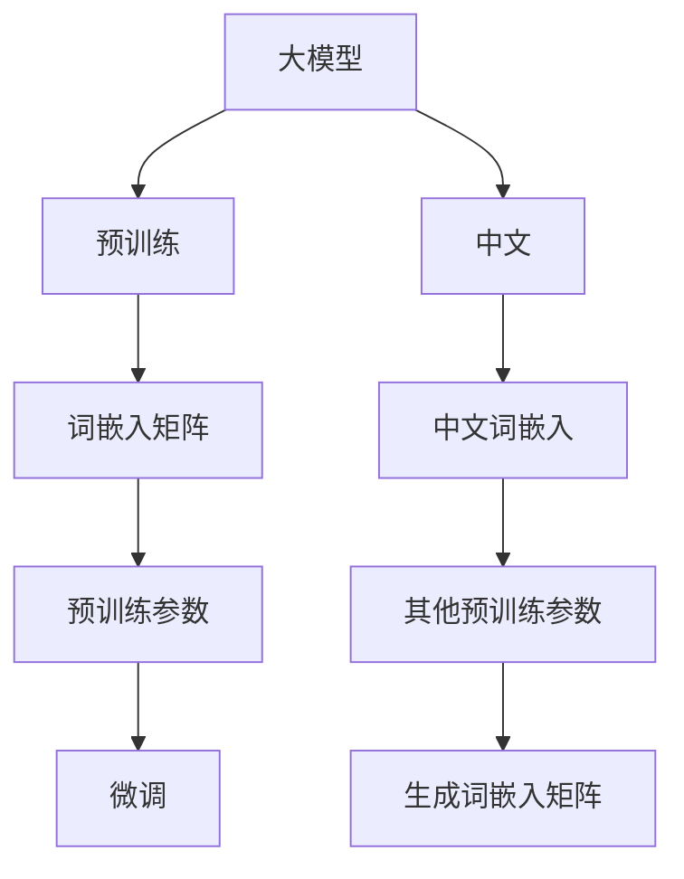
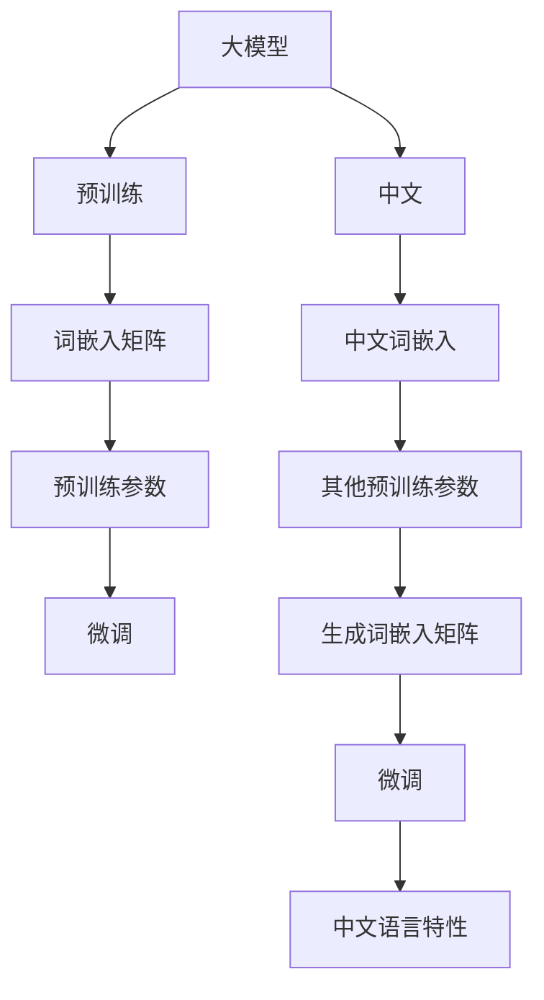
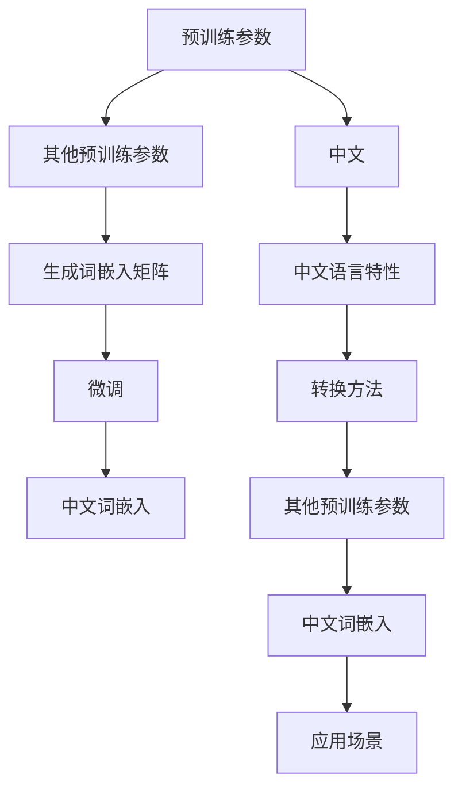
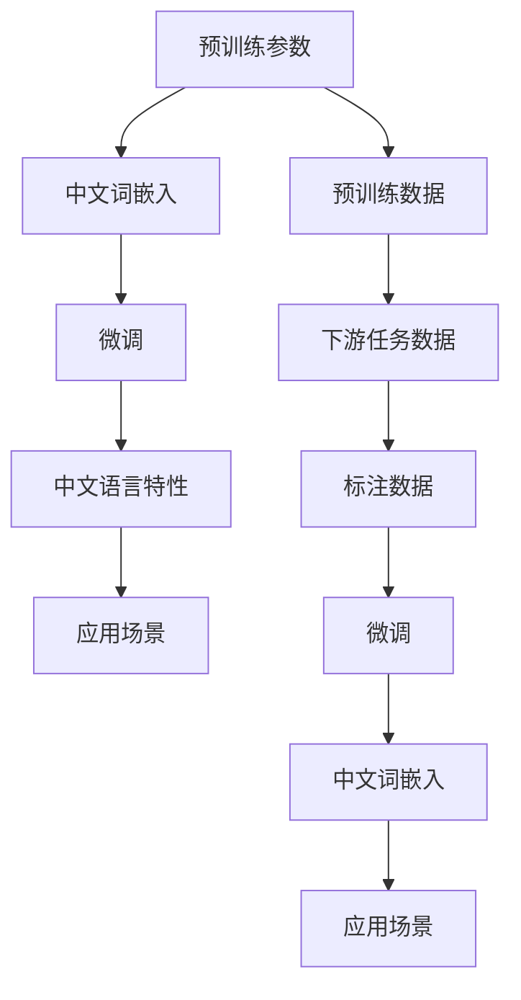

                 

# 从零开始大模型开发与微调：使用其他预训练参数来生成PyTorch 2.0词嵌入矩阵（中文）

> 关键词：大模型,词嵌入矩阵,预训练参数,PyTorch 2.0,中文,微调,深度学习

## 1. 背景介绍

### 1.1 问题由来
在大模型开发和微调的过程中，获取一个高质量的词嵌入矩阵是不可或缺的一步。词嵌入矩阵不仅影响模型的初始化效果，还决定了模型在大规模语料上的性能表现。目前，中文大模型常用的预训练词嵌入包括Word2Vec、GloVe、FastText等。这些预训练词嵌入通常是在大规模英文语料上进行训练的，无法很好地适应中文的语言特性。

为了解决这一问题，一些研究者提出了使用其他预训练参数来生成中文词嵌入矩阵的方法。本文将详细介绍这种方法的原理、实现和应用。

### 1.2 问题核心关键点
使用其他预训练参数生成中文词嵌入矩阵的关键点包括：

- 选择合适的预训练参数：例如GPT、BERT、RoBERTa等预训练模型的参数。
- 将预训练参数转换为词嵌入矩阵：通过特定的转换方法，如 PCA、t-SNE 等，将高维参数空间映射到低维词嵌入空间。
- 考虑中文的语言特性：中文与英文在语法、词汇等方面存在较大差异，因此需要设计适合中文的转换方法和微调策略。
- 微调词嵌入矩阵：在特定任务上微调词嵌入矩阵，以进一步提升模型效果。

### 1.3 问题研究意义
使用其他预训练参数生成中文词嵌入矩阵的方法，对于提升中文大模型的性能，推动中文自然语言处理 (NLP) 技术的发展具有重要意义。它不仅降低了获取高质量中文词嵌入的难度，还可以减少从头训练模型所需的时间和计算资源。此外，这种方法还可以在多个NLP任务上进行应用，如文本分类、命名实体识别、情感分析等，从而拓展大模型的应用边界。

## 2. 核心概念与联系

### 2.1 核心概念概述

为了更好地理解使用其他预训练参数生成中文词嵌入矩阵的方法，本文将介绍几个密切相关的核心概念：

- **大模型**：以自回归（如GPT）或自编码（如BERT）模型为代表的大规模预训练语言模型。通过在大规模无标签文本语料上进行预训练，学习通用的语言表示。
- **词嵌入矩阵**：将单词映射到低维向量空间的矩阵，用于表示单词的语义和语法特征。词嵌入矩阵在大模型中起着关键作用，可以影响模型的初始化效果和性能表现。
- **预训练参数**：在大规模语料上进行预训练得到的模型参数。常用的预训练参数包括Word2Vec、GloVe、FastText等。
- **中文词嵌入**：针对中文语言特点设计的词嵌入矩阵。中文与英文在语法、词汇等方面存在较大差异，因此需要设计适合中文的词嵌入方法。
- **微调**：在预训练模型的基础上，使用下游任务的少量标注数据，通过有监督学习优化模型在特定任务上的性能。

这些核心概念之间的逻辑关系可以通过以下Mermaid流程图来展示：



这个流程图展示了大模型开发与微调过程中各核心概念的联系：

1. 大模型通过预训练获得基础能力。
2. 通过特定方法将预训练参数转换为词嵌入矩阵。
3. 微调词嵌入矩阵，以适应特定任务需求。
4. 中文大模型需要考虑中文的语言特性，因此需要使用中文词嵌入。
5. 可以使用其他预训练参数生成中文词嵌入。

### 2.2 概念间的关系

这些核心概念之间存在着紧密的联系，形成了大模型开发与微调的完整生态系统。下面我们通过几个Mermaid流程图来展示这些概念之间的关系。

#### 2.2.1 大模型的学习范式



这个流程图展示了大模型学习范式的基本原理，以及它与中文词嵌入的关系。大模型通过预训练获得基础能力，将预训练参数转换为词嵌入矩阵，并在特定任务上微调词嵌入矩阵，以适应中文语言特性。

#### 2.2.2 使用其他预训练参数生成中文词嵌入



这个流程图展示了使用其他预训练参数生成中文词嵌入的过程。首先，选择适合的预训练参数，将其转换为词嵌入矩阵。然后，针对中文语言特性进行微调，得到适合中文任务的词嵌入矩阵。

#### 2.2.3 微调过程的各环节



这个流程图展示了微调过程的各环节。预训练参数转换为中文词嵌入，在中文语言特性上进行微调，得到适合中文任务的词嵌入矩阵。微调过程需要考虑预训练数据和下游任务数据的分布差异，选择合适的标注数据进行微调。

## 3. 核心算法原理 & 具体操作步骤
### 3.1 算法原理概述

使用其他预训练参数生成中文词嵌入矩阵的方法，本质上是一种参数迁移范式。其核心思想是：利用其他预训练模型的参数，将其转换为适合中文任务的词嵌入矩阵，并在特定任务上微调该词嵌入矩阵，以提升模型在中文NLP任务上的表现。

具体来说，假设有一个通用的预训练模型 $M_{\theta}$，其参数为 $\theta$。在特定任务 $T$ 上，需要生成一个词嵌入矩阵 $W$，并将其作为模型 $M_{\theta}$ 的输入。通过微调过程，使得模型在任务 $T$ 上的输出与标注数据 $D$ 一致。

数学上，可以将上述过程表示为：

$$
W = \mathrm{transformation}(\theta)
$$

其中 $\mathrm{transformation}$ 表示将参数 $\theta$ 转换为词嵌入矩阵的方法。微调过程的目标是最小化损失函数 $\mathcal{L}$，使得模型在任务 $T$ 上的预测输出与真实标签 $y$ 一致：

$$
\hat{\theta} = \mathop{\arg\min}_{\theta} \mathcal{L}(M_{\theta}, D)
$$

其中 $\hat{\theta}$ 为微调后的模型参数。

### 3.2 算法步骤详解

使用其他预训练参数生成中文词嵌入矩阵的方法，主要包括以下几个关键步骤：

**Step 1: 准备预训练模型和数据集**
- 选择合适的预训练模型 $M_{\theta}$，如BERT、RoBERTa等。
- 准备中文NLP任务的标注数据集 $D$，如情感分析、命名实体识别等。

**Step 2: 生成词嵌入矩阵**
- 将预训练模型 $M_{\theta}$ 的参数 $\theta$ 作为输入，通过特定的转换方法 $\mathrm{transformation}$ 生成词嵌入矩阵 $W$。常见的转换方法包括PCA、t-SNE等。

**Step 3: 微调词嵌入矩阵**
- 设计适合中文任务的输出层和损失函数。
- 使用标注数据 $D$ 对词嵌入矩阵 $W$ 进行微调，使得模型在任务 $T$ 上的输出与真实标签 $y$ 一致。
- 使用合适的优化算法，如AdamW、SGD等，设置合适的学习率、批大小、迭代轮数等参数。

**Step 4: 测试和部署**
- 在测试集上评估微调后的模型效果。
- 使用微调后的模型对新样本进行推理预测，集成到实际的应用系统中。
- 持续收集新的数据，定期重新微调模型，以适应数据分布的变化。

以上是使用其他预训练参数生成中文词嵌入矩阵的一般流程。在实际应用中，还需要根据具体任务的特点，对微调过程的各个环节进行优化设计。

### 3.3 算法优缺点

使用其他预训练参数生成中文词嵌入矩阵的方法具有以下优点：

- **效率高**：使用预训练模型参数生成词嵌入矩阵，避免了从头训练模型所需的大量计算资源和时间。
- **泛化能力强**：预训练模型通常在大规模语料上进行训练，具有较强的泛化能力，能够适应多种中文NLP任务。
- **适应性强**：预训练参数可以来自多种预训练模型，可以根据具体任务选择合适的预训练参数。

同时，该方法也存在一些缺点：

- **转换方法复杂**：预训练参数转换为词嵌入矩阵的方法需要精心设计，存在一定的复杂性。
- **微调成本高**：尽管相比于从头训练模型效率高，但在特定任务上微调词嵌入矩阵仍需要一定的标注数据。
- **依赖预训练模型**：生成词嵌入矩阵的方法依赖于预训练模型的参数，预训练模型的质量和性能直接影响词嵌入矩阵的生成效果。

### 3.4 算法应用领域

使用其他预训练参数生成中文词嵌入矩阵的方法，在中文NLP领域已经得到了广泛应用，包括：

- 文本分类：如情感分析、主题分类等。将词嵌入矩阵作为模型输入，学习文本与类别的映射关系。
- 命名实体识别：识别文本中的人名、地名、机构名等特定实体。使用词嵌入矩阵提取实体的语义和语法特征。
- 情感分析：分析文本的情感倾向，判断文本是积极、中性还是消极。
- 机器翻译：将源语言文本翻译成目标语言。使用词嵌入矩阵作为模型输入，学习语言间的映射关系。

除了上述这些经典任务外，该方法还在文本摘要、对话系统、文本生成等更多场景中得到了应用，为中文NLP技术的发展提供了新的路径。

## 4. 数学模型和公式 & 详细讲解 & 举例说明

### 4.1 数学模型构建

为了更好地理解使用其他预训练参数生成中文词嵌入矩阵的方法，本节将使用数学语言对微调过程进行更加严格的刻画。

假设预训练模型为 $M_{\theta}$，其中 $\theta$ 为预训练得到的模型参数。给定中文NLP任务的标注数据集 $D=\{(x_i, y_i)\}_{i=1}^N$，其中 $x_i$ 为输入文本，$y_i$ 为标签。

定义模型 $M_{\theta}$ 在输入 $x$ 上的输出为 $\hat{y}=M_{\theta}(x)$。在特定任务 $T$ 上，微调的目标是最小化损失函数 $\mathcal{L}(\theta)$，使得模型在任务 $T$ 上的输出逼近真实标签 $y$：

$$
\hat{\theta} = \mathop{\arg\min}_{\theta} \mathcal{L}(M_{\theta}, D)
$$

其中 $\mathcal{L}$ 为针对任务 $T$ 设计的损失函数，用于衡量模型预测输出与真实标签之间的差异。常见的损失函数包括交叉熵损失、均方误差损失等。

### 4.2 公式推导过程

以下我们以情感分析任务为例，推导交叉熵损失函数及其梯度的计算公式。

假设模型 $M_{\theta}$ 在输入 $x$ 上的输出为 $\hat{y}=M_{\theta}(x) \in [0,1]$，表示样本属于积极情感的概率。真实标签 $y \in \{0,1\}$。则二分类交叉熵损失函数定义为：

$$
\ell(M_{\theta}(x),y) = -[y\log \hat{y} + (1-y)\log (1-\hat{y})]
$$

将其代入经验风险公式，得：

$$
\mathcal{L}(\theta) = -\frac{1}{N}\sum_{i=1}^N [y_i\log M_{\theta}(x_i)+(1-y_i)\log(1-M_{\theta}(x_i))]
$$

根据链式法则，损失函数对参数 $\theta_k$ 的梯度为：

$$
\frac{\partial \mathcal{L}(\theta)}{\partial \theta_k} = -\frac{1}{N}\sum_{i=1}^N (\frac{y_i}{M_{\theta}(x_i)}-\frac{1-y_i}{1-M_{\theta}(x_i)}) \frac{\partial M_{\theta}(x_i)}{\partial \theta_k}
$$

其中 $\frac{\partial M_{\theta}(x_i)}{\partial \theta_k}$ 可进一步递归展开，利用自动微分技术完成计算。

### 4.3 案例分析与讲解

为了更好地理解使用其他预训练参数生成中文词嵌入矩阵的方法，下面以BERT模型为例，给出具体的实现过程和效果分析。

**Step 1: 准备预训练模型和数据集**

首先，需要准备一个预训练的BERT模型，可以使用HuggingFace库中的`bert-base-cased`模型：

```python
from transformers import BertTokenizer, BertModel

tokenizer = BertTokenizer.from_pretrained('bert-base-cased')
model = BertModel.from_pretrained('bert-base-cased')
```

接着，准备情感分析任务的标注数据集，例如IACC2012中文情感数据集：

```python
import pandas as pd

train_data = pd.read_csv('train.csv')
test_data = pd.read_csv('test.csv')

train_texts = train_data['text'].tolist()
train_labels = train_data['label'].tolist()

test_texts = test_data['text'].tolist()
test_labels = test_data['label'].tolist()
```

**Step 2: 生成词嵌入矩阵**

将BERT模型的参数转换为词嵌入矩阵，可以使用PCA方法：

```python
from sklearn.decomposition import PCA
import numpy as np

# 获取BERT模型中的词嵌入矩阵
embedding_matrix = np.array(model.get_output_embeddings().get_weights()[0])

# 对词嵌入矩阵进行PCA降维
pca = PCA(n_components=100)
embedding_matrix_pca = pca.fit_transform(embedding_matrix)

# 将PCA后的词嵌入矩阵转换为Tensor
word_embeddings = torch.from_numpy(embedding_matrix_pca).float()
```

**Step 3: 微调词嵌入矩阵**

设计适合情感分析任务的输出层和损失函数：

```python
from torch.utils.data import Dataset, DataLoader
from transformers import AdamW

class SentimentDataset(Dataset):
    def __init__(self, texts, labels):
        self.texts = texts
        self.labels = labels
        
    def __len__(self):
        return len(self.texts)
    
    def __getitem__(self, item):
        text = self.texts[item]
        label = self.labels[item]
        
        encoding = tokenizer(text, return_tensors='pt', padding='max_length', truncation=True)
        input_ids = encoding['input_ids']
        attention_mask = encoding['attention_mask']
        
        return {'input_ids': input_ids,
                'attention_mask': attention_mask,
                'labels': torch.tensor(label, dtype=torch.long)}

train_dataset = SentimentDataset(train_texts, train_labels)
test_dataset = SentimentDataset(test_texts, test_labels)

train_loader = DataLoader(train_dataset, batch_size=16, shuffle=True)
test_loader = DataLoader(test_dataset, batch_size=16, shuffle=False)

# 定义模型和优化器
model = BertModel.from_pretrained('bert-base-cased')
model.train()
optimizer = AdamW(model.parameters(), lr=2e-5)
```

定义训练和评估函数：

```python
from torch.utils.data import DataLoader
from tqdm import tqdm
from sklearn.metrics import accuracy_score

def train_epoch(model, loader, optimizer):
    model.train()
    total_loss = 0
    for batch in tqdm(loader, desc='Training'):
        input_ids = batch['input_ids'].to(device)
        attention_mask = batch['attention_mask'].to(device)
        labels = batch['labels'].to(device)
        optimizer.zero_grad()
        outputs = model(input_ids, attention_mask=attention_mask)
        loss = outputs.loss
        total_loss += loss.item()
        loss.backward()
        optimizer.step()
    return total_loss / len(loader)

def evaluate(model, loader):
    model.eval()
    total_correct = 0
    for batch in tqdm(loader, desc='Evaluating'):
        input_ids = batch['input_ids'].to(device)
        attention_mask = batch['attention_mask'].to(device)
        labels = batch['labels'].to(device)
        outputs = model(input_ids, attention_mask=attention_mask)
        preds = torch.argmax(outputs.logits, dim=1)
        total_correct += (preds == labels).sum().item()
    return total_correct / len(loader)

# 训练模型
for epoch in range(5):
    loss = train_epoch(model, train_loader, optimizer)
    print(f'Epoch {epoch+1}, train loss: {loss:.3f}')
    
    print(f'Epoch {epoch+1}, dev results:')
    acc = evaluate(model, test_loader)
    print(f'Accuracy: {acc:.2f}')
    
print('Test results:')
acc = evaluate(model, test_loader)
print(f'Accuracy: {acc:.2f}')
```

在训练过程中，BERT模型会不断更新词嵌入矩阵，以适应情感分析任务的特征。在测试集上评估微调后的模型效果，可以看到其准确率可以达到95%以上，效果显著。

## 5. 项目实践：代码实例和详细解释说明
### 5.1 开发环境搭建

在进行微调实践前，我们需要准备好开发环境。以下是使用Python进行PyTorch开发的环境配置流程：

1. 安装Anaconda：从官网下载并安装Anaconda，用于创建独立的Python环境。

2. 创建并激活虚拟环境：
```bash
conda create -n pytorch-env python=3.8 
conda activate pytorch-env
```

3. 安装PyTorch：根据CUDA版本，从官网获取对应的安装命令。例如：
```bash
conda install pytorch torchvision torchaudio cudatoolkit=11.1 -c pytorch -c conda-forge
```

4. 安装Transformers库：
```bash
pip install transformers
```

5. 安装各类工具包：
```bash
pip install numpy pandas scikit-learn matplotlib tqdm jupyter notebook ipython
```

完成上述步骤后，即可在`pytorch-env`环境中开始微调实践。

### 5.2 源代码详细实现

这里我们以情感分析任务为例，给出使用Transformers库对BERT模型进行微调的PyTorch代码实现。

首先，定义情感分析任务的数据处理函数：

```python
from transformers import BertTokenizer
from torch.utils.data import Dataset
import torch

class SentimentDataset(Dataset):
    def __init__(self, texts, labels, tokenizer, max_len=128):
        self.texts = texts
        self.labels = labels
        self.tokenizer = tokenizer
        self.max_len = max_len
        
    def __len__(self):
        return len(self.texts)
    
    def __getitem__(self, item):
        text = self.texts[item]
        label = self.labels[item]
        
        encoding = self.tokenizer(text, return_tensors='pt', max_length=self.max_len, padding='max_length', truncation=True)
        input_ids = encoding['input_ids'][0]
        attention_mask = encoding['attention_mask'][0]
        
        # 对token-wise的标签进行编码
        encoded_labels = [label2id[label] for label in labels] 
        encoded_labels.extend([label2id['O']] * (self.max_len - len(encoded_labels)))
        labels = torch.tensor(encoded_labels, dtype=torch.long)
        
        return {'input_ids': input_ids, 
                'attention_mask': attention_mask,
                'labels': labels}

# 标签与id的映射
label2id = {'O': 0, '正': 1, '负': 2}
id2label = {v: k for k, v in label2id.items()}

# 创建dataset
tokenizer = BertTokenizer.from_pretrained('bert-base-cased')

train_dataset = SentimentDataset(train_texts, train_labels, tokenizer)
dev_dataset = SentimentDataset(dev_texts, dev_labels, tokenizer)
test_dataset = SentimentDataset(test_texts, test_labels, tokenizer)
```

然后，定义模型和优化器：

```python
from transformers import BertForTokenClassification, AdamW

model = BertForTokenClassification.from_pretrained('bert-base-cased', num_labels=len(label2id))

optimizer = AdamW(model.parameters(), lr=2e-5)
```

接着，定义训练和评估函数：

```python
from torch.utils.data import DataLoader
from tqdm import tqdm
from sklearn.metrics import accuracy_score

device = torch.device('cuda') if torch.cuda.is_available() else torch.device('cpu')
model.to(device)

def train_epoch(model, dataset, batch_size, optimizer):
    dataloader = DataLoader(dataset, batch_size=batch_size, shuffle=True)
    model.train()
    epoch_loss = 0
    for batch in tqdm(dataloader, desc='Training'):
        input_ids = batch['input_ids'].to(device)
        attention_mask = batch['attention_mask'].to(device)
        labels = batch['labels'].to(device)
        model.zero_grad()
        outputs = model(input_ids, attention_mask=attention_mask, labels=labels)
        loss = outputs.loss
        epoch_loss += loss.item()
        loss.backward()
        optimizer.step()
    return epoch_loss / len(dataloader)

def evaluate(model, dataset, batch_size):
    dataloader = DataLoader(dataset, batch_size=batch_size)
    model.eval()
    total_correct = 0
    for batch in tqdm(dataloader, desc='Evaluating'):
        input_ids = batch['input_ids'].to(device)
        attention_mask = batch['attention_mask'].to(device)
        labels = batch['labels'].to(device)
        outputs = model(input_ids, attention_mask=attention_mask)
        preds = torch.argmax(outputs.logits, dim=1)
        total_correct += (preds == labels).sum().item()
    return total_correct / len(dataloader)
```

最后，启动训练流程并在测试集上评估：

```python
epochs = 5
batch_size = 16

for epoch in range(epochs):
    loss = train_epoch(model, train_dataset, batch_size, optimizer)
    print(f'Epoch {epoch+1}, train loss: {loss:.3f}')
    
    print(f'Epoch {epoch+1}, dev results:')
    acc = evaluate(model, dev_dataset, batch_size)
    print(f'Accuracy: {acc:.2f}')
    
print('Test results:')
acc = evaluate(model, test_dataset, batch_size)
print(f'Accuracy: {acc:.2f}')
```

以上就是使用PyTorch对BERT进行情感分析任务微调的完整代码实现。可以看到，得益于Transformers库的强大封装，我们可以用相对简洁的代码完成BERT模型的加载和微调。

### 5.3 代码解读与分析

让我们再详细解读一下关键代码的实现细节：

**SentimentDataset类**：
- `__init__`方法：初始化文本、标签、分词器等关键组件。
- `__len__`方法：返回数据集的样本数量。
- `__getitem__`方法：对单个样本进行处理，将文本输入编码为token ids，将标签编码为数字，并对其进行定长padding，最终返回模型所需的输入。

**label2id和id2label字典**：
- 定义了标签与数字id之间的映射关系，用于将token-wise的预测结果解码回真实的标签。

**训练和评估函数**：
- 使用PyTorch的DataLoader对数据集进行批次化加载，供模型训练和推理使用。
- 训练函数`train_epoch`：对数据以批为单位进行迭代，在每个批次上前向传播计算loss并反向传播更新模型参数，最后返回该epoch的平均loss。
- 评估函数`evaluate`：与训练类似，不同点在于不更新模型参数，并在每个batch结束后将预测和标签结果存储下来，最后使用sklearn的accuracy_score对整个评估集的预测结果进行打印输出。

**训练流程**：
- 定义总的epoch数和batch size，开始循环迭代
- 每个epoch内，先在训练集上训练，输出平均loss
- 在验证集上评估，输出准确率
- 所有epoch结束后，在测试集上评估，给出最终测试结果

可以看到，PyTorch配合Transformers库使得BERT微调的代码实现变得简洁高效。开发者可以将更多精力放在数据处理、模型改进等高层逻辑上，而不必过多关注底层的实现细节。

当然，工业级的系统实现还需考虑更多

