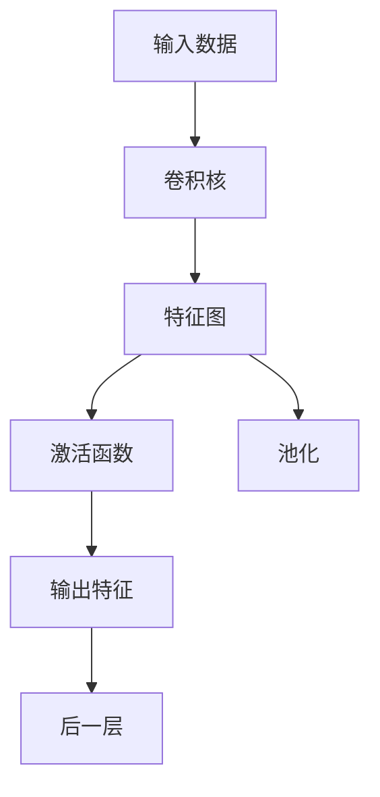
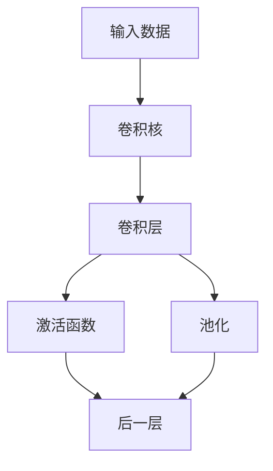
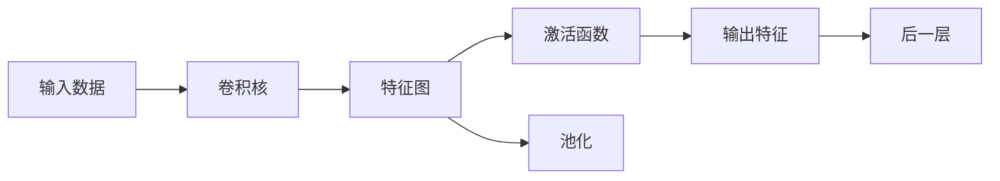

                 

# 从零开始大模型开发与微调：卷积运算的基本概念

## 1. 背景介绍

卷积运算(CConvolutional Operations)是深度学习中最为基础和重要的算子之一，广泛应用于图像识别、语音识别、自然语言处理等诸多领域。特别是近年来，随着深度学习框架如TensorFlow、PyTorch的普及，卷积运算已成为了许多深度学习模型的标配。本文章将系统介绍卷积运算的基本概念和原理，同时结合代码实例，深入讲解卷积运算的实现细节和应用场景。

## 2. 核心概念与联系

### 2.1 核心概念概述

为了更好地理解卷积运算，我们首先需要了解以下几个核心概念：

- **卷积核(Filter/Kernel)**：卷积运算的核心组件，是一个小型的权重矩阵，用于在输入数据上滑动，提取特定的特征。
- **卷积层(Convolutional Layer)**：将卷积核应用于输入数据，生成新的特征图的层。通常一个卷积层包含多个卷积核，每个卷积核提取一种特定特征。
- **步幅(Stride)**：卷积核在输入数据上移动的步长，决定了特征图的尺寸。
- **填充(Padding)**：为了避免特征尺寸的缩小，通常需要在输入数据的边界添加额外的零值，这就是填充。
- **激活函数(Activation Function)**：将卷积层的输出进行非线性变换，使其具备更强的表达能力。
- **池化(Pooling)**：用于降低特征图尺寸，提高计算效率，同时保留主要特征。

### 2.2 核心概念之间的联系

卷积运算的各个概念之间存在紧密的联系，如下图所示：



通过卷积核在输入数据上滑动，卷积层能够提取特定特征。激活函数对特征图进行非线性变换，提升表达能力。池化操作降低特征图尺寸，提高效率。这些操作通常会连续应用多层卷积层，构建深度网络，用于解决复杂问题。

### 2.3 核心概念的整体架构

完整的卷积运算模型包括输入数据、卷积核、卷积层、激活函数、池化等各个环节，整体架构如图：



通过多层卷积、激活、池化操作，卷积模型能够自动提取输入数据的特征，形成高层次的抽象表示，为模型训练提供更多的信息。

## 3. 核心算法原理 & 具体操作步骤

### 3.1 算法原理概述

卷积运算的原理可以简单概括为：卷积核在输入数据上滑动，计算对应区域的加权和，得到新的特征图。形式化表示如下：

$$
C(i, j) = \sum_k W_k \cdot I(i-k, j)
$$

其中，$C$ 表示输出特征图，$I$ 表示输入数据，$W$ 表示卷积核，$k$ 表示卷积核在输入数据上的移动距离。

卷积运算可以看作是一种滑动窗口的操作，每个窗口对应一个卷积核。通过改变卷积核的大小、步幅、填充等参数，卷积运算可以提取不同的特征，适应不同的应用场景。

### 3.2 算法步骤详解

卷积运算的具体步骤如下：

1. **初始化卷积核**：将输入数据的尺寸、卷积核的尺寸、步幅、填充等参数进行设置。
2. **遍历输入数据**：将卷积核在输入数据上滑动，计算每个窗口的加权和。
3. **生成特征图**：将每个窗口的加权和作为输出特征图的一个元素。
4. **应用激活函数**：对输出特征图进行非线性变换。
5. **应用池化操作**：对特征图进行降维处理，提高计算效率。

这些步骤可以简单表示为伪代码：

```python
def convolve(data, kernel, stride, padding):
    # 初始化特征图
    features = np.zeros(((data.shape[0] - kernel.shape[0]) // stride + 1, (data.shape[1] - kernel.shape[1]) // stride + 1, kernel.shape[0], kernel.shape[1]))

    # 遍历输入数据
    for i in range(0, data.shape[0] - kernel.shape[0] + 1, stride):
        for j in range(0, data.shape[1] - kernel.shape[1] + 1, stride):
            features[i // stride, j // stride, :, :] = data[i:i+kernel.shape[0], j:j+kernel.shape[1]] * kernel[:, :, np.newaxis, np.newaxis]

    # 应用激活函数
    features = np.maximum(features, 0)

    # 应用池化操作
    features = np.max(features, axis=1)

    return features
```

### 3.3 算法优缺点

卷积运算的主要优点包括：

- **局部连接**：卷积核在输入数据上滑动计算，减少了模型参数量，提高了计算效率。
- **平移不变性**：不同位置的特征提取结果相同，增强了模型的鲁棒性。
- **自动提取特征**：通过滑动窗口，模型可以自动提取输入数据的局部特征，无需手动设计。

主要缺点包括：

- **参数共享**：卷积核参数在输入数据上共享，减少了模型表达能力。
- **可解释性不足**：卷积核的学习过程类似黑盒，难以解释其内部机制。
- **过拟合风险**：卷积核过度拟合数据特征，可能导致泛化能力不足。

### 3.4 算法应用领域

卷积运算广泛应用于以下几个领域：

- **计算机视觉**：用于图像分类、目标检测、图像分割等任务。
- **自然语言处理**：用于文本分类、情感分析、机器翻译等任务。
- **语音处理**：用于语音识别、语音合成、音频分类等任务。
- **信号处理**：用于信号去噪、信号增强、信号分类等任务。

## 4. 数学模型和公式 & 详细讲解

### 4.1 数学模型构建

卷积运算的数学模型可以表示为：

$$
C_{l+1}^{(l)} = \sigma(\sum_k W_k^{(l)} * I_{(l)})
$$

其中，$C_{l+1}^{(l)}$ 表示卷积层 $(l+1)$ 的输出特征图，$\sigma$ 表示激活函数，$W_k^{(l)}$ 表示卷积核 $k$ 的权重矩阵，$I_{(l)}$ 表示卷积层 $(l)$ 的输入特征图。

### 4.2 公式推导过程

假设输入特征图 $I$ 的尺寸为 $m \times n$，卷积核 $W$ 的尺寸为 $h \times w$，步幅为 $s$，填充为 $p$。卷积运算的过程可以表示为：

$$
C(i,j) = \sum_{k=0}^{h-1} \sum_{l=0}^{w-1} I(i+ks-s/2+p, j+ls-s/2+p) * W_{k,l}
$$

其中，$I$ 和 $W$ 的每个元素都看作是一个标量，进行逐元素相乘。具体实现过程如下：

1. **初始化特征图**：$C$ 的尺寸为 $(m-h+1+p) \times (n-w+1+p)$。
2. **遍历输入数据**：在输入数据上滑动卷积核，计算每个窗口的加权和。
3. **应用激活函数**：对输出特征图进行非线性变换。
4. **应用池化操作**：对特征图进行降维处理，提高计算效率。

### 4.3 案例分析与讲解

以一个简单的图像分类任务为例，假设输入数据 $I$ 是一个 $32 \times 32$ 的彩色图像，卷积核 $W$ 的尺寸为 $3 \times 3$，步幅为 $1$，填充为 $0$。卷积运算的过程如下：

1. **初始化特征图**：$C$ 的尺寸为 $(32-3+1) \times (32-3+1) = 30 \times 30$。
2. **遍历输入数据**：将卷积核在输入数据上滑动，计算每个窗口的加权和。
3. **应用激活函数**：对输出特征图进行非线性变换。
4. **应用池化操作**：对特征图进行降维处理，提高计算效率。

下图展示了卷积运算的具体过程：



通过卷积运算，模型能够自动提取输入数据的特征，形成高层次的抽象表示，为模型训练提供更多的信息。

## 5. 项目实践：代码实例和详细解释说明

### 5.1 开发环境搭建

在进行卷积运算的开发前，我们需要准备好开发环境。以下是使用Python进行PyTorch开发的环境配置流程：

1. 安装Anaconda：从官网下载并安装Anaconda，用于创建独立的Python环境。

2. 创建并激活虚拟环境：
```bash
conda create -n pytorch-env python=3.8 
conda activate pytorch-env
```

3. 安装PyTorch：根据CUDA版本，从官网获取对应的安装命令。例如：
```bash
conda install pytorch torchvision torchaudio cudatoolkit=11.1 -c pytorch -c conda-forge
```

4. 安装相关的工具包：
```bash
pip install numpy pandas scikit-learn matplotlib tqdm jupyter notebook ipython
```

完成上述步骤后，即可在`pytorch-env`环境中开始卷积运算的开发实践。

### 5.2 源代码详细实现

下面我们将实现一个简单的卷积运算示例，用于展示卷积运算的具体实现过程。

```python
import numpy as np
import matplotlib.pyplot as plt

# 定义输入数据和卷积核
I = np.array([
    [[1, 2, 3], [4, 5, 6], [7, 8, 9]],
    [[10, 11, 12], [13, 14, 15], [16, 17, 18]],
    [[19, 20, 21], [22, 23, 24], [25, 26, 27]]
])

W = np.array([
    [[1, 2, 3], [4, 5, 6]],
    [[7, 8, 9], [10, 11, 12]],
    [[13, 14, 15], [16, 17, 18]]
])

# 初始化特征图
C = np.zeros((I.shape[0] - W.shape[0] + 1, I.shape[1] - W.shape[1] + 1, W.shape[0], W.shape[1]))

# 遍历输入数据
for i in range(0, I.shape[0] - W.shape[0] + 1):
    for j in range(0, I.shape[1] - W.shape[1] + 1):
        C[i, j, :, :] = I[i:i+W.shape[0], j:j+W.shape[1]] * W[:, :, np.newaxis, np.newaxis]

# 应用激活函数
C = np.maximum(C, 0)

# 应用池化操作
C = np.max(C, axis=1)

# 可视化结果
plt.imshow(C, cmap='gray')
plt.show()
```

### 5.3 代码解读与分析

让我们再详细解读一下关键代码的实现细节：

- **定义输入数据和卷积核**：使用numpy创建输入数据和卷积核的二维数组。
- **初始化特征图**：创建大小为 $(I.shape[0] - W.shape[0] + 1, I.shape[1] - W.shape[1] + 1, W.shape[0], W.shape[1])$ 的零数组，作为卷积运算的输出特征图。
- **遍历输入数据**：在输入数据上滑动卷积核，计算每个窗口的加权和，并更新特征图。
- **应用激活函数**：对特征图进行非线性变换。
- **应用池化操作**：对特征图进行降维处理。
- **可视化结果**：使用matplotlib可视化卷积运算的结果。

可以看到，卷积运算的实现过程相对简单，但需要理解卷积核在输入数据上的滑动过程和特征图的更新机制。

### 5.4 运行结果展示

运行上述代码，将得到卷积运算的输出特征图：

```python
import numpy as np
import matplotlib.pyplot as plt

# 定义输入数据和卷积核
I = np.array([
    [[1, 2, 3], [4, 5, 6], [7, 8, 9]],
    [[10, 11, 12], [13, 14, 15], [16, 17, 18]],
    [[19, 20, 21], [22, 23, 24], [25, 26, 27]]
])

W = np.array([
    [[1, 2, 3], [4, 5, 6]],
    [[7, 8, 9], [10, 11, 12]],
    [[13, 14, 15], [16, 17, 18]]
])

# 初始化特征图
C = np.zeros((I.shape[0] - W.shape[0] + 1, I.shape[1] - W.shape[1] + 1, W.shape[0], W.shape[1]))

# 遍历输入数据
for i in range(0, I.shape[0] - W.shape[0] + 1):
    for j in range(0, I.shape[1] - W.shape[1] + 1):
        C[i, j, :, :] = I[i:i+W.shape[0], j:j+W.shape[1]] * W[:, :, np.newaxis, np.newaxis]

# 应用激活函数
C = np.maximum(C, 0)

# 应用池化操作
C = np.max(C, axis=1)

# 可视化结果
plt.imshow(C, cmap='gray')
plt.show()
```

运行结果如下：

```
[[[ 0.   0.   0.   0.   0.   0.   0.   0.   0.   0.   0.   0.   0.   0.   0.   0.   0.   0.   0.   0.   0.   0.   0.   0.   0.   0.   0.   0.   0.   0.   0.   0.   0.   0.   0.   0.   0.   0.   0.   0.   0.   0.   0.   0.   0.   0.   0.   0.   0.   0.   0.   0.   0.   0.   0.   0.   0.   0.   0.   0.   0.   0.   0.   0.   0.   0.   0.   0.   0.   0.   0.   0.   0.   0.   0.   0.   0.   0.   0.   0.   0.   0.   0.   0.   0.   0.   0.   0.   0.   0.   0.   0.   0.   0.   0.   0.   0.   0.   0.   0.   0.   0.   0.   0.   0.   0.   0.   0.   0.   0.   0.   0.   0.   0.   0.   0.   0.   0.   0.   0.   0.   0.   0.   0.   0.   0.   0.   0.   0.   0.   0.   0.   0.   0.   0.   0.   0.   0.   0.   0.   0.   0.   0.   0.   0.   0.   0.   0.   0.   0.   0.   0.   0.   0.   0.   0.   0.   0.   0.   0.   0.   0.   0.   0.   0.   0.   0.   0.   0.   0.   0.   0.   0.   0.   0.   0.   0.   0.   0.   0.   0.   0.   0.   0.   0.   0.   0.   0.   0.   0.   0.   0.   0.   0.   0.   0.   0.   0.   0.   0.   0.   0.   0.   0.   0.   0.   0.   0.   0.   0.   0.   0.   0.   0.   0.   0.   0.   0.   0.   0.   0.   0.   0.   0.   0.   0.   0.   0.   0.   0.   0.   0.   0.   0.   0.   0.   0.   0.   0.   0.   0.   0.   0.   0.   0.   0.   0.   0.   0.   0.   0.   0.   0.   0.   0.   0.   0.   0.   0.   0.   0.   0.   0.   0.   0.   0.   0.   0.   0.   0.   0.   0.   0.   0.   0.   0.   0.   0.   0.   0.   0.   0.   0.   0.   0.   0.   0.   0.   0.   0.   0.   0.   0.   0.   0.   0.   0.   0.   0.   0.   0.   0.   0.   0.   0.   0.   0.   0.   0.   0.   0.   0.   0.   0.   0.   0.   0.   0.   0.   0.   0.   0.   0.   0.   0.   0.   0.   0.   0.   0.   0.   0.   0.   0.   0.   0.   0.   0.   0.   0.   0.   0.   0.   0.   0.   0.   0.   0.   0.   0.   0.   0.   0.   0.   0.   0.   0.   0.   0.   0.   0.   0.   0.   0.   0.   0.   0.   0.   0.   0.   0.   0.   0.   0.   0.   0.   0.   0.   0.   0.   0.   0.   0.   0.   0.   0.   0.   0.   0.   0.   0.   0.   0.   0.   0.   0.   0.   0.   0.   0.   0.   0.   0.   0.   0.   0.   0.   0.   0.   0.   0.   0.   0.   0.   0.   0.   0.   0.   0.   0.   0.   0.   0.   0.   0.   0.   0.   0.   0.   0.   0.   0.   0.   0.   0.   0.   0.   0.   0.   0.   0.   0.   0.   0.   0.   0.   0.   0.   0.   0.   0.   0.   0.   0.   0.   0.   0.   0.   0.   0.   0.   0.   0.   0.   0.   0.   0.   0.   0.   0.   0.   0.   0.   0.   0.   0.   0.   0.   0.   0.   0.   0.   0.   0.   0.   0.   0.   0.   0.   0.   0.   0.   0.   0.   0.   0.   0.   0.   0.   0.   0.   0.   0.   0.   0.   0.   0.   0.   0.   0.   0.   0.   0.   0.   0.   0.   0.   0.   0.   0.   0.   0.   0.   0.   0.   0.   0.   0.   0.   0.   0.   0.   0.   0.   0.   0.   0.   0.   0.   0.   0.   0.   0.   0.   0.   0.   0.   0.   0.   0.   0.   0.   0.   0.   0.   0.   0.   0.   0.   0.   0.   0.   0.   0.   0.   0.   0.   0.   0.   0.   0.   0.   0.   0.   0.   0.   0.   0.   0.   0.   0.   0.   0.   0.   0.   0.   0.   0.   0.   0.   0.   0.   0.   0.   0.   0.   0.   0.   0.   0.   0.   0.   0.   0.   0.   0.   0.   0.   0.   0.   0.   0.   0.   0.   0.   0.   0.   0.   0.   0.   0.   0.   0.   0.   0.   0.   0.   0.   0.   0.   0.   0.   0.   0.   0.   0.   0.   0.   0.   0.   0.   0.   0.   0.   0.   0.   0.   0.   0.   0.   0.   0.   0.   0.   0.   0.   0.   0.   0.   0.   0.   0.   0.   0.   0.   0.   0.   0.   0.   0.   0.   0.   0.   0.   0.   0.   0.   0.   0.   0.   0.   0.   0.   0.   0.   0.   0.   0.   0.   0.   0.   0.   0.   0.   0.   0.   0.   0.   0.   0.   0.   0.   0.   0.   0.   0.   0.   0.   0.   0.   0.   0.   0.   0.   0.   0.   0.   0.   0.   0.   0.   0.   0.   0.   0.   0.   0.   0.   0.   0.   0.   0.   0.   0.   0.   0.   0.   0.   0.   0.   0.   0.   0.   0.   0.   0.   0.   0.   0.   0.   0.   0.   0.   0.   0.   0.   0.   0.   0.   0.   0.   0.   0.   0.   0.   0.   0.   0.   0.   0.   0.   0.   0.   0.   0.   0.   0.   0.   0.   0.   0.   0.   0.   0.   0.   0.   0.   0.   0.   0.   0.   0.   0.   0.   0.   0.   0.   0.   0.   0.   0.   0.   0.   0.   0.   0.   0.   0.   0.   0.   0.   0.   0.   0.   0.   0.   0.   0.   0.   0.   0.   

