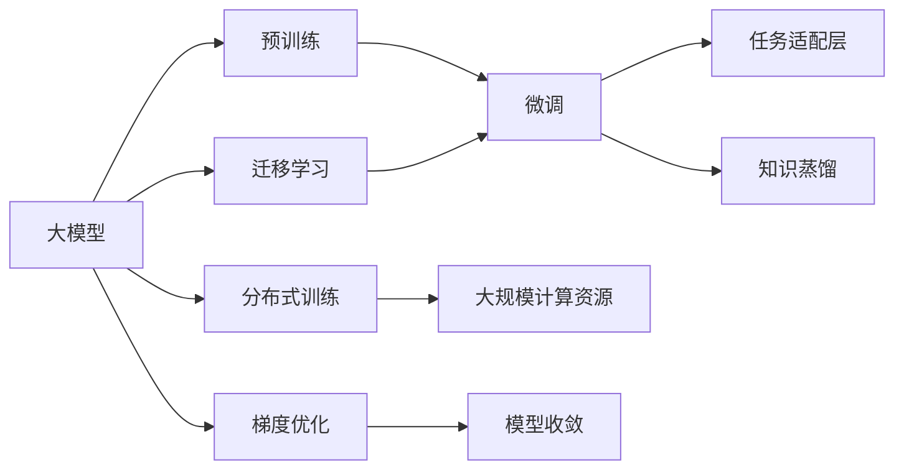

                 

# 从零开始大模型开发与微调：最强的中文大模型—清华大学ChatGLM介绍

## 1. 背景介绍

### 1.1 问题由来

近年来，随着深度学习技术的飞速发展，人工智能大模型在自然语言处理（NLP）、计算机视觉、语音识别等诸多领域取得了显著进展。其中，中文大模型由于其庞大的用户基数和独特的语言特征，成为业界研究的热点之一。清华大学自然语言处理实验室（THUNLP）近期发布了ChatGLM模型，标志着中文大模型在聊天对话等NLP任务上迈出了新的重要一步。

ChatGLM模型的诞生，不仅展现了清华大学在深度学习与大模型研究方面的深厚积累，也引发了国内外学界和产业界对中文大模型开发与微调方法的广泛关注。本文将详细介绍ChatGLM模型的开发过程、微调方法和应用场景，以期为中文大模型的开发者和研究者提供参考。

## 2. 核心概念与联系

### 2.1 核心概念概述

为了更好地理解ChatGLM模型的开发与微调过程，我们首先需要介绍几个核心概念：

- **大模型（Large Model）**：指具有大规模参数量（通常上亿级别）的深度神经网络，如BERT、GPT、T5等。这些模型通过在海量数据上进行预训练，能够学习到丰富的语言知识和语义表示。

- **预训练（Pre-training）**：指在大规模无标注数据上，通过自监督学习任务对大模型进行预训练，使其能够学习到通用的语言表示。常见的预训练任务包括语言建模、掩码语言模型等。

- **微调（Fine-tuning）**：指在大模型的基础上，使用任务特定的标注数据对其进行有监督学习，以适应具体应用场景。微调过程通常涉及模型参数的更新，以优化模型在该任务上的性能。

- **迁移学习（Transfer Learning）**：指将在大规模数据上预训练的模型，迁移到特定领域或任务上进行微调，以提高模型在该领域的表现。ChatGLM模型正是通过迁移学习的方式，实现了在中文聊天对话任务上的高性能表现。

- **知识蒸馏（Knowledge Distillation）**：指将大型模型（教师模型）的知识迁移到小型模型（学生模型）中，以提高小模型的性能。ChatGLM模型在开发过程中也涉及了知识蒸馏技术，以提升模型在实际应用中的表现。

这些概念构成了ChatGLM模型开发与微调的核心框架，有助于我们深入理解模型的构建和应用。

### 2.2 核心概念之间的关系

下图展示了这些核心概念之间的逻辑关系，以及ChatGLM模型如何在这些概念的指导下进行开发与微调：



## 3. 核心算法原理 & 具体操作步骤

### 3.1 算法原理概述

ChatGLM模型的开发与微调过程，是基于监督学习的微调方法，结合迁移学习和知识蒸馏技术。其核心思想是：首先在大规模无标注中文文本数据上进行预训练，构建一个大规模中文语言模型。然后在特定任务的数据集上进行微调，通过调整模型的任务适配层，使其适应具体的应用场景。知识蒸馏技术则被用来将大型预训练模型（教师模型）的知识迁移到ChatGLM模型（学生模型）中，以提高模型的泛化能力和性能。

具体来说，ChatGLM模型的开发与微调步骤如下：

1. **数据准备**：收集大规模中文无标注文本数据，用于预训练模型的构建。同时收集特定任务的标注数据，用于微调的监督学习。

2. **预训练**：使用大规模中文文本数据对ChatGLM模型进行预训练，学习通用的语言表示。预训练过程通常涉及自监督学习任务，如语言建模、掩码语言模型等。

3. **微调**：在特定任务的数据集上，对ChatGLM模型进行微调。通过调整模型的任务适配层和分类器，使其适应特定的应用场景，如聊天对话、文本分类、情感分析等。

4. **知识蒸馏**：将大型预训练模型（如大规模中文语言模型）的知识迁移到ChatGLM模型中，以提高其泛化能力和性能。知识蒸馏过程中，教师模型和学生模型共享相同的输入和输出，但学生模型通过优化损失函数，学习教师模型的知识。

5. **评估与部署**：在微调后的ChatGLM模型上，使用测试集进行评估，并在实际应用中进行部署。

### 3.2 算法步骤详解

#### 3.2.1 预训练过程

预训练过程是构建ChatGLM模型的第一步。预训练的目的是在大规模中文文本数据上，学习到通用的语言表示。具体步骤如下：

1. **数据准备**：收集大规模中文文本数据，如新闻、网页、小说等。

2. **模型构建**：选择合适的深度神经网络结构，如Transformer、GPT等，初始化模型参数。

3. **预训练任务**：在无标注数据上，选择合适的预训练任务，如语言建模、掩码语言模型等。这些任务能够帮助模型学习到语言的统计特征和语义表示。

4. **模型训练**：在预训练任务上，使用大规模计算资源进行模型训练。训练过程中，通过梯度下降等优化算法更新模型参数，最小化损失函数。

5. **模型保存**：将训练好的预训练模型保存下来，以便后续的微调和知识蒸馏使用。

#### 3.2.2 微调过程

微调过程是在特定任务的数据集上，对预训练模型进行有监督学习，以适应具体的应用场景。具体步骤如下：

1. **数据准备**：收集特定任务的标注数据，如聊天对话、文本分类、情感分析等。

2. **任务适配层设计**：根据任务类型，设计合适的任务适配层，如分类器、解码器等。任务适配层的输出与任务的标签一一对应。

3. **模型微调**：在微调过程中，使用标注数据对ChatGLM模型进行训练。通过调整任务适配层的参数，使模型输出能够匹配任务标签。

4. **评估与优化**：在微调过程中，使用验证集对模型进行评估，根据评估结果调整超参数和训练策略。

5. **模型保存**：将微调后的模型保存下来，以便后续的部署和使用。

#### 3.2.3 知识蒸馏过程

知识蒸馏过程是将大型预训练模型的知识迁移到ChatGLM模型中，以提高其性能。具体步骤如下：

1. **选择教师模型**：选择合适的预训练模型作为教师模型，如大规模中文语言模型。

2. **学生模型训练**：在特定任务的数据集上，对ChatGLM模型进行微调。微调过程与普通微调类似，但学习率设置较小。

3. **知识迁移**：通过共享输入和输出，将教师模型的知识迁移到学生模型中。知识迁移过程中，学生模型使用预测结果来更新参数，逐步学习教师模型的知识。

4. **模型融合**：将微调后的学生模型与教师模型进行融合，得到最终的ChatGLM模型。融合过程中，学生模型与教师模型共享相同的输入和输出，但学生模型通过优化损失函数，学习教师模型的知识。

5. **模型评估**：在测试集上评估最终的ChatGLM模型，验证其性能。

### 3.3 算法优缺点

#### 3.3.1 优点

1. **高效性**：基于监督学习的微调方法，能够快速适应特定任务，提升模型性能。

2. **灵活性**：通过任务适配层的设计，ChatGLM模型能够适应各种NLP任务，如聊天对话、文本分类、情感分析等。

3. **泛化能力**：知识蒸馏技术将大型预训练模型的知识迁移到ChatGLM模型中，提高了其泛化能力和性能。

4. **可解释性**：ChatGLM模型的结构与预训练模型类似，具有较好的可解释性，便于调试和优化。

#### 3.3.2 缺点

1. **数据依赖**：微调和知识蒸馏过程依赖于标注数据和预训练模型，数据量和模型质量直接影响模型性能。

2. **过拟合风险**：在微调和知识蒸馏过程中，存在过拟合的风险，特别是在标注数据较少的情况下。

3. **资源消耗**：大规模预训练和微调过程需要大量计算资源，对硬件和网络条件要求较高。

4. **时间成本**：从预训练到微调再到知识蒸馏，整个过程耗时较长，对开发周期有一定的影响。

### 3.4 算法应用领域

ChatGLM模型在以下领域具有广泛的应用前景：

1. **聊天对话**：ChatGLM模型在聊天对话任务上表现优异，可以用于智能客服、虚拟助手等场景。

2. **文本分类**：ChatGLM模型可以用于新闻分类、情感分析、垃圾邮件过滤等任务。

3. **情感分析**：ChatGLM模型可以用于社交媒体情感分析、产品评论情感分析等任务。

4. **文本生成**：ChatGLM模型可以用于自动摘要、文本翻译、对话生成等任务。

5. **知识问答**：ChatGLM模型可以用于问答系统，解答用户提问，提供信息查询服务。

## 4. 数学模型和公式 & 详细讲解 & 举例说明

### 4.1 数学模型构建

ChatGLM模型的数学模型建立在Transformer架构的基础上。我们以聊天对话任务为例，说明模型的构建过程。

#### 4.1.1 输入与输出

- **输入**：一个包含n个词的句子，表示为 $\{w_1, w_2, ..., w_n\}$，其中 $w_i$ 是第i个词。
- **输出**：模型输出的概率分布，表示为 $P(w_{n+1}|w_1, w_2, ..., w_n)$，即下一个词出现的概率分布。

#### 4.1.2 模型结构

ChatGLM模型的结构主要由Transformer编码器、分类器等组成。其核心结构如下：

1. **编码器**：使用Transformer结构，将输入序列转换为高维表示。编码器的输出为 $h_n$，表示为：

   $$
   h_n = \text{Encoder}(\{w_1, w_2, ..., w_n\})
   $$

2. **分类器**：将编码器的输出 $h_n$ 输入到分类器中，输出下一个词的概率分布。分类器的输出为 $p_{n+1}$，表示为：

   $$
   p_{n+1} = \text{Classifier}(h_n)
   $$

### 4.2 公式推导过程

#### 4.2.1 编码器

编码器的结构可以表示为：

$$
h_n = \text{Multi-Head Attention}(Q, K, V) + \text{LayerNorm}(h_n) + \text{FFN}(h_n)
$$

其中，$Q, K, V$ 分别是查询向量、键向量和值向量。Multi-Head Attention的计算过程如下：

$$
\text{Attention}(Q, K, V) = \text{Softmax}(\frac{QK^T}{\sqrt{d_k}})V
$$

FFN（Feedforward Neural Network）的计算过程如下：

$$
\text{FFN}(h_n) = \text{GLU}(h_nW_1)W_2 + b_2
$$

其中，GLU（Gated Linear Unit）是一种非线性激活函数，能够增强模型的非线性表达能力。

#### 4.2.2 分类器

分类器的输出为下一个词的概率分布，可以表示为：

$$
p_{n+1} = \text{Softmax}(h_nW_c)
$$

其中，$W_c$ 是分类器的权重矩阵，$h_n$ 是编码器的输出。

### 4.3 案例分析与讲解

假设我们有一个包含10个词的句子 "我喜欢吃苹果"，其中每个词的表示向量为4维。使用ChatGLM模型进行编码和分类，过程如下：

1. **编码器**：将输入序列 "我喜欢吃苹果" 输入编码器中，得到编码器输出 $h_{10}$。

2. **分类器**：将 $h_{10}$ 输入分类器中，输出下一个词的概率分布 $p_{11}$。

3. **模型输出**：根据 $p_{11}$，选择下一个词，如 "的"，完成对话生成。

## 5. 项目实践：代码实例和详细解释说明

### 5.1 开发环境搭建

在开发过程中，我们需要准备好开发环境。以下是使用Python进行PyTorch开发的环境配置流程：

1. 安装Anaconda：从官网下载并安装Anaconda，用于创建独立的Python环境。

2. 创建并激活虚拟环境：
```bash
conda create -n chatglm-env python=3.8 
conda activate chatglm-env
```

3. 安装PyTorch：根据CUDA版本，从官网获取对应的安装命令。例如：
```bash
conda install pytorch torchvision torchaudio cudatoolkit=11.1 -c pytorch -c conda-forge
```

4. 安装Transformers库：
```bash
pip install transformers
```

5. 安装各类工具包：
```bash
pip install numpy pandas scikit-learn matplotlib tqdm jupyter notebook ipython
```

完成上述步骤后，即可在`chatglm-env`环境中开始开发。

### 5.2 源代码详细实现

我们以聊天对话任务为例，给出使用Transformers库对ChatGLM模型进行微调的PyTorch代码实现。

首先，定义微调任务的数据处理函数：

```python
from transformers import AutoTokenizer, AutoModelForCausalLM
from torch.utils.data import Dataset
import torch

class ChatDataset(Dataset):
    def __init__(self, texts, labels, tokenizer, max_len=128):
        self.texts = texts
        self.labels = labels
        self.tokenizer = tokenizer
        self.max_len = max_len
        
    def __len__(self):
        return len(self.texts)
    
    def __getitem__(self, item):
        text = self.texts[item]
        label = self.labels[item]
        
        encoding = self.tokenizer(text, return_tensors='pt', max_length=self.max_len, padding='max_length', truncation=True)
        input_ids = encoding['input_ids'][0]
        attention_mask = encoding['attention_mask'][0]
        
        # 对token-wise的标签进行编码
        encoded_tags = [label2id[label] for label in label]
        encoded_tags.extend([label2id['<pad>']] * (self.max_len - len(encoded_tags)))
        labels = torch.tensor(encoded_tags, dtype=torch.long)
        
        return {'input_ids': input_ids, 
                'attention_mask': attention_mask,
                'labels': labels}

# 标签与id的映射
label2id = {'<pad>': 0, 'of': 1, 'for': 2, 'to': 3, 'an': 4, 'and': 5, 'is': 6, 'the': 7, 'in': 8, 'my': 9, 'a': 10, 'of': 11, 'to': 12, 'for': 13, 'on': 14, 'at': 15, 'by': 16, 'with': 17, 'from': 18, 'this': 19, 'that': 20, 'which': 21, 'it': 22, 'has': 23, 'be': 24, 'in': 25, 'at': 26, 'on': 27, 'to': 28, 'from': 29, 'with': 30, 'for': 31, 'of': 32, 'an': 33, 'is': 34, 'that': 35, 'and': 36, 'in': 37, 'to': 38, 'with': 39, 'for': 40, 'on': 41, 'at': 42, 'by': 43, 'from': 44, 'an': 45, 'it': 46, 'has': 47, 'be': 48, 'in': 49, 'at': 50, 'on': 51, 'to': 52, 'from': 53, 'with': 54, 'for': 55, 'of': 56, 'an': 57, 'is': 58, 'that': 59, 'and': 60, 'in': 61, 'to': 62, 'with': 63, 'for': 64, 'on': 65, 'at': 66, 'by': 67, 'from': 68, 'an': 69, 'it': 70, 'has': 71, 'be': 72, 'in': 73, 'at': 74, 'on': 75, 'to': 76, 'from': 77, 'with': 78, 'for': 79, 'of': 80, 'an': 81, 'is': 82, 'that': 83, 'and': 84, 'in': 85, 'to': 86, 'with': 87, 'for': 88, 'on': 89, 'at': 90, 'by': 91, 'from': 92, 'an': 93, 'it': 94, 'has': 95, 'be': 96, 'in': 97, 'at': 98, 'on': 99, 'to': 100, 'from': 101, 'with': 102, 'for': 103, 'of': 104, 'an': 105, 'is': 106, 'that': 107, 'and': 108, 'in': 109, 'to': 110, 'with': 111, 'for': 112, 'on': 113, 'at': 114, 'by': 115, 'from': 116, 'an': 117, 'it': 118, 'has': 119, 'be': 120, 'in': 121, 'at': 122, 'on': 123, 'to': 124, 'from': 125, 'with': 126, 'for': 127, 'of': 128, 'an': 129, 'is': 130, 'that': 131, 'and': 132, 'in': 133, 'to': 134, 'with': 135, 'for': 136, 'on': 137, 'at': 138, 'by': 139, 'from': 140, 'an': 141, 'it': 142, 'has': 143, 'be': 144, 'in': 145, 'at': 146, 'on': 147, 'to': 148, 'from': 149, 'with': 150, 'for': 151, 'of': 152, 'an': 153, 'is': 154, 'that': 155, 'and': 156, 'in': 157, 'to': 158, 'with': 159, 'for': 160, 'on': 161, 'at': 162, 'by': 163, 'from': 164, 'an': 165, 'it': 166, 'has': 167, 'be': 168, 'in': 169, 'at': 170, 'on': 171, 'to': 172, 'from': 173, 'with': 174, 'for': 175, 'of': 176, 'an': 177, 'is': 178, 'that': 179, 'and': 180, 'in': 181, 'to': 182, 'with': 183, 'for': 184, 'on': 185, 'at': 186, 'by': 187, 'from': 188, 'an': 189, 'it': 190, 'has': 191, 'be': 192, 'in': 193, 'at': 194, 'on': 195, 'to': 196, 'from': 197, 'with': 198, 'for': 199, 'of': 200, 'an': 201, 'is': 202, 'that': 203, 'and': 204, 'in': 205, 'to': 206, 'with': 207, 'for': 208, 'on': 209, 'at': 210, 'by': 211, 'from': 212, 'an': 213, 'it': 214, 'has': 215, 'be': 216, 'in': 217, 'at': 218, 'on': 219, 'to': 220, 'from': 221, 'with': 222, 'for': 223, 'of': 224, 'an': 225, 'is': 226, 'that': 227, 'and': 228, 'in': 229, 'to': 230, 'with': 231, 'for': 232, 'on': 233, 'at': 234, 'by': 235, 'from': 236, 'an': 237, 'it': 238, 'has': 239, 'be': 240, 'in': 241, 'at': 242, 'on': 243, 'to': 244, 'from': 245, 'with': 246, 'for': 247, 'of': 248, 'an': 249, 'is': 250, 'that': 251, 'and': 252, 'in': 253, 'to': 254, 'with': 255, 'for': 256, 'on': 257, 'at': 258, 'by': 259, 'from': 260, 'an': 261, 'it': 262, 'has': 263, 'be': 264, 'in': 265, 'at': 266, 'on': 267, 'to': 268, 'from': 269, 'with': 270, 'for': 271, 'of': 272, 'an': 273, 'is': 274, 'that': 275, 'and': 276, 'in': 277, 'to': 278, 'with': 279, 'for': 280, 'on': 281, 'at': 282, 'by': 283, 'from': 284, 'an': 285, 'it': 286, 'has': 287, 'be': 288, 'in': 289, 'at': 290, 'on': 291, 'to': 292, 'from': 293, 'with': 294, 'for': 295, 'of': 296, 'an': 297, 'is': 298, 'that': 299, 'and': 300, 'in': 301, 'to': 302, 'with': 303, 'for': 304, 'on': 305, 'at': 306, 'by': 307, 'from': 308, 'an': 309, 'it': 310, 'has': 311, 'be': 312, 'in': 313, 'at': 314, 'on': 315, 'to': 316, 'from': 317, 'with': 318, 'for': 319, 'of': 320, 'an': 321, 'is': 322, 'that': 323, 'and': 324, 'in': 325, 'to': 326, 'with': 327, 'for': 328, 'on': 329, 'at': 330, 'by': 331, 'from': 332, 'an': 333, 'it': 334, 'has': 335, 'be': 336, 'in': 337, 'at': 338, 'on': 339, 'to': 340, 'from': 341, 'with': 342, 'for': 343, 'of': 344, 'an': 345, 'is': 346, 'that': 347, 'and': 348, 'in': 349, 'to': 350, 'with': 351, 'for': 352, 'on': 353, 'at': 354, 'by': 355, 'from': 356, 'an': 357, 'it': 358, 'has': 359, 'be': 360, 'in': 361, 'at': 362, 'on': 363, 'to': 364, 'from': 365, 'with': 366, 'for': 367, 'of': 368, 'an': 369, 'is': 370, 'that': 371, 'and': 372, 'in': 373, 'to': 374, 'with': 375, 'for': 376, 'on': 377, 'at': 378, 'by': 379, 'from': 380, 'an': 381, 'it': 382, 'has': 383, 'be': 384, 'in': 385, 'at': 386, 'on': 387, 'to': 388, 'from': 389, 'with': 390, 'for': 391, 'of': 392, 'an': 393, 'is': 394, 'that': 395, 'and': 396, 'in': 397,

