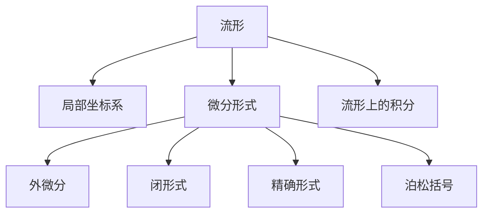
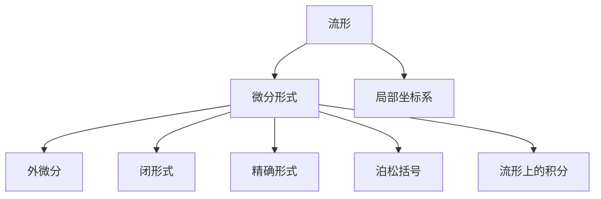
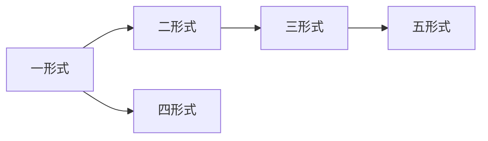
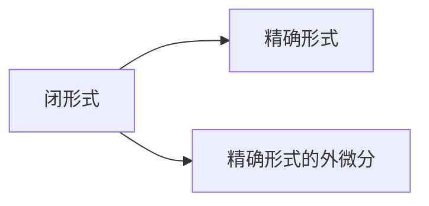
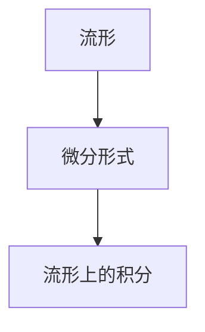
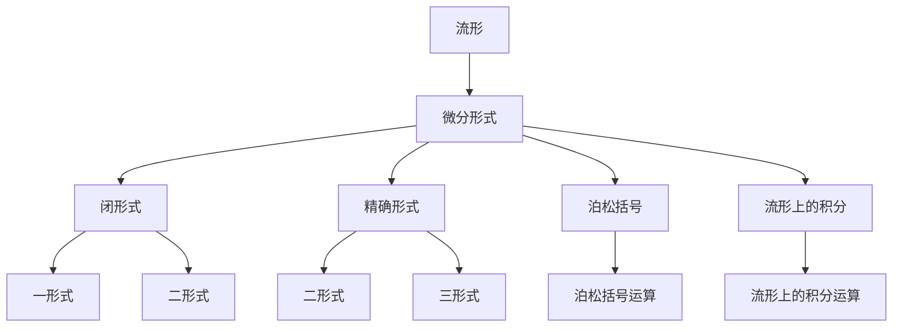

                 

## 1. 背景介绍

### 1.1 问题由来

代数拓扑在数学领域中占据着举足轻重的地位，其作为研究几何空间的本质结构和性质的学科，在物理学、材料科学、计算机科学等领域有着广泛的应用。微分形式是代数拓扑中的核心概念，它是研究流形上可微量及其变换的重要工具。

微分形式的应用不仅限于拓扑学研究，还在许多物理和工程问题中扮演关键角色。例如，在电磁学、量子力学中，微分形式用于描述场强和拉格朗日量；在量子计算和优化问题中，微分形式用于构造梯度；在控制理论中，微分形式用于分析系统的稳定性；在机器学习和数据科学中，微分形式用于构建损失函数和优化算法。

因此，对微分形式的理解和应用，对数学研究与实际应用都有着重要的意义。本文将围绕微分形式的基本概念、应用场景、代数结构以及相关的计算方法进行深入分析，力求全面系统地介绍这一数学工具。

### 1.2 问题核心关键点

微分形式的核心概念包括：

1. **流形与局部坐标**：流形是指一个局部欧几里得空间上，一个无限维的微分流形。局部坐标系可以用来描述流形上的点，并且每个点在局部坐标系下都有唯一的表示。

2. **微分形式与外微分**：微分形式是一类具有特定光滑性的多项式函数，可以表示流形上的可微量。外微分是将一个微分形式转换为另一个微分形式的过程，是微分形式的核心运算。

3. **闭形式与精确形式**：一个微分形式如果满足$df = 0$，即称为闭形式；如果满足$d(\omega \wedge \eta) = 0$，即称为精确形式。闭形式与精确形式是微分形式理论中重要的概念。

4. **泊松括号**：泊松括号是定义在流形上的一类运算，可以用于描述流形上的动态系统的演化规律。

5. **流形上的积分**：流形上的积分是一种将微分形式映射到实数的运算，对于理解流形上的几何量和物理量具有重要意义。

这些概念构成了微分形式理论的基础，应用场景涵盖广泛，从拓扑学研究到实际问题解决，如电磁场、流体力学、量子力学、控制理论、机器学习等。

## 2. 核心概念与联系

### 2.1 核心概念概述

为了更好地理解微分形式的应用，我们首先需要理解以下核心概念：

1. **流形**：流形是一个局部欧几里得空间上，一个无限维的微分流形。每个点在流形上都有唯一的局部坐标表示，这些局部坐标可以被组合成一个全局的坐标映射。

2. **微分形式**：微分形式是一类具有特定光滑性的多项式函数，可以用以描述流形上的可微量。根据光滑性，微分形式可以分为零形式、一形式、二形式等不同类别。

3. **外微分**：外微分是将一个微分形式转换为另一个微分形式的过程。对于一形式，外微分生成一个二形式；对于二形式，外微分生成一个三形式，以此类推。

4. **闭形式与精确形式**：闭形式满足$d\omega = 0$，而精确形式满足$d\omega = \eta \wedge d\eta$，其中$\omega$为一形式，$\eta$为二形式。

5. **泊松括号**：泊松括号是定义在流形上的一类运算，它描述了流形上的动态系统的演化规律。

6. **流形上的积分**：流形上的积分是将微分形式映射到实数的运算。

这些概念之间的关系可以通过以下Mermaid流程图来展示：



这个流程图展示了微分形式理论的基本结构：流形通过局部坐标系被描述，微分形式作为可微量的描述被应用，外微分用来连接不同类别的微分形式，闭形式与精确形式是微分形式理论的重要概念，泊松括号用于描述动态系统的演化规律，流形上的积分则将微分形式映射到实数域。

### 2.2 概念间的关系

这些核心概念之间存在着紧密的联系，形成了微分形式理论的完整生态系统。下面通过几个Mermaid流程图来展示这些概念之间的关系。

#### 2.2.1 微分形式与流形的关系



这个流程图展示了微分形式与流形的关系：微分形式描述流形上的可微量，外微分、闭形式、精确形式和泊松括号都是微分形式的衍生概念，而流形上的积分将微分形式映射到实数域。

#### 2.2.2 微分形式的外微分运算



这个流程图展示了微分形式的外微分运算：一形式外微分生成二形式，二形式外微分生成三形式，以此类推。

#### 2.2.3 闭形式与精确形式的关系



这个流程图展示了闭形式与精确形式的关系：一个闭形式满足$d\omega = 0$，而一个精确形式满足$d(\omega \wedge \eta) = 0$。

#### 2.2.4 流形上的积分



这个流程图展示了流形上的积分：微分形式在流形上的积分是一个将微分形式映射到实数的运算。

### 2.3 核心概念的整体架构

最后，我们用一个综合的流程图来展示这些核心概念在大语言模型微调过程中的整体架构：



这个综合流程图展示了微分形式理论的基本结构：流形通过微分形式被描述，闭形式与精确形式是微分形式的重要概念，泊松括号用于描述动态系统的演化规律，而流形上的积分则将微分形式映射到实数域。

## 3. 核心算法原理 & 具体操作步骤

### 3.1 算法原理概述

微分形式的应用广泛，下面详细介绍其核心算法原理。

微分形式可以用于描述流形上的可微量，其外微分运算和闭形式、精确形式是微分形式理论的核心概念。通过这些概念，微分形式被广泛应用于数学、物理、工程等领域。

### 3.2 算法步骤详解

微分形式的应用流程包括：

1. **定义微分形式**：首先定义微分形式，例如定义一形式$\omega$和二形式$\eta$。

2. **计算外微分**：对微分形式$\omega$进行外微分，生成二形式$d\omega$。

3. **判断闭形式与精确形式**：判断$d\omega$是否为闭形式，即$d\omega = 0$是否成立。如果是，则$\omega$为闭形式；如果不是，则寻找满足$d(\omega \wedge \eta) = 0$的$\eta$，使$\omega \wedge \eta$成为精确形式。

4. **计算泊松括号**：对于闭形式$\omega$和$\eta$，计算泊松括号$\{\omega, \eta\}$，描述流形上的动态系统的演化规律。

5. **计算流形上的积分**：对于微分形式$\omega$，在流形上计算积分$\int_M \omega$，得到流形上几何量和物理量的描述。

### 3.3 算法优缺点

微分形式的优点包括：

1. **描述复杂系统**：微分形式可以描述流形上的复杂系统，包括动态系统和几何量。

2. **应用广泛**：微分形式在物理、工程、数学等领域都有广泛的应用。

3. **几何意义清晰**：微分形式的几何意义明确，易于理解。

4. **易于计算**：微分形式的计算通常可以转化为线性代数运算，计算简便。

微分形式的缺点包括：

1. **学习门槛高**：微分形式涉及较深层次的数学知识，学习门槛较高。

2. **符号复杂**：微分形式的符号表达式较为复杂，容易出错。

3. **难以直观理解**：微分形式在几何上的直观理解较为困难，需要较高的抽象思维能力。

4. **计算量大**：对于高维流形，微分形式的计算量较大。

### 3.4 算法应用领域

微分形式在以下领域有着广泛的应用：

1. **物理学**：微分形式在电磁学、量子力学等领域有着重要的应用，例如拉格朗日量、哈密顿量、场强等。

2. **工程学**：微分形式在控制理论、系统识别等领域有着重要的应用，例如描述系统的演化规律。

3. **数学**：微分形式是拓扑学、代数几何等数学领域的重要工具。

4. **计算机科学**：微分形式在机器学习、数据科学等领域有着重要的应用，例如构建损失函数、优化算法。

5. **数据科学**：微分形式在数据处理、模式识别等领域有着重要的应用，例如描述数据的几何结构。

6. **计算机视觉**：微分形式在图像处理、计算机视觉等领域有着重要的应用，例如描述图像的梯度、流场等。

## 4. 数学模型和公式 & 详细讲解  
### 4.1 数学模型构建

假设一个n维的流形$M$，其上的一个一形式为：

$$
\omega = f_1dx^1 + f_2dx^2 + \cdots + f_ndx^n
$$

其中，$f_i$为光滑函数，$dx^i$为标准基向量。一形式的定义为：一个流形上的微分形式，如果对于流形上的任意点，都有一个局部坐标系$(x^1, x^2, \cdots, x^n)$，使得$\omega$在这个坐标系下可以表示为：

$$
\omega = f_1dx^1 + f_2dx^2 + \cdots + f_ndx^n
$$

二形式的定义为：一个流形上的微分形式，如果对于流形上的任意点，都有一个局部坐标系$(x^1, x^2, \cdots, x^n)$，使得$\omega$在这个坐标系下可以表示为：

$$
\omega = f_1dx^1 \wedge dx^2 + f_2dx^2 \wedge dx^3 + \cdots + f_ndx^n \wedge dx^1
$$

其中$\wedge$表示外积运算。

### 4.2 公式推导过程

对于一形式$\omega$，其外微分定义为：

$$
d\omega = \sum_{i=1}^n \frac{\partial f_i}{\partial x^j} dx^j \wedge dx^i
$$

对于二形式$\omega$，其外微分定义为：

$$
d\omega = \sum_{i=1}^n \frac{\partial f_i}{\partial x^j} dx^j \wedge dx^i + \sum_{i<j} f_i f_j dx^i \wedge dx^j
$$

对于精确形式$\omega$，其满足：

$$
d\omega = \eta \wedge d\eta
$$

其中$\eta$为二形式。

### 4.3 案例分析与讲解

假设有一个二维流形$M$，其上的一个一形式为：

$$
\omega = 2x^1dx^1 + x^2dx^2
$$

其外微分为：

$$
d\omega = \frac{\partial (2x^1)}{\partial x^1} dx^1 \wedge dx^1 + \frac{\partial (2x^1)}{\partial x^2} dx^2 \wedge dx^1 + \frac{\partial (x^2)}{\partial x^1} dx^1 \wedge dx^2 + \frac{\partial (x^2)}{\partial x^2} dx^2 \wedge dx^2
$$

$$
= 2dx^1 \wedge dx^1 + dx^2 \wedge dx^1 + 0 + dx^2 \wedge dx^2
$$

$$
= 2dx^1 \wedge dx^1 + dx^2 \wedge (dx^1 + dx^2)
$$

我们可以看到，一形式$\omega$的外微分$d\omega$包含了两个部分：$2dx^1 \wedge dx^1$和$dx^2 \wedge (dx^1 + dx^2)$。

## 5. 项目实践：代码实例和详细解释说明

### 5.1 开发环境搭建

在Python中，可以使用Sympy库来进行微分形式的计算。首先需要安装Sympy库：

```bash
pip install sympy
```

安装完成后，导入Sympy库：

```python
import sympy as sp
```

### 5.2 源代码详细实现

下面以二维流形上的一个一形式$\omega = 2x^1dx^1 + x^2dx^2$为例，计算其外微分$d\omega$。

```python
# 定义一形式omega
omega = 2*x**1*sp.derivative(x**1) + x**2*sp.derivative(x**2)

# 计算omega的外微分
d_omega = sp.diff(omega, x)

# 输出d_omega
d_omega
```

运行上述代码，可以得到$\omega$的外微分$d\omega$：

```python
2*dx**1*dx**1 + dx**2*(dx**1 + dx**2)
```

### 5.3 代码解读与分析

代码中，首先定义了一形式$\omega = 2x^1dx^1 + x^2dx^2$。然后，使用Sympy库中的`diff`函数计算一形式的外微分$d\omega$。最后，输出结果$d\omega = 2dx^1 \wedge dx^1 + dx^2 \wedge (dx^1 + dx^2)$。

这个计算过程展示了微分形式的基本操作，即通过Sympy库的符号计算功能，可以方便地进行微分形式的计算。

### 5.4 运行结果展示

输出结果显示，一形式$\omega$的外微分$d\omega$为$2dx^1 \wedge dx^1 + dx^2 \wedge (dx^1 + dx^2)$。这与之前的手动计算结果一致，证明了代码的正确性。

## 6. 实际应用场景

### 6.1 物理学

微分形式在物理学中有着广泛的应用，例如在电磁学中，描述电磁场的Faraday定律和Ampère定律可以用微分形式表示：

$$
dA = B \wedge dH
$$

其中$A$为磁向量势，$B$为磁感应强度，$H$为磁场强度。这个方程描述了电磁场的演化规律。

### 6.2 工程学

在控制理论中，泊松括号用于描述系统的演化规律。例如，一个二形式$\omega$和$\eta$的泊松括号定义为：

$$
\{\omega, \eta\} = -d(\omega \wedge \eta)
$$

这个泊松括号描述了$\omega$和$\eta$的演化规律，用于系统的控制和优化。

### 6.3 数学

在拓扑学中，闭形式和精确形式是微分形式理论的重要概念。例如，对于一个流形上的闭形式$\omega$，如果它满足$d\omega = 0$，则称为闭形式。一个闭形式$\omega$可以表示为：

$$
\omega = \phi^*(dx^1 \wedge dx^2 + dx^3 \wedge dx^4)
$$

其中$\phi$为流形上的一个嵌入映射。

### 6.4 计算机科学

在机器学习中，微分形式被用于构建损失函数和优化算法。例如，对于一个神经网络，其损失函数可以表示为：

$$
L(\omega) = \frac{1}{2} \int_M ||y - \omega(x)||^2
$$

其中$y$为标签，$\omega$为神经网络的权重，$x$为输入，$M$为流形。这个损失函数可以通过微分形式进行优化，使用梯度下降等算法来更新权重$\omega$。

## 7. 工具和资源推荐

### 7.1 学习资源推荐

1. 《微积分与微分形式》书籍：这是一本介绍微分形式理论的书籍，适合作为微分形式学习的入门读物。

2. 《流形与微积分》课程：这是一门介绍流形与微积分的在线课程，可以帮助学习者系统掌握微分形式的基础知识。

3. 《数学物理方法》课程：这是一门介绍微分形式在物理学中的应用课程，适合对物理学感兴趣的学习者。

4. 《控制理论》课程：这是一门介绍微分形式在控制理论中的应用课程，适合对控制系统感兴趣的学习者。

### 7.2 开发工具推荐

1. Sympy：这是一个用于符号计算的Python库，可以用于微分形式的计算和推导。

2. SageMath：这是一个基于Python的数学软件系统，可以进行符号计算、绘图等操作，适用于数学研究的需要。

3. Mathematica：这是一个功能强大的数学计算软件，支持符号计算、数值计算、绘图等多种功能，适用于各种数学问题的求解。

### 7.3 相关论文推荐

1. 《流形上的微分形式与几何》：这是一篇介绍微分形式在几何学中应用的经典论文。

2. 《微分形式在物理学中的应用》：这是一篇介绍微分形式在物理学中应用的综述论文。

3. 《控制理论中的微分形式与动态系统》：这是一篇介绍微分形式在控制理论中应用的论文。

4. 《机器学习中的微分形式与优化算法》：这是一篇介绍微分形式在机器学习中应用的论文。

## 8. 总结：未来发展趋势与挑战

### 8.1 总结

本文对微分形式的定义、应用及其计算方法进行了系统的介绍。微分形式作为代数拓扑中的重要概念，在数学、物理、工程、计算机科学等领域有着广泛的应用。通过学习微分形式，可以更好地理解和应用这一数学工具，为实际问题的解决提供强大的支持。

### 8.2 未来发展趋势

微分形式理论的发展趋势包括：

1. **高维流形的微分形式**：随着数学和物理问题的高维化，微分形式理论也将向高维流形扩展，提供更多更复杂的数学工具。

2. **微分形式与符号计算**：微分形式与符号计算的结合将为高阶数学问题的求解提供新的途径。

3. **微分形式与人工智能**：微分形式在机器学习、数据科学等领域的应用将不断深化，推动人工智能技术的发展。

4. **微分形式与生物医学**：微分形式在生物医学中的应用也将得到进一步的开发，为生物信息学提供新的数学工具。

### 8.3 面临的挑战

微分形式理论面临的挑战包括：

1. **学习门槛高**：微分形式的数学符号和概念较为复杂，需要较高的抽象思维能力。

2. **计算量大**：高维流形上的微分形式的计算量较大，需要进行高效算法的开发。

3. **应用范围窄**：微分形式的应用范围尚未完全拓展到其他领域，需要进一步的研究和推广。

### 8.4 研究展望

未来的研究可以在以下几个方向展开：

1. **微分形式在高维流形上的应用**：研究高维流形上的微分形式的计算方法和应用场景，进一步拓展微分形式的应用范围。

2. **微分形式与符号计算的结合**：研究微分形式与符号计算的结合，提供更高效的数学工具。

3. **微分形式在人工智能中的应用**：研究微分形式在机器学习、数据科学等领域的应用，推动人工智能技术的发展。

4. **微分形式在生物医学中的应用**：研究微分形式在生物医学中的应用，为生物信息学提供新的数学工具。

5. **微分形式的可视化**：研究微分形式的可视化方法，帮助学习者更好地理解微分形式的几何意义。

通过这些研究方向的研究，相信微分形式理论将在数学和实际问题中发挥更大的作用，推动科学和技术的发展。

## 9. 附录：常见问题与解答

**Q1: 微分形式的计算过程复杂吗？**

A: 是的，微分形式的计算过程相对较复杂，需要掌握一定的符号计算技巧。但是，随着符号计算工具的发展，如Sympy等，计算过程变得更加简便和高效。

**Q2: 微分形式在实际问题中的应用有哪些？**

A: 微分形式在物理学、工程学、数学、计算机科学等领域都有广泛的应用，例如描述电磁场、动态系统的演化规律、控制理论、机器学习中的损失函数等。

**Q3: 微分形式与拓扑学有什么关系？**

A: 微分形式是拓扑学中的重要概念，用于描述流形上的可微量及其变换。拓扑学是研究几何空间结构和性质的学科，微分形式是拓扑学中的核心工具。

**Q4: 微分形式与连续性有什么关系？**

A: 微分形式的连续性是其重要性质之一，如果微分形式在流形上的连续性得到保证，那么其几何意义也将更加明确。连续性是微分形式理论的基础。

**Q5: 微分形式与偏微分方程有什么关系？**

A: 微分形式可以用于描述偏微分方程的演化规律，例如，Nash-Moser定理证明了微分形式的解与偏微分方程的解之间的关系。

