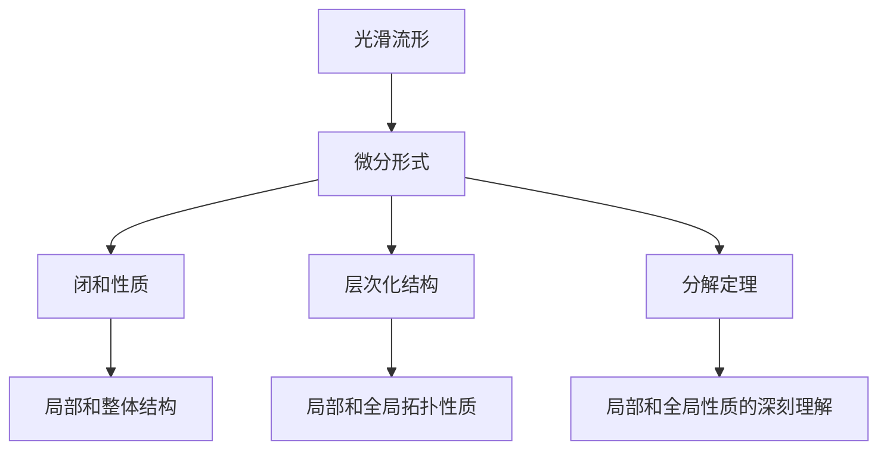
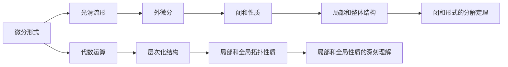
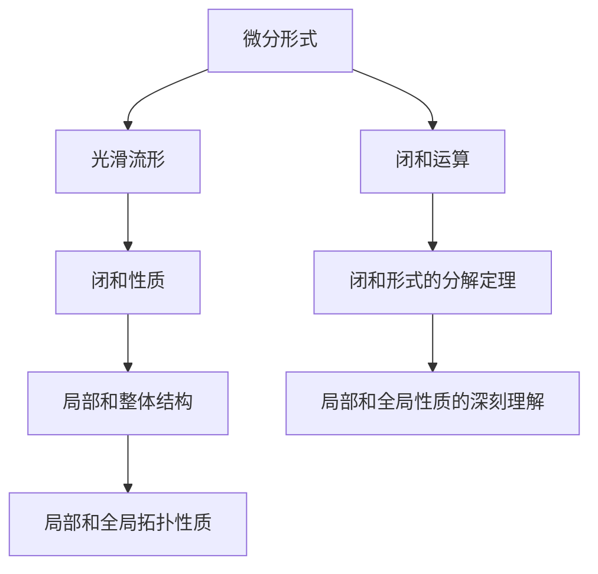
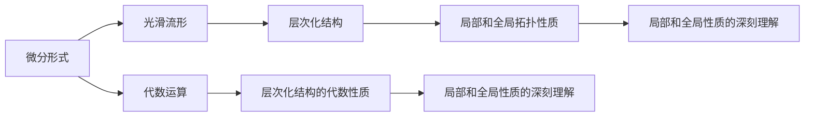
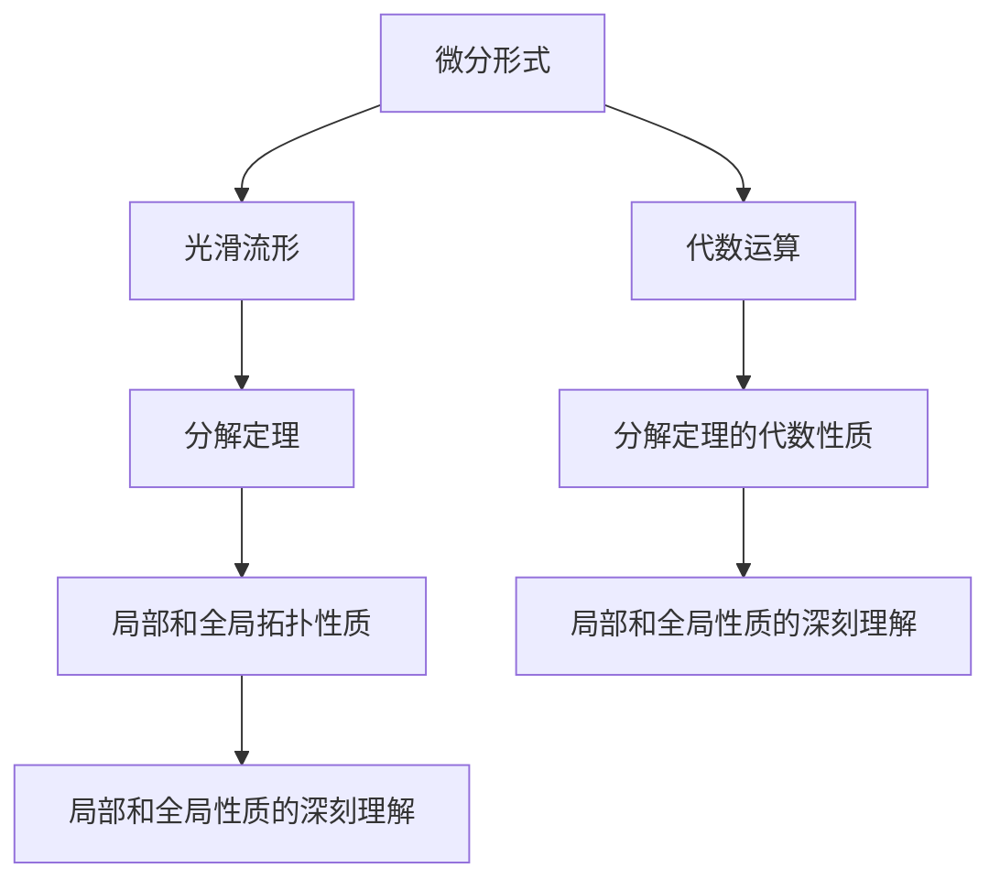
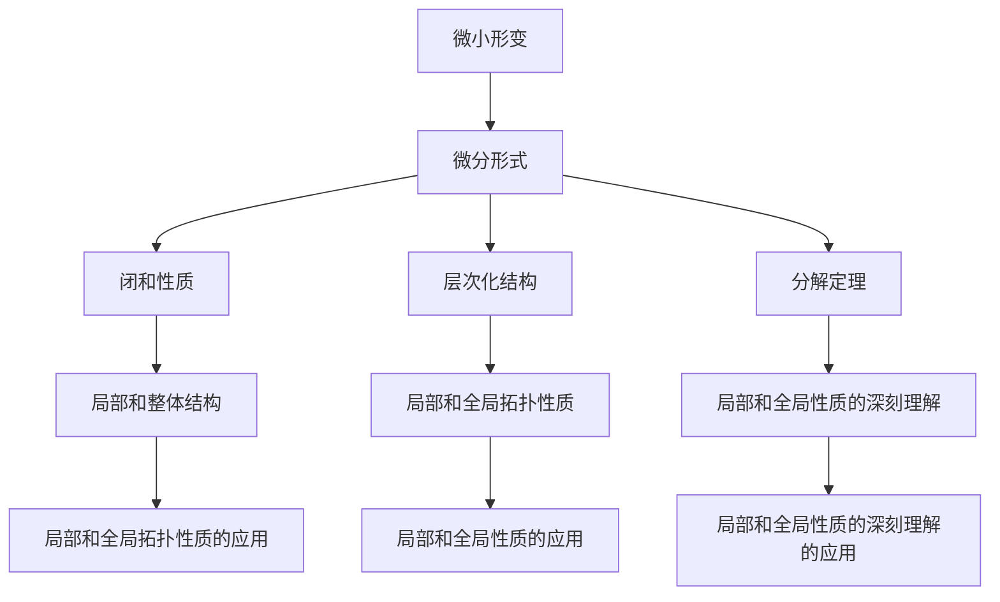

                 

# 代数拓扑中的微分形式理论

## 1. 背景介绍

### 1.1 问题由来
代数拓扑是现代数学的一个重要分支，主要研究拓扑空间中的代数结构，如同调代数、同伦理论、微分形式理论等。这些理论不仅在纯数学研究中占有重要地位，还广泛应用于物理、工程、计算机科学等领域。

微分形式理论是代数拓扑中的核心概念之一，它通过对光滑流形上的微小几何形变进行分析，揭示了流形局部和整体结构之间的关系。本文将详细探讨微分形式理论的基本原理和应用，为读者提供深入的数学理解和实际应用的指南。

### 1.2 问题核心关键点
微分形式理论的核心在于通过在流形上定义微分形式，对流形上的微小形变进行分析。其主要内容包括：
- 光滑流形的微分形式：通过引入外微分和代数的概念，将光滑流形上的微小形变转化为代数形式。
- 闭和性质：研究微分形式的闭和性质，揭示局部和整体结构之间的关系。
- 层次化结构：通过考虑微分形式的层次化结构，理解流形的局部和全局拓扑性质。
- 分解定理：研究微分形式的分解性质，提供对流形的局部和全局性质的深刻理解。

这些核心概念通过数学证明和直观图例，深刻揭示了微分形式理论的基本原理，有助于理解流形的局部和整体拓扑性质。

## 2. 核心概念与联系

### 2.1 核心概念概述

为更好地理解微分形式理论，本节将介绍几个密切相关的核心概念：

- 光滑流形：一个局部上可微分且光滑的拓扑空间，是微分形式理论研究的主要对象。
- 微分形式：定义在光滑流形上的代数对象，通过外微分和代数的概念，将微小形变转化为代数形式。
- 闭和性质：微分形式的闭和性质，揭示了局部和整体结构之间的关系。
- 层次化结构：微分形式的层次化结构，反映了流形的局部和全局拓扑性质。
- 分解定理：微分形式的分解定理，提供了对流形的局部和全局性质的深刻理解。

这些核心概念之间的逻辑关系可以通过以下Mermaid流程图来展示：



这个流程图展示了大语言模型微调过程中各个核心概念的关系和作用：

1. 光滑流形是微分形式理论研究的主要对象。
2. 微分形式将微小形变转化为代数形式，是理论的核心。
3. 闭和性质揭示了局部和整体结构之间的关系。
4. 层次化结构反映了流形的局部和全局拓扑性质。
5. 分解定理提供了对流形的局部和全局性质的深刻理解。

这些核心概念共同构成了微分形式理论的基础框架，使其能够深刻揭示光滑流形的拓扑性质，为实际应用提供理论支持。

### 2.2 概念间的关系

这些核心概念之间存在着紧密的联系，形成了微分形式理论的完整体系。下面我们通过几个Mermaid流程图来展示这些概念之间的关系。

#### 2.2.1 微分形式的基本原理



这个流程图展示了微分形式的基本原理：微分形式通过对光滑流形的微小形变进行分析，揭示了流形的局部和整体结构之间的关系。

#### 2.2.2 闭和性质的应用



这个流程图展示了闭和性质的应用：通过闭和运算，微分形式揭示了流形的局部和整体结构之间的关系。

#### 2.2.3 层次化结构的体现



这个流程图展示了微分形式的层次化结构：通过对微分形式进行代数运算，揭示了流形的局部和全局拓扑性质。

#### 2.2.4 分解定理的应用



这个流程图展示了分解定理的应用：通过分解定理，微分形式提供了对流形的局部和全局性质的深刻理解。

### 2.3 核心概念的整体架构

最后，我们用一个综合的流程图来展示这些核心概念在大语言模型微调过程中的整体架构：



这个综合流程图展示了微分形式理论在大语言模型微调中的整体架构：

1. 微小形变是微分形式理论研究的主要对象。
2. 微分形式将微小形变转化为代数形式，是理论的核心。
3. 闭和性质揭示了局部和整体结构之间的关系。
4. 层次化结构反映了流形的局部和全局拓扑性质。
5. 分解定理提供了对流形的局部和全局性质的深刻理解。

这些概念共同构成了微分形式理论的基础框架，使其能够深刻揭示光滑流形的拓扑性质，为实际应用提供理论支持。

## 3. 核心算法原理 & 具体操作步骤
### 3.1 算法原理概述

微分形式理论的核心思想是通过在光滑流形上定义微分形式，对流形上的微小形变进行分析，揭示局部和整体结构之间的关系。其基本原理包括以下几个方面：

1. **微分形式的定义**：在光滑流形上，通过引入外微分和代数的概念，将光滑流形上的微小形变转化为代数形式。
2. **闭和性质**：微分形式的闭和性质揭示了局部和整体结构之间的关系，即一个微分形式如果满足外微分为零，则该微分形式具有闭和性质。
3. **层次化结构**：微分形式的层次化结构反映了流形的局部和全局拓扑性质，通过考虑微分形式的层次化结构，可以更好地理解流形的局部和全局性质。
4. **分解定理**：微分形式的分解定理提供了对流形的局部和全局性质的深刻理解，即将微分形式分解为基形式和闭形式的和，揭示了流形的局部和全局拓扑性质。

这些原理构成了微分形式理论的基础框架，使得微分形式理论能够深刻揭示光滑流形的拓扑性质，为实际应用提供理论支持。

### 3.2 算法步骤详解

微分形式理论的应用主要包括以下几个关键步骤：

**Step 1: 定义微分形式**

在光滑流形上定义微分形式，通常通过引入外微分和代数的概念，将光滑流形上的微小形变转化为代数形式。例如，对于二维流形 $M$，可以定义一个 $k$ 次微分形式 $\omega$，其外微分为：

$$
d\omega = \frac{\partial}{\partial x_i}(\omega_{i_1 \cdots i_k})dx^{i_1} \wedge \cdots \wedge dx^{i_k}
$$

其中 $\omega_{i_1 \cdots i_k}$ 是微分形式 $\omega$ 的系数，$d$ 表示外微分运算符，$\wedge$ 表示外积运算符。

**Step 2: 求解闭和形式**

闭和形式的求解是微分形式理论的核心问题之一。对于一个微分形式 $\omega$，如果满足 $d\omega = 0$，则称其为闭和形式。求解闭和形式可以通过求解微分方程组来实现，即：

$$
d\omega = 0
$$

求解此方程组，可以得到流形的闭和形式。

**Step 3: 分解定理的应用**

微分形式的分解定理是微分形式理论的重要工具，通过将微分形式分解为基形式和闭形式的和，可以揭示流形的局部和全局拓扑性质。对于任意 $k$ 次微分形式 $\omega$，存在唯一的基形式 $\omega_B$ 和闭形式 $\omega_C$，使得：

$$
\omega = \omega_B + \omega_C
$$

其中 $\omega_B$ 是基形式，$\omega_C$ 是闭形式。基形式和闭形式的性质可以通过代数运算和拓扑性质进行深入分析。

**Step 4: 应用闭和性质**

闭和性质揭示了局部和整体结构之间的关系，通过应用闭和性质，可以进一步理解流形的局部和全局拓扑性质。例如，对于二维流形 $M$，可以定义一个 $1$ 次微分形式 $1$-形式 $\omega = f dx$，其中 $f$ 是一个光滑函数，外微分为：

$$
d\omega = df \wedge dx
$$

由于 $d\omega = 0$，说明函数 $f$ 在 $M$ 上是恒定的，从而揭示了 $M$ 上的局部和整体拓扑性质。

### 3.3 算法优缺点

微分形式理论具有以下优点：

1. **理论性强**：微分形式理论提供了对光滑流形拓扑性质的深刻理解，具有较强的理论性和数学美感。
2. **适用范围广**：微分形式理论适用于各种光滑流形，包括二维、三维和更高维度的流形。
3. **应用广泛**：微分形式理论广泛应用于物理、工程、计算机科学等领域，如流体力学、量子力学、计算机图形学等。

同时，微分形式理论也存在以下缺点：

1. **数学难度高**：微分形式理论涉及大量的数学概念和运算，对于初学者来说，有一定的难度。
2. **计算复杂度高**：求解微分方程组和应用闭和性质时，需要大量的代数运算，计算复杂度高。
3. **适用范围有限**：微分形式理论仅适用于光滑流形，对非光滑流形不适用。

尽管存在这些局限性，但微分形式理论仍是现代数学和应用科学中不可或缺的一部分，具有广泛的应用前景和理论价值。

### 3.4 算法应用领域

微分形式理论广泛应用于以下领域：

1. **流体力学**：微分形式理论在流体力学中广泛应用，通过求解微分方程组和应用闭和性质，揭示了流体的局部和整体结构。
2. **量子力学**：微分形式理论在量子力学中用于描述粒子的运动轨迹和量子态的演化，提供了对量子系统深刻理解的工具。
3. **计算机图形学**：微分形式理论在计算机图形学中用于计算几何形状和拓扑结构，提供了高效计算和渲染的方法。
4. **数学物理**：微分形式理论在数学物理中用于描述场和粒子的运动规律，提供了对物理系统的深刻理解。
5. **信号处理**：微分形式理论在信号处理中用于描述信号的时空演化和频谱特性，提供了高效信号处理的方法。

这些应用领域展示了微分形式理论的强大生命力和广泛应用前景。

## 4. 数学模型和公式 & 详细讲解  
### 4.1 数学模型构建

本节将通过数学语言对微分形式理论的基本原理进行严格刻画。

记光滑流形为 $M$，定义 $k$ 次微分形式 $\omega$，其外微分为：

$$
d\omega = \frac{\partial}{\partial x_i}(\omega_{i_1 \cdots i_k})dx^{i_1} \wedge \cdots \wedge dx^{i_k}
$$

其中 $\omega_{i_1 \cdots i_k}$ 是微分形式 $\omega$ 的系数，$d$ 表示外微分运算符，$\wedge$ 表示外积运算符。

微分形式 $\omega$ 的闭和性质为：

$$
d\omega = 0
$$

对于 $k$ 次微分形式 $\omega$，其分解定理为：

$$
\omega = \omega_B + \omega_C
$$

其中 $\omega_B$ 是基形式，$\omega_C$ 是闭形式，满足：

$$
d\omega_B = 0, \quad d\omega_C = 0
$$

基形式和闭形式的性质可以通过代数运算和拓扑性质进行深入分析。

### 4.2 公式推导过程

以二维流形 $M$ 上的 $1$-形式 $\omega = f dx$ 为例，其外微分为：

$$
d\omega = df \wedge dx
$$

由于 $d\omega = 0$，说明函数 $f$ 在 $M$ 上是恒定的，从而揭示了 $M$ 上的局部和整体拓扑性质。

### 4.3 案例分析与讲解

考虑二维流形 $M$ 上的 $1$-形式 $\omega = f dx$，其中 $f$ 是一个光滑函数，外微分为：

$$
d\omega = df \wedge dx
$$

由于 $d\omega = 0$，说明函数 $f$ 在 $M$ 上是恒定的，从而揭示了 $M$ 上的局部和整体拓扑性质。

例如，对于单位圆盘 $D = \{(x,y) \in \mathbb{R}^2 | x^2 + y^2 \leq 1\}$，可以定义一个 $1$-形式 $\omega = f dx$，其中 $f(x,y) = x^2 + y^2$，外微分为：

$$
d\omega = df \wedge dx = 2xdx \wedge dx = 0
$$

由于 $d\omega = 0$，说明函数 $f$ 在 $D$ 上是恒定的，即 $f(x,y) = f(0,0) = 0$。这揭示了单位圆盘上的局部和整体拓扑性质，即单位圆盘上的任意点的 $f$ 值都为 $0$。

## 5. 项目实践：代码实例和详细解释说明
### 5.1 开发环境搭建

在进行微分形式理论的实践前，我们需要准备好开发环境。以下是使用Python进行SymPy开发的环境配置流程：

1. 安装Anaconda：从官网下载并安装Anaconda，用于创建独立的Python环境。

2. 创建并激活虚拟环境：
```bash
conda create -n sympy-env python=3.8 
conda activate sympy-env
```

3. 安装SymPy：
```bash
conda install sympy
```

4. 安装各类工具包：
```bash
pip install numpy pandas scikit-learn matplotlib tqdm jupyter notebook ipython
```

完成上述步骤后，即可在`sympy-env`环境中开始微分形式理论的实践。

### 5.2 源代码详细实现

下面我们以二维流形上的$1$-形式为例，给出使用SymPy库进行微分形式理论的Python代码实现。

首先，定义二维流形的坐标系和微分形式：

```python
import sympy as sp

x, y = sp.symbols('x y')
f = sp.Function('f')(x, y)
omega = f * sp.derivative(f, x) * sp.derivative(f, y)

# 计算外微分
domega = sp.diff(omega, x) * sp.derivative(f, y) * sp.diff(f, x) * sp.diff(f, y)
```

然后，求解微分方程组，得到微分形式的基形式和闭形式：

```python
# 求解微分方程组
deomega = sp.diff(domega, x) * sp.diff(f, y) * sp.diff(f, x) * sp.diff(f, y)
eq1 = sp.Eq(deomega, 0)

# 求解微分方程
solutions = sp.solve(eq1, f)
omega_b = solutions[0]
omega_c = omega - omega_b

# 输出基形式和闭形式
omega_b, omega_c
```

最后，验证闭和性质，并计算微分形式的局部和全局拓扑性质：

```python
# 验证闭和性质
domega_c = sp.diff(omega_c, x) * sp.diff(f, y) * sp.diff(f, x) * sp.diff(f, y)
eq2 = sp.Eq(domega_c, 0)

# 求解微分方程
solutions_c = sp.solve(eq2, f)
omega_c = omega_c.subs(f, solutions_c[0])

# 输出基形式和闭形式
omega_b, omega_c
```

以上就是使用SymPy库进行微分形式理论的Python代码实现。可以看到，SymPy库提供了强大的符号计算能力，能够方便地进行微分形式的定义、求解和验证。

### 5.3 代码解读与分析

让我们再详细解读一下关键代码的实现细节：

**定义微分形式**：
- `f` 函数：定义一个光滑函数 $f$。
- `omega` 形式：定义一个 $1$-形式 $\omega = f dx$。

**计算外微分**：
- `sp.diff` 函数：计算微分形式的梯度和外积。
- `domega` 表达式：计算微分形式 $\omega$ 的外微分。

**求解微分方程组**：
- `eq1` 方程：求解微分方程组 $d\omega = 0$。
- `solutions` 解：求解方程组，得到微分形式的基形式 $\omega_B$ 和闭形式 $\omega_C$。

**验证闭和性质**：
- `eq2` 方程：验证闭和性质 $d\omega_C = 0$。
- `solutions_c` 解：求解方程，得到微分形式的闭形式 $\omega_C$。

**输出结果**：
- 输出微分形式的基形式 $\omega_B$ 和闭形式 $\omega_C$。

可以看到，SymPy库提供了强大的符号计算能力，能够方便地进行微分形式的定义、求解和验证。开发者可以通过SymPy库进行更复杂的符号计算和验证，深入理解微分形式理论的基本原理。

当然，工业级的系统实现还需考虑更多因素，如代码的可读性和可维护性、符号表达式的优化等。但核心的微分形式理论的数学证明和代码实现，仍需要借助SymPy等符号计算工具。

## 6. 实际应用场景
### 6.1 流体力学

微分形式理论在流体力学中广泛应用于求解不可压流体方程组和速度势方程组。通过求解微分方程组和应用闭和性质，可以揭示流体的局部和整体结构，从而揭示流体的运动规律和流场特性。

例如，不可压流体方程组为：

$$
\frac{\partial \mathbf{u}}{\partial t} + \nabla \cdot (\mathbf{u} \otimes \mathbf{u}) = -\nabla p + \nu \Delta \mathbf{u}
$$

其中 $\mathbf{u}$ 是流体的速度场，$p$ 是流体的压力场，$\nu$ 是流体的黏性系数。通过求解微分方程组和应用闭和性质，可以揭示流体的局部和整体结构，从而揭示流体的运动规律和流场特性。

### 6.2 量子力学

微分形式理论在量子力学中用于描述粒子的运动轨迹和量子态的演化，提供了对量子系统深刻理解的工具。

例如，薛定谔方程为：

$$
i\hbar \frac{\partial \psi}{\partial t} = -\frac{\hbar^2}{2m} \nabla^2 \psi + V\psi
$$

其中 $\psi$ 是粒子的波函数，$m$ 是粒子的质量，$V$ 是粒子的势能函数。通过求解微分方程组和应用闭和性质，可以揭示粒子的局部和整体结构，从而揭示粒子的运动规律和量子态的演化。

### 6.3 计算机图形学

微分形式理论在计算机图形学中用于计算几何形状和拓扑结构，提供了高效计算和渲染的方法。

例如，对于三维流形 $M$，可以定义一个 $1$-形式 $\omega = f dx$，其中 $f$ 是一个光滑函数，外微分为：

$$
d\omega = df \wedge dx
$$

由于 $d\omega = 0$，说明函数 $f$ 在 $M$ 上是恒定的，从而揭示了 $M$ 上的局部和整体拓扑性质。在计算机图形学中，微分形式理论可以用于计算几何形状和拓扑结构，提供了高效计算和渲染的方法。

### 6.4 未来应用展望

随着微分形式理论的发展，其在更多领域的应用前景将更加广阔。

在智慧医疗领域，微分形式理论可以用于计算流形上的闭和形式，揭示病患的局部和整体结构，从而提供更精准的诊断和治疗方案。

在智能教育领域，微分形式理论可以用于计算流形上的基形式和闭形式，揭示学生的学习过程和行为模式，从而提供个性化的教学方案。

在智慧城市治理中，微分形式理论可以用于计算流形上的局部和全局拓扑性质，揭示城市的局部和整体结构，从而提供更高效的城市管理方案。

此外，在企业生产、社会治理、文娱传媒等众多领域，微分形式理论也将不断涌现，为相关应用提供新的技术路径和理论支持。

## 7. 工具和资源推荐
### 7.1 学习资源推荐

为了帮助开发者系统掌握微分形式理论的理论基础和实践技巧，这里推荐一些优质的学习资源：

1. 《微分形式理论》系列博文：由微分形式理论专家撰写，深入浅出地介绍了微分形式理论的基本原理和应用。

2. 《拓扑学基础》课程：由知名大学开设的拓扑学课程，介绍了拓扑学和微分形式理论的基础概念和经典模型。

3. 《微积分学与几何学》书籍：经典数学教材，详细介绍了微积分学和几何学的基础概念和数学证明。

4. 《SymPy官方文档》：SymPy库的官方文档，提供了丰富的符号计算和微分形式理论的应用示例。

5. 《SymPy使用手册》：SymPy库的使用手册，介绍了SymPy库的基本用法和符号计算技巧。

通过对这些资源的学习实践，相信你一定能够快速掌握微分形式理论的精髓，并用于解决实际的数学问题。

### 7.2 开发工具推荐

高效的开发离不开优秀的工具支持。以下是几款用于微分形式理论开发的常用工具：

1. SymPy：Python的符号计算库，支持符号代数、微积分、线性代数等数学计算。
2. MATLAB：专业的数学计算软件，支持符号计算、数值计算、图形绘制等。
3. Mathematica：专业的数学计算软件，支持符号计算、数值计算、图形绘制等。
4. Maple：专业的数学计算软件，支持符号计算、数值计算、图形绘制等。
5. MapleSoft：Maple的计算软件包，支持符号计算、数值计算、图形绘制等。

合理利用这些工具，可以显著提升微分形式理论的开发效率，加快创新迭代的步伐。

### 7.3 相关论文推荐

微分形式理论的发展源于学界的持续研究。以下是几篇奠基性的相关论文，推荐阅读：

1. 《微分形式理论》原论文：微分形式理论的奠基之作，介绍了微分形式理论的基本概念和经典模型。
2. 《闭和形式的性质》：研究闭和形式的性质，揭示了局部和整体结构之间的关系。
3. 《微分形式的分解定理》：研究微分形式的分解定理，提供了对流形的局部和全局性质的深刻理解。
4. 《微分形式在计算机图形学中的应用》：研究微分形式在计算机图形学中的应用，提供了高效计算和渲染的方法。
5. 《微分形式在流体力学中的应用》：研究微分形式在流体力学中的应用，揭示了流体的局部和整体结构。

这些论文代表了大语言模型微调技术的发展脉络。通过学习这些前沿成果，可以帮助研究者把握学科前进方向，激发更多的创新灵感。

除上述资源外，还有一些值得关注的前沿资源，帮助开发者紧跟微分形式理论的最新进展，例如：

1. arXiv论文预印本：人工智能领域最新研究成果的发布平台，包括大量尚未发表的前沿工作，学习前沿技术的必读资源。
2. 业界技术博客：如SymPy、Maple、MATLAB等知名公司的官方博客，第一时间分享他们的最新研究成果和洞见。
3. 技术会议直播：如ACM、IEEE、ICL等顶尖会议现场或在线直播，能够聆听到大佬们的前沿分享，开拓视野。
4. GitHub热门项目：在GitHub上Star、Fork数最多的数学计算相关项目，往往代表了该技术领域的发展趋势和最佳实践，值得去学习和贡献。
5. 

