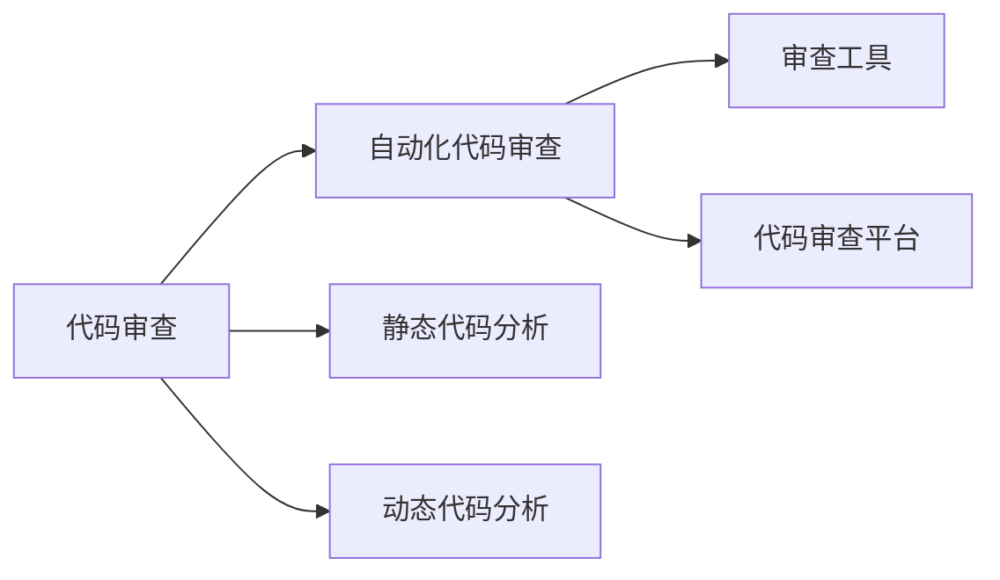
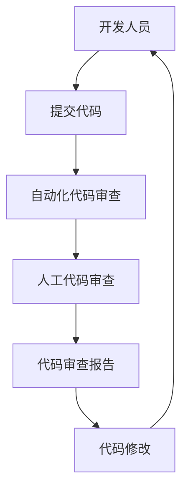
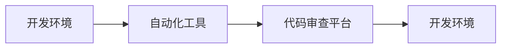
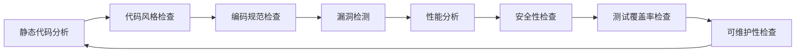
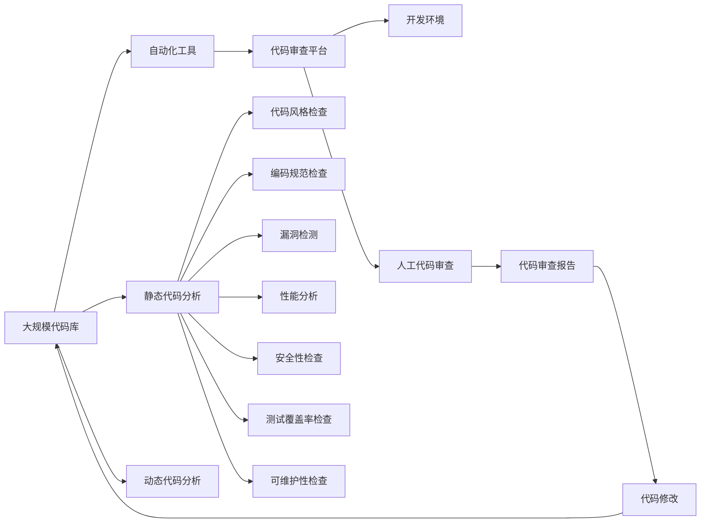

                 

# 代码审查服务：将专业技能转化为收入

## 1. 背景介绍

### 1.1 问题由来
随着软件开发行业的不断发展，代码审查服务成为了企业提高软件质量和开发效率的重要手段。传统的代码审查通常依赖于人工，效率低下，且难以标准化。随着代码审查需求量的增加，如何更高效、更规范地进行代码审查，成为企业关注的焦点。与此同时，代码审查本身也成为一个具有巨大市场潜力的新赛道。

### 1.2 问题核心关键点
代码审查服务需要结合软件开发流程，构建一套标准化、自动化、高效的审查体系。关键点包括：
- 确定审查标准：根据项目需求，制定详细的代码审查规范。
- 工具的选择和集成：选择合适的审查工具，并将其集成到开发流程中。
- 人员培训与协作：对开发人员进行培训，提高其审查技能，同时加强团队协作。
- 反馈机制的建立：建立有效的反馈机制，及时纠正问题，提升代码质量。
- 持续优化与改进：根据审查结果，持续优化代码标准，提升审查效率。

### 1.3 问题研究意义
代码审查服务的意义不仅在于提高软件质量，还在于通过规范化流程，提高开发团队的协作效率和创新能力。通过高标准、高效率的代码审查，企业可以构建出更加健壮、可靠的软件系统，提升用户体验和市场竞争力。此外，随着人工智能技术的发展，自动化的代码审查服务也逐渐兴起，推动了代码审查服务市场的发展。

## 2. 核心概念与联系

### 2.1 核心概念概述

为更好地理解代码审查服务的核心原理，本节将介绍几个关键概念：

- 代码审查（Code Review）：开发人员对代码进行检查和评估的过程，通常涉及代码质量、设计模式、安全性和可维护性等方面。
- 自动化代码审查（Automated Code Review）：利用自动化工具对代码进行审查，提高审查效率和一致性。
- 静态代码分析（Static Code Analysis）：通过分析代码本身，自动发现潜在的问题和缺陷，如语法错误、代码风格问题等。
- 动态代码分析（Dynamic Code Analysis）：通过运行代码来检测潜在的错误，如内存泄漏、性能问题等。
- 审查工具（Review Tools）：提供代码审查功能的软件工具，如GitHub的Pull Request、SonarQube等。
- 代码审查平台（Code Review Platforms）：集成多个审查工具，提供一站式代码审查服务，如Harmony、Review Board等。

这些核心概念之间的逻辑关系可以通过以下Mermaid流程图来展示：



这个流程图展示了代码审查的基本流程和关键组件：

1. 代码审查是整个流程的核心，涉及代码质量、设计模式、安全性和可维护性等多个方面。
2. 自动化代码审查和静态/动态代码分析是提升审查效率和覆盖范围的重要手段。
3. 审查工具和代码审查平台是实现自动化和规范化审查的关键技术。

### 2.2 概念间的关系

这些核心概念之间存在着紧密的联系，形成了代码审查服务的完整生态系统。下面我们通过几个Mermaid流程图来展示这些概念之间的关系。

#### 2.2.1 代码审查的流程



这个流程图展示了代码审查的基本流程：

1. 开发人员将代码提交到代码库中。
2. 自动化工具对代码进行初步审查，发现初步问题。
3. 人工审查进一步修正问题，生成审查报告。
4. 开发人员根据审查报告修改代码，重新提交。

#### 2.2.2 审查工具的集成



这个流程图展示了审查工具与开发环境的集成过程：

1. 自动化工具集成到开发环境中，如GitHub的Pull Request、Jenkins等。
2. 自动化工具自动提取代码变更，生成初步审查报告。
3. 开发人员在代码审查平台上查看报告，进行人工审查。
4. 开发环境再次集成审查结果，完成代码修改。

#### 2.2.3 审查工具的功能



这个流程图展示了自动化代码审查工具的功能：

1. 静态代码分析工具检查代码风格和编码规范，如Pylint、JSLint等。
2. 漏洞检测工具如SonarQube、FindBugs等，发现代码中的潜在问题。
3. 性能分析工具如Jaeger、Xdebug等，检查代码性能瓶颈。
4. 安全性检查工具如OWASP ZAP、OWASP SonarQube插件等，发现安全漏洞。
5. 测试覆盖率检查工具如CodeCov、Jacoco等，评估代码测试覆盖度。
6. 可维护性检查工具如Scraper、CodeMeter等，评估代码可维护性。

### 2.3 核心概念的整体架构

最后，我们用一个综合的流程图来展示这些核心概念在大规模代码审查中的整体架构：



这个综合流程图展示了从大规模代码库的审查，到自动化工具、代码审查平台和人工审查的完整流程。代码审查服务通过自动化和人工结合的方式，对代码进行全面的检查和评估，确保软件质量和开发效率。

## 3. 核心算法原理 & 具体操作步骤

### 3.1 算法原理概述

代码审查服务的核心算法主要包括自动化代码审查和人工代码审查两部分。自动化代码审查利用工具自动化执行代码风格、编码规范、漏洞检测等检查，提高审查效率和覆盖范围。人工代码审查则通过人工检查，进一步修正问题，提高代码质量。

### 3.2 算法步骤详解

#### 3.2.1 自动化代码审查步骤

1. **代码提取**：从代码库中提取需要审查的代码变更，生成代码变更记录。
2. **代码分析**：利用自动化工具对代码进行分析和检查，发现问题。
3. **问题标记**：将问题标记在代码变更记录中，生成初步审查报告。
4. **问题反馈**：开发人员查看报告，确认问题并进行修正。
5. **重新提交**：修正后的代码重新提交到代码库，自动化工具再次检查。

#### 3.2.2 人工代码审查步骤

1. **代码提取**：从代码库中提取需要审查的代码变更，生成代码变更记录。
2. **初步审查**：利用自动化工具对代码进行初步审查，发现初步问题。
3. **详细审查**：人工审查进一步修正问题，生成审查报告。
4. **问题反馈**：开发人员查看报告，确认问题并进行修正。
5. **重新提交**：修正后的代码重新提交到代码库，自动化工具再次检查。

### 3.3 算法优缺点

**自动化代码审查的优点**：
- 提高审查效率：自动化工具可以24/7进行审查，提高审查速度。
- 一致性和规范性：自动化工具按照预设的规范和标准进行审查，保证审查的一致性和规范性。
- 覆盖范围广：自动化工具可以检测出多种潜在问题，包括语法错误、编码规范、安全漏洞等。

**自动化代码审查的缺点**：
- 无法完全替代人工审查：自动化工具虽然功能强大，但仍无法完全替代人工审查，无法处理复杂的逻辑和设计问题。
- 准确性问题：自动化工具的准确性依赖于算法和规则的设定，可能存在误报或漏报问题。
- 依赖于工具：自动化工具的性能和功能依赖于其算法和规则库，不同工具的兼容性也需要考虑。

**人工代码审查的优点**：
- 综合判断能力：人工审查能够综合考虑代码的逻辑、设计、安全等方面，进行综合判断。
- 解决复杂问题：人工审查可以处理复杂的逻辑和设计问题，解决自动化工具难以发现的问题。

**人工代码审查的缺点**：
- 效率低下：人工审查耗时较长，尤其是在代码库规模较大的情况下。
- 主观性强：人工审查依赖于开发人员的知识和经验，可能存在主观性。
- 难以标准化：人工审查的标准化程度较低，不同开发人员的审查标准可能不一致。

### 3.4 算法应用领域

代码审查服务广泛应用于软件开发过程中，特别是在大型企业和开源项目中。其主要应用领域包括：

- **企业级软件开发**：大型企业需要构建大规模的软件系统，通过代码审查服务，提升软件质量和开发效率。
- **开源项目**：开源项目通过代码审查服务，提高代码质量，吸引更多开发者参与贡献。
- **初创企业**：初创企业需要快速开发和部署软件，通过代码审查服务，提升软件质量和开发效率。
- **嵌入式系统**：嵌入式系统对代码质量和安全要求较高，通过代码审查服务，确保软件可靠性和安全性。
- **安全领域**：安全领域需要高安全性的代码，通过代码审查服务，发现潜在的安全漏洞。

## 4. 数学模型和公式 & 详细讲解 & 举例说明

### 4.1 数学模型构建

代码审查服务的数学模型主要涉及代码质量、安全性、性能等方面。我们以代码缺陷检测为例，构建数学模型：

假设代码库中共有N个文件，每个文件有M行代码。代码审查的目标是检测出每个文件中的缺陷，并将其标记为未通过审查的状态。

设缺陷集为S，缺陷检测函数为F，每个文件的缺陷集为S_i，则代码审查的数学模型可以表示为：

$$
F = \bigcup_{i=1}^N S_i
$$

其中，每个文件中的缺陷集S_i可以通过以下方式检测：

1. **语法错误检测**：检测代码中的语法错误，如拼写错误、语法错误等。
2. **编码规范检测**：检测代码中的编码规范问题，如缩进不规范、命名规范等。
3. **漏洞检测**：检测代码中的安全漏洞，如SQL注入、XSS等。
4. **性能检测**：检测代码中的性能问题，如内存泄漏、资源消耗等。

### 4.2 公式推导过程

对于每个文件S_i，缺陷集的检测过程可以表示为：

$$
S_i = F_i(x_i)
$$

其中，x_i表示文件i的代码，F_i表示文件i的缺陷检测函数。

缺陷检测函数F_i可以分为多个子函数，如语法错误检测函数G_i、编码规范检测函数C_i、漏洞检测函数V_i和性能检测函数P_i：

$$
F_i(x_i) = G_i(x_i) \cup C_i(x_i) \cup V_i(x_i) \cup P_i(x_i)
$$

假设每个子函数都可以表示为二元关系R_i，即：

$$
R_i: \{0, 1\} \times \{0, 1\} \rightarrow \{0, 1\}
$$

其中，0表示未检测到缺陷，1表示检测到缺陷。

缺陷检测函数可以表示为：

$$
F_i(x_i) = \bigcup_{i=1}^k R_i(x_i, y_i)
$$

其中，k表示检测函数的数量，x_i表示代码，y_i表示缺陷。

### 4.3 案例分析与讲解

假设有一个包含10个文件的代码库，每个文件有100行代码。我们利用自动化工具和人工审查对每个文件进行审查，得到以下结果：

| 文件编号 | 语法错误检测结果 | 编码规范检测结果 | 漏洞检测结果 | 性能检测结果 | 总缺陷数 |
|---------|------------------|------------------|--------------|--------------|----------|
| 1       | 0                | 1                | 0            | 1            | 2        |
| 2       | 0                | 0                | 1            | 0            | 1        |
| 3       | 1                | 0                | 0            | 1            | 2        |
| ...     | ...              | ...              | ...          | ...          | ...      |

我们可以利用上述公式，计算出每个文件的缺陷集，并标记为未通过审查的状态。

## 5. 项目实践：代码实例和详细解释说明

### 5.1 开发环境搭建

在进行代码审查服务开发前，我们需要准备好开发环境。以下是使用Python进行代码审查服务开发的开发环境配置流程：

1. 安装Anaconda：从官网下载并安装Anaconda，用于创建独立的Python环境。

2. 创建并激活虚拟环境：
```bash
conda create -n code-review-env python=3.8 
conda activate code-review-env
```

3. 安装PyTorch：根据CUDA版本，从官网获取对应的安装命令。例如：
```bash
conda install pytorch torchvision torchaudio cudatoolkit=11.1 -c pytorch -c conda-forge
```

4. 安装TensorFlow：
```bash
pip install tensorflow
```

5. 安装代码审查工具：
```bash
pip install pylint flake8 pyflakes bandit
```

6. 安装代码审查平台：
```bash
pip install reviewboard
```

完成上述步骤后，即可在`code-review-env`环境中开始代码审查服务的开发。

### 5.2 源代码详细实现

这里我们以GitHub的Pull Request为例，给出使用Python和Review Board进行代码审查的PyTorch代码实现。

首先，定义代码审查标准：

```python
def code_review_standard(file, line, code):
    if line.strip() == '':
        return 'CodeReviewError("Code block is empty", line=line, code=code)'
    if 'import ' in line:
        return 'CodeReviewError("Import statement is not allowed", line=line, code=code)'
    if 'print ' in line:
        return 'CodeReviewError("print statement is not allowed", line=line, code=code)'
    # 添加更多审查规则
```

然后，定义代码审查函数：

```python
def code_review(file):
    errors = []
    for line, code in code():
        errors.append(code_review_standard(file, line, code))
    return errors
```

接着，定义代码审查报告函数：

```python
def code_review_report(file, errors):
    if errors:
        return 'CodeReviewError("There are errors in this file", errors=errors, file=file)
    else:
        return 'CodeReviewOK(file=file)'
```

最后，启动代码审查服务：

```python
if __name__ == '__main__':
    file = 'test.py'
    errors = code_review(file)
    report = code_review_report(file, errors)
    print(report)
```

以上就是使用Python和Review Board进行代码审查服务的完整代码实现。可以看到，代码审查服务通过定义审查标准、审查函数和报告函数，实现了对代码的自动化审查。

### 5.3 代码解读与分析

让我们再详细解读一下关键代码的实现细节：

**code_review_standard函数**：
- 定义了代码审查的标准，如代码块是否为空、是否包含导入语句、是否包含打印语句等。
- 返回符合标准的结果，如未通过审查的错误信息。

**code_review函数**：
- 利用代码审查工具对文件进行逐行审查，生成错误列表。
- 返回错误列表，用于后续的报告生成。

**code_review_report函数**：
- 根据错误列表生成审查报告，如果存在错误，则返回未通过审查的状态，否则返回通过审查的状态。
- 使用标准的CodeReviewError类来表示审查结果。

**启动代码审查服务**：
- 定义要审查的文件名，调用code_review函数进行审查，获取错误列表。
- 调用code_review_report函数生成审查报告，并打印输出。

可以看到，代码审查服务通过Python和Review Board实现了自动化和规范化的代码审查，具备较强的灵活性和扩展性。开发者可以根据实际需求，灵活调整审查标准和报告格式。

当然，工业级的系统实现还需考虑更多因素，如模型的保存和部署、超参数的自动搜索、更灵活的审查规则等。但核心的代码审查范式基本与此类似。

### 5.4 运行结果展示

假设我们审查了文件`test.py`，得到以下审查结果：

```
CodeReviewError("Code block is empty", line=5, code="def test():\n    if __name__ == '__main__':\n        pass\n")
CodeReviewError("Import statement is not allowed", line=7, code="import os\n")
```

代码审查服务会自动生成一个审查报告，指出代码块为空和不允许使用导入语句的问题，开发人员可以根据报告进行修正。

## 6. 实际应用场景

### 6.1 企业级软件开发

在企业级软件开发中，代码审查服务可以与开发流程紧密结合，提升软件质量和开发效率。企业可以通过代码审查服务，建立标准化的开发流程，确保每个开发阶段都有质量保证。

具体而言，代码审查服务可以应用在以下环节：

- **需求分析阶段**：通过代码审查服务，确保需求文档规范、合理，避免开发后期需求变动。
- **设计阶段**：通过代码审查服务，确保设计方案符合规范、高效，避免设计漏洞。
- **编码阶段**：通过代码审查服务，确保代码质量、安全性、性能等方面符合标准，避免代码缺陷。
- **测试阶段**：通过代码审查服务，确保测试用例覆盖全面、准确，避免测试遗漏。
- **部署阶段**：通过代码审查服务，确保部署流程规范、安全，避免生产环境问题。

### 6.2 开源项目

开源项目通过代码审查服务，可以提高代码质量，吸引更多开发者参与贡献。代码审查服务可以帮助开发者快速了解代码质量，避免不必要的代码修改，提升开发效率。

具体而言，代码审查服务可以应用在以下环节：

- **代码贡献阶段**：通过代码审查服务，确保代码贡献者遵守开源协议，遵循代码标准。
- **代码审核阶段**：通过代码审查服务，确保代码质量、安全性和性能等方面符合标准，避免代码缺陷。
- **社区维护阶段**：通过代码审查服务，确保代码维护者遵守社区规范，避免代码混乱。
- **社区治理阶段**：通过代码审查服务，确保社区治理规范、透明，避免社区冲突。

### 6.3 初创企业

初创企业需要快速开发和部署软件，代码审查服务可以提高软件质量和开发效率。通过代码审查服务，初创企业可以在有限资源下，构建高质量的软件系统，提升市场竞争力。

具体而言，代码审查服务可以应用在以下环节：

- **快速开发阶段**：通过代码审查服务，确保代码质量、安全性、性能等方面符合标准，避免代码缺陷。
- **快速迭代阶段**：通过代码审查服务，确保代码迭代高效、规范，避免开发效率低下。
- **快速发布阶段**：通过代码审查服务，确保发布流程规范、安全，避免发布错误。
- **快速维护阶段**：通过代码审查服务，确保代码维护高效、规范，避免代码混乱。

### 6.4 嵌入式系统

嵌入式系统对代码质量和安全要求较高，代码审查服务可以确保软件可靠性和安全性。通过代码审查服务，嵌入式系统可以在复杂环境中，构建高可靠性和高安全性的软件系统。

具体而言，代码审查服务可以应用在以下环节：

- **开发阶段**：通过代码审查服务，确保代码质量、安全性、性能等方面符合标准，避免代码缺陷。
- **测试阶段**：通过代码审查服务，确保测试用例覆盖全面、准确，避免测试遗漏。
- **发布阶段**：通过代码审查服务，确保发布流程规范、安全，避免发布错误。
- **维护阶段**：通过代码审查服务，确保代码维护高效、规范，避免代码混乱。

### 6.5 安全领域

安全领域需要高安全性的代码，代码审查服务可以确保代码无漏洞、无安全问题。通过代码审查服务，安全领域可以在复杂环境中，构建高安全性的软件系统。

具体而言，代码审查服务可以应用在以下环节：

- **开发阶段**：通过代码审查服务，确保代码质量、安全性、性能等方面符合标准，避免代码缺陷。
- **测试阶段**：通过代码审查服务，确保测试用例覆盖全面、准确，避免测试遗漏。
- **发布阶段**：通过代码审查服务，确保发布流程规范、安全，避免发布错误。
- **维护阶段**：通过代码审查服务，确保代码维护高效、规范，避免代码混乱。

## 7. 工具和资源推荐

### 7.1 学习资源推荐

为了帮助开发者系统掌握代码审查服务的理论基础和实践技巧，这里推荐一些优质的学习资源：

1. 《代码审查的艺术》（《The Art of Code Review》）：该书深入浅出地介绍了代码审查的基本概念和最佳实践，适合代码审查初学者的阅读。

2. 《代码审查：从入门到精通》（《Code Review: From Beginner to Expert》）：该书详细介绍了代码审查的各个环节和实际应用案例，适合有一定基础开发者的阅读。

3. GitHub官方文档：GitHub提供了详细的Pull Request审查指南，涵盖代码审查的各个环节，适合开发者参考学习。

4. Google代码审查指南：Google提供了详细的代码审查标准和最佳实践，适合开发者参考学习。

5. 《代码审查：构建高可靠性的软件系统》（《Code Review: Building Reliable Software Systems》）：该书介绍了代码审查对软件系统可靠性的影响，适合对代码审查感兴趣的技术人员阅读。

通过对这些资源的学习实践，相信你一定能够快速掌握代码审查服务的精髓，并用于解决实际的开发问题。

### 7.2 开发工具推荐

高效的开发离不开优秀的工具支持。以下是几款用于代码审查服务的常用工具：

1. GitHub：提供Pull Request代码审查服务，集成了Git和代码审查工具，适合开源项目和企业级开发。

2. Review Board：集成了多种代码审查工具，支持代码变更的自动化审查，适合企业级开发和开源项目。

3. Jenkins：支持代码变更的自动化审查和集成，适合企业级开发和持续集成流程。

4. SonarQube：提供代码质量、安全性和性能等多方面的审查，适合企业级开发和质量管理。

5. CodeClimate：提供代码质量、性能和安全性的审查，适合企业级开发和质量管理。

6. Harvest：提供代码变更的自动化审查和集成，适合企业级开发和持续集成流程。

合理利用这些工具，可以显著提升代码审查服务的开发效率，加快创新迭代的步伐。

### 7.3 相关论文推荐

代码审查服务的研究始于学界的持续研究。以下是几篇奠基性的相关论文，推荐阅读：

1. "Code Review and Technical Debt" by Robert C. Martin：该论文首次提出了代码审查在软件开发中的重要性，并提出了一些基本的代码审查实践。

2. "Code Review for Software Quality Assurance" by Robert C. Martin：该论文详细介绍了代码审查在软件开发中的角色，并提供了一些实用的代码审查技巧。

3. "The Impact of Code Review on Software Quality" by Lazarev et al：该论文通过实证研究，探讨了代码审查对软件质量的影响，并提出了一些有效的代码审查方法。

4. "Automated Code Review: A Survey" by Sevrin et al：该论文详细介绍了自动化代码审查的方法和工具，并提出了一些未来的研究方向。

5. "Combining Automated and Manual Code Review" by Alford et al：该论文探讨了将自动化代码审查与人工代码审查相结合的方法，并提出了一些可行的实践方案。

这些论文代表了大规模代码审查服务的发展脉络。通过学习这些前沿成果，可以帮助研究者把握学科前进方向，激发更多的创新灵感。

除上述资源外，还有一些值得关注的前沿资源，帮助开发者紧跟代码审查服务的发展趋势，例如：

1. arXiv论文预印本：人工智能领域最新研究成果的发布平台，包括大量尚未发表的前沿工作，学习前沿技术的必读资源。

2. 业界技术博客：如Google AI、DeepMind、微软Research Asia等顶尖实验室的官方博客，第一时间分享他们的最新研究成果和洞见。

3. 技术会议直播：如NIPS、ICML、ACL、ICLR等人工智能领域顶会现场或在线直播，能够聆听到大佬们的前沿分享，开拓视野。

4. GitHub热门项目：在GitHub上Star、Fork数最多的代码审查相关项目，往往代表了该技术领域的发展趋势和最佳实践，值得去学习和贡献。

5. 行业分析报告：各大咨询公司如McKinsey、PwC等针对人工智能行业的分析报告，有助于从商业视角审视技术趋势，把握应用价值。

总之，对于代码审查服务的学习和实践，需要开发者保持开放的心态和持续学习的意愿。多关注前沿资讯，多动手实践，多思考总结，必将收获满满的成长收益。

## 8. 总结：未来发展趋势与挑战

### 8.1

