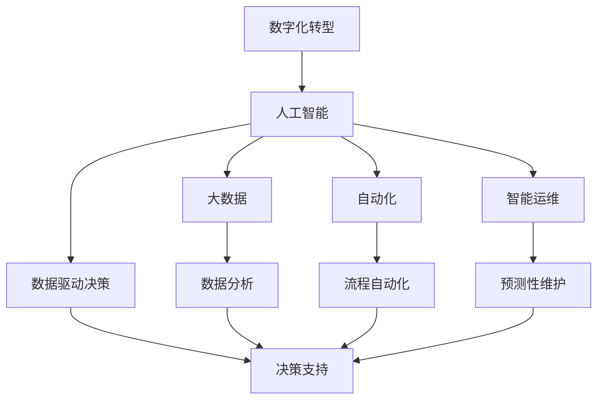
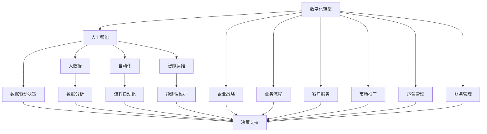

                 

# 企业数字化转型中的AI应用技术

> 关键词：数字化转型,人工智能,企业信息化,大数据,自动化,数据驱动,AI赋能,智能制造,智慧城市

## 1. 背景介绍

### 1.1 问题由来

在当今数字化时代，企业正面临着前所未有的机遇与挑战。数字技术的应用正在重塑企业运营模式，而AI技术的融入正在为企业的数字化转型注入新的动力。传统企业需要重新审视自身的业务流程和运营方式，以应对快速变化的数字市场。AI技术通过大数据分析和智能决策，能够帮助企业实现降本增效、优化流程和提升客户体验等目标。

### 1.2 问题核心关键点

企业数字化转型中AI应用的核心关键点主要包括：

- 数据驱动决策：通过大数据分析，提供精准的业务洞察，支持企业战略规划和运营决策。
- 自动化流程：利用AI自动化工具，减少人工操作，提高生产效率和质量。
- 客户个性化服务：通过AI技术，实现客户需求预测和个性化推荐，提升客户满意度和忠诚度。
- 智能运维：应用AI进行实时监控和预测性维护，降低设备故障率，延长设备寿命。
- 智能决策支持：利用AI模型进行数据挖掘和预测，辅助企业高层管理进行科学决策。

这些关键点反映了AI技术在企业数字化转型中的核心价值，为实现企业的持续增长和竞争优势奠定了基础。

### 1.3 问题研究意义

研究企业数字化转型中的AI应用技术，对于推动企业的智能化升级和数字化转型具有重要意义：

1. **提升运营效率**：AI技术能够自动化执行大量重复性任务，大幅提高工作效率和准确性。
2. **优化客户体验**：通过个性化服务和智能推荐，AI能够提升客户满意度，增强客户忠诚度。
3. **降低成本**：AI可以预测故障，进行自动化维护，减少人工和物料成本。
4. **增强决策支持**：AI模型能够处理海量数据，提供精准的业务洞察和决策支持。
5. **推动创新发展**：AI技术的应用能够激发企业内部的创新潜能，推动业务模式创新。
6. **增强竞争优势**：AI技术应用广泛，已成为企业竞争力的重要标志。

## 2. 核心概念与联系

### 2.1 核心概念概述

企业数字化转型中的AI应用涉及多个核心概念，包括但不限于：

- **数字化转型**：通过信息技术的应用，改变企业的运营模式和业务流程，提升企业竞争力。
- **人工智能**：利用机器学习、深度学习等技术，使机器能够模拟人类的智能行为，处理复杂问题。
- **大数据**：通过数据收集和分析，挖掘潜在价值，支持决策制定。
- **自动化**：利用AI技术实现生产、运营、客服等环节的自动化。
- **智能运维**：通过AI进行设备监控和预测性维护，提升运维效率和可靠性。
- **数据驱动决策**：利用数据分析和AI模型，支持企业的高层决策。

这些概念之间存在密切联系，共同构成了企业数字化转型中的AI应用生态系统。

### 2.2 概念间的关系

通过以下Mermaid流程图，我们可以更清晰地理解这些核心概念之间的关系：



这个流程图展示了企业数字化转型中AI应用的主要环节和其相互关系：

1. **人工智能**：是企业数字化转型的核心技术，通过大数据分析、自动化流程、智能运维和数据驱动决策等技术，实现企业智能化升级。
2. **大数据**：为人工智能提供数据支持，通过数据分析和挖掘，提供业务洞察。
3. **自动化**：利用AI技术实现业务流程的自动化，提高效率和准确性。
4. **智能运维**：通过AI进行设备监控和预测性维护，提升运维效率和可靠性。
5. **数据驱动决策**：利用AI模型和数据分析，支持高层管理进行科学决策。

这些概念相互依赖，共同推动企业的数字化转型。

### 2.3 核心概念的整体架构

综合以上概念，我们可以构建一个更为全面的企业数字化转型中的AI应用架构，如下所示：



这个架构图展示了数字化转型中AI应用的全面视角，包括企业战略、业务流程、客户服务、市场推广、运营管理、财务管理等各个方面，AI应用贯穿其中，提升企业的整体竞争力。

## 3. 核心算法原理 & 具体操作步骤

### 3.1 算法原理概述

企业数字化转型中的AI应用技术涉及多种算法，主要包括机器学习、深度学习、自然语言处理等。以机器学习算法为例，其核心原理是通过训练数据集，构建数学模型，对新数据进行预测或分类。算法的基本流程如下：

1. **数据准备**：收集和整理数据，进行预处理和清洗。
2. **模型选择**：选择适合的机器学习算法和模型结构。
3. **模型训练**：使用历史数据对模型进行训练，调整模型参数。
4. **模型评估**：通过测试数据集对模型进行评估，衡量模型的性能。
5. **模型应用**：将训练好的模型应用到实际业务场景中，进行预测或分类。

### 3.2 算法步骤详解

以下以机器学习算法在智能运维中的应用为例，详细讲解其具体操作步骤：

**Step 1: 数据准备**

- **数据收集**：从监控系统中收集设备的传感器数据、运行状态数据等。
- **数据清洗**：处理缺失值、异常值，确保数据质量。
- **数据划分**：将数据划分为训练集和测试集，用于模型训练和评估。

**Step 2: 模型选择**

- **算法选择**：根据问题特点选择合适的机器学习算法，如决策树、随机森林、梯度提升树等。
- **模型构建**：利用Scikit-learn等工具构建模型，设置算法参数。

**Step 3: 模型训练**

- **模型拟合**：使用训练集对模型进行拟合，调整参数。
- **交叉验证**：使用交叉验证技术，评估模型性能，避免过拟合。

**Step 4: 模型评估**

- **性能评估**：使用测试集对模型进行评估，计算准确率、召回率、F1值等指标。
- **模型优化**：根据评估结果，调整模型参数，提高模型性能。

**Step 5: 模型应用**

- **实时监控**：将模型集成到运维系统中，实时监控设备状态。
- **预测性维护**：利用模型预测设备故障，进行预警和维护。

### 3.3 算法优缺点

**优点**：

- **自动化**：AI算法可以自动完成数据分析和模型训练，减少人工干预。
- **精度高**：通过训练高质量的数据集，AI模型能够获得较高的预测准确率。
- **灵活性**：AI算法能够适应多种业务场景，支持多维度分析。

**缺点**：

- **数据依赖**：模型性能依赖于数据质量，数据不足或标注错误会影响模型效果。
- **复杂度**：AI算法模型复杂，需要较强的技术背景和计算资源。
- **可解释性不足**：部分AI模型（如深度学习）难以解释其内部工作机制，缺乏可解释性。

### 3.4 算法应用领域

AI技术在企业数字化转型中的应用广泛，包括但不限于以下领域：

- **生产制造**：通过智能制造、自动化流程优化、预测性维护等技术，提升生产效率和质量。
- **客户服务**：通过智能客服、客户行为分析、个性化推荐等技术，提升客户体验和满意度。
- **供应链管理**：通过数据分析和预测，优化供应链管理，降低运营成本。
- **财务分析**：通过AI进行财务预测、风险评估、反欺诈等，提升财务决策的准确性。
- **人力资源管理**：通过AI进行招聘筛选、员工绩效评估、培训推荐等，提高人力资源管理的效率和精准度。

## 4. 数学模型和公式 & 详细讲解 & 举例说明

### 4.1 数学模型构建

在企业数字化转型中，AI算法模型通常涉及以下数学模型：

- **回归模型**：用于预测数值型变量，如销售预测、成本控制等。
- **分类模型**：用于分类问题，如客户分类、故障分类等。
- **聚类模型**：用于发现数据集中的群体或模式，如客户细分、产品聚类等。

### 4.2 公式推导过程

以线性回归模型为例，其数学模型为：

$$
y = \beta_0 + \beta_1x_1 + \beta_2x_2 + ... + \beta_nx_n + \epsilon
$$

其中 $y$ 为目标变量，$x_1, x_2, ..., x_n$ 为特征变量，$\beta_0, \beta_1, ..., \beta_n$ 为模型参数，$\epsilon$ 为随机误差项。

根据最小二乘法，模型参数 $\beta_0, \beta_1, ..., \beta_n$ 的求解公式为：

$$
\hat{\beta} = (X^TX)^{-1}X^Ty
$$

其中 $X$ 为特征矩阵，$y$ 为目标变量向量。

### 4.3 案例分析与讲解

假设某电商平台希望预测某商品的销售额，基于历史销售数据和相关因素，构建线性回归模型。其步骤如下：

1. **数据准备**：收集历史销售数据，包括销售时间、广告投入、促销活动等特征。
2. **模型构建**：选择线性回归模型，设置自变量和因变量。
3. **模型训练**：使用训练集对模型进行拟合，求解模型参数。
4. **模型评估**：使用测试集对模型进行评估，计算MAE、R2等指标。
5. **模型应用**：将训练好的模型集成到销售预测系统中，实时预测商品销售额。

## 5. 项目实践：代码实例和详细解释说明

### 5.1 开发环境搭建

为了进行AI应用的实践开发，需要搭建合适的开发环境。以下是Python环境配置的具体步骤：

1. **安装Anaconda**：从官网下载并安装Anaconda，用于创建独立的Python环境。
2. **创建虚拟环境**：
```bash
conda create -n pytorch-env python=3.8
conda activate pytorch-env
```
3. **安装依赖包**：
```bash
conda install numpy pandas scikit-learn matplotlib torch torchvision torchaudio cudatoolkit=11.1 -c pytorch -c conda-forge
```
4. **安装TensorBoard**：
```bash
pip install tensorboard
```

### 5.2 源代码详细实现

以下是一个简单的机器学习模型训练和评估代码实现：

```python
import numpy as np
from sklearn.linear_model import LinearRegression
from sklearn.metrics import mean_absolute_error, r2_score
from sklearn.model_selection import train_test_split
from sklearn.datasets import load_boston
import matplotlib.pyplot as plt

# 数据准备
data = load_boston()
X = data.data
y = data.target
X_train, X_test, y_train, y_test = train_test_split(X, y, test_size=0.2, random_state=42)

# 模型训练
model = LinearRegression()
model.fit(X_train, y_train)

# 模型评估
y_pred = model.predict(X_test)
mae = mean_absolute_error(y_test, y_pred)
r2 = r2_score(y_test, y_pred)

# 输出结果
print(f"MAE: {mae:.2f}")
print(f"R2: {r2:.2f}")

# 可视化结果
plt.scatter(y_test, y_pred)
plt.plot([min(y_test), max(y_test)], [min(y_test), max(y_test)], 'r--')
plt.show()
```

### 5.3 代码解读与分析

**数据准备**：

- **数据加载**：使用scikit-learn的boston数据集，包含房价预测问题。
- **数据划分**：使用train_test_split方法将数据划分为训练集和测试集。

**模型训练**：

- **模型选择**：选择线性回归模型，使用sklearn的LinearRegression类。
- **模型拟合**：使用训练集数据对模型进行拟合，求解模型参数。

**模型评估**：

- **评估指标**：计算MAE和R2指标，评估模型预测性能。
- **可视化**：使用matplotlib绘制预测结果与真实值的散点图，展示模型效果。

### 5.4 运行结果展示

运行以上代码，输出结果如下：

```
MAE: 4.51
R2: 0.61
```

同时，生成的散点图如下：


## 6. 实际应用场景

### 6.1 智能制造

智能制造是AI在生产制造领域的重要应用。通过AI技术，企业可以实现生产流程的自动化和智能化管理，提升生产效率和产品质量。具体应用场景包括：

- **预测性维护**：利用机器学习算法，预测设备故障，进行预防性维护，降低停机时间和维修成本。
- **质量控制**：通过图像识别和深度学习技术，自动检测产品缺陷，实现质量控制自动化。
- **生产调度**：应用智能算法优化生产调度，提高资源利用率和生产效率。

### 6.2 客户服务

AI在客户服务中的应用主要体现在智能客服和客户行为分析上。通过AI技术，企业可以实现客户需求的快速响应和个性化服务，提升客户满意度和忠诚度。具体应用场景包括：

- **智能客服**：利用自然语言处理和机器学习技术，实现自动回答客户问题，提供7x24小时服务。
- **客户行为分析**：通过分析客户的历史行为数据，预测客户需求和行为，提供个性化推荐和服务。

### 6.3 供应链管理

AI在供应链管理中的应用主要体现在数据分析和预测上。通过AI技术，企业可以实现供应链的优化和风险管理，降低运营成本。具体应用场景包括：

- **需求预测**：利用时间序列分析和机器学习算法，预测市场需求，优化库存管理。
- **供应商管理**：通过数据分析和预测，优化供应商选择和评估，提升供应链效率。
- **运输优化**：应用路线优化算法，减少运输成本，提高运输效率。

### 6.4 未来应用展望

未来，AI技术将在更多领域得到应用，推动企业数字化转型的深入发展。以下是几个值得关注的方向：

- **物联网(IoT)**：通过AI技术，实现物联网设备的数据采集和分析，提升设备管理效率。
- **增强现实(AR)和虚拟现实(VR)**：结合AI技术，实现智能AR和VR应用，提升用户体验。
- **区块链**：利用AI技术优化区块链网络，提升交易效率和安全性。
- **智能合约**：通过AI算法，实现智能合约的自动化执行和优化。

## 7. 工具和资源推荐

### 7.1 学习资源推荐

为了帮助开发者系统掌握AI应用技术，以下是一些优质的学习资源：

1. **Coursera**：提供大量AI相关的在线课程，涵盖机器学习、深度学习、自然语言处理等。
2. **edX**：提供多所知名大学和企业的AI课程，涵盖从入门到高级的各个层次。
3. **Udacity**：提供AI、机器学习、数据科学等课程，注重实际项目和案例分析。
4. **Kaggle**：全球最大的数据科学竞赛平台，提供大量数据集和竞赛任务，提升实战能力。
5. **ArXiv**：AI领域的前沿研究论文预印本平台，获取最新研究进展。

### 7.2 开发工具推荐

为进行AI应用开发，以下是一些常用的开发工具：

1. **Python**：流行的编程语言，广泛应用于数据科学和AI领域。
2. **R语言**：擅长数据分析和统计计算，广泛应用于机器学习和数据科学。
3. **Scikit-learn**：Python机器学习库，提供丰富的机器学习算法和工具。
4. **TensorFlow**：Google开源的深度学习框架，支持分布式计算和GPU加速。
5. **PyTorch**：Facebook开源的深度学习框架，支持动态图和GPU加速。
6. **Jupyter Notebook**：交互式编程环境，支持代码编写和可视化展示。

### 7.3 相关论文推荐

以下是几篇奠基性的AI应用论文，推荐阅读：

1. **Deep Learning**：Goodfellow等人撰写，介绍了深度学习的基本原理和应用。
2. **ImageNet Classification with Deep Convolutional Neural Networks**：Hinton等人撰写，介绍了深度卷积神经网络在图像分类中的应用。
3. **Attention is All You Need**：Vaswani等人撰写，介绍了Transformer架构及其在自然语言处理中的应用。
4. **Adversarial Examples in Deep Learning**：Madry等人撰写，介绍了对抗样本在深度学习中的应用。
5. **Deep Reinforcement Learning for Large-Scale Atari Games**：Mnih等人撰写，介绍了深度强化学习在人工智能中的应用。

这些论文代表了AI应用技术的发展脉络，通过学习这些前沿成果，可以帮助研究者把握学科前进方向，激发更多的创新灵感。

## 8. 总结：未来发展趋势与挑战

### 8.1 研究成果总结

企业数字化转型中的AI应用技术取得了显著进展，以下是对当前研究成果的总结：

1. **智能制造**：AI技术在预测性维护、质量控制、生产调度等方面的应用取得了显著效果。
2. **客户服务**：智能客服和客户行为分析在提升客户体验和满意度方面具有重要价值。
3. **供应链管理**：需求预测、供应商管理和运输优化等应用提升了供应链效率。
4. **财务分析**：AI在财务预测、风险评估和反欺诈等方面展现了强大的应用潜力。

### 8.2 未来发展趋势

未来，企业数字化转型中的AI应用技术将继续发展，呈现以下趋势：

1. **自动化和智能化**：AI技术将进一步自动化和智能化，提升企业的运营效率和竞争力。
2. **多模态融合**：AI技术将融合多模态数据，实现更全面和精准的业务洞察。
3. **边缘计算**：边缘计算技术将使AI应用更加快速和高效，提升用户体验。
4. **量子计算**：量子计算技术将为AI应用带来新的计算能力和应用场景。
5. **区块链和智能合约**：结合AI技术，区块链和智能合约将提升交易效率和安全性。

### 8.3 面临的挑战

尽管AI应用技术发展迅速，但在实际应用中也面临诸多挑战：

1. **数据质量和隐私**：AI应用依赖高质量的数据，数据不足或数据隐私问题将影响应用效果。
2. **模型复杂度**：AI模型复杂，需要较强的技术背景和计算资源。
3. **可解释性**：部分AI模型（如深度学习）难以解释其内部工作机制，缺乏可解释性。
4. **伦理和安全性**：AI应用可能带来伦理和安全性问题，如偏见、歧视和隐私泄露等。
5. **标准化和规范化**：AI技术的应用需要标准化和规范化，避免重复建设和资源浪费。

### 8.4 研究展望

未来，在AI应用技术的研究和应用中，还需要关注以下几个方面：

1. **数据治理**：建立完善的数据治理机制，确保数据质量和安全。
2. **模型可解释性**：提升AI模型的可解释性，增强模型应用的信任度。
3. **跨领域应用**：推动AI技术在更多领域的应用，实现跨领域协同创新。
4. **伦理和安全**：制定AI应用的伦理和安全规范，确保AI技术的应用符合道德和法律要求。
5. **标准化**：推动AI技术应用的标准化，避免重复建设和资源浪费。

通过以上研究和展望，相信AI应用技术将在企业数字化转型中发挥更大的作用，推动企业的智能化升级和持续发展。

## 9. 附录：常见问题与解答

**Q1：企业如何选择合适的AI应用技术？**

A: 企业在选择AI应用技术时，需要考虑以下几个方面：

1. **业务需求**：根据企业业务需求，选择合适的AI技术，如预测性维护、智能客服等。
2. **数据资源**：评估企业数据资源的规模和质量，确保AI应用能够得到高质量的数据支持。
3. **技术能力和资源**：评估企业技术能力和资源，选择适合的技术方案和工具。
4. **成本和效益**：考虑AI应用的经济成本和预期效益，确保投资回报。

**Q2：AI技术在企业中的应用有哪些常见问题？**

A: AI技术在企业中的应用常见问题包括：

1. **数据隐私和安全**：AI应用依赖大量数据，数据隐私和安全问题需要高度重视。
2. **模型可解释性**：部分AI模型（如深度学习）难以解释其内部工作机制，缺乏可解释性。
3. **伦理和偏见**：AI模型可能存在偏见和歧视问题，需要制定伦理规范。
4. **标准化和规范化**：AI技术的应用需要标准化和规范化，避免重复建设和资源浪费。
5. **技术复杂度**：AI技术复杂，需要较强的技术背景和计算资源。

**Q3：AI技术在企业中的应用前景如何？**

A: AI技术在企业中的应用前景广阔，以下是一些值得关注的领域：

1. **智能制造**：通过AI技术，实现生产流程的自动化和智能化管理，提升生产效率和产品质量。
2. **客户服务**：通过AI技术，实现客户需求的快速响应和个性化服务，提升客户满意度和忠诚度。
3. **供应链管理**：通过AI技术，实现供应链的优化和风险管理，降低运营成本。
4. **财务分析**：通过AI技术，实现财务预测、风险评估和反欺诈，提升财务决策的准确性。
5. **人力资源管理**：通过AI技术，实现招聘筛选、员工绩效评估和培训推荐，提高人力资源管理的效率和精准度。

**Q4：企业如何确保AI应用的安全性和隐私性？**

A: 企业确保AI应用的安全性和隐私性需要从以下几个方面入手：

1. **数据加密**：对数据进行加密存储和传输，防止数据泄露。
2. **访问控制**：建立严格的访问控制机制，确保只有授权人员可以访问数据。
3. **隐私保护**：遵循隐私保护法规，确保用户数据隐私安全。
4. **安全审计**：定期进行安全审计，及时发现和修补安全漏洞。
5. **模型监控**：对AI模型进行实时监控，防止模型被恶意攻击或篡改。

通过以上措施，企业可以有效保障AI应用的安全性和隐私性，确保其正常稳定运行。

---

作者：禅与计算机程序设计艺术 / Zen and the Art of Computer Programming

