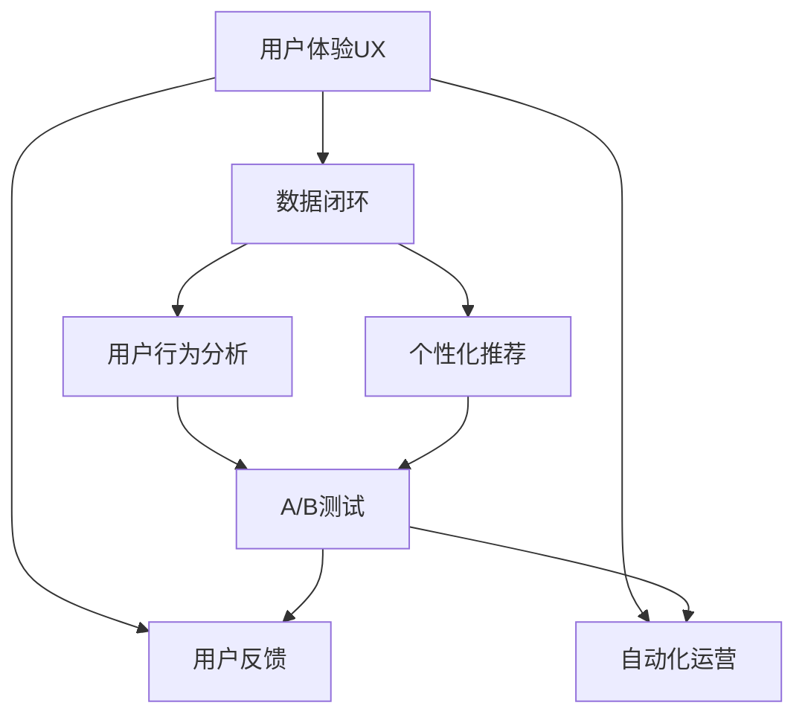
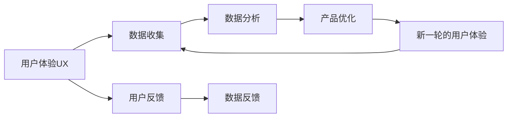
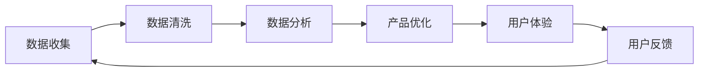
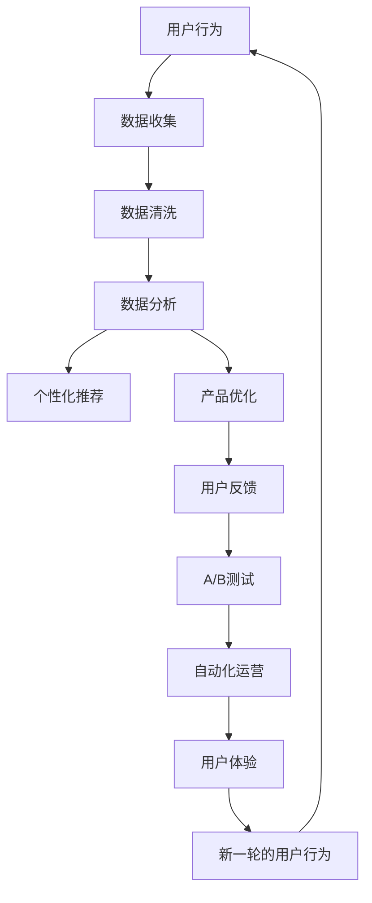

                 

# 优化用户体验与数据闭环

## 1. 背景介绍

### 1.1 问题由来
在当今数字化时代，用户体验（UX）和数据闭环（data loop）已经成为产品设计和运营的核心考量。好的用户体验能够吸引用户、增加留存率，而高效的数据闭环则可以驱动持续的产品优化和创新。如何在设计和技术层面实现用户与数据之间的无缝连接，提升用户体验并优化数据闭环，是当前产品设计和运营的挑战。

### 1.2 问题核心关键点
优化用户体验与数据闭环的核心在于将用户行为数据转化为指导产品迭代和优化的依据。通过数据分析和用户反馈，不断改进产品功能和界面，从而提升用户体验，同时实现数据的高效利用和闭环反馈，不断迭代优化产品性能。

### 1.3 问题研究意义
研究优化用户体验与数据闭环的方法，对于提升产品竞争力、驱动持续创新具有重要意义：

1. **提升用户满意度**：通过深入理解用户需求和行为，优化产品功能，提升用户满意度和忠诚度。
2. **加速产品迭代**：利用数据驱动的决策，加速产品功能和界面的优化，快速响应用户反馈。
3. **降低运营成本**：通过数据分析预测用户行为，减少无效流量，提升用户留存和转化率，降低运营成本。
4. **增强创新能力**：通过数据闭环反馈机制，不断收集用户反馈和市场需求，激发产品创新。
5. **赋能业务升级**：通过优化用户体验和数据闭环，加速业务数字化转型，提升业务效率和竞争力。

## 2. 核心概念与联系

### 2.1 核心概念概述

为更好地理解优化用户体验与数据闭环的方法，本节将介绍几个密切相关的核心概念：

- **用户体验（UX）**：指用户与产品互动的整个过程，包括产品的易用性、视觉设计、交互逻辑等多个方面。
- **数据闭环（Data Loop）**：指数据收集、分析和应用的过程，通过不断迭代优化产品功能，提升用户体验，实现数据驱动的持续优化。
- **用户行为分析（User Behavior Analysis）**：通过分析用户在产品中的行为数据，了解用户需求和行为模式，优化产品功能。
- **个性化推荐（Personalized Recommendation）**：根据用户的历史行为和偏好，提供个性化的产品推荐，提升用户满意度和粘性。
- **A/B测试（A/B Testing）**：通过对比两个或多个版本的产品或功能，评估哪个版本更优，指导产品优化。
- **用户反馈（User Feedback）**：收集用户对产品的意见和建议，反馈到产品设计和开发中，提升产品质量和用户体验。
- **自动化运营（Automated Operation）**：利用技术手段自动化产品运营过程，提升运营效率和效果。

这些核心概念之间的逻辑关系可以通过以下Mermaid流程图来展示：



这个流程图展示了用户体验与数据闭环之间的关系，以及其中几个核心概念的作用：

1. 用户行为分析帮助理解用户需求和行为模式。
2. 个性化推荐根据用户行为数据提供个性化服务。
3. A/B测试评估不同产品版本的效果，指导产品优化。
4. 用户反馈收集用户意见，优化产品功能。
5. 自动化运营提升运营效率，实现数据闭环的自动化。

### 2.2 概念间的关系

这些核心概念之间存在着紧密的联系，形成了优化用户体验与数据闭环的完整生态系统。下面我们通过几个Mermaid流程图来展示这些概念之间的关系。

#### 2.2.1 用户体验与数据闭环的交互关系



这个流程图展示了用户体验与数据闭环的交互关系：

1. 用户在使用产品时产生行为数据，被收集和分析。
2. 根据分析结果优化产品功能，提供更好的用户体验。
3. 用户反馈继续影响产品的优化方向。
4. 通过不断迭代，实现数据闭环的自动化和优化。

#### 2.2.2 数据闭环的核心组件



这个流程图展示了数据闭环的核心组件及其作用：

1. 数据收集：获取用户行为数据，为后续分析提供基础。
2. 数据清洗：处理数据中的噪声和异常值，提高数据分析质量。
3. 数据分析：分析用户行为数据，了解用户需求和行为模式。
4. 产品优化：根据分析结果，优化产品功能和界面。
5. 用户体验：用户使用产品，产生新的数据，继续闭环。

### 2.3 核心概念的整体架构

最后，我们用一个综合的流程图来展示这些核心概念在大用户体验与数据闭环中的整体架构：



这个综合流程图展示了从用户行为数据到用户体验的完整闭环过程：

1. 用户行为数据被收集和清洗。
2. 数据分析了解用户需求和行为模式。
3. 个性化推荐和产品优化提升用户体验。
4. 用户反馈进一步优化产品。
5. A/B测试评估不同版本的效果，指导产品优化。
6. 自动化运营提升运营效率，实现数据闭环的自动化。
7. 通过不断迭代，实现用户体验的提升和数据闭环的优化。

## 3. 核心算法原理 & 具体操作步骤

### 3.1 算法原理概述

优化用户体验与数据闭环的实现，主要基于数据驱动的产品优化和个性化推荐技术。其核心思想是通过分析用户行为数据，了解用户需求和行为模式，据此优化产品功能和界面，同时实现个性化推荐，提升用户满意度和粘性。

形式化地，假设用户行为数据集为 $D=\{(x_i, y_i)\}_{i=1}^N$，其中 $x_i$ 表示用户行为数据，$y_i$ 表示用户的满意度或行为标签。优化用户体验与数据闭环的目标是最大化用户满意度，即：

$$
\hat{y}=\mathop{\arg\max}_{y} \sum_{i=1}^N p(x_i, y_i) \log(y)
$$

其中 $p(x_i, y_i)$ 为数据 $(x_i, y_i)$ 的概率分布，通过数据驱动的优化方法（如最大似然估计）求取。

### 3.2 算法步骤详解

基于数据驱动的产品优化和个性化推荐，优化用户体验与数据闭环一般包括以下几个关键步骤：

**Step 1: 准备数据集和工具**

- 收集用户行为数据，包括但不限于点击、浏览、购买、评分等行为。
- 选择合适的数据分析工具，如Google Analytics、Mixpanel、Amplitude等。
- 准备基础模型，如线性回归、逻辑回归、决策树、随机森林等。

**Step 2: 数据预处理与特征工程**

- 对数据进行清洗、去重、去噪等预处理步骤。
- 设计特征工程，提取有意义的特征，如用户行为模式、历史偏好等。
- 利用特征工程提升模型的泛化能力。

**Step 3: 建立模型并进行训练**

- 选择合适的模型，如协同过滤、深度神经网络等。
- 根据模型特点，选择合适的优化算法和超参数。
- 使用交叉验证等技术，对模型进行训练和调优。

**Step 4: 模型评估与优化**

- 在验证集上评估模型的性能，如准确率、召回率、F1分数等。
- 根据评估结果，优化模型结构、特征选择等。
- 使用A/B测试等技术，验证模型的效果。

**Step 5: 产品优化与个性化推荐**

- 根据模型预测结果，优化产品功能和界面。
- 实现个性化推荐，提升用户体验。
- 结合用户反馈，进一步优化模型和产品。

**Step 6: 数据闭环反馈**

- 收集用户反馈，进行数据分析，发现问题。
- 将反馈信息反馈到产品优化中，形成数据闭环。
- 持续迭代，优化用户体验和数据闭环。

### 3.3 算法优缺点

基于数据驱动的产品优化和个性化推荐，优化用户体验与数据闭环的方法具有以下优点：

1. **数据驱动**：通过分析用户行为数据，了解用户需求和行为模式，指导产品优化。
2. **个性化推荐**：根据用户历史行为和偏好，提供个性化的推荐，提升用户满意度和粘性。
3. **灵活高效**：使用A/B测试等技术，快速验证产品优化效果，提升运营效率。
4. **持续优化**：通过数据闭环反馈机制，不断收集用户反馈，持续优化产品。

同时，该方法也存在以下缺点：

1. **数据隐私问题**：收集和分析用户行为数据，可能会涉及用户隐私，需要严格遵守数据保护法规。
2. **模型复杂度**：复杂的数据分析和模型训练过程，可能对技术要求较高。
3. **计算资源消耗**：大规模数据集和复杂模型的训练，需要较高的计算资源和时间成本。
4. **模型偏差**：模型的预测结果可能存在偏差，需要持续优化和校准。

### 3.4 算法应用领域

基于数据驱动的产品优化和个性化推荐，优化用户体验与数据闭环的方法在多个领域得到了广泛应用，例如：

- **电商推荐**：通过分析用户购买行为和偏好，提供个性化的商品推荐，提升用户购买转化率。
- **内容平台**：如新闻、视频、音乐等平台，通过分析用户行为数据，提供个性化的内容推荐，提升用户粘性和留存率。
- **社交网络**：通过分析用户互动数据，优化产品功能和界面，提升用户互动体验。
- **金融产品**：如保险、理财、贷款等，通过分析用户行为和信用数据，提供个性化的金融产品推荐，提升用户体验和转化率。

除了上述这些常见领域，优化用户体验与数据闭环的方法还可以应用于更多场景中，如健康医疗、教育培训、旅游服务等，为产品设计和运营提供有力支持。

## 4. 数学模型和公式 & 详细讲解  
### 4.1 数学模型构建

本节将使用数学语言对基于数据驱动的产品优化和个性化推荐方法进行更加严格的刻画。

记用户行为数据集为 $D=\{(x_i, y_i)\}_{i=1}^N$，其中 $x_i$ 表示用户行为数据，$y_i$ 表示用户的满意度或行为标签。优化用户体验与数据闭环的目标是最大化用户满意度，即：

$$
\hat{y}=\mathop{\arg\max}_{y} \sum_{i=1}^N p(x_i, y_i) \log(y)
$$

其中 $p(x_i, y_i)$ 为数据 $(x_i, y_i)$ 的概率分布，通过数据驱动的优化方法（如最大似然估计）求取。

假设用户行为数据 $x_i$ 是稀疏向量，每个维度表示一种行为特征，记为 $x_{i,k}$。用户满意度 $y_i$ 可以表示为：

$$
y_i = \sum_{k=1}^K \alpha_k x_{i,k}
$$

其中 $\alpha_k$ 为特征系数，$K$ 为特征总数。

根据最大似然估计原理，最大化用户满意度的目标可以转化为：

$$
\hat{y} = \mathop{\arg\max}_{y} \sum_{i=1}^N p(x_i, y_i) \log(y) = \mathop{\arg\max}_{y} \sum_{i=1}^N \prod_{k=1}^K y_i^{p(x_{i,k}, y_i)}
$$

通过求解上式，可以得到最优的特征系数 $\alpha_k$。

### 4.2 公式推导过程

以下我们以协同过滤算法为例，推导协同过滤模型的数学公式。

假设用户行为矩阵为 $R_{n\times m}$，其中 $n$ 为用户数，$m$ 为商品数。协同过滤模型的目标是预测用户对商品的评分，即最大化以下目标函数：

$$
\hat{y}_{u,i} = \mathop{\arg\max}_{y} \sum_{i=1}^{m} p(y_{u,i}, y_{u,i}) \log(y_{u,i})
$$

其中 $p(y_{u,i}, y_{u,i})$ 表示用户 $u$ 对商品 $i$ 的评分分布，可以通过历史评分数据求取。

利用矩阵分解技术，可以将评分矩阵 $R$ 分解为两个低维矩阵的乘积：

$$
R = \tilde{P} \tilde{Q}
$$

其中 $\tilde{P}$ 为 $n \times k$ 用户矩阵，$\tilde{Q}$ 为 $m \times k$ 商品矩阵。通过矩阵分解，可以求解最优的用户和商品矩阵：

$$
\tilde{P} = U \Gamma, \tilde{Q} = V \Delta
$$

其中 $U$ 为 $n \times k$ 用户矩阵，$V$ 为 $m \times k$ 商品矩阵，$\Gamma$ 和 $\Delta$ 为 $k \times 1$ 向量，$k$ 为分解后的特征维度。

通过求解上述矩阵分解问题，可以得到最优的用户和商品矩阵，进而预测用户对商品的评分：

$$
\hat{y}_{u,i} = \sum_{j=1}^k U_{u,j} \cdot V_{i,j}
$$

### 4.3 案例分析与讲解

假设我们有一份电商平台的用户行为数据，包含用户的浏览、购买、评分等行为。我们可以使用协同过滤算法，对用户对商品的评分进行预测，并提供个性化的推荐。具体步骤如下：

1. 收集用户行为数据，包括用户的浏览记录、购买记录和评分记录。
2. 对数据进行预处理，去除噪声和异常值，处理稀疏矩阵。
3. 使用矩阵分解技术，将评分矩阵分解为用户矩阵和商品矩阵。
4. 根据用户矩阵和商品矩阵，预测用户对商品的评分。
5. 根据评分预测结果，对用户进行个性化推荐。

假设用户 $u=1$ 对商品 $i=2$ 的评分 $y_{1,2}$ 未知，我们可以使用协同过滤算法，通过以下公式进行预测：

$$
\hat{y}_{1,2} = \sum_{j=1}^k U_{1,j} \cdot V_{2,j}
$$

其中 $U$ 和 $V$ 分别为用户矩阵和商品矩阵。

## 5. 项目实践：代码实例和详细解释说明
### 5.1 开发环境搭建

在进行优化用户体验与数据闭环的实践前，我们需要准备好开发环境。以下是使用Python进行PyTorch开发的环境配置流程：

1. 安装Anaconda：从官网下载并安装Anaconda，用于创建独立的Python环境。

2. 创建并激活虚拟环境：
```bash
conda create -n pytorch-env python=3.8 
conda activate pytorch-env
```

3. 安装PyTorch：根据CUDA版本，从官网获取对应的安装命令。例如：
```bash
conda install pytorch torchvision torchaudio cudatoolkit=11.1 -c pytorch -c conda-forge
```

4. 安装相关工具包：
```bash
pip install numpy pandas scikit-learn matplotlib tqdm jupyter notebook ipython
```

完成上述步骤后，即可在`pytorch-env`环境中开始实践。

### 5.2 源代码详细实现

下面我们以协同过滤算法为例，给出使用PyTorch对用户行为数据进行分析和推荐预测的代码实现。

首先，定义用户行为数据的处理函数：

```python
import numpy as np
import pandas as pd
import torch
from torch import nn, optim
from sklearn.decomposition import NMF

def process_data(data):
    # 处理稀疏矩阵
    data = data.astype(np.float64)
    data = data.toarray()
    data[data < 0] = 0
    
    # 对用户行为数据进行标准化处理
    data_mean = np.mean(data, axis=0)
    data_std = np.std(data, axis=0)
    data = (data - data_mean) / data_std
    
    return data

def train_model(data):
    # 将用户行为矩阵分解为两个低维矩阵
    user_matrix = np.dot(data, np.random.normal(size=(data.shape[0], 10)))
    item_matrix = np.dot(data.T, np.random.normal(size=(data.shape[1], 10)))
    
    # 定义协同过滤模型
    user_matrix_tensor = torch.tensor(user_matrix, dtype=torch.float32)
    item_matrix_tensor = torch.tensor(item_matrix, dtype=torch.float32)
    user_matrix_tensor.requires_grad = True
    item_matrix_tensor.requires_grad = True
    
    # 定义损失函数和优化器
    criterion = nn.MSELoss()
    optimizer = optim.Adam([user_matrix_tensor, item_matrix_tensor], lr=0.01)
    
    # 训练模型
    for epoch in range(100):
        optimizer.zero_grad()
        predicted_ratings = user_matrix_tensor @ item_matrix_tensor
        loss = criterion(predicted_ratings, data)
        loss.backward()
        optimizer.step()
        print(f'Epoch {epoch+1}, loss: {loss.item()}')
        
    # 预测用户评分
    user_matrix_tensor.requires_grad = False
    item_matrix_tensor.requires_grad = False
    predicted_ratings = user_matrix_tensor @ item_matrix_tensor
    return predicted_ratings
```

然后，定义用户行为数据的预处理函数：

```python
def preprocess_data(data):
    # 将数据转换为用户行为矩阵
    data = data.groupby('user_id').mean().reset_index()
    data = pd.pivot_table(data, values='rating', index='user_id', columns='item_id', aggfunc=np.mean)
    
    # 对矩阵进行标准化处理
    data_mean = data.mean()
    data_std = data.std()
    data = (data - data_mean) / data_std
    
    # 将矩阵转换为稀疏矩阵
    data = data.to_sparse()
    
    return data
```

最后，使用预处理后的用户行为数据进行模型训练和推荐预测：

```python
# 读取用户行为数据
data = pd.read_csv('ratings.csv')

# 预处理数据
data = preprocess_data(data)

# 将数据转换为稀疏矩阵
data = data.tocoo()

# 处理数据
data = process_data(data)

# 训练模型
predicted_ratings = train_model(data)

# 输出预测结果
print(predicted_ratings)
```

以上就是使用PyTorch对用户行为数据进行分析和推荐预测的完整代码实现。可以看到，通过协同过滤算法，我们可以根据用户历史行为数据，预测其对商品的评分，并提供个性化的推荐。

### 5.3 代码解读与分析

让我们再详细解读一下关键代码的实现细节：

**process_data函数**：
- 处理稀疏矩阵，对用户行为数据进行标准化处理。

**train_model函数**：
- 使用矩阵分解技术，将评分矩阵分解为两个低维矩阵。
- 定义协同过滤模型，包括用户矩阵和商品矩阵，并设置损失函数和优化器。
- 训练模型，通过反向传播更新矩阵参数。

**preprocess_data函数**：
- 将数据转换为用户行为矩阵，对矩阵进行标准化处理。
- 将矩阵转换为稀疏矩阵，方便后续计算。

**代码实现**：
- 读取用户行为数据，并进行预处理。
- 将数据转换为稀疏矩阵，处理数据。
- 训练模型，输出预测结果。

通过上述代码实现，我们可以看到，使用协同过滤算法进行个性化推荐，只需要将用户行为数据转换为矩阵，并使用矩阵分解技术，即可实现高效的推荐预测。

## 6. 实际应用场景

### 6.1 电商平台

在电商平台中，通过分析用户行为数据，可以实现以下功能：

- **个性化推荐**：根据用户浏览、购买、评分等行为数据，提供个性化的商品推荐，提升用户购买转化率。
- **用户画像构建**：通过分析用户行为数据，构建用户画像，了解用户兴趣和偏好，提升用户体验。
- **流量分析**：通过分析用户行为数据，了解用户流量来源和行为路径，优化产品功能和界面。

例如，电商平台的推荐系统可以基于协同过滤算法，根据用户历史购买记录和浏览行为，推荐相似的商品，提升用户购物体验。

### 6.2 内容平台

内容平台如新闻、视频、音乐等，可以通过分析用户行为数据，实现以下功能：

- **内容推荐**：根据用户行为数据，提供个性化的内容推荐，提升用户粘性和留存率。
- **内容优化**：通过分析用户行为数据，优化内容质量和呈现方式，提升用户互动体验。

例如，视频平台可以基于协同过滤算法，根据用户历史观看记录和评分，推荐相似的视频内容，提升用户观看体验。

### 6.3 社交网络

社交网络可以通过分析用户行为数据，实现以下功能：

- **好友推荐**：根据用户互动数据，推荐可能感兴趣的好友，提升用户互动体验。
- **内容优化**：通过分析用户互动数据，优化内容质量和呈现方式，提升用户互动体验。

例如，社交网络可以基于协同过滤算法，根据用户互动数据，推荐可能感兴趣的好友和内容，提升用户互动体验。

### 6.4 金融产品

金融产品如保险、理财、贷款等，可以通过分析用户行为和信用数据，实现以下功能：

- **个性化推荐**：根据用户行为和信用数据，提供个性化的金融产品推荐，提升用户体验和转化率。
- **风险评估**：通过分析用户行为和信用数据，评估用户风险，优化贷款审批流程。

例如，保险公司可以基于协同过滤算法，根据用户历史投保记录和行为数据，推荐合适的保险产品，提升用户投保体验。

## 7. 工具和资源推荐
### 7.1 学习资源推荐

为了帮助开发者系统掌握优化用户体验与数据闭环的理论基础和实践技巧，这里推荐一些优质的学习资源：

1. **《推荐系统实战》**：这是一本系统介绍推荐系统的经典书籍，涵盖了协同过滤、内容推荐、个性化推荐等多个主题，是推荐系统领域不可多得的参考资料。

2. **《Python推荐系统》**：这是一本深入浅出介绍推荐系统的Python实战书籍，详细讲解了协同过滤、矩阵分解、深度学习等多种推荐技术。

3. **《个性化推荐算法》**：这是一本介绍个性化推荐算法的系统教材，涵盖协同过滤、矩阵分解、深度学习等多种推荐技术，适合深入学习。

4. **《深度学习实战》**：这是一本系统介绍深度学习的实战书籍，详细讲解了深度学习的基本原理和实际应用，包括推荐系统、图像识别等多个领域。

5. **《推荐系统》**：这是一门由斯坦福大学开设的在线课程，讲解了推荐系统的基本原理和实际应用，适合初学者学习。

通过对这些资源的学习实践，相信你一定能够快速掌握优化用户体验与数据闭环的精髓，并用于解决实际的NLP问题。

### 7.2 开发工具推荐

高效的开发离不开优秀的工具支持。以下是几款用于优化用户体验与数据闭环开发的常用工具：

1. **Python**：Python是推荐系统领域的主要编程语言，具有易读易写、库资源丰富的特点，适合推荐系统开发。

2. **PyTorch**：基于Python的深度学习框架，灵活动态的计算图，适合推荐系统模型训练和优化。

3. **TensorFlow**：由Google主导开发的深度学习框架，生产部署方便，适合推荐系统模型训练和优化。

4. **Scikit-learn**：Python的机器学习库，提供了丰富的数据处理和模型优化工具，适合推荐系统特征工程和模型评估。

5. **Jupyter Notebook**：Python的Jupyter Notebook环境，支持代码编写、可视化展示和协作开发，适合推荐系统研究和学习。

6. **Mixpanel**：数据分析工具，适合收集和分析用户行为数据，了解用户需求和行为模式。

7. **Google Analytics**：数据分析工具，适合收集和分析用户行为数据，了解用户流量来源和行为路径。

合理利用这些工具，可以显著提升优化用户体验与数据闭环的开发效率，加快创新迭代的步伐。

### 7.3 相关论文推荐

优化用户体验与数据闭环的研究源于学界的持续研究。以下是几篇奠基性的相关论文，推荐阅读：

1. **《推荐系统的协同过滤方法》**：提出了协同过滤算法的基本原理，为推荐系统的发展奠定了基础。

2. **《基于深度学习的推荐系统》**：介绍了深度学习在推荐系统中的应用，展示了深度学习提升推荐系统性能的潜力。

3. **《多臂老虎机算法》**：介绍了多臂老虎机算法在推荐系统中的应用，展示了多臂老虎机算法优化推荐系统效果的能力。

4. **《个性化推荐系统的评价指标》**：介绍了个性化推荐系统的评价指标，包括准确率、召回率、F1分数等，适合推荐系统模型评估。

5. **《深度学习推荐系统》**：介绍了深度学习在推荐系统中的应用，展示了深度学习提升推荐系统性能

