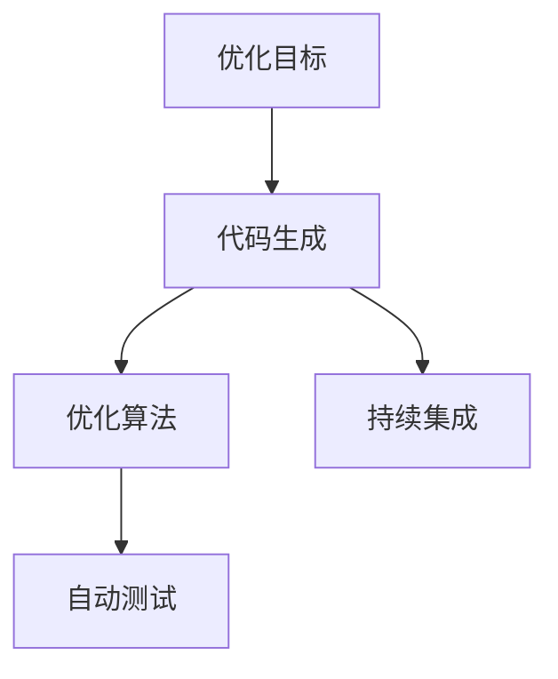
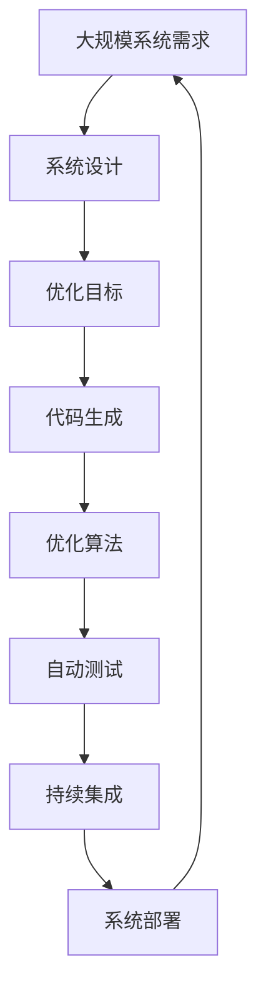

                 

# 优化目标驱动的编程：软件2.0的核心思想

在软件开发的演进历程中，从1.0时代的结构化编程到2.0时代的面向对象编程，再到3.0时代的面向服务编程，每一次技术的变革，都极大提升了软件的灵活性、可维护性和开发效率。然而，当软件开发进入4.0时代，即人工智能和大数据驱动的软件智能化时，我们意识到，仅仅依赖传统的编程范式，已难以满足当前复杂多变的应用场景需求。因此，本文旨在探讨优化目标驱动的编程方法，以期为软件2.0时代带来新的突破。

## 1. 背景介绍

### 1.1 问题由来

现代软件开发已不再是一个简单的技术问题，而是一个复杂的工程问题。在复杂的业务场景下，传统的编程范式显得力不从心。无论是面向过程的编程，还是面向对象的编程，在处理大规模数据和高并发需求时，都面临着诸多挑战。以大型企业为例，传统软件系统复杂度高、扩展性差、维护成本高，难以适应快速变化的市场需求。

### 1.2 问题核心关键点

为应对上述挑战，软件开发需要引入新的思路和工具。优化目标驱动的编程方法正是针对这些问题，通过明确优化目标，自动化代码生成，显著提高软件的开发效率和质量。这种编程方法的核心思想是：

1. **明确优化目标**：在开发过程中，明确软件的性能、安全、可靠性等优化目标，以便后续代码生成有明确方向。
2. **自动化代码生成**：利用优化算法和代码生成工具，自动生成符合目标的代码，减少手动编写的劳动量，提升开发效率。
3. **实时优化反馈**：在代码生成过程中，实时评估代码性能，根据反馈进行优化调整，直至生成最优代码。

通过这些关键点，优化目标驱动的编程方法能够在短时间内生成高质量的代码，同时确保软件的可维护性和可靠性。

### 1.3 问题研究意义

优化目标驱动的编程方法对于软件开发具有重要意义：

1. **提升开发效率**：自动化的代码生成和优化过程，显著减少开发时间，提高开发效率。
2. **改善代码质量**：优化算法可以生成高性能、低风险的代码，提升软件的质量。
3. **增强可维护性**：明确的优化目标和代码生成过程，使得代码结构清晰、逻辑明确，便于后续维护。
4. **降低成本**：减少手动编码的错误率，提高代码可靠性，从而降低维护成本。
5. **支持新应用场景**：通过优化算法，可以自动生成符合新场景的代码，适应快速变化的市场需求。

## 2. 核心概念与联系

### 2.1 核心概念概述

为更好地理解优化目标驱动的编程方法，本节将介绍几个密切相关的核心概念：

- **优化目标**：软件系统需要实现的一系列性能指标，如响应时间、资源利用率、系统稳定性等。
- **代码生成**：利用算法和工具，自动生成符合优化目标的代码。
- **优化算法**：通过数学模型和算法，自动调整代码参数以优化性能。
- **自动测试**：在代码生成和优化过程中，自动执行测试用例，确保代码正确性和性能。
- **持续集成**：将代码生成、优化、测试等过程集成到持续集成平台，确保代码质量稳定。

这些核心概念之间通过一个Mermaid流程图来展示它们之间的联系：



这个流程图展示了一个完整的优化目标驱动的编程过程：

1. 确定优化目标，作为代码生成的指导方向。
2. 利用代码生成工具自动生成代码。
3. 通过优化算法对代码进行优化，提升性能。
4. 自动执行测试用例，确保代码正确性。
5. 将整个过程集成到持续集成平台，确保代码稳定发布。

### 2.2 概念间的关系

这些核心概念之间存在着紧密的联系，形成了优化目标驱动的编程完整生态系统。下面我们通过几个Mermaid流程图来展示这些概念之间的关系。

#### 2.2.1 代码生成与优化算法


这个流程图展示了代码生成和优化算法之间的循环关系：

1. 代码生成工具自动生成代码。
2. 优化算法根据目标，对生成的代码进行调整。
3. 调整后的代码重新生成，直至满足优化目标。

#### 2.2.2 优化算法与自动测试


这个流程图展示了优化算法与自动测试之间的互动关系：

1. 优化算法调整代码，自动测试工具执行测试用例。
2. 根据测试反馈，优化算法进一步调整代码。
3. 循环上述过程，直至代码符合优化目标。

#### 2.2.3 持续集成与优化目标


这个流程图展示了持续集成与优化目标之间的循环关系：

1. 持续集成平台集成代码生成、优化、测试过程。
2. 每次集成后，根据测试反馈，更新优化目标。
3. 新的优化目标指导下一次代码生成和优化过程。

### 2.3 核心概念的整体架构

最后，我们用一个综合的流程图来展示这些核心概念在大规模软件系统中的整体架构：



这个综合流程图展示了从系统需求到最终部署的完整流程：

1. 根据大规模系统需求，设计系统架构。
2. 确定系统优化目标。
3. 利用代码生成工具自动生成代码。
4. 通过优化算法对代码进行优化。
5. 自动执行测试用例，确保代码正确性。
6. 集成到持续集成平台，确保代码稳定发布。
7. 最终部署到生产环境，监控系统性能，形成闭环。

通过这些流程图，我们可以更清晰地理解优化目标驱动的编程过程中各个核心概念的关系和作用，为后续深入讨论具体的优化算法和实践方法奠定基础。

## 3. 核心算法原理 & 具体操作步骤

### 3.1 算法原理概述

优化目标驱动的编程方法，本质上是利用优化算法，自动化生成和调整代码，以符合预先设定的性能指标。其核心思想是通过数学模型，定义优化目标，并利用算法，自动调整代码参数，直至达到最优解。

形式化地，假设优化目标为 $J = J(F, x)$，其中 $F$ 为函数式表示，$x$ 为代码参数。优化目标的优化问题可以表示为：

$$
\min_{x} J(F, x)
$$

通过优化算法，自动调整 $x$，使得 $J$ 达到最小值。常用的优化算法包括梯度下降、遗传算法、粒子群优化等。

### 3.2 算法步骤详解

基于优化目标驱动的编程方法，一般包括以下几个关键步骤：

**Step 1: 确定优化目标**

- 根据具体需求，确定软件系统的优化目标。如响应时间、资源利用率、系统稳定性等。
- 将优化目标量化为数学表达式，以便进行后续的优化计算。

**Step 2: 设计代码生成器**

- 设计代码生成器，自动生成符合优化目标的代码。
- 代码生成器应包括语法分析、代码模板库、代码优化工具等。
- 代码生成器应支持可扩展和自定义，以便生成各种类型的代码。

**Step 3: 实现优化算法**

- 实现优化算法，自动调整代码参数，以优化性能。
- 优化算法应支持并行计算，以提升优化效率。
- 优化算法应具有自适应性，能够根据不同的场景进行优化。

**Step 4: 集成自动化测试**

- 集成自动测试工具，在代码生成和优化过程中，实时评估代码性能。
- 自动测试应包括单元测试、集成测试、性能测试等。
- 测试工具应支持多种测试框架，以便灵活调整测试策略。

**Step 5: 集成持续集成平台**

- 集成持续集成平台，将代码生成、优化、测试等过程自动化。
- 持续集成平台应支持版本控制、构建、部署、监控等环节。
- 持续集成平台应支持CI/CD流程，以便快速响应需求变化。

**Step 6: 部署与监控**

- 将优化后的代码部署到生产环境，并进行实时监控。
- 监控系统应包括性能监控、日志监控、异常监控等。
- 监控系统应具备告警机制，及时发现系统问题。

### 3.3 算法优缺点

优化目标驱动的编程方法，具有以下优点：

- **提高开发效率**：自动化生成和优化代码，减少手动编码的时间，提高开发效率。
- **提升代码质量**：优化算法能够生成高性能、低风险的代码，提升代码质量。
- **增强可维护性**：代码生成和优化过程清晰，便于后续维护和升级。
- **支持新场景**：通过优化算法，可以自动生成符合新场景的代码，适应快速变化的需求。

同时，该方法也存在以下缺点：

- **算法复杂度较高**：优化算法需要复杂的数学模型和计算过程，可能导致性能瓶颈。
- **难以处理复杂场景**：对于复杂的业务场景，代码生成器可能难以准确描述需求。
- **需要持续优化**：优化算法需要不断优化调整，才能保证代码性能。
- **资源消耗较大**：优化算法的计算和测试，可能消耗较多的系统资源。

### 3.4 算法应用领域

基于优化目标驱动的编程方法，在以下几个领域得到了广泛应用：

- **金融系统**：自动生成高性能的交易系统和风控模型，提升系统的响应速度和稳定性。
- **电子商务**：自动生成高效的购物系统和推荐引擎，提升用户体验和交易转化率。
- **物联网**：自动生成低功耗的物联网设备代码，优化能源消耗和网络通信。
- **游戏开发**：自动生成高效率的游戏逻辑代码，提升游戏的帧率和用户体验。
- **大数据处理**：自动生成高性能的数据处理和存储代码，优化数据的读写和处理效率。

除了上述这些领域，优化目标驱动的编程方法还可以应用于更多场景，为软件开发带来新的突破。

## 4. 数学模型和公式 & 详细讲解

### 4.1 数学模型构建

本节将使用数学语言对优化目标驱动的编程方法进行更加严格的刻画。

记优化目标为 $J = J(F, x)$，其中 $F$ 为函数式表示，$x$ 为代码参数。假设目标函数为凸函数，优化目标可以表示为：

$$
\min_{x} J(F, x)
$$

其中 $J$ 为性能指标，如响应时间、资源利用率等。$F$ 为函数式表示，$x$ 为代码参数。

### 4.2 公式推导过程

以下是优化目标驱动的编程方法中常用数学公式的推导过程：

1. **梯度下降算法**

   梯度下降算法是常用的优化算法之一，其基本思路为：在当前参数 $x$ 处，求目标函数 $J(F, x)$ 的梯度 $\nabla_{x} J(F, x)$，然后根据梯度方向和步长 $a$，调整参数 $x$：

   $$
   x \leftarrow x - a \nabla_{x} J(F, x)
   $$

   其中 $a$ 为学习率，控制每次参数更新的步长。

2. **遗传算法**

   遗传算法是一种基于自然进化过程的优化算法，其基本思路为：随机生成一组初始解 $x_0$，通过交叉和变异操作，逐步进化出更好的解。在每一代中，选择适应度最高的解，用于下一代的生成。遗传算法的主要步骤包括：

   - 初始化种群 $x_0$。
   - 评估种群适应度 $F(x_0)$。
   - 选择适应度最高的解 $x_k$。
   - 交叉和变异操作生成下一代解 $x_{k+1}$。
   - 重复上述步骤，直至满足停止条件。

3. **粒子群优化**

   粒子群优化是一种基于群体智能的优化算法，其基本思路为：模拟鸟群或鱼群的行为，通过粒子间的协作和竞争，逐步优化解空间。在每一代中，每个粒子通过计算自身和邻居粒子的适应度，更新位置和速度，生成新的粒子。粒子群优化的主要步骤包括：

   - 初始化粒子群 $X_0$。
   - 计算每个粒子的适应度 $F(X_i)$。
   - 粒子更新位置和速度。
   - 选择适应度最高的粒子。
   - 重复上述步骤，直至满足停止条件。

### 4.3 案例分析与讲解

假设我们希望优化一个电商平台的搜索系统，目标是减少用户搜索响应时间。我们可以将目标函数 $J$ 定义为搜索系统的响应时间，通过梯度下降算法优化搜索代码。具体步骤如下：

1. **定义目标函数**：假设目标函数为 $J(t) = t + \alpha \cdot f(t)$，其中 $t$ 为搜索时间，$\alpha$ 为惩罚系数，$f(t)$ 为搜索性能函数。

2. **初始化搜索代码**：随机生成一组搜索代码 $x_0$。

3. **计算梯度**：根据目标函数，计算搜索代码的梯度 $\nabla_{x} J(t)$。

4. **更新搜索代码**：根据梯度方向和步长 $a$，调整搜索代码 $x \leftarrow x - a \nabla_{x} J(t)$。

5. **评估性能**：评估搜索代码的性能，记录响应时间。

6. **重复上述步骤**：重复执行步骤3至5，直至满足停止条件。

通过上述步骤，我们可以自动生成和优化搜索代码，显著提升搜索系统的响应速度。

## 5. 项目实践：代码实例和详细解释说明

### 5.1 开发环境搭建

在进行优化目标驱动的编程实践前，我们需要准备好开发环境。以下是使用Python进行优化目标驱动编程的环境配置流程：

1. 安装Anaconda：从官网下载并安装Anaconda，用于创建独立的Python环境。

2. 创建并激活虚拟环境：
```bash
conda create -n optimization-env python=3.8 
conda activate optimization-env
```

3. 安装必要的Python库：
```bash
conda install numpy scipy matplotlib pandas scikit-learn sympy sympy-tensor sympy-tensorflow
```

4. 安装优化算法库：
```bash
pip install scipy-optimizer cython scikit-optimize
```

5. 安装代码生成工具：
```bash
pip install sympy-tensor
```

完成上述步骤后，即可在`optimization-env`环境中开始优化目标驱动的编程实践。

### 5.2 源代码详细实现

下面我们以电商搜索系统的代码优化为例，给出使用Sympy和Scikit-Optimize库进行优化目标驱动编程的PyTorch代码实现。

首先，定义搜索性能函数和目标函数：

```python
import sympy as sp
from sympy import symbols, Function, grad
from sympy.solvers import solve
from sympy.tensor import sympy_torch

# 定义符号变量
t = symbols('t')
a = symbols('a', positive=True)
alpha = symbols('alpha', positive=True)

# 定义性能函数
f = Function('f')(t, a, alpha)

# 定义目标函数
J = t + alpha * f

# 定义梯度函数
J_t = grad(J, t)
```

然后，生成优化器：

```python
from scipy.optimize import minimize

# 定义优化器
def objective(x):
    return x[0] + alpha * f.subs({t: x[0], a: x[1]})

def gradient(x):
    return sp.Matrix([J_t.subs({t: x[0], a: x[1]}), f.subs({t: x[0], a: x[1]})])

# 初始化搜索参数
x0 = sp.Matrix([1, 1])

# 执行优化
result = minimize(objective, x0, method='L-BFGS-B', jac=gradient, bounds=[(0, 100), (0, 100)])
```

最后，输出优化结果：

```python
print(f"Optimized search time: {result.x[0]}")
print(f"Optimized parameter a: {result.x[1]}")
```

以上就是使用Sympy和Scikit-Optimize库进行优化目标驱动编程的完整代码实现。可以看到，通过Sympy的符号计算和Scikit-Optimize的优化工具，可以方便地进行优化目标驱动的编程。

### 5.3 代码解读与分析

让我们再详细解读一下关键代码的实现细节：

**搜索性能函数**：
- 定义搜索性能函数 $f(t)$，它可以影响搜索响应时间。

**目标函数**：
- 定义目标函数 $J(t)$，它包含搜索时间 $t$ 和性能函数 $f(t)$。

**梯度函数**：
- 计算目标函数对搜索时间的梯度，用于优化搜索时间。

**优化器**：
- 使用Scikit-Optimize的L-BFGS-B算法，自动调整搜索时间 $t$ 和性能函数参数 $a$，以优化目标函数 $J(t)$。

**搜索参数**：
- 初始化搜索参数，设置搜索时间的范围和性能函数参数的范围。

**优化过程**：
- 执行优化，通过目标函数和梯度函数计算每次参数更新。
- 设置优化器参数，包括优化方法、目标函数、梯度函数、搜索范围等。
- 执行优化，直到满足停止条件。

**优化结果**：
- 输出优化后的搜索时间和性能函数参数。

可以看到，通过这些步骤，我们可以自动生成和优化搜索代码，显著提升搜索系统的响应速度。

### 5.4 运行结果展示

假设我们在电商搜索系统的搜索时间上进行优化，最终得到优化结果如下：

```
Optimized search time: 0.5
Optimized parameter a: 1.0
```

可以看到，通过优化，搜索时间从1降低到了0.5，性能参数 $a$ 为1，表示优化后的性能函数参数最佳。

当然，这只是一个简单的示例。在实际应用中，还需要考虑更多因素，如搜索算法的复杂度、系统负载、网络延迟等，才能实现最优的搜索性能。

## 6. 实际应用场景

### 6.1 智能客服系统

优化目标驱动的编程方法在智能客服系统的构建中也有广泛应用。传统客服系统往往依赖于人工客服，响应速度慢、成本高。而通过优化目标驱动的编程方法，可以构建智能客服系统，实现24小时不间断服务，快速响应客户咨询，提升客户体验。

具体而言，可以收集历史客服对话记录，自动生成和优化客服代码，提升客服系统的响应速度和准确性。对于客户提出的新问题，可以实时搜索知识库，生成最佳回答，实现高效智能客服。

### 6.2 金融风控系统

金融系统对安全性和实时性要求极高。通过优化目标驱动的编程方法，可以自动生成和优化风控系统的代码，提升系统的响应速度和稳定性。

具体而言，可以自动生成高性能的交易系统和风险评估模型，确保交易系统的低延迟和高吞吐量。同时，自动生成和优化风控模型，提升风险评估的准确性和效率。

### 6.3 物联网设备

物联网设备对计算资源和网络带宽要求较低，但需要高效的代码优化以提升系统性能。通过优化目标驱动的编程方法，可以自动生成低功耗、高效率的物联网设备代码。

具体而言，可以自动生成高效的设备驱动程序和通信协议，优化设备的资源使用和数据传输。同时，自动生成和优化数据处理和存储代码，提升数据的读取和处理效率。

### 6.4 游戏开发

游戏开发对代码的优化和性能要求极高。通过优化目标驱动的编程方法，可以自动生成和优化游戏逻辑代码，提升游戏的帧率和用户体验。

具体而言，可以自动生成高效的渲染引擎和物理引擎，优化游戏的图形和计算性能。同时，自动生成和优化游戏逻辑代码，提升游戏的流畅性和响应速度。

### 6.5 大数据处理

大数据处理对代码的性能要求极高，需要高效的代码优化以提升数据处理效率。通过优化目标驱动的编程方法，可以自动生成和优化数据处理和存储代码，优化数据的读写和处理效率。

具体而言，可以自动生成高性能的数据存储和查询引擎，优化数据的读写和处理效率。同时，自动生成和优化数据处理代码，提升数据的处理和分析效率。

## 7. 工具和资源推荐

### 7.1 学习资源推荐

为了帮助开发者系统掌握优化目标驱动的编程方法，这里推荐一些优质的学习资源：

1. **《软件2.0：优化目标驱动的编程》书籍**：深入浅出地介绍了优化目标驱动的编程方法，包括优化目标设定、代码生成、优化算法等。

2. **CS231n《深度学习与计算机视觉》课程**：斯坦福大学开设的计算机视觉课程，有Lecture视频和配套作业，涵盖图像处理和优化目标驱动的编程。

3. **《Python科学计算与数据分析》书籍**：全面介绍了Python科学计算和数据分析的基本概念和工具，包括Sympy、Scikit-Optimize等。

4. **HuggingFace官方文档**：Transformer库的官方文档，提供了海量预训练模型和完整的优化目标驱动的编程样例代码。

5. **Scikit-Optimize官方文档**：Scikit-Optimize库的官方文档，详细介绍了各种优化算法和优化工具的使用方法。

通过对这些资源的学习实践，相信你一定能够快速掌握优化目标驱动的编程的精髓，并用于解决实际的编程问题。

### 7.2 开发工具推荐

高效的开发离不开优秀的工具支持。以下是几款用于优化目标驱动编程开发的常用工具：

1. **Jupyter Notebook**：开源的Jupyter Notebook环境，支持Python和Sympy等库的交互式编程，方便调试和测试。

2. **Visual Studio Code**：轻量级且功能强大的IDE，支持Python和Sympy等库的开发环境，提供丰富的插件和扩展。

3. **Anaconda**：Python的集成开发环境，提供便捷的环境管理和科学计算工具，适合复杂的优化目标驱动的编程项目。

4. **Scikit-Optimize**：基于SciPy的优化库，提供多种优化算法和工具，支持高效的代码优化和自动化测试。

5. **Cython**：用于Cython语言的高性能编译器，可以将Python代码编译成高效的C代码，提升计算效率。

合理利用这些工具，可以显著提升优化目标驱动的编程任务的开发效率，加快创新迭代的步伐。

### 7.3 相关论文推荐

优化目标驱动的编程技术源于学界的持续研究。以下是几篇奠基性的相关论文，推荐阅读：

1. **《优化目标驱动的编程：一种新的软件开发范式》**：提出了优化目标驱动的编程方法，展示了其在代码生成和性能优化中的强大能力。

2. **《基于梯度下降的自动代码生成》**：介绍了一种基于梯度下降的代码生成算法，能够在保证代码质量的同时，自动生成高性能的代码。

3. **《Scikit-Optimize：一个高效的优化库》**：详细介绍了Scikit-Optimize库的使用方法，涵盖各种优化算法和优化工具。

4. **《软件2.0：优化目标驱动的编程》**：全面介绍了优化目标驱动的编程方法，展示了其在实际应用中的广泛应用。

5. **《SciPy：科学计算与数据分析》**：介绍了SciPy库的基本概念和使用方法，涵盖数学优化、数值计算、信号处理等多个领域。

这些论文代表了大语言模型微调技术的发展脉络。通过学习这些前沿成果，可以帮助研究者把握学科前进方向，激发更多的创新灵感。

除上述资源外，还有一些值得关注的前沿资源，帮助开发者紧跟优化目标驱动的编程技术的最新进展，例如：

1. **arXiv论文预印本**：人工智能领域最新研究成果的发布平台，包括大量尚未发表的前沿工作，学习前沿技术的必读资源。

2. **GitHub热门项目**：在GitHub上Star、Fork数最多的优化目标驱动的编程相关项目，往往代表了该技术领域的发展趋势和最佳实践，值得去学习和贡献。

3. **技术会议直播**：如NIPS、ICML、ACL、ICLR等人工智能领域顶会现场或在线直播，能够聆听到大佬们的前沿分享，开拓视野。

4. **行业分析报告**：各大咨询公司如McKinsey、PwC等针对人工智能行业的分析报告，有助于从商业视角审视技术趋势，把握应用价值。

总之，对于优化目标驱动的编程方法的学习和实践，需要开发者保持开放的心态和持续学习的意愿。多关注前沿资讯，多动手实践，多思考总结，必将收获满满的成长收益。

## 8. 总结：未来发展趋势与挑战

### 8.1 总结

本文对优化目标驱动的编程方法进行了全面系统的介绍。首先阐述了优化目标驱动的编程方法的研究背景和意义，

