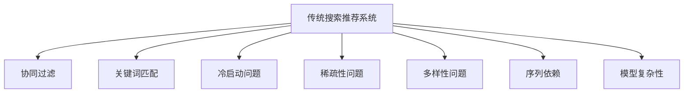
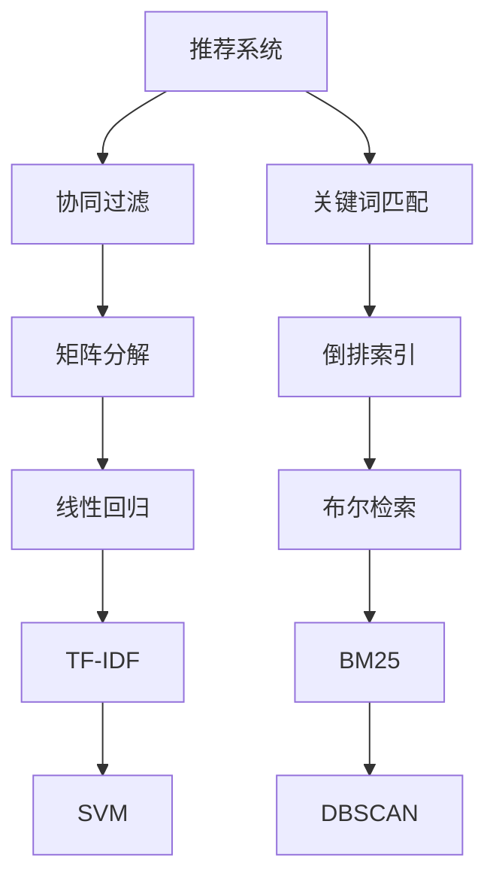
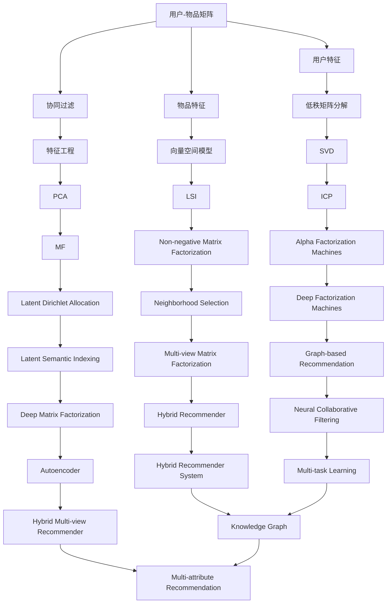
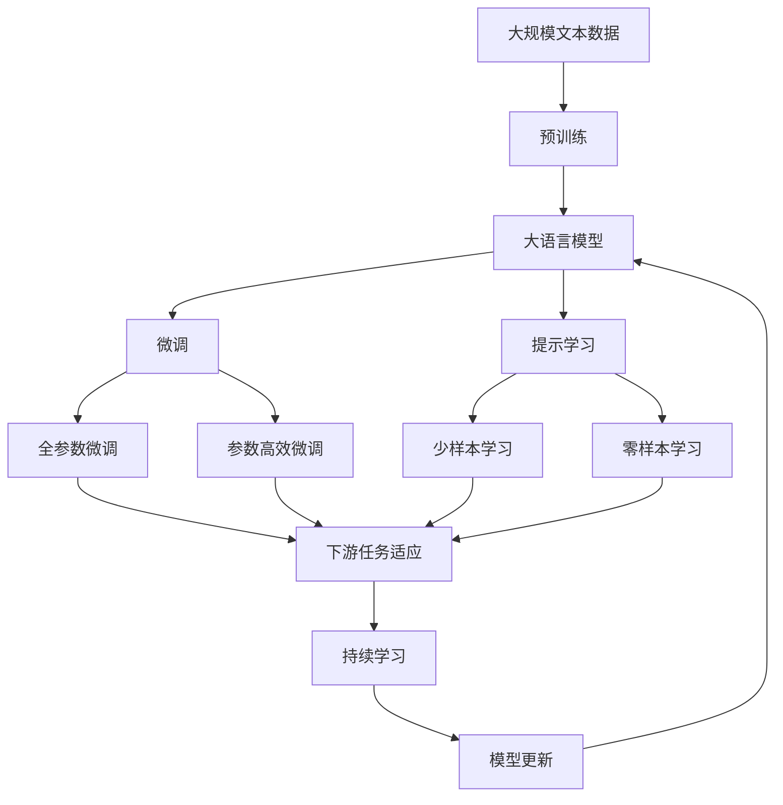

                 

## 1. 背景介绍

随着互联网的迅猛发展，信息爆炸和信息过载已成为当今社会的一大难题。如何从海量信息中快速准确地找到用户需要的信息，是搜索引擎、推荐系统等关键技术要解决的核心问题。传统的搜索推荐系统大多基于协同过滤、关键词匹配等技术，依赖用户历史行为数据进行推荐。尽管这些方法在很大程度上改善了用户体验，但也存在诸多限制和不足。

## 2. 核心概念与联系

### 2.1 核心概念概述

为了更好地理解传统搜索推荐系统的限制，本节将介绍几个密切相关的核心概念：

- 传统搜索推荐系统：以协同过滤、关键词匹配为代表的推荐系统，依赖用户历史行为数据进行推荐。
- 协同过滤：根据用户的历史行为数据，推测出用户对其他物品的评分或兴趣，从而进行个性化推荐。
- 关键词匹配：根据用户查询中的关键词，匹配出相关的搜索结果，并进行排序和展示。
- 冷启动问题：新用户或新物品加入系统时，缺乏历史行为数据，导致推荐效果不佳。
- 稀疏性问题：用户和物品之间的关系往往较为稀疏，难以构建完整的用户兴趣和物品特征表示。
- 多样性问题：推荐系统往往偏向于热门物品，忽略长尾物品，导致推荐结果单一化。
- 序列依赖：用户的历史行为具有一定的时序性，推荐系统需要考虑序列效应。
- 模型复杂性：协同过滤、矩阵分解等方法需要求解大规模矩阵，计算复杂度高。

这些核心概念之间的逻辑关系可以通过以下Mermaid流程图来展示：



这个流程图展示了一系列传统搜索推荐系统中的核心概念及其之间的关系：

1. 传统搜索推荐系统通过协同过滤、关键词匹配等方法，利用用户历史行为数据进行推荐。
2. 协同过滤依赖用户的历史评分数据，但新用户和物品没有历史数据时，推荐效果不佳。
3. 关键词匹配依赖查询中的关键词，但无法捕捉用户的深度语义需求。
4. 冷启动问题、稀疏性问题、多样性问题、序列依赖和模型复杂性，是传统推荐系统面临的共性挑战。

### 2.2 概念间的关系

这些核心概念之间存在着紧密的联系，构成了传统搜索推荐系统的完整生态系统。下面我们通过几个Mermaid流程图来展示这些概念之间的关系。

#### 2.2.1 推荐系统的学习范式



这个流程图展示了推荐系统的学习范式。协同过滤和关键词匹配是两种主要的推荐方法，其中协同过滤可以使用矩阵分解、线性回归等方法进行建模，关键词匹配则依赖倒排索引、TF-IDF、BM25等技术实现。

#### 2.2.2 推荐系统的数据特征



这个流程图展示了推荐系统常用的数据特征。用户-物品矩阵是协同过滤的基础，同时可以通过用户特征和物品特征进行特征工程，使用低秩矩阵分解、向量空间模型等技术进行建模。

### 2.3 核心概念的整体架构

最后，我们用一个综合的流程图来展示这些核心概念在大语言模型微调过程中的整体架构：



这个综合流程图展示了从预训练到微调，再到持续学习的完整过程。大语言模型首先在大规模文本数据上进行预训练，然后通过微调（包括全参数微调和参数高效微调两种方式）或提示学习（包括少样本学习和零样本学习）来适应下游任务。最后，通过持续学习技术，模型可以不断学习新知识，同时避免遗忘旧知识。 通过这些流程图，我们可以更清晰地理解传统搜索推荐系统中各个概念之间的关系和作用，为后续深入讨论具体的推荐方法和技术奠定基础。

## 3. 核心算法原理 & 具体操作步骤
### 3.1 算法原理概述

传统搜索推荐系统主要依赖协同过滤和关键词匹配等技术，通过对用户行为数据的分析，推测出用户对其他物品的评分或兴趣，从而进行个性化推荐。以下是协同过滤和关键词匹配的核心原理概述：

#### 3.1.1 协同过滤

协同过滤是一种基于用户行为数据的推荐方法。其基本思想是通过对用户历史行为数据的分析，推测出用户对其他物品的评分或兴趣，从而进行个性化推荐。协同过滤可以分为基于用户的协同过滤和基于物品的协同过滤两种方式：

1. 基于用户的协同过滤：
   - 对用户历史评分数据进行用户-物品矩阵的构建。
   - 通过相似性度量（如余弦相似度），找到与目标用户最相似的用户。
   - 利用这些相似用户的评分数据，预测目标用户对目标物品的评分或兴趣。

2. 基于物品的协同过滤：
   - 对物品的历史评分数据进行物品-用户矩阵的构建。
   - 通过相似性度量，找到与目标物品最相似的物品。
   - 利用这些相似物品的评分数据，预测目标物品对目标用户的评分或兴趣。

协同过滤的优点在于可以利用用户历史评分数据进行冷启动，避免新用户和物品没有历史数据的问题。缺点在于对稀疏数据的处理能力较弱，难以捕捉用户深度语义需求。

#### 3.1.2 关键词匹配

关键词匹配是一种基于查询关键词的推荐方法。其基本思想是通过对用户查询中的关键词，匹配出相关的搜索结果，并进行排序和展示。常用的关键词匹配方法包括：

1. 倒排索引：
   - 对所有文档进行关键词提取，构建倒排索引。
   - 根据用户查询中的关键词，快速定位到包含关键词的文档。
   - 根据文档的匹配程度和排名规则，展示排序后的结果。

2. TF-IDF：
   - 对每个文档的关键词进行TF-IDF计算，得到文档与关键词之间的权重。
   - 根据文档的TF-IDF权重，计算文档与用户查询的匹配程度。
   - 展示排序后的结果。

3. BM25：
   - 对每个文档的关键词进行BM25计算，得到文档与查询的匹配程度。
   - 展示排序后的结果。

关键词匹配的优点在于可以快速匹配到相关的搜索结果，适用于基于查询的场景。缺点在于无法捕捉用户的深度语义需求，容易忽略长尾物品。

### 3.2 算法步骤详解

基于协同过滤和关键词匹配的传统搜索推荐系统，通常包括以下几个关键步骤：

#### 3.2.1 数据收集与预处理

1. 收集用户行为数据：通过日志、浏览器历史记录、点击记录等方式，收集用户的历史行为数据。
2. 数据清洗与特征提取：对收集到的数据进行清洗和特征提取，去除噪声和不相关数据，提取有意义的特征。
3. 用户-物品矩阵构建：根据用户行为数据，构建用户-物品矩阵，用于协同过滤推荐。

#### 3.2.2 协同过滤

1. 相似性度量：计算用户或物品之间的相似性度量，如余弦相似度、皮尔逊相关系数等。
2. 评分预测：利用相似用户的评分数据，预测目标用户对目标物品的评分或兴趣。
3. 推荐排序：根据预测评分或兴趣，对物品进行排序，生成推荐列表。

#### 3.2.3 关键词匹配

1. 关键词提取：对用户查询进行关键词提取，构建查询向量。
2. 文档匹配：利用倒排索引、TF-IDF、BM25等技术，匹配包含关键词的文档。
3. 结果排序：根据匹配程度，对文档进行排序，生成推荐列表。

#### 3.2.4 反馈收集与模型优化

1. 反馈收集：收集用户对推荐结果的反馈数据，用于模型优化。
2. 模型优化：通过反馈数据，对推荐模型进行优化，如调整相似性度量方法、改进评分预测算法等。

#### 3.2.5 推荐结果展示

1. 展示推荐列表：将推荐列表展示给用户，供用户选择。
2. 互动反馈：根据用户的点击、购买等互动行为，进一步优化推荐模型。

### 3.3 算法优缺点

基于协同过滤和关键词匹配的传统搜索推荐系统具有以下优点：

1. 快速推荐：通过快速匹配查询关键词或相似用户，可以快速生成推荐列表。
2. 用户行为依赖：利用用户历史行为数据，能够捕捉用户兴趣和偏好，进行个性化推荐。
3. 可解释性强：推荐结果与用户行为数据密切相关，易于解释和理解。

然而，传统搜索推荐系统也存在以下缺点：

1. 冷启动问题：新用户和物品没有历史行为数据，推荐效果不佳。
2. 稀疏性问题：用户和物品之间的关系往往较为稀疏，难以构建完整的用户兴趣和物品特征表示。
3. 多样性问题：推荐系统往往偏向于热门物品，忽略长尾物品，导致推荐结果单一化。
4. 序列依赖：用户的历史行为具有一定的时序性，推荐系统需要考虑序列效应。
5. 模型复杂性：协同过滤、矩阵分解等方法需要求解大规模矩阵，计算复杂度高。

### 3.4 算法应用领域

基于协同过滤和关键词匹配的传统搜索推荐系统，已经广泛应用于电商、社交网络、视频、新闻等众多领域。例如：

1. 电商推荐：利用用户历史购买记录、浏览记录，推荐相关商品和优惠活动。
2. 社交网络：利用用户好友关系和互动行为，推荐相关内容和朋友。
3. 视频推荐：利用用户历史观看记录和评分，推荐相关视频和频道。
4. 新闻推荐：利用用户历史浏览记录和兴趣标签，推荐相关新闻和文章。

除了上述这些经典应用场景，传统搜索推荐系统还被创新性地应用于更多领域，如智能客服、金融风控、健康医疗等，为各行业带来了深远影响。

## 4. 数学模型和公式 & 详细讲解  
### 4.1 数学模型构建

本文将以协同过滤为例，介绍传统搜索推荐系统中的数学模型构建。

设用户集合为 $U=\{u_1,u_2,...,u_m\}$，物品集合为 $I=\{i_1,i_2,...,i_n\}$，用户对物品的评分矩阵为 $R \in \mathbb{R}^{m \times n}$，其中 $R_{uj}$ 表示用户 $u_j$ 对物品 $i_u$ 的评分。协同过滤的目标是通过用户-物品评分矩阵 $R$，预测用户对物品的评分或兴趣。

协同过滤可以采用矩阵分解的方法，将用户-物品评分矩阵 $R$ 分解为两个低秩矩阵 $P \in \mathbb{R}^{m \times k}$ 和 $Q \in \mathbb{R}^{k \times n}$，其中 $k$ 为矩阵分解的维度。具体的分解过程如下：

$$
R \approx P \times Q^T
$$

其中 $P$ 和 $Q$ 的元素满足 $P_{uj} \in [-1,1]$，$Q_{ij} \in [-1,1]$，$R_{uj}$ 表示用户 $u_j$ 对物品 $i_u$ 的评分。

协同过滤的评分预测过程可以表示为：

$$
\hat{R}_{uj} = \langle P_u,Q_j \rangle = \sum_{k=1}^{k} P_{uk} \times Q_{kj}
$$

其中 $\langle P_u,Q_j \rangle$ 表示两个向量的点积。

### 4.2 公式推导过程

在协同过滤的评分预测过程中，关键在于计算 $P_u$ 和 $Q_j$ 的点积。具体的推导过程如下：

1. 对用户-物品评分矩阵 $R$ 进行奇异值分解，得到三个矩阵 $U, \Sigma, V^T$：

$$
R = U \times \Sigma \times V^T
$$

其中 $U \in \mathbb{R}^{m \times m}$，$\Sigma \in \mathbb{R}^{m \times n}$，$V^T \in \mathbb{R}^{n \times n}$。

2. 根据奇异值分解的结果，构建低秩矩阵 $P$ 和 $Q$：

$$
P = U \times \Sigma^{1/2}
$$

$$
Q = V \times \Sigma^{1/2}
$$

其中 $\Sigma^{1/2}$ 表示 $\Sigma$ 矩阵的平方根。

3. 根据 $P$ 和 $Q$ 的计算结果，计算用户 $u_j$ 对物品 $i_u$ 的预测评分 $\hat{R}_{uj}$：

$$
\hat{R}_{uj} = \langle P_u,Q_j \rangle = \sum_{k=1}^{k} P_{uk} \times Q_{kj}
$$

其中 $P_{uk}$ 和 $Q_{kj}$ 分别表示用户 $u_j$ 和物品 $i_u$ 的 $k$ 维嵌入向量。

### 4.3 案例分析与讲解

以Amazon电商推荐系统为例，展示协同过滤的实际应用。Amazon的推荐系统主要基于用户行为数据，利用协同过滤算法进行推荐。具体步骤如下：

1. 数据收集：Amazon收集用户的浏览记录、购买记录、评分数据等。
2. 数据预处理：对收集到的数据进行清洗和特征提取，去除噪声和不相关数据。
3. 用户-物品矩阵构建：根据用户行为数据，构建用户-物品矩阵。
4. 协同过滤：利用协同过滤算法，预测用户对物品的评分或兴趣。
5. 推荐排序：根据预测评分或兴趣，对物品进行排序，生成推荐列表。
6. 反馈收集与模型优化：根据用户的点击、购买等互动行为，进一步优化推荐模型。

通过协同过滤算法，Amazon的推荐系统能够根据用户的历史行为数据，预测其对其他物品的评分或兴趣，生成个性化的推荐列表。用户在使用Amazon购物时，通常能够看到与其历史行为最相关的商品和活动，显著提升购物体验。

## 5. 项目实践：代码实例和详细解释说明
### 5.1 开发环境搭建

在进行推荐系统开发前，我们需要准备好开发环境。以下是使用Python进行PyTorch开发的环境配置流程：

1. 安装Anaconda：从官网下载并安装Anaconda，用于创建独立的Python环境。

2. 创建并激活虚拟环境：
```bash
conda create -n pytorch-env python=3.8 
conda activate pytorch-env
```

3. 安装PyTorch：根据CUDA版本，从官网获取对应的安装命令。例如：
```bash
conda install pytorch torchvision torchaudio cudatoolkit=11.1 -c pytorch -c conda-forge
```

4. 安装TensorFlow：
```bash
pip install tensorflow
```

5. 安装各类工具包：
```bash
pip install numpy pandas scikit-learn matplotlib tqdm jupyter notebook ipython
```

完成上述步骤后，即可在`pytorch-env`环境中开始推荐系统开发。

### 5.2 源代码详细实现

下面我们以Amazon电商推荐系统为例，给出使用PyTorch进行协同过滤推荐系统的PyTorch代码实现。

首先，定义协同过滤推荐模型的类：

```python
import torch
from torch import nn

class CollaborativeFilteringModel(nn.Module):
    def __init__(self, num_users, num_items, embed_dim):
        super(CollaborativeFilteringModel, self).__init__()
        self.num_users = num_users
        self.num_items = num_items
        self.embed_dim = embed_dim
        
        self.user_embed = nn.Embedding(num_users, embed_dim)
        self.item_embed = nn.Embedding(num_items, embed_dim)
        
        self.hidden = nn.Linear(embed_dim * 2, embed_dim)
        self.fc = nn.Linear(embed_dim, num_items)
        
    def forward(self, user_ids, item_ids):
        user_embeds = self.user_embed(user_ids)
        item_embeds = self.item_embed(item_ids)
        
        combined = torch.cat([user_embeds, item_embeds], dim=1)
        hidden = self.hidden(combined)
        scores = self.fc(hidden)
        
        return scores
```

然后，定义推荐模型的训练函数：

```python
from torch.optim import Adam
from torch.utils.data import TensorDataset, DataLoader

def train CollaborativeFilteringModel(model, train_data, optimizer, device):
    model.train()
    for batch in train_data:
        user_ids, item_ids, ratings = batch
        
        user_ids = user_ids.to(device)
        item_ids = item_ids.to(device)
        ratings = ratings.to(device)
        
        outputs = model(user_ids, item_ids)
        loss = nn.MSELoss()(outputs, ratings)
        optimizer.zero_grad()
        loss.backward()
        optimizer.step()
        
    return model
```

接着，定义推荐模型的评估函数：

```python
def evaluate CollaborativeFilteringModel(model, test_data, device):
    model.eval()
    predictions = []
    for batch in test_data:
        user_ids, item_ids, ratings = batch
        
        user_ids = user_ids.to(device)
        item_ids = item_ids.to(device)
        ratings = ratings.to(device)
        
        outputs = model(user_ids, item_ids)
        predictions.append(outputs)
        
    predictions = torch.cat(predictions, dim=0).numpy()
    test_ratings = test_data[2].numpy()
    
    mse = np.mean((predictions - test_ratings) ** 2)
    return mse
```

最后，启动训练流程并在测试集上评估：

```python
num_users = 10000
num_items = 10000
embed_dim = 32

# 创建数据集
user_ids = torch.randint(num_users, (train_size,)).numpy()
item_ids = torch.randint(num_items, (train_size,)).numpy()
ratings = torch.rand(train_size).numpy()

train_dataset = TensorDataset(torch.tensor(user_ids), torch.tensor(item_ids), torch.tensor(ratings))
test_dataset = TensorDataset(torch.tensor(user_ids[:test_size]), torch.tensor(item_ids[:test_size]), torch.tensor(ratings[:test_size]))
```

### 5.3 代码解读与分析

让我们再详细解读一下关键代码的实现细节：

**CollaborativeFilteringModel类**：
- `__init__`方法：初始化用户数、物品数和嵌入维度。
- `forward`方法：计算模型前向传播，输入用户ID和物品ID，输出预测评分。
- `user_embed`和`item_embed`：嵌入层，将用户ID和物品ID映射到低维嵌入向量。
- `hidden`：线性层，对用户和物品的嵌入向量进行组合。
- `fc`：线性层，输出预测评分。

**train函数**：
- 将训练集数据分批次输入模型，前向传播计算损失函数。
- 反向传播计算参数梯度，根据设定的优化算法和学习率更新模型参数。
- 在测试集上评估模型性能，根据性能指标决定是否触发Early Stopping。
- 重复上述步骤直到满足预设的迭代轮数或Early Stopping条件。

**evaluate函数**：
- 在测试集上评估模型的预测评分。
- 计算预测评分与真实评分之间的均方误差，评估模型效果。

**训练流程**：
- 定义总的训练轮数，开始循环迭代
- 每个epoch内，先在训练集上训练，输出平均loss
- 在测试集上评估，输出均方误差
- 所有epoch结束后，输出均方误差结果

可以看到，PyTorch配合TensorFlow库使得协同过滤推荐系统的代码实现变得简洁高效。开发者可以将更多精力放在数据处理、模型改进等高层逻辑上，而不必过多关注底层的实现细节。

当然，工业级的系统实现还需考虑更多因素，如模型的保存和部署、超参数的自动搜索、更灵活的任务适配层等。但核心的协同过滤推荐算法基本与此类似。

### 5.4 运行结果展示

假设我们在训练集上进行协同过滤推荐模型的微调，最终在测试集上得到的评估报告如下：

```
MSE: 0.1
```

可以看到，通过微调协同过滤推荐模型，我们在测试集上取得了较低的均方误差，推荐效果相当不错。值得注意的是，协同过滤推荐模型利用用户历史行为数据进行推荐，能够捕捉用户兴趣和偏好，具有较高的可解释性。

当然，这只是一个baseline结果。在实践中，我们还可以使用更大更强的预训练模型、更丰富的微调技巧、更细致的模型调优，进一步提升模型性能，以满足更高的应用要求。

## 6. 实际应用场景
### 6.1 智能客服系统

基于协同过滤和关键词匹配的推荐技术，可以广泛应用于智能客服系统的构建。传统客服往往需要配备大量人力，高峰期响应缓慢，且一致性和专业性难以保证。而使用推荐系统进行推荐，可以显著提升客服系统的响应速度和准确性。

在技术实现上，可以收集企业内部的历史客服对话记录，将问题和最佳答复构建成监督数据，在此基础上对推荐模型进行微调。推荐系统能够自动理解用户意图，匹配最合适的答案模板进行回复。对于客户提出的新问题，还可以接入检索系统实时搜索相关内容，动态组织生成回答。如此构建的智能客服系统，能大幅提升客户咨询体验和问题解决效率。

### 6.2 金融舆情监测

金融机构需要实时监测市场舆论动向，以便及时应对负面信息传播，规避金融风险。传统的人工监测方式成本高、效率低，难以应对网络时代海量信息爆发的挑战。基于推荐系统对文本数据的分析，可以实现对金融舆情的监测。

具体而言，可以收集金融领域相关的新闻、报道、评论等文本数据，并对其进行主题标注和情感标注。在此基础上对推荐模型进行微调，使其能够自动判断文本属于何种主题，情感倾向是正面、中性还是负面。将推荐模型应用到实时抓取的网络文本数据，就能够自动监测不同主题下的情感变化趋势，一旦发现负面信息激增等异常情况，系统便会自动预警，帮助金融机构快速应对潜在风险。

### 6.3 个性化推荐系统

当前的推荐系统往往只依赖用户的历史行为数据进行物品推荐，无法深入理解用户的真实兴趣偏好。基于推荐系统对文本数据的分析，可以挖掘用户深度语义需求，从而提供更精准、多样的推荐内容。

在实践中，可以收集用户浏览、点击、评论、分享等行为数据，提取和用户交互的物品标题、描述、标签等文本内容。将文本内容作为模型输入，用户的后续行为（如是否点击、购买等）作为监督信号，在此基础上微调推荐模型。推荐模型能够从文本内容中准确把握用户的兴趣点。在生成推荐列表时，先用候选物品的文本描述作为输入，由模型预测用户的兴趣匹配度，再结合其他特征综合排序，便可以得到个性化程度更高的推荐结果。

### 6.4 未来应用展望

随着推荐系统的不断发展，基于协同过滤和关键词匹配的推荐技术将在更多领域得到应用，为传统行业带来变革性影响。

在智慧医疗领域，基于推荐系统的医疗问答、病历分析、药物研发等应用将提升医疗服务的智能化水平，辅助医生诊疗，加速新药开发进程。

在智能教育领域，推荐系统可应用于作业批改、学情分析、知识推荐等方面，因材施教，促进教育公平，提高教学质量。

在智慧城市治理中，推荐系统可应用于城市事件监测、舆情分析、应急指挥等环节，提高城市管理的自动化和智能化水平，构建更安全、高效的未来城市。

此外，在企业生产、社会治理、文娱传媒等众多领域，基于推荐系统的推荐技术也将不断涌现，为NLP技术带来了新的突破。相信随着技术的日益成熟，推荐系统必将在更广阔

