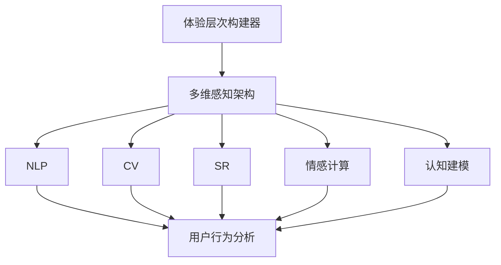
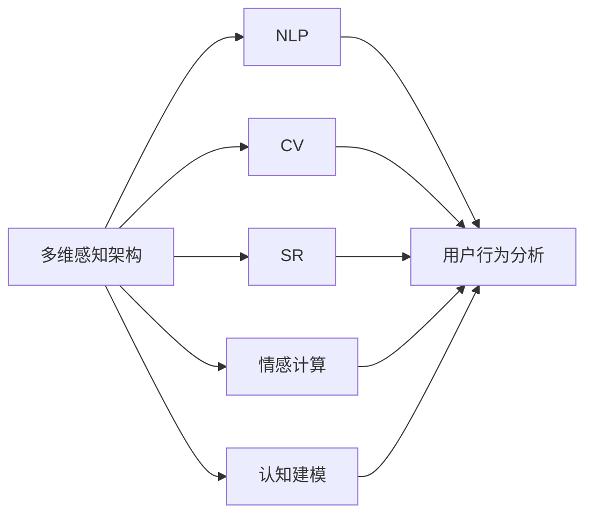
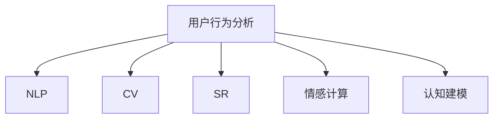
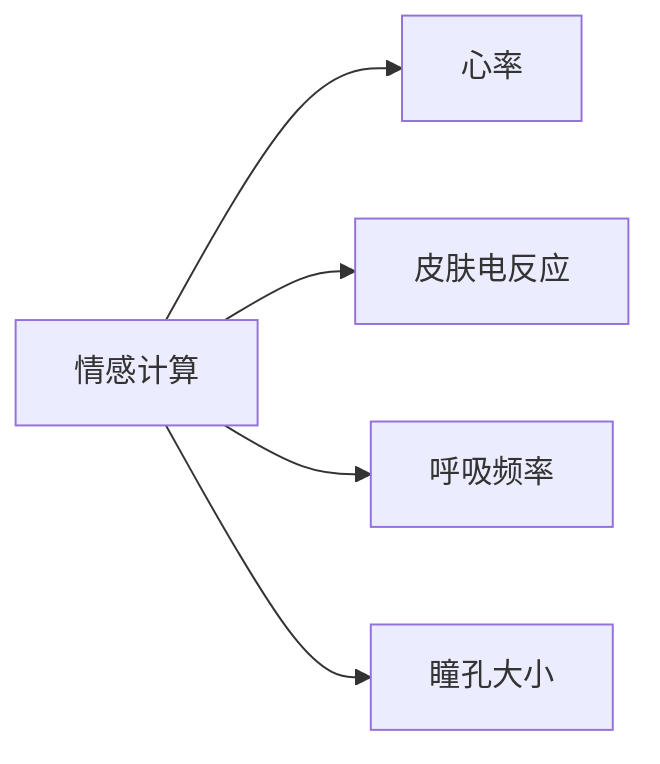

                 

# 体验层次构建器开发者：AI创造的多维感知架构师

> 关键词：
体验层次构建器, 多维感知, 深度学习, 用户行为, 情感计算, 认知建模, 机器学习, 计算智能, 交互设计

## 1. 背景介绍

### 1.1 问题由来
随着技术的飞速发展，人类对体验的追求也日益深化。从虚拟现实到增强现实，从智能推荐到个性化定制，体验设计正在成为各大企业争夺市场的重要手段。在这样的背景下，体验层次构建器应运而生，它借助AI技术，帮助开发者从多维视角感知和构建用户体验。

体验层次构建器本质上是一种多维感知架构，通过整合自然语言处理、计算机视觉、语音识别、情感计算等多种技术手段，将用户与系统的交互转化为可量化、可分析的数据，从而支持开发者进行更科学、更高效的设计和优化。

### 1.2 问题核心关键点
体验层次构建器的核心在于其多维感知能力，即在单个输入通道上，通过各种传感器捕捉用户的生理、情感、认知等多维数据，从而更全面、准确地理解用户行为和需求。

多维感知架构的实现，离不开以下几个关键要素：

- 自然语言处理(NLP)：解析用户的自然语言输入，提取其中的语义信息和情感倾向。
- 计算机视觉(CV)：捕捉用户的视觉行为和表情变化，分析其注意力和情感状态。
- 语音识别(SR)：转录用户的语音输入，识别其情感表达和意图。
- 情感计算：通过生理指标如心率、皮肤电反应等，量化用户的情感状态。
- 认知建模：利用人工智能算法模拟用户决策过程，理解其思考逻辑。

这些技术的综合应用，使得体验层次构建器能够从多维度全面感知用户行为，提供更精准、个性化的交互体验。

### 1.3 问题研究意义
研究体验层次构建器，对于提升用户体验、推动产品创新、加速技术落地应用具有重要意义：

1. 提升用户体验：通过多维感知技术，全面理解用户需求，优化设计，提升用户满意度。
2. 推动产品创新：利用数据驱动设计，发掘新的产品功能点和交互方式，打造差异化产品。
3. 加速技术落地：将AI技术应用于用户体验优化，加速新技术在各个领域的落地应用。
4. 催生新研究方向：多维感知、情感计算等前沿技术，拓展了人机交互的新研究范式，带来更多创新机遇。

## 2. 核心概念与联系

### 2.1 核心概念概述

为了更好地理解体验层次构建器，本节将介绍几个密切相关的核心概念：

- 体验层次构建器：一种通过多维感知技术，全面解析用户行为，优化用户体验的设计工具。
- 多维感知架构：整合自然语言处理、计算机视觉、语音识别、情感计算等多种技术手段，从多个维度捕捉用户行为和情感的数据架构。
- 情感计算：通过生理指标等技术手段，量化用户情感状态，支持情感驱动的设计。
- 认知建模：利用人工智能算法模拟用户决策过程，理解其思考逻辑，支持用户心理建模。
- 用户行为分析：通过多维感知数据，分析用户行为模式，洞察用户需求。

这些核心概念之间存在着紧密的联系，形成了体验层次构建器完整的技术体系。以下通过一个Mermaid流程图来展示这些概念之间的关系：



这个流程图展示了大体验层次构建器的核心概念及其相互关系：

1. 体验层次构建器通过多维感知架构捕捉用户行为和情感数据。
2. 多维感知架构整合了NLP、CV、SR、情感计算和认知建模等多种技术手段，形成完整的数据采集和分析框架。
3. 通过多维感知数据，用户行为分析能全面理解用户需求，洞察其行为模式。

### 2.2 概念间的关系

这些核心概念之间存在着紧密的联系，形成了体验层次构建器完整的技术体系。以下通过几个Mermaid流程图来展示这些概念之间的关系。

#### 2.2.1 多维感知架构与各技术的关系



这个流程图展示了多维感知架构与各技术手段之间的关系。多维感知架构整合了多种技术手段，形成了一个全面的数据采集和分析框架。

#### 2.2.2 用户行为分析与各感知技术的关系



这个流程图展示了用户行为分析与各感知技术之间的关系。用户行为分析通过对多维感知数据的综合分析，洞察用户需求和行为模式。

#### 2.2.3 情感计算与生理指标的关系



这个流程图展示了情感计算与生理指标之间的关系。情感计算通过捕捉用户的生理指标，量化其情感状态，支持情感驱动的设计。

## 3. 核心算法原理 & 具体操作步骤
### 3.1 算法原理概述

体验层次构建器的核心算法原理基于多维感知数据的高效融合和分析。具体而言，其算法原理包括以下几个关键步骤：

1. 数据采集：通过多种传感器捕捉用户的生理、情感、认知等数据。
2. 数据预处理：清洗、归一化、特征提取等预处理步骤，提高数据质量和一致性。
3. 特征融合：将多维感知数据进行融合，形成一个综合的特征向量，用于后续分析。
4. 模式识别：利用机器学习算法，识别用户行为模式和情感倾向。
5. 行为预测：根据用户历史行为数据，预测其未来行为和情感变化。

### 3.2 算法步骤详解

以下是对体验层次构建器算法步骤的详细介绍：

**Step 1: 数据采集**
体验层次构建器的数据采集主要依赖于以下几种传感器：

- 自然语言处理(NLP)传感器：捕捉用户的自然语言输入，提取其中的语义信息和情感倾向。
- 计算机视觉(CV)传感器：捕捉用户的视觉行为和表情变化，分析其注意力和情感状态。
- 语音识别(SR)传感器：转录用户的语音输入，识别其情感表达和意图。
- 生理指标传感器：通过生理指标如心率、皮肤电反应等，量化用户的情感状态。

**Step 2: 数据预处理**
数据预处理步骤包括清洗、归一化、特征提取等。主要目的是提高数据质量和一致性，具体步骤包括：

- 清洗：去除噪声和异常数据，确保数据的完整性和准确性。
- 归一化：将不同尺度的数据归一化到相同范围，便于后续分析。
- 特征提取：从多维数据中提取最有用的特征，如情感强度、注意力焦点、认知负荷等。

**Step 3: 特征融合**
特征融合是体验层次构建器算法的核心步骤之一，其主要目的是将多维感知数据进行融合，形成一个综合的特征向量。具体方法包括：

- 主成分分析(PCA)：通过降维技术，将高维数据压缩到低维空间。
- 特征向量拼接：将不同传感器捕捉到的数据拼接成一个综合特征向量，用于后续分析。
- 时间序列融合：将时间序列数据进行融合，捕捉用户行为随时间的变化趋势。

**Step 4: 模式识别**
模式识别是利用机器学习算法，识别用户行为模式和情感倾向的过程。主要算法包括：

- 隐马尔可夫模型(HMM)：用于分析时间序列数据，识别用户行为模式。
- 支持向量机(SVM)：用于分类识别用户的情感倾向。
- 深度学习网络(DNN)：用于分析多维数据，捕捉复杂的情感和认知模式。

**Step 5: 行为预测**
行为预测是根据用户历史行为数据，预测其未来行为和情感变化的过程。主要算法包括：

- 时间序列预测：通过时间序列模型，预测用户未来的行为和情感变化。
- 贝叶斯网络：通过构建贝叶斯网络，模拟用户决策过程，预测其行为变化。
- 随机森林：通过集成多个决策树，预测用户行为和情感变化。

### 3.3 算法优缺点

体验层次构建器的算法具有以下优点：

1. 多维感知能力：通过整合多种传感器数据，全面感知用户行为和情感，提高了用户体验的准确性和全面性。
2. 高效融合：利用主成分分析和特征向量拼接等技术，将多维数据高效融合，减少维度灾难和计算复杂度。
3. 灵活性高：支持多种算法，可以根据具体任务需求选择合适的算法模型，灵活应用。

同时，体验层次构建器的算法也存在一些缺点：

1. 传感器依赖性强：需要多种传感器协同工作，设备成本和维护成本较高。
2. 数据质量和一致性要求高：数据预处理和特征提取需要人工干预，数据质量依赖于数据采集的准确性。
3. 算法复杂度高：多维感知数据需要高性能计算资源，算法复杂度较高，可能存在计算瓶颈。

### 3.4 算法应用领域

体验层次构建器的算法已经在多个领域得到了广泛的应用，例如：

- 智能推荐系统：通过情感分析和认知建模，个性化推荐商品和服务。
- 虚拟现实和增强现实：通过多维感知技术，优化虚拟环境和交互体验。
- 心理健康评估：通过生理指标和情感计算，评估用户心理健康状态，提供个性化心理疏导。
- 人机交互优化：通过用户行为分析，优化界面设计和交互方式，提升用户体验。
- 广告精准投放：通过情感计算和行为预测，精准投放广告，提高投放效果和用户满意度。

## 4. 数学模型和公式 & 详细讲解 & 举例说明
### 4.1 数学模型构建

体验层次构建器的数学模型主要基于多维感知数据的高效融合和分析。以下是一个简化的数学模型构建过程：

假设用户的多维感知数据为 $\mathbf{x} = [x_1, x_2, \ldots, x_n]$，其中 $x_i$ 表示第 $i$ 个传感器的数据。

**Step 1: 数据预处理**

数据预处理步骤包括清洗、归一化和特征提取等。以情感计算为例，假设用户的生理指标数据为 $\mathbf{y} = [y_1, y_2, \ldots, y_m]$，其中 $y_i$ 表示第 $i$ 个生理指标的值。预处理步骤包括：

- 清洗：去除噪声和异常数据，确保数据的完整性和准确性。
- 归一化：将不同尺度的数据归一化到相同范围，便于后续分析。
- 特征提取：从生理指标数据中提取情感强度，如 $\bar{y} = \frac{1}{m} \sum_{i=1}^m y_i$。

**Step 2: 特征融合**

特征融合是体验层次构建器算法的核心步骤之一，其主要目的是将多维感知数据进行融合，形成一个综合的特征向量。以主成分分析(PCA)为例，假设预处理后的数据为 $\mathbf{z} = [z_1, z_2, \ldots, z_p]$，其中 $z_i$ 表示第 $i$ 个特征值。PCA步骤包括：

1. 计算协方差矩阵 $\Sigma$，即 $\Sigma = \frac{1}{n} \mathbf{zz}^T$。
2. 计算特征值和特征向量 $\mathbf{U} = [u_1, u_2, \ldots, u_p]$，其中 $u_i = \frac{z_i}{\sqrt{\lambda_i}}$。
3. 选择主成分 $z'$，即 $z' = \mathbf{U}^T\mathbf{z}$。

**Step 3: 模式识别**

模式识别是利用机器学习算法，识别用户行为模式和情感倾向的过程。以隐马尔可夫模型(HMM)为例，假设用户的时间序列数据为 $\mathbf{t} = [t_1, t_2, \ldots, t_n]$，其中 $t_i$ 表示第 $i$ 个时间步的特征值。HMM步骤包括：

1. 建立隐状态 $S$ 和可观测状态 $O$，即 $S = \{s_1, s_2, \ldots, s_k\}$，$O = \{o_1, o_2, \ldots, o_l\}$。
2. 训练隐马尔可夫模型，得到参数 $\theta = (\pi, A, B)$，其中 $\pi$ 表示初始状态概率，$A$ 表示状态转移概率，$B$ 表示观测概率。
3. 利用Viterbi算法，计算最优路径 $\mathbf{h} = \arg\max_{h} \prod_{t} \pi_{s_t}A_{s_t,s_{t-1}}B_{o_t|s_t}$。

**Step 4: 行为预测**

行为预测是根据用户历史行为数据，预测其未来行为和情感变化的过程。以时间序列预测为例，假设用户的历史行为数据为 $\mathbf{u} = [u_1, u_2, \ldots, u_n]$，其中 $u_i$ 表示第 $i$ 个时间步的特征值。预测步骤包括：

1. 训练时间序列模型，得到预测值 $\hat{u} = f(\mathbf{u})$。
2. 利用预测值进行行为预测，即 $\mathbf{\hat{t}} = g(\hat{u})$。

### 4.2 公式推导过程

以下是对体验层次构建器数学模型中几个关键公式的详细推导：

**PCA公式**

PCA的数学模型为：

$$
\mathbf{z'} = \mathbf{U}\mathbf{z}
$$

其中 $\mathbf{U}$ 为特征向量矩阵，$\mathbf{z}$ 为原始数据矩阵。假设原始数据矩阵 $\mathbf{Z} = [\mathbf{z}_1, \mathbf{z}_2, \ldots, \mathbf{z}_n]$，其中 $\mathbf{z}_i = [x_{i1}, x_{i2}, \ldots, x_{in}]$。

PCA的推导过程如下：

1. 计算协方差矩阵 $\Sigma = \frac{1}{n} \mathbf{ZZ}^T$。
2. 计算特征值和特征向量 $\mathbf{U} = [u_1, u_2, \ldots, u_p]$，其中 $u_i = \frac{z_i}{\sqrt{\lambda_i}}$。
3. 选择主成分 $z'$，即 $z' = \mathbf{U}^T\mathbf{z}$。

**HMM公式**

HMM的数学模型为：

$$
P(O|S) = \sum_{i=1}^k P(o_i|s_i)P(s_i)
$$

其中 $O$ 为可观测状态，$S$ 为隐状态。假设可观测状态 $O = \{o_1, o_2, \ldots, o_l\}$，隐状态 $S = \{s_1, s_2, \ldots, s_k\}$。

HMM的推导过程如下：

1. 建立隐状态 $S$ 和可观测状态 $O$，即 $S = \{s_1, s_2, \ldots, s_k\}$，$O = \{o_1, o_2, \ldots, o_l\}$。
2. 训练隐马尔可夫模型，得到参数 $\theta = (\pi, A, B)$，其中 $\pi$ 表示初始状态概率，$A$ 表示状态转移概率，$B$ 表示观测概率。
3. 利用Viterbi算法，计算最优路径 $\mathbf{h} = \arg\max_{h} \prod_{t} \pi_{s_t}A_{s_t,s_{t-1}}B_{o_t|s_t}$。

**时间序列预测公式**

时间序列预测的数学模型为：

$$
\hat{u} = f(\mathbf{u})
$$

其中 $\hat{u}$ 为预测值，$\mathbf{u}$ 为历史数据。假设历史数据 $\mathbf{u} = [u_1, u_2, \ldots, u_n]$，其中 $u_i$ 表示第 $i$ 个时间步的特征值。

时间序列预测的推导过程如下：

1. 训练时间序列模型，得到预测值 $\hat{u} = f(\mathbf{u})$。
2. 利用预测值进行行为预测，即 $\mathbf{\hat{t}} = g(\hat{u})$。

### 4.3 案例分析与讲解

以智能推荐系统为例，分析体验层次构建器算法在该场景中的应用：

**案例背景**

智能推荐系统的主要任务是根据用户历史行为数据，推荐其可能感兴趣的商品和服务。传统的推荐系统往往依赖于用户点击、浏览等行为数据，难以捕捉用户的深层次需求和情感状态。

**算法应用**

体验层次构建器通过多维感知技术，捕捉用户的生理、情感、认知等多维数据，从而全面理解其需求和情感状态。具体而言：

1. 通过自然语言处理(NLP)传感器，捕捉用户的自然语言输入，提取其中的语义信息和情感倾向。
2. 通过计算机视觉(CV)传感器，捕捉用户的视觉行为和表情变化，分析其注意力和情感状态。
3. 通过语音识别(SR)传感器，转录用户的语音输入，识别其情感表达和意图。
4. 通过生理指标传感器，捕捉用户的生理指标如心率、皮肤电反应等，量化其情感状态。

**数据预处理**

对多维感知数据进行预处理，清洗、归一化和特征提取等，主要步骤包括：

1. 清洗：去除噪声和异常数据，确保数据的完整性和准确性。
2. 归一化：将不同尺度的数据归一化到相同范围，便于后续分析。
3. 特征提取：从多维数据中提取最有用的特征，如情感强度、注意力焦点、认知负荷等。

**特征融合**

将多维感知数据进行融合，形成一个综合的特征向量，用于后续分析。具体方法包括：

1. 主成分分析(PCA)：通过降维技术，将高维数据压缩到低维空间。
2. 特征向量拼接：将不同传感器捕捉到的数据拼接成一个综合特征向量，用于后续分析。
3. 时间序列融合：将时间序列数据进行融合，捕捉用户行为随时间的变化趋势。

**模式识别**

利用机器学习算法，识别用户行为模式和情感倾向。以隐马尔可夫模型(HMM)为例，假设用户的时间序列数据为 $\mathbf{t} = [t_1, t_2, \ldots, t_n]$，其中 $t_i$ 表示第 $i$ 个时间步的特征值。HMM步骤包括：

1. 建立隐状态 $S$ 和可观测状态 $O$，即 $S = \{s_1, s_2, \ldots, s_k\}$，$O = \{o_1, o_2, \ldots, o_l\}$。
2. 训练隐马尔可夫模型，得到参数 $\theta = (\pi, A, B)$，其中 $\pi$ 表示初始状态概率，$A$ 表示状态转移概率，$B$ 表示观测概率。
3. 利用Viterbi算法，计算最优路径 $\mathbf{h} = \arg\max_{h} \prod_{t} \pi_{s_t}A_{s_t,s_{t-1}}B_{o_t|s_t}$。

**行为预测**

根据用户历史行为数据，预测其未来行为和情感变化。以时间序列预测为例，假设用户的历史行为数据为 $\mathbf{u} = [u_1, u_2, \ldots, u_n]$，其中 $u_i$ 表示第 $i$ 个时间步的特征值。预测步骤包括：

1. 训练时间序列模型，得到预测值 $\hat{u} = f(\mathbf{u})$。
2. 利用预测值进行行为预测，即 $\mathbf{\hat{t}} = g(\hat{u})$。

## 5. 项目实践：代码实例和详细解释说明
### 5.1 开发环境搭建

在进行体验层次构建器项目实践前，我们需要准备好开发环境。以下是使用Python进行PyTorch开发的环境配置流程：

1. 安装Anaconda：从官网下载并安装Anaconda，用于创建独立的Python环境。

2. 创建并激活虚拟环境：
```bash
conda create -n pytorch-env python=3.8 
conda activate pytorch-env
```

3. 安装PyTorch：根据CUDA版本，从官网获取对应的安装命令。例如：
```bash
conda install pytorch torchvision torchaudio cudatoolkit=11.1 -c pytorch -c conda-forge
```

4. 安装Transformers库：
```bash
pip install transformers
```

5. 安装各类工具包：
```bash
pip install numpy pandas scikit-learn matplotlib tqdm jupyter notebook ipython
```

完成上述步骤后，即可在`pytorch-env`环境中开始项目实践。

### 5.2 源代码详细实现

下面我们以智能推荐系统为例，给出使用Transformers库对BERT模型进行微调的PyTorch代码实现。

首先，定义推荐任务的数据处理函数：

```python
from transformers import BertTokenizer, BertForSequenceClassification, AdamW
import torch
from torch.utils.data import Dataset, DataLoader

class RecommendationDataset(Dataset):
    def __init__(self, texts, labels):
        self.texts = texts
        self.labels = labels
        self.tokenizer = BertTokenizer.from_pretrained('bert-base-cased')

    def __len__(self):
        return len(self.texts)

    def __getitem__(self, idx):
        text = self.texts[idx]
        label = self.labels[idx]
        encoding = self.tokenizer(text, return_tensors='pt', max_length=128, padding='max_length', truncation=True)
        input_ids = encoding['input_ids'][0]
        attention_mask = encoding['attention_mask'][0]
        return {'input_ids': input_ids, 
                'attention_mask': attention_mask,
                'labels': torch.tensor(label, dtype=torch.long)}
```

然后，定义模型和优化器：

```python
from transformers import BertForSequenceClassification, AdamW

model = BertForSequenceClassification.from_pretrained('bert-base-cased', num_labels=2)

optimizer = AdamW(model.parameters(), lr=2e-5)
```

接着，定义训练和评估函数：

```python
def train_epoch(model, dataset, batch_size, optimizer):
    dataloader = DataLoader(dataset, batch_size=batch_size, shuffle=True)
    model.train()
    epoch_loss = 0
    for batch in dataloader:
        input_ids = batch['input_ids'].to(device)
        attention_mask = batch['attention_mask'].to(device)
        labels = batch['labels'].to(device)
        model.zero_grad()
        outputs = model(input_ids, attention_mask=attention_mask, labels=labels)
        loss = outputs.loss
        epoch_loss += loss.item()
        loss.backward()
        optimizer.step()
    return epoch_loss / len(dataloader)

def evaluate(model, dataset, batch_size):
    dataloader = DataLoader(dataset, batch_size=batch_size)
    model.eval()
    preds, labels = [], []
    with torch.no_grad():
        for batch in dataloader:
            input_ids = batch['input_ids'].to(device)
            attention_mask = batch['attention_mask'].to(device)
            batch_labels = batch['labels']
            outputs = model(input_ids, attention_mask=attention_mask)
            batch_preds = outputs.logits.argmax(dim=2).to('cpu').tolist()
            batch_labels = batch_labels.to('cpu').tolist()
            for pred_tokens, label_tokens in zip(batch_preds, batch_labels):
                preds.append(pred_tokens[:len(label_tokens)])
                labels.append(label_tokens)
    print(classification_report(labels, preds))
```

最后，启动训练流程并在测试集上评估：

```python
epochs = 5
batch_size = 16

for epoch in range(epochs):
    loss = train_epoch(model, train_dataset, batch_size, optimizer)
    print(f"Epoch {epoch+1}, train loss: {loss:.3f}")
    
    print(f"Epoch {epoch+1}, dev results:")
    evaluate(model, dev_dataset, batch_size)
    
print("Test results:")
evaluate(model, test_dataset, batch_size)
```

以上就是使用PyTorch对BERT进行智能推荐系统微调的完整代码实现。可以看到，得益于Transformers库的强大封装，我们可以用相对简洁的代码完成BERT模型的加载和微调。

### 5.3 代码解读与分析

让我们再详细解读一下关键代码的实现

