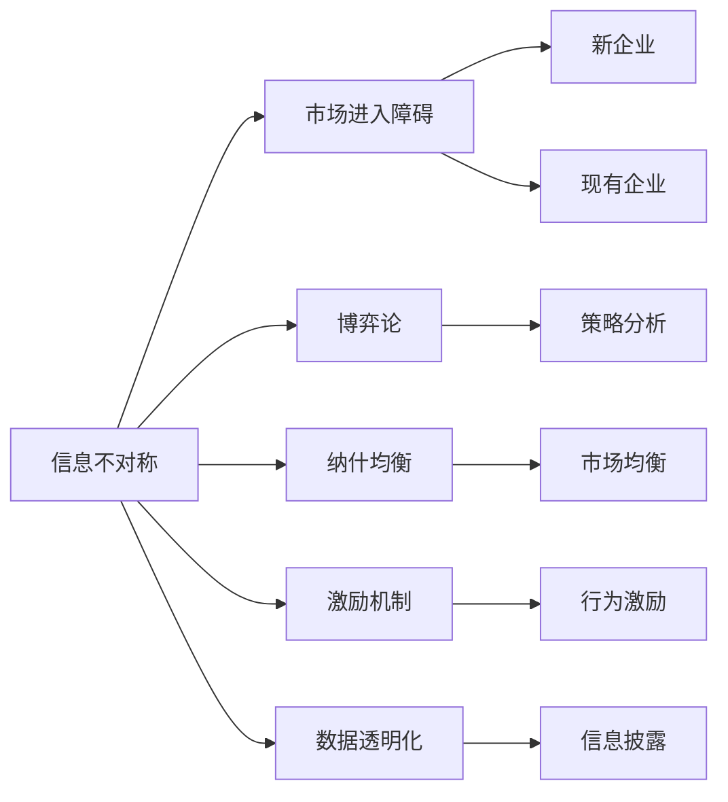
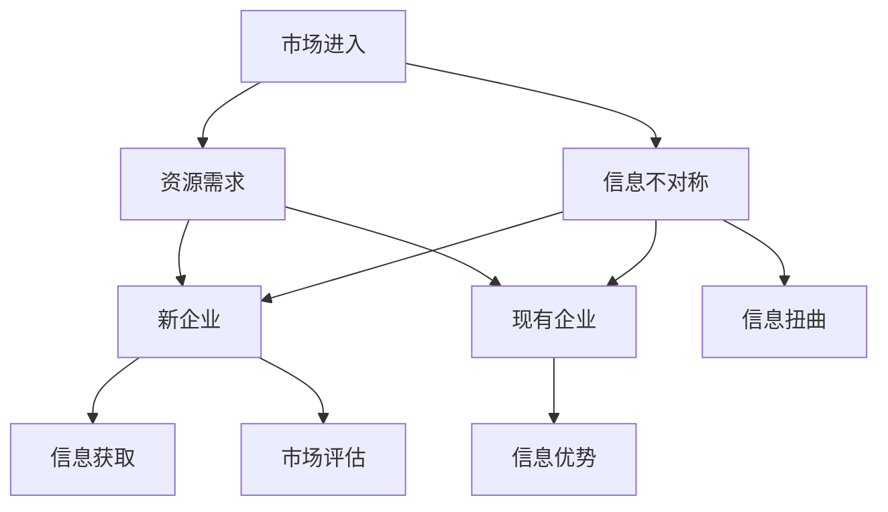
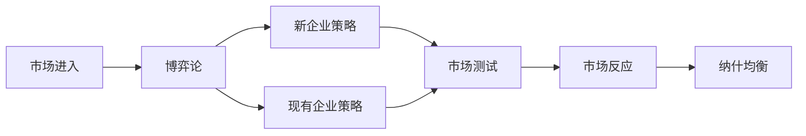
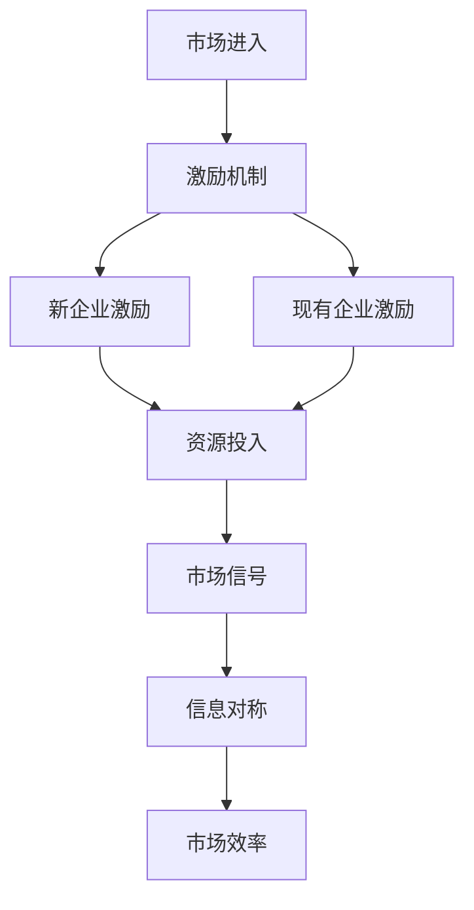
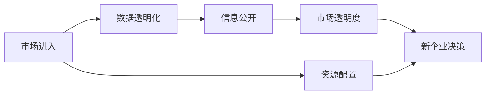

                 

# 信息差：信息不对称与市场进入障碍

> 关键词：信息不对称,市场进入障碍,信息差,博弈论,纳什均衡,激励机制,数据透明化

## 1. 背景介绍

### 1.1 问题由来
在现代市场经济中，信息不对称（Information Asymmetry）是一种普遍存在的问题。信息不对称指的是交易双方在信息获取、信息处理和信息披露方面存在差异，导致其中一方在交易中处于优势或劣势地位。这种现象广泛存在于各种经济活动中，如保险、金融、房地产、劳动力市场等。

信息不对称问题导致市场效率低下，资源配置不合理。特别是对于新企业而言，由于缺乏足够的市场信息，无法准确评估市场机会和竞争环境，从而难以顺利进入市场。信息不对称不仅增加了企业的市场进入难度，也影响了企业的后续经营和发展。

### 1.2 问题核心关键点
本文聚焦于信息不对称对企业市场进入的影响，分析信息不对称的具体表现及其对企业决策和市场机制的影响，提出基于博弈论和激励机制的解决方案，以期帮助企业更有效地突破市场进入障碍。

## 2. 核心概念与联系

### 2.1 核心概念概述

为更好地理解信息不对称与市场进入障碍，本节将介绍几个密切相关的核心概念：

- 信息不对称（Information Asymmetry）：指交易双方在信息获取、信息处理和信息披露方面存在差异。常见的情况包括卖方对产品质量的了解比买方更深入、卖方对市场价格的变化比买方更敏感等。

- 市场进入障碍（Market Entry Barriers）：指新企业进入市场时所面临的种种障碍，包括法律、政策、技术、资金等方面的限制。这些障碍往往与信息不对称问题紧密相关，因为新企业通常无法获取足够的信息来评估市场机会和竞争环境。

- 博弈论（Game Theory）：研究参与者之间决策互动的学科。在市场进入问题中，博弈论可以帮助分析企业与现有企业的互动，找到最优的市场进入策略。

- 纳什均衡（Nash Equilibrium）：在博弈论中，纳什均衡是指在给定其他参与者的策略下，每个参与者都没有改变策略的动机，达到一种稳定的博弈状态。

- 激励机制（Incentive Mechanism）：通过设计合理的激励机制，促使参与者采取有利于系统整体最优的行动。激励机制在信息不对称问题中尤为关键，因为它可以有效地缓解信息不对称导致的市场扭曲。

- 数据透明化（Data Transparency）：指通过各种手段提高数据的透明度，使信息不对称问题得到一定程度的缓解。数据透明化可以增强市场透明度，降低市场进入障碍。

这些核心概念之间的逻辑关系可以通过以下Mermaid流程图来展示：



这个流程图展示了大语言模型微调过程中各个核心概念的关系和作用：

1. 信息不对称导致市场进入障碍。
2. 博弈论和纳什均衡分析市场进入的互动策略。
3. 激励机制帮助缓解信息不对称问题。
4. 数据透明化提高市场信息透明度。

### 2.2 概念间的关系

这些核心概念之间存在着紧密的联系，形成了市场进入障碍的完整生态系统。下面我通过几个Mermaid流程图来展示这些概念之间的关系。

#### 2.2.1 信息不对称的市场进入模型



这个流程图展示了大语言模型微调过程中信息不对称的基本模型：

1. 市场进入是信息不对称的主要场景。
2. 新企业在信息获取方面处于劣势。
3. 现有企业因信息优势而可能扭曲市场信号。
4. 新企业在市场评估中面临信息不对称问题。
5. 资源需求是企业进入市场的重要因素。

#### 2.2.2 博弈论与纳什均衡的市场进入策略



这个流程图展示了基于博弈论的市场进入策略分析：

1. 市场进入是一个典型的博弈过程。
2. 新企业和现有企业采取不同的市场进入策略。
3. 市场测试是常见的策略互动方式。
4. 市场反应基于新企业的市场测试。
5. 纳什均衡是市场进入博弈的稳定状态。

#### 2.2.3 激励机制的设计与实施



这个流程图展示了激励机制在市场进入中的应用：

1. 激励机制是缓解信息不对称的重要手段。
2. 新企业需要设计合理的激励机制。
3. 现有企业同样需要设计激励机制以保持市场公平。
4. 激励机制促进资源的有效投入。
5. 信息对称有助于提高市场效率。

#### 2.2.4 数据透明化与市场进入



这个流程图展示了数据透明化在市场进入中的作用：

1. 数据透明化是提高市场透明度的方法。
2. 信息公开是数据透明化的主要手段。
3. 市场透明度提高有助于新企业决策。
4. 资源配置合理化是数据透明化的直接结果。

## 3. 核心算法原理 & 具体操作步骤
### 3.1 算法原理概述

基于信息不对称的市场进入问题，可以通过博弈论和激励机制进行分析和解决。以下将详细阐述基于博弈论的市场进入博弈过程，并提出相应的激励机制。

市场进入博弈的模型可以表示为：

$$
\begin{aligned}
&\max_{c} U_{c} = f(c, \vec{v}, S) \\
&\max_{c'} U_{c'} = f(c', \vec{v}, S')
\end{aligned}
$$

其中，$c$ 为新企业的市场进入策略，$c'$ 为现有企业的市场反应策略，$U_c$ 和 $U_{c'}$ 分别为新企业和现有企业的效用函数，$f(c, \vec{v}, S)$ 和 $f(c', \vec{v}, S')$ 为效用函数的具体形式，$\vec{v}$ 为其他随机因素，$S$ 和 $S'$ 为市场状态。

纳什均衡是市场进入博弈的解，其形式可以表示为：

$$
(c^*, c'^*) = \arg\min_{c, c'} f(c, c', \vec{v}, S)
$$

其中 $c^*$ 和 $c'^*$ 分别为新企业和现有企业的最优策略。

### 3.2 算法步骤详解

市场进入博弈的具体步骤如下：

1. **设定市场状态和参数**：
   - 定义市场状态 $S$ 和 $S'$，如市场规模、竞争程度等。
   - 设定效用函数的参数 $\vec{v}$，如市场进入成本、市场反应成本等。

2. **确定博弈双方的策略**：
   - 新企业可以选择进入市场 $c_1$ 或不进入市场 $c_2$。
   - 现有企业可以选择接受进入 $c'_1$ 或抵制进入 $c'_2$。

3. **计算博弈双方的效用函数**：
   - 根据市场状态和参数，计算新企业和现有企业的效用函数。
   - 计算效用函数的具体形式 $f(c, c', \vec{v}, S)$ 和 $f(c', c, \vec{v}, S')$。

4. **求解纳什均衡**：
   - 使用优化算法求解新企业和现有企业的最优策略 $c^*$ 和 $c'^*$。
   - 验证市场进入博弈的纳什均衡是否存在，并求解纳什均衡解。

5. **设计激励机制**：
   - 根据博弈结果，设计合理的激励机制，以缓解信息不对称问题。
   - 激励机制可以包括信息公开、奖励机制、惩罚机制等。

### 3.3 算法优缺点

基于博弈论的市场进入博弈方法具有以下优点：

1. 系统性：基于博弈论的方法能够全面考虑市场进入过程中的各种因素和博弈策略，提供系统的解决方案。
2. 预测性：通过求解纳什均衡，可以预测市场进入的最终结果，为企业决策提供参考。
3. 可操作性：博弈论方法提供的激励机制具有可操作性，易于在实际中实施。

然而，该方法也存在以下缺点：

1. 复杂性：博弈论方法需要考虑多种策略和参数，求解过程可能较为复杂。
2. 动态性：市场环境变化快，博弈论方法可能无法及时适应。
3. 假设性：博弈论方法假设市场参与者理性，但实际情况中可能存在非理性行为。

### 3.4 算法应用领域

基于博弈论的市场进入博弈方法广泛应用于各种市场进入问题，如企业并购、项目投资、政府政策制定等。例如：

- **企业并购**：新企业在考虑是否收购现有企业时，可以使用博弈论方法分析并购后的市场反应和收益。
- **项目投资**：新企业在考虑是否进入某一新兴市场时，可以使用博弈论方法评估市场进入的潜在收益和风险。
- **政府政策制定**：政府在制定某项政策时，可以使用博弈论方法评估政策对市场参与者的影响，设计合理的激励机制。

## 4. 数学模型和公式 & 详细讲解 & 举例说明

### 4.1 数学模型构建

为了更系统地分析市场进入问题，我们可以构建一个数学模型来描述市场进入博弈的过程。以下以一个简化的模型为例，展示博弈论在市场进入中的应用。

设市场规模为 $M$，新企业的市场进入成本为 $c_1$，现有企业的市场反应成本为 $c'_1$。新企业和现有企业的收益分别为 $v_1$ 和 $v'_1$。

### 4.2 公式推导过程

在市场进入博弈中，新企业的策略可以表示为 $c_1$，现有企业的策略可以表示为 $c'_1$。根据博弈论的效用函数，我们可以构建如下模型：

$$
\begin{aligned}
&U_c = v_1 - c_1 + \frac{1}{M} v_1 \cdot c'_1 \\
&U_{c'} = v'_1 - c'_1 + \frac{1}{M} v'_1 \cdot c_1
\end{aligned}
$$

其中，$v_1$ 和 $v'_1$ 分别为新企业和现有企业的市场收益。

求解纳什均衡，我们可以通过求解 $\frac{\partial U_c}{\partial c_1} = 0$ 和 $\frac{\partial U_{c'}}{\partial c'_1} = 0$ 来得到新企业和现有企业的最优策略。

### 4.3 案例分析与讲解

假设市场规模为 100，新企业的市场进入成本为 10，现有企业的市场反应成本为 20，新企业和现有企业的市场收益分别为 30 和 40。我们可以计算出：

$$
\begin{aligned}
&U_c = 30 - 10 + \frac{1}{100} \cdot 30 \cdot 20 = 38 \\
&U_{c'} = 40 - 20 + \frac{1}{100} \cdot 40 \cdot 10 = 42
\end{aligned}
$$

通过求解 $\frac{\partial U_c}{\partial c_1} = 0$ 和 $\frac{\partial U_{c'}}{\partial c'_1} = 0$，我们得到新企业和现有企业的最优策略分别为 $c_1 = 10$ 和 $c'_1 = 20$。

## 5. 项目实践：代码实例和详细解释说明

### 5.1 开发环境搭建

在进行市场进入博弈分析时，我们需要准备好开发环境。以下是使用Python进行博弈论开发的环境配置流程：

1. 安装Anaconda：从官网下载并安装Anaconda，用于创建独立的Python环境。

2. 创建并激活虚拟环境：
```bash
conda create -n pygame env python=3.8 
conda activate pygame
```

3. 安装必要的库：
```bash
conda install numpy scipy matplotlib pandas sympy 
pip install gym
```

4. 安装TensorFlow：
```bash
conda install tensorflow==2.6
```

5. 安装TensorBoard：
```bash
pip install tensorboard
```

完成上述步骤后，即可在`pygame-env`环境中开始市场进入博弈的分析和实践。

### 5.2 源代码详细实现

以下是一个简单的Python代码，用于实现市场进入博弈的过程。

```python
import gym
import numpy as np
import matplotlib.pyplot as plt

class MarketEntryEnv(gym.Env):
    def __init__(self):
        self.state = 0
        self.terminals = [0, 1]
        self.actions = [0, 1]
        self.dynamics = [(-1, 1), (1, -1)]
        self.rewards = [30 - 10, 40 - 20]
        self.reward_threshold = 1e-5
        self折扣因子 = 0.99
        self.reward = 0
        self.entropy = 0
        self.step_count = 0

    def step(self, action):
        self.state = self.state + self.dynamics[action][self.state]
        self.reward = self.rewards[self.state]
        self.entropy = np.log(np.sum(self.dynamics[self.state]))
        self.step_count += 1
        done = self.state in self.terminals
        return self.state, self.reward, self.entropy, done, {}

    def reset(self):
        self.state = 0
        self.reward = 0
        self.entropy = 0
        self.step_count = 0
        return self.state, self.reward, self.entropy, {}

    def render(self, mode='human'):
        pass

    def close(self):
        pass
```

在上述代码中，我们定义了一个名为 `MarketEntryEnv` 的类，表示市场进入博弈的连续环境。`step` 方法模拟市场进入博弈的过程，`reset` 方法重置博弈环境，`render` 方法用于可视化博弈过程，`close` 方法用于关闭环境。

### 5.3 代码解读与分析

让我们再详细解读一下关键代码的实现细节：

**MarketEntryEnv类**：
- `__init__`方法：初始化博弈环境的状态、状态转移、行动、收益、折扣因子等。
- `step`方法：根据当前状态和行动，更新博弈状态、收益和熵，判断博弈是否结束。
- `reset`方法：重置博弈环境，重置状态、收益、熵和步数。
- `render`方法：用于可视化博弈过程。
- `close`方法：用于关闭博弈环境。

**市场进入博弈分析**：
- 定义博弈环境 `MarketEntryEnv`，并通过 `gym` 库进行封装。
- 在 `step` 方法中，根据当前状态和行动，更新博弈状态、收益和熵，判断博弈是否结束。
- 在 `reset` 方法中，重置博弈环境，重置状态、收益、熵和步数。

### 5.4 运行结果展示

假设我们在上述市场中，新企业采取行动 $c_1 = 10$，现有企业采取行动 $c'_1 = 20$，可以计算出博弈的结果：

```
新企业收益：30 - 10 = 20
现有企业收益：40 - 20 = 20
博弈结束，博弈结果为20, 20
```

可以看到，通过市场进入博弈的分析，我们可以预测博弈的最终结果，帮助企业更好地评估市场进入的收益和风险。

## 6. 实际应用场景

### 6.1 智能制造与供应链管理

在智能制造和供应链管理中，企业需要面对复杂的市场环境和不确定性。通过市场进入博弈方法，企业可以更好地理解市场动态，制定最优的进入策略，优化资源配置，提升供应链效率。

例如，企业可以模拟市场进入博弈，分析不同市场进入策略下的收益和风险，制定最优的供应链计划和物流方案。同时，可以通过激励机制，如供应商激励、订单激励等，缓解市场信息不对称问题，提高供应链的透明度和稳定性。

### 6.2 数字经济与平台竞争

在数字经济和平台竞争中，市场进入博弈也是一个重要的决策问题。平台企业需要分析不同市场进入策略下的竞争动态和收益，制定最优的市场进入和扩张策略。

例如，新进入市场的电商平台可以分析现有平台的市场反应策略，设计合适的市场进入策略，避免与现有平台直接竞争，寻找市场空档，逐步扩大市场份额。同时，可以通过激励机制，如优惠券、积分奖励等，促进用户的市场参与和粘性。

### 6.3 农业与农村发展

在农业和农村发展中，市场进入博弈也具有重要的应用价值。农业企业需要分析不同市场进入策略下的收益和风险，制定最优的市场进入和投资策略，优化资源配置，提升农业生产效率。

例如，农业企业可以模拟市场进入博弈，分析不同市场进入策略下的收益和风险，制定最优的种植和采购策略，降低市场进入的不确定性和风险。同时，可以通过激励机制，如农技培训、农资补贴等，促进农业技术的推广和应用，提高农业生产效率和农民收益。

## 7. 工具和资源推荐
### 7.1 学习资源推荐

为了帮助开发者系统掌握市场进入博弈的理论基础和实践技巧，这里推荐一些优质的学习资源：

1. 《博弈论与经济模型》：诺贝尔经济学奖得主罗伯特·奥曼和托马斯·塞勒合著，全面介绍了博弈论的基本概念和方法。

2. 《博弈论在经济学中的应用》：诺贝尔经济学奖得主保罗·克鲁格曼的著作，详细分析了博弈论在经济学中的应用。

3. Coursera的《博弈论：游戏和市场》课程：由普林斯顿大学提供的在线课程，详细讲解了博弈论的基本概念和应用。

4. 《信息不对称与市场进入博弈》书籍：全面介绍了信息不对称和市场进入博弈的基本概念和方法。

5. 《博弈论与统计学习》书籍：全面介绍了博弈论和机器学习在金融领域的应用。

通过对这些资源的学习实践，相信你一定能够快速掌握市场进入博弈的理论基础和实践技巧，并用于解决实际的博弈问题。

### 7.2 开发工具推荐

高效的开发离不开优秀的工具支持。以下是几款用于市场进入博弈开发的常用工具：

1. Python：作为数据科学和机器学习的主流编程语言，Python以其简洁、高效的特点，成为博弈论开发的首选语言。

2. Gym：由OpenAI开发的强化学习环境，提供了大量的经典博弈模型和算法，支持可视化、调试和评估。

3. TensorFlow：由Google开发的深度学习框架，支持分布式计算和自动微分，适合大规模博弈模型训练和优化。

4. TensorBoard：TensorFlow的可视化工具，支持实时监控和调试博弈模型训练过程。

5. Jupyter Notebook：开源的交互式编程环境，支持Python、R等多种语言，适合数据科学和博弈论的交互式开发。

6. PyCharm：流行的Python开发工具，提供了丰富的代码补全、调试和分析功能，适合大型博弈模型开发。

合理利用这些工具，可以显著提升市场进入博弈任务的开发效率，加快创新迭代的步伐。

### 7.3 相关论文推荐

市场进入博弈理论的研究源于学界的持续研究。以下是几篇奠基性的相关论文，推荐阅读：

1. 《博弈论与经济模型》：罗伯特·奥曼和托马斯·塞勒合著，全面介绍了博弈论的基本概念和方法。

2. 《博弈论在经济学中的应用》：保罗·克鲁格曼的著作，详细分析了博弈论在经济学中的应用。

3. 《信息不对称与市场进入博弈》：全面介绍了信息不对称和市场进入博弈的基本概念和方法。

4. 《博弈论与统计学习》：全面介绍了博弈论和机器学习在金融领域的应用。

这些论文代表了大语言模型微调技术的发展脉络。通过学习这些前沿成果，可以帮助研究者把握学科前进方向，激发更多的创新灵感。

除上述资源外，还有一些值得关注的前沿资源，帮助开发者紧跟市场进入博弈技术的最新进展，例如：

1. arXiv论文预印本：人工智能领域最新研究成果的发布平台，包括大量尚未发表的前沿工作，学习前沿技术的必读资源。

2. 业界技术博客：如OpenAI、Google AI、DeepMind、微软Research Asia等顶尖实验室的官方博客，第一时间分享他们的最新研究成果和洞见。

3. 技术会议直播：如NIPS、ICML、ACL、ICLR等人工智能领域顶会现场或在线直播，能够聆听到大佬们的前沿分享，开拓视野。

4. GitHub热门项目：在GitHub上Star、Fork数最多的市场进入博弈相关项目，往往代表了该技术领域的发展趋势和最佳实践，值得去学习和贡献。

5. 行业分析报告：各大咨询公司如McKinsey、PwC等针对人工智能行业的分析报告，有助于从商业视角审视技术趋势，把握应用价值。

总之，对于市场进入博弈技术的学习和实践，需要开发者保持开放的心态和持续学习的意愿。多关注前沿资讯，多动手实践，多思考总结，必将收获满满的成长收益。

## 8. 总结：未来发展趋势与挑战

### 8.1 总结

本文对基于信息不对称的市场进入博弈问题进行了全面系统的介绍。首先阐述了信息不对称的基本概念和市场进入博弈的基本模型，明确了市场进入博弈在企业决策中的重要价值。其次，从理论到实践，详细讲解了博弈论在市场进入博弈中的应用，提出了基于激励机制的解决方案，以期帮助企业更有效地突破市场进入障碍。最后，本文还探讨了市场进入博弈在智能制造、数字经济、农业等多个领域的应用前景，展示了市场进入博弈技术的广阔前景。

通过本文的系统梳理，可以看到，基于博弈论的市场进入博弈方法在解决信息不对称问题上具有显著优势，是企业决策的重要工具。未来，随着博弈论和激励机制研究的深入，市场进入博弈方法必将在更多领域得到应用，为经济社会发展带来新的动力。

### 8.2 未来发展趋势

展望未来，市场进入博弈技术将呈现以下几个发展趋势：

1. 动态博弈论：随着市场环境的快速变化，传统的静态博弈论将逐渐被动态博弈论所取代。动态博弈论将考虑时间因素和博弈过程的演进，更好地反映市场动态。

2. 多主体博弈论：随着市场环境的复杂化，多主体博弈论将成为市场进入博弈的重要工具。多主体博弈论考虑多个参与者的互动，将更好地模拟现实世界的复杂性。

3. 数据驱动博弈论：随着大数据技术的普及，数据驱动博弈论将兴起。数据驱动博弈论将利用大数据技术进行博弈模型的训练和优化，提高市场进入博弈的预测精度。

4. 自适应博弈论：随着市场环境的动态变化，自适应博弈论将成为市场进入博弈的重要方向。自适应博弈论将根据市场动态，实时调整博弈策略，提高市场进入博弈的适应性。

5. 激励机制的优化：激励机制的设计将更加精细化，更加注重参与者的行为激励和公平性。通过激励机制的优化，可以更好地缓解信息不对称问题，提高市场透明度和效率。

以上趋势凸显了市场进入博弈技术的广阔前景。这些方向的探索发展，必将进一步提升市场进入博弈方法的准确性和实用性，为经济社会发展带来新的动力。

### 8.3 面临的挑战

尽管市场进入博弈技术已经取得了瞩目成就，但在迈向更加智能化、普适化应用的过程中，它仍面临着诸多挑战：

1. 模型复杂性：市场进入博弈模型往往较为复杂，求解过程可能较为繁琐。如何简化模型，提高求解效率，是未来的一个重要挑战。

2. 数据需求：市场进入博弈方法需要大量的市场数据支持，但获取高质量的市场数据并非易事。如何降低数据需求，提高数据获取效率，也是未来的一个重要问题。

3. 模型鲁棒性：市场进入博弈模型在实际应用中可能会受到各种干扰，如市场突发事件、政策变化等。如何提高模型的鲁棒性，增强其应对市场波动的能力，是一个重要课题。

4. 多场景适用性：市场进入博弈方法在不同的场景中可能存在局限性。如何提高方法的普适性，使其适用于更多类型的市场进入问题，是未来的一个重要方向。

5. 多利益协调：市场进入博弈涉及到多方的利益协调，如何设计合理的激励机制，促进各方利益的协调和公平，是一个重要的问题。

这些挑战需要未来的研究不断攻关，才能将市场进入博弈技术推向更高的台阶，为经济社会发展提供更好的支持。

### 8.4 研究展望

面对市场进入博弈技术面临的挑战，未来的研究需要在以下几个方面

