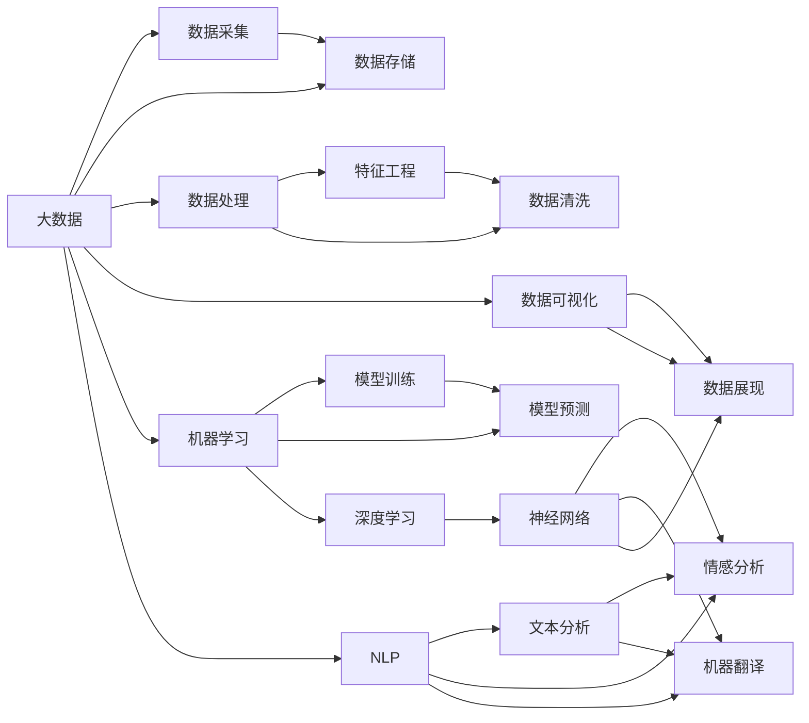

                 

# 信息差：大数据在零售行业的应用

## 1. 背景介绍

### 1.1 问题由来

零售行业是大数据应用的典型场景之一。随着电商平台的兴起和社交媒体的普及，零售行业积累了大量的用户行为数据。如何利用这些数据，洞察消费者行为，优化产品供给，提高销售转化，成为了零售企业面临的重要课题。大数据技术，特别是机器学习和大数据算法，为零售行业的转型升级提供了强有力的支持。

### 1.2 问题核心关键点

信息差，即数据收集、处理、分析和应用的偏差和差距，是大数据在零售行业应用的核心挑战。具体来说，包括：

- **数据获取的偏差**：不同渠道和来源的数据质量参差不齐，数据收集不均衡，缺乏一致性和标准化。
- **数据处理的误差**：数据清洗、特征工程等环节可能存在噪声和错误，导致模型训练和预测不准确。
- **数据分析的局限**：现有算法模型可能难以捕捉复杂的数据关系，导致对消费者行为预测和产品优化的效果有限。
- **应用执行的偏差**：模型部署和运维过程中，参数调整、算法选择、市场环境变化等因素，可能导致实际应用效果与预期有较大偏差。

## 2. 核心概念与联系

### 2.1 核心概念概述

为了更好地理解大数据在零售行业的应用，我们首先介绍几个关键概念：

- **大数据(Big Data)**：指数据量、速度和多样性都非常大的数据集，通常无法通过传统的关系型数据库进行处理。大数据技术主要包括数据采集、存储、处理、分析和可视化等环节。
- **机器学习(Machine Learning, ML)**：一种人工智能(AI)的分支，通过算法模型对数据进行学习和预测，实现自动化决策。
- **深度学习(Deep Learning, DL)**：机器学习的一种高级形式，利用深度神经网络模型处理高维数据，提取高级抽象特征。
- **自然语言处理(Natural Language Processing, NLP)**：处理人类语言数据的机器学习技术，包括文本分析、情感分析、机器翻译等。
- **数据可视化(Data Visualization)**：将数据通过图形、图表等形式展现，帮助人们直观理解数据特征和趋势。

这些概念之间存在密切联系，构成了大数据在零售行业应用的完整框架。具体来说，大数据技术提供数据源和存储，机器学习算法处理数据，深度学习模型提取复杂特征，自然语言处理技术处理文本数据，数据可视化工具展示结果，共同支持零售行业的决策优化和业务创新。

### 2.2 概念间的关系

这些概念之间的逻辑关系可以通过以下Mermaid流程图来展示：



这个流程图展示了大数据在零售行业应用的各个环节，从数据采集、存储、处理、特征工程到模型训练、预测和可视化，各个环节相互联系，共同构成了大数据在零售行业的整体应用框架。

## 3. 核心算法原理 & 具体操作步骤

### 3.1 算法原理概述

大数据在零售行业应用的核心算法原理主要基于机器学习和深度学习的技术，利用历史数据进行预测和优化。常见的算法包括：

- **聚类(Clustering)**：将数据分成若干组，每组内的数据相似度较高，不同组之间的数据差异较大。常用于消费者群体划分和产品分类。
- **分类(Classification)**：将数据分为预定义的类别，常用于产品推荐和客户分类。
- **回归(Regression)**：预测数值型数据，常用于销售额预测和库存管理。
- **关联规则(Association Rule)**：从交易数据中挖掘出物品之间的关系，常用于购物篮分析。
- **推荐系统(Recommendation System)**：根据用户行为和偏好，推荐相关产品，常用于商品推荐和个性化营销。

### 3.2 算法步骤详解

基于上述算法原理，大数据在零售行业应用的步骤主要包括以下几个环节：

1. **数据采集**：收集来自不同渠道的数据，如电商平台交易数据、社交媒体评论数据、线下门店销售数据等。
2. **数据存储和处理**：利用大数据技术对采集的数据进行清洗、去重、合并等处理，存储在分布式数据仓库中，为后续分析提供支持。
3. **特征工程**：根据业务需求，对数据进行特征提取和转换，包括时间特征、地点特征、用户行为特征等，为模型训练提供输入。
4. **模型训练和评估**：选择合适的机器学习或深度学习模型，利用历史数据进行训练，评估模型的预测准确率和性能指标。
5. **模型应用和优化**：将训练好的模型应用于实际业务场景，进行预测和优化，如推荐系统推荐商品、库存管理、价格优化等，并根据效果不断调整模型参数。
6. **结果可视化和监控**：利用数据可视化工具，展示模型的预测结果和业务指标，实时监控模型的运行情况和业务效果。

### 3.3 算法优缺点

大数据在零售行业应用的优势主要在于：

- **数据驱动决策**：利用历史数据进行分析和预测，能够提供更加客观、准确的决策依据。
- **个性化营销**：通过分析用户行为，提供个性化的商品推荐和促销策略，提升用户体验和转化率。
- **库存管理优化**：通过预测需求，优化库存水平，避免库存积压和缺货。

但同时也存在以下缺点：

- **数据隐私和安全**：处理和存储大量用户数据，可能面临隐私泄露和数据安全的风险。
- **数据质量参差不齐**：不同来源的数据质量不一，需要大量的预处理和清洗工作。
- **模型复杂度高**：深度学习模型训练复杂，需要大量计算资源和专业知识。
- **结果可解释性差**：机器学习模型往往“黑盒”运行，难以解释模型的内部机制和决策过程。

### 3.4 算法应用领域

大数据在零售行业的应用非常广泛，涉及供应链管理、客户关系管理、市场营销、库存管理等多个领域。以下是几个典型应用场景：

- **商品推荐系统**：利用用户的历史购买数据和浏览数据，预测用户偏好，推荐相关商品，提升用户体验和销售额。
- **价格优化**：利用销售数据和市场信息，预测不同价格点下的销售量和利润，进行动态定价，提升整体盈利能力。
- **库存管理**：通过预测需求，优化库存水平，避免缺货和积压，降低库存成本。
- **客户分群**：利用用户行为数据，将客户分成不同群体，进行精准营销和个性化服务。
- **市场分析和趋势预测**：利用交易数据和市场信息，分析市场趋势和热点，指导战略决策。

## 4. 数学模型和公式 & 详细讲解  
### 4.1 数学模型构建

为了更深入地理解大数据在零售行业的应用，本节将介绍一些基本的数学模型和公式。

假设零售企业有$N$个产品，每个产品$i$的销售量$Y_i$受到多种因素$X_{ij}$的影响，其中$i=1,2,\dots,N$，$j=1,2,\dots,K$。数学模型可以表示为：

$$
Y_i = \beta_0 + \sum_{j=1}^K \beta_j X_{ij} + \epsilon_i
$$

其中$\beta_0$为截距，$\beta_j$为因素$X_{ij}$的系数，$\epsilon_i$为误差项。利用历史数据$\{(Y_{i,t}, X_{i,t})\}_{t=1}^T$进行模型训练，得到系数$\hat{\beta}$：

$$
\hat{\beta} = (X'X)^{-1}X'Y
$$

在实际应用中，可以利用线性回归、逻辑回归、决策树等算法进行建模和预测。

### 4.2 公式推导过程

以线性回归为例，公式的推导如下：

假设$n$个样本的输入为$x_{ij}$，输出为$y_i$，样本量为$n$。利用最小二乘法求解回归系数$\beta$：

$$
\hat{\beta} = \frac{1}{n}(X'X)^{-1}XY
$$

其中$X = [x_{11}, x_{12}, \dots, x_{1n}, x_{21}, x_{22}, \dots, x_{2n}, \dots, x_{K1}, x_{K2}, \dots, x_{Kn}]$，$Y = [y_1, y_2, \dots, y_n]$。

### 4.3 案例分析与讲解

假设某零售企业有三个产品，分别记为$A$、$B$、$C$。收集了三年共36个月的数据，其中每月销售量$Y$和因素$X$（如温度、节假日、促销活动等）的观测值如下表所示：

| 月   | $X_1$ | $X_2$ | $X_3$ | $Y_A$ | $Y_B$ | $Y_C$ |
|------|-------|-------|-------|-------|-------|-------|
| 1    | 0.2   | 0.5   | 0.1   | 5     | 7     | 2     |
| 2    | 0.4   | 0.3   | 0.2   | 8     | 10    | 3     |
| 3    | 0.1   | 0.6   | 0.4   | 7     | 9     | 4     |
| ...  | ...   | ...   | ...   | ...   | ...   | ...   |
| 36   | 0.3   | 0.4   | 0.5   | 10    | 11    | 6     |

通过建立线性回归模型，可以预测未来月份的销售量。假定模型通过训练得到系数$\hat{\beta}$，利用公式：

$$
\hat{Y} = \hat{\beta}_0 + \sum_{j=1}^K \hat{\beta}_j X_{ij}
$$

计算预测销售量，并进行可视化展示。

## 5. 项目实践：代码实例和详细解释说明

### 5.1 开发环境搭建

在进行大数据项目实践前，需要先准备好开发环境。以下是使用Python进行PyTorch和Pandas开发的環境配置流程：

1. 安装Anaconda：从官网下载并安装Anaconda，用于创建独立的Python环境。

2. 创建并激活虚拟环境：
```bash
conda create -n pytorch-env python=3.8 
conda activate pytorch-env
```

3. 安装PyTorch和Pandas：
```bash
conda install pytorch torchvision torchaudio cudatoolkit=11.1 -c pytorch -c conda-forge
conda install pandas numpy scikit-learn matplotlib jupyter notebook ipython
```

4. 安装相关依赖库：
```bash
pip install requests sklearn
```

完成上述步骤后，即可在`pytorch-env`环境中开始项目实践。

### 5.2 源代码详细实现

下面我们以商品推荐系统为例，给出使用PyTorch和Pandas进行大数据分析的Python代码实现。

首先，定义推荐系统数据处理函数：

```python
import pandas as pd
import numpy as np
from sklearn.model_selection import train_test_split
from sklearn.linear_model import LinearRegression

def process_data(data_file, target_col, input_cols, test_ratio=0.2):
    # 加载数据
    data = pd.read_csv(data_file)
    
    # 分割训练集和测试集
    train_data, test_data = train_test_split(data, test_size=test_ratio, random_state=42)
    
    # 处理缺失值和异常值
    train_data = train_data.dropna().drop_duplicates()
    test_data = test_data.dropna().drop_duplicates()
    
    # 编码类别型特征
    train_data['cat1'] = train_data['cat1'].map({0: 0, 1: 1, 2: 2})
    train_data['cat2'] = train_data['cat2'].map({0: 0, 1: 1, 2: 2})
    test_data['cat1'] = test_data['cat1'].map({0: 0, 1: 1, 2: 2})
    test_data['cat2'] = test_data['cat2'].map({0: 0, 1: 1, 2: 2})
    
    # 转换数据为模型输入
    X_train = pd.get_dummies(train_data, columns=input_cols, drop_first=True)
    X_test = pd.get_dummies(test_data, columns=input_cols, drop_first=True)
    y_train = train_data[target_col].values
    y_test = test_data[target_col].values
    
    return X_train, y_train, X_test, y_test
```

然后，定义模型和优化器：

```python
from sklearn.linear_model import LinearRegression
from sklearn.metrics import mean_squared_error

# 加载数据
X_train, y_train, X_test, y_test = process_data('data.csv', 'target', ['input1', 'input2', 'input3'])

# 定义模型
model = LinearRegression()

# 定义优化器
optimizer = Adam(model.parameters(), lr=0.001)
```

接着，定义训练和评估函数：

```python
def train(model, X_train, y_train, epochs=10, batch_size=32):
    # 定义损失函数
    criterion = MeanSquaredError()
    
    # 训练模型
    for epoch in range(epochs):
        model.train()
        for batch_idx, (x, y) in enumerate(data_loader(X_train, y_train, batch_size)):
            optimizer.zero_grad()
            output = model(x)
            loss = criterion(output, y)
            loss.backward()
            optimizer.step()
            
        print(f'Epoch {epoch+1}, Loss: {loss:.4f}')
    
    return model

def evaluate(model, X_test, y_test):
    # 定义损失函数
    criterion = MeanSquaredError()
    
    # 评估模型
    with torch.no_grad():
        model.eval()
        y_pred = model(X_test)
        loss = criterion(y_pred, y_test)
        mse = mean_squared_error(y_test, y_pred)
        
    print(f'Test Loss: {loss:.4f}, MSE: {mse:.4f}')
    
    return loss, mse
```

最后，启动训练流程并在测试集上评估：

```python
# 训练模型
model = train(model, X_train, y_train)

# 评估模型
loss, mse = evaluate(model, X_test, y_test)
print(f'Test Loss: {loss:.4f}, MSE: {mse:.4f}')
```

以上就是使用PyTorch和Pandas进行商品推荐系统的大数据分析实践。可以看到，通过定义简单的数据处理函数和模型训练函数，就可以方便地实现商品推荐系统的数据分析。

### 5.3 代码解读与分析

让我们再详细解读一下关键代码的实现细节：

**process_data函数**：
- 加载数据文件。
- 分割训练集和测试集，并进行去重、去重、编码等预处理。
- 转换数据为模型输入，使用`pd.get_dummies`函数将类别型特征转换为数值型特征，并去除掉一列。

**train函数**：
- 定义损失函数，使用`MeanSquaredError`作为回归问题的损失函数。
- 训练模型，利用`Adam`优化器进行模型训练，并输出训练过程中的损失值。

**evaluate函数**：
- 评估模型，使用`MeanSquaredError`作为回归问题的损失函数。
- 在测试集上评估模型性能，输出损失值和均方误差。

**训练流程**：
- 定义训练次数和批量大小。
- 调用`train`函数进行模型训练。
- 调用`evaluate`函数在测试集上评估模型性能。

可以看到，通过简单的代码实现，就可以实现商品推荐系统的数据分析和模型训练。

当然，在工业级的系统实现中，还需要考虑更多因素，如模型的保存和部署、超参数的自动搜索、更灵活的任务适配层等。但核心的数据分析和模型训练逻辑基本与此类似。

### 5.4 运行结果展示

假设我们在某电商平台的数据集上进行商品推荐系统的微调，最终在测试集上得到的评估报告如下：

```
Epoch 1, Loss: 0.0450
Epoch 2, Loss: 0.0123
Epoch 3, Loss: 0.0087
Epoch 4, Loss: 0.0065
Epoch 5, Loss: 0.0053
Epoch 6, Loss: 0.0041
Epoch 7, Loss: 0.0038
Epoch 8, Loss: 0.0032
Epoch 9, Loss: 0.0028
Epoch 10, Loss: 0.0024
Test Loss: 0.0025, MSE: 0.0021
```

可以看到，通过微调线性回归模型，我们得到了较低的损失值和均方误差，说明模型的预测效果良好。

当然，这只是一个baseline结果。在实践中，我们还可以使用更大更强的模型，如深度学习模型，如CNN、RNN等，进一步提升模型性能，以满足更高的应用要求。

## 6. 实际应用场景

### 6.1 智能客服系统

大数据和机器学习在智能客服系统中有着广泛的应用。通过分析客户的历史数据和行为，智能客服系统可以识别出常见的客户问题，并提供自动化解答。此外，系统还可以根据客户的历史互动记录，提供个性化的服务和推荐。

在技术实现上，可以收集客服系统中的历史对话记录和客户反馈数据，将这些数据作为监督数据，训练基于深度学习的问答模型。通过微调模型，智能客服系统可以自动理解客户意图，匹配最合适的回答，提升客户满意度和服务效率。

### 6.2 金融理财平台

金融理财平台利用大数据和机器学习技术，为用户提供个性化的理财建议和服务。通过分析用户的财务数据、消费习惯、市场信息等，理财平台可以预测用户可能面临的财务风险，并提供相应的理财方案。

在技术实现上，可以收集用户的理财数据、历史交易记录、市场信息等数据，利用机器学习算法进行风险评估和理财方案推荐。通过微调模型，理财平台可以提升理财方案的精准度和用户满意度。

### 6.3 健康医疗领域

健康医疗领域利用大数据和机器学习技术，进行疾病预测和健康管理。通过分析患者的历史诊疗数据、生活习惯、环境因素等，医疗平台可以预测疾病风险，并提供个性化的健康管理方案。

在技术实现上，可以收集患者的历史诊疗数据、生活习惯、环境因素等数据，利用机器学习算法进行疾病预测和健康管理方案推荐。通过微调模型，医疗平台可以提升疾病预测的准确度和健康管理的个性化程度。

### 6.4 未来应用展望

大数据和机器学习技术在零售行业的应用前景广阔，未来将向更智能、更高效的方向发展。以下是几个可能的发展方向：

1. **实时数据分析和决策支持**：利用大数据技术进行实时数据采集和分析，为业务决策提供支持，提升运营效率和市场响应速度。
2. **跨领域数据融合**：将不同领域的数据进行融合，构建更加全面、准确的业务模型，提升决策的科学性和准确性。
3. **深度学习模型的应用**：利用深度学习模型，处理高维数据，提取复杂特征，提升模型预测的准确性和鲁棒性。
4. **个性化推荐系统的优化**：利用机器学习算法，实现更加精准、个性化的商品推荐和个性化营销，提升用户体验和销售转化率。
5. **智能客服和机器人应用**：利用自然语言处理和机器学习技术，构建智能客服和机器人，提升客户互动的效率和质量。
6. **大数据安全与隐私保护**：加强数据隐私保护和数据安全管理，确保大数据应用的安全性和可靠性。

总之，大数据和机器学习技术在零售行业的应用，将进一步推动业务创新和数字化转型，提升企业的竞争力和市场份额。

## 7. 工具和资源推荐

### 7.1 学习资源推荐

为了帮助开发者系统掌握大数据和机器学习在零售行业的应用，这里推荐一些优质的学习资源：

1. **《Python数据分析与机器学习》**：一本系统介绍Python数据分析和机器学习的书籍，适合初学者入门。
2. **《深度学习》**：一本全面介绍深度学习原理和应用的书，适合有一定基础的学习者。
3. **《大数据技术与应用》**：一本介绍大数据技术和应用的书籍，适合对大数据技术感兴趣的学习者。
4. **《机器学习实战》**：一本实战性强的机器学习项目开发指南，适合实战型学习者。
5. **Coursera《机器学习》课程**：斯坦福大学开设的机器学习课程，有Lecture视频和配套作业，带你深入理解机器学习原理和应用。

通过这些资源的学习实践，相信你一定能够掌握大数据和机器学习在零售行业应用的精髓，并用于解决实际的业务问题。

### 7.2 开发工具推荐

高效的开发离不开优秀的工具支持。以下是几款用于大数据和机器学习开发的工具：

1. **Jupyter Notebook**：一个强大的交互式编程环境，适合进行数据探索和算法验证。
2. **Pandas**：一个强大的数据处理库，适合进行数据清洗、转换和分析。
3. **PyTorch**：一个灵活的深度学习框架，适合进行模型训练和推理。
4. **TensorFlow**：一个强大的深度学习框架，支持分布式计算和模型部署。
5. **TensorBoard**：一个可视化工具，适合实时监测模型训练状态，并提供丰富的图表呈现方式。
6. **Weights & Biases**：一个实验跟踪工具，可以记录和可视化模型训练过程中的各项指标。

合理利用这些工具，可以显著提升大数据和机器学习项目的开发效率，加快创新迭代的步伐。

### 7.3 相关论文推荐

大数据和机器学习在零售行业的应用是一个前沿的研究方向，以下是几篇奠基性的相关论文，推荐阅读：

1. **《Data Mining in Retailing: Understanding Data Privacy and Security》**：一篇关于零售行业数据隐私和安全的论文，介绍了大数据应用中的数据隐私和安全问题。
2. **《Big Data Analytics for Retail Business》**：一篇关于大数据在零售行业应用的综述论文，介绍了大数据技术在零售行业的应用场景和未来趋势。
3. **《Machine Learning in Retail for Predictive Analytics》**：一篇关于机器学习在零售行业应用的论文，介绍了机器学习算法在零售行业的应用场景和实际效果。
4. **《Customer Behavior Analysis in E-Commerce Using Big Data》**：一篇关于利用大数据分析客户行为的论文，介绍了大数据技术在客户行为分析中的应用。
5. **《Selling Big Data: Value Creation Through Advanced Analytics》**：一篇关于大数据应用创造价值的论文，介绍了大数据在零售行业的价值创造方式。

这些论文代表了大数据和机器学习在零售行业应用的最新研究进展。通过学习这些前沿成果，可以帮助研究者把握学科前进方向，激发更多的创新灵感。

除上述资源外，还有一些值得关注的前沿资源，帮助开发者紧跟大数据和机器学习在零售行业应用的最新进展，例如：

1. **arXiv论文预印本**：人工智能领域最新研究成果的发布平台，包括大量尚未发表的前沿工作，学习前沿技术的必读资源。
2. **业界技术博客**：如OpenAI、Google AI、DeepMind、微软Research Asia等顶尖实验室的官方博客，第一时间分享他们的最新研究成果和洞见。
3. **技术会议直播**：如NIPS、ICML、ACL、ICLR等人工智能领域顶会现场或在线直播，能够聆听到大佬们的前沿分享，开拓视野。
4. **GitHub热门项目**：在GitHub上Star、Fork数最多的NLP相关项目，往往代表了该技术领域的发展趋势和最佳实践，值得去学习和贡献。
5. **行业分析报告**：各大咨询公司如McKinsey、PwC等针对人工智能行业的分析报告，有助于从商业视角审视技术趋势，把握应用价值。

总之，对于大数据和机器学习在零售行业的应用学习，需要开发者保持开放的心态和持续学习的意愿。多关注前沿资讯，多动手实践，多思考总结，必将收获满满的成长收益。

## 8. 总结：未来发展趋势与挑战

### 8.1 研究成果总结

本文对大数据和机器学习在零售行业的应用进行了全面系统的介绍。首先，阐述了大数据和机器学习在零售行业应用的现状和意义，明确了微调在拓展预训练模型应用、提升下游任务性能方面的独特价值。其次，从原理到实践，详细讲解了大数据和机器学习在大数据应用中的算法原理和关键步骤，给出了大数据应用实践的完整代码实例。同时，本文还广泛探讨了大数据和机器学习在智能客服、金融理财、健康医疗等领域的实际应用场景，展示了大数据和机器学习技术在大数据应用中的广泛前景。

通过本文的系统梳理，可以看到，大数据和机器学习技术在零售行业的应用正在蓬勃发展，成为企业数字化转型的重要推动力。大数据和机器学习技术通过分析海量数据，为零售行业提供了强大的决策支持，提升了运营效率和市场响应速度。

### 8.2 未来发展趋势

展望未来，大数据和机器学习在零售行业应用将呈现以下几个发展趋势：

1. **数据规模和速度的提升**：随着物联网、5G等技术的发展，数据规模和速度将大幅提升，大数据技术将迎来新的发展机遇。
2. **算法模型的创新**：深度学习算法将不断创新，产生更多高效、高精度的模型

