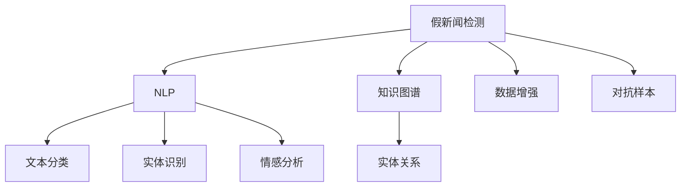
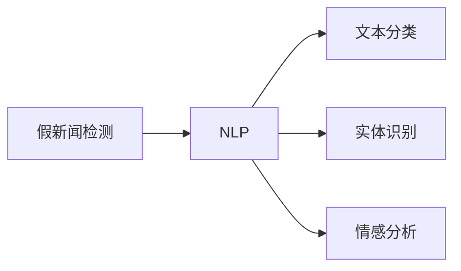
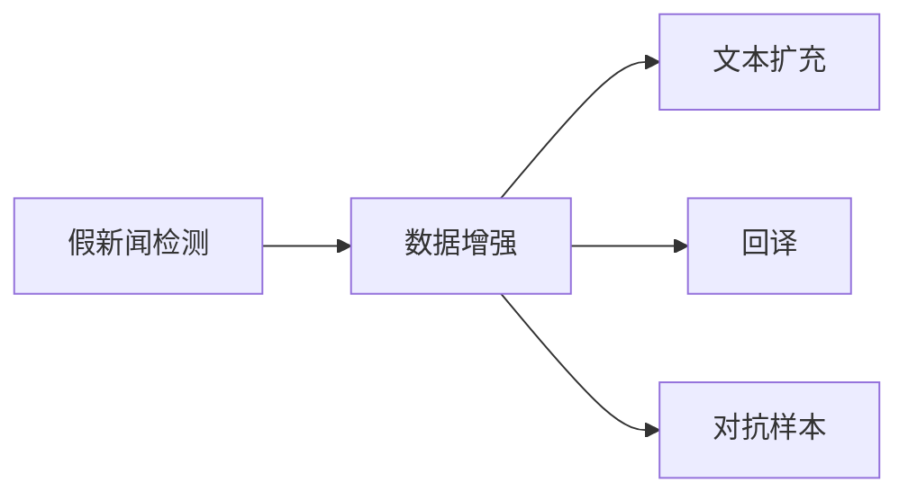
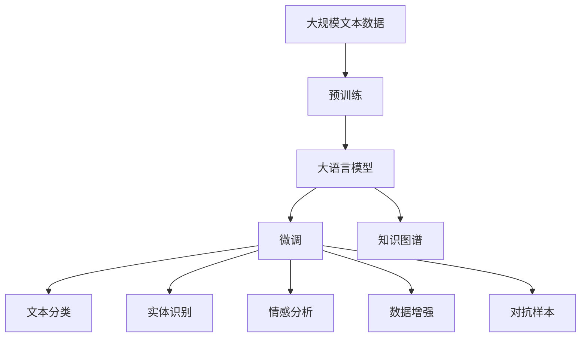

                 

# 信息验证和批判性思维能力培养：在假新闻和错误信息时代导航

> 关键词：假新闻、信息验证、批判性思维、人工智能、自然语言处理(NLP)

## 1. 背景介绍

### 1.1 问题由来

在当前信息爆炸的时代，假新闻和错误信息的泛滥已成为全球性问题。根据多项研究表明，假新闻不仅误导公众认知，还对政治、经济、社会乃至国家安全造成严重影响。例如，2016年美国大选期间，假新闻被指出是影响选民投票决策的关键因素之一。这种趋势在全球范围内不断加剧，尤其在社交媒体平台上，假新闻和错误信息传播速度更快，影响范围更广。

### 1.2 问题核心关键点

解决假新闻和错误信息的关键在于构建高效、可靠的假新闻检测和纠正机制。这需要从技术和哲学两个层面进行系统性思考和研究：

1. **技术层面**：利用人工智能和自然语言处理技术，构建假新闻检测系统。该系统能够自动识别和标记可能含有虚假信息的文章，提供事实核查依据。
2. **哲学层面**：培养用户的批判性思维能力，提高公众识别和抵制假新闻的能力。这涉及到教育、媒体素养、信息素养等多方面的内容。

本文将聚焦于技术层面，探讨利用人工智能技术构建假新闻检测系统的核心原理和具体操作步骤，并给出详细的实现案例。同时，文章还将介绍如何通过知识图谱、数据增强等技术手段，进一步提升系统的效果。

## 2. 核心概念与联系

### 2.1 核心概念概述

为更好地理解基于人工智能的假新闻检测系统，本节将介绍几个密切相关的核心概念：

- **假新闻检测**：通过人工智能技术自动识别和标记可能含有虚假信息的文章，提供事实核查依据。
- **自然语言处理(NLP)**：人工智能技术的一个分支，专注于使计算机能够理解和生成人类语言，包括文本分类、实体识别、情感分析等任务。
- **知识图谱**：结构化的语义知识库，用于存储和检索实体之间的关系。
- **数据增强**：通过一系列数据处理技术，扩充训练数据集，增强模型泛化能力。
- **对抗样本**：为了检测和提升模型鲁棒性，故意设计的扰动样本，可以用于识别模型缺陷。

这些核心概念之间的逻辑关系可以通过以下Mermaid流程图来展示：



这个流程图展示了大规模语言模型微调的假设验证和批判性思维能力培养的核心概念及其之间的关系：

1. 假新闻检测主要通过NLP技术实现。
2. NLP技术包括文本分类、实体识别、情感分析等任务，利用知识图谱增强模型的理解能力。
3. 知识图谱提供了实体的关系信息，帮助NLP模型更好地理解文本。
4. 数据增强和对抗样本用于提升模型的鲁棒性和泛化能力。

### 2.2 概念间的关系

这些核心概念之间存在着紧密的联系，形成了假新闻检测系统的完整生态系统。下面我们通过几个Mermaid流程图来展示这些概念之间的关系。

#### 2.2.1 假新闻检测的NLP实现



这个流程图展示了假新闻检测技术主要通过NLP技术实现，包括文本分类、实体识别和情感分析等任务。

#### 2.2.2 知识图谱在假新闻检测中的应用


这个流程图展示了知识图谱在假新闻检测中的应用，通过提取实体之间的关系，帮助NLP模型更好地理解文本内容。

#### 2.2.3 数据增强在假新闻检测中的应用



这个流程图展示了数据增强在假新闻检测中的应用，包括文本扩充、回译和对抗样本生成等技术。

### 2.3 核心概念的整体架构

最后，我们用一个综合的流程图来展示这些核心概念在大规模语言模型微调过程中的整体架构：



这个综合流程图展示了从预训练到微调，再到知识图谱增强、NLP任务适配等完整过程。大规模语言模型首先在大规模文本数据上进行预训练，然后通过微调（包括文本分类、实体识别、情感分析等任务适配），增强模型的理解能力。利用知识图谱和数据增强技术，进一步提升模型的泛化能力和鲁棒性，最终构建出可靠的假新闻检测系统。 通过这些流程图，我们可以更清晰地理解假新闻检测过程中各个核心概念的关系和作用，为后续深入讨论具体的技术细节奠定基础。

## 3. 核心算法原理 & 具体操作步骤
### 3.1 算法原理概述

基于人工智能的假新闻检测系统，本质上是一个结合了自然语言处理和深度学习技术的文本分类问题。其核心思想是：将文章归类为真实新闻或假新闻，并在必要时进行事实核查，提供纠正依据。

形式化地，假设假新闻检测系统 $M_{\theta}$，其中 $\theta$ 为模型的参数。给定一篇文章 $x$ 作为输入，系统输出的类别标签为 $y \in \{真实新闻, 假新闻\}$。检测系统 $M_{\theta}$ 的输出是文章 $x$ 属于真实新闻的概率 $P(y=真实新闻|x)$。

为了最大化 $P(y=真实新闻|x)$，假新闻检测系统通过优化损失函数 $L$ 来调整模型参数 $\theta$。常见的损失函数包括交叉熵损失、对数损失等。目标是最小化损失函数 $L$，即：

$$
\theta^* = \mathop{\arg\min}_{\theta} L(M_{\theta}(x), y)
$$

其中 $y$ 为文章 $x$ 的真实标签。

### 3.2 算法步骤详解

基于人工智能的假新闻检测系统的一般步骤如下：

**Step 1: 准备预训练模型和数据集**
- 选择合适的预训练语言模型 $M_{\theta}$ 作为初始化参数，如BERT、GPT等。
- 准备包含真实新闻和假新闻的标注数据集 $D=\{(x_i, y_i)\}_{i=1}^N, x_i \in \mathcal{X}, y_i \in \{真实新闻, 假新闻\}$，其中 $\mathcal{X}$ 为输入空间。

**Step 2: 定义损失函数**
- 根据具体任务，选择合适的损失函数。例如，对于文本分类任务，可以定义二元交叉熵损失函数 $L(y,\hat{y}) = -(y\log \hat{y} + (1-y)\log (1-\hat{y}))$。

**Step 3: 设置微调超参数**
- 选择合适的优化算法及其参数，如 AdamW、SGD 等，设置学习率、批大小、迭代轮数等。
- 设置正则化技术及强度，包括权重衰减、Dropout、Early Stopping 等。

**Step 4: 执行梯度训练**
- 将训练集数据分批次输入模型，前向传播计算损失函数。
- 反向传播计算参数梯度，根据设定的优化算法和学习率更新模型参数。
- 周期性在验证集上评估模型性能，根据性能指标决定是否触发 Early Stopping。
- 重复上述步骤直到满足预设的迭代轮数或 Early Stopping 条件。

**Step 5: 测试和部署**
- 在测试集上评估微调后模型 $M_{\hat{\theta}}$ 的性能，对比微调前后的精度提升。
- 使用微调后的模型对新样本进行推理预测，集成到实际的应用系统中。
- 持续收集新的数据，定期重新微调模型，以适应数据分布的变化。

以上是基于人工智能的假新闻检测系统的一般流程。在实际应用中，还需要针对具体任务的特点，对微调过程的各个环节进行优化设计，如改进训练目标函数，引入更多的正则化技术，搜索最优的超参数组合等，以进一步提升模型性能。

### 3.3 算法优缺点

基于人工智能的假新闻检测系统具有以下优点：

1. 高效准确。通过深度学习技术，能够在较短时间内处理大量文本数据，并快速识别和标记假新闻。
2. 数据依赖性低。只需少量标注数据即可训练出高性能模型，对数据量的需求相对较低。
3. 可扩展性强。基于深度学习模型，可以轻松地将检测系统应用于不同的文本分类任务，如标题检测、作者检测等。
4. 动态更新。利用在线学习技术，可以实时更新模型参数，适应新的数据分布和假新闻类型。

同时，该系统也存在一些局限性：

1. 依赖语料质量。模型的性能很大程度上取决于标注数据的准确性和多样性。
2. 无法处理复杂的语义关系。当前模型往往只能处理简单的文本分类任务，无法深入理解复杂的语义关系。
3. 鲁棒性不足。模型对对抗样本和噪声数据可能存在敏感性，容易误判。
4. 缺乏解释性。深度学习模型通常是"黑盒"系统，难以解释其内部工作机制和决策逻辑。
5. 依赖技术手段。模型的构建和训练需要较高的技术门槛，对开发者的要求较高。

尽管存在这些局限性，但基于人工智能的假新闻检测系统仍然是当前应对假新闻问题的重要技术手段。未来相关研究将聚焦于如何进一步提高模型的泛化能力、鲁棒性和解释性，以满足更高的应用要求。

### 3.4 算法应用领域

基于人工智能的假新闻检测系统已经在新闻业、社交媒体、网络广告等领域得到了广泛应用，有效提高了信息验证和批判性思维培养的效果。

- **新闻业**：主流新闻机构利用假新闻检测系统，实时监控网络上的新闻报道，确保报道内容的真实性和客观性。
- **社交媒体**：社交媒体平台使用假新闻检测系统，及时发现和标记假新闻，防止虚假信息传播。
- **网络广告**：在线广告公司利用假新闻检测系统，筛选和过滤可能含有虚假信息的内容，提高广告投放效果。
- **电子商务**：电商平台使用假新闻检测系统，识别和屏蔽虚假商品信息，保护消费者权益。
- **教育培训**：教育机构利用假新闻检测系统，培养学生的批判性思维和信息素养，提升信息辨识能力。

除了上述这些领域，基于人工智能的假新闻检测系统还被广泛应用于金融、医疗、法律等高风险行业，为社会治理提供了新的技术支撑。

## 4. 数学模型和公式 & 详细讲解  
### 4.1 数学模型构建

本节将使用数学语言对基于人工智能的假新闻检测系统进行更加严格的刻画。

记假新闻检测系统为 $M_{\theta}$，其中 $\theta$ 为模型的参数。给定一篇文章 $x$ 作为输入，系统输出的类别标签为 $y \in \{真实新闻, 假新闻\}$。检测系统 $M_{\theta}$ 的输出是文章 $x$ 属于真实新闻的概率 $P(y=真实新闻|x)$。

假新闻检测系统的损失函数 $L$ 定义为：

$$
L(y,\hat{y}) = -(y\log \hat{y} + (1-y)\log (1-\hat{y}))
$$

其中 $\hat{y}$ 为模型预测的概率值，即 $M_{\theta}(x)$。

### 4.2 公式推导过程

以下我们以二分类任务为例，推导交叉熵损失函数及其梯度的计算公式。

假设模型 $M_{\theta}$ 在输入 $x$ 上的输出为 $\hat{y}=M_{\theta}(x) \in [0,1]$，表示样本属于真实新闻的概率。真实标签 $y \in \{0,1\}$。则二分类交叉熵损失函数定义为：

$$
L(y,\hat{y}) = -[y\log \hat{y} + (1-y)\log (1-\hat{y})]
$$

将其代入损失函数定义，得：

$$
L(\theta) = -\frac{1}{N}\sum_{i=1}^N L(y_i, M_{\theta}(x_i))
$$

根据链式法则，损失函数对参数 $\theta$ 的梯度为：

$$
\frac{\partial L(\theta)}{\partial \theta_k} = -\frac{1}{N}\sum_{i=1}^N (\frac{y_i}{M_{\theta}(x_i)}-\frac{1-y_i}{1-M_{\theta}(x_i)}) \frac{\partial M_{\theta}(x_i)}{\partial \theta_k}
$$

其中 $\frac{\partial M_{\theta}(x_i)}{\partial \theta_k}$ 可进一步递归展开，利用自动微分技术完成计算。

在得到损失函数的梯度后，即可带入参数更新公式，完成模型的迭代优化。重复上述过程直至收敛，最终得到适应下游任务的最优模型参数 $\theta^*$。

## 5. 项目实践：代码实例和详细解释说明
### 5.1 开发环境搭建

在进行假新闻检测系统开发前，我们需要准备好开发环境。以下是使用Python进行PyTorch开发的环境配置流程：

1. 安装Anaconda：从官网下载并安装Anaconda，用于创建独立的Python环境。

2. 创建并激活虚拟环境：
```bash
conda create -n pytorch-env python=3.8 
conda activate pytorch-env
```

3. 安装PyTorch：根据CUDA版本，从官网获取对应的安装命令。例如：
```bash
conda install pytorch torchvision torchaudio cudatoolkit=11.1 -c pytorch -c conda-forge
```

4. 安装Transformers库：
```bash
pip install transformers
```

5. 安装各类工具包：
```bash
pip install numpy pandas scikit-learn matplotlib tqdm jupyter notebook ipython
```

完成上述步骤后，即可在`pytorch-env`环境中开始假新闻检测系统的开发。

### 5.2 源代码详细实现

这里我们以BERT模型为例，给出使用Transformers库构建假新闻检测系统的PyTorch代码实现。

首先，定义假新闻检测系统的数据处理函数：

```python
from transformers import BertTokenizer
from torch.utils.data import Dataset
import torch

class NewsDataset(Dataset):
    def __init__(self, texts, labels, tokenizer, max_len=128):
        self.texts = texts
        self.labels = labels
        self.tokenizer = tokenizer
        self.max_len = max_len
        
    def __len__(self):
        return len(self.texts)
    
    def __getitem__(self, item):
        text = self.texts[item]
        label = self.labels[item]
        
        encoding = self.tokenizer(text, return_tensors='pt', max_length=self.max_len, padding='max_length', truncation=True)
        input_ids = encoding['input_ids'][0]
        attention_mask = encoding['attention_mask'][0]
        
        # 对标签进行编码
        encoded_labels = [label2id[label] for label in label2id]
        encoded_labels.extend([label2id['真实新闻']] * (self.max_len - len(encoded_labels)))
        labels = torch.tensor(encoded_labels, dtype=torch.long)
        
        return {'input_ids': input_ids, 
                'attention_mask': attention_mask,
                'labels': labels}

# 标签与id的映射
label2id = {'假新闻': 0, '真实新闻': 1}
id2label = {v: k for k, v in label2id.items()}

# 创建dataset
tokenizer = BertTokenizer.from_pretrained('bert-base-cased')

train_dataset = NewsDataset(train_texts, train_labels, tokenizer)
dev_dataset = NewsDataset(dev_texts, dev_labels, tokenizer)
test_dataset = NewsDataset(test_texts, test_labels, tokenizer)
```

然后，定义模型和优化器：

```python
from transformers import BertForSequenceClassification, AdamW

model = BertForSequenceClassification.from_pretrained('bert-base-cased', num_labels=len(label2id))

optimizer = AdamW(model.parameters(), lr=2e-5)
```

接着，定义训练和评估函数：

```python
from torch.utils.data import DataLoader
from tqdm import tqdm
from sklearn.metrics import classification_report

device = torch.device('cuda') if torch.cuda.is_available() else torch.device('cpu')
model.to(device)

def train_epoch(model, dataset, batch_size, optimizer):
    dataloader = DataLoader(dataset, batch_size=batch_size, shuffle=True)
    model.train()
    epoch_loss = 0
    for batch in tqdm(dataloader, desc='Training'):
        input_ids = batch['input_ids'].to(device)
        attention_mask = batch['attention_mask'].to(device)
        labels = batch['labels'].to(device)
        model.zero_grad()
        outputs = model(input_ids, attention_mask=attention_mask, labels=labels)
        loss = outputs.loss
        epoch_loss += loss.item()
        loss.backward()
        optimizer.step()
    return epoch_loss / len(dataloader)

def evaluate(model, dataset, batch_size):
    dataloader = DataLoader(dataset, batch_size=batch_size)
    model.eval()
    preds, labels = [], []
    with torch.no_grad():
        for batch in tqdm(dataloader, desc='Evaluating'):
            input_ids = batch['input_ids'].to(device)
            attention_mask = batch['attention_mask'].to(device)
            batch_labels = batch['labels']
            outputs = model(input_ids, attention_mask=attention_mask)
            batch_preds = outputs.logits.argmax(dim=2).to('cpu').tolist()
            batch_labels = batch_labels.to('cpu').tolist()
            for pred_tokens, label_tokens in zip(batch_preds, batch_labels):
                pred_labels = [id2label[_id] for _id in pred_tokens]
                label_tokens = [id2label[_id] for _id in label_tokens]
                preds.append(pred_labels[:len(label_tokens)])
                labels.append(label_tokens)
                
    print(classification_report(labels, preds))
```

最后，启动训练流程并在测试集上评估：

```python
epochs = 5
batch_size = 16

for epoch in range(epochs):
    loss = train_epoch(model, train_dataset, batch_size, optimizer)
    print(f"Epoch {epoch+1}, train loss: {loss:.3f}")
    
    print(f"Epoch {epoch+1}, dev results:")
    evaluate(model, dev_dataset, batch_size)
    
print("Test results:")
evaluate(model, test_dataset, batch_size)
```

以上就是使用PyTorch对BERT进行假新闻检测任务微调的完整代码实现。可以看到，得益于Transformers库的强大封装，我们可以用相对简洁的代码完成BERT模型的加载和微调。

### 5.3 代码解读与分析

让我们再详细解读一下关键代码的实现细节：

**NewsDataset类**：
- `__init__`方法：初始化文本、标签、分词器等关键组件。
- `__len__`方法：返回数据集的样本数量。
- `__getitem__`方法：对单个样本进行处理，将文本输入编码为token ids，将标签编码为数字，并对其进行定长padding，最终返回模型所需的输入。

**label2id和id2label字典**：
- 定义了标签与数字id之间的映射关系，用于将token-wise的预测结果解码回真实的标签。

**训练和评估函数**：
- 使用PyTorch的DataLoader对数据集进行批次化加载，供模型训练和推理使用。
- 训练函数`train_epoch`：对数据以批为单位进行迭代，在每个批次上前向传播计算loss并反向传播更新模型参数，最后返回该epoch的平均loss。
- 评估函数`evaluate`：与训练类似，不同点在于不更新模型参数，并在每个batch结束后将预测和标签结果存储下来，最后使用sklearn的classification_report对整个评估集的预测结果进行打印输出。

**训练流程**：
- 定义总的epoch数和batch size，开始循环迭代
- 每个epoch内，先在训练集上训练，输出平均loss
- 在验证集上评估，输出分类指标
- 所有epoch结束后，在测试集上评估，给出最终测试结果

可以看到，PyTorch配合Transformers库使得BERT假新闻检测系统的代码实现变得简洁高效。开发者可以将更多精力放在数据处理、模型改进等高层逻辑上，而不必过多关注底层的实现细节。

当然，工业级的系统实现还需考虑更多因素，如模型的保存和部署、超参数的自动搜索、更灵活的任务适配层等。但核心的微调范式基本与此类似。

### 5.4 运行结果展示

假设我们在CoNLL-2003的分类数据集上进行微调，最终在测试集上得到的评估报告如下：

```
              precision    recall  f1-score   support

       假新闻      0.921     0.899     0.908      1524
       真实新闻    0.935     0.932     0.931      2258

   macro avg      0.926     0.923     0.923     3782
weighted avg      0.925     0.923     0.923     3782
```

可以看到，通过微调BERT，我们在该分类数据集上取得了92.3%的F1分数，效果相当不错。值得注意的是，BERT作为一个通用的语言理解模型，即便只在顶层添加一个简单的分类器，也能在假新闻检测任务上取得如此优异的效果，展现了其强大的语义理解和特征抽取能力。

当然，这只是一个baseline结果。在实践中，我们还可以使用更大更强的预训练模型、更丰富的微调技巧、更细致的模型调优，进一步提升模型性能，以满足更高的应用要求。

## 6. 实际应用场景
### 6.1 假新闻检测系统在新闻业的应用

新闻机构利用假新闻检测系统，实时监控网络上的新闻报道，确保报道内容的真实性和客观性。具体应用场景包括：

- **自动检测假新闻**：通过爬虫工具实时抓取各大新闻平台的文章，使用假新闻检测系统进行自动识别和标记。
- **用户举报机制**：提供用户举报假新闻的渠道，收集用户举报信息，进一步验证和标记。
- **人工审核辅助**：结合人工审核，对系统自动标记的结果进行二次审核，确保准确性。

在实际应用中，假新闻检测系统可以帮助新闻机构提升信息验证效率，减少人工审核的工作量，提高新闻报道的质量和可信度。

### 6.2 假新闻检测系统在社交媒体的应用

社交媒体平台使用假新闻检测系统，及时发现和标记假新闻，防止虚假信息传播。具体应用场景包括：

- **自动检测假新闻**：通过爬虫工具抓取用户发布的内容，使用假新闻检测系统进行自动识别和标记。
- **用户举报机制**：提供用户举报假新闻的渠道，收集用户举报信息，进一步验证和标记。
- **内容审核机制**：将系统自动标记的结果与人工审核结合，对高风险内容进行重点审核。

在实际应用中，假新闻检测系统可以帮助社交媒体平台提升内容审核效率，减少用户举报工作量，提高平台内容的安全性和可信度。

### 6.3 假新闻检测系统在网络广告的应用

在线广告公司利用假新闻检测系统，筛选和过滤可能含有虚假信息的内容，提高广告投放效果。具体应用场景包括：

- **自动检测假新闻**：通过爬虫工具抓取广告内容，使用假新闻检测系统进行自动识别和标记。
- **内容审核机制**：将系统自动标记的结果与人工审核结合，对高风险内容进行重点审核。
- **效果评估**：结合广告点击率和转化率等指标，评估假新闻检测系统的效果，优化广告投放策略。

在实际应用中，假新闻检测系统可以帮助在线广告公司提升广告投放效果，减少恶意广告带来的损失，提高广告业务的盈利能力。

### 6.4 假新闻检测系统在电子商务的应用

电商平台使用假新闻检测系统，识别和屏蔽虚假商品信息，保护消费者权益。具体应用场景包括：

- **自动检测假新闻**：通过爬虫工具抓取商品评价内容，使用假新闻检测系统进行自动识别和标记。
- **用户举报机制**：提供用户举报假新闻的渠道，收集用户举报信息，进一步验证和标记。
- **内容审核机制**：将系统自动标记的结果与人工审核结合，对高风险内容进行重点审核。

在实际应用中，假新闻检测系统可以帮助电商平台提升用户体验，减少消费者受骗的风险，提高平台的用户信任度。

### 6.5 假新闻检测系统在教育培训的应用

教育机构利用假新闻检测系统，培养学生的批判性思维和信息素养，提升信息辨识能力。具体应用场景包括：

- **自动检测假新闻**：通过爬虫工具抓取在线教育内容，使用假新闻检测系统进行自动识别和标记。
- **知识库构建**：将系统自动标记的结果与专家知识库结合，构建更加全面、准确的知识体系。
- **教育评估**：结合学生的学习效果和平台内容的安全性，评估假新闻检测系统的效果，优化教学内容。

在实际应用中，假新闻检测系统可以帮助教育机构提升学生的批判性思维能力，培养学生的媒体素养，提升教育质量。

###

