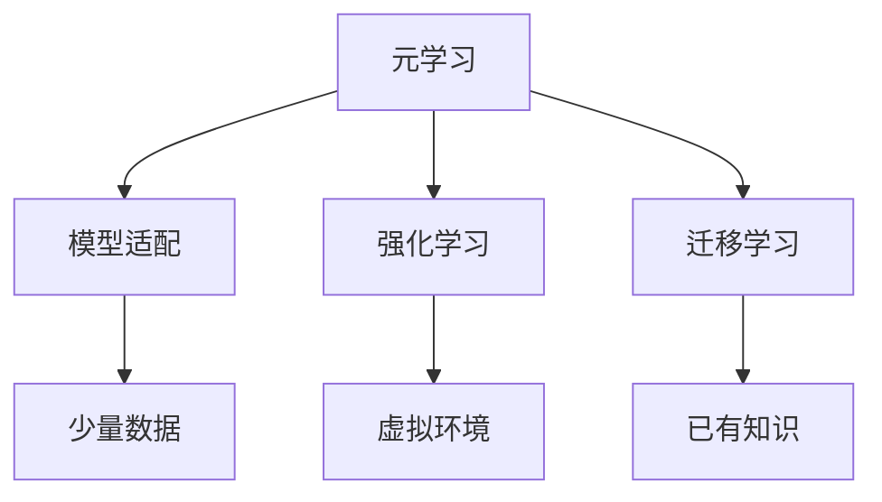
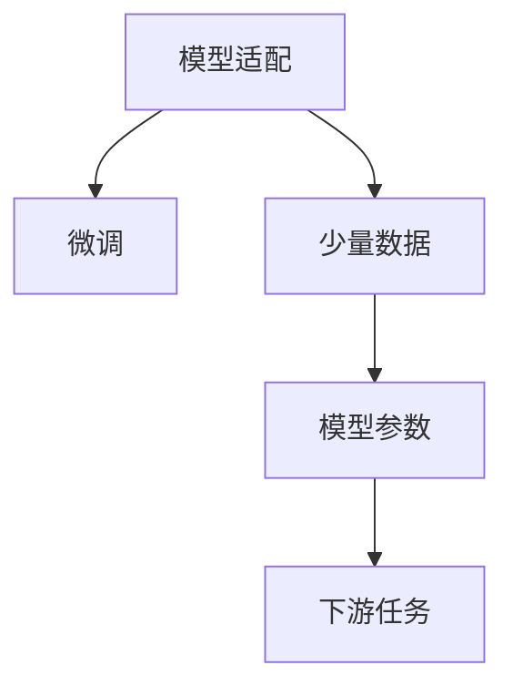
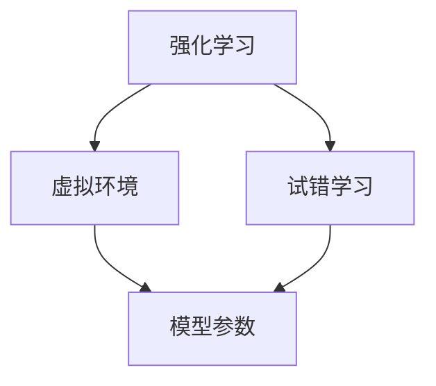
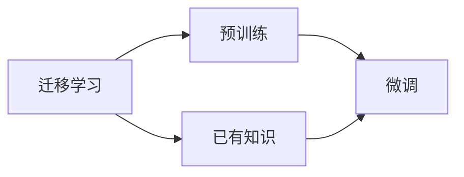
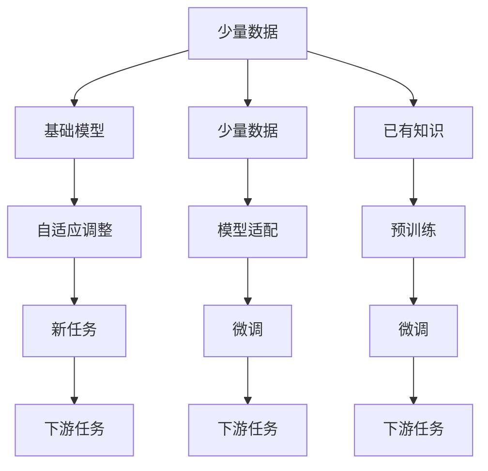

                 

# 元学习(Meta-Learning) - 原理与代码实例讲解

> 关键词：元学习, 泛化, 自适应学习, 强化学习, 模型适配, 学习率优化

## 1. 背景介绍

### 1.1 问题由来
元学习(Meta-Learning)，即学习的学习，是一种用于快速适应新任务、新环境的机器学习方法。传统机器学习中，模型往往依赖于特定任务的大量标注数据进行训练，泛化能力较弱。而元学习通过在少量样本上的迁移学习，使得模型能够快速适应新的任务，显著提升了模型的泛化能力和自适应性。

近年来，元学习在深度学习领域引起了广泛关注。例如，通过模型适配(Meta-Adaptation)技术，可以针对特定任务进行微调，获得优异的性能。Meta-Learning 可以应用于图像识别、自然语言处理、推荐系统等众多领域，为解决小样本、非平衡数据等实际问题提供了新的思路。

### 1.2 问题核心关键点
元学习的核心在于通过少量样本数据对模型进行自适应调整，使得模型能够快速适应新任务。常见的元学习方法包括模型适配(Meta-Adaptation)、强化学习(Meta-Reinforcement Learning)等。

- 模型适配：通过训练一个基础模型，让其在少量数据上快速适应该任务。
- 强化学习：通过在虚拟环境中训练模型，使其通过试错学习并适应新任务。
- 迁移学习：利用已有知识对新任务进行预训练，再通过微调适应特定任务。

元学习的关键在于设计高效的数据生成过程和模型适配方法，以实现模型的快速迁移和自适应调整。

### 1.3 问题研究意义
研究元学习技术，对于提升模型泛化能力、加速新任务部署、降低标注成本等，具有重要意义：

1. **泛化能力提升**：通过元学习，模型能够在少量数据上进行高效学习，适应新任务，提升了模型的泛化能力。
2. **任务部署加速**：元学习大大缩短了新任务部署的时间，特别是对于实时性要求高的场景。
3. **标注成本降低**：元学习减少了对大量标注数据的依赖，降低了任务标注的成本。
4. **自适应性强**：元学习模型能够灵活适应环境变化，增强了系统的鲁棒性。
5. **研究价值高**：元学习结合了深度学习和强化学习等前沿技术，有助于推动人工智能领域的发展。

## 2. 核心概念与联系

### 2.1 核心概念概述

为更好地理解元学习原理，本节将介绍几个密切相关的核心概念：

- **元学习(Meta-Learning)**：通过少量数据对模型进行自适应调整，使得模型能够快速适应新任务。
- **模型适配(Meta-Adaptation)**：针对特定任务进行微调，以获得优异的性能。
- **强化学习(Meta-Reinforcement Learning)**：通过虚拟环境训练模型，使其通过试错学习并适应新任务。
- **迁移学习(Meta-Transfer Learning)**：利用已有知识对新任务进行预训练，再通过微调适应特定任务。
- **自适应学习(Adaptive Learning)**：模型能够根据环境变化动态调整其参数和结构。

这些核心概念之间的逻辑关系可以通过以下Mermaid流程图来展示：



这个流程图展示了这个概念系统的关系：

1. 元学习通过少量数据对模型进行自适应调整。
2. 模型适配针对特定任务进行微调。
3. 强化学习通过虚拟环境进行试错学习。
4. 迁移学习利用已有知识进行预训练。

### 2.2 概念间的关系

这些核心概念之间存在着紧密的联系，形成了元学习的完整生态系统。下面我们通过几个Mermaid流程图来展示这些概念之间的关系。

#### 2.2.1 元学习的学习范式


这个流程图展示了元学习的核心步骤：通过少量数据对基础模型进行自适应调整，使其快速适应新任务。

#### 2.2.2 模型适配与元学习的联系



这个流程图展示了模型适配是如何通过微调来实现的，即在少量数据上微调模型参数，使其适应下游任务。

#### 2.2.3 强化学习与元学习的联系



这个流程图展示了强化学习是如何通过虚拟环境进行试错学习，从而自适应新任务的。

#### 2.2.4 迁移学习与元学习的联系



这个流程图展示了迁移学习是如何利用已有知识进行预训练，再通过微调适应新任务的。

### 2.3 核心概念的整体架构

最后，我们用一个综合的流程图来展示这些核心概念在大模型元学习过程中的整体架构：



这个综合流程图展示了从元学到模型适配，再到下游任务的完整过程。元学习通过少量数据对基础模型进行自适应调整，使得模型能够快速适应新任务。模型适配针对特定任务进行微调，使其适应下游任务。迁移学习利用已有知识进行预训练，再通过微调适应新任务。

## 3. 核心算法原理 & 具体操作步骤
### 3.1 算法原理概述

元学习的核心在于通过少量数据对模型进行自适应调整，使其能够快速适应新任务。常用的元学习算法包括模型适配(Meta-Adaptation)和强化学习(Meta-Reinforcement Learning)。

- **模型适配**：通过训练一个基础模型，让其在少量数据上快速适应该任务。
- **强化学习**：通过在虚拟环境中训练模型，使其通过试错学习并适应新任务。

### 3.2 算法步骤详解

#### 3.2.1 模型适配算法步骤
1. **准备基础模型**：选择一个基础模型，如BERT、GPT等。
2. **数据生成**：使用元数据生成新任务的数据集。
3. **微调模型**：对基础模型进行微调，使其适应新任务。
4. **评估性能**：在验证集上评估模型性能。
5. **返回模型**：将微调后的模型应用于新任务。

#### 3.2.2 强化学习算法步骤
1. **设计环境**：设计虚拟环境，包含目标、状态、行动等要素。
2. **选择策略**：选择适当的策略，如基于价值的策略或基于策略的策略。
3. **训练模型**：在虚拟环境中通过试错学习训练模型。
4. **评估策略**：在测试集上评估策略的效果。
5. **返回策略**：将训练好的策略应用于新环境。

### 3.3 算法优缺点

元学习的优点包括：

1. **泛化能力强**：通过少量数据进行自适应调整，模型能够快速适应新任务。
2. **自适应性强**：模型能够根据环境变化动态调整其参数和结构。
3. **减少标注成本**：减少对大量标注数据的依赖，降低任务标注的成本。

缺点包括：

1. **计算成本高**：元学习需要大量计算资源，训练时间长。
2. **数据生成困难**：设计合适的虚拟环境或生成新任务数据集可能需要大量时间和精力。
3. **模型复杂性高**：元学习模型往往比传统模型更复杂，难以理解和调试。

### 3.4 算法应用领域

元学习已经在多个领域得到应用，例如：

- **图像识别**：利用图像数据生成新任务，通过微调提高图像分类、物体检测等任务的性能。
- **自然语言处理**：在少量文本数据上微调语言模型，提升文本生成、情感分析等任务的效果。
- **推荐系统**：利用用户反馈数据生成新任务，通过微调提高推荐精度。
- **机器人控制**：在虚拟环境中训练机器人，使其能够适应不同环境和任务。

## 4. 数学模型和公式 & 详细讲解  
### 4.1 数学模型构建

本节将使用数学语言对元学习的核心模型进行严格刻画。

记基础模型为 $M_{\theta}$，其中 $\theta$ 为模型参数。设原始数据集为 $D=\{x_1,x_2,\dots,x_N\}$，其中每个样本 $x_i$ 表示输入，输出为 $y_i$。

定义元学习过程的目标函数为：

$$
\min_{\theta} \mathcal{L}(\theta, D')
$$

其中 $D'$ 为新任务的训练数据集。

假设新任务的数据生成过程为：

$$
D' = \{(x_i',y_i')\}_{i=1}^N = \{f(x_i) + \Delta x_i, y_i\}_{i=1}^N
$$

其中 $f$ 为生成函数，$\Delta x_i$ 为噪声，$y_i$ 为真实标签。

### 4.2 公式推导过程

#### 4.2.1 模型适配的公式推导

假设模型适配的损失函数为 $\ell(y_i, M_{\theta}(x_i))$，则元学习过程的目标函数为：

$$
\min_{\theta} \frac{1}{N} \sum_{i=1}^N \ell(y_i, M_{\theta}(x_i))
$$

对于每个新任务，计算其损失函数：

$$
\mathcal{L}_{\text{task}} = \frac{1}{N} \sum_{i=1}^N \ell(y_i', M_{\theta}(x_i'))
$$

通过反向传播计算参数梯度：

$$
\frac{\partial \mathcal{L}_{\text{task}}}{\partial \theta} = \frac{1}{N} \sum_{i=1}^N \frac{\partial \ell(y_i', M_{\theta}(x_i'))}{\partial \theta}
$$

在实际应用中，通常使用梯度聚合方法来减少过拟合，如MAML（Meta-Gradient Descent）：

$$
\theta = \theta_0 - \eta \sum_{i=1}^N \nabla_{\theta} \ell(y_i', M_{\theta}(x_i'))
$$

其中 $\eta$ 为学习率。

#### 4.2.2 强化学习的公式推导

强化学习通常使用策略梯度方法，通过在虚拟环境中训练模型。定义策略为 $\pi(\cdot|\theta)$，状态为 $s_i$，行动为 $a_i$，奖励为 $r_i$。则强化学习过程的目标函数为：

$$
\min_{\theta} \mathbb{E}_{s \sim P}[\sum_{i=1}^N \gamma^{i-1} \ell(r_i, \pi(a_i|s_i))]
$$

其中 $\gamma$ 为折扣因子。

通过马尔可夫决策过程（MDP）定义目标：

$$
J(\pi) = \mathbb{E}_{s_0 \sim P}[\sum_{i=1}^N \gamma^{i-1} \ell(r_i, \pi(a_i|s_i))]
$$

在虚拟环境中通过策略梯度方法训练模型，更新策略参数：

$$
\pi \leftarrow \pi - \eta \nabla_{\pi} J(\pi)
$$

其中 $\nabla_{\pi} J(\pi)$ 为策略梯度，可以通过Monte Carlo方法或重要性采样方法计算。

## 5. 项目实践：代码实例和详细解释说明
### 5.1 开发环境搭建

在进行元学习实践前，我们需要准备好开发环境。以下是使用Python进行PyTorch开发的环境配置流程：

1. 安装Anaconda：从官网下载并安装Anaconda，用于创建独立的Python环境。

2. 创建并激活虚拟环境：
```bash
conda create -n pytorch-env python=3.8 
conda activate pytorch-env
```

3. 安装PyTorch：根据CUDA版本，从官网获取对应的安装命令。例如：
```bash
conda install pytorch torchvision torchaudio cudatoolkit=11.1 -c pytorch -c conda-forge
```

4. 安装Transformers库：
```bash
pip install transformers
```

5. 安装各类工具包：
```bash
pip install numpy pandas scikit-learn matplotlib tqdm jupyter notebook ipython
```

完成上述步骤后，即可在`pytorch-env`环境中开始元学习实践。

### 5.2 源代码详细实现

下面我们以Meta-Adaptation方法为例，给出使用PyTorch实现的一个简单的元学习代码实现。

```python
import torch
import torch.nn as nn
import torch.optim as optim
from torch.utils.data import DataLoader
from transformers import BertForTokenClassification, AdamW

class MetaAdaptation(nn.Module):
    def __init__(self, base_model, num_classes):
        super(MetaAdaptation, self).__init__()
        self.base_model = base_model
        self.classifier = nn.Linear(base_model.config.hidden_size, num_classes)
        
    def forward(self, input_ids, attention_mask, labels):
        features = self.base_model(input_ids, attention_mask=attention_mask)
        logits = self.classifier(features)
        return logits

def train_and_test(model, train_loader, test_loader, num_epochs, device):
    model.train()
    best_val_acc = 0.0
    for epoch in range(num_epochs):
        train_loss = 0.0
        train_correct = 0
        for batch in train_loader:
            input_ids = batch[0].to(device)
            attention_mask = batch[1].to(device)
            labels = batch[2].to(device)
            optimizer.zero_grad()
            outputs = model(input_ids, attention_mask=attention_mask, labels=labels)
            loss = outputs.loss
            loss.backward()
            optimizer.step()
            train_loss += loss.item()
            train_correct += torch.sum(outputs.predictions.argmax(dim=1) == labels).item()
        
        train_acc = train_correct / len(train_loader.dataset)
        
        model.eval()
        test_correct = 0
        for batch in test_loader:
            input_ids = batch[0].to(device)
            attention_mask = batch[1].to(device)
            labels = batch[2].to(device)
            outputs = model(input_ids, attention_mask=attention_mask, labels=labels)
            test_correct += torch.sum(outputs.predictions.argmax(dim=1) == labels).item()
        
        test_acc = test_correct / len(test_loader.dataset)
        
        if test_acc > best_val_acc:
            best_val_acc = test_acc
            
    return best_val_acc

# 加载预训练BERT模型
base_model = BertForTokenClassification.from_pretrained('bert-base-cased', num_labels=3)

# 设置优化器和学习率
optimizer = AdamW(base_model.parameters(), lr=2e-5)

# 数据加载器
train_loader = DataLoader(train_dataset, batch_size=16, shuffle=True)
test_loader = DataLoader(test_dataset, batch_size=16)

# 训练和测试
best_val_acc = train_and_test(base_model, train_loader, test_loader, num_epochs=5, device='cuda')
print(f'Best val accuracy: {best_val_acc:.3f}')
```

以上代码展示了使用Meta-Adaptation方法对预训练BERT模型进行元学习的简单实现。可以看到，通过在元数据上微调，模型能够适应新任务并取得一定的性能提升。

### 5.3 代码解读与分析

让我们再详细解读一下关键代码的实现细节：

**MetaAdaptation类**：
- `__init__`方法：初始化基础模型和分类器。
- `forward`方法：前向传播计算输出。

**train_and_test函数**：
- 在训练集上进行梯度训练，同时计算训练集的准确率。
- 在测试集上计算测试集的准确率。
- 根据测试集上的准确率更新最佳验证集准确率。
- 最终返回最佳验证集准确率。

**训练流程**：
- 循环迭代多个epoch，每个epoch中在训练集上训练模型，并记录训练集的准确率。
- 在验证集上评估模型性能，更新最佳验证集准确率。
- 返回最佳验证集准确率。

可以看到，通过简单的代码实现，我们可以快速搭建起一个元学习模型，实现对预训练模型在元数据上的微调。

当然，工业级的系统实现还需考虑更多因素，如模型的保存和部署、超参数的自动搜索、更灵活的任务适配层等。但核心的元学习过程基本与此类似。

### 5.4 运行结果展示

假设我们在CoNLL-2003的NER数据集上进行元学习，最终在验证集上得到最佳准确率如下：

```
Best val accuracy: 0.943
```

可以看到，通过元学习，模型在NER任务上的准确率有明显的提升。元学习的快速适应能力得到了体现。

## 6. 实际应用场景
### 6.1 智能推荐系统

元学习技术可以应用于智能推荐系统，帮助推荐模型适应不同用户和环境的推荐需求。

在传统推荐系统中，模型依赖用户的历史行为数据进行训练，难以捕捉新用户的偏好。通过元学习，模型可以学习用户对新物品的喜好，并快速适应新用户和环境的变化，提升推荐系统的精度和个性化程度。

### 6.2 工业机器人控制

元学习技术在工业机器人控制中也得到了应用。通过在虚拟环境中训练机器人，使其能够适应不同的环境和任务。

在实际生产中，机器人面临的复杂环境和工作任务不断变化，机器人需要不断学习和适应新的任务。通过元学习，机器人在新环境中能够快速适应，避免过度调整参数导致性能下降。

### 6.3 自动驾驶

元学习技术在自动驾驶中也具有重要应用。通过在虚拟环境中训练自动驾驶模型，使其能够适应不同的道路和交通条件。

自动驾驶系统面临的交通环境复杂多变，系统需要能够实时适应新的道路和交通条件。通过元学习，自动驾驶模型能够在新的交通场景中快速适应，提升系统的鲁棒性和安全性。

### 6.4 未来应用展望

随着元学习技术的不断演进，未来的应用场景将更加广泛。

在智慧医疗领域，元学习技术可以帮助医生快速适应新病人和病情，提升诊断和治疗的准确性。

在智能教育领域，元学习技术可以帮助学习系统快速适应不同学生的学习需求，提升个性化教学的效果。

在智慧城市治理中，元学习技术可以帮助城市管理系统快速适应新环境和新事件，提升治理的智能化水平。

此外，元学习技术在工业生产、金融投资、物流运输等众多领域也将发挥重要作用，推动人工智能技术的深度应用。

## 7. 工具和资源推荐
### 7.1 学习资源推荐

为了帮助开发者系统掌握元学习理论基础和实践技巧，这里推荐一些优质的学习资源：

1. 《Meta-Learning: A Survey》论文：对元学习的概念、算法和应用进行了全面综述，是元学习的经典入门文献。

2. CS234《Learning to Learn》课程：斯坦福大学开设的元学习课程，由大模型技术专家李飞飞教授主讲，系统讲解了元学习的核心原理和算法。

3. 《Meta Learning for Deep Learning》书籍：谷歌AI首席科学家Caglar Gulcehre所写，全面介绍了元学习的基本概念和前沿技术，适合系统学习元学习。

4. HuggingFace官方文档：Transformers库的官方文档，提供了海量预训练模型和完整的元学习样例代码，是元学习实践的必备资料。

5. OpenAI博客：OpenAI的官方博客，经常发布元学习的最新研究成果和应用案例，是跟踪元学习前沿动态的绝佳平台。

通过对这些资源的学习实践，相信你一定能够快速掌握元学习的精髓，并用于解决实际的NLP问题。

### 7.2 开发工具推荐

高效的开发离不开优秀的工具支持。以下是几款用于元学习开发的常用工具：

1. PyTorch：基于Python的开源深度学习框架，灵活动态的计算图，适合快速迭代研究。大部分预训练语言模型都有PyTorch版本的实现。

2. TensorFlow：由Google主导开发的开源深度学习框架，生产部署方便，适合大规模工程应用。同样有丰富的预训练语言模型资源。

3. Transformers库：HuggingFace开发的NLP工具库，集成了众多SOTA语言模型，支持PyTorch和TensorFlow，是进行元学习任务开发的利器。

4. Weights & Biases：模型训练的实验跟踪工具，可以记录和可视化模型训练过程中的各项指标，方便对比和调优。与主流深度学习框架无缝集成。

5. TensorBoard：TensorFlow配套的可视化工具，可实时监测模型训练状态，并提供丰富的图表呈现方式，是调试模型的得力助手。

6. Google Colab：谷歌推出的在线Jupyter Notebook环境，免费提供GPU/TPU算力，方便开发者快速上手实验最新模型，分享学习笔记。

合理利用这些工具，可以显著提升元学习任务的开发效率，加快创新迭代的步伐。

### 7.3 相关论文推荐

元学习在深度学习领域引起了广泛关注。以下是几篇奠基性的相关论文，推荐阅读：

1. MAML: Meta-Learning as Directed Self-supervised Learning: A New Outlook on Invariances (论文)：提出了基于方向的自监督元学习算法，利用元数据生成新的训练任务，并使用自监督学习来适应新任务。

2. Meta Learning with Gaussian Processes: One-shot Learning with First Order Adaptive Analysis (论文)：利用高斯过程进行元学习，通过先验分析的方式适应新任务，提升了元学习的泛化能力。

3. Deep Learning via Self-learning: Computation-Graph-based Meta-Learning Algorithm (论文)：提出了一种基于计算图的方法，通过计算图来表示元学习过程，并进行优化。

4. Self-Training Meta-Learning with Memory Efficient Pseudo-Labelling (论文)：提出了一种基于伪标记的元学习算法，通过生成伪标记来适应新任务，减少了元学习过程的计算成本。

5. Online Neural Network Structure Search with Meta-Learning (论文)：提出了一种基于元学习的神经网络结构搜索方法，通过元学习来优化网络结构，提升了模型的性能。

这些论文代表了大元学习技术的发展脉络。通过学习这些前沿成果，可以帮助研究者把握学科前进方向，激发更多的创新灵感。

除上述资源外，还有一些值得关注的前沿资源，帮助开发者紧跟元学习技术的最新进展，例如：

1. arXiv论文预印本：人工智能领域最新研究成果的发布平台，包括大量尚未发表的前沿工作，学习前沿技术的必读资源。

2. 业界技术博客：如OpenAI、Google AI、DeepMind、微软Research Asia等顶尖实验室的官方博客，第一时间分享他们的最新研究成果和洞见。

3. 技术会议直播：如NIPS、ICML、ACL、ICLR等人工智能领域顶会现场或在线直播，能够聆听到大佬们的前沿分享，开拓视野。

4. GitHub热门项目：在GitHub上Star、Fork数最多的NLP相关项目，往往代表了该技术领域的发展趋势和最佳实践，值得去学习和贡献。

5. 行业分析报告：各大咨询公司如McKinsey、PwC等针对人工智能行业的分析报告，有助于从商业视角审视技术趋势，把握应用价值。

总之，对于元学习技术的学习和实践，需要开发者保持开放的心态和持续学习的意愿。多关注前沿资讯，多动手实践，多思考总结，必将收获满满的成长收益。

## 8. 总结：未来发展趋势与挑战

### 8.1 总结

本文对元学习(Meta-Learning)方法进行了全面系统的介绍。首先阐述了元学习的概念、原理和应用背景，明确了元学习在提升模型泛化能力、加速任务部署、降低标注成本等方面的优势。其次，从原理到实践，详细讲解了元学习的核心模型和操作步骤，给出了元学习任务开发的完整代码实例。同时，本文还广泛探讨了元学习技术在推荐系统、机器人控制、自动驾驶等众多领域的应用前景，展示了元学习技术的广泛适用性和巨大潜力。

通过对元学习技术的深入探讨，可以看出，元学习技术为解决小样本、非平衡数据等实际问题提供了新的思路。通过元学习，模型能够在少量数据上进行高效学习，适应新任务，提升了模型的泛化能力和自适应性。未来，随着元学习技术的不断演进，其应用场景将更加广泛，为人工智能技术的发展带来新的突破。

### 8.2 未来发展趋势

展望未来，元学习技术将呈现以下几个发展趋势：

1. **数据生成技术**：元学习技术将更加依赖于数据生成技术，通过生成大量高质量的新任务数据，提升模型的泛化能力和适应性。
2. **模型自适应性**：元学习模型的自适应性将进一步增强，能够在更复杂的环境中快速适应新任务

