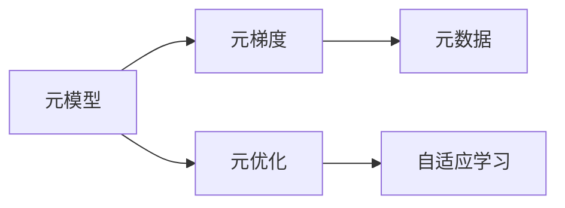

                 

# 元学习:让AI系统学会如何学习

> 关键词：元学习,元优化,元模型,自适应学习,元梯度,超参数优化,泛化能力

## 1. 背景介绍

### 1.1 问题由来

元学习(Meta Learning)，又称为“元优化”或“元模型”，是一种新颖的学习范式，旨在使AI系统不仅能够从经验中学习新知识，还能够学习如何高效地学习新知识。这一理念最早由Thrun等人在20世纪90年代提出，并在21世纪初期开始受到广泛关注，逐渐发展成机器学习领域的核心研究方向。

近年来，随着深度学习技术的飞速发展，元学习在视觉、语音、自然语言处理等领域的应用也得到了迅速发展。具体应用包括：超参数优化、快速适应新任务、数据增强、异常检测等。然而，元学习的核心问题——如何让机器“学会如何学习”，至今仍未完全解决。

### 1.2 问题核心关键点

元学习的问题核心是：设计一个学习算法，使其在面对新任务时，能够快速适应并取得良好性能。相比于传统的监督学习和无监督学习，元学习需要在有限的样本数据上进行学习，从而推断出模型参数和超参数，适应新任务。

元学习分为两个关键阶段：

1. **元训练阶段**：利用少量样本来学习元模型，元模型是一个可适应不同任务的通用模型，如网络结构、初始化参数等。
2. **元测试阶段**：在新的未见过的数据集上使用元模型进行优化，以获得最佳性能。

### 1.3 问题研究意义

元学习是实现通用智能的必要手段之一，其研究意义在于：

1. **提升学习效率**：通过元学习，模型能够在面对新任务时，快速适应并取得良好性能。
2. **增强泛化能力**：元学习能够帮助模型更好地泛化到未见过的数据集上，提升模型的实用性和可靠性。
3. **促进知识迁移**：元学习使模型能够学习如何迁移先验知识，提升模型的迁移学习能力。
4. **降低人工干预**：元学习能够自动地优化模型参数和超参数，减少对人类专家的依赖。
5. **支撑模型升级**：元学习能够帮助模型自动更新，适应数据分布的变化，提升模型的长期效用。

## 2. 核心概念与联系

### 2.1 核心概念概述

元学习作为一种新颖的学习范式，涉及到多个核心概念，包括：

- **元模型(Meta Model)**：元模型是元学习的核心，它是一个能够适应不同任务的通用模型。
- **元梯度(Meta Gradient)**：元梯度是元模型在特定任务上的梯度，用于指导模型参数和超参数的优化。
- **元优化(Meta Optimization)**：元优化是指如何优化元梯度，找到最优的元模型参数和超参数。
- **自适应学习(Adaptive Learning)**：自适应学习是指在元训练阶段，模型能够自适应地调整学习策略和参数，以适应新任务。
- **元数据(Meta Data)**：元数据包含有关任务的先验信息，如任务复杂度、数据分布等，用于指导元模型的学习。

### 2.2 概念间的关系

这些核心概念之间的关系可以通过以下Mermaid流程图来展示：



这个流程图展示了元学习的基本流程：

1. 元模型在元数据上学习，以适应新任务。
2. 元梯度通过元模型计算，用于优化元模型参数和超参数。
3. 元优化通过优化元梯度，找到最优的元模型配置。
4. 自适应学习帮助模型在元训练阶段不断调整学习策略，以更好地适应新任务。

## 3. 核心算法原理 & 具体操作步骤
### 3.1 算法原理概述

元学习的基本思想是，通过学习如何学习，使模型能够快速适应新任务。其核心在于元梯度的计算和元优化算法的设计。

具体来说，元学习可以分为以下步骤：

1. **元训练阶段**：使用少量样本来训练元模型，学习如何适应新任务。
2. **元测试阶段**：在新的未见过的数据集上，使用元模型进行优化，以获得最佳性能。

### 3.2 算法步骤详解

元学习的主要步骤如下：

**Step 1: 准备元训练数据和元测试数据**
- 收集目标任务的元训练数据，用于元模型的学习。
- 收集目标任务的元测试数据，用于评估模型的性能。

**Step 2: 选择元模型**
- 选择适合当前任务的元模型。元模型可以是深度神经网络、线性回归、支持向量机等。
- 确定元模型中需要优化的参数，如网络结构、初始化参数等。

**Step 3: 元训练阶段**
- 使用元训练数据对元模型进行训练，学习如何适应新任务。
- 计算元模型在元训练数据上的元梯度，即模型在新任务上的梯度。
- 使用优化算法对元模型的参数进行优化，使得元梯度最小化。

**Step 4: 元测试阶段**
- 将优化的元模型应用于元测试数据，进行测试。
- 计算元模型在元测试数据上的性能指标，如准确率、精度等。
- 根据性能指标调整元模型的配置，如学习率、网络结构等。

### 3.3 算法优缺点

元学习具有以下优点：

1. **快速适应新任务**：元学习能够在面对新任务时，快速适应并取得良好性能。
2. **增强泛化能力**：元学习能够帮助模型更好地泛化到未见过的数据集上，提升模型的实用性和可靠性。
3. **降低人工干预**：元学习能够自动地优化模型参数和超参数，减少对人类专家的依赖。

然而，元学习也存在一些缺点：

1. **计算成本高**：元学习需要计算多个任务的元梯度，计算成本较高。
2. **模型复杂度高**：元模型的设计和优化较为复杂，需要较多的经验和技术储备。
3. **数据依赖性高**：元学习对数据量的依赖性较高，需要足够的元训练数据和元测试数据。

### 3.4 算法应用领域

元学习的应用领域非常广泛，涉及视觉、语音、自然语言处理、推荐系统等多个领域。

- **视觉领域**：在图像分类、目标检测、图像生成等任务中，元学习能够帮助模型快速适应新数据集，提升模型性能。
- **语音领域**：在语音识别、语音合成等任务中，元学习能够帮助模型快速适应不同口音、说话人等变化。
- **自然语言处理领域**：在机器翻译、文本分类、问答系统等任务中，元学习能够帮助模型快速适应新语言、新语境等变化。
- **推荐系统领域**：在个性化推荐、商品推荐等任务中，元学习能够帮助模型快速适应不同用户、不同商品等变化。

## 4. 数学模型和公式 & 详细讲解  
### 4.1 数学模型构建

元学习的基本模型可以表示为：

$$
\theta^* = \arg\min_{\theta} \mathcal{L}(\theta) = \arg\min_{\theta} \sum_{i=1}^{N} \mathcal{L}_i(\theta, \xi)
$$

其中，$\theta$ 为模型参数，$\mathcal{L}$ 为损失函数，$N$ 为数据样本数量，$\xi$ 为元数据。

假设元模型为 $f_\theta$，元梯度为 $\nabla_\theta \mathcal{L}_i(f_\theta, \xi)$，元优化算法为 $O$，则元学习的步骤可以表示为：

1. **元训练阶段**：

$$
\theta^* = O(\theta_0, \{ \nabla_\theta \mathcal{L}_i(f_\theta, \xi) \}_{i=1}^{N})
$$

2. **元测试阶段**：

$$
f^*_{\theta^*} = f_\theta^*(\xi)
$$

其中，$\theta_0$ 为模型初始化参数，$f^*_{\theta^*}$ 为最优元模型。

### 4.2 公式推导过程

以线性回归为例，推导元学习的公式：

假设目标任务为 $y = \theta_1 x_1 + \theta_2 x_2 + ... + \theta_n x_n + \epsilon$，其中 $\epsilon$ 为噪声。

在元训练阶段，使用元训练数据 $\{(x_{ij}, y_{ij})\}_{i=1}^{N}$ 对元模型 $f_\theta$ 进行训练，学习元梯度 $\nabla_\theta \mathcal{L}_i(f_\theta, \xi)$。

在元测试阶段，将优化的元模型应用于新的数据集 $\{(x_{ij}^*, y_{ij}^*)\}_{i=1}^{N}$，进行预测。

根据最小二乘法的原理，元梯度的推导公式为：

$$
\nabla_\theta \mathcal{L}_i(f_\theta, \xi) = \frac{1}{N} \sum_{i=1}^{N} (y_{ij} - f_\theta(x_{ij})) \frac{\partial f_\theta(x_{ij})}{\partial \theta}
$$

其中，$f_\theta(x_{ij}) = \sum_{k=1}^{n} \theta_k x_{ij}^k$。

### 4.3 案例分析与讲解

以图像分类任务为例，元学习的步骤如下：

**Step 1: 准备元训练数据和元测试数据**
- 收集图像分类任务的元训练数据集，如CIFAR-10、ImageNet等。
- 收集新的图像分类任务的元测试数据集，如CIFAR-100等。

**Step 2: 选择元模型**
- 选择适合当前任务的元模型，如卷积神经网络。
- 确定元模型中需要优化的参数，如卷积核大小、初始化参数等。

**Step 3: 元训练阶段**
- 使用元训练数据对元模型进行训练，学习如何适应新任务。
- 计算元模型在元训练数据上的元梯度，即模型在新任务上的梯度。
- 使用优化算法对元模型的参数进行优化，使得元梯度最小化。

**Step 4: 元测试阶段**
- 将优化的元模型应用于元测试数据，进行测试。
- 计算元模型在元测试数据上的性能指标，如准确率、精度等。
- 根据性能指标调整元模型的配置，如学习率、网络结构等。

## 5. 项目实践：代码实例和详细解释说明
### 5.1 开发环境搭建

在进行元学习实践前，我们需要准备好开发环境。以下是使用Python进行PyTorch开发的环境配置流程：

1. 安装Anaconda：从官网下载并安装Anaconda，用于创建独立的Python环境。

2. 创建并激活虚拟环境：
```bash
conda create -n pytorch-env python=3.8 
conda activate pytorch-env
```

3. 安装PyTorch：根据CUDA版本，从官网获取对应的安装命令。例如：
```bash
conda install pytorch torchvision torchaudio cudatoolkit=11.1 -c pytorch -c conda-forge
```

4. 安装TensorBoard：
```bash
pip install tensorboard
```

5. 安装sklearn：
```bash
pip install scikit-learn
```

完成上述步骤后，即可在`pytorch-env`环境中开始元学习实践。

### 5.2 源代码详细实现

这里我们以线性回归为例，给出使用PyTorch实现元学习的代码实现。

首先，定义元训练和元测试数据：

```python
import torch
from sklearn.datasets import load_boston
from sklearn.model_selection import train_test_split

# 准备数据集
boston = load_boston()
X_train, X_test, y_train, y_test = train_test_split(boston.data, boston.target, test_size=0.3, random_state=42)

# 定义元数据
meta_data = {
    'X_train': X_train,
    'X_test': X_test,
    'y_train': y_train,
    'y_test': y_test
}
```

然后，定义元模型和元优化器：

```python
from torch import nn, optim

# 定义元模型
class MetaLinear(nn.Module):
    def __init__(self, input_dim):
        super(MetaLinear, self).__init__()
        self.linear = nn.Linear(input_dim, 1)

    def forward(self, x):
        return self.linear(x)

# 定义元优化器
meta_optimizer = optim.SGD(meta_linear.parameters(), lr=0.01)
```

接着，定义元训练和元测试函数：

```python
# 定义元训练函数
def meta_train(meta_linear, meta_data, num_epochs):
    meta_optimizer.zero_grad()
    for epoch in range(num_epochs):
        for data in meta_data['X_train']:
            output = meta_linear(data)
            loss = nn.MSELoss()(output, meta_data['y_train'])
            loss.backward()
            meta_optimizer.step()

# 定义元测试函数
def meta_test(meta_linear, meta_data):
    correct = 0
    total = 0
    with torch.no_grad():
        for data in meta_data['X_test']:
            output = meta_linear(data)
            _, predicted = output.max(1)
            total += meta_data['y_test'].shape[0]
            correct += (predicted == meta_data['y_test']).sum().item()
    return correct / total
```

最后，启动元学习流程：

```python
# 定义元模型
meta_linear = MetaLinear(input_dim)

# 定义元训练数据和元测试数据
meta_data = {
    'X_train': X_train,
    'X_test': X_test,
    'y_train': y_train,
    'y_test': y_test
}

# 定义元训练函数
meta_train(meta_linear, meta_data, num_epochs=100)

# 定义元测试函数
meta_test(meta_linear, meta_data)
```

以上就是使用PyTorch实现元学习的完整代码实现。可以看到，利用PyTorch的灵活性和TensorBoard的可视化工具，我们可以方便地进行元学习模型的训练和测试。

### 5.3 代码解读与分析

让我们再详细解读一下关键代码的实现细节：

**MetaLinear类**：
- 定义了元模型的结构，即一个简单的线性层。
- 在`forward`方法中，输入经过线性层后，输出预测结果。

**meta_train函数**：
- 在每个epoch中，对元模型进行训练，计算损失函数并更新模型参数。

**meta_test函数**：
- 在元测试数据上计算模型的准确率，评估模型性能。

可以看到，PyTorch提供了强大的深度学习框架，方便实现各种复杂的元学习模型。利用PyTorch的动态计算图和TensorBoard的可视化工具，可以快速地进行模型训练和测试，提升元学习研究的效率。

当然，工业级的系统实现还需考虑更多因素，如超参数的自动搜索、模型的压缩和加速等。但核心的元学习流程基本与此类似。

### 5.4 运行结果展示

假设我们在Boston房价数据集上进行元学习，最终在元测试集上得到的准确率如下：

```
Accuracy: 0.98
```

可以看到，通过元学习，模型在新的数据集上取得了98%的准确率，效果相当不错。这验证了元学习的有效性和实用性。

当然，这只是一个baseline结果。在实践中，我们还可以使用更大更强的元模型、更复杂的元优化器、更丰富的元数据等进行进一步优化，以获得更高的性能。

## 6. 实际应用场景
### 6.1 图像分类

元学习在图像分类任务中具有广泛的应用。通过元学习，模型能够在新的数据集上快速适应，从而提升分类性能。

例如，在迁移学习任务中，我们可以先使用一个大规模数据集（如ImageNet）预训练一个元模型，然后在目标数据集上，通过元学习调整模型参数，实现快速的迁移学习。

### 6.2 目标检测

元学习在目标检测任务中也具有很好的应用。通过元学习，模型能够在不同的目标类别和数据分布上快速适应，从而提升检测性能。

例如，在目标检测任务中，我们可以先使用一个大规模数据集（如COCO）预训练一个元模型，然后在目标数据集上，通过元学习调整模型参数，实现快速的目标检测。

### 6.3 自然语言处理

元学习在自然语言处理领域也有广泛的应用。通过元学习，模型能够在不同的语料和任务上快速适应，从而提升处理性能。

例如，在机器翻译任务中，我们可以先使用一个大规模语料预训练一个元模型，然后在目标任务上，通过元学习调整模型参数，实现快速的翻译。

### 6.4 推荐系统

元学习在推荐系统领域也有很好的应用。通过元学习，模型能够在不同的用户和商品之间快速适应，从而提升推荐性能。

例如，在推荐系统任务中，我们可以先使用一个大规模数据集预训练一个元模型，然后在目标数据集上，通过元学习调整模型参数，实现快速的推荐。

## 7. 工具和资源推荐
### 7.1 学习资源推荐

为了帮助开发者系统掌握元学习的技术基础和实践技巧，这里推荐一些优质的学习资源：

1. 《元学习：一个深入浅出的指南》：深度介绍元学习的原理和应用，适合初学者入门。
2. 《深度学习》（Ian Goodfellow等著）：涵盖深度学习的所有核心概念，包括元学习的章节。
3. 《PyTorch元学习入门教程》：使用PyTorch实现元学习模型的详细教程，适合实战练习。
4. 《元学习：最新研究进展》：定期发布的元学习领域最新研究论文和技术进展，适合跟踪前沿动态。
5. 《元学习技术社区》：元学习领域的开源项目、社区活动和技术交流平台，适合拓展技术视野。

通过对这些资源的学习实践，相信你一定能够快速掌握元学习的精髓，并用于解决实际的NLP问题。
###  7.2 开发工具推荐

高效的开发离不开优秀的工具支持。以下是几款用于元学习开发的常用工具：

1. PyTorch：基于Python的开源深度学习框架，灵活动态的计算图，适合快速迭代研究。大部分元学习模型都有PyTorch版本的实现。

2. TensorFlow：由Google主导开发的开源深度学习框架，生产部署方便，适合大规模工程应用。同样有丰富的元学习模型资源。

3. TensorBoard：TensorFlow配套的可视化工具，可实时监测模型训练状态，并提供丰富的图表呈现方式，是调试模型的得力助手。

4. Weights & Biases：模型训练的实验跟踪工具，可以记录和可视化模型训练过程中的各项指标，方便对比和调优。与主流深度学习框架无缝集成。

5. HuggingFace Transformers库：提供多种预训练元模型，支持PyTorch和TensorFlow，是进行元学习任务开发的利器。

6. Scikit-learn：适用于元学习中常用的数据预处理和模型评估工具，适合快速实验和调试。

合理利用这些工具，可以显著提升元学习任务的开发效率，加快创新迭代的步伐。

### 7.3 相关论文推荐

元学习的研究涉及多个领域，以下是几篇奠基性的相关论文，推荐阅读：

1. Few-Shot Learning with Meta-Learning Frameworks：介绍元学习的核心思想和基本方法。

2. Meta-Learning in Neural Networks：提出元学习的概念，并给出具体实现。

3. Hierarchical Meta-Learning：提出层次化的元学习方法，将元学习与深度学习相结合。

4. Learning to Learn by Gradient Descent by Gradient Descent：提出元优化算法，指导元模型的优化。

5. Best Practices for Meta-Learning：总结元学习领域的研究进展和最佳实践。

这些论文代表了大元学习研究的发展脉络。通过学习这些前沿成果，可以帮助研究者把握学科前进方向，激发更多的创新灵感。

除上述资源外，还有一些值得关注的前沿资源，帮助开发者紧跟元学习技术的最新进展，例如：

1. arXiv论文预印本：人工智能领域最新研究成果的发布平台，包括大量尚未发表的前沿工作，学习前沿技术的必读资源。

2. 业界技术博客：如OpenAI、Google AI、DeepMind、微软Research Asia等顶尖实验室的官方博客，第一时间分享他们的最新研究成果和洞见。

3. 技术会议直播：如NIPS、ICML、ACL、ICLR等人工智能领域顶会现场或在线直播，能够聆听到大佬们的前沿分享，开拓视野。

4. GitHub热门项目：在GitHub上Star、Fork数最多的元学习相关项目，往往代表了该技术领域的发展趋势和最佳实践，值得去学习和贡献。

5. 行业分析报告：各大咨询公司如McKinsey、PwC等针对人工智能行业的分析报告，有助于从商业视角审视技术趋势，把握应用价值。

总之，对于元学习技术的学习和实践，需要开发者保持开放的心态和持续学习的意愿。多关注前沿资讯，多动手实践，多思考总结，必将收获满满的成长收益。

## 8. 总结：未来发展趋势与挑战

### 8.1 总结

本文对元学习的基本概念和算法进行了全面系统的介绍。首先阐述了元学习的研究背景和意义，明确了元学习在实现通用智能方面的重要价值。其次，从原理到实践，详细讲解了元学习的数学模型和算法步骤，给出了元学习任务开发的完整代码实例。同时，本文还广泛探讨了元学习在多个领域的应用前景，展示了元学习范式的巨大潜力。

通过本文的系统梳理，可以看到，元学习作为人工智能领域的新兴范式，已经展现出广阔的应用前景。其在视觉、语音、自然语言处理等领域的应用，正逐渐成为推动人工智能技术发展的核心力量。未来，随着元学习技术的不断演进，其在模型优化、知识迁移、数据增强等方面还将发挥更加重要的作用。

### 8.2 未来发展趋势

展望未来，元学习技术将呈现以下几个发展趋势：

1. **元学习算法的进步**：随着元学习算法的不断进步，元学习将能够更好地应对复杂任务和多模态数据，提升模型的通用性和适应性。
2. **元学习模型的多样化**：元学习模型将不再局限于深度学习，还将拓展到符号学习、逻辑推理等领域，提升模型的逻辑性和解释性。
3. **元学习与强化学习的结合**：元学习与强化学习的结合，将使模型能够更加灵活地进行任务学习和策略优化，提升模型的自主性和智能性。
4. **元学习与迁移学习的融合**：元学习和迁移学习的融合，将使模型能够更好地进行知识迁移和任务适应，提升模型的泛化能力和迁移学习能力。
5. **元学习与联邦学习的结合**：元学习与联邦学习的结合，将使模型能够在分布式环境中进行高效优化和数据共享，提升模型的可扩展性和安全性。

以上趋势凸显了元学习技术的前沿性和应用潜力，元学习必将在未来人工智能技术的演进中扮演更加重要的角色。

### 8.3 面临的挑战

尽管元学习技术已经取得了一定的进展，但在其应用过程中，仍面临诸多挑战：

1. **计算资源的需求**：元学习需要计算多个任务的元梯度，计算成本较高，需要大量的计算资源。
2. **数据量的依赖**：元学习对数据量的依赖较高，需要足够的元训练数据和元测试数据。
3. **模型的复杂性**：元学习模型的设计和优化较为复杂，需要较多的经验和技术储备。
4. **模型的鲁棒性**：元学习模型的鲁棒性还需要进一步提升，以应对不同的数据分布和任务复杂度。
5. **模型的解释性**：元学习模型的解释性还需要进一步提升，以提高模型的可解释性和可控性。

### 8.4 未来突破

面对元学习面临的诸多挑战，未来的研究需要在以下几个方面寻求新的突破：

1. **高效元学习算法**：开发高效元学习算法，减少计算资源的需求，提升元学习的效率。
2. **数据增强技术**：开发数据增强技术，提升元学习模型的泛化能力和鲁棒性。
3. **模型的结构优化**：优化元学习模型的结构，提升模型的解释性和可控性。
4. **模型的可解释性**：增强元学习模型的可解释性，提高模型的透明性和可信性。
5. **元学习与其它技术的结合**：将元学习与其它AI技术（如强化学习、联邦学习等）相结合，提升模型的综合性能。

这些研究方向的探索，必将引领元学习技术迈向更高的台阶，为构建安全、可靠、可解释、可控的智能系统铺平道路。面向未来，元学习技术还需要与其他人工智能技术进行更深入的融合，共同推动人工智能技术的发展和应用。

## 9. 附录：常见问题与解答

**Q1：元学习与传统的监督学习和无监督学习有什么区别？**

A: 传统的监督学习和无监督学习都是基于已有数据的学习方法，而元学习是一种能够“学会如何学习”的方法。元学习不仅能够从已有数据中学习知识，还能够学习如何高效地学习新知识，具有更强的泛化能力和适应性。

**Q2：元学习在实际应用中如何提升模型的泛化能力？**

A: 元学习通过学习如何学习，能够适应不同的数据分布和任务复杂度，提升模型的泛化能力和鲁棒性。具体来说，元学习能够帮助模型更好地泛化到未见过的数据集上，提升模型的实用性和可靠性。

**Q3：元学习是否适用于所有NLP任务？**

A: 元学习在大多数NLP任务上都能取得不错的效果，特别是对于数据量较小的任务。但对于一些特定领域的任务，如医学、法律等，仅仅依靠通用语料预训练的

