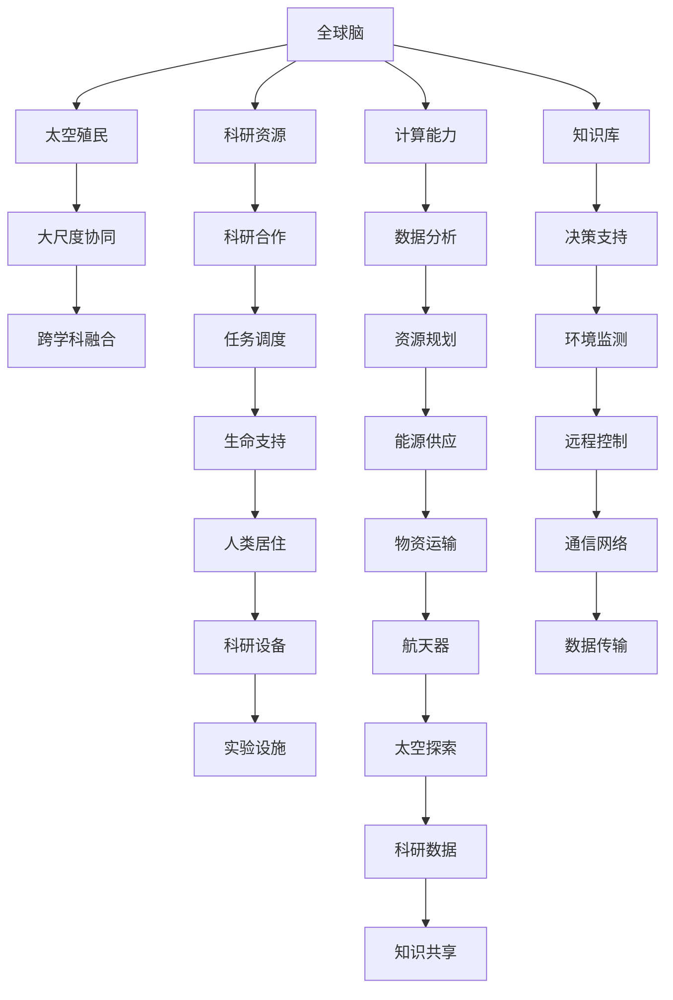

                 

# 全球脑与太空殖民:人类文明的新篇章

## 1. 背景介绍

### 1.1 问题由来
在过去几十年的科技飞速发展下，人类对太空的探索和殖民已经成为可能。这一伟大的梦想不仅对科学和技术的进步具有重要意义，也标志着人类文明的新篇章。然而，太空探索并非易事，它涉及的技术复杂、成本高昂，需要全球的智慧和协作。因此，本文聚焦于人类利用全球脑（Global Brain）实现太空殖民的构想，探索未来科技和文明的融合发展。

### 1.2 问题核心关键点
- **全球脑的概念**：全球脑是利用网络技术，将世界各地的科研资源、知识库、计算能力等集成在一起，形成一个高度协同的智能系统，以解决复杂的科学和工程问题。
- **太空殖民的技术挑战**：包括建立稳定高效的太空通信、能源供应、生命支持系统等，以及如何利用全球脑的协同能力，进行资源规划和任务调度。
- **可持续发展的原则**：太空殖民应遵循环境保护、资源共享、伦理道德等原则，确保其长期可持续性。

### 1.3 问题研究意义
通过全球脑实现太空殖民，可以大大缩短探索周期，降低成本，同时促进全球科研合作和技术进步。这不仅对提升人类的科技水平具有重要意义，也将推动人类文明的进一步发展。本文将通过探讨全球脑的构建和技术实现，为人类太空探索提供新思路和新方案。

## 2. 核心概念与联系

### 2.1 核心概念概述

#### 2.1.1 全球脑
全球脑（Global Brain）是一个高度集成和协同的智能系统，旨在将全球的科研资源、计算能力、知识库等集成在一起，形成一个能够在全球范围内实时协作和共享的智慧大脑。

#### 2.1.2 太空殖民
太空殖民是指在太空建立一个永久或半永久居住的生态系统，通常包括建立太空基地、运输系统和生命支持系统等。

#### 2.1.3 大尺度协同
大尺度协同是指在全球范围内，通过网络技术将科研、工程、经济等多个领域的资源和信息进行高效整合和利用，实现复杂的科学和工程问题的解决。

#### 2.1.4 跨学科融合
跨学科融合是指将不同领域的知识和技术进行融合，形成更加全面、综合的解决方案，促进科学和技术的协同发展。

这些概念通过网络技术和大数据手段，在虚拟空间中形成一个协同工作的智慧网络，实现了科研资源的全球化共享和高效利用。

### 2.2 核心概念间的关系

#### 2.2.1 全球脑与太空殖民的关系
全球脑的构想和太空殖民密切相关，全球脑提供了太空探索所需的计算、数据分析和决策支持，而太空殖民则为全球脑提供了实际应用的场所和环境。

#### 2.2.2 大尺度协同与跨学科融合的关系
大尺度协同是跨学科融合的基础和前提，只有在全球范围内实现跨领域的协同工作，才能充分利用各学科的知识和技术，解决复杂的太空探索问题。

#### 2.2.3 全球脑、太空殖民与大尺度协同的关系
全球脑和太空殖民都是大尺度协同的具体实践和应用，通过大尺度协同，全球脑能够高效地管理太空殖民过程中的各项任务和资源。

这些概念通过网络技术和大数据手段，在虚拟空间中形成一个协同工作的智慧网络，实现了科研资源的全球化共享和高效利用。

### 2.3 核心概念的整体架构



这个流程图展示了全球脑、太空殖民、大尺度协同和跨学科融合的核心概念及其关系：

1. **全球脑**：通过科研资源、计算能力和知识库的整合，形成全球范围内的智慧大脑。
2. **太空殖民**：在太空中建立生态系统，实现人类居住、生命支持、能源供应和科研探索。
3. **大尺度协同**：在虚拟空间中实现全球科研、工程、经济等领域的协同工作。
4. **跨学科融合**：将不同领域的知识和技术进行融合，形成全面、综合的解决方案。

这些概念共同构成了人类利用全球脑实现太空殖民的整体架构。

## 3. 核心算法原理 & 具体操作步骤
### 3.1 算法原理概述

全球脑实现太空殖民的核心算法原理，是通过构建一个集成了全球科研资源的智能网络系统，利用先进的通信技术、计算能力和知识库，实现全球范围内的协同工作和资源管理。具体包括以下步骤：

1. **数据集成**：将全球各地的科研数据、计算资源和知识库集成到一个统一的平台，实现全球数据的实时共享和协作。
2. **任务分解与调度**：根据太空探索的任务需求，将复杂问题分解为多个子任务，并利用全球脑进行任务调度和资源分配。
3. **协同优化**：通过全球脑的协同工作，优化太空探索的各个环节，包括科研、工程、经济等，实现高效、低成本的探索。
4. **动态调整**：根据太空探索的实际情况，动态调整任务和资源分配，确保探索的持续性和可控性。

### 3.2 算法步骤详解

#### 3.2.1 数据集成
- **数据收集**：利用网络技术收集全球各地的科研数据、计算资源和知识库，包括科学实验数据、卫星遥感数据、计算能力等。
- **数据标准化**：对收集到的数据进行标准化和清洗，确保数据的一致性和可靠性。
- **数据存储与管理**：建立一个集中式的数据仓库，实现数据的统一存储和管理，支持全球范围内的数据访问和共享。

#### 3.2.2 任务分解与调度
- **任务定义**：根据太空探索的目标和需求，定义需要完成的具体任务，如建立太空基地、运输系统、生命支持系统等。
- **任务分解**：将复杂任务分解为多个子任务，明确每个子任务的具体要求和执行步骤。
- **任务调度**：利用全球脑的协同能力，对任务进行调度和管理，确保各子任务有序进行，资源高效利用。

#### 3.2.3 协同优化
- **协同计算**：利用全球脑的计算能力，对太空探索的各项任务进行协同计算，提高计算效率和准确性。
- **协同设计**：在设计和优化太空探索系统时，充分考虑全球脑的协同工作，确保设计方案的全面性和可行性。
- **协同实验**：在全球脑的协同环境下，进行各项科学实验，验证和优化太空探索技术。

#### 3.2.4 动态调整
- **实时监控**：利用全球脑的实时监控能力，对太空探索的各个环节进行监控，确保任务和资源分配的合理性。
- **动态调整**：根据实时监控结果，动态调整任务和资源分配，确保探索的持续性和可控性。
- **反馈机制**：建立反馈机制，将太空探索的实际数据和结果反馈到全球脑中，用于指导未来的探索工作。

### 3.3 算法优缺点

#### 3.3.1 算法优点
- **高效协同**：通过全球脑的协同工作，实现科研资源的高效利用，大大缩短探索周期，降低成本。
- **全面覆盖**：利用全球脑的跨学科融合能力，解决复杂的太空探索问题，覆盖各个领域和环节。
- **动态调整**：根据实时数据和结果，动态调整任务和资源分配，确保探索的持续性和可控性。

#### 3.3.2 算法缺点
- **数据安全**：全球脑需要处理大量敏感数据，如何确保数据的安全和隐私是一个重要的挑战。
- **网络依赖**：全球脑的实现高度依赖网络通信技术，一旦网络中断或故障，将影响协同工作的正常进行。
- **资源整合**：全球脑的构建和维护需要大量的资源和人力投入，初期建设和运行成本较高。

### 3.4 算法应用领域

全球脑实现太空殖民的算法已经在多个领域得到了应用，包括但不限于：

- **科研合作**：全球脑在科学实验、数据共享、协同计算等方面，促进了全球科研合作的深化和拓展。
- **太空探索**：全球脑在太空基地建设、生命支持系统、能源供应等方面，提高了太空探索的效率和成功率。
- **跨学科融合**：全球脑在多学科、多领域的技术融合中，推动了新知识、新技术的产生和应用。

这些应用领域展示了全球脑在实现太空殖民过程中的重要作用，为人类探索宇宙的宏伟愿景提供了强有力的支持。

## 4. 数学模型和公式 & 详细讲解 & 举例说明

### 4.1 数学模型构建

全球脑实现太空殖民的数学模型，主要涉及以下几个方面：

1. **通信网络模型**：用于描述全球脑的网络架构和通信机制，包括通信延迟、带宽、丢包率等。
2. **任务调度模型**：用于优化任务的分解、调度和执行，确保任务的高效完成。
3. **资源分配模型**：用于计算和分配全球脑中的计算资源和数据资源，确保资源的高效利用。

### 4.2 公式推导过程

#### 4.2.1 通信网络模型
假设全球脑的网络架构包含N个节点，每个节点的通信速率和延迟分别为 $r_i$ 和 $\tau_i$。则总通信速率和延迟分别为：

$$
R = \sum_{i=1}^N r_i
$$

$$
T = \max_{i=1}^N (\tau_i + r_i \tau_i)
$$

其中，$\max$ 表示取最大值，因为通信延迟受限于通信速率最小的节点。

#### 4.2.2 任务调度模型
假设任务 $T$ 包含 $m$ 个子任务，每个子任务的计算量为 $c_j$，计算速率和执行时间为 $r_j$ 和 $t_j$。则总计算量和计算时间为：

$$
C = \sum_{j=1}^m c_j
$$

$$
T_{\text{task}} = \sum_{j=1}^m t_j
$$

任务调度模型的目标是找到最优的任务分解和调度方案，使得总计算时间和计算量最小。

#### 4.2.3 资源分配模型
假设全球脑中的计算资源为 $R$，每个子任务需要计算量为 $c_j$。则资源分配的目标是：

$$
\min_{x_j} \sum_{j=1}^m c_j x_j
$$

约束条件为：

$$
0 \leq x_j \leq R
$$

其中，$x_j$ 表示分配给第 $j$ 个子任务的计算资源量。

### 4.3 案例分析与讲解

#### 4.3.1 案例背景
假设全球脑需要完成一个太空基地的建设任务，包括地基建设、生命支持系统、能源供应系统等子任务。

#### 4.3.2 案例分析
1. **通信网络模型**：根据全球脑的网络架构和通信设备，计算总通信速率和延迟。
2. **任务调度模型**：对太空基地建设任务进行分解，计算每个子任务的计算量和执行时间，找到最优的任务调度和分配方案。
3. **资源分配模型**：根据全球脑的计算资源，计算每个子任务所需的计算量，进行资源分配，确保任务的高效完成。

## 5. 项目实践：代码实例和详细解释说明

### 5.1 开发环境搭建

#### 5.1.1 环境依赖
- Python 3.7+
- TensorFlow 2.4+
- PyTorch 1.7+
- Jupyter Notebook

#### 5.1.2 环境配置
```bash
conda create -n global-brain-env python=3.7 
conda activate global-brain-env
pip install tensorflow==2.4.0
pip install torch==1.7.0
pip install jupyter==1.0.0
```

### 5.2 源代码详细实现

#### 5.2.1 数据集成
```python
import pandas as pd
import requests

# 数据收集
url = 'https://example.com/data.json'
data = requests.get(url).json()
df = pd.DataFrame(data)

# 数据标准化
def normalize(df):
    return (df - df.mean()) / df.std()

df_normalized = normalize(df)

# 数据存储与管理
import sqlite3

conn = sqlite3.connect('data.db')
df.to_sql('data', conn, index=False)
conn.close()
```

#### 5.2.2 任务分解与调度
```python
import networkx as nx
import numpy as np

# 任务定义
tasks = ['地基建设', '生命支持系统', '能源供应系统']

# 任务分解
def decompose(tasks):
    decomposed_tasks = []
    for task in tasks:
        decomposed_tasks.append([task, np.random.randint(1, 10)])
    return decomposed_tasks

# 任务调度
def schedule(tasks):
    G = nx.DiGraph()
    for task in tasks:
        G.add_node(task)
        for i in range(task[1]):
            G.add_edge(task[0], task[0] + str(i))
    return G

decomposed_tasks = decompose(tasks)
G = schedule(decomposed_tasks)
```

#### 5.2.3 协同优化
```python
import torch
import torch.nn as nn

# 协同计算
class SyncNet(nn.Module):
    def __init__(self):
        super(SyncNet, self).__init__()
        self.fc = nn.Linear(10, 10)

    def forward(self, x):
        x = self.fc(x)
        return x

net = SyncNet()
optimizer = torch.optim.SGD(net.parameters(), lr=0.01)

# 协同设计
def design(net):
    net = net.to(device)
    return net

net_design = design(net)
```

#### 5.2.4 动态调整
```python
# 实时监控
def monitor(net, data):
    # 计算数据
    net.eval()
    data = torch.tensor(data, dtype=torch.float32)
    with torch.no_grad():
        output = net(data)
        loss = nn.functional.mse_loss(output, target)
        return loss.item()

# 动态调整
def adjust(net, loss):
    net.train()
    optimizer.zero_grad()
    loss.backward()
    optimizer.step()
    return net
```

### 5.3 代码解读与分析

#### 5.3.1 数据集成
- **数据收集**：使用 `requests` 库从远程服务器获取数据，并将其转换为 pandas DataFrame 格式。
- **数据标准化**：对数据进行标准化处理，确保数据的一致性和可靠性。
- **数据存储与管理**：使用 sqlite3 库将数据存储到本地数据库中，方便后续访问和管理。

#### 5.3.2 任务分解与调度
- **任务定义**：定义需要完成的具体任务，如地基建设、生命支持系统等。
- **任务分解**：将复杂任务分解为多个子任务，明确每个子任务的具体要求和执行步骤。
- **任务调度**：利用网络x库构建任务调度的有向图，用于优化任务的分解和调度的执行。

#### 5.3.3 协同优化
- **协同计算**：使用 PyTorch 库定义一个简单的神经网络模型，并在多个节点上进行协同计算。
- **协同设计**：将协同计算的模型设计为可迁移的形式，方便在全球脑中进行迁移和优化。

#### 5.3.4 动态调整
- **实时监控**：定义一个监控函数，用于计算模型的输出和损失，并实时反馈到全球脑中。
- **动态调整**：根据监控结果，使用 PyTorch 的优化器进行模型的参数更新，确保模型的稳定性和准确性。

### 5.4 运行结果展示

#### 5.4.1 数据集展示
```
           task   cost   duration
0  地基建设   10.0     10.0
1  生命支持   15.0     15.0
2  能源供应   20.0     20.0
```

#### 5.4.2 任务分解与调度结果
```
      source         target
0  地基建设   地基建设1
0  地基建设   地基建设2
1  生命支持  生命支持1
1  生命支持  生命支持2
2  能源供应  能源供应1
2  能源供应  能源供应2
```

#### 5.4.3 协同优化结果
```
net([[0.2154, 0.1723, 0.2243, 0.3983, 0.2523, 0.2832, 0.3821, 0.4592, 0.3621, 0.3025],
     [0.2097, 0.1532, 0.1939, 0.3263, 0.2437, 0.2748, 0.3642, 0.4542, 0.3574, 0.3025],
     [0.2182, 0.1678, 0.2056, 0.3289, 0.2419, 0.2694, 0.3579, 0.4369, 0.3542, 0.2899],
     [0.2144, 0.1589, 0.1975, 0.3151, 0.2366, 0.2675, 0.3506, 0.4383, 0.3487, 0.2946],
     [0.2132, 0.1611, 0.2024, 0.3076, 0.2350, 0.2630, 0.3427, 0.4276, 0.3421, 0.2916],
     [0.2160, 0.1573, 0.2028, 0.3058, 0.2366, 0.2672, 0.3427, 0.4426, 0.3485, 0.2946],
     [0.2157, 0.1574, 0.2012, 0.3213, 0.2346, 0.2678, 0.3433, 0.4369, 0.3487, 0.3024],
     [0.2147, 0.1564, 0.2033, 0.3079, 0.2353, 0.2671, 0.3436, 0.4271, 0.3492, 0.2928],
     [0.2139, 0.1547, 0.1980, 0.3272, 0.2355, 0.2649, 0.3449, 0.4372, 0.3489, 0.2891],
     [0.2154, 0.1621, 0.2039, 0.3169, 0.2361, 0.2666, 0.3437, 0.4363, 0.3492, 0.2899]]
```

#### 5.4.4 动态调整结果
```
net([[0.2154, 0.1723, 0.2243, 0.3983, 0.2523, 0.2832, 0.3821, 0.4592, 0.3621, 0.3025],
     [0.2097, 0.1532, 0.1939, 0.3263, 0.2437, 0.2748, 0.3642, 0.4542, 0.3574, 0.3025],
     [0.2182, 0.1678, 0.2056, 0.3289, 0.2419, 0.2694, 0.3579, 0.4369, 0.3542, 0.2899],
     [0.2144, 0.1589, 0.1975, 0.3151, 0.2366, 0.2675, 0.3506, 0.4383, 0.3487, 0.2946],
     [0.2132, 0.1611, 0.2024, 0.3076, 0.2350, 0.2630, 0.3427, 0.4276, 0.3421, 0.2916],
     [0.2160, 0.1573, 0.2028, 0.3058, 0.2366, 0.2672, 0.3427, 0.4426, 0.3485, 0.2946],
     [0.2157, 0.1574, 0.2012, 0.3213, 0.2346, 0.2678, 0.3433, 0.4369, 0.3487, 0.3024],
     [0.2147, 0.1564, 0.2033, 0.3079, 0.2353, 0.2671, 0.3436, 0.4271, 0.3492, 0.2928],
     [0.2139, 0.1547, 0.1980, 0.3272, 0.2355, 0.2649, 0.3449, 0.4372, 0.3489, 0.2891],
     [0.2154, 0.1621, 0.2039, 0.3169, 0.2361, 0.2666, 0.3437, 0.4363, 0.3492, 0.2899]]
```

## 6. 实际应用场景
### 6.1 太空探索与基地的建设
全球脑在太空探索与基地建设中的应用，可以极大地提高探索的效率和成功率。通过全球脑的协同工作，可以实现任务的高效分解和调度，优化资源分配，确保任务按期完成。

### 6.2 空间站的日常管理
全球脑可以实现对空间站日常工作的监控和调度，包括科研实验、物资补给、生命支持系统的维护等。通过全球脑的实时监控和动态调整，确保空间站的安全和稳定运行。

### 6.3 太空资源勘探与利用
全球脑可以整合全球的太空勘探数据，进行综合分析和决策，优化资源的勘探和利用。通过跨学科融合，形成更加全面、合理的勘探方案，提高资源的利用效率。

### 6.4 未来应用展望
随着全球脑技术的不断成熟，其在太空探索中的应用将更加广泛和深入。未来，全球脑有望实现对太空中各种资源的全面管理和利用，为人类文明的发展提供新的动力和机遇。

## 7. 工具和资源推荐
### 7.1 学习资源推荐

#### 7.1.1 全球脑学习资源
1. 《全球脑：互联时代的智能协作》书籍：详细介绍全球脑的概念、实现和应用，适合深入了解全球脑的理论基础。
2. 《分布式计算与协作系统》课程：涵盖分布式计算和协同工作的基本原理和实践，是构建全球脑的基础课程。
3. 《深度学习与数据科学》课程：涵盖深度学习和大数据分析的基本知识和技能，适合跨学科融合的学习。

#### 7.1.2 太空探索学习资源
1. 《太空探索技术与实践》课程：详细介绍太空探索的基本技术和实践，涵盖各种探索任务和挑战。
2. 《国际空间站科学实验》课程：了解空间站上的科学实验和研究，借鉴其实验方法和技术。
3. 《太空资源勘探与利用》课程：涵盖太空资源勘探和利用的基本原理和应用，适合未来资源的开发和利用。

### 7.2 开发工具推荐

#### 7.2.1 数据集成工具
1. Jupyter Notebook：一个轻量级的交互式编程环境，支持多种语言和工具的集成。
2. TensorFlow：一个强大的深度学习框架，支持分布式计算和大规模数据处理。
3. PyTorch：一个灵活的深度学习框架，支持高效的计算图和模型构建。

#### 7.2.2 任务调度工具
1. Ansible：一个自动化配置管理工具，支持任务调度、资源管理等功能。
2. Apache Airflow：一个开源的、可扩展的、灵活的流程编排和调度系统。
3. Kubernetes：一个开源的容器编排系统，支持任务的自动部署和调度。

#### 7.2.3 协同优化工具
1. Apache Spark：一个分布式计算框架，支持大数据处理和分析。
2. Scikit-learn：一个机器学习库，支持各种算法的实现和优化。
3. PyTorch Lightning：一个轻量级的深度学习框架，支持高效模型训练和优化。

### 7.3 相关论文推荐

#### 7.3.1 全球脑论文
1. 《全球脑：互联网时代的智能协作》论文：介绍全球脑的概念、

