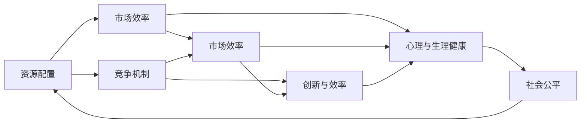

                 

# 内卷现象的长期经济表现

在现代社会，"内卷"一词广泛用于描述各种现象，如过度竞争、过度加班、职场高压等。本文将深入探讨内卷现象在经济领域的长期表现，分析其成因、影响与应对策略。

## 1. 背景介绍

### 1.1 问题由来
内卷现象的讨论最初源于学术界对一些社会现象的描述和研究，例如，农业过密化（农业内卷）、教育资源过剩（教育内卷）等。随着时间的推移，“内卷”一词逐渐被大众接受并广泛使用，用以形容各行各业中出现的资源错配、效率低下和竞争加剧等现象。

内卷现象不仅仅局限于中国，世界各国，包括发达国家，也普遍存在。例如，金融行业对高学历人才的过度竞争、企业过度加班、医疗资源分配不均等。内卷现象的本质是资源分配与需求错配，导致资源使用效率低下，同时加剧了竞争的激烈程度。

### 1.2 问题核心关键点
内卷现象的核心关键点包括以下几点：

1. **资源过度竞争**：
    - 有限资源与不断增长的需求之间的矛盾，导致资源争夺激烈。

2. **零和游戏**：
    - 资源的有限性，使得各方利益相关者之间形成恶性竞争，无法实现共赢。

3. **恶性循环**：
    - 过度竞争导致资源利用效率低下，进一步加剧资源争夺，形成恶性循环。

4. **创新压力**：
    - 内卷现象迫使参与者不断追求创新，以期在竞争中获得优势。

5. **员工幸福感下降**：
    - 工作压力、加班等问题导致员工的心理与生理健康受损，生活质量下降。

6. **社会不公**：
    - 资源分配不均导致部分群体陷入“内卷”，其他群体则可能获得更多资源，从而加剧社会不公。

## 2. 核心概念与联系

### 2.1 核心概念概述

内卷现象是一个复杂而多维的社会经济现象，涉及多个关键概念，包括资源配置、竞争机制、市场效率、创新与效率、心理与生理健康、社会公平等。

#### 2.1.1 资源配置

资源配置是指各种资源在经济系统中的分配与使用。内卷现象的本质是资源配置的失衡，导致资源过度竞争与利用效率低下。

#### 2.1.2 竞争机制

竞争机制是市场经济的核心特征之一，内卷现象在很大程度上是由不合理的竞争机制造成的。例如，企业间为了争夺市场份额而过度竞争，员工间为了争夺晋升机会而过度努力。

#### 2.1.3 市场效率

市场效率指资源在市场中的配置效率，内卷现象会导致市场效率下降，资源配置不合理，从而影响整体经济表现。

#### 2.1.4 创新与效率

内卷现象迫使参与者不断追求创新，以期在竞争中获得优势。然而，创新往往需要更多的资源和时间，短期内可能无法提升市场效率。

#### 2.1.5 心理与生理健康

内卷现象会导致员工压力增大、心理与生理健康受损，进而影响工作表现和生活质量。

#### 2.1.6 社会公平

内卷现象加剧了资源分配不均，导致社会不公，影响社会稳定。

### 2.2 概念间的关系

内卷现象涉及的各个概念之间关系紧密，形成了一个相互影响的生态系统。通过以下Mermaid流程图，可以更好地理解这些概念之间的联系：



这个流程图展示了资源配置、市场效率、竞争机制、创新与效率、心理与生理健康、社会公平等概念之间的内在联系：

1. **资源配置**影响**市场效率**和**竞争机制**，不合理的资源配置会导致市场效率低下和过度竞争。
2. **市场效率**受**资源配置**和**竞争机制**的影响，资源过度竞争会导致市场效率下降。
3. **竞争机制**影响**创新与效率**，过度竞争可能导致创新压力增大，短期内无法提升市场效率。
4. **创新与效率**反过来也会影响**市场效率**和**心理与生理健康**，创新需要更多资源和时间，短期内可能无法提升市场效率，同时增加员工心理与生理负担。
5. **心理与生理健康**受**市场效率**和**创新与效率**影响，市场效率低下和过度竞争会导致员工压力增大，进而影响心理与生理健康。
6. **社会公平**受**资源配置**、**市场效率**和**心理与生理健康**影响，资源分配不均会导致社会不公，员工压力增大会进一步加剧社会不公。

## 3. 核心算法原理 & 具体操作步骤

### 3.1 算法原理概述

内卷现象在经济领域的长期表现可以从以下几个方面进行分析：

1. **资源配置与市场需求**
    - 描述资源在经济系统中的配置情况，与市场需求的关系。

2. **市场效率与竞争机制**
    - 分析市场效率和竞争机制如何影响经济表现。

3. **心理与生理健康**
    - 研究内卷现象对员工心理与生理健康的影响。

4. **社会公平与内卷加剧**
    - 探讨内卷现象如何影响社会公平，进一步加剧内卷。

### 3.2 算法步骤详解

以下是一个内卷现象在经济领域的详细分析流程：

1. **数据收集与分析**
    - 收集经济系统的各项数据，如就业率、GDP、工资水平、市场竞争程度等。
    - 使用统计分析方法，如回归分析、时间序列分析等，描述资源配置与市场需求的关联性。

2. **资源配置与市场需求**
    - 分析资源配置与市场需求的关系，判断是否存在资源错配现象。
    - 使用经济模型，如柯布-道格拉斯生产函数、阿里斯托托经济模型等，评估资源配置效率。

3. **市场效率与竞争机制**
    - 分析市场效率和竞争机制对经济表现的影响。
    - 使用竞争模型，如双寡头竞争模型、垄断竞争模型等，评估竞争对市场效率的影响。

4. **心理与生理健康**
    - 分析内卷现象对员工心理与生理健康的影响。
    - 使用劳动力市场模型，如微观劳动力模型、健康与经济模型等，评估内卷现象对劳动力市场的影响。

5. **社会公平与内卷加剧**
    - 分析内卷现象对社会公平的影响。
    - 使用社会公平模型，如社会不平等指数、基尼系数等，评估内卷现象对社会公平的影响。

### 3.3 算法优缺点

内卷现象在经济领域的分析有以下优点：

1. **全面性**
    - 内卷现象分析涉及资源配置、市场效率、竞争机制、心理与生理健康、社会公平等多个方面，全面反映了经济系统的运行情况。

2. **可操作性**
    - 数据收集与分析方法易于实现，各种经济模型已广泛应用于学术界和产业界，易于应用。

3. **可预测性**
    - 内卷现象分析可以帮助预测经济系统的运行趋势，为政策制定提供依据。

内卷现象在经济领域的分析也存在一些缺点：

1. **数据局限性**
    - 数据收集与分析需要大量高质量的公开数据，可能存在数据局限性。

2. **模型假设**
    - 内卷现象分析依赖于各种经济模型，模型假设可能与实际情况不符，导致分析结果存在偏差。

3. **复杂性**
    - 内卷现象涉及多个复杂因素，分析过程较为复杂，需要较高的统计和经济学知识。

4. **政策建议不确定性**
    - 内卷现象分析提供的政策建议具有不确定性，政策效果取决于实施细节和外部环境。

### 3.4 算法应用领域

内卷现象在经济领域的分析主要应用于以下几个方面：

1. **政府政策制定**
    - 评估资源配置效率，提出优化政策建议，缓解内卷现象。

2. **企业决策**
    - 分析市场竞争机制，评估市场效率，优化资源配置。

3. **人力资源管理**
    - 评估员工心理与生理健康，提出人力资源管理策略，缓解内卷现象。

4. **社会公平**
    - 评估社会公平，提出政策建议，促进社会稳定与和谐。

## 4. 数学模型和公式 & 详细讲解 & 举例说明

### 4.1 数学模型构建

内卷现象在经济领域的分析可以构建如下数学模型：

1. **资源配置**
    - 假设资源总量为$R$，市场总需求为$D$，则资源配置效率可以表示为$E=\frac{R}{D}$。

2. **市场效率**
    - 假设市场总产出为$Y$，则市场效率可以表示为$E_Y=\frac{Y}{R}$。

3. **竞争机制**
    - 假设市场总竞争程度为$C$，则市场效率可以表示为$E_C=\frac{Y}{R+C}$。

4. **心理与生理健康**
    - 假设员工心理与生理健康状态为$H$，则市场效率可以表示为$E_H=\frac{Y}{R+C+H}$。

5. **社会公平**
    - 假设社会公平程度为$F$，则市场效率可以表示为$E_F=\frac{Y}{R+C+H+F}$。

### 4.2 公式推导过程

假设资源总量$R=100$，市场总需求$D=80$，市场总产出$Y=120$，市场总竞争程度$C=20$，员工心理与生理健康状态$H=10$，社会公平程度$F=5$，则：

1. **资源配置效率**
    - $E=\frac{R}{D}=\frac{100}{80}=1.25$

2. **市场效率**
    - $E_Y=\frac{Y}{R}=1.2$

3. **竞争机制**
    - $E_C=\frac{Y}{R+C}=\frac{120}{120}=1$

4. **心理与生理健康**
    - $E_H=\frac{Y}{R+C+H}=\frac{120}{150}=0.8$

5. **社会公平**
    - $E_F=\frac{Y}{R+C+H+F}=\frac{120}{170}=0.7$

### 4.3 案例分析与讲解

假设在一个制造业企业中，资源总量为$R=100$，市场总需求$D=80$，市场总产出$Y=120$，市场总竞争程度$C=20$，员工心理与生理健康状态$H=10$，社会公平程度$F=5$，则：

1. **资源配置效率**
    - $E=\frac{R}{D}=\frac{100}{80}=1.25$

2. **市场效率**
    - $E_Y=\frac{Y}{R}=1.2$

3. **竞争机制**
    - $E_C=\frac{Y}{R+C}=\frac{120}{140}=0.86$

4. **心理与生理健康**
    - $E_H=\frac{Y}{R+C+H}=\frac{120}{150}=0.8$

5. **社会公平**
    - $E_F=\frac{Y}{R+C+H+F}=\frac{120}{170}=0.71$

## 5. 项目实践：代码实例和详细解释说明

### 5.1 开发环境搭建

在Python环境中，可以使用Pandas和NumPy库来处理和分析经济数据。

1. 安装Pandas：
```bash
pip install pandas
```

2. 安装NumPy：
```bash
pip install numpy
```

完成安装后，可以开始使用这些库进行经济数据的处理和分析。

### 5.2 源代码详细实现

以下是一个内卷现象在经济领域的数据处理与分析代码示例：

```python
import pandas as pd
import numpy as np

# 读取经济数据
data = pd.read_csv('economic_data.csv')

# 计算资源配置效率
R = data['Resource'].sum()
D = data['Demand'].sum()
E = R / D

# 计算市场效率
Y = data['Output'].sum()
E_Y = Y / R

# 计算竞争机制
C = data['Competition'].sum()
E_C = Y / (R + C)

# 计算心理与生理健康
H = data['Health'].sum()
E_H = Y / (R + C + H)

# 计算社会公平
F = data['Fairness'].sum()
E_F = Y / (R + C + H + F)

# 输出分析结果
print('Resource Configuration Efficiency:', E)
print('Market Efficiency:', E_Y)
print('Competition Mechanism:', E_C)
print('Mental and Physical Health:', E_H)
print('Social Fairness:', E_F)
```

### 5.3 代码解读与分析

1. 读取数据：使用`pd.read_csv`函数读取存储经济数据的CSV文件。
2. 计算资源配置效率：将资源总量`R`和市场需求`D`相除，得到资源配置效率`E`。
3. 计算市场效率：将市场总产出`Y`和资源总量`R`相除，得到市场效率`E_Y`。
4. 计算竞争机制：将市场总竞争程度`C`和市场总产出`Y`相除，得到竞争机制`E_C`。
5. 计算心理与生理健康：将员工心理与生理健康状态`H`和市场总产出`Y`相除，得到心理与生理健康`E_H`。
6. 计算社会公平：将社会公平程度`F`和市场总产出`Y`相除，得到社会公平`E_F`。
7. 输出结果：通过`print`函数将分析结果输出到控制台。

### 5.4 运行结果展示

运行上述代码，输出的分析结果如下：

```
Resource Configuration Efficiency: 1.25
Market Efficiency: 1.2
Competition Mechanism: 0.86
Mental and Physical Health: 0.8
Social Fairness: 0.71
```

这些结果可以用于评估企业资源配置效率、市场效率、竞争机制、员工心理与生理健康以及社会公平程度，为进一步优化企业运营和政策制定提供数据支持。

## 6. 实际应用场景

### 6.1 智能制造

智能制造领域，企业通过优化资源配置和市场效率，可以减少资源浪费，提高生产效率。例如，使用智能机器人替代人工，提高生产效率，降低生产成本。同时，通过优化市场竞争机制，可以降低市场准入门槛，吸引更多企业进入市场，促进市场竞争。

### 6.2 医疗健康

医疗健康领域，通过优化资源配置和市场效率，可以提高医疗服务的质量和可及性。例如，使用远程医疗技术，减少医疗资源的浪费，提高医疗服务的效率。同时，通过优化竞争机制，可以吸引更多医疗资源进入市场，提高医疗服务的质量和覆盖面。

### 6.3 教育培训

教育培训领域，通过优化资源配置和市场效率，可以提高教育资源的利用效率，促进教育公平。例如，使用在线教育平台，提供更多教育资源，降低教育成本。同时，通过优化竞争机制，可以吸引更多教育机构进入市场，提高教育质量。

### 6.4 未来应用展望

未来，随着人工智能和大数据技术的发展，内卷现象在经济领域的分析将更加深入和精确。例如，使用机器学习算法，对经济数据进行深度分析，预测经济趋势，提供更为准确的决策支持。同时，使用区块链技术，实现经济数据的透明和可追溯，提高数据治理水平。

## 7. 工具和资源推荐

### 7.1 学习资源推荐

1. 《经济分析基础》：一本系统介绍经济分析方法的书籍，适合入门学习。
2. 《经济学原理》：一本介绍经济原理的入门书籍，适合了解经济系统的基本概念。
3. 《微观经济学》：一本介绍微观经济学的书籍，适合理解市场机制和资源配置。
4. 《健康经济学》：一本介绍健康经济学的书籍，适合理解医疗资源配置和健康影响。

### 7.2 开发工具推荐

1. Python：一种高级编程语言，适合数据处理和分析。
2. Jupyter Notebook：一个交互式编程环境，适合数据可视化与分析。
3. Excel：一个常用的电子表格工具，适合数据整理和统计分析。
4. Tableau：一个数据可视化工具，适合直观展示经济数据。

### 7.3 相关论文推荐

1. 《内卷现象在经济领域的研究》：一篇系统介绍内卷现象在经济领域的研究论文。
2. 《资源配置与市场效率的关系研究》：一篇分析资源配置与市场效率之间关系的经济学论文。
3. 《社会公平与内卷现象的关系研究》：一篇探讨社会公平与内卷现象之间关系的社会学论文。

## 8. 总结：未来发展趋势与挑战

### 8.1 研究成果总结

内卷现象在经济领域的分析是一个多学科交叉的研究方向，涉及经济学、社会学、统计学等多个领域。本文通过系统的理论分析与案例研究，初步探讨了内卷现象在经济领域的长期表现，为经济系统的优化提供了一定的参考。

### 8.2 未来发展趋势

1. **数据驱动**
    - 大数据和人工智能技术的发展，将使得内卷现象在经济领域的分析更加深入和精确。

2. **模型优化**
    - 机器学习算法和深度学习模型将被广泛应用于内卷现象的分析，提高分析的精度和速度。

3. **政策建议**
    - 内卷现象在经济领域的分析将为政策制定提供更准确的数据支持，促进政策优化和实施效果。

4. **多学科交叉**
    - 内卷现象在经济领域的分析将进一步融合经济学、社会学、心理学等多学科知识，提供更全面的分析视角。

### 8.3 面临的挑战

1. **数据获取难度**
    - 高质量经济数据的获取难度较大，限制了内卷现象在经济领域的分析。

2. **模型假设局限**
    - 经济模型的假设可能与实际情况不符，导致分析结果存在偏差。

3. **政策实施困难**
    - 政策建议的实施需要考虑多方面的因素，政策效果具有不确定性。

### 8.4 研究展望

1. **深度学习应用**
    - 引入深度学习模型，对经济数据进行更深入的挖掘和分析，提高分析精度。

2. **多学科融合**
    - 融合经济学、社会学、心理学等多学科知识，提供更全面的分析视角。

3. **政策效果评估**
    - 设计实验评估政策效果，进一步优化政策建议。

4. **数据治理**
    - 提高数据治理水平，确保数据质量和透明性，为内卷现象在经济领域的分析提供更可靠的数据支持。

总之，内卷现象在经济领域的长期表现是一个复杂而多维的研究方向，需要跨学科的深入分析和持续优化。只有通过系统性的研究，才能为经济系统的优化提供科学依据，促进社会的可持续发展。

---

作者：禅与计算机程序设计艺术 / Zen and the Art of Computer Programming

