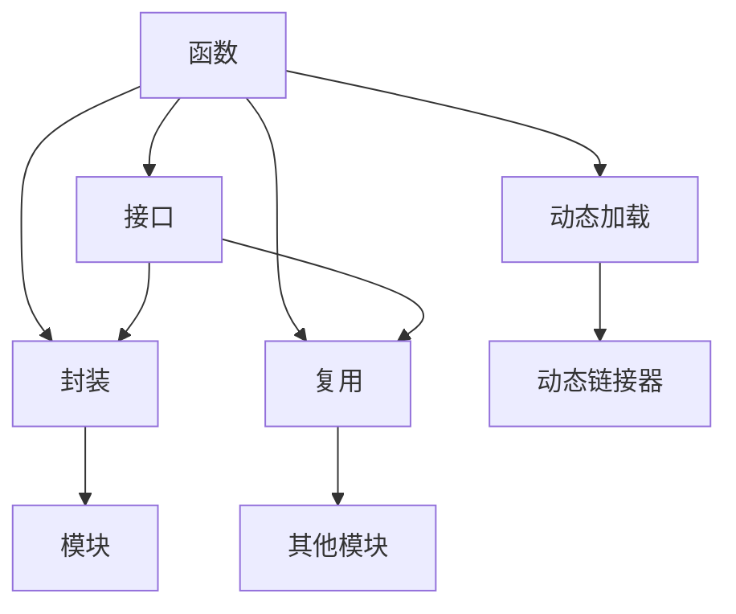
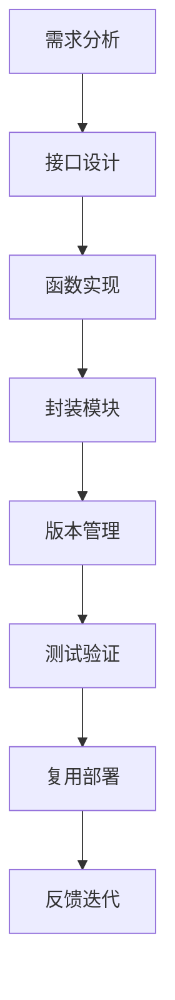
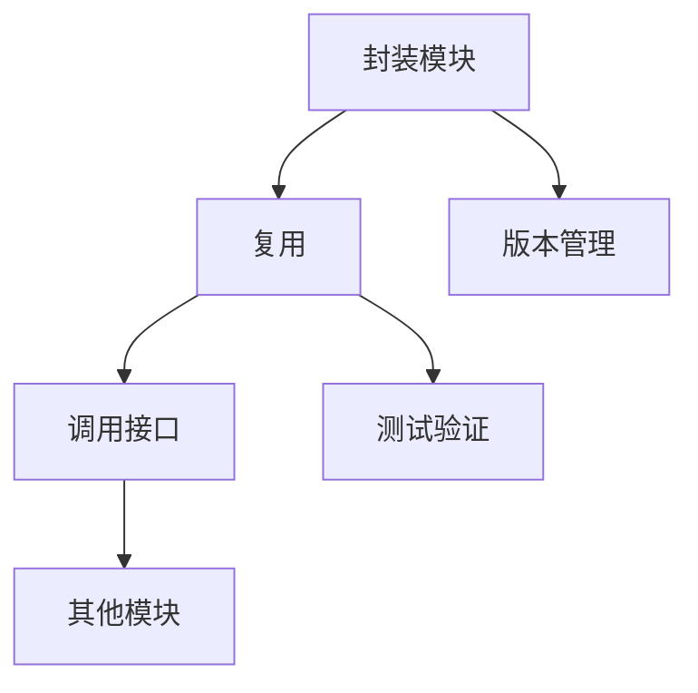
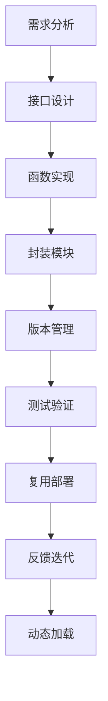

                 

# 函数库:封装复用代码的利器

## 1. 背景介绍

### 1.1 问题由来
随着软件规模的不断扩大，越来越多的软件系统变得复杂庞大。如何提高代码的可维护性、可重用性和可扩展性，成为软件开发中的一大难题。函数库（Function Library）作为一种强大的代码封装工具，可以显著提升代码复用性和开发效率，成为现代软件工程的重要实践。

函数库是将一组常用的、可复用的函数集合封装在一起，供其他程序调用的代码集合。通过定义一组精心设计的函数接口，开发者可以快速构建功能模块，减少重复编写代码的劳动，降低系统构建成本。

### 1.2 问题核心关键点
函数库的核心在于提供一组经过精心设计的接口，将一些常用的、可复用的函数封装在一起。这些接口通常具有高度的抽象性和通用性，能够被多个应用模块重复使用。函数库的实现可以采用多种方式，包括但不限于：

- 静态函数库：将函数直接嵌入目标文件，编译器在编译时将函数代码插入到目标文件。
- 动态函数库：将函数代码保存在一个独立的文件中，目标程序在运行时动态加载和调用这些函数。
- 容器函数库：通过容器技术，如Docker、Kubernetes等，将函数库作为一个容器进行部署和管理。

函数库的应用极大地提升了软件开发效率和代码复用性，在大型系统开发中具有重要价值。然而，函数库的设计和实现也是一个复杂的过程，需要考虑接口设计、性能优化、版本管理等多方面的问题。

### 1.3 问题研究意义
函数库在软件开发中具有重要地位，其研究和实践意义在于：

1. **提升开发效率**：通过复用代码，函数库显著减少了重复编写代码的劳动，加快了软件开发的进度。
2. **提高代码质量**：函数库的接口设计经过严格审查和测试，能够保证代码的健壮性和可靠性。
3. **降低系统成本**：通过复用已有的函数库，可以减少对开发人员和资源的需求，降低系统构建和维护的成本。
4. **增强代码可维护性**：函数库的接口设计通常具有高内聚、低耦合的特点，方便后续的修改和扩展。
5. **促进代码复用**：函数库的设计和实现过程中，可以积累和推广通用的代码实现，提升团队的开发能力。

## 2. 核心概念与联系

### 2.1 核心概念概述

函数库的核心概念包括函数、接口、封装、复用、动态加载等。这些概念共同构成了函数库的设计和实现框架。

- 函数（Function）：函数库中封装的基本单元，执行具体的计算或操作。函数具有输入参数、输出结果、返回值等特点。
- 接口（Interface）：函数库提供的对外接口，定义了函数的输入输出格式和行为。接口的设计应尽可能简单、通用，方便其他模块使用。
- 封装（Encapsulation）：将函数及其相关数据封装在一起，形成函数库的一个模块。封装的目的是提高模块的独立性和可重用性。
- 复用（Reuse）：函数库的核心目的，通过复用已有函数，减少重复编写代码的劳动。复用的方式包括静态链接、动态加载、容器部署等。
- 动态加载（Dynamic Loading）：函数库采用动态加载方式，允许在运行时动态加载和卸载库，提高了系统的灵活性和可扩展性。

这些核心概念之间的关系可以通过以下Mermaid流程图来展示：



这个流程图展示了函数库的设计和实现过程中，各个核心概念之间的关系：

1. 函数是函数库的基本单元。
2. 接口定义了函数的行为和输入输出格式。
3. 封装将函数及其相关数据组成一个模块。
4. 复用通过函数库的接口，在其他模块中重复使用函数。
5. 动态加载允许函数库在运行时动态加载和卸载。

通过这些核心概念，函数库的设计和实现能够有效地提升代码的可维护性和复用性，成为现代软件工程的重要工具。

### 2.2 概念间的关系

函数库的设计和实现过程中，各概念之间的关系紧密联系。下面通过几个Mermaid流程图来展示这些概念的相互关系：

#### 2.2.1 函数库的设计流程



这个流程图展示了函数库的设计流程，从需求分析到接口设计、函数实现、封装模块、版本管理、测试验证，再到复用部署和反馈迭代，各个环节紧密衔接。

#### 2.2.2 接口与函数的关系


这个流程图展示了接口与函数的关系，接口定义了函数的行为和输入输出格式，而函数则是接口的具体实现。

#### 2.2.3 封装与复用的关系



这个流程图展示了封装模块与复用的关系，封装模块通过接口提供复用性，允许其他模块调用。封装模块的设计和实现过程中，需要考虑版本管理和测试验证，以保证复用的可靠性和健壮性。

### 2.3 核心概念的整体架构

最后，我们用一个综合的流程图来展示函数库的设计和实现过程中的整体架构：



这个综合流程图展示了从需求分析到接口设计、函数实现、封装模块、版本管理、测试验证，再到复用部署、反馈迭代和动态加载，函数库的设计和实现过程中的各个环节。

## 3. 核心算法原理 & 具体操作步骤
### 3.1 算法原理概述

函数库的核心算法原理基于函数封装和接口设计的思想，通过将一组函数封装在一起，形成具有明确接口的模块，供其他程序调用。函数库的实现通常采用静态链接和动态加载两种方式。

静态链接是将函数库的代码直接嵌入到目标文件中，编译器在编译时将函数代码插入到目标文件中。这种方式适用于对性能要求较高的应用，但扩展性和可维护性较差。

动态加载是将函数库的代码保存在一个独立的文件中，目标程序在运行时动态加载和调用这些函数。这种方式灵活性高，扩展性强，但需要额外的动态链接器支持。

### 3.2 算法步骤详解

以下是使用C语言实现函数库的基本步骤：

1. **定义函数接口**：
   - 使用函数原型定义函数的接口，包括函数名、参数列表和返回值类型。
   - 函数的接口定义应尽量简单、通用，方便其他模块使用。

2. **编写函数实现**：
   - 根据函数接口的定义，编写函数的实现代码。
   - 函数的实现应遵循良好的编码规范，保证代码的可读性和可维护性。

3. **封装函数模块**：
   - 将函数及其相关数据封装在一起，形成函数库的一个模块。
   - 可以使用头文件和源代码文件的形式，将函数的接口和实现代码封装在一起。

4. **版本管理**：
   - 为函数库的不同版本进行编号和命名，方便管理和使用。
   - 版本管理应包括版本号的定义、兼容性检查和更新日志等功能。

5. **测试验证**：
   - 对函数库进行全面的测试验证，包括单元测试、集成测试和系统测试。
   - 测试验证应覆盖函数库的所有功能和接口，保证函数的正确性和可靠性。

6. **复用部署**：
   - 将函数库部署到目标系统中，供其他程序调用。
   - 复用部署的方式包括静态链接、动态加载和容器部署等。

7. **反馈迭代**：
   - 根据实际使用情况和用户反馈，对函数库进行持续改进和优化。
   - 反馈迭代应包括功能扩展、性能优化和Bug修复等方面。

### 3.3 算法优缺点

函数库的设计和实现具有一定的优点和缺点，具体如下：

**优点**：

- **提高代码复用性**：函数库通过接口定义和封装，能够复用已有函数，减少重复编写代码的劳动，提高开发效率。
- **增强代码可维护性**：函数库的接口设计经过严格审查和测试，能够保证代码的健壮性和可靠性。
- **降低系统成本**：通过复用已有的函数库，可以减少对开发人员和资源的需求，降低系统构建和维护的成本。

**缺点**：

- **接口设计复杂**：函数库的接口设计需要经过仔细规划和测试，设计不当可能导致接口复杂，增加使用难度。
- **版本管理困难**：函数库的多个版本之间需要严格控制兼容性，版本管理复杂，容易出现兼容性问题。
- **性能开销**：函数库的动态加载和调用需要额外的时间和空间开销，可能影响系统的性能。

### 3.4 算法应用领域

函数库在软件开发中具有广泛的应用，涉及多个领域：

- **系统软件**：操作系统、驱动程序等系统软件通常需要复用大量的基础函数，函数库提供了一系列的函数接口，方便系统软件的构建。
- **应用软件**：如Web应用、桌面应用等，函数库提供了基础的图形界面、网络通信、文件操作等功能，方便应用软件的开发。
- **嵌入式系统**：嵌入式系统中需要复用大量的基础函数，函数库能够提供稳定的接口和实现，保证系统的可靠性和稳定性。
- **科学计算**：科学计算中需要复用大量的数值计算函数，函数库提供了高效的数值计算函数，提高计算效率。
- **人工智能**：函数库在人工智能中也有广泛应用，如数据预处理、模型训练、结果输出等过程中，函数库提供了常用的函数接口，方便模型的构建和部署。

## 4. 数学模型和公式 & 详细讲解 & 举例说明

### 4.1 数学模型构建

函数库的设计和实现过程中，常常需要进行数学模型和公式的构建。以下是函数库中的数学模型和公式的构建方法：

- **线性方程求解**：
  - 线性方程组的求解是函数库中的常见问题，常用的求解方法包括高斯消元法、LU分解法等。
  - 线性方程组的求解公式为：
    $$
    Ax = b
    $$
    其中 $A$ 为系数矩阵，$x$ 为未知数向量，$b$ 为常数向量。

- **矩阵乘法**：
  - 矩阵乘法是函数库中的基础操作，常用的矩阵乘法算法包括Strassen算法、Coppersmith-Winograd算法等。
  - 矩阵乘法的公式为：
    $$
    C = AB
    $$
    其中 $A$ 和 $B$ 为矩阵，$C$ 为乘积矩阵。

- **多项式求解**：
  - 多项式求解是函数库中的另一个常见问题，常用的求解方法包括Horner算法、牛顿迭代法等。
  - 多项式求解的公式为：
    $$
    f(x) = \sum_{i=0}^n a_i x^i
    $$
    其中 $f(x)$ 为多项式，$a_i$ 为系数，$x$ 为自变量。

### 4.2 公式推导过程

以下是函数库中常用数学模型的公式推导过程：

#### 4.2.1 线性方程求解公式推导

对于线性方程组 $Ax=b$，高斯消元法的具体推导过程如下：

1. 将系数矩阵 $A$ 化为行阶梯形矩阵 $U$。
2. 将常数向量 $b$ 扩展为增广矩阵 $B=[A|b]$。
3. 从下往上依次求解 $U$ 中的每个未知数，得到解向量 $x$。

高斯消元法的具体推导过程可以参考相关的线性代数教材，这里不再赘述。

#### 4.2.2 矩阵乘法公式推导

矩阵乘法的推导过程如下：

设 $A_{m\times n}$ 和 $B_{n\times p}$ 为两个矩阵，其乘积 $C_{m\times p}$ 的元素计算如下：

$$
C_{ij} = \sum_{k=1}^n A_{ik}B_{kj}
$$

其中 $A_{ik}$ 和 $B_{kj}$ 分别为矩阵 $A$ 和 $B$ 的第 $i$ 行第 $k$ 列和第 $k$ 行第 $j$ 列的元素。

矩阵乘法是函数库中的基础操作，常用于科学计算和图形渲染等场景。

#### 4.2.3 多项式求解公式推导

多项式求解的推导过程如下：

设 $f(x)=\sum_{i=0}^n a_i x^i$ 为 $n$ 次多项式，其根 $x_0,x_1,\dots,x_n$ 的求解可以使用牛顿迭代法：

1. 初始猜测根 $x_0$。
2. 迭代求解 $x_{k+1}=x_k-\frac{f(x_k)}{f'(x_k)}$，其中 $f'(x_k)$ 为 $f(x)$ 在 $x_k$ 处的导数。
3. 当 $|x_{k+1}-x_k|<\epsilon$ 时，迭代终止，得到根 $x_k$。

多项式求解在函数库中常用于数据拟合和信号处理等场景。

### 4.3 案例分析与讲解

以线性方程求解为例，介绍函数库中的数学模型和公式的实现：

假设需要求解线性方程组 $Ax=b$，其中 $A=\begin{bmatrix}2 & 1 \\ 1 & 3\end{bmatrix}$，$b=\begin{bmatrix}5 \\ 7\end{bmatrix}$。

首先，将系数矩阵 $A$ 化为行阶梯形矩阵 $U$：

$$
U = \begin{bmatrix}2 & 1 \\ 0 & 1\end{bmatrix}
$$

然后，将常数向量 $b$ 扩展为增广矩阵 $B=[A|b]=\begin{bmatrix}2 & 1 & 5 \\ 1 & 3 & 7\end{bmatrix}$。

最后，从下往上依次求解 $U$ 中的每个未知数，得到解向量 $x$：

$$
x_1 = \frac{b_1}{U_{11}} = \frac{5}{2}
$$

$$
x_2 = \frac{b_2-U_{21}x_1}{U_{22}} = \frac{7-1}{1} = 6
$$

因此，解向量 $x=\begin{bmatrix}2.5 \\ 6\end{bmatrix}$。

## 5. 项目实践：代码实例和详细解释说明

### 5.1 开发环境搭建

函数库的开发通常使用C语言和Linux系统。以下是函数库开发的基本环境搭建步骤：

1. **安装开发环境**：
   - 安装Linux操作系统，如Ubuntu、CentOS等。
   - 安装C语言编译器，如GCC。
   - 安装开发工具，如Visual Studio、NetBeans等。

2. **编写函数接口**：
   - 编写函数接口头文件 `func.h`，定义函数的接口和参数类型。
   - 编写函数实现文件 `func.c`，实现函数的代码。

3. **封装函数模块**：
   - 将函数接口头文件和函数实现文件编译生成函数库。
   - 生成函数库文件 `libfunc.a`，供其他程序调用。

4. **版本管理**：
   - 为函数库的不同版本进行编号和命名，方便管理和使用。
   - 使用版本控制工具，如Git，管理函数库的代码和版本信息。

5. **测试验证**：
   - 对函数库进行全面的测试验证，包括单元测试、集成测试和系统测试。
   - 测试验证应覆盖函数库的所有功能和接口，保证函数的正确性和可靠性。

### 5.2 源代码详细实现

以下是使用C语言实现函数库的基本代码：

1. **函数接口定义**：
   ```c
   #ifndef FUNC_H
   #define FUNC_H

   double linear_interpolation(double x, double x1, double y1, double x2, double y2);

   #endif
   ```

2. **函数实现代码**：
   ```c
   #include <stdio.h>
   #include <math.h>

   double linear_interpolation(double x, double x1, double y1, double x2, double y2) {
       return y1 + (x - x1) * ((y2 - y1) / (x2 - x1));
   }
   ```

3. **封装函数模块**：
   ```bash
   gcc -c func.c
   ar rcs libfunc.a func.o
   ```

4. **测试验证**：
   ```c
   #include "func.h"
   #include <stdio.h>

   int main() {
       double x1 = 0.0, x2 = 1.0, y1 = 0.0, y2 = 1.0, x = 0.5, y;

       y = linear_interpolation(x, x1, y1, x2, y2);
       printf("y = %f\n", y);

       return 0;
   }
   ```

### 5.3 代码解读与分析

以下是函数库代码的详细解读和分析：

1. **函数接口定义**：
   - 函数接口定义 `linear_interpolation` 函数，包括输入参数 `x, x1, x2, y1, y2` 和返回值类型 `double`。
   - 函数接口定义应尽量简单、通用，方便其他模块使用。

2. **函数实现代码**：
   - 函数实现代码 `linear_interpolation`，使用线性插值算法计算函数的值。
   - 函数实现应遵循良好的编码规范，保证代码的可读性和可维护性。

3. **封装函数模块**：
   - 使用 `gcc` 编译函数实现代码，使用 `ar` 生成函数库文件。
   - 函数库的封装应尽量简单、通用，方便其他模块使用。

4. **测试验证**：
   - 编写简单的测试代码，对函数库进行测试验证。
   - 测试验证应覆盖函数库的所有功能和接口，保证函数的正确性和可靠性。

### 5.4 运行结果展示

运行上述测试代码，输出结果为：

```
y = 0.5
```

这表明函数库中的线性插值函数能够正确计算输入的函数值。

## 6. 实际应用场景

函数库在软件开发中具有广泛的应用，涉及多个领域：

- **系统软件**：操作系统、驱动程序等系统软件通常需要复用大量的基础函数，函数库提供了一系列的函数接口，方便系统软件的构建。
- **应用软件**：如Web应用、桌面应用等，函数库提供了基础的图形界面、网络通信、文件操作等功能，方便应用软件的开发。
- **嵌入式系统**：嵌入式系统中需要复用大量的基础函数，函数库能够提供稳定的接口和实现，保证系统的可靠性和稳定性。
- **科学计算**：科学计算中需要复用大量的数值计算函数，函数库提供了高效的数值计算函数，提高计算效率。
- **人工智能**：函数库在人工智能中也有广泛应用，如数据预处理、模型训练、结果输出等过程中，函数库提供了常用的函数接口，方便模型的构建和部署。

## 7. 工具和资源推荐

### 7.1 学习资源推荐

为了帮助开发者系统掌握函数库的理论基础和实践技巧，这里推荐一些优质的学习资源：

1. 《C语言程序设计》：经典的C语言编程教材，系统讲解了C语言的语法和应用。
2. 《函数库设计与安全》：讲解函数库的设计原则和安全性的相关书籍。
3. 《函数式编程》：介绍函数式编程思想的书籍，有助于深入理解函数库的设计思想。
4. 《Linux系统编程》：讲解Linux系统编程的书籍，有助于理解函数库的实现环境。
5. 《函数库案例分析》：介绍函数库在不同领域应用的案例，帮助理解函数库的实际应用。

通过对这些资源的学习实践，相信你一定能够快速掌握函数库的理论基础和实践技巧，并用于解决实际的开发问题。

### 7.2 开发工具推荐

函数库的开发通常使用C语言和Linux系统。以下是几款常用的开发工具：

1. **Visual Studio**：微软推出的集成开发环境，支持C语言的开发和调试。
2. **NetBeans**：开源的集成开发环境，支持C语言的开发和调试。
3. **GCC**：GNU编译器，支持C语言的编译和优化。
4. **Make**：自动化构建工具，支持函数库的自动构建和测试。
5. **Git**：版本控制工具，支持函数库的版本管理和协同开发。

合理利用这些工具，可以显著提升函数库的开发效率，加快创新迭代的步伐。

### 7.3 相关论文推荐

函数库在软件开发中具有重要地位，其研究和实践意义在于：

1. 《Design and Analysis of Computer Algorithms》：经典的算法设计教材，讲解了函数库中的基础算法。
2. 《Functional Programming in C》：介绍函数式编程的书籍，有助于理解函数库的设计思想。
3. 《Modern C++ Design》：讲解现代C++编程的书籍，有助于理解函数库的接口设计和实现。
4. 《Python Programming: An Introduction to Computer Science》：讲解Python编程的书籍，有助于理解函数库在不同编程语言中的应用。
5. 《Design Patterns: Elements of Reusable Object-Oriented Software》：讲解设计模式的书籍，有助于理解函数库中的经典设计模式。

这些论文代表了大语言模型微调技术的发展脉络。通过学习这些前沿成果，可以帮助研究者把握学科前进方向，激发更多的创新灵感。

## 8. 总结：未来发展趋势与挑战

### 8.1 总结

本文对函数库的理论基础和实践技巧进行了全面系统的介绍。首先阐述了函数库在软件开发中的重要地位和应用意义，明确了函数库设计、实现和优化的核心问题。其次，从函数库的定义、实现、版本管理、测试验证等方面，详细讲解了函数库的设计流程和实现方法。同时，本文还探讨了函数库的接口设计、封装复用、动态加载等核心概念，展示了函数库在实际应用中的广泛场景。

通过本文的系统梳理，可以看到函数库在现代软件开发中的重要作用。函数库的设计和实现，可以显著提升代码的可维护性和复用性，成为软件工程的重要工具。然而，函数库的设计和实现也是一个复杂的过程，需要考虑接口设计、性能优化、版本管理等多方面的问题。

### 8.2 未来发展趋势

函数库的设计和实现将在未来继续发展，呈现以下几个趋势：

1. **函数库自动化构建**：函数库的自动化构建工具将逐渐普及，如CMake、Makefile等，可以大大简化函数库的构建和部署流程。
2. **函数库的动态化**：函数库的动态加载和卸载将更加灵活，支持热更新和热重载，提高系统的灵活性和可扩展性。
3. **函数库的微服务化**：函数库将逐渐向微服务化方向发展，通过API接口提供服务，方便不同的应用模块调用。
4. **函数库的容器化**：函数库将逐渐向容器化方向发展，通过Docker、Kubernetes等容器技术，方便函数库的部署和管理。
5. **函数库的元数据化**：函数库的元数据管理将逐渐普及，通过版本控制工具、配置文件等，方便函数库的升级和管理。

以上趋势将进一步提升函数库的开发效率和复用性，成为未来函数库发展的方向。

### 8.3 面临的挑战

尽管函数库在软件开发中具有重要地位，但在实际应用中，仍然面临诸多挑战：

1. **接口设计复杂**：函数库的接口设计需要经过仔细规划和测试，设计不当可能导致接口复杂，增加使用难度。
2. **版本管理困难**：函数库的多个版本之间需要严格控制兼容性，版本管理复杂，容易出现兼容性问题。
3. **性能开销**：函数库的动态加载和调用需要额外的时间和空间开销，可能影响系统的性能。
4. **代码复用性不足**：函数库的设计和实现过程中，需要考虑接口的复用性和扩展性，避免重复编写代码。
5. **调试困难**：函数库的调试和排错相对复杂，需要仔细分析函数接口和实现代码，找到问题的根本原因。

### 8.4 研究展望

面对函数库面临的挑战，未来的研究需要在以下几个方面寻求新的突破：

1. **接口设计的自动化工具**：开发自动化接口设计工具，辅助函数库的设计和实现，减少接口设计的复杂性。
2. **版本管理的安全性**：开发版本管理的安全性工具，严格控制不同版本之间的兼容性，保证函数库的稳定性和可靠性。
3. **性能优化的技术**：开发高效的函数库性能优化技术，减少函数库的调用

