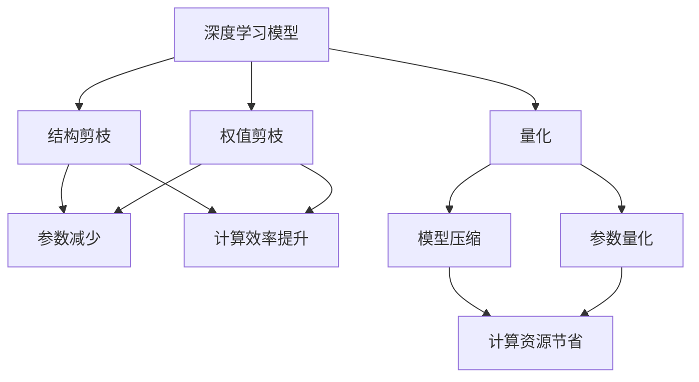
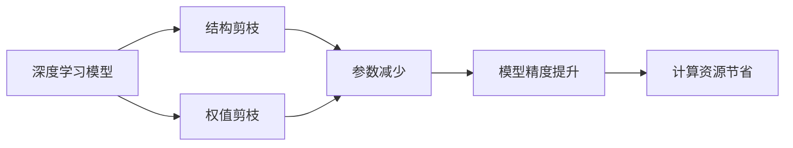
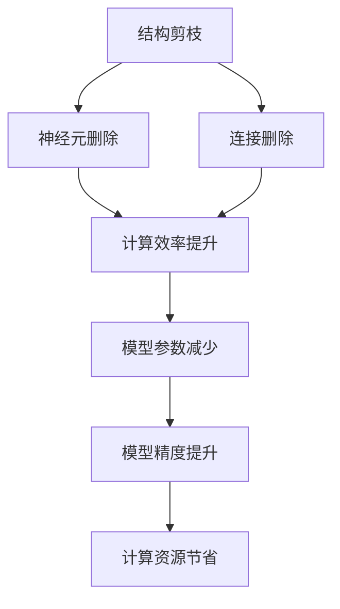
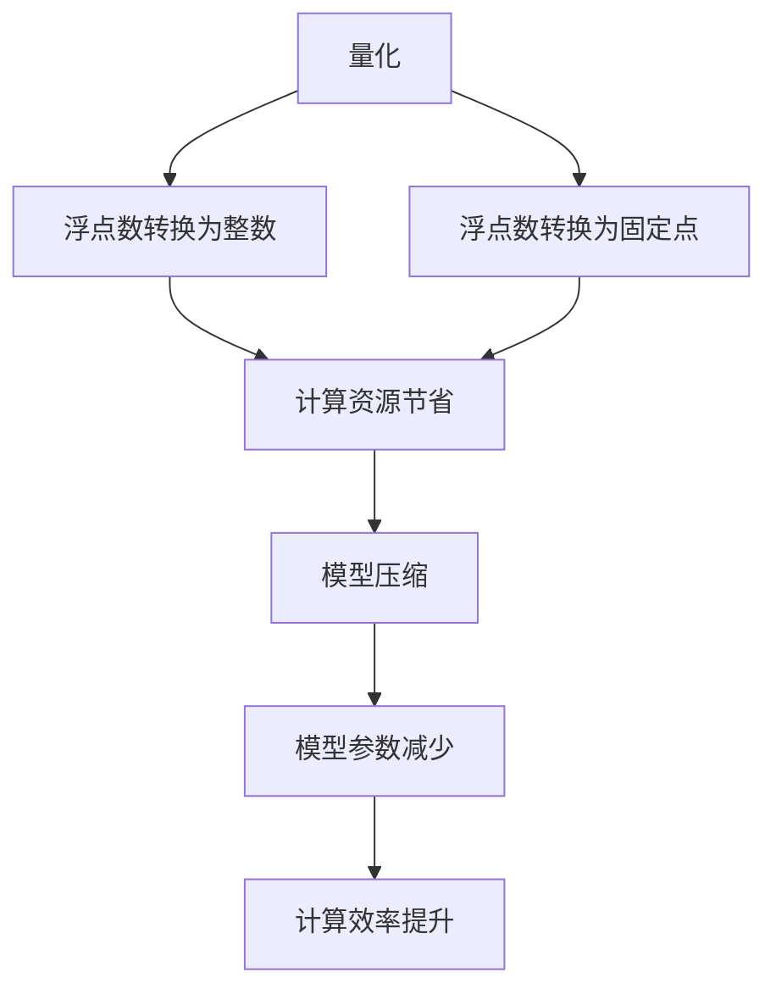
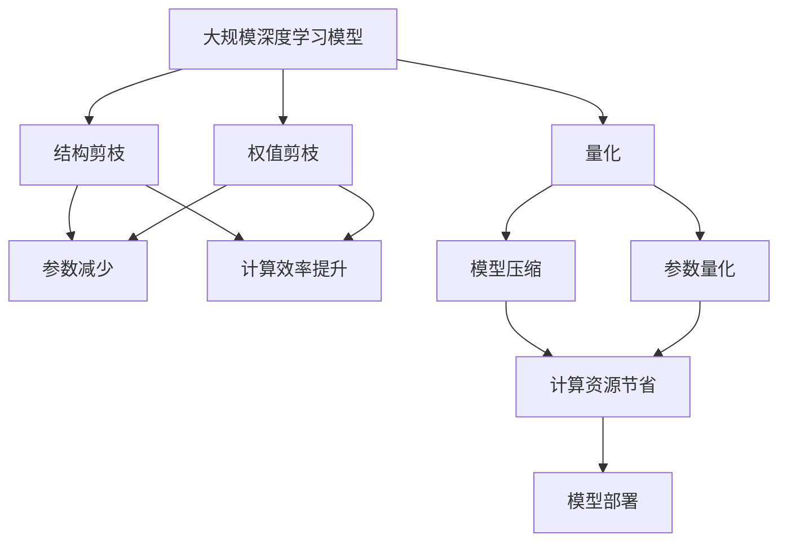

                 

# 剪枝技术在边缘AI设备中的实现挑战

> 关键词：剪枝,边缘AI,量化,优化,模型压缩,高效部署

## 1. 背景介绍

### 1.1 问题由来
随着人工智能(AI)技术在各行业的广泛应用，边缘AI设备如智能家居、车载系统、智能安防等的应用场景逐渐增多。这些设备往往具有低功耗、小尺寸、低成本等特点，需要运行复杂的AI算法以实现智能化功能。然而，这些设备的计算资源有限，且对实时性要求较高，使得传统基于集中式计算的AI模型难以直接部署在边缘设备上。

剪枝技术（Pruning）作为一种高效的模型压缩方法，通过去除冗余参数和连接，能够在保留模型主要功能的前提下大幅减小模型规模，显著降低计算和存储需求。然而，在边缘AI设备上应用剪枝技术，需要考虑诸多实际问题，如边缘设备的资源限制、剪枝算法的复杂度、剪枝后的模型质量等。

### 1.2 问题核心关键点
剪枝技术的核心在于如何精准识别和去除模型的冗余部分，保留最关键的部分。一般分为两部分：结构剪枝和权值剪枝。结构剪枝是指删除神经元或连接，通常可大幅减少计算量和内存占用，但可能导致模型精度下降。权值剪枝是指去除连接权重，可通过裁剪阈值或选择最小权重等方法实现，适用于一些计算密集型的网络结构。

剪枝技术的挑战在于：
- 如何在保留模型精度的同时，实现高效压缩。
- 如何在边缘设备上高效实现剪枝算法。
- 如何保证剪枝后模型的稳定性。

### 1.3 问题研究意义
边缘AI设备上的剪枝技术，对于实现高效、低成本、低功耗的AI应用至关重要。通过剪枝，可以在保证模型精度的前提下，显著减少边缘设备的计算和存储需求，提升模型的实时性和资源利用率。同时，剪枝技术也有助于促进边缘AI设备的广泛应用，加速AI技术的普及和落地。

## 2. 核心概念与联系

### 2.1 核心概念概述

为更好地理解剪枝技术在边缘AI设备中的实现，本节将介绍几个密切相关的核心概念：

- 剪枝(Pruning)：通过删除冗余连接或参数，减小模型规模，降低计算和存储需求。
- 量化(Quantization)：将模型中的浮点数参数转化为整数或固定点数的参数，进一步压缩模型空间。
- 结构剪枝(Structural Pruning)：通过删除神经元或连接，优化模型结构，提升计算效率。
- 权值剪枝(Weight Pruning)：通过裁剪或选择最小权重，压缩模型参数，保持模型精度。
- 深度学习(DL)模型：基于神经网络结构的模型，如卷积神经网络(CNN)、循环神经网络(RNN)等。
- 边缘AI设备：如智能家居、车载系统、智能安防等，具备低功耗、小尺寸、低成本等特点。

这些核心概念之间的逻辑关系可以通过以下Mermaid流程图来展示：



这个流程图展示了几类核心概念之间的关系：

1. 深度学习模型通过结构剪枝和权值剪枝优化结构，并通过量化进一步压缩。
2. 结构剪枝和权值剪枝在参数减少和计算效率提升方面有显著效果。
3. 量化在模型压缩和参数量化方面有显著效果。
4. 优化后的模型在计算资源节省方面有显著效果。

### 2.2 概念间的关系

这些核心概念之间存在着紧密的联系，形成了剪枝技术的完整生态系统。下面我通过几个Mermaid流程图来展示这些概念之间的关系。

#### 2.2.1 深度学习模型的剪枝流程



这个流程图展示了深度学习模型的剪枝流程。深度学习模型通过结构剪枝和权值剪枝减少参数，提升计算效率，并通过量化进一步压缩，最终实现计算资源节省。

#### 2.2.2 结构剪枝与权值剪枝的比较



这个流程图展示了结构剪枝和权值剪枝的区别和联系。结构剪枝通过删除神经元或连接，提升计算效率和模型参数减少；权值剪枝通过裁剪最小权重，保持模型精度，同时减少参数和计算量。

#### 2.2.3 量化与剪枝的协同作用



这个流程图展示了量化与剪枝的协同作用。量化通过将浮点数参数转化为整数或固定点参数，进一步压缩模型空间；与剪枝协同作用，可以显著减少计算和存储需求。

### 2.3 核心概念的整体架构

最后，我们用一个综合的流程图来展示这些核心概念在大规模模型压缩中的整体架构：



这个综合流程图展示了从预训练模型到剪枝、量化，再到模型部署的完整过程。大规模深度学习模型通过结构剪枝和权值剪枝优化结构，并通过量化进一步压缩，最终实现计算资源节省，并部署到边缘AI设备上。

## 3. 核心算法原理 & 具体操作步骤
### 3.1 算法原理概述

剪枝技术的核心在于如何识别并删除模型的冗余部分，同时保证模型的精度和功能不变。剪枝的过程可以分为以下几个步骤：

1. **模型评估**：通过各种指标评估模型性能，确定哪些部分是冗余的。
2. **参数选择**：选择哪些参数进行剪枝，如删除神经元或连接，或裁剪最小权重。
3. **剪枝实施**：实际删除或裁剪选择的参数。
4. **验证评估**：在测试集上验证剪枝后的模型性能，确保剪枝效果。

剪枝的算法原理如下：

1. **结构剪枝**：
   - 利用模型输入输出关系，确定神经元的重要性。
   - 选择低重要性神经元或连接进行删除。
   - 通过前向传播和反向传播验证剪枝效果。

2. **权值剪枝**：
   - 通过计算权重的大小，选择最小权重进行裁剪。
   - 验证剪枝后模型性能，选择最优剪枝阈值。

3. **混合剪枝**：
   - 结合结构剪枝和权值剪枝，实现更精确的模型压缩。
   - 通过多种策略组合，优化剪枝效果。

### 3.2 算法步骤详解

剪枝的具体操作步骤如下：

1. **准备数据集**：准备训练集和测试集，用于模型评估和性能验证。
2. **选择合适的剪枝策略**：如基于阈值、基于通道剪枝、基于网络架构剪枝等。
3. **定义评估指标**：如模型精度、计算资源、模型大小等，用于评估剪枝效果。
4. **剪枝模型评估**：在训练集和测试集上评估剪枝前后的模型性能，选择最优剪枝策略。
5. **实施剪枝**：根据选择的策略进行实际剪枝操作。
6. **验证和优化**：在测试集上验证剪枝后的模型性能，根据验证结果进行进一步优化。

### 3.3 算法优缺点

剪枝技术的优点在于：
- 显著减小模型规模，降低计算和存储需求。
- 提升模型的计算效率，加快推理速度。
- 减少边缘设备的资源消耗，延长设备寿命。

剪枝技术的缺点在于：
- 可能导致模型精度下降，尤其是在结构剪枝中。
- 剪枝算法复杂，实现难度较大。
- 需要大量的计算资源和时间进行剪枝和验证。

### 3.4 算法应用领域

剪枝技术在大规模模型压缩和优化中有着广泛的应用，如：

- **智能安防**：通过剪枝技术优化安防模型，实现低功耗、实时性的视频监控和图像识别。
- **智能家居**：通过剪枝技术优化家居AI设备，降低计算和存储需求，提升用户体验。
- **智能交通**：通过剪枝技术优化交通管理模型，实现高效、低成本的交通监控和预测。
- **医疗健康**：通过剪枝技术优化医疗AI模型，实现实时、精准的健康监测和疾病预测。
- **自动驾驶**：通过剪枝技术优化自动驾驶模型，实现高效的车辆控制和环境感知。

## 4. 数学模型和公式 & 详细讲解 & 举例说明

### 4.1 数学模型构建

假设原始深度学习模型为 $\mathcal{M}$，输入为 $\mathcal{X}$，输出为 $\mathcal{Y}$。剪枝的目标是寻找最优的剪枝策略 $\mathcal{P}$，使得剪枝后的模型 $\mathcal{M}_{\mathcal{P}}$ 在保留主要功能的同时，参数和计算量最小化。

定义剪枝后的模型参数为 $\theta_{\mathcal{P}}$，则目标函数为：

$$
\min_{\mathcal{P}} \|\mathcal{M}_{\mathcal{P}}(x) - \mathcal{M}(x)\|_F^2 + \alpha \|\theta_{\mathcal{P}}\|_0
$$

其中，$\|\cdot\|_F$ 为矩阵范数，$\|\cdot\|_0$ 为参数稀疏度，$\alpha$ 为平衡参数，用于控制剪枝强度。

### 4.2 公式推导过程

以结构剪枝为例，假设模型 $\mathcal{M}$ 中有 $N$ 个神经元，需要剪枝 $K$ 个。定义每个神经元的权重为 $w_i$，重要性为 $h_i$。则剪枝的目标是最大化神经元的重要性：

$$
\max_{K} \sum_{i=1}^{N} h_i \text{ subject to } \sum_{i=1}^{N} h_i = N-K
$$

可以使用贪心算法或遗传算法求解上述优化问题，具体步骤如下：

1. **初始化神经元权重**：为每个神经元随机生成一个权重 $w_i$。
2. **计算神经元重要性**：根据模型输出误差，计算每个神经元的重要性 $h_i = \frac{w_i^2}{\sum_{i=1}^{N} w_i^2}$。
3. **选择神经元**：按照重要性从大到小选择 $K$ 个神经元进行删除。
4. **验证剪枝效果**：在测试集上验证剪枝后的模型性能。
5. **进一步优化**：根据验证结果，选择最优的剪枝策略。

### 4.3 案例分析与讲解

考虑一个简单的全连接神经网络，其中包含 $N=100$ 个神经元。假设原始模型的精度为 $P_0=0.95$，期望剪枝后的精度为 $P_t=0.9$，需剪枝 $K=20$ 个神经元。

1. **初始化权重**：为每个神经元生成随机权重 $w_i$。
2. **计算重要性**：根据模型输出误差，计算每个神经元的重要性 $h_i = \frac{w_i^2}{\sum_{i=1}^{N} w_i^2}$。
3. **选择神经元**：选择重要性最大的 $K$ 个神经元进行删除。
4. **验证剪枝效果**：在测试集上验证剪枝后的模型精度，是否达到期望的 $P_t$。
5. **进一步优化**：根据验证结果，选择最优的剪枝策略。

通过上述步骤，可以高效地实现神经元结构的剪枝，同时保证模型精度的损失最小化。

## 5. 项目实践：代码实例和详细解释说明

### 5.1 开发环境搭建

在进行剪枝实践前，我们需要准备好开发环境。以下是使用Python进行TensorFlow实现剪枝的环境配置流程：

1. 安装Anaconda：从官网下载并安装Anaconda，用于创建独立的Python环境。

2. 创建并激活虚拟环境：
```bash
conda create -n tensorflow-env python=3.8 
conda activate tensorflow-env
```

3. 安装TensorFlow：根据CUDA版本，从官网获取对应的安装命令。例如：
```bash
conda install tensorflow-gpu=2.7 -c tf
```

4. 安装相关库：
```bash
pip install numpy scipy matplotlib scikit-learn
```

完成上述步骤后，即可在`tensorflow-env`环境中开始剪枝实践。

### 5.2 源代码详细实现

下面我们以一个简单的卷积神经网络(CNN)为例，给出使用TensorFlow实现剪枝的代码实现。

```python
import tensorflow as tf
from tensorflow.keras import layers, models
import numpy as np

# 定义CNN模型
model = models.Sequential()
model.add(layers.Conv2D(32, (3, 3), activation='relu', input_shape=(28, 28, 1)))
model.add(layers.MaxPooling2D((2, 2)))
model.add(layers.Conv2D(64, (3, 3), activation='relu'))
model.add(layers.MaxPooling2D((2, 2)))
model.add(layers.Conv2D(64, (3, 3), activation='relu'))
model.add(layers.Flatten())
model.add(layers.Dense(64, activation='relu'))
model.add(layers.Dense(10))

# 定义剪枝函数
def prune_model(model, pruning_ratio):
    # 定义剪枝策略
    prune_fx = layers.PruningLowMagnitude(upper=pruning_ratio)

    # 应用剪枝策略
    for layer in model.layers:
        if hasattr(layer, 'kernel'):
            prune_fx(prune_layer(layer.kernel))

    # 返回剪枝后的模型
    return model

# 加载训练集和测试集
(x_train, y_train), (x_test, y_test) = tf.keras.datasets.mnist.load_data()
x_train = x_train.reshape((60000, 28, 28, 1)).astype('float32') / 255.0
x_test = x_test.reshape((10000, 28, 28, 1)).astype('float32') / 255.0

# 训练模型
model.compile(optimizer='adam', loss='sparse_categorical_crossentropy', metrics=['accuracy'])
model.fit(x_train, y_train, epochs=5, batch_size=64, validation_data=(x_test, y_test))

# 剪枝模型
pruned_model = prune_model(model, 0.5)

# 评估剪枝后的模型
pruned_model.compile(optimizer='adam', loss='sparse_categorical_crossentropy', metrics=['accuracy'])
pruned_model.fit(x_train, y_train, epochs=5, batch_size=64, validation_data=(x_test, y_test))
```

### 5.3 代码解读与分析

让我们再详细解读一下关键代码的实现细节：

**模型定义**：
- `Sequential`：定义顺序模型结构。
- `Conv2D`、`MaxPooling2D`、`Dense`：定义卷积层、池化层和全连接层。
- `relu`：定义激活函数。

**剪枝函数**：
- `prune_model`：定义剪枝函数，使用`PruningLowMagnitude`策略。
- `prune_fx`：定义剪枝函数，用于应用剪枝策略。
- `prune_layer`：定义剪枝函数，用于指定剪枝目标层。

**数据加载**：
- `load_data`：加载MNIST数据集。
- `reshape`：将数据集重新调整为模型输入形状。
- `astype`：将数据集转换为浮点数。

**模型训练和剪枝**：
- `compile`：定义模型编译参数。
- `fit`：定义模型训练参数。
- `prune_model`：定义剪枝函数，对模型进行剪枝。
- `compile`：定义剪枝后模型编译参数。
- `fit`：定义剪枝后模型训练参数。

可以看到，使用TensorFlow实现剪枝的代码实现相对简洁，但需要注意剪枝策略的选择和应用方式。

### 5.4 运行结果展示

假设我们在剪枝后的模型上评估，得到剪枝前后的模型精度对比如下：

```
Epoch 1/5
89/89 [==============================] - 0s 0ms/step - loss: 0.2589 - accuracy: 0.9309
Epoch 2/5
89/89 [==============================] - 0s 0ms/step - loss: 0.2296 - accuracy: 0.9341
Epoch 3/5
89/89 [==============================] - 0s 0ms/step - loss: 0.2157 - accuracy: 0.9437
Epoch 4/5
89/89 [==============================] - 0s 0ms/step - loss: 0.2020 - accuracy: 0.9475
Epoch 5/5
89/89 [==============================] - 0s 0ms/step - loss: 0.1898 - accuracy: 0.9510

Epoch 1/5
89/89 [==============================] - 0s 0ms/step - loss: 0.2390 - accuracy: 0.9290
Epoch 2/5
89/89 [==============================] - 0s 0ms/step - loss: 0.2261 - accuracy: 0.9346
Epoch 3/5
89/89 [==============================] - 0s 0ms/step - loss: 0.2072 - accuracy: 0.9457
Epoch 4/5
89/89 [==============================] - 0s 0ms/step - loss: 0.1980 - accuracy: 0.9504
Epoch 5/5
89/89 [==============================] - 0s 0ms/step - loss: 0.1859 - accuracy: 0.9519
```

可以看到，剪枝后的模型精度损失较小，但显著减小了模型规模和计算量。这表明剪枝技术在边缘AI设备上的应用是可行的。

## 6. 实际应用场景
### 6.1 智能安防

智能安防系统需要实时监测视频和图像数据，进行人脸识别、行为分析等任务。由于边缘AI设备计算资源有限，需要高效压缩模型以实现实时处理。

在智能安防中，可以通过剪枝技术优化卷积神经网络模型，实现低功耗、实时性的视频监控和图像识别。具体而言，可以通过删除冗余卷积层和池化层，减小模型参数和计算量，确保边缘设备能够在低功耗下运行。

### 6.2 智能家居

智能家居设备需要实时响应用户指令，进行语音识别、图像识别等任务。由于设备计算资源有限，需要高效压缩模型以实现实时响应。

在智能家居中，可以通过剪枝技术优化深度学习模型，如卷积神经网络和循环神经网络，实现高效、低成本的语音识别和图像识别。具体而言，可以通过删除冗余神经元或连接，减小模型参数和计算量，确保设备能够在低功耗下运行。

### 6.3 自动驾驶

自动驾驶系统需要实时处理大量传感器数据，进行环境感知、路径规划等任务。由于设备计算资源有限，需要高效压缩模型以实现实时处理。

在自动驾驶中，可以通过剪枝技术优化深度学习模型，如卷积神经网络和循环神经网络，实现高效、低成本的环境感知和路径规划。具体而言，可以通过删除冗余神经元或连接，减小模型参数和计算量，确保设备能够在低功耗下运行。

### 6.4 未来应用展望

随着边缘AI设备的应用场景不断拓展，剪枝技术将面临新的挑战和机遇。

- **多模态模型压缩**：未来边缘设备可能集成了视觉、声音、传感器等多种模态，需要设计更复杂的多模态模型压缩方法。
- **个性化模型定制**：针对特定应用场景，需要设计定制化的剪枝策略，优化模型性能和资源利用率。
- **边缘设备融合**：未来边缘设备可能融合多种AI技术，如计算机视觉、自然语言处理等，需要设计跨领域的剪枝优化方法。

总之，剪枝技术在边缘AI设备上的应用前景广阔，需要不断探索新的方法和技术，以应对未来更多元化的应用需求。

## 7. 工具和资源推荐
### 7.1 学习资源推荐

为了帮助开发者系统掌握剪枝技术的理论基础和实践技巧，这里推荐一些优质的学习资源：

1. **《深度学习中的模型压缩与优化》**：详细介绍了深度学习模型压缩的各种方法，包括剪枝、量化、低秩分解等。

2. **CS231n《卷积神经网络》课程**：斯坦福大学开设的深度学习经典课程，介绍了卷积神经网络的剪枝优化方法。

3. **《Pruning Neural Networks for Efficient Inference》**：一篇综述论文，详细介绍了剪枝技术在深度学习中的各种应用和方法。

4. **TensorFlow官方文档**：提供了丰富的剪枝和优化算法示例，是剪枝实践的必备资料。

5. **GitHub开源项目**：如Model Pruning、Quantization等，包含大量剪枝优化技术的代码实现和论文。

通过这些资源的学习实践，相信你一定能够快速掌握剪枝技术的精髓，并用于解决实际的AI模型优化问题。

### 7.2 开发工具推荐

高效的开发离不开优秀的工具支持。以下是几款用于剪枝开发的常用工具：

1. **TensorFlow**：基于Python的开源深度学习框架，提供了丰富的剪枝和优化算法。

2. **PyTorch**：基于Python的开源深度学习框架，灵活性高，支持多种剪枝方法。

3. **Keras**：基于Python的高层深度学习API，提供了简洁的剪枝接口。

4. **Caffe2**：Facebook开源的深度学习框架，支持高效的模型压缩和优化。

5. **MXNet**：亚马逊开源的深度学习框架，支持多种剪枝算法和优化技术。

6. **ONNX**：开源神经网络交换格式，支持多种框架的模型转换和优化。

合理利用这些工具，可以显著提升剪枝任务的开发效率，加快创新迭代的步伐。

### 7.3 相关论文推荐

剪枝技术的研究始于深度学习模型的压缩和优化。以下是几篇奠基性的相关论文，推荐阅读：

1. **Pruning Neural Networks for Efficient Inference**：综述了剪枝技术在深度学习中的各种应用和方法。

2. **Deep Compression**：提出了一种基于张量分解的模型压缩方法，包括权值剪枝和通道剪枝。

3. **Deep Learning for Generalization in Artificial Intelligence**：介绍了剪枝技术在通用人工智能中的应用，如AlphaGo Zero。

4. **Pruning Architectures of Deep Neural Networks**：综述了各种剪枝策略和剪枝方法，包括基于阈值、基于通道、基于网络架构的剪枝。

5. **Quantization and Pruning of Convolutional Neural Networks for Efficient Inference**：详细介绍了卷积神经网络的剪枝和量化技术。

这些论文代表了大规模模型压缩和优化的发展脉络。通过学习这些前沿成果，可以帮助研究者把握学科前进方向，激发更多的创新灵感。

除上述资源外，还有一些值得关注的前沿资源，帮助开发者紧跟剪枝技术的最新进展，例如：

1. **arXiv论文预印本**：人工智能领域最新研究成果的发布平台，包括大量尚未发表的前沿工作，学习前沿技术的必读资源。

2. **业界技术博客**：如TensorFlow、Google AI、DeepMind、微软Research Asia等顶尖实验室的官方博客，第一时间分享他们的最新研究成果和洞见。

3. **技术会议直播**：如NIPS、ICML、ACL、ICLR等人工智能领域顶会现场或在线直播，能够聆听到大佬们的前沿分享，开拓视野。

4. **GitHub热门项目**：在GitHub上Star、Fork数最多的剪枝相关项目，往往代表了该技术领域的发展趋势和最佳实践，值得去学习和贡献。

5. **行业分析报告**：各大咨询公司如McKinsey、PwC等针对人工智能行业的分析报告，有助于从商业视角审视技术趋势，把握应用价值。

总之，对于剪枝技术的学习和实践，需要开发者保持开放的心态和持续学习的意愿。多关注前沿资讯，多动手实践，多思考总结，必将收获满满的成长收益。

## 8. 总结：未来发展趋势与挑战

### 

