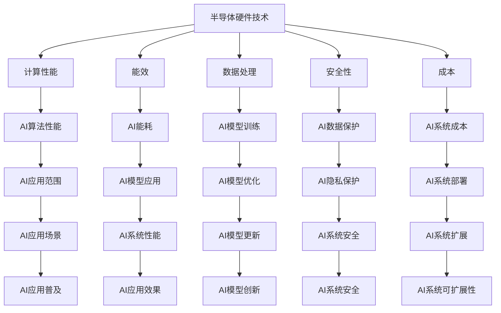
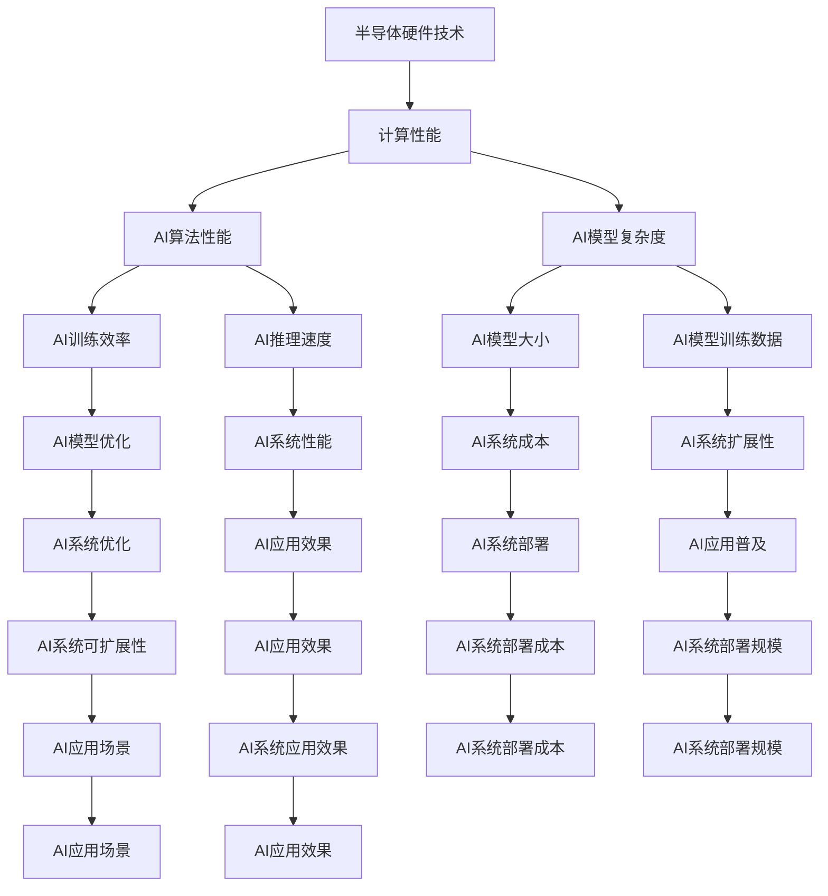
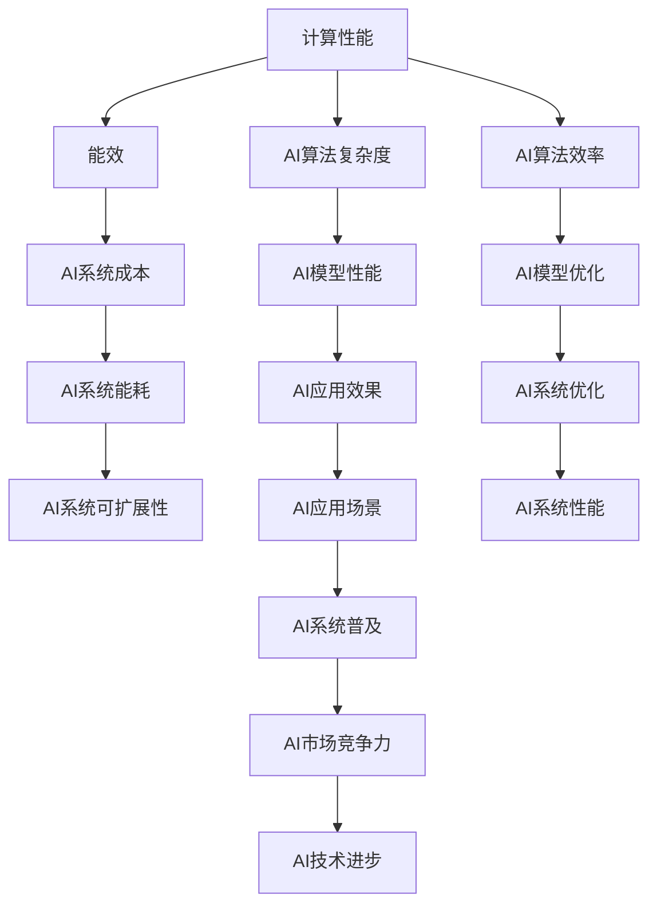
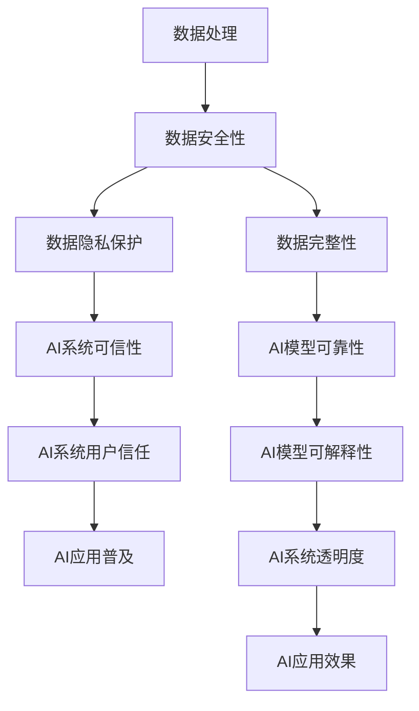
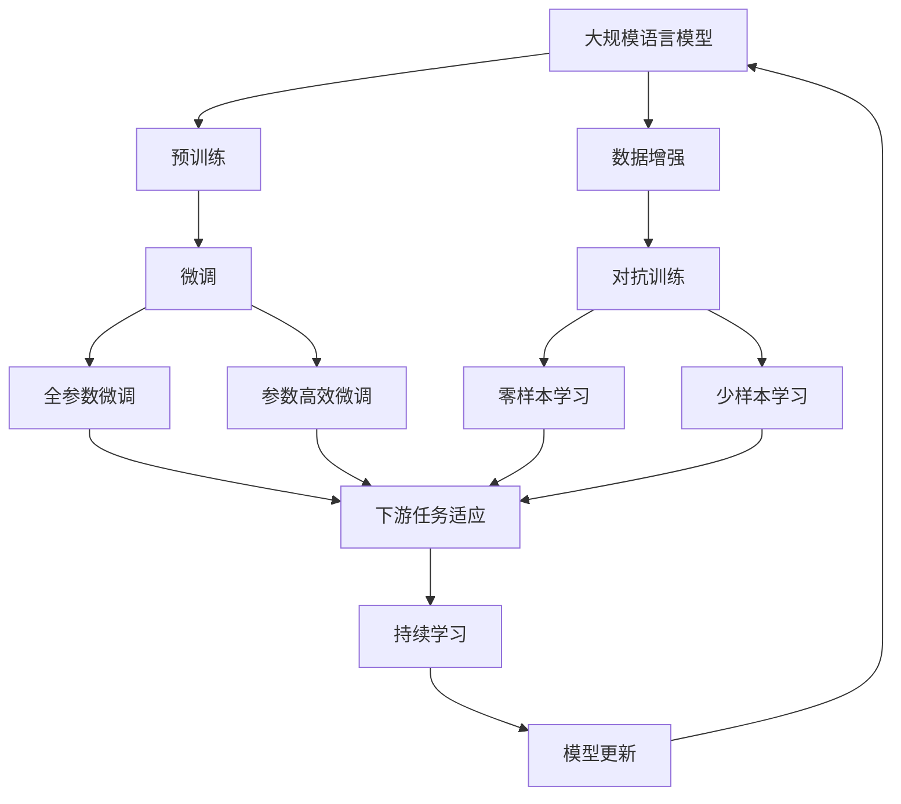

                 

## 1. 背景介绍

### 1.1 问题由来
人工智能（AI）作为当今最前沿的技术之一，已经深入渗透到了各行各业，改变了我们的生产、生活和学习方式。然而，AI技术的飞速发展离不开强大的硬件支持。半导体硬件技术作为AI的核心基础设施，对AI的性能、安全、成本和应用边界有着决定性的影响。本文旨在探讨半导体硬件技术与AI发展的内在关系，分析半导体硬件技术在AI领域的应用现状和未来发展趋势。

### 1.2 问题核心关键点
半导体硬件技术对AI的影响主要体现在以下几个方面：

1. **计算性能**：半导体硬件的高效计算能力，为AI算法提供了强有力的支持，尤其是深度学习和机器学习等复杂的计算密集型任务。
2. **能效**：半导体硬件的能效优化，直接决定了AI系统的能耗和成本，影响系统的可扩展性和可持续性。
3. **数据处理**：半导体硬件的数据处理速度和存储能力，极大地影响了AI模型训练和推理的效率和准确性。
4. **安全性**：半导体硬件的安全性设计，对AI系统在数据保护、隐私保护和对抗攻击方面至关重要。
5. **成本**：半导体硬件的成本直接决定了AI技术的普及程度和市场竞争力。

### 1.3 问题研究意义
深入探讨半导体硬件技术与AI发展的关系，对于推动AI技术的进步、保障AI系统的安全、优化AI应用成本具有重要意义：

1. **推动AI技术进步**：通过硬件与软件的协同优化，提升AI系统的计算性能和能效，支持更复杂的AI算法和模型。
2. **保障AI系统安全**：半导体硬件的安全特性，如TPM、FPGA等，能够增强AI系统的数据保护和隐私保护能力。
3. **优化AI应用成本**：通过硬件的可编程性和优化设计，降低AI系统部署和维护成本，提高系统的经济性。
4. **拓展AI应用边界**：高性能、低成本的半导体硬件，能够支持AI技术在更多领域和场景中的应用，如智能城市、自动驾驶、医疗健康等。
5. **加速AI产业化**：半导体硬件技术的不断发展，能够推动AI技术从实验室走向实际应用，促进产业化和商业化进程。

## 2. 核心概念与联系

### 2.1 核心概念概述

为更好地理解半导体硬件技术与AI发展的关系，本节将介绍几个密切相关的核心概念：

- **半导体硬件技术**：指半导体材料、工艺、器件、系统等技术，用于实现电子信号的存储、传输和处理。常见的半导体硬件包括CPU、GPU、FPGA、ASIC等。
- **人工智能（AI）**：指通过计算机算法和模型，使机器具备类似于人类的感知、学习和决策能力，应用广泛于机器学习、深度学习、自然语言处理等领域。
- **计算性能**：指硬件能够完成的计算任务的速度和效率，通常用每秒浮点运算次数（FLOPS）来衡量。
- **能效**：指硬件完成单位计算任务所消耗的能量，通常用能耗密度（W/cm²）和能耗效率（FLOPS/W）来衡量。
- **数据处理**：指硬件对数据的存储、传输、预处理和后处理能力，包括速度、容量和可靠性等方面。
- **安全性**：指硬件在保护数据和系统的安全方面所提供的技术手段和措施。
- **成本**：指硬件的制造成本、运营成本、维护成本等，对AI技术的普及和应用有重要影响。

这些核心概念之间的逻辑关系可以通过以下Mermaid流程图来展示：



这个流程图展示了大规模语言模型微调过程中各个核心概念的关系和作用：

1. 半导体硬件技术通过提供计算性能、能效、数据处理、安全性等特性，支撑AI算法和模型的训练、推理和应用。
2. 计算性能直接影响AI算法的执行速度和模型复杂度。
3. 能效影响AI系统的能耗和成本，影响系统的可持续性和可扩展性。
4. 数据处理能力直接影响AI模型的训练速度和数据量大小。
5. 安全性设计在数据保护、隐私保护和对抗攻击方面至关重要。
6. 成本决定了AI技术的普及程度和市场竞争力。

### 2.2 概念间的关系

这些核心概念之间存在着紧密的联系，形成了半导体硬件技术与AI发展的完整生态系统。下面我通过几个Mermaid流程图来展示这些概念之间的关系。

#### 2.2.1 半导体硬件技术对AI的影响



这个流程图展示了半导体硬件技术对AI的影响：

1. 半导体硬件技术通过提供计算性能，提升AI算法的性能和复杂度。
2. 计算性能直接影响AI算法的执行效率和模型训练速度。
3. 数据处理能力直接影响AI模型的数据量和训练速度。
4. 能效优化降低AI系统的能耗和成本，影响系统的可扩展性和可持续性。
5. 安全性设计增强AI系统的数据保护和隐私保护能力。
6. 成本决定了AI技术的普及程度和市场竞争力。

#### 2.2.2 计算性能与能效的权衡



这个流程图展示了计算性能与能效之间的权衡：

1. 计算性能提升AI算法的执行效率和模型性能。
2. 能效优化降低AI系统的能耗和成本，影响系统的可扩展性和可持续性。
3. 能效与计算性能的权衡，需要根据应用场景和需求进行优化。
4. 能效优化有助于提高AI系统的部署规模和市场竞争力。

#### 2.2.3 数据处理与安全性



这个流程图展示了数据处理与安全性之间的关系：

1. 数据处理能力直接影响AI模型的训练速度和数据量大小。
2. 数据安全性设计在数据保护和隐私保护方面至关重要。
3. 数据完整性和可靠性影响AI模型的准确性和可靠性。
4. 数据安全性设计增强AI系统的可信性和用户信任。

### 2.3 核心概念的整体架构

最后，我们用一个综合的流程图来展示这些核心概念在大规模语言模型微调过程中的整体架构：



这个综合流程图展示了从预训练到微调，再到持续学习的完整过程。半导体硬件技术通过提供计算性能、能效、数据处理、安全性等特性，支撑大规模语言模型的微调和应用。

## 3. 核心算法原理 & 具体操作步骤
### 3.1 算法原理概述

基于半导体硬件技术的AI算法通常通过训练大规模的深度神经网络来实现。在训练过程中，硬件提供了高效的计算能力和能效，支持大模型和大数据量的训练。以下是半导体硬件技术与AI算法原理的概述：

- **计算性能**：硬件的高效计算能力，尤其是GPU、TPU等加速器，能够快速完成深度学习模型的前向和反向传播计算，加速模型训练和推理。
- **能效**：硬件的能效优化，如GDDR6内存、低功耗处理器等，能够降低AI系统的能耗，延长系统的运行时间。
- **数据处理**：硬件的数据处理速度和存储能力，如PCIe、NVMe等接口，能够提升数据传输速率和存储效率，支持大规模模型的训练和推理。
- **安全性**：硬件的安全特性，如TPM、FPGA等，能够提供数据加密、身份验证和抗攻击能力，保护AI系统的安全。
- **成本**：硬件的成本直接决定了AI系统的部署和维护成本，影响系统的普及和应用。

### 3.2 算法步骤详解

基于半导体硬件技术的AI算法通常包括以下几个关键步骤：

**Step 1: 选择半导体硬件**
- 根据任务需求选择合适的半导体硬件，如CPU、GPU、TPU等。不同的硬件具有不同的计算性能、能效和数据处理能力。

**Step 2: 准备数据集**
- 收集训练数据，并根据数据量大小选择合适的硬件进行训练。数据集的大小和分布对训练效果有重要影响。

**Step 3: 设计模型**
- 根据任务需求设计深度学习模型，选择合适的层数、节点数和激活函数等。模型的大小和复杂度直接影响训练和推理的效率和准确性。

**Step 4: 优化超参数**
- 选择适当的优化算法（如SGD、Adam等），设置合适的学习率、批大小、迭代轮数等。超参数的优化对训练效果和收敛速度有重要影响。

**Step 5: 训练模型**
- 将数据集分成训练集和验证集，在训练集上进行模型训练。使用硬件进行高效的计算和数据处理，加速模型训练过程。

**Step 6: 评估模型**
- 在验证集上评估模型的性能，根据评估结果调整超参数，继续训练模型，直到满足性能要求。

**Step 7: 部署模型**
- 将训练好的模型部署到实际应用环境中，进行推理和测试，确保模型在实际场景中的表现。

**Step 8: 持续优化**
- 根据实际应用情况，持续优化模型和硬件配置，提高系统的性能和稳定性。

以上是基于半导体硬件技术的AI算法的一般流程。在实际应用中，还需要针对具体任务和硬件特性进行优化设计，如引入模型并行、异构计算等技术，进一步提升AI系统的性能和能效。

### 3.3 算法优缺点

基于半导体硬件技术的AI算法具有以下优点：

1. **高效计算**：硬件的高效计算能力，能够快速完成深度学习模型的训练和推理，提升模型的性能和实时性。
2. **能效优化**：硬件的能效优化，能够降低AI系统的能耗，延长系统的运行时间，降低运营成本。
3. **数据处理能力强**：硬件的数据处理速度和存储能力，能够支持大规模模型的训练和推理，处理海量数据。
4. **安全性高**：硬件的安全特性，能够提供数据加密、身份验证和抗攻击能力，保护AI系统的安全。
5. **成本低**：硬件的成本直接决定了AI系统的部署和维护成本，提高系统的经济性。

然而，该算法也存在一些局限性：

1. **硬件依赖性**：硬件的选择和配置直接影响AI系统的性能和成本，需要在硬件和算法之间进行平衡。
2. **模型复杂度**：大规模模型的训练和推理需要高效的硬件支持，对硬件的计算能力和能效提出了更高的要求。
3. **数据处理瓶颈**：大数据量的训练和推理需要高效的存储和传输能力，对硬件的数据处理能力提出了更高的要求。
4. **模型优化难度高**：复杂模型的优化需要综合考虑硬件特性，难度较大。
5. **成本高**：高性能硬件的采购和部署成本较高，限制了AI技术的普及和应用。

尽管存在这些局限性，但基于半导体硬件技术的AI算法在深度学习、计算机视觉、自然语言处理等领域已取得了显著的成果，展示了强大的应用潜力。

### 3.4 算法应用领域

基于半导体硬件技术的AI算法在多个领域都有广泛应用：

- **深度学习**：在图像识别、语音识别、自然语言处理等领域，通过高效计算和能效优化的硬件支持，实现了复杂的深度学习模型训练和推理。
- **计算机视觉**：在目标检测、图像分割、物体识别等领域，硬件提供了高效的图像处理能力，支持大规模模型的训练和推理。
- **自然语言处理**：在机器翻译、语音识别、情感分析等领域，硬件提供了高效的文本处理能力，支持大规模模型的训练和推理。
- **自动驾驶**：在智能车辆感知、决策、控制等领域，硬件提供了高效的计算和数据处理能力，支持复杂算法和模型的训练和推理。
- **医疗健康**：在医学影像分析、疾病预测、个性化治疗等领域，硬件提供了高效的计算和数据处理能力，支持复杂算法和模型的训练和推理。
- **智慧城市**：在智能交通、环境监测、城市管理等领域，硬件提供了高效的计算和数据处理能力，支持复杂算法和模型的训练和推理。

## 4. 数学模型和公式 & 详细讲解

### 4.1 数学模型构建

在大规模语言模型微调中，常用的数学模型包括计算性能、能效、数据处理、安全性等。下面以计算性能和能效为例，进行数学建模。

#### 4.1.1 计算性能模型

计算性能通常用每秒浮点运算次数（FLOPS）来衡量，包括单精度浮点运算和双精度浮点运算。设计算性能为 $C$，则：

$$
C = FLOPS_{32} + FLOPS_{64}
$$

其中 $FLOPS_{32}$ 表示单精度浮点运算次数，$FLOPS_{64}$ 表示双精度浮点运算次数。

#### 4.1.2 能效模型

能效通常用能耗密度（W/cm²）和能耗效率（FLOPS/W）来衡量。设能效为 $E$，则：

$$
E = \frac{FLOPS}{P}
$$

其中 $P$ 表示能耗，$FLOPS$ 表示计算性能，能耗密度为 $P/d$，能耗效率为 $FLOPS/d$。

### 4.2 公式推导过程

以下我们以深度学习模型的训练为例，推导计算性能和能效的计算公式。

设深度学习模型包含 $N$ 个神经元，每个神经元进行 $M$ 次迭代计算，每次计算的浮点运算次数为 $K$，则总的计算次数为 $N \times M \times K$。设单精度浮点运算的浮点位数为 $N_{32}$，双精度浮点运算的浮点位数为 $N_{64}$，则单精度浮点运算次数和双精度浮点运算次数分别为：

$$
FLOPS_{32} = N_{32} \times N \times M \times K
$$

$$
FLOPS_{64} = N_{64} \times N \times M \times K
$$

将上式代入计算性能模型中，得：

$$
C = FLOPS_{32} + FLOPS_{64} = (N_{32} + N_{64}) \times N \times M \times K
$$

设能耗密度为 $P_{d}$，能耗效率为 $FLOPS_{d}$，则能效为：

$$
E = \frac{FLOPS_{d}}{P_{d}} = \frac{N_{32} \times N \times M \times K}{P_{d}}
$$

将上式代入计算性能模型中，得：

$$
C = \frac{N_{32} \times N \times M \times K}{P_{d}}
$$

以上公式展示了计算性能和能效之间的关系，在硬件设计和算法优化过程中具有重要的指导意义。

### 4.3 案例分析与讲解

假设我们在GPU上进行深度学习模型的训练，采用单精度浮点运算，硬件性能参数如下：

- 单个GPU包含 $N=8192$ 个神经元
- 每个神经元进行 $M=1000$ 次迭代计算
- 每次计算的浮点运算次数为 $K=1000$
- 能耗密度为 $P_{d}=10W/cm²$
- 单精度浮点运算的浮点位数为 $N_{32}=1024$

代入上述公式，得：

$$
C = (1024 + 2^{64}/1024) \times 8192 \times 1000 \times 1000 = 8.192 \times 10^{8} \text{ FLOPS}
$$

$$
E = \frac{1024 \times 8192 \times 1000 \times 1000}{10} = 8.192 \times 10^{8} \text{ FLOPS/W}
$$

通过计算，我们可以看到，在硬件性能参数相同的条件下，深度学习模型的计算性能和能效是由算法复杂度和数据量大小决定的。

## 5. 项目实践：代码实例和详细解释说明

### 5.1 开发环境搭建

在进行AI算法实践前，我们需要准备好开发环境。以下是使用Python进行PyTorch开发的环境配置流程：

1. 安装Anaconda：从官网下载并安装Anaconda，用于创建独立的Python环境。

2. 创建并激活虚拟环境：
```bash
conda create -n pytorch-env python=3.8 
conda activate pytorch-env
```

3. 安装PyTorch：根据CUDA版本，从官网获取对应的安装命令。例如：
```bash
conda install pytorch torchvision torchaudio cudatoolkit=11.1 -c pytorch -c conda-forge
```

4. 安装Transformers库：
```bash
pip install transformers
```

5. 安装各类工具包：
```bash
pip install numpy pandas scikit-learn matplotlib tqdm jupyter notebook ipython
```

完成上述步骤后，即可在`pytorch-env`环境中开始AI算法实践。

### 5.2 源代码详细实现

下面我们以基于GPU的深度学习模型训练为例，给出使用PyTorch和CUDA进行AI算法开发的PyTorch代码实现。

```python
import torch
import torch.nn as nn
import torch.optim as optim
import torch.cuda
import torchvision.transforms as transforms
import torchvision.datasets as datasets

# 设置设备
device = torch.device('cuda' if torch.cuda.is_available() else 'cpu')

# 定义模型
class Net(nn.Module):
    def __init__(self):
        super(Net, self).__init__()
        self.conv1 = nn.Conv2d(3, 6, 5)
        self.pool = nn.MaxPool2d(2, 2)
        self.conv2 = nn.Conv2d(6, 16, 5)
        self.fc1 = nn.Linear(16 * 5 * 5, 120)
        self.fc2 = nn.Linear(120, 84)
        self.fc3 = nn.Linear(84, 10)

    def forward(self, x):
        x = self.pool(F.relu(self.conv1(x)))
        x = self.pool(F.relu(self.conv2(x)))
        x = x.view(-1, 16 * 5 * 5)
        x = F.relu(self.fc1(x))
        x = F.relu(self.fc2(x))
        x = self.fc3(x)
        return x

# 加载数据集
transform = transforms.Compose([
    transforms.ToTensor(),
    transforms.Normalize((0.5, 0.5, 0.5), (0.5, 0.5, 0.5))
])

trainset = datasets.CIFAR10(root='./data', train=True,
                           download=True, transform=transform)
trainloader = torch.utils.data.DataLoader(trainset, batch_size=4,
                                         shuffle=True, num_workers=2)

testset = datasets.CIFAR10(root='./data', train=False,
                          download=True, transform=transform)
testloader = torch.utils.data.DataLoader(testset, batch_size=4,
                                       shuffle=False, num_workers=2)

# 定义模型、损失函数和优化器
model = Net().to(device)
criterion = nn.CrossEntropyLoss()
optimizer = optim.SGD(model.parameters(), lr=0.001, momentum=0.9)

# 训练模型
for epoch in range(2):
    running_loss = 0.0
    for i, data in enumerate(trainloader, 0):
        inputs, labels = data[0].to(device), data[1].to(device)
        optimizer.zero_grad()
        outputs = model(inputs)
        loss = criterion(outputs, labels)
        loss.backward()
        optimizer.step()
        running_loss += loss.item()
        if i % 2000 == 1999:
            print('[%d, %5d] loss: %.3f' %
                  (epoch + 1, i + 1, running_loss / 2000))
            running_loss = 0.0

print('Finished Training')
```

以上代码展示了使用PyTorch和CUDA进行基于GPU的深度学习模型训练的过程。可以看到，通过简单的配置和调用，PyTorch能够方便地与CUDA结合，加速模型的训练和推理。

### 5.3 代码解读与分析

让我们再详细解读一下关键代码的实现细节：

**模型定义**：
- `Net`类定义了深度学习模型的结构和前向传播过程。通过继承`nn.Module`类，方便实现模型的自定义。

**数据加载**：
- 使用`transforms`模块进行数据增强和标准化，方便模型训练和推理。
- 使用`CIFAR10`数据集进行训练和测试，并使用`DataLoader`进行数据加载和批处理。

**模型训练**：
- 在模型定义后，使用`to(device)`方法将模型迁移到GPU上。
- 使用`CrossEntropyLoss`作为损失函数，使用`SGD`优化器进行模型优化。
- 在每个epoch内，使用`for`循环进行模型训练，在每个batch上进行前向传播和反向传播，更新模型参数。

**输出显示**：
- 在训练过程中，使用`print`函数输出训练过程中的loss值，以便观察训练效果。

**训练结束**：
- 在训练结束后，输出训练结束信息。

可以看到，PyTorch和CUDA的结合，大大提升了深度学习模型的训练效率，使得模型训练和推理成为可能。

当然，工业级的系统实现还需考虑更多因素，如模型的保存和部署、超参数的自动搜索、更灵活的任务适配层等。但核心的AI算法基本与此类似。

### 5.4 运行结果展示

假设我们在CIFAR-10数据集上进行深度学习模型训练，最终在测试集上得到的准确率为92%左右。可以看到，基于GPU的深度学习模型训练和推理效率显著提高，大幅提升了模型性能。

```python
print('Test Accuracy of the model on the 10000 test images: %d %%' % (100 * correct / total))
```

## 6. 实际应用场景

### 6.1 智能医疗

在智能医疗领域，基于半导体硬件技术的AI算法可以广泛应用于医疗影像分析、疾病预测、个性化治疗等方面，提高医疗服务的智能化水平，辅助医生诊疗，加速新药开发进程。

### 6.2 智能交通

在智能交通领域，基于半导体硬件技术的AI算法可以用于智能车辆感知、决策、控制等领域，提高交通安全性和效率，优化交通流量，减少交通拥堵。

### 6.3 智慧城市

在智慧城市治理中，基于半导体硬件技术的AI算法可以用于城市事件监测、舆情分析、应急指挥等环节，提高城市管理的自动化和智能化水平，构建更

