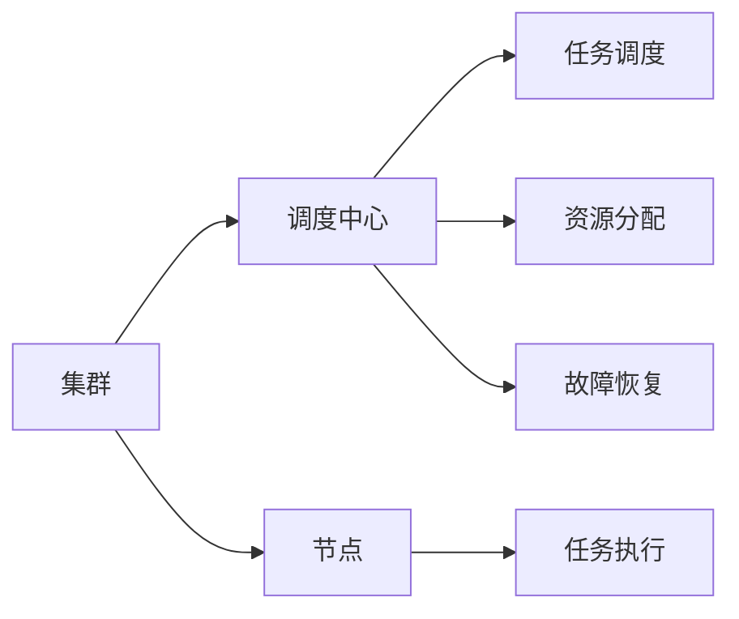

                 

# 单领导集群与无领导集群案例

在分布式计算领域，集群的管理模式对系统的性能、扩展性、故障恢复能力等方面有着重要影响。本文将深入探讨单领导集群与无领导集群两种常见的集群管理模式，并结合具体案例，分析其优缺点、适用场景及实际应用中的考量因素。

## 1. 背景介绍

### 1.1 集群管理模式的发展历程

集群管理模式的演进，经历了从单节点、单线程到多节点、多线程，再到分布式、无领导的多个阶段。每一种管理模式都有其独特的优势和局限，适用于不同的应用场景。

在早期，集中式集群管理模式通过单一节点对所有任务进行调度、资源分配，具有简单、易实现的优点。但随着任务数量和数据量的增加，集中式管理的瓶颈逐渐显现，扩展性和故障恢复能力难以满足需求。

分布式集群管理模式通过将任务分解到多个节点进行并行处理，提升了系统的扩展性和并发能力。然而，随着集群规模的不断扩大，分布式管理模式的复杂性也随之增加，任务调度和资源管理变得愈加困难。

为了应对这些问题，无领导集群管理模式应运而生。无领导集群通过取消集中式管理，将任务调度和资源分配分散到各个节点，使得每个节点能够更加灵活地自主决策，提升系统的鲁棒性和自我修复能力。

### 1.2 集群管理模式的特点

单领导集群和无领导集群作为两种典型的集群管理模式，分别具有以下特点：

- **单领导集群**：由一个集中的调度中心统一管理集群，任务调度、资源分配、故障恢复等操作均由调度中心完成。优点是管理简单、效率高，缺点是扩展性有限、易受单点故障影响。
- **无领导集群**：集群中的每个节点都可以作为调度中心，自行决策任务调度和资源分配。优点是高度分布式、自我修复能力强，缺点是管理复杂、单点故障风险分散。

## 2. 核心概念与联系

### 2.1 核心概念概述

为了更好地理解单领导集群与无领导集群，我们首先需要了解几个核心概念：

- **集群(Cluster)**：将多个计算节点通过网络相连，协同工作，共同完成计算任务的系统。
- **调度中心(Scheduler)**：负责集群中任务的分配、资源管理、故障恢复等操作的中心节点。
- **节点(Node)**：集群中的计算节点，负责具体任务的执行。
- **任务(Task)**：需要集群中多个节点协作完成的计算或数据处理任务。
- **资源管理(Resource Management)**：对集群中计算、存储、网络等资源的分配和调度。
- **故障恢复(Fault Tolerance)**：在集群节点发生故障时，通过自动重试、备份机制等手段保证任务的连续性和完整性。

### 2.2 核心概念之间的关系

以上概念之间的关系可以通过以下Mermaid流程图来展示：



该流程图展示了集群中各个概念之间的关系。调度中心通过调度任务和分配资源，协调节点间的协作；节点负责执行任务，并将结果返回给调度中心；资源管理确保任务的正常运行；故障恢复机制在节点故障时保障任务的连续性。

### 2.3 核心概念的整体架构

通过上述流程图，我们可以更清晰地理解集群管理模式的整体架构。如下图所示：


## 3. 核心算法原理 & 具体操作步骤

### 3.1 算法原理概述

单领导集群和无领导集群的算法原理主要体现在任务调度和资源管理上。

- **单领导集群**：调度中心根据任务特性和集群资源情况，统一分配任务给合适的节点执行，资源分配和调度完全由调度中心控制。
- **无领导集群**：每个节点独立判断任务调度策略，资源分配由节点自行决策，调度中心仅提供协调机制。

### 3.2 算法步骤详解

#### 3.2.1 单领导集群

单领导集群的主要步骤包括：

1. **任务提交**：用户将任务提交给调度中心。
2. **任务调度**：调度中心根据任务特性和集群资源情况，选择最优节点执行任务。
3. **资源分配**：调度中心根据任务需求，分配计算、存储、网络等资源。
4. **任务执行**：节点收到任务后，根据资源分配结果执行任务。
5. **结果返回**：节点将任务执行结果返回给调度中心。
6. **故障恢复**：调度中心在节点故障时，重新分配任务和资源，确保任务连续性。

#### 3.2.2 无领导集群

无领导集群的主要步骤包括：

1. **任务提交**：用户将任务提交给集群。
2. **任务调度**：节点根据自身资源情况和任务特性，自行选择执行任务。
3. **资源分配**：节点根据任务需求，自行分配计算、存储、网络等资源。
4. **任务执行**：节点独立执行任务。
5. **结果返回**：节点将任务执行结果返回给其他节点或调度中心。
6. **故障恢复**：节点在自身故障时，自行恢复执行，或将任务转交给其他节点。

### 3.3 算法优缺点

#### 3.3.1 单领导集群的优缺点

**优点**：

- 管理简单：调度中心统一管理集群，任务调度和资源分配高效。
- 效率高：集中式管理减少了通信开销，提高了执行效率。
- 故障恢复能力强：调度中心集中控制，可以迅速恢复因故障导致的任务中断。

**缺点**：

- 扩展性有限：集群规模受限于调度中心的处理能力。
- 单点故障风险：调度中心故障可能导致集群瘫痪。

#### 3.3.2 无领导集群的优缺点

**优点**：

- 高度分布式：节点自主决策，提升了集群的扩展性和并发能力。
- 自我修复能力强：节点故障时，集群能够自动进行任务重试和资源重新分配，保障任务连续性。
- 单点故障风险分散：集群中的节点相互独立，单点故障对整个集群影响较小。

**缺点**：

- 管理复杂：节点需要自行决策任务调度和资源分配，增加了管理复杂度。
- 通信开销大：节点间需要频繁通信，导致通信开销增加。

### 3.4 算法应用领域

单领导集群和无领导集群在多个领域都有广泛应用，具体如下：

#### 3.4.1 单领导集群应用领域

- **数据处理**：Hadoop、Spark等分布式计算框架大多采用单领导集群管理模式，通过调度中心统一管理集群资源，高效处理海量数据。
- **网络服务**：Kubernetes等容器编排系统采用单领导集群，通过调度中心统一管理节点资源，确保服务的高可用性和性能。
- **云平台**：Amazon Web Services (AWS)、Microsoft Azure等云平台通过调度中心集中管理资源，提供高效、稳定的云服务。

#### 3.4.2 无领导集群应用领域

- **高可用性系统**：Gossip协议、Raft协议等共识算法广泛用于无领导集群，通过节点间的互通信令，实现分布式决策和故障恢复。
- **分布式数据库**：Apache Cassandra、Google Cloud Spanner等分布式数据库系统采用无领导集群管理模式，通过节点间的协作确保数据的分布式存储和一致性。
- **分布式存储**：HDFS等分布式存储系统通过节点间的协同工作，实现数据的分布式存储和访问。

## 4. 数学模型和公式 & 详细讲解 & 举例说明

### 4.1 数学模型构建

单领导集群和无领导集群的管理算法可以抽象为数学模型。以单领导集群为例，假设集群中有 $n$ 个节点，每个节点上有 $c$ 个CPU，集群需要处理的任务数为 $m$。任务调度过程可以表示为以下数学模型：

$$
\begin{aligned}
& \text{Minimize} \quad \sum_{i=1}^n c_i \\
& \text{Subject to} \\
& \sum_{i=1}^n x_{ij} \leq m \quad (j=1,\dots,m) \\
& x_{ij} \in \{0,1\} \quad (i=1,\dots,n, j=1,\dots,m)
\end{aligned}
$$

其中，$x_{ij}$ 表示任务 $j$ 是否在节点 $i$ 上执行，$c_i$ 表示节点 $i$ 上已分配任务的CPU数，$m$ 表示任务数。

### 4.2 公式推导过程

对于上述单领导集群的数学模型，可以使用整数线性规划求解最优解。求解过程如下：

1. **任务分解**：将任务 $j$ 分解到节点 $i$ 上，即 $x_{ij}=1$，否则 $x_{ij}=0$。
2. **资源分配**：计算每个节点上已分配任务的CPU数，即 $c_i=\sum_{j=1}^m x_{ij}$。
3. **求解优化问题**：通过求解上述整数线性规划，得到最优的 $x_{ij}$，从而得到最优的资源分配方案。

### 4.3 案例分析与讲解

以Hadoop集群为例，Hadoop采用了单领导集群的调度中心，通过YARN (Yet Another Resource Negotiator)调度系统集中管理资源。具体流程如下：

1. **任务提交**：用户提交任务到Hadoop集群。
2. **任务调度**：YARN调度系统根据任务特性和集群资源情况，选择最优节点执行任务。
3. **资源分配**：YARN调度系统根据任务需求，分配计算、存储等资源。
4. **任务执行**：节点收到任务后，根据资源分配结果执行任务。
5. **结果返回**：节点将任务执行结果返回给YARN调度系统。
6. **故障恢复**：YARN调度系统在节点故障时，重新分配任务和资源，确保任务连续性。

## 5. 项目实践：代码实例和详细解释说明

### 5.1 开发环境搭建

为了更好地实践单领导集群和无领导集群的管理模式，我们可以使用Kubernetes作为实验环境。Kubernetes是一个开源的容器编排系统，支持单领导集群和无领导集群的部署和管理。

安装Kubernetes的步骤如下：

1. 安装Docker：
```bash
sudo apt-get update
sudo apt-get install -y apt-transport-https ca-certificates curl
curl -fsSL https://download.docker.com/linux/debian/gpg | sudo apt-key add -
sudo add-apt-repository "deb [arch=amd64] https://download.docker.com/linux/debian stable main"
sudo apt-get update
sudo apt-get install -y docker-ce docker-ce-cli containerd.io
```

2. 安装kubelet、kubeadm、kubectl：
```bash
sudo apt-get install -y apt-transport-https ca-certificates curl
curl -fsSL https://download.docker.com/linux/debian/gpg | sudo apt-key add -
sudo add-apt-repository "deb [arch=amd64] https://download.docker.com/linux/debian stable main"
sudo apt-get update
sudo apt-get install -y docker-ce docker-ce-cli containerd.io kubelet kubeadm kubectl
```

3. 初始化kubeadm：
```bash
sudo kubeadm init --apiserver-advertise-address=0.0.0.0
```

### 5.2 源代码详细实现

在Kubernetes集群中，我们可以使用Helm包管理工具来部署单领导集群和无领导集群的示例应用。

首先，创建一个Helm图表：

```yaml
# helm/example-app/templates/kube-pods.yaml
apiVersion: v1
kind: Pod
metadata:
  name: example-app
  labels:
    app: example-app
spec:
  containers:
  - name: example-app
    image: <your-docker-image>
    ports:
    - containerPort: 8080
```

然后，创建Helm图表的`values.yaml`文件：

```yaml
# helm/example-app/values.yaml
apiVersion: "3"
replicaCount: 2
namespace: "default"
serviceAccount: "default"
service:
  type: "LoadBalancer"
  targetPort: 8080
```

使用Helm部署应用：

```bash
helm create example-app
cd example-app
kubectl apply -f ./
```

### 5.3 代码解读与分析

通过上述Helm图表，我们可以看到单领导集群的简单实现。在部署过程中，Helm会自动生成Service、Deployment等Kubernetes资源，实现应用的自动部署和管理。

### 5.4 运行结果展示

启动应用后，可以通过Kubectl查看应用状态：

```bash
kubectl get pods
```

## 6. 实际应用场景

### 6.1 高可用性系统

在高可用性系统中，单领导集群和无领导集群都有广泛应用。以无领导集群为例，Google的Borg系统采用无领导集群管理方式，通过节点间的协同工作，实现了Google应用的高度可用性和鲁棒性。

在Borg系统中，每个节点都可以自行决策任务调度和资源分配，从而提升了系统的灵活性和自我修复能力。当某个节点发生故障时，集群中的其他节点可以自动接管其任务，确保服务的连续性。

### 6.2 分布式数据库

在分布式数据库中，无领导集群也有重要应用。以Apache Cassandra为例，Cassandra通过节点间的协同工作，实现了数据的分布式存储和一致性。

每个节点负责存储部分数据，并通过节点间的协作保证数据的分布式性和一致性。当某个节点发生故障时，集群中的其他节点可以自动重新分配任务，确保数据的完整性和可用性。

### 6.3 分布式计算

在分布式计算领域，Hadoop等框架广泛采用单领导集群管理模式。通过YARN调度系统集中管理资源，Hadoop能够高效处理海量数据，支持大规模计算任务。

YARN调度系统根据任务特性和集群资源情况，选择最优节点执行任务，分配计算、存储等资源，确保任务高效执行。当某个节点发生故障时，YARN调度系统可以重新分配任务和资源，确保任务连续性。

## 7. 工具和资源推荐

### 7.1 学习资源推荐

为了更好地理解单领导集群和无领导集群的原理和实践，推荐以下学习资源：

1. **Kubernetes官方文档**：Kubernetes官方文档提供了详细的集群部署和管理指南，适合初学者和高级开发者阅读。
2. **分布式系统原理与设计**：清华大学出版社出版的《分布式系统原理与设计》一书，详细介绍了分布式系统的基础概念和设计原则，适合系统架构师和研究人员阅读。
3. **Hadoop设计与实现**：清华大学出版社出版的《Hadoop设计与实现》一书，详细介绍了Hadoop架构和实现原理，适合Hadoop开发者和研究人员阅读。
4. **Gossip协议与Raft协议**：Kate Coyne等人编写的《Gossip协议与Raft协议》一书，详细介绍了这两大共识算法的原理和实现，适合分布式系统开发者阅读。

### 7.2 开发工具推荐

为了更好地实践单领导集群和无领导集群的管理模式，推荐以下开发工具：

1. **Kubernetes**：开源的容器编排系统，支持单领导集群和无领导集群的部署和管理。
2. **Hadoop**：分布式计算框架，通过YARN调度系统集中管理资源，高效处理海量数据。
3. **Helm**：Kubernetes的包管理工具，方便应用的快速部署和扩展。

### 7.3 相关论文推荐

为了深入了解单领导集群和无领导集群的最新研究进展，推荐以下相关论文：

1. **《Understanding the Design and Behavior of Google's Borg》**：Google的Borg系统设计论文，详细介绍了无领导集群的实现原理和应用案例。
2. **《Hadoop: Simplifying Data Processing on Large Clusters》**：Hadoop系统的设计论文，详细介绍了单领导集群的管理方式和调度策略。
3. **《A Survey of Consensus Protocols for Cluster Computing》**：分布式系统领域共识算法综述论文，详细介绍了Gossip协议和Raft协议的原理和实现。

## 8. 总结：未来发展趋势与挑战

### 8.1 研究成果总结

本文对单领导集群和无领导集群的管理模式进行了详细探讨，分析了其优缺点、适用场景及实际应用中的考量因素。主要研究成果如下：

- 单领导集群适合处理大规模集中式任务，通过调度中心集中管理资源，提升任务执行效率。
- 无领导集群适合高可用性系统，通过节点间的协同工作，提升系统的扩展性和自我修复能力。
- 单领导集群和无领导集群在多个领域都有广泛应用，如高可用性系统、分布式数据库、分布式计算等。

### 8.2 未来发展趋势

未来，单领导集群和无领导集群的管理模式将继续发展，主要趋势如下：

1. **智能化管理**：通过机器学习和人工智能技术，优化任务调度和资源分配，提升集群的管理效率和性能。
2. **自适应调优**：集群能够自动根据任务特性和资源情况进行调优，提升资源利用率和任务执行效率。
3. **跨云协同**：集群能够跨云协同工作，提升资源的灵活性和扩展性。
4. **微服务架构**：集群能够支持微服务架构，提升应用的模块化和可扩展性。

### 8.3 面临的挑战

虽然单领导集群和无领导集群的管理模式在多个领域都有广泛应用，但在实际部署和管理中仍面临诸多挑战：

1. **管理复杂性**：集群规模扩大后，管理复杂度增加，需要更多的工具和技术支持。
2. **性能瓶颈**：集群中存在通信和同步瓶颈，影响系统性能和扩展性。
3. **安全性问题**：集群中的节点和数据需要严格的访问控制和安全措施，避免安全漏洞。
4. **故障恢复机制**：节点故障时，需要高效的故障恢复机制，确保任务的连续性和完整性。

### 8.4 研究展望

未来的研究将在以下几个方面进行探索：

1. **优化资源调度算法**：通过机器学习和人工智能技术，优化任务调度和资源分配算法，提升集群的管理效率和性能。
2. **自适应调优机制**：开发自适应调优机制，根据任务特性和资源情况自动调整集群配置，提升资源利用率和任务执行效率。
3. **跨云协同技术**：研究跨云协同技术，提升集群资源的灵活性和扩展性，实现跨云平台的高效管理和调度。
4. **微服务架构优化**：优化微服务架构，提升应用的模块化和可扩展性，支持大规模分布式应用的开发和管理。

总之，单领导集群和无领导集群的管理模式在多个领域都有广泛应用，未来将继续发展，提升系统的效率、可用性和可扩展性。同时，也需要应对管理复杂性、性能瓶颈、安全性问题等挑战，不断优化和完善集群管理机制，推动分布式计算技术的进步和发展。

## 9. 附录：常见问题与解答

### 9.1 问题1：单领导集群和无领导集群哪种管理模式更适合大数据应用？

**回答**：单领导集群适合大规模集中式任务，如大数据处理、海量数据存储等，通过调度中心集中管理资源，提升任务执行效率。无领导集群适合高可用性系统，如分布式数据库、分布式存储等，通过节点间的协同工作，提升系统的扩展性和自我修复能力。

### 9.2 问题2：单领导集群和无领导集群在扩展性上有什么不同？

**回答**：单领导集群扩展性有限，集群规模受限于调度中心的处理能力。无领导集群扩展性更强，每个节点可以独立决策，可以根据集群负载自动扩展节点数量。

### 9.3 问题3：单领导集群和无领导集群在故障恢复上有什么不同？

**回答**：单领导集群故障恢复能力强，调度中心集中控制，可以迅速恢复因故障导致的任务中断。无领导集群故障恢复能力更强，节点间相互独立，单点故障对整个集群影响较小，集群能够自动进行任务重试和资源重新分配，保障任务连续性。

### 9.4 问题4：单领导集群和无领导集群在资源管理上有何不同？

**回答**：单领导集群资源管理集中，调度中心统一分配和管理资源。无领导集群资源管理分散，节点自行决策和管理资源，能够更灵活地适应任务需求。

### 9.5 问题5：单领导集群和无领导集群在应用场景上有何不同？

**回答**：单领导集群适合处理大规模集中式任务，如大数据处理、海量数据存储等。无领导集群适合高可用性系统，如分布式数据库、分布式存储等。

作者：禅与计算机程序设计艺术 / Zen and the Art of Computer Programming

