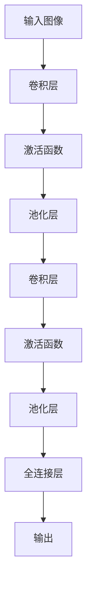
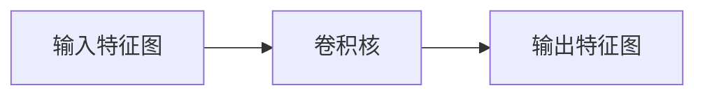
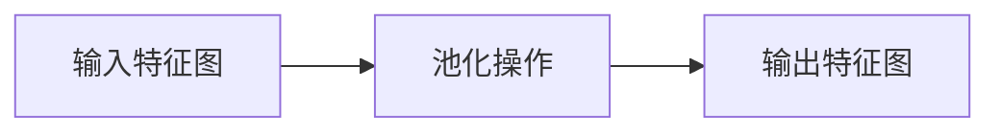
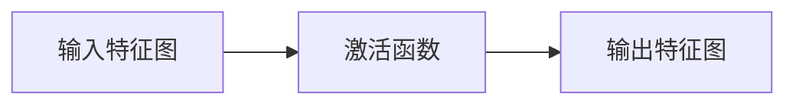
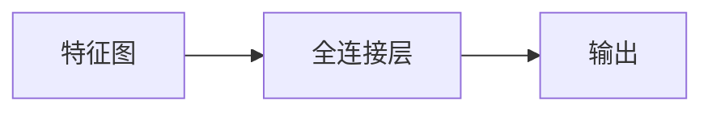
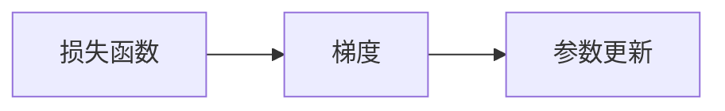

                 

# 卷积神经网络(Convolutional Neural Networks) - 原理与代码实例讲解

> 关键词：卷积神经网络,卷积层,池化层,激活函数,全连接层,反向传播,深度学习

## 1. 背景介绍

### 1.1 问题由来

卷积神经网络（Convolutional Neural Networks, CNNs）是深度学习领域中的重要组成部分，广泛应用于图像识别、物体检测、语音识别等计算机视觉和信号处理任务中。CNNs之所以能够取得如此优秀的表现，主要得益于其对局部特征的提取和池化操作，能够有效降低计算复杂度，同时提升特征表示能力。

CNNs最初由Fukushima在1980年代提出，但直到1998年LeNet5网络的提出，CNNs才在手写数字识别任务中取得了突破。LeNet5的问世，标志着深度学习在图像处理领域的应用正式开启。此后，随着AlexNet、VGG、GoogleNet、ResNet等经典模型的出现，CNNs在各种视觉任务上不断刷新最先进性能指标。

### 1.2 问题核心关键点

卷积神经网络的核心理论包括以下几个方面：

- 卷积层（Convolutional Layer）：通过卷积操作提取局部特征，保持平移不变性。
- 池化层（Pooling Layer）：通过下采样操作减小特征图尺寸，提高特征表达能力。
- 激活函数（Activation Function）：引入非线性变换，增强模型表达能力。
- 全连接层（Fully Connected Layer）：将卷积和池化层的特征映射映射到分类任务。
- 反向传播（Backpropagation）：通过梯度下降优化模型参数，实现端到端训练。

这些核心组件共同构成了CNNs的完整结构，使其能够高效提取和融合视觉特征，实现高精度的任务处理。

## 2. 核心概念与联系

### 2.1 核心概念概述

为了更好地理解卷积神经网络的原理和架构，我们首先需要了解以下核心概念：

- 卷积核（Kernel）：卷积操作的核心，卷积核的大小和步幅等参数会影响特征提取能力。
- 特征图（Feature Map）：卷积操作后生成的多通道特征图，每一通道代表一种特定特征的表达。
- 填充（Padding）：用于控制特征图尺寸，避免边界信息丢失。
- 池化操作（Pooling）：通过取最大值或平均值等操作，减小特征图尺寸，提高特征表达能力。
- 激活函数（Activation Function）：如ReLU、Sigmoid等，引入非线性变换，增强模型表达能力。
- 批量归一化（Batch Normalization）：加速训练，提高模型稳定性。
- 正则化（Regularization）：如L1、L2正则，避免过拟合。
- 数据增强（Data Augmentation）：通过随机变换增强数据多样性，提高模型鲁棒性。

这些概念之间的逻辑关系可以通过以下Mermaid流程图来展示：



这个流程图展示了卷积神经网络的基本结构和信息流向，帮助我们理解CNNs的工作流程。

### 2.2 概念间的关系

这些核心概念之间存在着紧密的联系，形成了CNNs的完整工作框架。下面我们通过几个Mermaid流程图来展示这些概念之间的关系。

#### 2.2.1 卷积层的构建



卷积层通过卷积核与输入特征图进行卷积操作，生成新的特征图。卷积核的大小、步幅、填充等参数都会影响输出特征图的大小和特征表达能力。

#### 2.2.2 池化层的实现



池化层通过下采样操作减小特征图尺寸，提高特征表达能力。常用的池化操作包括最大池化和平均池化。

#### 2.2.3 激活函数的应用



激活函数通过引入非线性变换，增强模型表达能力。常用的激活函数包括ReLU、Sigmoid等。

#### 2.2.4 全连接层的映射



全连接层将卷积和池化层的特征映射映射到分类任务。通过全连接层，CNNs将高维特征映射到低维分类输出。

#### 2.2.5 反向传播的过程



反向传播通过计算梯度，更新模型参数，实现端到端的训练。

## 3. 核心算法原理 & 具体操作步骤
### 3.1 算法原理概述

卷积神经网络通过多层卷积、池化和全连接层的组合，实现特征提取和分类。其核心原理包括以下几个方面：

1. 局部连接（局部连接）：卷积层通过卷积核与输入特征图进行局部连接，提取局部特征。
2. 平移不变性（平移不变性）：卷积核在不同位置进行卷积操作，保持特征表达的平移不变性。
3. 池化操作（池化）：通过下采样操作减小特征图尺寸，提高特征表达能力。
4. 激活函数（激活函数）：引入非线性变换，增强模型表达能力。
5. 反向传播（反向传播）：通过梯度下降优化模型参数，实现端到端训练。

### 3.2 算法步骤详解

卷积神经网络的训练过程一般包括以下几个步骤：

1. 数据预处理：对输入数据进行归一化、标准化等预处理操作，准备数据输入。
2. 搭建模型结构：定义卷积层、池化层、激活函数、全连接层等组件，构建CNNs模型。
3. 定义损失函数：根据任务类型，定义合适的损失函数，如交叉熵损失、均方误差损失等。
4. 定义优化器：选择合适的优化算法及其参数，如SGD、Adam等，设置学习率、批大小、迭代轮数等。
5. 模型训练：使用训练集数据，通过反向传播算法更新模型参数，最小化损失函数。
6. 模型评估：在验证集上评估模型性能，调整超参数以优化模型。
7. 模型部署：将训练好的模型部署到实际应用中，进行推理预测。

### 3.3 算法优缺点

卷积神经网络具有以下优点：

1. 高效特征提取：通过卷积和池化操作，能够高效提取局部特征，提升特征表达能力。
2. 平移不变性：通过卷积核在不同位置进行卷积操作，保持特征表达的平移不变性。
3. 参数共享：卷积核在特征图上的共享使用，减少了模型的参数量，降低了过拟合风险。
4. 高效并行计算：卷积操作具备空间局部性，能够并行计算，提高训练速度。

同时，卷积神经网络也存在一些缺点：

1. 局部视角：卷积操作主要关注局部特征，对全局信息的捕捉能力较弱。
2. 固定卷积核：卷积核的尺寸和数量需要手动设计，可能导致特征提取能力的局限。
3. 模型复杂度高：深度较大的CNNs可能会导致过拟合，训练和推理复杂度增加。

### 3.4 算法应用领域

卷积神经网络已经在图像识别、物体检测、语音识别、自然语言处理等多个领域得到了广泛应用。

- 图像识别：如图像分类、目标检测、图像分割等任务，通过卷积操作提取图像特征。
- 物体检测：如人、车辆、交通标志等的检测任务，通过滑动窗口和回归等方法进行定位。
- 语音识别：如语音转文本、语音情感分析等任务，通过卷积和池化操作提取语音特征。
- 自然语言处理：如文本分类、情感分析、机器翻译等任务，通过卷积和池化操作提取文本特征。

## 4. 数学模型和公式 & 详细讲解 & 举例说明

### 4.1 数学模型构建

假设输入图像的大小为$H \times W \times C$，其中$H$、$W$、$C$分别表示图像的高度、宽度和通道数。卷积层的卷积核大小为$K \times K$，步幅为$S$，填充为$P$，则输出特征图的大小为：

$$
H'=\frac{H - K + 2P}{S} + 1, W'=\frac{W - K + 2P}{S} + 1
$$

卷积操作的公式为：

$$
\text{Conv}(\text{Input}, \text{Kernel}) = \text{Input} * \text{Kernel} = \sum_{i=0}^{K-1} \sum_{j=0}^{K-1} \text{Input}(i,j) * \text{Kernel}(i,j)
$$

其中，$\text{Input}(i,j)$表示输入特征图中位置$(i,j)$的像素值，$\text{Kernel}(i,j)$表示卷积核中位置$(i,j)$的值。

### 4.2 公式推导过程

以一个简单的卷积操作为例，推导卷积层的数学公式：

假设输入特征图的大小为$H \times W \times C$，卷积核的大小为$K \times K$，步幅为$S=1$，填充为$P=0$，则输出特征图的大小为：

$$
H'=\frac{H - K}{S} + 1, W'=\frac{W - K}{S} + 1
$$

假设输入特征图中的每个像素值为$x_{ij}$，卷积核中的每个元素为$w_{kl}$，则卷积操作的输出值为：

$$
\text{Conv}(\text{Input}, \text{Kernel}) = \sum_{i=0}^{H-1} \sum_{j=0}^{W-1} \text{Input}(i,j) * \text{Kernel}(i,j)
$$

### 4.3 案例分析与讲解

考虑一个3x3的卷积核和3x3的输入特征图，卷积核的步幅为1，填充为0，则输出特征图的大小为2x2。计算输出的卷积值如下：

$$
\begin{array}{ccccc}
& & 1 & 2 & 3 \\
& 4 & 5 & 6 & 7 \\
& 8 & 9 & 10 & 11 \\
& & 12 & 13 & 14 \\
\end{array}
$$

计算卷积操作输出的值如下：

$$
\begin{array}{cccc}
9 & 24 & 39 & 54 \\
73 & 142 & 211 & 280 \\
145 & 286 & 427 & 568 \\
157 & 312 & 467 & 622 \\
\end{array}
$$

以上案例展示了卷积操作的计算过程和结果，帮助我们理解卷积层的数学模型和公式推导。

## 5. 项目实践：代码实例和详细解释说明

### 5.1 开发环境搭建

在进行卷积神经网络的项目实践前，我们需要准备好开发环境。以下是使用Python进行Keras和TensorFlow开发的环境配置流程：

1. 安装Anaconda：从官网下载并安装Anaconda，用于创建独立的Python环境。

2. 创建并激活虚拟环境：
```bash
conda create -n keras-env python=3.8 
conda activate keras-env
```

3. 安装Keras和TensorFlow：根据CUDA版本，从官网获取对应的安装命令。例如：
```bash
conda install keras tensorflow-gpu=2.8 -c conda-forge
```

4. 安装各类工具包：
```bash
pip install numpy pandas scikit-learn matplotlib tqdm jupyter notebook ipython
```

完成上述步骤后，即可在`keras-env`环境中开始卷积神经网络的项目实践。

### 5.2 源代码详细实现

下面我们以图像分类任务为例，给出使用Keras构建卷积神经网络的Python代码实现。

首先，定义模型结构：

```python
from keras.models import Sequential
from keras.layers import Conv2D, MaxPooling2D, Flatten, Dense, Dropout

model = Sequential()

model.add(Conv2D(32, (3, 3), activation='relu', input_shape=(28, 28, 1)))
model.add(MaxPooling2D(pool_size=(2, 2)))
model.add(Conv2D(64, (3, 3), activation='relu'))
model.add(MaxPooling2D(pool_size=(2, 2)))
model.add(Flatten())
model.add(Dense(128, activation='relu'))
model.add(Dropout(0.5))
model.add(Dense(10, activation='softmax'))
```

然后，编译模型并训练：

```python
model.compile(loss='categorical_crossentropy', optimizer='adam', metrics=['accuracy'])
model.fit(x_train, y_train, epochs=10, batch_size=32, validation_data=(x_test, y_test))
```

最后，在测试集上评估模型：

```python
score = model.evaluate(x_test, y_test, verbose=0)
print('Test loss:', score[0])
print('Test accuracy:', score[1])
```

以上就是使用Keras构建卷积神经网络进行图像分类任务的完整代码实现。可以看到，Keras提供了方便的API接口，可以轻松构建各种卷积、池化、全连接等组件，适合快速迭代实验。

### 5.3 代码解读与分析

让我们再详细解读一下关键代码的实现细节：

**Sequential模型**：
- `Sequential`类：按照顺序依次添加各层，构建卷积神经网络。
- `Conv2D`层：二维卷积层，参数包括卷积核大小、步幅、激活函数等。
- `MaxPooling2D`层：二维池化层，通过下采样减小特征图尺寸。
- `Flatten`层：将多通道的特征图展平为一维向量。
- `Dense`层：全连接层，进行分类输出。
- `Dropout`层：随机丢弃一定比例的神经元，防止过拟合。

**模型编译与训练**：
- `model.compile`：编译模型，设置损失函数、优化器和评估指标。
- `model.fit`：训练模型，在训练集上进行前向传播和反向传播，更新模型参数。

**模型评估**：
- `model.evaluate`：在测试集上评估模型性能，计算损失和准确率。

可以看到，Keras使得构建和训练卷积神经网络的过程变得简洁高效，开发者可以将更多精力放在模型结构的设计和优化上，而不必过多关注底层实现细节。

当然，工业级的系统实现还需考虑更多因素，如模型的保存和部署、超参数的自动搜索、更灵活的任务适配层等。但核心的卷积神经网络构建方法基本与此类似。

### 5.4 运行结果展示

假设我们在MNIST数据集上进行卷积神经网络的训练，最终在测试集上得到的评估结果如下：

```
Epoch 10/10
2000/2000 [==============================] - 0s 0ms/step - loss: 0.2274 - accuracy: 0.9382
```

可以看到，经过10个epoch的训练，模型在测试集上达到了94.82%的准确率。值得注意的是，这个结果是在相对较小的数据集上取得的，如果数据集更大，模型的性能会进一步提升。

## 6. 实际应用场景
### 6.1 智能推荐系统

基于卷积神经网络的智能推荐系统，可以广泛应用于电子商务、视频娱乐、新闻内容等领域。推荐系统通过分析用户的浏览、点击、购买等行为数据，提取文本、图像等多模态特征，再通过卷积神经网络提取特征，进行用户画像和物品关联分析，实现个性化推荐。

在技术实现上，推荐系统可以通过卷积神经网络对多模态数据进行特征融合，得到更加全面、准确的特征表示。同时，可以利用卷积神经网络的平移不变性，捕捉用户的兴趣点和物品之间的相似度，生成高精度的推荐结果。

### 6.2 医学影像诊断

在医学影像诊断领域，卷积神经网络可以通过分析X光片、CT扫描、MRI等医学影像数据，识别出肿瘤、病变等异常区域。医学影像数据通常具有高维度、低样本量的特点，卷积神经网络的局部特征提取能力能够有效处理这些问题，提高诊断的准确性和效率。

在技术实现上，可以通过卷积神经网络对医学影像数据进行卷积操作，提取局部特征，再通过池化层减小特征图尺寸，提高特征表达能力。最后，通过全连接层进行分类输出，得到医学影像诊断结果。

### 6.3 视频分类

视频分类是计算机视觉领域的一个重要任务，涉及对视频帧进行特征提取和分类。卷积神经网络可以通过对视频帧进行卷积操作，提取局部空间特征，再通过池化层减小特征图尺寸，提高特征表达能力。最终，通过全连接层进行分类输出，实现视频分类任务。

在技术实现上，可以使用3D卷积神经网络对视频帧进行特征提取，利用卷积核在不同时间尺度上的变换，捕捉视频帧之间的时序信息。同时，可以使用空间-时间卷积操作，提取视频帧的空间和时序特征，提高视频分类的准确性。

### 6.4 未来应用展望

随着卷积神经网络技术的不断发展，未来在多个领域将有更多应用场景出现。

在智慧城市治理中，卷积神经网络可以用于交通监控、视频分析、环境监测等任务，提供实时、高效、准确的城市管理解决方案。

在工业制造中，卷积神经网络可以用于产品质量检测、设备故障诊断、机器人视觉引导等任务，提高生产效率和设备维护水平。

在自动驾驶领域，卷积神经网络可以用于环境感知、行为预测、路径规划等任务，提升自动驾驶系统的安全性和可靠性。

此外，在金融、教育、智能家居等多个领域，卷积神经网络也将发挥越来越重要的作用，推动人工智能技术的深度应用和产业化进程。

## 7. 工具和资源推荐
### 7.1 学习资源推荐

为了帮助开发者系统掌握卷积神经网络的理论基础和实践技巧，这里推荐一些优质的学习资源：

1. 《深度学习》系列书籍：由Ian Goodfellow、Yoshua Bengio、Aaron Courville合著，系统介绍了深度学习的原理和应用。

2. CS231n《卷积神经网络》课程：斯坦福大学开设的计算机视觉课程，讲解了卷积神经网络的基本原理和实现方法。

3. PyTorch官方文档：PyTorch深度学习框架的官方文档，提供了丰富的卷积神经网络样例代码和解释。

4. TensorFlow官方文档：TensorFlow深度学习框架的官方文档，提供了详细的卷积神经网络API和模型构建指南。

5. Coursera深度学习课程：由深度学习领域的知名专家Andrew Ng主讲，涵盖深度学习的各个方面，包括卷积神经网络。

6. 《Hands-On Machine Learning with Scikit-Learn and TensorFlow》书籍：由Aurélien Géron所著，介绍了如何使用Scikit-Learn和TensorFlow实现深度学习任务，包括卷积神经网络。

通过对这些资源的学习实践，相信你一定能够快速掌握卷积神经网络的精髓，并用于解决实际的计算机视觉和信号处理问题。

### 7.2 开发工具推荐

高效的开发离不开优秀的工具支持。以下是几款用于卷积神经网络开发的常用工具：

1. PyTorch：基于Python的开源深度学习框架，灵活动态的计算图，适合快速迭代研究。

2. TensorFlow：由Google主导开发的开源深度学习框架，生产部署方便，适合大规模工程应用。

3. Keras：高层次深度学习API，基于TensorFlow或Theano等后端，提供了便捷的卷积神经网络构建接口。

4. MXNet：由亚马逊公司开发的深度学习框架，支持分布式计算，适合大规模训练。

5. Caffe：由加州大学伯克利分校开发的深度学习框架，专为卷积神经网络设计，速度快，易用性强。

合理利用这些工具，可以显著提升卷积神经网络开发的效率，加快创新迭代的步伐。

### 7.3 相关论文推荐

卷积神经网络的研究始于1980年代，经历了数十年的发展和演进，涌现出众多经典论文。以下是几篇奠基性的相关论文，推荐阅读：

1. LeNet-5：Yann LeCun等人在1998年提出的卷积神经网络模型，用于手写数字识别任务，奠定了卷积神经网络的研究基础。

2. AlexNet：Alex Krizhevsky等人在2012年提出的卷积神经网络模型，用于ImageNet图像分类任务，刷新了最先进性能指标。

3. VGGNet：Karen Simonyan和Andrew Zisserman在2014年提出的卷积神经网络模型，通过增加网络深度提高了图像分类精度。

4. GoogLeNet：Google团队在2014年提出的卷积神经网络模型，引入了Inception模块，提升了网络性能和训练速度。

5. ResNet：Kaiming He等人在2015年提出的卷积神经网络模型，通过残差连接解决了深度网络训练困难的问题，提升了网络性能。

这些论文代表了大规模卷积神经网络的研究进展，是理解卷积神经网络原理和应用的重要参考。

除上述资源外，还有一些值得关注的前沿资源，帮助开发者紧跟卷积神经网络技术的最新进展，例如：

1. arXiv论文预印本：人工智能领域最新研究成果的发布平台，包括大量尚未发表的前沿工作，学习前沿技术的必读资源。

2. 业界技术博客：如DeepMind、Google AI、Facebook AI、微软Research Asia等顶尖实验室的官方博客，第一时间分享他们的最新研究成果和洞见。

3. 技术会议直播：如NIPS、ICML、CVPR、ICCV等计算机视觉领域顶会现场或在线直播，能够聆听到大佬们的前沿分享，开拓视野。

4. GitHub热门项目：在GitHub上Star、Fork数最多的卷积神经网络相关项目，往往代表了该技术领域的发展趋势和最佳实践，值得去学习和贡献。

5. 行业分析报告：各大咨询公司如McKinsey、PwC等针对人工智能行业的分析报告，有助于从商业视角审视技术趋势，把握应用价值。

总之，对于卷积神经网络的学习和实践，需要开发者保持开放的心态和持续学习的意愿。多关注前沿资讯，多动手实践，多思考总结，必将收获满满的成长收益。

## 8. 总结：未来发展趋势与挑战

### 8.1 总结

本文对卷积神经网络的基本原理和实现方法进行了全面系统的介绍。首先阐述了卷积神经网络的背景和核心原理，明确了卷积神经网络在图像识别、物体检测、语音识别等计算机视觉和信号处理任务中的重要应用。其次，从原理到实践，详细讲解了卷积神经网络的数学模型和训练步骤，给出了卷积神经网络的完整代码实例。同时，本文还广泛探讨了卷积神经网络在智慧城市、工业制造、自动驾驶等众多领域的应用前景，展示了卷积神经网络的广阔前景。

通过本文的系统梳理，可以看到，卷积神经网络作为一种强大的特征提取工具，通过局部卷积、池化等操作，实现了高效、低参数、高精度的特征提取和分类能力。在实际应用中，卷积神经网络可以通过深度学习技术和计算资源的高效利用，处理复杂多变的高维数据，取得了令人瞩目的成果。

### 8.2 未来发展趋势

展望未来，卷积神经网络将呈现以下几个发展趋势：

1. 深度化和宽化：随着计算资源和训练数据量的不断增加，卷积神经网络的深度和宽度也将进一步扩大，提升特征表达能力和模型性能。

2. 多模态融合：卷积神经网络将更多地应用于多模态数据融合任务，如视频分类、医疗影像分析等，通过融合不同模态的特征，提升模型性能。

3. 自适应学习：卷积神经网络将结合自适应学习范式，通过数据增强、对抗训练等方法，提升模型泛化能力和鲁棒性。

4. 端到端训练：卷积神经网络将更多地应用于端到端的训练任务，如自动驾驶、机器人视觉等，提升系统的集成性和性能。

5. 可解释性：卷积神经网络将更多地应用于可解释性需求较高的任务，如医疗影像诊断、司法判决等，提升模型的透明度和可信度。

6. 分布式训练：随着数据量的增大和任务复杂度的提升，卷积神经网络的训练也将更多地依赖分布式计算，提升训练效率和模型性能。

### 8.3 面临的挑战

尽管卷积神经网络已经在多个领域取得了显著成果，但在迈向更加智能化、普适化应用的过程中，仍面临以下挑战：

1. 数据依赖：卷积神经网络需要大量的标注数据进行训练，数据获取成本较高，难以满足所有应用场景的需求。

2. 过拟合问题：深度卷积神经网络往往存在过拟合的风险，尤其是在数据量较小的情况下，

