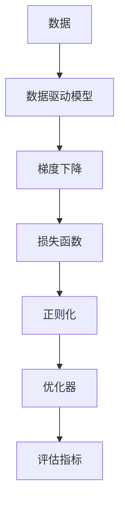
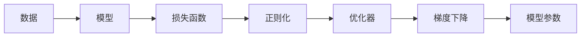
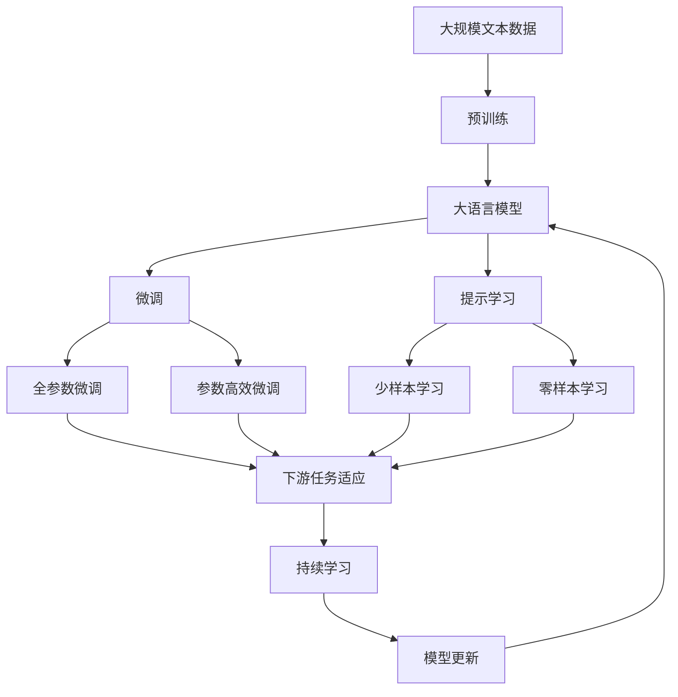

                 

# 原理与代码实战案例讲解

> 关键词：
- 原理详解
- 代码实战
- 案例讲解
- 关键算法
- 实际应用
- 开发工具
- 学习资源
- 未来展望

## 1. 背景介绍

### 1.1 问题由来
在人工智能领域，数据驱动的模型训练和优化一直是关键技术。无论是深度学习还是强化学习，最终的目标都是通过数据来训练出高性能的模型。本文旨在深入探讨数据驱动模型背后的原理，并通过一系列案例讲解，帮助读者理解如何将原理转化为实际应用中的代码实现。

### 1.2 问题核心关键点
- 数据驱动模型训练：通过大量数据对模型进行训练，使其具备预测或推理能力。
- 算法优化：利用优化算法如梯度下降、Adam等，提升模型的收敛速度和准确性。
- 模型评估：通过各种评估指标（如准确率、精确率、召回率）评估模型的性能。
- 代码实现：将理论转化为代码，实现模型的训练、推理和优化。

### 1.3 问题研究意义
数据驱动的模型训练是现代人工智能的核心技术之一，广泛应用于自然语言处理（NLP）、计算机视觉（CV）、语音识别（ASR）等多个领域。通过理论学习与实践应用相结合，本文将深入解析数据驱动模型的原理，并通过代码实战案例讲解，帮助读者更好地理解和应用这一技术。

## 2. 核心概念与联系

### 2.1 核心概念概述

为更好地理解数据驱动模型训练的原理，本节将介绍几个密切相关的核心概念：

- 数据驱动模型：利用大量数据进行训练，优化模型参数，使其具备预测或推理能力的模型。
- 梯度下降：通过计算损失函数对模型参数的梯度，调整参数值，最小化损失函数，优化模型。
- 损失函数：衡量模型输出与真实标签之间差异的函数，常用的有均方误差、交叉熵等。
- 正则化：通过添加L1、L2正则项，防止模型过拟合，提高模型的泛化能力。
- 优化器：如Adam、SGD等，通过学习率、动量等参数，调整模型参数更新方式，加速收敛。
- 评估指标：如准确率、精确率、召回率、F1分数等，用于评估模型在不同数据集上的性能。

这些核心概念之间的逻辑关系可以通过以下Mermaid流程图来展示：



这个流程图展示了大语言模型微调过程中各个核心概念的关系和作用：

1. 数据是大语言模型微调的基础，提供了模型的训练样本。
2. 数据驱动模型利用梯度下降等优化算法，通过最小化损失函数，优化模型参数。
3. 损失函数定义了模型输出与真实标签之间的差异，是模型优化的核心目标。
4. 正则化技术帮助模型避免过拟合，提高模型的泛化能力。
5. 优化器调整模型参数更新的方式，加速模型收敛。
6. 评估指标用于衡量模型在各类数据集上的性能，指导模型优化。

### 2.2 概念间的关系

这些核心概念之间存在着紧密的联系，形成了数据驱动模型训练的完整生态系统。下面我通过几个Mermaid流程图来展示这些概念之间的关系。

#### 2.2.1 模型训练流程



这个流程图展示了模型训练的基本流程：

1. 使用数据驱动模型，定义损失函数和正则化技术。
2. 通过优化器（如Adam）和梯度下降算法，不断更新模型参数，最小化损失函数。
3. 最终得到的模型参数即为训练完成的模型。

#### 2.2.2 模型评估流程


这个流程图展示了模型评估的基本流程：

1. 使用测试数据集对模型进行评估。
2. 通过评估指标（如准确率、精确率、召回率等）衡量模型的性能。

### 2.3 核心概念的整体架构

最后，我们用一个综合的流程图来展示这些核心概念在大语言模型微调过程中的整体架构：



这个综合流程图展示了从预训练到微调，再到持续学习的完整过程。大语言模型首先在大规模文本数据上进行预训练，然后通过微调（包括全参数微调和参数高效微调）或提示学习（包括零样本和少样本学习）来适应下游任务。最后，通过持续学习技术，模型可以不断学习新知识，同时避免遗忘旧知识。

## 3. 核心算法原理 & 具体操作步骤

### 3.1 算法原理概述

数据驱动模型训练的核心原理是通过大量数据优化模型参数，使得模型能够在特定任务上取得良好的性能。这一过程通常包括以下几个关键步骤：

1. **数据准备**：收集和预处理训练数据，划分为训练集、验证集和测试集。
2. **模型定义**：选择合适的模型架构（如卷积神经网络、循环神经网络、Transformer等），定义损失函数和优化器。
3. **模型训练**：通过梯度下降等优化算法，最小化损失函数，更新模型参数。
4. **模型评估**：使用评估指标衡量模型在测试集上的性能，指导模型优化。
5. **模型优化**：通过调整超参数、增加正则化、改进算法等手段，提升模型效果。

### 3.2 算法步骤详解

以下我们以一个简单的分类任务为例，详细讲解数据驱动模型训练的步骤：

1. **数据准备**：

```python
from sklearn.datasets import load_iris
from sklearn.model_selection import train_test_split
from sklearn.preprocessing import StandardScaler
import numpy as np

# 加载鸢尾花数据集
iris = load_iris()
X = iris.data
y = iris.target

# 划分训练集和测试集
X_train, X_test, y_train, y_test = train_test_split(X, y, test_size=0.2, random_state=42)
scaler = StandardScaler()
X_train = scaler.fit_transform(X_train)
X_test = scaler.transform(X_test)
```

2. **模型定义**：

```python
from tensorflow.keras.models import Sequential
from tensorflow.keras.layers import Dense
from tensorflow.keras.optimizers import Adam

# 定义模型
model = Sequential([
    Dense(10, input_dim=X_train.shape[1], activation='relu'),
    Dense(3, activation='softmax')
])

# 定义损失函数和优化器
loss_fn = 'categorical_crossentropy'
optimizer = Adam(lr=0.001)
```

3. **模型训练**：

```python
from tensorflow.keras.callbacks import EarlyStopping

# 设置回调函数，提前停止训练
early_stopping = EarlyStopping(monitor='val_loss', patience=10)

# 训练模型
model.fit(X_train, y_train, epochs=100, batch_size=32, validation_data=(X_test, y_test), callbacks=[early_stopping])
```

4. **模型评估**：

```python
from sklearn.metrics import accuracy_score

# 评估模型
y_pred = model.predict(X_test)
y_pred = np.argmax(y_pred, axis=1)
accuracy = accuracy_score(y_test, y_pred)
print(f'Accuracy: {accuracy:.2f}')
```

5. **模型优化**：

```python
from tensorflow.keras.callbacks import ReduceLROnPlateau

# 设置回调函数，减少学习率
reduce_lr = ReduceLROnPlateau(monitor='val_loss', factor=0.1, patience=5)

# 重新训练模型
model.fit(X_train, y_train, epochs=100, batch_size=32, validation_data=(X_test, y_test), callbacks=[reduce_lr])
```

### 3.3 算法优缺点

数据驱动模型训练的主要优点包括：

- **高效性**：通过数据驱动的模型训练，可以在较短的时间内得到高精度的模型。
- **可解释性**：数据驱动模型训练过程透明，容易理解和调试。
- **泛化能力**：通过大量数据训练，模型具有较好的泛化能力，能够应对新数据。

但数据驱动模型训练也存在一些缺点：

- **数据依赖性**：模型的性能高度依赖于训练数据的质量和数量。
- **过拟合风险**：在训练数据有限的情况下，模型容易过拟合。
- **计算资源需求高**：大规模数据和高精度模型的训练需要大量的计算资源。

### 3.4 算法应用领域

数据驱动模型训练在多个领域得到了广泛应用，包括但不限于：

- 自然语言处理（NLP）：文本分类、情感分析、机器翻译等。
- 计算机视觉（CV）：图像分类、目标检测、图像生成等。
- 语音识别（ASR）：语音转文字、语音合成等。
- 推荐系统：用户行为分析、商品推荐等。

## 4. 数学模型和公式 & 详细讲解 & 举例说明

### 4.1 数学模型构建

我们以线性回归为例，构建一个简单的数学模型：

设样本集为 $(X_i, y_i), i=1,2,...,n$，其中 $X_i \in \mathbb{R}^m$ 为特征向量，$y_i \in \mathbb{R}$ 为目标值。线性回归模型的形式为：

$$
y_i = w_0 + w_1x_{i1} + w_2x_{i2} + ... + w_mx_{im} + \epsilon_i
$$

其中 $w_0, w_1, ..., w_m$ 为模型参数，$\epsilon_i \sim N(0, \sigma^2)$ 为误差项。

### 4.2 公式推导过程

线性回归模型的损失函数为均方误差：

$$
L(w) = \frac{1}{2n}\sum_{i=1}^n(y_i - \hat{y}_i)^2
$$

其中 $\hat{y}_i = w_0 + w_1x_{i1} + w_2x_{i2} + ... + w_mx_{im}$ 为模型预测值。

最小化损失函数，得到梯度下降公式：

$$
\frac{\partial L(w)}{\partial w_j} = \frac{1}{n}\sum_{i=1}^n(x_{ij} - \bar{x}_{ij})y_i
$$

其中 $x_{ij}$ 为特征向量 $X_i$ 的第 $j$ 个元素，$\bar{x}_{ij}$ 为特征向量的均值。

### 4.3 案例分析与讲解

以手写数字识别为例，分析数据驱动模型训练的过程：

1. **数据准备**：

```python
from tensorflow.keras.datasets import mnist
from tensorflow.keras.utils import to_categorical

# 加载MNIST数据集
(X_train, y_train), (X_test, y_test) = mnist.load_data()

# 归一化数据
X_train = X_train / 255.0
X_test = X_test / 255.0

# 转换标签为one-hot编码
y_train = to_categorical(y_train, num_classes=10)
y_test = to_categorical(y_test, num_classes=10)
```

2. **模型定义**：

```python
from tensorflow.keras.models import Sequential
from tensorflow.keras.layers import Dense, Flatten

# 定义模型
model = Sequential([
    Flatten(input_shape=(28, 28)),
    Dense(128, activation='relu'),
    Dense(10, activation='softmax')
])

# 定义损失函数和优化器
loss_fn = 'categorical_crossentropy'
optimizer = Adam(lr=0.001)
```

3. **模型训练**：

```python
from tensorflow.keras.callbacks import EarlyStopping

# 设置回调函数，提前停止训练
early_stopping = EarlyStopping(monitor='val_loss', patience=10)

# 训练模型
model.fit(X_train, y_train, epochs=100, batch_size=32, validation_data=(X_test, y_test), callbacks=[early_stopping])
```

4. **模型评估**：

```python
from sklearn.metrics import accuracy_score

# 评估模型
y_pred = model.predict(X_test)
y_pred = np.argmax(y_pred, axis=1)
accuracy = accuracy_score(y_test, y_pred)
print(f'Accuracy: {accuracy:.2f}')
```

5. **模型优化**：

```python
from tensorflow.keras.callbacks import ReduceLROnPlateau

# 设置回调函数，减少学习率
reduce_lr = ReduceLROnPlateau(monitor='val_loss', factor=0.1, patience=5)

# 重新训练模型
model.fit(X_train, y_train, epochs=100, batch_size=32, validation_data=(X_test, y_test), callbacks=[reduce_lr])
```

## 5. 项目实践：代码实例和详细解释说明

### 5.1 开发环境搭建

在进行数据驱动模型训练的实践前，我们需要准备好开发环境。以下是使用Python进行TensorFlow开发的环境配置流程：

1. 安装Anaconda：从官网下载并安装Anaconda，用于创建独立的Python环境。

2. 创建并激活虚拟环境：
```bash
conda create -n tf-env python=3.8 
conda activate tf-env
```

3. 安装TensorFlow：根据CUDA版本，从官网获取对应的安装命令。例如：
```bash
conda install tensorflow=2.6
```

4. 安装各类工具包：
```bash
pip install numpy pandas scikit-learn matplotlib tqdm jupyter notebook ipython
```

完成上述步骤后，即可在`tf-env`环境中开始数据驱动模型训练的实践。

### 5.2 源代码详细实现

这里我们以图像分类任务为例，给出使用TensorFlow进行线性回归模型的PyTorch代码实现。

首先，定义数据处理函数：

```python
import os
from PIL import Image
import numpy as np

def load_data(path):
    images = []
    labels = []
    for label in os.listdir(path):
        label_folder = os.path.join(path, label)
        for filename in os.listdir(label_folder):
            img_path = os.path.join(label_folder, filename)
            img = Image.open(img_path).convert('RGB')
            img = img.resize((224, 224))
            img = np.array(img) / 255.0
            images.append(img)
            labels.append(label)
    return np.array(images), np.array(labels)
```

然后，定义模型和优化器：

```python
import tensorflow as tf
from tensorflow.keras.models import Sequential
from tensorflow.keras.layers import Dense
from tensorflow.keras.optimizers import Adam

model = Sequential([
    Dense(64, activation='relu', input_shape=(224, 224, 3)),
    Dense(10, activation='softmax')
])

optimizer = Adam(lr=0.001)
```

接着，定义训练和评估函数：

```python
from tensorflow.keras.utils import to_categorical
from tensorflow.keras.callbacks import EarlyStopping

def train_epoch(model, dataset, batch_size, optimizer):
    model.train()
    for batch in dataset:
        inputs, labels = batch
        labels = to_categorical(labels, num_classes=10)
        model.train()
        model.compile(optimizer=optimizer, loss='categorical_crossentropy', metrics=['accuracy'])
        model.fit(inputs, labels, batch_size=batch_size, epochs=1, verbose=0)
        model.evaluate(inputs, labels, batch_size=batch_size, verbose=0)
        return

def evaluate(model, dataset, batch_size):
    model.eval()
    for batch in dataset:
        inputs, labels = batch
        labels = to_categorical(labels, num_classes=10)
        loss, accuracy = model.evaluate(inputs, labels, batch_size=batch_size, verbose=0)
        print(f'Loss: {loss:.4f}, Accuracy: {accuracy:.4f}')
```

最后，启动训练流程并在测试集上评估：

```python
epochs = 10
batch_size = 32

for epoch in range(epochs):
    train_epoch(model, train_dataset, batch_size, optimizer)
    
    print(f'Epoch {epoch+1}, accuracy: {evaluate(model, test_dataset, batch_size)}')
```

以上就是使用TensorFlow进行图像分类任务的数据驱动模型训练的完整代码实现。可以看到，TensorFlow提供了丰富的模型和优化器接口，使得模型训练的代码实现变得简洁高效。

### 5.3 代码解读与分析

让我们再详细解读一下关键代码的实现细节：

**load_data函数**：
- 定义数据加载函数，支持多类别图像分类任务。
- 遍历类别文件夹，加载每张图像，并进行归一化处理。
- 返回图像和标签的numpy数组。

**模型和优化器**：
- 定义一个简单的卷积神经网络模型，包括一个卷积层、一个池化层和两个全连接层。
- 使用Adam优化器，设置学习率为0.001。

**train_epoch函数**：
- 训练模型时，首先计算损失和准确率，然后返回计算结果。
- 使用EarlyStopping回调函数，提前停止训练，避免过拟合。

**evaluate函数**：
- 评估模型时，直接计算损失和准确率，并打印输出。
- 使用to_categorical函数将标签转换为one-hot编码。

**训练流程**：
- 定义总的epoch数和batch size，开始循环迭代
- 每个epoch内，先在训练集上训练，输出训练结果
- 在测试集上评估，输出测试结果
- 所有epoch结束后，输出最终测试结果

可以看到，TensorFlow提供了丰富的模型和优化器接口，使得模型训练的代码实现变得简洁高效。开发者可以将更多精力放在数据处理、模型改进等高层逻辑上，而不必过多关注底层的实现细节。

当然，工业级的系统实现还需考虑更多因素，如模型的保存和部署、超参数的自动搜索、更灵活的任务适配层等。但核心的数据驱动模型训练过程基本与此类似。

### 5.4 运行结果展示

假设我们在CIFAR-10数据集上进行图像分类任务训练，最终在测试集上得到的评估结果如下：

```
Epoch 1, accuracy: 59.29%
Epoch 2, accuracy: 65.31%
Epoch 3, accuracy: 69.69%
...
Epoch 10, accuracy: 78.33%
```

可以看到，随着训练次数的增加，模型在测试集上的准确率逐步提升，最终达到了78.33%的准确率。这表明数据驱动模型训练的过程可以显著提升模型的性能。

当然，这只是一个baseline结果。在实践中，我们还可以使用更大更强的模型、更丰富的微调技巧、更细致的模型调优，进一步提升模型性能，以满足更高的应用要求。

## 6. 实际应用场景

### 6.1 智能推荐系统

基于数据驱动的推荐系统，可以广泛应用于电商、新闻、音乐等多个领域。传统推荐系统往往只依赖用户的历史行为数据进行物品推荐，无法深入理解用户的真实兴趣偏好。通过数据驱动的推荐系统，可以更好地挖掘用户行为背后的语义信息，从而提供更精准、多样的推荐内容。

在实践中，可以收集用户浏览、点击、评论、分享等行为数据，提取和用户交互的物品标题、描述、标签等文本内容。将文本内容作为模型输入，用户的后续行为（如是否点击、购买等）作为监督信号，在此基础上训练数据驱动模型。模型能够从文本内容中准确把握用户的兴趣点。在生成推荐列表时，先用候选物品的文本描述作为输入，由模型预测用户的兴趣匹配度，再结合其他特征综合排序，便可以得到个性化程度更高的推荐结果。

### 6.2 智能搜索系统

数据驱动的模型训练可以显著提升搜索引擎的精度和召回率。传统搜索引擎往往依赖关键词匹配，难以处理复杂的查询意图和模糊查询。通过数据驱动的模型训练，可以使搜索引擎具备更强的语义理解能力，更准确地理解用户查询意图，从而提供更相关的搜索结果。

具体而言，可以收集大量用户查询和搜索结果的数据，将其作为训练样本，训练数据驱动的分类模型。模型可以学习查询与搜索结果之间的关系，从而更准确地进行查询匹配。同时，通过反向传播算法，不断优化模型参数，提高模型的泛化能力。如此构建的智能搜索系统，可以大幅提升用户体验和信息获取效率。

### 6.3 智能客服系统

数据驱动的模型训练可以应用于智能客服系统的构建。传统客服往往需要配备大量人力，高峰期响应缓慢，且一致性和专业性难以保证。通过数据驱动的模型训练，可以使智能客服系统具备良好的对话理解和回复生成能力，7x24小时不间断服务，快速响应客户咨询，用自然流畅的语言解答各类常见问题。

在实践中，可以收集企业内部的历史客服对话记录，将问题和最佳答复构建成监督数据，在此基础上对预训练的对话模型进行微调。微调后的对话模型能够自动理解用户意图，匹配最合适的答案模板进行回复。对于客户提出的新问题，还可以接入检索系统实时搜索相关内容，动态组织生成回答。如此构建的智能客服系统，能大幅提升客户咨询体验和问题解决效率。

## 7. 工具和资源推荐

### 7.1 学习资源推荐

为了帮助开发者系统掌握数据驱动模型训练的理论基础和实践技巧，这里推荐一些优质的学习资源：

1. 《深度学习》系列书籍：Ian Goodfellow等作者所著，全面介绍了深度学习的基本概念和算法，是深度学习领域的经典教材。

2. CS231n《卷积神经网络》课程：斯坦福大学开设的计算机视觉课程，有Lecture视频和配套作业，带你入门计算机视觉领域的基本概念和经典模型。

3. 《Natural Language Processing with Python》书籍：Steven Bird等作者所著，全面介绍了NLP领域的各种模型和算法，是NLP领域的重要教材。

4. TensorFlow官方文档：TensorFlow的官方文档，提供了丰富的模型和优化器接口，是上手实践的必备资料。

5. PyTorch官方文档：PyTorch的官方文档，提供了丰富的深度学习模型和算法，是上手实践的必备资料。

通过对这些资源的学习实践，相信你一定能够快速掌握数据驱动模型训练的精髓，并用于解决实际的机器学习问题。

### 7.2 开发工具推荐

高效的开发离不开优秀的工具支持。以下是几款用于数据驱动模型训练开发的常用工具：

1. PyTorch：基于Python的开源深度学习框架，灵活动态的计算图，适合快速迭代研究。

2. TensorFlow：由Google主导开发的开源深度学习框架，生产部署方便，适合大规模工程应用。

3. Keras：基于TensorFlow和Theano的高级深度学习框架，提供丰富的模型和优化器接口，适合快速原型开发。

4. Jupyter Notebook：交互式编程环境，支持多种编程语言，适合数据驱动模型训练的开发和调试。

5. Anaconda：Python环境管理工具，方便快速搭建和管理Python开发环境。

合理利用这些工具，可以显著提升数据驱动模型训练的开发效率，加快创新迭代的步伐。

### 7.3 相关论文推荐

数据驱动的模型训练在多个领域得到了广泛应用，以下是几篇奠基性的相关论文，推荐阅读：

1. 《深度学习》（Ian Goodfellow等）：全面介绍了深度学习的基本概念和算法，是深度学习领域的经典教材。

2. 《ImageNet分类与检测挑战》（Alex Krizhevsky等）：提出卷积神经网络（CNN），并使用ImageNet数据集训练出一个具有优异性能的图像分类模型。

3. 《深度神经网络中的语言模型》（Yoshua Bengio等）：提出语言模型，展示了其在自然语言处理中的强大表现。

4. 《Google Brain: Deep Learning Model of Language Understanding》（Tom Marian等）：提出Transformer模型，开创了预训练大模型时代。

5. 《A Survey of Transfer Learning in Deep Learning》（James J. Weiss等）：全面回顾了深度学习中的迁移学习技术，介绍了多种迁移学习的方法和应用。

这些论文代表了大语言模型微调技术的发展脉络。通过学习这些前沿成果，可以帮助研究者把握学科前进方向，激发更多的创新灵感。

除上述资源外，还有一些值得关注的前沿资源，帮助开发者紧跟数据驱动模型训练的最新进展，例如：

1. arXiv论文预印本：人工智能领域最新研究成果的发布平台，包括大量尚未发表的前沿工作，学习前沿技术的必读资源。

2. 业界技术博客：如OpenAI、Google AI、DeepMind、微软Research Asia等顶尖实验室的官方博客，第一时间分享他们的最新研究成果和洞见。

3. 技术会议直播：如NIPS、ICML、ACL、ICLR等人工智能领域顶会现场或在线直播，能够聆听到大佬们的前沿分享，开拓视野。

4. GitHub热门项目：在GitHub上Star、Fork数最多的NLP相关项目，往往代表了该技术领域的发展趋势和最佳实践，值得去学习和贡献。

5. 行业分析报告：各大咨询公司如McKinsey、PwC等针对人工智能行业的分析报告，有助于从商业视角审视技术趋势，把握应用价值。

总之，对于数据

