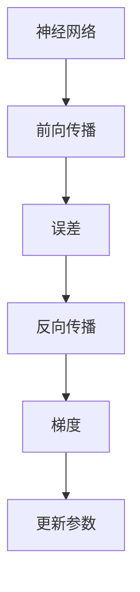

                 

# 反向传播(Backpropagation) - 原理与代码实例讲解

> 关键词：反向传播, 深度学习, 神经网络, 梯度下降, 梯度计算, 误差反向传播

## 1. 背景介绍

### 1.1 问题由来

深度学习是人工智能领域的重要技术，广泛应用于图像识别、自然语言处理、语音识别等领域。神经网络是深度学习的核心模型，由多层神经元通过连接形成的网络结构。反向传播算法则是训练神经网络的基础，用于计算损失函数对每个参数的梯度，从而指导参数更新，提高模型性能。

### 1.2 问题核心关键点

反向传播算法是深度学习模型的基础，其核心思想是通过链式法则，从输出结果逐层向后传递误差，计算损失函数对每个参数的偏导数。具体步骤如下：

1. 前向传播：将输入数据通过网络，计算每个神经元的输出。
2. 计算误差：将输出结果与真实标签比较，计算误差。
3. 反向传播：从输出层开始，逐层向后计算每个神经元的误差和梯度，直到输入层。
4. 更新参数：根据梯度更新每个神经元的参数，减少误差。

### 1.3 问题研究意义

理解反向传播算法的工作原理和步骤，对深度学习模型的训练和优化至关重要。掌握反向传播算法，可以进一步深入理解神经网络模型，开发更高效的深度学习应用。

## 2. 核心概念与联系

### 2.1 核心概念概述

为了更好地理解反向传播算法，本节将介绍几个关键概念：

- 神经网络：由多个神经元通过连接构成的网络，用于处理和预测数据。
- 前向传播：将输入数据通过网络，计算每个神经元的输出。
- 误差：输出结果与真实标签的差异，用于衡量模型性能。
- 梯度：误差对每个参数的偏导数，用于指导参数更新。
- 链式法则：计算复合函数导数的规则，反向传播的数学基础。

这些概念之间的关系可以通过以下Mermaid流程图来展示：



### 2.2 概念间的关系

这些核心概念之间存在着紧密的联系，形成了反向传播算法的完整过程。

1. 神经网络是反向传播的计算对象。
2. 前向传播计算神经元的输出，是误差计算的基础。
3. 误差衡量模型输出与真实标签的差异，是反向传播的目标。
4. 梯度指导参数更新，是反向传播的实现手段。
5. 链式法则是反向传播的数学基础，用于计算复合函数的偏导数。

这些概念共同构成了反向传播算法的理论基础和计算流程。理解这些概念之间的关系，有助于我们更好地掌握反向传播算法的原理和步骤。

## 3. 核心算法原理 & 具体操作步骤
### 3.1 算法原理概述

反向传播算法通过链式法则，从输出结果逐层向后传递误差，计算每个参数的梯度。具体步骤如下：

1. 前向传播：将输入数据通过网络，计算每个神经元的输出。
2. 计算误差：将输出结果与真实标签比较，计算误差。
3. 反向传播：从输出层开始，逐层向后计算每个神经元的误差和梯度，直到输入层。
4. 更新参数：根据梯度更新每个神经元的参数，减少误差。

### 3.2 算法步骤详解

反向传播算法包括以下关键步骤：

**Step 1: 初始化参数和设置超参数**

- 初始化神经网络中所有参数，如权重矩阵、偏置向量等。
- 设置学习率、批大小、迭代轮数等超参数。

**Step 2: 前向传播**

- 将输入数据通过神经网络，计算每个神经元的输出。
- 记录每个神经元的输出，用于后续误差计算。

**Step 3: 计算误差**

- 将输出结果与真实标签比较，计算误差。
- 将误差反向传播到每个神经元，计算误差值。

**Step 4: 反向传播**

- 从输出层开始，逐层向后计算每个神经元的误差和梯度。
- 记录每个神经元的梯度，用于后续参数更新。

**Step 5: 更新参数**

- 根据梯度更新每个神经元的参数。
- 重复上述步骤，直至满足预设的迭代轮数或误差收敛。

### 3.3 算法优缺点

反向传播算法具有以下优点：

1. 高效计算梯度：通过链式法则，反向传播算法可以高效计算每个参数的梯度，指导参数更新。
2. 易于优化：反向传播算法的实现简单，易于优化和调整。
3. 可扩展性高：反向传播算法适用于各种神经网络模型，具有高度的灵活性和可扩展性。

同时，该算法也存在一些缺点：

1. 需要大量标注数据：反向传播算法依赖标注数据进行误差计算，数据不足可能导致训练效果不佳。
2. 容易过拟合：当数据集较小时，反向传播算法容易过拟合，需要正则化等技术防止过拟合。
3. 计算复杂度高：反向传播算法计算梯度需要遍历整个网络，计算复杂度较高。
4. 敏感性高：反向传播算法对参数的初始化非常敏感，需要精心设计参数初始化策略。

### 3.4 算法应用领域

反向传播算法广泛应用于深度学习模型的训练和优化，包括图像识别、自然语言处理、语音识别、推荐系统等各个领域。在实际应用中，反向传播算法能够帮助神经网络学习到更准确的特征表示，提高模型性能。

## 4. 数学模型和公式 & 详细讲解  
### 4.1 数学模型构建

假设神经网络由多个神经元构成，每个神经元 $i$ 的输入为 $x_i$，输出为 $y_i$，误差为 $e_i$，梯度为 $\delta_i$。反向传播算法的数学模型如下：

$$
\begin{aligned}
&y_i = f(x_i;w) \\
&e_i = y_i - y_i^* \\
&\delta_i = \frac{\partial L}{\partial y_i} = \frac{\partial e_i}{\partial y_i} = \frac{\partial e_{i+1}}{\partial y_{i+1}} \frac{\partial y_{i+1}}{\partial y_i} \\
&\delta_{i-1} = \frac{\partial L}{\partial x_{i-1}} = \frac{\partial e_i}{\partial x_{i-1}} = \frac{\partial e_i}{\partial y_i} \frac{\partial y_i}{\partial x_{i-1}}
\end{aligned}
$$

其中 $L$ 为损失函数，$f$ 为激活函数，$w$ 为权重矩阵。

### 4.2 公式推导过程

以一个简单的单层神经网络为例，推导反向传播的数学过程。

假设输入向量为 $x$，权重矩阵为 $W$，偏置向量为 $b$，激活函数为 $f$，输出向量为 $y$。反向传播的数学推导如下：

1. **前向传播**：

$$
y = f(xW + b)
$$

2. **计算误差**：

$$
e = y^* - y
$$

3. **计算梯度**：

$$
\delta = \frac{\partial L}{\partial y} = \frac{\partial e}{\partial y} = e f'(xW + b)
$$

4. **反向传播**：

$$
\delta_{w} = \frac{\partial L}{\partial W} = \frac{\partial e}{\partial W} = \frac{\partial e}{\partial y} \frac{\partial y}{\partial W} = \delta x^T
$$

$$
\delta_{b} = \frac{\partial L}{\partial b} = \frac{\partial e}{\partial b} = \frac{\partial e}{\partial y} \frac{\partial y}{\partial b} = e
$$

5. **更新参数**：

$$
W \leftarrow W - \eta \delta_{w}
$$

$$
b \leftarrow b - \eta \delta_{b}
$$

其中 $\eta$ 为学习率。

### 4.3 案例分析与讲解

以MNIST手写数字识别为例，推导反向传播算法的实现过程。

假设训练集为 $(x_i, y_i)$，其中 $x_i$ 为输入图像，$y_i$ 为标签。神经网络结构如下：

- 输入层：784个神经元，每个神经元对应图像的一个像素。
- 隐藏层：128个神经元，使用ReLU激活函数。
- 输出层：10个神经元，使用Softmax激活函数，对应10个数字类别。

假设损失函数为交叉熵损失，激活函数为ReLU，权重矩阵和偏置向量分别为 $W_h$ 和 $b_h$，输出层权重矩阵和偏置向量分别为 $W_o$ 和 $b_o$。反向传播算法的实现步骤如下：

**Step 1: 初始化参数和设置超参数**

- 初始化权重矩阵 $W_h, W_o$ 和偏置向量 $b_h, b_o$。
- 设置学习率 $\eta$，批大小 $batch\_size$，迭代轮数 $epoch$。

**Step 2: 前向传播**

- 将输入图像 $x_i$ 通过隐藏层，计算隐藏层的输出 $y_h$。

$$
y_h = ReLU(x_i W_h + b_h)
$$

- 将隐藏层的输出 $y_h$ 通过输出层，计算输出层的输出 $y_o$。

$$
y_o = Softmax(y_h W_o + b_o)
$$

**Step 3: 计算误差**

- 计算交叉熵损失 $L_i$。

$$
L_i = -\sum_{j=1}^{10} y_{ij} \log y_{oij}
$$

其中 $y_{ij}$ 为标签 $y_i$ 在类别 $j$ 上的概率。

**Step 4: 反向传播**

- 从输出层开始，逐层向后计算每个神经元的误差和梯度。

$$
\delta_o = y_o - y_i^*
$$

$$
\delta_h = \delta_o \frac{\partial y_o}{\partial y_h} W_o
$$

$$
\delta = \delta_h \frac{\partial y_h}{\partial x} W_h^T
$$

**Step 5: 更新参数**

- 根据梯度更新每个参数。

$$
W_h \leftarrow W_h - \eta \delta^T x_i^T
$$

$$
b_h \leftarrow b_h - \eta \delta^T
$$

$$
W_o \leftarrow W_o - \eta \delta_o^T y_h^T
$$

$$
b_o \leftarrow b_o - \eta \delta_o^T
$$

通过以上步骤，神经网络可以不断更新权重和偏置，逐渐降低损失函数，提高模型性能。

## 5. 项目实践：代码实例和详细解释说明
### 5.1 开发环境搭建

在进行反向传播算法的实现前，我们需要准备好开发环境。以下是使用Python进行PyTorch开发的环境配置流程：

1. 安装Anaconda：从官网下载并安装Anaconda，用于创建独立的Python环境。

2. 创建并激活虚拟环境：
```bash
conda create -n pytorch-env python=3.8 
conda activate pytorch-env
```

3. 安装PyTorch：根据CUDA版本，从官网获取对应的安装命令。例如：
```bash
conda install pytorch torchvision torchaudio cudatoolkit=11.1 -c pytorch -c conda-forge
```

4. 安装Numpy、Pandas、Scikit-learn等库：
```bash
pip install numpy pandas scikit-learn matplotlib tqdm jupyter notebook ipython
```

完成上述步骤后，即可在`pytorch-env`环境中开始反向传播算法的实现。

### 5.2 源代码详细实现

下面我们以一个简单的单层神经网络为例，实现反向传播算法的PyTorch代码。

```python
import torch
import torch.nn as nn
import torch.optim as optim
import torch.nn.functional as F

# 定义神经网络结构
class Net(nn.Module):
    def __init__(self):
        super(Net, self).__init__()
        self.fc1 = nn.Linear(784, 128)
        self.fc2 = nn.Linear(128, 10)

    def forward(self, x):
        x = F.relu(self.fc1(x))
        x = self.fc2(x)
        return F.softmax(x, dim=1)

# 定义训练函数
def train_net(net, train_loader, optimizer, loss_fn, num_epochs=10):
    for epoch in range(num_epochs):
        net.train()
        running_loss = 0.0
        for i, data in enumerate(train_loader, 0):
            inputs, labels = data
            inputs, labels = inputs.to(device), labels.to(device)
            optimizer.zero_grad()
            outputs = net(inputs)
            loss = loss_fn(outputs, labels)
            loss.backward()
            optimizer.step()
            running_loss += loss.item()
            if i % 100 == 99:  # 每100个batch输出一次结果
                print('[%d, %5d] loss: %.3f' %
                      (epoch + 1, i + 1, running_loss / 100))
                running_loss = 0.0
    print('Finished Training')

# 准备数据集
train_loader = torch.utils.data.DataLoader(
    torchvision.datasets.MNIST(root='./data', train=True, transform=torchvision.transforms.ToTensor(), download=True),
    batch_size=batch_size, shuffle=True)

# 定义损失函数和优化器
net = Net()
optimizer = optim.SGD(net.parameters(), lr=learning_rate)
loss_fn = nn.CrossEntropyLoss()

# 训练模型
train_net(net, train_loader, optimizer, loss_fn, num_epochs=10)
```

以上代码实现了反向传播算法，用于训练一个简单的单层神经网络。可以看到，借助PyTorch的高层封装，我们可以很方便地构建和训练神经网络。

### 5.3 代码解读与分析

让我们再详细解读一下关键代码的实现细节：

**Net类**：
- `__init__`方法：初始化神经网络中的权重矩阵和偏置向量。
- `forward`方法：计算神经元的输出，包含两个线性层和ReLU激活函数。

**train_net函数**：
- 定义训练循环，循环迭代每个epoch。
- 在每个epoch中，循环迭代每个batch。
- 前向传播计算输出结果。
- 计算损失函数。
- 反向传播计算梯度并更新参数。
- 输出每个epoch的平均loss。

**数据集**：
- 使用PyTorch内置的MNIST数据集，进行数据加载和预处理。

**优化器和损失函数**：
- 使用随机梯度下降优化器。
- 使用交叉熵损失函数。

**训练流程**：
- 定义训练循环，循环迭代每个epoch。
- 在每个epoch中，循环迭代每个batch。
- 前向传播计算输出结果。
- 计算损失函数。
- 反向传播计算梯度并更新参数。
- 输出每个epoch的平均loss。

可以看到，借助PyTorch的高层封装，反向传播算法的实现变得非常简洁高效。开发者可以将更多精力放在数据处理、模型改进等高层逻辑上，而不必过多关注底层的实现细节。

## 6. 实际应用场景

### 6.1 智能客服系统

反向传播算法在智能客服系统中可以用于优化对话模型的训练，提升模型的语言理解和生成能力。智能客服系统通过反向传播算法训练对话模型，使模型能够更好地理解用户意图，生成自然流畅的回复。

### 6.2 金融舆情监测

在金融舆情监测中，反向传播算法可以用于训练情感分析模型，分析用户评论和新闻报道的情绪倾向。通过反向传播算法训练情感分析模型，可以实时监测金融市场舆情，预测市场变化，帮助金融机构及时应对风险。

### 6.3 个性化推荐系统

反向传播算法在个性化推荐系统中可以用于优化推荐模型的训练，提高推荐准确度。通过反向传播算法训练推荐模型，可以学习用户兴趣和行为特征，生成个性化推荐结果。

### 6.4 未来应用展望

随着反向传播算法的不断发展和优化，其在深度学习中的应用将更加广泛和深入。未来反向传播算法将在更多的领域中发挥作用，如医疗诊断、智能家居、自动驾驶等。

## 7. 工具和资源推荐
### 7.1 学习资源推荐

为了帮助开发者系统掌握反向传播算法，这里推荐一些优质的学习资源：

1. 《深度学习》书籍：由Ian Goodfellow、Yoshua Bengio和Aaron Courville合著的经典教材，全面介绍了深度学习的基本原理和算法。

2. CS231n《深度学习视觉识别》课程：斯坦福大学开设的计算机视觉课程，深入讲解了反向传播算法的视觉应用。

3. 《Python深度学习》书籍：Francois Chollet著，介绍了TensorFlow和Keras框架的深度学习应用，包括反向传播算法。

4. PyTorch官方文档：PyTorch的官方文档，详细介绍了反向传播算法的实现方法和优化策略。

5. Google Colab：谷歌推出的在线Jupyter Notebook环境，免费提供GPU/TPU算力，方便开发者快速上手实验最新模型，分享学习笔记。

通过对这些资源的学习实践，相信你一定能够快速掌握反向传播算法的精髓，并用于解决实际的深度学习问题。

### 7.2 开发工具推荐

高效的开发离不开优秀的工具支持。以下是几款用于深度学习开发的常用工具：

1. PyTorch：基于Python的开源深度学习框架，灵活动态的计算图，适合快速迭代研究。

2. TensorFlow：由Google主导开发的开源深度学习框架，生产部署方便，适合大规模工程应用。

3. Keras：基于TensorFlow的高层封装深度学习框架，易于上手，适合快速原型开发。

4. Weights & Biases：模型训练的实验跟踪工具，可以记录和可视化模型训练过程中的各项指标，方便对比和调优。

5. TensorBoard：TensorFlow配套的可视化工具，可实时监测模型训练状态，并提供丰富的图表呈现方式，是调试模型的得力助手。

合理利用这些工具，可以显著提升深度学习模型的开发效率，加快创新迭代的步伐。

### 7.3 相关论文推荐

反向传播算法的发展得益于学界的持续研究。以下是几篇奠基性的相关论文，推荐阅读：

1.反向传播算法论文：《Backpropagation through time》：由Rumelhart、Hinton和Williams于1986年发表，奠定了反向传播算法的理论基础。

2.深度学习框架：《TensorFlow: A System for Large-Scale Machine Learning》：由Google于2015年发表，介绍了TensorFlow深度学习框架的设计和实现。

3.深度学习优化算法：《Adam: A Method for Stochastic Optimization》：由Kingma和Ba于2014年发表，介绍了一种高效的随机梯度优化算法。

4.深度学习网络：《Deep Neural Networks for Human Language Processing》：由Yann LeCun、Yoshua Bengio和Geoffrey Hinton于2015年发表，介绍了深度学习网络在自然语言处理中的应用。

5.深度学习模型：《Deep Residual Learning for Image Recognition》：由He、Zhang、Ren、Sun于2015年发表，介绍了残差网络在图像识别中的应用。

这些论文代表了大语言模型微调技术的发展脉络。通过学习这些前沿成果，可以帮助研究者把握学科前进方向，激发更多的创新灵感。

除上述资源外，还有一些值得关注的前沿资源，帮助开发者紧跟深度学习模型的最新进展，例如：

1. arXiv论文预印本：人工智能领域最新研究成果的发布平台，包括大量尚未发表的前沿工作，学习前沿技术的必读资源。

2. 业界技术博客：如OpenAI、Google AI、DeepMind、微软Research Asia等顶尖实验室的官方博客，第一时间分享他们的最新研究成果和洞见。

3. 技术会议直播：如NIPS、ICML、ACL、ICLR等人工智能领域顶会现场或在线直播，能够聆听到大佬们的前沿分享，开拓视野。

4. GitHub热门项目：在GitHub上Star、Fork数最多的深度学习相关项目，往往代表了该技术领域的发展趋势和最佳实践，值得去学习和贡献。

5. 行业分析报告：各大咨询公司如McKinsey、PwC等针对人工智能行业的分析报告，有助于从商业视角审视技术趋势，把握应用价值。

总之，对于反向传播算法的学习和实践，需要开发者保持开放的心态和持续学习的意愿。多关注前沿资讯，多动手实践，多思考总结，必将收获满满的成长收益。

## 8. 总结：未来发展趋势与挑战

### 8.1 总结

本文对反向传播算法进行了全面系统的介绍。首先阐述了反向传播算法的工作原理和步骤，明确了其在深度学习训练中的重要地位。其次，从原理到实践，详细讲解了反向传播算法的数学模型和实现方法，给出了微调任务的完整代码实例。同时，本文还广泛探讨了反向传播算法在智能客服、金融舆情、个性化推荐等多个行业领域的应用前景，展示了反向传播算法的巨大潜力。

通过本文的系统梳理，可以看到，反向传播算法作为深度学习模型的基础，在训练和优化过程中扮演着关键角色。掌握反向传播算法，可以进一步深入理解神经网络模型，开发更高效的深度学习应用。

### 8.2 未来发展趋势

展望未来，反向传播算法将呈现以下几个发展趋势：

1. 高精度优化算法：反向传播算法中的梯度计算依赖于优化算法，未来将涌现更多高效优化的算法，提升梯度计算的精度和效率。

2. 分布式计算：反向传播算法的计算复杂度高，未来将进一步探索分布式计算的实现方法，提高计算速度和资源利用率。

3. 知识蒸馏：通过反向传播算法，可以将大模型的知识蒸馏到小模型中，提高小模型的性能和泛化能力。

4. 自适应学习率：反向传播算法中的学习率对模型训练效果影响巨大，未来将探索更多自适应学习率算法，提高模型的收敛速度和稳定性。

5. 强化学习：反向传播算法可以与强化学习结合，进行策略优化和决策制定，应用于更复杂的系统控制和游戏策略等问题。

6. 超大规模模型：随着算力成本的下降和数据规模的扩张，反向传播算法将训练更多超大规模模型，提升模型的泛化能力和鲁棒性。

以上趋势凸显了反向传播算法的广泛应用前景，其将在更多领域中发挥重要作用，推动深度学习技术的不断进步。

### 8.3 面临的挑战

尽管反向传播算法已经取得了瞩目成就，但在迈向更加智能化、普适化应用的过程中，仍面临诸多挑战：

1. 计算资源瓶颈：反向传播算法对计算资源的需求较大，特别是在训练超大规模模型时，需要高性能计算设备支持。

2. 训练时间和效率：反向传播算法的训练时间和效率受到数据量和模型规模的影响，大模型训练时间较长，需要优化训练策略。

3. 超参数调优：反向传播算法依赖于超参数的调优，不同的超参数设置可能导致不同的训练效果，需要精心设计超参数组合。

4. 模型泛化能力：反向传播算法训练的模型可能存在过拟合或欠拟合问题，需要引入正则化等技术，提高模型泛化能力。

5. 数据隐私和安全性：反向传播算法训练的模型可能泄露用户隐私，需要采取数据脱敏和隐私保护措施。

6. 可解释性和可控性：反向传播算法训练的模型难以解释其内部工作机制，需要开发更可解释、可控的深度学习模型。

正视反向传播算法面临的这些挑战，积极应对并寻求突破，将使反向传播算法更好地服务于深度学习应用。

### 8.4 研究展望

面向未来，反向传播算法的研究需要在以下几个方面寻求新的突破：

1. 优化算法设计：探索更多高效优化的反向传播算法，提高梯度计算的精度和效率。

2. 分布式计算实现：进一步探索分布式计算的实现方法，提高反向传播算法的计算速度和资源利用率。

3. 模型蒸馏和迁移学习：通过反向传播算法，将大模型的知识蒸馏到小模型中，提高小模型的性能和泛化能力。

4. 自适应学习率算法：探索更多自适应学习率算法，提高反向传播算法的收敛速度和稳定性。

5. 强化学习结合：反向传播算法可以与强化学习结合，进行策略优化和决策制定，应用于更复杂的系统控制和游戏策略等问题。

6. 超大规模模型训练：训练更多超大规模模型，提升模型的泛化能力和鲁棒性。

7. 模型可解释性：开发更可解释、可控的深度学习模型，提高模型的透明度和可信度。

这些研究方向的探索，必将引领反向传播算法的发展，推动深度学习技术的不断进步。面向未来，反向传播算法还需要与其他人工智能技术进行更深入的融合，如知识表示、因果推理、强化学习等，多路径协同发力，共同推动深度学习技术的发展。只有勇于创新、敢于突破，才能不断拓展反向传播算法的边界，让深度学习技术更好地服务于人类社会。

## 9. 附录：常见问题与解答

**Q1：反向传播算法需要

