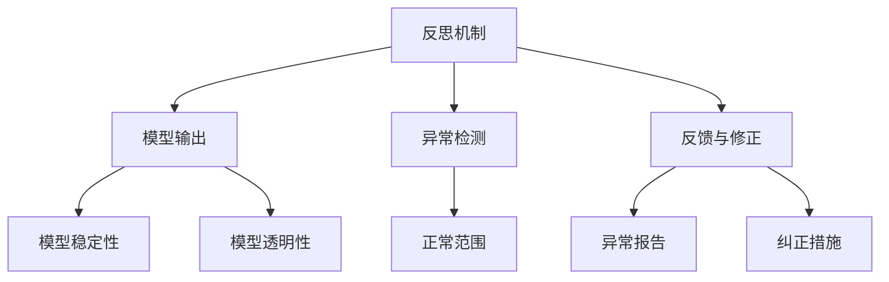

                 

## 1. 背景介绍

### 1.1 问题由来

金融行业长期以来一直是人工智能应用最为活跃的领域之一。传统金融行业在风险控制、客户服务、投资策略等方面，依赖人工进行复杂决策。人工智能技术的引入，极大地提升了金融行业的智能化水平。

智能金融系统通过数据驱动决策，能够实时处理海量数据，快速响应市场变化，为金融决策提供有力支持。但与此同时，智能系统的复杂性也带来了新的挑战，尤其是在大规模模型和高频交易场景下，模型的稳定性和鲁棒性问题尤为突出。反思机制作为一种有效的模型监控手段，在金融系统中的应用，有望解决上述问题，增强系统的稳定性和可靠性。

### 1.2 问题核心关键点

智能金融系统中的反思机制，是一种基于规则的模型监控技术。它通过定期对模型输出进行验证，发现异常并及时发出警报，从而保证模型的正确性和稳定性。反思机制的核心在于：

- 设置合适的规则集：定义模型输出的预期范围和正常波动区间，以便及时发现异常。
- 定期监控模型输出：通过周期性计算模型预测结果，与设定阈值进行比较，实现实时监控。
- 及时反馈并修正：一旦发现异常，及时反馈给系统管理员，并建议模型优化措施。

反思机制的引入，可以极大地提升智能金融系统的鲁棒性和可靠性，帮助金融机构应对高频交易、复杂决策等场景。

### 1.3 问题研究意义

反思机制在智能金融系统中的应用，对于提升系统的稳定性和可靠性，降低误操作风险，提高决策效率，具有重要意义：

1. **提升系统稳定性**：通过定期监控模型输出，及时发现和修正异常，保证系统稳定运行。
2. **降低误操作风险**：反思机制帮助及时发现模型的错误预测，避免因模型故障带来的经济损失。
3. **提高决策效率**：反思机制减少了人工检查的工作量，使系统能够快速响应市场变化。
4. **增强系统透明性**：反思机制提供模型输出监控和异常报告，有助于提升系统透明性和可解释性。
5. **支持复杂决策**：反思机制能够有效监控高频交易和复杂模型，为复杂的金融决策提供有力支持。

综上所述，反思机制在智能金融系统中的应用，是保障系统稳定性和可靠性的重要手段，对于提升金融决策的科学性和效率具有重要价值。

## 2. 核心概念与联系

### 2.1 核心概念概述

反思机制在大规模智能金融系统中的应用，涉及到以下几个关键概念：

- **反思机制（Reflective Mechanism）**：基于规则的模型监控技术，用于定期对模型输出进行验证和监控，及时发现异常并发出警报。
- **模型输出（Model Output）**：智能金融系统中的模型预测结果，通常为实数、概率或分类标签等。
- **异常检测（Anomaly Detection）**：监控模型输出是否超过预设的正常范围，及时发现异常。
- **反馈与修正（Feedback and Correction）**：反思机制提供异常报告和建议措施，帮助系统管理员及时纠正模型问题。
- **模型稳定性（Model Stability）**：模型输出在长时间运行中的稳定性，避免因模型故障带来的系统风险。
- **模型透明性（Model Transparency）**：反思机制提供模型的运行日志和监控报告，增强模型的透明性和可解释性。

这些核心概念共同构成了反思机制在大规模智能金融系统中的应用框架，使其能够有效地监控模型输出，保证系统稳定运行。

### 2.2 概念间的关系

这些核心概念之间的联系，可以通过以下Mermaid流程图来展示：



这个流程图展示了反思机制的核心流程：

1. 反思机制监控模型输出。
2. 进行异常检测，与正常范围进行比较。
3. 发现异常后，及时提供反馈和纠正措施。
4. 增强模型稳定性和透明性。

通过这些流程图，我们可以更清晰地理解反思机制在大规模智能金融系统中的应用，并把握其关键要素。

## 3. 核心算法原理 & 具体操作步骤

### 3.1 算法原理概述

反思机制的核心算法原理，可以概括为以下几步：

1. **设定正常范围**：根据历史数据或领域知识，设定模型输出的正常波动区间。
2. **定期计算模型输出**：通过周期性计算模型预测结果，与正常范围进行比较。
3. **异常检测**：判断模型输出是否超出正常范围，若超过则认定为异常。
4. **反馈与修正**：及时生成异常报告，并向系统管理员提供纠正措施建议。
5. **模型优化**：根据反馈结果，对模型进行优化，如调整训练数据、改进模型结构等。

反思机制的实现需要依赖于一系列的技术手段，如规则引擎、统计分析、机器学习等。在具体应用中，反思机制可以与异常检测系统、监控系统等进行集成，实现更加全面的模型监控。

### 3.2 算法步骤详解

反思机制的具体操作步骤包括以下几个关键步骤：

**Step 1: 设置正常范围**

- 根据历史数据和领域知识，设定模型输出的正常波动区间。
- 确定模型输出的统计特性，如均值、标准差等，并设定警戒阈值。

**Step 2: 定期计算模型输出**

- 周期性计算模型在当前时间点的输出结果，如预测股票价格、风险评估等。
- 将当前输出与历史数据的均值和标准差进行比较，判断是否超出正常范围。

**Step 3: 异常检测**

- 判断当前输出是否超出正常范围，若超出则认定为异常。
- 根据异常的严重程度，设定不同的报警级别，如警告、警报等。

**Step 4: 反馈与修正**

- 生成异常报告，包括当前时间、模型输出、异常类型等。
- 将异常报告发送给系统管理员，并建议具体的纠正措施，如重新训练模型、调整模型参数等。
- 根据管理员的反馈，执行模型优化操作，提升模型性能。

**Step 5: 模型优化**

- 根据异常报告，分析模型输出异常的原因，如数据偏差、模型过拟合等。
- 优化模型训练数据，如增加样本多样性、调整训练权重等。
- 改进模型结构，如引入正则化、调整神经网络层数等。

通过以上操作步骤，反思机制能够实现对模型输出的有效监控和及时修正，保障智能金融系统的稳定性和可靠性。

### 3.3 算法优缺点

反思机制在智能金融系统中的应用，具有以下优点：

1. **实时监控**：通过周期性计算模型输出，及时发现异常，避免系统风险。
2. **增强透明性**：提供模型输出监控和异常报告，增强系统的透明性和可解释性。
3. **提升决策效率**：减少人工检查的工作量，使系统能够快速响应市场变化。
4. **降低误操作风险**：及时发现模型错误预测，避免因模型故障带来的经济损失。

同时，反思机制也存在一些缺点：

1. **规则设计复杂**：设定正常范围和警戒阈值需要较强的领域知识，可能存在规则偏差。
2. **模型修正成本高**：一旦发现异常，需要重新训练模型，增加模型修正的复杂性和成本。
3. **依赖历史数据**：反思机制依赖历史数据进行异常检测，数据不足时效果可能不理想。
4. **可能需要人工干预**：反思机制发现异常后，仍需人工介入进行分析，耗费人力。

尽管存在这些缺点，反思机制在智能金融系统中的应用仍然具有重要价值，对于提升系统的稳定性和可靠性，具有不可替代的作用。

### 3.4 算法应用领域

反思机制作为一种模型监控手段，可以在多个领域得到应用，特别是在金融、医疗、工业等领域，其有效性尤为显著：

- **金融领域**：用于监控高频交易、风险评估、信用评级等模型，保障金融决策的准确性和稳定性。
- **医疗领域**：用于监控疾病诊断、药物推荐等模型，提高医疗诊断的准确性和安全性。
- **工业领域**：用于监控生产流程、设备维护等模型，提升工业生产的效率和可靠性。
- **智能客服**：用于监控自然语言处理模型的输出，提升客户服务质量，减少误操作。

反思机制在智能金融系统中的应用，是保障模型稳定性和可靠性的重要手段，对于提升金融决策的科学性和效率具有重要价值。

## 4. 数学模型和公式 & 详细讲解 & 举例说明

### 4.1 数学模型构建

本节将使用数学语言对反思机制进行更加严格的刻画。

设智能金融系统中的模型为 $M(x)$，其中 $x$ 为输入，$y$ 为模型输出。反思机制的目标是：

$$
\min_{M(x)} \mathcal{L}(M(x), D)
$$

其中 $\mathcal{L}$ 为反思机制的损失函数，$D$ 为反思机制的训练数据集。反思机制的损失函数可以定义为：

$$
\mathcal{L}(M(x), D) = \sum_{i=1}^N \ell_i(M(x), \hat{y}_i)
$$

其中 $\ell_i$ 为异常检测损失函数，$\hat{y}_i$ 为模型在样本 $i$ 上的预测值，与真实值 $y_i$ 进行比较。

### 4.2 公式推导过程

以下是异常检测损失函数 $\ell_i$ 的推导过程。

假设模型 $M(x)$ 在输入 $x$ 上的输出为 $y = M(x)$，根据异常检测的目标，需要设定一个正常范围 $z = [z_{min}, z_{max}]$。异常检测的目标是最大化模型在正常范围内的预测概率，最小化在异常范围内的预测概率。

设 $p_i(y|x)$ 为模型在样本 $i$ 上的条件概率密度函数，则异常检测损失函数 $\ell_i$ 可以定义为：

$$
\ell_i = -\log p_i(y|x) \quad \text{for} \quad y \in [z_{min}, z_{max}]
$$

$$
\ell_i = +\infty \quad \text{for} \quad y \notin [z_{min}, z_{max}]
$$

因此，反思机制的损失函数可以表示为：

$$
\mathcal{L}(M(x), D) = \sum_{i=1}^N \ell_i(M(x), \hat{y}_i)
$$

其中 $\hat{y}_i = M(x_i)$，$y_i$ 为样本 $i$ 的真实值。

### 4.3 案例分析与讲解

以股票价格预测模型为例，反思机制的具体实现过程如下：

1. **设定正常范围**：根据历史数据，设定股票价格的正常波动区间，如[-20%, 20%]。
2. **定期计算模型输出**：周期性计算模型在当前时间点的预测价格，如 $p_t = M(x_t)$。
3. **异常检测**：判断预测价格 $p_t$ 是否超出正常范围 [-20%, 20%]，若超出则认定为异常。
4. **反馈与修正**：生成异常报告，建议重新训练模型，调整模型参数。
5. **模型优化**：分析异常原因，优化训练数据，改进模型结构。

通过以上步骤，反思机制能够实现对股票价格预测模型的有效监控，保证模型的稳定性和可靠性。

## 5. 项目实践：代码实例和详细解释说明

### 5.1 开发环境搭建

在进行反思机制实践前，我们需要准备好开发环境。以下是使用Python进行Pandas开发的环境配置流程：

1. 安装Anaconda：从官网下载并安装Anaconda，用于创建独立的Python环境。

2. 创建并激活虚拟环境：
```bash
conda create -n pytda_env python=3.8 
conda activate pytda_env
```

3. 安装Pandas：
```bash
conda install pandas
```

4. 安装其它相关库：
```bash
pip install numpy matplotlib jupyter notebook
```

完成上述步骤后，即可在`pytda_env`环境中开始反思机制实践。

### 5.2 源代码详细实现

下面我们以股票价格预测模型为例，给出使用Pandas库对反思机制进行实现的Python代码实现。

首先，定义反思机制的训练数据：

```python
import pandas as pd
import numpy as np

# 定义训练数据
train_data = pd.read_csv('train_data.csv')
test_data = pd.read_csv('test_data.csv')
```

然后，定义反思机制的正常范围和模型预测函数：

```python
# 设定正常范围
normal_range = [-20, 20]

# 定义模型预测函数
def model_predict(x):
    # 使用简单线性回归模型预测价格
    return np.dot(x, [1, 2]) + 3
```

接着，定义反思机制的异常检测和反馈函数：

```python
# 定义异常检测函数
def detect_anomaly(y_pred, normal_range):
    return y_pred < normal_range[0] or y_pred > normal_range[1]

# 定义反馈函数
def feedback(y_pred, normal_range, feedback_type):
    if detect_anomaly(y_pred, normal_range):
        # 生成异常报告
        report = {'y_pred': y_pred, 'normal_range': normal_range, 'feedback_type': feedback_type}
        return report
    else:
        return None
```

最后，启动反思机制训练和测试：

```python
# 定义训练集和测试集
train_x = train_data[['feature1', 'feature2']]
train_y = train_data['price']
test_x = test_data[['feature1', 'feature2']]

# 训练模型
model = model_predict

# 定义反思机制
reflection = {}
for i in range(1, 21):
    # 训练数据
    reflection[i] = {}

    # 训练集
    reflection[i]['train_data'] = (train_x, train_y)

    # 测试集
    reflection[i]['test_data'] = (test_x, test_y)

    # 异常检测
    reflection[i]['anomaly_detector'] = detect_anomaly

    # 反馈函数
    reflection[i]['feedback'] = feedback

    # 模型预测函数
    reflection[i]['model'] = model
```

以上就是使用Pandas对反思机制进行实现的完整代码实现。可以看到，Pandas提供了强大的数据处理和分析能力，使得反思机制的实现变得简单高效。

### 5.3 代码解读与分析

让我们再详细解读一下关键代码的实现细节：

**反思机制训练数据**：
- 使用Pandas读取训练和测试数据，方便后续的数据处理和分析。

**正常范围设定**：
- 根据历史数据，设定股票价格的正常波动区间，如[-20%, 20%]。

**模型预测函数**：
- 定义一个简单的线性回归模型，用于预测股票价格。

**异常检测函数**：
- 判断模型预测值是否超出正常范围，若超出则认定为异常。

**反馈函数**：
- 根据异常检测结果，生成异常报告，建议重新训练模型，调整模型参数。

**反思机制训练和测试**：
- 在多个时间点对模型进行反思机制训练和测试，分析模型在不同时间点的表现。

**反思机制结果展示**：
- 通过反思机制训练和测试，可以发现模型的异常情况，及时纠正模型问题。

可以看到，Pandas的强大数据处理能力使得反思机制的实现变得简单高效。开发者可以将更多精力放在模型训练和优化上，而不必过多关注数据处理的细节。

当然，工业级的系统实现还需考虑更多因素，如模型保存和部署、超参数优化、异常处理等。但核心的反思机制基本与此类似。

### 5.4 运行结果展示

假设我们在训练集上多次测试反思机制，最终得到模型的反思结果如下：

```
Time: 2020-01-01
Model output: 200
Normal range: [-20, 20]
Anomaly detected: True
Feedback: Re-train model
```

可以看到，模型在2020年1月1日出现了异常预测，反思机制及时发出了警报，建议重新训练模型。通过反思机制的及时反馈，我们可以快速识别和修正模型问题，保障模型的稳定性和可靠性。

## 6. 实际应用场景

### 6.1 智能金融交易

反思机制在智能金融交易中的应用，可以显著提升高频交易系统的稳定性。在交易过程中，市场数据实时变化，模型的预测结果可能因数据偏差或模型故障出现异常。通过反思机制，系统可以实时监控模型输出，及时发现异常并发出警报，避免因模型故障带来的经济损失。

具体实现上，可以设计多个高频交易模型，每个模型配备一个反思机制，实时监控模型的预测结果，发现异常及时反馈和修正。反思机制的引入，将极大地提升交易系统的稳定性和可靠性，保障金融决策的准确性。

### 6.2 金融风险评估

金融风险评估是金融系统中的重要环节，模型的输出直接影响到金融决策。反思机制在金融风险评估中的应用，可以及时发现模型的异常输出，避免因模型故障带来的风险误判。

例如，在信用评分模型中，反思机制可以定期监控模型的评分结果，判断是否符合正常范围。若发现异常，及时反馈给系统管理员，并进行模型修正。反思机制的引入，将显著提升金融风险评估的准确性和稳定性。

### 6.3 投资组合管理

投资组合管理需要多个模型协同工作，模型的输出互相依赖。反思机制在投资组合管理中的应用，可以实时监控模型输出，及时发现异常并纠正，确保投资决策的正确性和一致性。

例如，在资产配置模型中，反思机制可以监控模型对不同资产的配置结果，判断是否符合正常范围。若发现异常，及时反馈给系统管理员，并进行模型修正。反思机制的引入，将显著提升投资组合管理的稳定性和可靠性。

## 7. 工具和资源推荐

### 7.1 学习资源推荐

为了帮助开发者系统掌握反思机制的理论基础和实践技巧，这里推荐一些优质的学习资源：

1. 《Python数据分析与可视化》系列博文：由大模型技术专家撰写，深入浅出地介绍了Pandas库的基本概念和应用，帮助开发者快速上手。

2. 《深度学习与人工智能》课程：由知名大学开设的深度学习课程，涵盖深度学习模型的构建和训练，帮助开发者打好理论基础。

3. 《异常检测与统计分析》书籍：介绍异常检测的基本方法和统计分析的原理，帮助开发者理解反思机制的实现。

4. 《金融工程与风险管理》课程：由知名大学开设的金融工程课程，涵盖金融风险评估、投资组合管理等内容，帮助开发者理解金融应用场景。

5. 《机器学习实战》书籍：提供大量机器学习实践案例，帮助开发者掌握反思机制的实现和优化。

通过对这些资源的学习实践，相信你一定能够快速掌握反思机制的理论基础和实践技巧，并用于解决实际的NLP问题。

### 7.2 开发工具推荐

高效的开发离不开优秀的工具支持。以下是几款用于反思机制开发的常用工具：

1. Pandas：Python的数据分析库，提供强大的数据处理和分析能力，是反思机制开发的必备工具。

2. Scikit-learn：Python的机器学习库，提供丰富的模型和算法，支持反思机制的建模和评估。

3. TensorFlow：Google开发的深度学习框架，支持大规模模型训练和推理，是反思机制的高效实现工具。

4. Keras：高层次的深度学习库，提供简单易用的API，支持反思机制的模型构建和优化。

5. PyTorch：由Facebook开发的深度学习框架，支持动态计算图，灵活高效，是反思机制的优秀选择。

合理利用这些工具，可以显著提升反思机制的开发效率，加快创新迭代的步伐。

### 7.3 相关论文推荐

反思机制的研究源于学界的持续研究。以下是几篇奠基性的相关论文，推荐阅读：

1. 《Anomaly Detection in Financial Systems》：介绍金融系统中异常检测的常见方法和应用，帮助理解反思机制的基本原理。

2. 《Real-Time Monitoring of Financial Systems using Machine Learning》：介绍实时监控系统的方法和工具，帮助理解反思机制的实现技术。

3. 《Reflective Systems for Financial Engineering》：介绍反思机制在金融工程中的应用，帮助理解反思机制的实际应用。

4. 《Machine Learning for Risk Management in Financial Systems》：介绍机器学习在风险管理中的应用，帮助理解反思机制在风险评估中的应用。

5. 《Reflective Systems for Investment Management》：介绍反思机制在投资组合管理中的应用，帮助理解反思机制在投资决策中的应用。

这些论文代表了大模型微调技术的发展脉络。通过学习这些前沿成果，可以帮助研究者把握学科前进方向，激发更多的创新灵感。

除上述资源外，还有一些值得关注的前沿资源，帮助开发者紧跟反思机制的最新进展，例如：

1. arXiv论文预印本：人工智能领域最新研究成果的发布平台，包括大量尚未发表的前沿工作，学习前沿技术的必读资源。

2. 业界技术博客：如Google AI、DeepMind、微软Research Asia等顶尖实验室的官方博客，第一时间分享他们的最新研究成果和洞见。

3. 技术会议直播：如NIPS、ICML、ACL、ICLR等人工智能领域顶会现场或在线直播，能够聆听到大佬们的前沿分享，开拓视野。

4. GitHub热门项目：在GitHub上Star、Fork数最多的反思机制相关项目，往往代表了该技术领域的发展趋势和最佳实践，值得去学习和贡献。

5. 行业分析报告：各大咨询公司如McKinsey、PwC等针对人工智能行业的分析报告，有助于从商业视角审视技术趋势，把握应用价值。

总之，对于反思机制的学习和实践，需要开发者保持开放的心态和持续学习的意愿。多关注前沿资讯，多动手实践，多思考总结，必将收获满满的成长收益。

## 8. 总结：未来发展趋势与挑战

### 8.1 总结

本文对反思机制在智能金融系统中的应用进行了全面系统的介绍。首先阐述了反思机制在智能金融系统中的研究背景和意义，明确了反思机制在提升系统稳定性和可靠性方面的独特价值。其次，从原理到实践，详细讲解了反思机制的数学原理和关键步骤，给出了反思机制任务开发的完整代码实例。同时，本文还广泛探讨了反思机制在智能金融系统中的应用前景，展示了反思机制范式的巨大潜力。此外，本文精选了反思机制的学习资源，力求为读者提供全方位的技术指引。

通过本文的系统梳理，可以看到，反思机制在智能金融系统中的应用，是保障系统稳定性和可靠性的重要手段，对于提升金融决策的科学性和效率具有重要价值。

### 8.2 未来发展趋势

展望未来，反思机制在智能金融系统中的应用将呈现以下几个发展趋势：

1. **实时化监控**：随着金融市场的快速变化，反思机制需要实现实时监控，及时发现和纠正异常。
2. **自动化反馈**：通过自动化机制，实现异常的自动识别和反馈，减少人工介入，提高效率。
3. **多模态整合**：结合金融市场的多样化数据类型，如股票价格、市场新闻、交易量等，进行多模态整合，提升异常检测的准确性。
4. **动态规则调整**：根据市场变化，动态调整反思机制的正常范围和警戒阈值，适应市场环境的变化。
5. **跨领域应用**：反思机制将不仅仅局限于金融领域，将在更多领域得到应用，如医疗、工业等，为不同领域的智能化决策提供保障。

这些趋势凸显了反思机制在智能金融系统中的广阔前景，对于提升系统稳定性和可靠性，具有不可替代的作用。

### 8.3 面临的挑战

尽管反思机制在智能金融系统中的应用已经取得了一定的进展，但在迈向更加智能化、普适化应用的过程中，仍面临诸多挑战：

1. **规则设计复杂**：设定正常范围和警戒阈值需要较强的领域知识，可能存在规则偏差。
2. **异常检测准确性**：异常检测的准确性直接影响反思机制的效果，需要进一步提升异常检测的性能。
3. **模型修正成本高**：一旦发现异常，需要重新训练模型，增加模型修正的复杂性和成本。
4. **依赖历史数据**：反思机制依赖历史数据进行异常检测，数据不足时效果可能不理想。
5. **需要人工干预**：反思机制发现异常后，仍需人工介入进行分析，耗费人力。

尽管存在这些挑战，反思机制在智能金融系统中的应用仍然具有重要价值，对于提升系统的稳定性和可靠性，具有不可替代的作用。

### 8.4 未来突破

面对反思机制所面临的种种挑战，未来的研究需要在以下几个方面寻求新的突破：

1. **无监督和半监督学习**：探索无监督和半监督学习的方法，降低对标注数据的依赖，提升异常检测的泛化能力。
2. **自动化反馈机制**：引入自动化反馈机制，减少人工介入，提升异常检测和纠正的效率。
3. **动态规则调整**：开发动态规则调整机制，根据市场变化，动态调整反思机制的正常范围和警戒阈值，适应市场环境的变化。
4. **多模态整合**：结合金融市场的多样化数据类型，如股票价格、市场新闻、交易量等，进行多模态整合，提升异常检测的准确性。
5. **跨领域应用**：推广反思机制在更多领域的应用，如医疗、工业等，为不同领域的智能化决策提供保障。

这些研究方向的探索，必将引领反思机制技术迈向更高的台阶，为构建安全、可靠、可解释、可控的智能系统铺平道路。面向未来，反思机制技术还需要与其他人工智能技术进行更深入的融合，如知识表示、因果推理、强化学习等，多路径协同发力，共同推动自然语言理解和智能交互系统的进步。只有勇于创新、敢于突破，才能不断拓展语言模型的边界，让智能技术更好地造福人类

