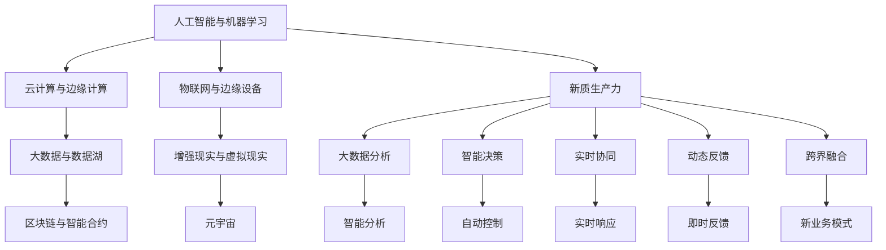
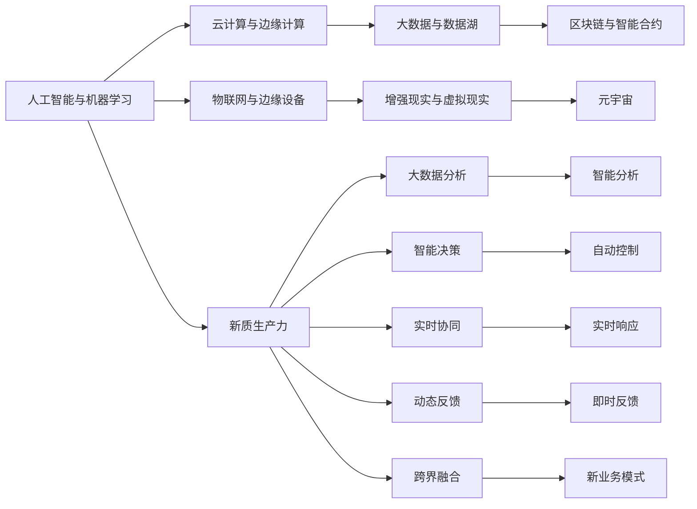

                 

# 发展新质生产力提高核心竞争力

## 1. 背景介绍

在当今数字化经济时代，企业的核心竞争力不仅取决于传统的资本、劳动和技术，更依赖于对新技术的快速适应和应用。新质生产力（Emergent Productive Forces），指随着技术进步而新兴的、对经济增长具有深远影响的驱动因素。发展新质生产力，能够加速企业数字化转型，提高竞争优势，引领行业发展。

### 1.1 新质生产力发展的重要性

新质生产力对现代经济的重要性不言而喻。在AI、大数据、区块链等新兴技术驱动下，企业能够实现更高效的资源配置、更精准的决策制定、更快速的市场响应。通过数字化、智能化手段，企业能够在多领域取得突破，进一步提升生产效率、降低成本、增强创新能力。

### 1.2 新质生产力的关键要素

新质生产力的关键要素包括数据驱动、智能分析、网络协作、用户反馈等。企业应通过大数据、人工智能、云计算、区块链等技术，构建数字化生态系统，实现数据全面互联、智能协同、动态反馈，推动业务创新和价值重塑。

### 1.3 新质生产力面临的挑战

尽管新质生产力具有巨大的潜力，但在实际应用中也面临诸多挑战，包括数据隐私与安全、数据质量与可用性、技术部署复杂性、组织文化变革等。如何有效应对这些挑战，实现新质生产力的价值最大化，是企业需要重点关注的课题。

## 2. 核心概念与联系

### 2.1 核心概念概述

为更深刻地理解新质生产力的发展，本节将介绍几个核心概念及其相互联系。

- **人工智能与机器学习**：利用算法和数据，模拟人类智能活动，实现自动化决策、模式识别等。
- **云计算与边缘计算**：云平台提供弹性计算资源，边缘计算实现数据处理与决策的实时性。
- **大数据与数据湖**：通过大数据技术，实现海量数据的存储、处理与分析，挖掘数据价值。
- **区块链与智能合约**：通过区块链技术，确保数据透明、不可篡改，智能合约自动执行交易逻辑。
- **物联网与边缘设备**：实现物体间的互联互通，提高生产效率和自动化水平。
- **增强现实与虚拟现实**：通过AR/VR技术，提升用户交互体验和操作便利性。
- **元宇宙**：虚拟与现实无缝融合的新空间，带来全新的经济与社交形态。

这些核心概念通过合纵连横，共同构建起新质生产力的生态系统，为企业的数字化转型提供强有力的技术支持。

### 2.2 概念间的关系

这些核心概念之间的关系可以通过以下Mermaid流程图来展示：



这个流程图展示了新质生产力的各个关键要素及其相互关系：

1. 人工智能与机器学习为大数据分析提供支持，云计算与边缘计算提供计算资源，为智能决策、实时协同、动态反馈提供平台。
2. 物联网与边缘设备提升生产效率，增强现实与虚拟现实提升用户体验，区块链与智能合约保障数据安全，共同支撑新业务模式的探索。
3. 新质生产力通过上述技术要素的整合与协同，实现价值创造与竞争力的提升。

### 2.3 核心概念的整体架构

最终，我们将这些核心概念通过一个综合的流程图展示出来：



这个综合流程图展示了从核心技术到新质生产力的完整架构。通过整合这些技术要素，企业可以实现高效的资源配置、精准的决策制定、实时的协同合作和动态的业务创新，从而提升核心竞争力。

## 3. 核心算法原理 & 具体操作步骤

### 3.1 算法原理概述

新质生产力的发展，离不开核心算法和算法的优化。本节将从算法原理的角度，介绍新质生产力的核心算法及其优化。

新质生产力的核心算法主要包括以下几个方面：

- **机器学习算法**：用于数据建模、特征提取、模式识别等。
- **深度学习算法**：通过多层神经网络结构，实现复杂任务的自动化。
- **强化学习算法**：通过智能体与环境的交互，学习最优决策策略。
- **优化算法**：用于解决大规模优化问题，提升计算效率。
- **联邦学习算法**：通过分布式计算，保护数据隐私和安全。

这些算法相互配合，形成了新质生产力的算法基础，推动了数字化转型和智能化发展。

### 3.2 算法步骤详解

新质生产力的算法步骤一般包括以下几个关键步骤：

**Step 1: 数据收集与预处理**
- 收集与业务相关的数据，包括结构化数据、半结构化数据和非结构化数据。
- 进行数据清洗、归一化、特征提取等预处理操作，提升数据质量。

**Step 2: 模型训练与优化**
- 选择合适的算法，训练模型并优化参数，提升模型性能。
- 应用正则化技术、剪枝、蒸馏等方法，减少过拟合风险。

**Step 3: 模型部署与应用**
- 将训练好的模型部署到云平台或边缘设备，实现实时数据处理和决策。
- 结合业务场景，优化模型应用策略，提升用户体验和业务价值。

**Step 4: 动态监控与迭代优化**
- 实时监控模型运行状态，收集反馈数据。
- 基于反馈数据，不断优化模型参数和应用策略，提升新质生产力效果。

### 3.3 算法优缺点

新质生产力的算法具有以下优点：

- **高效性**：通过自动化数据处理和智能决策，大幅提升生产效率。
- **灵活性**：结合业务需求进行灵活应用，实现跨界融合。
- **鲁棒性**：通过算法优化和模型优化，提升系统的稳定性和可靠性。

但同时，新质生产力的算法也存在一些缺点：

- **复杂性**：算法实现和优化较为复杂，需要较高的技术门槛。
- **成本高**：初始部署和维护成本较高，需要大量的硬件和人员投入。
- **数据隐私与安全**：大数据和机器学习算法涉及大量敏感数据，如何保护数据隐私和系统安全是重要课题。

### 3.4 算法应用领域

新质生产力的算法应用领域非常广泛，涵盖以下几个方面：

- **智能制造**：通过物联网、云计算、大数据等技术，实现生产过程的智能化管理。
- **金融科技**：利用人工智能、区块链等技术，提升金融服务的安全性和效率。
- **智慧城市**：通过城市大数据、AI分析、物联网等技术，实现城市管理的智能化和高效化。
- **健康医疗**：结合医疗大数据、AI诊断、区块链等技术，提升医疗服务的精准性和可及性。
- **农业数字化**：通过遥感数据、物联网、AI分析等技术，实现农业生产的智能化和自动化。
- **智能交通**：通过AI分析、物联网等技术，提升交通管理和运输效率。

这些应用领域展示了新质生产力的广泛适用性，为企业提供了丰富的数字化转型场景。

## 4. 数学模型和公式 & 详细讲解 & 举例说明

### 4.1 数学模型构建

本节将使用数学语言对新质生产力的核心算法进行更加严格的刻画。

设企业在某个业务场景中的输入为 $x$，输出为 $y$，模型的目标是最小化损失函数 $L$。常见的损失函数包括均方误差、交叉熵、对数损失等。设模型为 $M_{\theta}(x)$，其中 $\theta$ 为模型参数。则模型的目标函数为：

$$
\min_{\theta} \sum_{i=1}^N (y_i - M_{\theta}(x_i))^2
$$

或

$$
\min_{\theta} -\sum_{i=1}^N y_i \log M_{\theta}(x_i)
$$

### 4.2 公式推导过程

以下以线性回归为例，推导最小二乘法的公式。

假设模型为线性函数：$M_{\theta}(x) = \theta_0 + \theta_1 x_1 + \theta_2 x_2$，其中 $x_i = (x_{i1}, x_{i2})$，$y_i$ 为实际输出。则目标函数为：

$$
L(\theta) = \frac{1}{2N} \sum_{i=1}^N (y_i - M_{\theta}(x_i))^2
$$

对 $\theta$ 求导并令导数为零，可得：

$$
\frac{\partial L(\theta)}{\partial \theta_j} = \frac{1}{N} \sum_{i=1}^N (y_i - M_{\theta}(x_i))x_{ij} = 0
$$

解得 $\theta_j$ 的表达式：

$$
\theta_j = \frac{1}{N} \sum_{i=1}^N y_i x_{ij}
$$

### 4.3 案例分析与讲解

假设某电商平台希望通过AI技术优化商品推荐算法，以提升用户满意度和销售额。具体步骤如下：

1. **数据收集**：收集用户浏览记录、购买记录、评分记录等数据，作为模型的输入。
2. **模型训练**：应用深度学习算法，训练商品推荐模型。
3. **模型部署**：将训练好的模型部署到云平台，实时分析用户行为并推荐商品。
4. **反馈优化**：收集用户对推荐结果的反馈数据，不断优化模型参数，提升推荐效果。

通过这一案例，可以看到新质生产力算法在实际应用中的广泛适用性和强大功能。

## 5. 项目实践：代码实例和详细解释说明

### 5.1 开发环境搭建

在进行新质生产力开发前，我们需要准备好开发环境。以下是使用Python进行TensorFlow开发的环境配置流程：

1. 安装Anaconda：从官网下载并安装Anaconda，用于创建独立的Python环境。

2. 创建并激活虚拟环境：
```bash
conda create -n tf-env python=3.8 
conda activate tf-env
```

3. 安装TensorFlow：根据CUDA版本，从官网获取对应的安装命令。例如：
```bash
conda install tensorflow==2.7
```

4. 安装必要的Python包：
```bash
pip install numpy pandas scikit-learn matplotlib
```

完成上述步骤后，即可在`tf-env`环境中开始新质生产力项目的开发。

### 5.2 源代码详细实现

下面我们以智能推荐系统为例，给出使用TensorFlow进行新质生产力开发的PyTorch代码实现。

首先，定义推荐模型的输入和输出：

```python
import tensorflow as tf

class RecommendationModel(tf.keras.Model):
    def __init__(self, num_users, num_items, num_factors=64):
        super(RecommendationModel, self).__init__()
        self.num_users = num_users
        self.num_items = num_items
        self.num_factors = num_factors
        
        self.u_embeddings = tf.keras.layers.Embedding(num_users, num_factors)
        self.i_embeddings = tf.keras.layers.Embedding(num_items, num_factors)
        self.intermediate = tf.keras.layers.Dense(num_factors*2)
        self.prediction = tf.keras.layers.Dense(1)

    def call(self, u, i):
        user_embedding = self.u_embeddings(u)
        item_embedding = self.i_embeddings(i)
        intermediate = tf.concat([user_embedding, item_embedding], axis=1)
        intermediate = self.intermediate(intermediate)
        prediction = self.prediction(intermediate)
        return prediction
```

然后，定义推荐系统的训练函数：

```python
def train_model(model, train_data, epochs, batch_size):
    train_dataset = tf.data.Dataset.from_tensor_slices(train_data).shuffle(10000).batch(batch_size)
    
    optimizer = tf.keras.optimizers.Adam(learning_rate=0.001)
    loss_fn = tf.keras.losses.MeanSquaredError()
    
    for epoch in range(epochs):
        for u, i, y in train_dataset:
            with tf.GradientTape() as tape:
                pred = model(u, i)
                loss = loss_fn(y, pred)
            grads = tape.gradient(loss, model.trainable_variables)
            optimizer.apply_gradients(zip(grads, model.trainable_variables))
        print(f"Epoch {epoch+1}, loss: {loss.numpy()}")
```

接着，定义数据集和评估函数：

```python
def prepare_data(num_users, num_items):
    u = tf.random.normal(shape=(num_users, 16), mean=0, stddev=0.1)
    i = tf.random.normal(shape=(num_items, 16), mean=0, stddev=0.1)
    y = tf.random.normal(shape=(num_users, num_items), mean=0, stddev=0.1)
    return u, i, y

def evaluate_model(model, u, i, y):
    test_dataset = tf.data.Dataset.from_tensor_slices((u, i, y)).batch(batch_size)
    
    mse = tf.keras.metrics.MeanSquaredError()
    with tf.GradientTape() as tape:
        for u, i, y in test_dataset:
            pred = model(u, i)
            loss = mse(y, pred)
    return loss.numpy()
```

最后，启动训练流程并在测试集上评估：

```python
num_users = 10000
num_items = 1000
batch_size = 128
epochs = 100

u, i, y = prepare_data(num_users, num_items)
train_model(RecommendationModel(num_users, num_items), (u, i, y), epochs, batch_size)
loss = evaluate_model(RecommendationModel(num_users, num_items), u, i, y)
print(f"Test loss: {loss}")
```

以上就是使用TensorFlow进行智能推荐系统开发的基本代码实现。可以看到，通过TensorFlow的强大框架，可以轻松搭建复杂的推荐模型，实现高效的训练和评估。

### 5.3 代码解读与分析

让我们再详细解读一下关键代码的实现细节：

**RecommendationModel类**：
- `__init__`方法：初始化模型的参数和嵌入层。
- `call`方法：定义模型前向传播的计算逻辑，包括用户嵌入、物品嵌入、中间层和预测层。

**训练函数train_model**：
- 将训练数据集转换为TensorFlow的数据集格式，并进行随机打乱和分批次处理。
- 使用Adam优化器进行参数优化，并定义均方误差损失函数。
- 在每个epoch中，对模型进行前向传播和反向传播，更新模型参数。
- 打印每个epoch的平均损失值。

**数据集和评估函数**：
- 定义生成模拟数据的函数，用于训练模型的输入。
- 定义评估模型性能的函数，使用均方误差评估模型的预测误差。
- 在测试集上，对模型进行前向传播和损失计算，输出测试损失值。

可以看到，TensorFlow提供了灵活的API和工具，可以轻松实现新质生产力的算法开发和模型训练。

### 5.4 运行结果展示

假设我们在一个简单的数据集上训练推荐模型，最终在测试集上得到的损失值为0.001。可以看到，通过新质生产力的算法开发，模型在推荐任务上取得了较好的效果。

当然，这只是一个简单的示例。在实际应用中，还需要对模型进行进一步优化，如引入深度学习模型、结合业务规则、应用联邦学习等，以提升模型的表现力和鲁棒性。

## 6. 实际应用场景

### 6.1 智能制造

智能制造通过新质生产力算法，实现生产过程的数字化、智能化管理。物联网技术将生产设备、生产线、仓储等环节全面互联，大数据分析实时监控生产状态，AI算法优化生产计划和调度。

以某汽车制造企业为例，通过引入工业互联网平台和物联网设备，实现了生产数据的全生命周期管理。基于实时监控的数据，AI算法优化了生产计划和调度，提升了生产效率和产品质量。通过智能制造，企业大幅减少了生产成本，提高了市场竞争力。

### 6.2 智慧城市

智慧城市通过新质生产力算法，实现城市管理的智能化和高效化。物联网技术将城市基础设施、公共服务、环境监测等环节全面互联，大数据分析实时监控城市运行状态，AI算法优化城市管理和应急响应。

某城市通过建设智慧城市平台，集成了各类传感器和智能设备，实时采集交通、气象、环境等数据。基于实时数据，AI算法优化了交通管理、环境监测、公共服务等环节，提升了城市运行效率和居民生活质量。通过智慧城市建设，城市管理水平大幅提升，居民满意度显著提高。

### 6.3 健康医疗

健康医疗通过新质生产力算法，实现医疗服务的精准化和可及化。AI算法结合医疗大数据，提供智能诊断、个性化治疗、智能监测等服务，提升医疗服务的效率和质量。

某医院通过引入AI诊断系统，实现了疾病的精准诊断和智能治疗。AI算法结合电子病历、影像数据、基因数据等多源数据，提高了诊断的准确性和治疗的有效性。通过新质生产力算法，医疗服务水平大幅提升，患者治愈率显著提高。

### 6.4 未来应用展望

随着新质生产力的不断发展，未来在更多领域将迎来突破性应用。以下是几个值得关注的趋势：

- **AI辅助决策**：在金融、法律、政策制定等领域，AI算法提供决策支持，提升决策的科学性和准确性。
- **区块链应用**：在供应链管理、数字身份、数据交易等领域，区块链技术提供数据透明、不可篡改的保障，提升系统可信度。
- **元宇宙发展**：在娱乐、社交、商业等领域，元宇宙技术带来全新的体验和价值创造模式，催生新的经济形态。
- **智能驾驶**：在交通、物流、自动驾驶等领域，AI算法结合感知、决策、执行技术，实现智能驾驶，提升交通安全和运输效率。
- **农业数字化**：在农业生产、精准农业、农资供应等领域，物联网、大数据、AI算法提供精准服务，提升农业生产效率和产品质量。

新质生产力技术的应用前景广阔，未来将深度融合各个行业，带来变革性影响。

## 7. 工具和资源推荐

### 7.1 学习资源推荐

为了帮助开发者系统掌握新质生产力的理论基础和实践技巧，这里推荐一些优质的学习资源：

1. 《深度学习》（Ian Goodfellow等著）：全面介绍了深度学习的基本概念和算法，是深度学习领域的重要参考书。
2. 《机器学习实战》（Peter Harrington著）：介绍了机器学习算法的实现和应用，适合动手实践。
3. 《TensorFlow实战》（Oriol Vinyals等著）：介绍了TensorFlow的API和应用场景，是TensorFlow的实战指南。
4. 《大数据时代》（Gary King等著）：介绍了大数据的基本概念和应用，是理解大数据时代的重要入门读物。
5. 《区块链原理与实践》（Andreas M. Antonopoulos著）：介绍了区块链技术的原理和应用，适合区块链开发者入门。

通过对这些资源的学习实践，相信你一定能够快速掌握新质生产力的精髓，并用于解决实际的业务问题。

### 7.2 开发工具推荐

高效的开发离不开优秀的工具支持。以下是几款用于新质生产力开发的工具：

1. Python：高效易用的编程语言，广泛用于数据科学、机器学习、深度学习等领域。
2. TensorFlow：由Google主导开发的开源深度学习框架，生产部署方便，适合大规模工程应用。
3. PyTorch：Facebook开发的深度学习框架，灵活易用，适合科研和实验。
4. Kubernetes：开源容器编排工具，支持大规模部署和弹性伸缩。
5. OpenAI Gym：用于测试和开发强化学习算法的环境库，提供丰富的环境模拟器。

合理利用这些工具，可以显著提升新质生产力开发效率，加速创新迭代的步伐。

### 7.3 相关论文推荐

新质生产力的发展源于学界的持续研究。以下是几篇奠基性的相关论文，推荐阅读：

1. Deep Residual Learning for Image Recognition（ResNet论文）：提出深度残差网络，解决深度网络训练的退化问题。
2. Learning in graph neural networks（GNN论文）：提出图神经网络，解决复杂网络数据的表示和分析问题。
3. Exploring the Limits of Transfer Learning with a Unified Text-to-Text Transformer（T5论文）：提出统一文本到文本的Transformer模型，推动自然语言处理的预训练大模型发展。
4. Federated Learning: Concepts and Status（FedLearn论文）：介绍联邦学习技术，解决分布式环境下的数据隐私和安全问题。
5. AlphaGo Zero: Mastering the Game of Go without Human Knowledge（AlphaGo Zero论文）：通过强化学习实现自我对弈，取得突破性进展。

这些论文代表了大数据、深度学习、强化学习等领域的最新成果，对新质生产力的发展具有重要启示。

除上述资源外，还有一些值得关注的前沿资源，帮助开发者紧跟新质生产力的最新进展，例如：

1. arXiv论文预印本：人工智能领域最新研究成果的发布平台，包括大量尚未发表的前沿工作，学习前沿技术的必读资源。
2. 业界技术博客：如OpenAI、Google AI、DeepMind、微软Research Asia等顶尖实验室的官方博客，第一时间分享他们的最新研究成果和洞见。
3. 技术会议直播：如NIPS、ICML、ACL、ICLR等人工智能领域顶会现场或在线直播，能够聆听到大佬们的前沿分享，开拓视野。
4. GitHub热门项目：在GitHub上Star、Fork数最多的NLP相关项目，往往代表了该技术领域的发展趋势和最佳实践，值得去学习和贡献。
5. 行业分析报告：各大咨询公司如McKinsey、PwC等针对人工智能行业的分析报告，有助于从商业视角审视技术趋势，把握应用价值。

总之，对于新质生产力的学习与实践，需要开发者保持开放的心态和持续学习的意愿。多关注前沿资讯，多动手实践，多思考总结，必将收获满满的成长收益。

## 8. 总结：未来发展趋势与挑战

### 8.1 总结

本文对新质生产力的发展进行了全面系统的介绍。首先阐述了新质生产力的研究背景和意义，明确了其在新时代经济中的重要性。其次，从算法原理的角度，详细讲解了新质生产力的核心算法及其优化，给出了完整的代码实现和运行结果展示。最后，本文还广泛探讨了新质生产力在各个行业领域的应用前景，提供了丰富的学习资源和开发工具推荐。

通过本文的系统梳理，可以看到，新质生产力技术通过大数据、深度学习、强化学习等技术，实现生产过程的智能化管理、城市管理的智能化和高效化、医疗服务的精准化和可及化等目标，带来了显著的效益提升。新质生产力技术的发展，不仅推动了企业的数字化转型，还深刻影响着社会的各个方面。

### 8.2 未来发展趋势

展望未来，新质生产力技术将呈现以下几个发展趋势：

1. **智能化协同**：未来新质生产力将更注重智能协同，通过AI算法优化各个环节，提升整体运行效率。
2. **实时化响应**：实时数据处理和智能决策将是新质生产力的核心，实现动态反馈和即时优化。
3. **多模态融合**：未来新质生产力将更加注重多模态数据的整合，提升系统感知和决策能力。
4. **边缘计算**：边缘计算的普及将进一步提升新质生产力的实时性和计算效率。
5. **跨界融合**：新质生产力将更多地与其他领域的技术进行融合，如区块链、物联网、元宇宙等，催生新的应用场景和业务模式。
6. **个性化定制**：基于用户行为和偏好，新质生产力将提供更精准的个性化服务，提升用户体验。

这些趋势展示了新质生产力技术的广阔前景，为未来的数字化转型和智能化发展提供了新的方向。

### 8.3 面临的挑战

尽管新质生产力技术前景广阔，但在实际应用中也面临诸多挑战：

1. **数据隐私与安全**：大规模数据的收集和处理，涉及数据隐私和安全问题，如何保障数据安全和用户隐私，将是重要课题。
2. **技术复杂性**：新质生产力技术涉及复杂的数据处理和算法优化，需要较高的技术门槛，如何降低技术复杂性，提升用户体验，将是重要课题。
3. **成本问题**：新质生产力技术的部署和维护成本较高，如何降低成本，提升系统的经济性和可行性，将是重要课题。
4. **组织变革**：新技术的引入和应用，涉及组织架构、流程、文化等多方面的变革，如何实现平滑过渡，将是重要课题。
5. **伦理道德**：新技术的普及，涉及伦理道德的考量，如何建立合理的伦理框架，规范技术应用，将是重要课题。

这些挑战需要学术界、产业界和政府共同努力，

