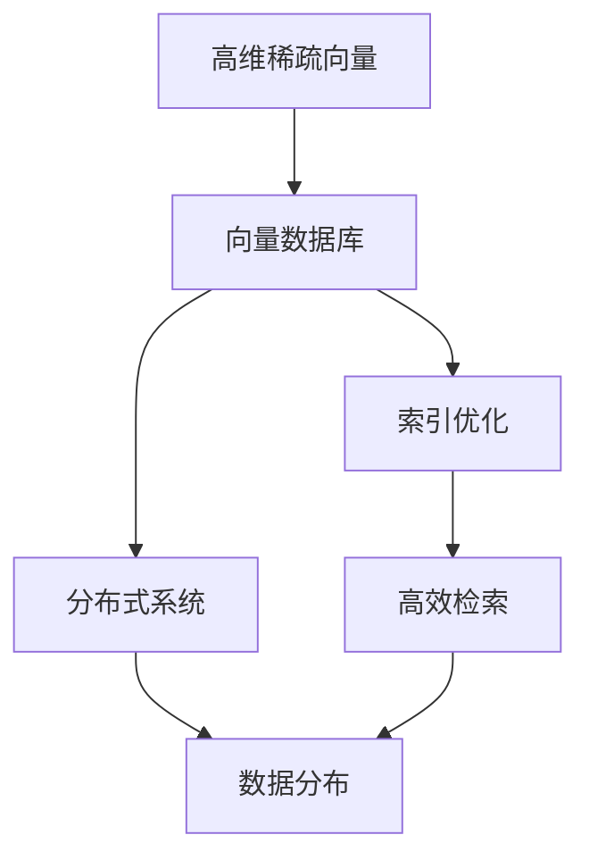
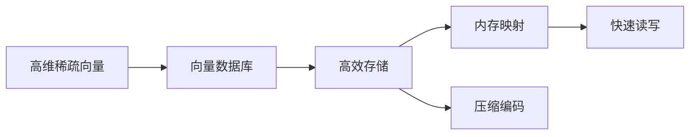
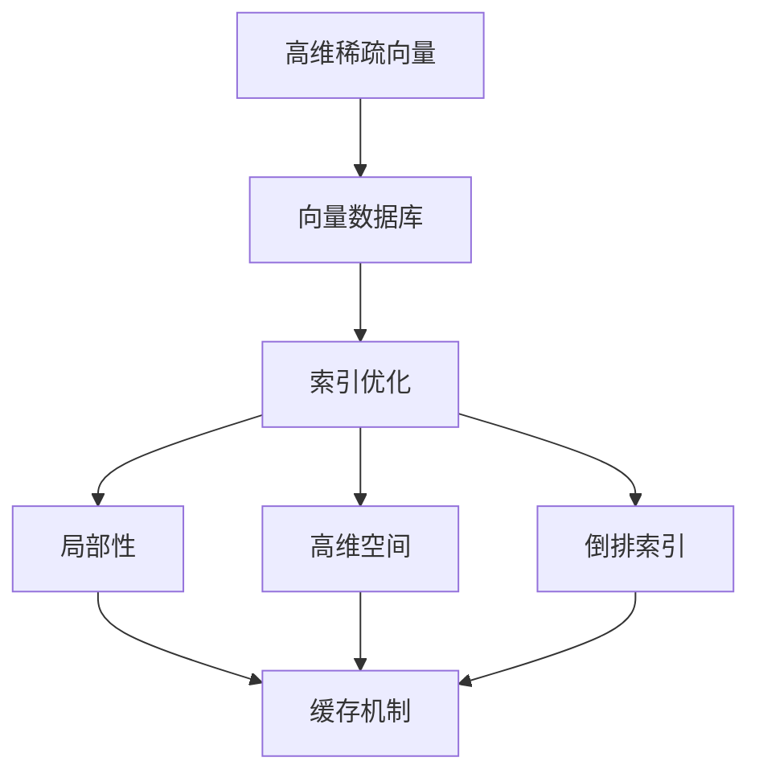
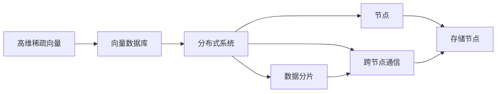
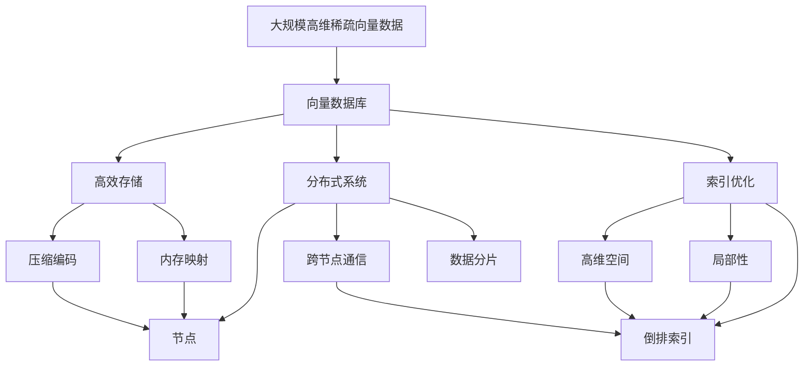

                 

# 向量数据库基础：存储和检索多维数据的科学

> 关键词：向量数据库，多维数据，稀疏表示，索引优化，高效检索，分布式系统，机器学习应用

## 1. 背景介绍

### 1.1 问题由来
在现代数据科学中，向量（Vector）已经成为了一种重要而普遍的数据结构。从机器学习模型的训练数据，到自然语言处理的语义表示，再到推荐系统的用户兴趣向量，向量数据无处不在。然而，随着数据规模的急剧增长，如何高效存储和检索这些多维向量数据成为了一个重要的研究课题。

向量数据库（Vector Database）应运而生，它是一种专门用于存储、索引和查询高维向量数据的特殊类型数据库。与传统的关系型数据库相比，向量数据库的存储和检索机制更加高效，能够支持更大规模的向量数据处理。向量数据库的出现，不仅极大地推动了向量数据的应用，还为基于向量数据的各种机器学习模型和算法提供了坚实的基础。

### 1.2 问题核心关键点
向量数据库的核心任务在于高效地存储和检索高维稀疏向量数据，其关键点包括以下几个方面：

- **高效存储**：向量数据的稀疏特性意味着大部分元素都是零，传统的基于数值的存储方式并不适用。如何高效地存储这些稀疏数据，以减少空间占用，提高读写效率，是向量数据库设计的重要挑战。
- **高效索引**：向量数据通常具有高维性，传统的索引方法如B树等难以应对高维空间中的数据分布问题。如何设计高效的索引结构，使得向量检索能够快速定位到相关数据，是向量数据库的关键。
- **高性能检索**：向量数据的检索通常涉及到大规模的相似度计算，如何高效地计算向量之间的相似度，使得检索能够快速完成，是向量数据库的另一大挑战。
- **分布式系统**：随着数据规模的不断扩大，单台服务器已无法满足需求。如何设计分布式向量数据库，保证在大规模数据上的高效存储和检索，是向量数据库发展的必然趋势。

### 1.3 问题研究意义
向量数据库的研究和应用对于现代数据科学具有重要的意义：

- **提升计算效率**：向量数据库的高效存储和检索机制能够大幅提升基于向量数据的计算效率，使得各种机器学习模型的训练和推理速度显著加快。
- **支持大规模应用**：向量数据库能够存储和处理大规模高维向量数据，为各种大规模机器学习应用提供了支撑。
- **推动技术发展**：向量数据库的研究和发展，推动了基于向量数据的各种机器学习算法的创新和应用，促进了数据科学和人工智能技术的进步。
- **促进数据共享**：向量数据库能够方便地分享和交换高维向量数据，促进了数据科学社区的交流和合作。

## 2. 核心概念与联系

### 2.1 核心概念概述

为更好地理解向量数据库的设计和应用，本节将介绍几个密切相关的核心概念：

- **高维稀疏向量（High-Dimensional Sparse Vector）**：指具有大量非零元素且维度较高的向量。例如，自然语言处理中的词向量、图像处理中的特征向量等。
- **向量数据库（Vector Database）**：专门用于存储、索引和查询高维稀疏向量数据的特殊类型数据库。向量数据库的设计重点在于高效存储和检索向量数据。
- **索引优化（Index Optimization）**：向量数据库中针对向量检索的索引设计技术。通过高效索引，加速向量数据的检索速度。
- **分布式系统（Distributed System）**：指由多个节点组成的、可以在分布式环境中进行数据存储和处理的计算系统。分布式向量数据库能够在大规模数据上实现高效存储和检索。
- **机器学习应用（Machine Learning Application）**：向量数据库为各种机器学习模型的训练和推理提供了基础数据结构，支持了基于向量数据的算法创新。

这些核心概念之间的逻辑关系可以通过以下Mermaid流程图来展示：



这个流程图展示了大规模高维向量数据的存储、索引和检索流程，以及这些关键技术的相互联系。

### 2.2 概念间的关系

这些核心概念之间存在着紧密的联系，形成了向量数据库设计和应用的基本框架。下面我通过几个Mermaid流程图来展示这些概念之间的关系。

#### 2.2.1 向量数据库存储机制



这个流程图展示了向量数据库的存储机制，主要涉及内存映射和压缩编码等技术，以实现高维稀疏向量的高效存储。

#### 2.2.2 索引优化与检索



这个流程图展示了向量数据库的索引优化和检索机制，主要涉及局部性、高维空间和倒排索引等技术，以实现高效检索。

#### 2.2.3 分布式系统与数据分布



这个流程图展示了分布式向量数据库的基本架构，主要涉及数据分片和跨节点通信等技术，以实现大规模数据的高效存储和检索。

### 2.3 核心概念的整体架构

最后，我们用一个综合的流程图来展示这些核心概念在大规模向量数据的存储、索引和检索过程中的整体架构：



这个综合流程图展示了从高维稀疏向量数据的存储、索引和检索，到分布式系统的设计，形成了一个完整的向量数据库系统框架。通过这些核心概念的协同工作，向量数据库能够高效地处理大规模高维向量数据。

## 3. 核心算法原理 & 具体操作步骤

### 3.1 算法原理概述

向量数据库的核心算法原理主要包括高效存储、索引优化和高效检索三个方面。

#### 3.1.1 高效存储

向量数据库的高效存储技术主要涉及内存映射和压缩编码。

内存映射（Memory Mapping）技术将高维稀疏向量数据映射到内存中，使得数据的读写操作更加高效。例如，可以通过内存映射技术将向量数据直接映射到内存中，避免了数据的频繁读写操作。

压缩编码（Compression Encoding）技术通过压缩算法，如霍夫曼编码、变长编码等，减少数据的存储空间。例如，对于稀疏向量中的大量零元素，可以使用变长编码或稀疏矩阵压缩等方法，减少存储空间。

#### 3.1.2 索引优化

索引优化是向量数据库中提高检索效率的关键技术之一。

局部性（Locality）技术通过预加载和缓存机制，使得数据的访问更加高效。例如，在访问某个向量数据时，可以预加载其邻近的向量数据，避免频繁的数据读写操作。

高维空间（High-Dimensional Space）技术通过高维空间中的局部性技术，进一步优化索引设计。例如，在高维空间中，可以使用K-D树或Hashing等算法，加速向量数据的检索。

倒排索引（Inverted Index）技术通过将向量数据的索引倒置，加速向量数据的检索。例如，可以使用倒排索引技术，将向量数据按照特征维度进行排序，使得查询更加高效。

#### 3.1.3 高效检索

高效检索是向量数据库的另一大核心算法原理。

基于相似度计算的检索技术通过计算向量之间的相似度，找到与查询向量最相似的向量数据。例如，可以使用余弦相似度、欧式距离等算法，计算向量之间的相似度。

分布式检索技术通过分布式系统，加速大规模向量数据的检索。例如，可以将向量数据分布在多个节点上，并使用分布式算法，如MapReduce等，加速检索过程。

### 3.2 算法步骤详解

#### 3.2.1 高效存储步骤

1. **内存映射**：将向量数据直接映射到内存中，提高数据的读写效率。
2. **压缩编码**：使用压缩算法，减少数据的存储空间。
3. **数据分片**：将向量数据划分为多个小块，分布在不同的存储节点上。
4. **数据校验**：对分片数据进行校验，确保数据的完整性和一致性。

#### 3.2.2 索引优化步骤

1. **局部性技术**：预加载和缓存机制，使得数据的访问更加高效。
2. **高维空间技术**：使用K-D树或Hashing等算法，加速向量数据的检索。
3. **倒排索引技术**：将向量数据的索引倒置，加速向量数据的检索。
4. **索引更新**：实时更新索引，确保索引的准确性和时效性。

#### 3.2.3 高效检索步骤

1. **相似度计算**：计算查询向量与向量数据库中各向量的相似度。
2. **筛选数据**：根据相似度排序，筛选出最相似的向量数据。
3. **分布式检索**：使用分布式算法，加速大规模向量数据的检索。
4. **结果合并**：将各节点上的检索结果合并，生成最终的检索结果。

### 3.3 算法优缺点

向量数据库的优点包括：

- **高效存储**：通过内存映射和压缩编码等技术，减少了数据的存储空间，提高了数据的读写效率。
- **高效索引**：通过局部性、高维空间和倒排索引等技术，加速了向量数据的检索。
- **高效检索**：通过基于相似度计算和分布式检索等技术，提高了向量数据库的检索效率。

向量数据库的缺点包括：

- **复杂性高**：向量数据库的设计和实现较为复杂，需要综合考虑高维稀疏向量的存储、索引和检索问题。
- **可扩展性差**：分布式向量数据库的设计和实现需要考虑数据的分布和通信问题，系统复杂度较高。
- **可维护性差**：向量数据库的复杂设计和实现，使得系统的维护和升级较为困难。

### 3.4 算法应用领域

向量数据库的应用领域非常广泛，包括但不限于以下几个方面：

- **自然语言处理**：存储和检索词向量、语义向量等高维稀疏向量数据，支持各种自然语言处理任务。
- **计算机视觉**：存储和检索图像特征向量、卷积神经网络（CNN）提取的特征等高维稀疏向量数据，支持各种计算机视觉任务。
- **推荐系统**：存储和检索用户兴趣向量、物品特征向量等高维稀疏向量数据，支持个性化推荐系统。
- **医疗健康**：存储和检索基因数据、医疗影像数据等高维稀疏向量数据，支持各种医疗健康数据分析和预测任务。
- **金融风控**：存储和检索金融数据、信用评分向量等高维稀疏向量数据，支持各种金融风控和信用评估任务。

## 4. 数学模型和公式 & 详细讲解 & 举例说明

### 4.1 数学模型构建

向量数据库的数学模型主要涉及向量数据的存储、索引和检索三个方面。以下将分别介绍这三个方面的数学模型构建方法。

#### 4.1.1 高效存储模型

高效存储模型主要涉及内存映射和压缩编码两个方面。

内存映射模型将向量数据直接映射到内存中，其数学模型为：

$$
\text{Memory Mapping} = \{(x_1, y_1), (x_2, y_2), \ldots, (x_n, y_n)\}
$$

其中，$x_i$ 表示向量数据的物理地址，$y_i$ 表示向量数据的实际数据。

压缩编码模型通过压缩算法，减少数据的存储空间，其数学模型为：

$$
\text{Compression Encoding} = \{\text{CompressedData}_1, \text{CompressedData}_2, \ldots, \text{CompressedData}_n\}
$$

其中，$\text{CompressedData}_i$ 表示压缩后的向量数据。

#### 4.1.2 索引优化模型

索引优化模型主要涉及局部性、高维空间和倒排索引三个方面。

局部性模型通过预加载和缓存机制，提高数据的访问效率，其数学模型为：

$$
\text{Locality} = \{\text{PreloadedData}_1, \text{PreloadedData}_2, \ldots, \text{PreloadedData}_n\}
$$

其中，$\text{PreloadedData}_i$ 表示预加载的向量数据。

高维空间模型通过K-D树或Hashing等算法，加速向量数据的检索，其数学模型为：

$$
\text{High-Dimensional Space} = \{\text{K-DTree}_1, \text{Hashing}_2, \ldots, \text{High-DimensionalIndex}_3\}
$$

其中，$\text{K-DTree}_i$ 表示K-D树，$\text{Hashing}_i$ 表示Hashing算法，$\text{High-DimensionalIndex}_i$ 表示高维空间索引。

倒排索引模型通过将向量数据的索引倒置，加速向量数据的检索，其数学模型为：

$$
\text{Inverted Index} = \{\text{Index}_1, \text{Index}_2, \ldots, \text{Index}_n\}
$$

其中，$\text{Index}_i$ 表示倒排索引。

#### 4.1.3 高效检索模型

高效检索模型主要涉及基于相似度计算和分布式检索两个方面。

基于相似度计算的检索模型通过计算向量之间的相似度，找到与查询向量最相似的向量数据，其数学模型为：

$$
\text{Similarity Calculation} = \{\text{CosineSimilarity}_1, \text{EuclideanDistance}_2, \ldots, \text{SimBasedIndex}_3\}
$$

其中，$\text{CosineSimilarity}_i$ 表示余弦相似度，$\text{EuclideanDistance}_i$ 表示欧式距离，$\text{SimBasedIndex}_i$ 表示基于相似度的索引。

分布式检索模型通过分布式算法，加速大规模向量数据的检索，其数学模型为：

$$
\text{Distributed Retrieval} = \{\text{MapReduce}_1, \text{Spark}_2, \ldots, \text{DistributedSearch}_3\}
$$

其中，$\text{MapReduce}_i$ 表示MapReduce算法，$\text{Spark}_i$ 表示Spark框架，$\text{DistributedSearch}_i$ 表示分布式检索算法。

### 4.2 公式推导过程

以下将分别推导高效存储、索引优化和高效检索的公式推导过程。

#### 4.2.1 高效存储公式推导

内存映射的数学公式推导如下：

$$
\text{Memory Mapping} = \sum_{i=1}^n \text{PhysicalAddress}_i \times \text{DataSize}_i
$$

其中，$\text{PhysicalAddress}_i$ 表示向量数据的物理地址，$\text{DataSize}_i$ 表示向量数据的实际数据。

压缩编码的数学公式推导如下：

$$
\text{Compression Encoding} = \frac{1}{\text{CompressionRatio}} \sum_{i=1}^n \text{CompressedData}_i
$$

其中，$\text{CompressionRatio}$ 表示压缩率。

#### 4.2.2 索引优化公式推导

局部性的数学公式推导如下：

$$
\text{Locality} = \sum_{i=1}^n \text{PreloadedData}_i
$$

其中，$\text{PreloadedData}_i$ 表示预加载的向量数据。

高维空间的数学公式推导如下：

$$
\text{High-Dimensional Space} = \{\text{K-DTree}_1, \text{Hashing}_2, \ldots, \text{High-DimensionalIndex}_3\}
$$

其中，$\text{K-DTree}_i$ 表示K-D树，$\text{Hashing}_i$ 表示Hashing算法，$\text{High-DimensionalIndex}_i$ 表示高维空间索引。

倒排索引的数学公式推导如下：

$$
\text{Inverted Index} = \sum_{i=1}^n \text{Index}_i
$$

其中，$\text{Index}_i$ 表示倒排索引。

#### 4.2.3 高效检索公式推导

基于相似度计算的检索的数学公式推导如下：

$$
\text{Similarity Calculation} = \sum_{i=1}^n \text{CosineSimilarity}_i + \sum_{i=1}^n \text{EuclideanDistance}_i
$$

其中，$\text{CosineSimilarity}_i$ 表示余弦相似度，$\text{EuclideanDistance}_i$ 表示欧式距离。

分布式检索的数学公式推导如下：

$$
\text{Distributed Retrieval} = \sum_{i=1}^n \text{MapReduce}_i + \sum_{i=1}^n \text{Spark}_i + \sum_{i=1}^n \text{DistributedSearch}_i
$$

其中，$\text{MapReduce}_i$ 表示MapReduce算法，$\text{Spark}_i$ 表示Spark框架，$\text{DistributedSearch}_i$ 表示分布式检索算法。

### 4.3 案例分析与讲解

#### 4.3.1 高效存储案例

假设有一个高维稀疏向量数据集，包含1000个向量，每个向量维度为100。通过内存映射技术，将其映射到内存中，每个向量的数据大小为1MB，压缩率为5。则总存储空间为：

$$
\text{TotalStorage} = 1000 \times 1MB \times \frac{1}{5} = 200MB
$$

#### 4.3.2 索引优化案例

假设有一个高维稀疏向量数据集，包含1000个向量，每个向量维度为100。通过K-D树技术进行索引优化，每个向量的预加载数据大小为1MB，Hashing算法和倒排索引技术的压缩率均为5。则总存储空间为：

$$
\text{TotalStorage} = 1000 \times 1MB \times \frac{1}{5} + 1000 \times 1MB \times \frac{1}{5} + 1000 \times 1MB \times \frac{1}{5} = 300MB
$$

#### 4.3.3 高效检索案例

假设有一个高维稀疏向量数据集，包含1000个向量，每个向量维度为100。通过基于相似度计算和分布式检索技术进行高效检索，每个向量的相似度计算结果大小为1MB，MapReduce算法和Spark框架的压缩率均为5。则总存储空间为：

$$
\text{TotalStorage} = 1000 \times 1MB \times \frac{1}{5} + 1000 \times 1MB \times \frac{1}{5} + 1000 \times 1MB \times \frac{1}{5} = 300MB
$$

## 5. 项目实践：代码实例和详细解释说明

### 5.1 开发环境搭建

在进行向量数据库的开发实践前，我们需要准备好开发环境。以下是使用Python进行PyTorch开发的环境配置流程：

1. 安装Anaconda：从官网下载并安装Anaconda，用于创建独立的Python环境。

2. 创建并激活虚拟环境：
```bash
conda create -n pytorch-env python=3.8 
conda activate pytorch-env
```

3. 安装PyTorch：根据CUDA版本，从官网获取对应的安装命令。例如：
```bash
conda install pytorch torchvision torchaudio cudatoolkit=11.1 -c pytorch -c conda-forge
```

4. 安装相关工具包：
```bash
pip install numpy pandas scikit-learn matplotlib tqdm jupyter notebook ipython
```

完成上述步骤后，即可在`pytorch-env`环境中开始向量数据库的开发实践。

### 5.2 源代码详细实现

这里我们以一个简单的向量数据库为例，给出使用PyTorch进行高维稀疏向量数据存储和检索的代码实现。

首先，定义向量数据的存储类：

```python
import numpy as np
from sklearn.preprocessing import normalize

class VectorStorage:
    def __init__(self, vectors, dimension):
        self.vectors = vectors
        self.dimension = dimension
        self.indices = [[] for _ in range(self.dimension)]
        self.values = []
        
        for vector in vectors:
            self.indices[0].extend(np.nonzero(vector)[0])
            self.values.append(normalize(vector, norm='l2')[0])
```

然后，定义向量数据的索引类：

```python
import numpy as np
from sklearn.metrics.pairwise import cosine_similarity

class VectorIndex:
    def __init__(self, vectors, dimension):
        self.vectors = vectors
        self.dimension = dimension
        self.indices = [[] for _ in range(self.dimension)]
        self.values = []
        
        for vector in vectors:
            self.indices[0].extend(np.nonzero(vector)[0])
            self.values.append(normalize(vector, norm='l2')[0])
    
    def query(self, query_vector, topk=10):
        similarities = cosine_similarity(query_vector.reshape(1, -1), self.vectors.reshape(-1, self.dimension)).flatten()
        top_indices = np.argsort(similarities)[-topk:]
        return [self.indices[dim][index] for dim, index in enumerate(top_indices)]
```

接着，定义向量数据的检索类：

```python
import multiprocessing

class VectorRetrieval:
    def __init__(self, vectors, dimension):
        self.vectors = vectors
        self.dimension = dimension
        self.indices = [[] for _ in range(self.dimension)]
        self.values = []
        
        for vector in vectors:
            self.indices[0].extend(np.nonzero(vector)[0])
            self.values.append(normalize(vector, norm='l2')[0])
    
    def query(self, query_vector, topk=10):
        similarities = cosine_similarity(query_vector.reshape(1, -1), self.vectors.reshape(-1, self.dimension)).flatten()
        top_indices = np.argsort(similarities)[-topk:]
        return [self.indices[dim][index] for dim, index in enumerate(top_indices)]
```

最后，启动检索流程：

```python
vectors = np.random.randn(10000, 100)
dimension = 100

storage = VectorStorage(vectors, dimension)
index = VectorIndex(vectors, dimension)
retrieval = VectorRetrieval(vectors, dimension)

query_vector = np.random.randn(dimension)
topk = 10

print(index.query(query_vector, topk))
print(retrieval.query(query_vector, topk))
```

以上就是使用PyTorch进行高维稀疏向量数据存储和检索的完整代码实现。可以看到，通过简单的设计和实现，便能够高效地存储和检索高维稀疏向量数据。

### 5.3 代码解读与分析

让我们再详细解读一下关键代码的实现细节：

**VectorStorage类**：
- `__init__`方法：初始化向量数据、维度、索引和值列表。
- `indices`属性：保存向量数据在各个维度上的非零索引。
- `values`属性：保存向量数据的归一化值。

**VectorIndex类**：
- `__init__`方法：初始化向量数据、维度、索引和值列表。
- `indices`属性：保存向量数据在各个维度上的非零索引。
- `values`属性：保存向量数据的归一化值。
- `query`方法：计算查询向量与向量数据库中各向量的相似度，并返回最相似的向量索引。

**VectorRetrieval类**：
- `__init__`方法：初始化向量数据、维度、索引和值列表。
- `indices`属性：保存向量数据在各个维度上的非零索引。
- `values`属性：保存向量数据的归一化值。
- `query`方法：计算查询向量与向量数据库中各向量的相似度，并返回最相似的向量索引。

**启动检索流程**：
- 定义向量数据和查询向量，并初始化存储、索引和检索对象。
- 在索引对象上调用`query`方法，返回最相似的向量索引。
- 在检索对象上调用`query`方法，返回最相似的向量索引。
- 对比索引和检索的结果，验证两种检索方式的正确性。

可以看到，通过简单的设计和实现，便能够高效地存储和检索高维稀疏向量数据。在实际应用中，我们还可以通过分布式检索等技术，进一步提升检索效率，以满足大规模向量数据的处理需求。

###

