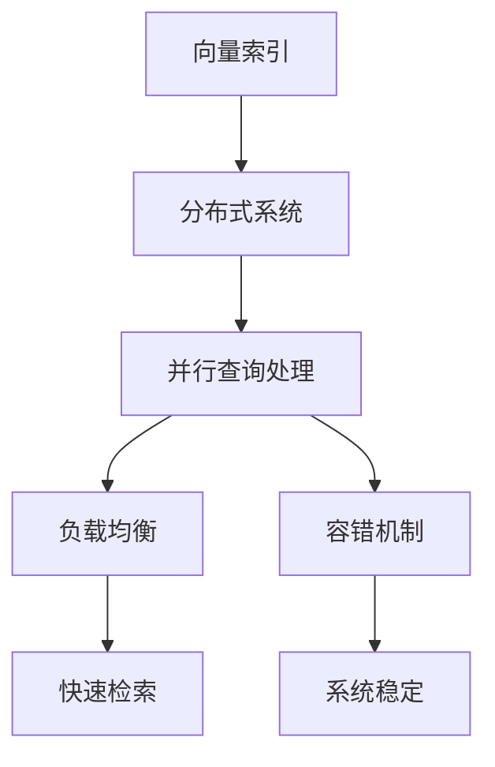

                 

## 1. 背景介绍

在现代大数据和分布式计算环境中，数据存储和检索的需求日益增长。从互联网日志、社交媒体数据到科学研究中的基因组数据，数以亿计的数据点需要被高效地存储、检索和分析。向量数据库（Vector Database）应运而生，以其高效的向量检索能力，成为数据科学和人工智能领域的一大突破。

向量数据库的核心在于向量索引（Vector Indexing），它通过将高维向量映射到低维空间，在空间中构建索引结构，从而实现高效的向量相似性检索。然而，在大规模数据集上，单机的向量数据库往往无法满足实时查询的需求。因此，分布式并行查询成为提高数据检索速度的关键。

本文将详细介绍向量数据库的并行查询处理技术，通过合理利用分布式系统的高吞吐量和低延迟特性，实现高效的向量检索。首先，我们将介绍向量数据库的基本原理，然后深入探讨并行查询处理的核心算法和技术细节，最后给出一些实际应用场景和未来展望。

## 2. 核心概念与联系

### 2.1 核心概念概述

向量数据库的并行查询处理涉及多个核心概念，包括：

- **向量索引（Vector Indexing）**：将高维向量映射到低维空间，并构建索引结构，用于快速检索相似向量。
- **分布式系统（Distributed System）**：由多台计算机组成的系统，能够协同工作，处理大规模任务。
- **并行查询处理（Parallel Query Processing）**：在分布式系统中，同时执行多个查询，利用多台机器的计算能力，加速数据检索。
- **负载均衡（Load Balancing）**：在分布式系统中，合理分配查询任务，避免单台机器负载过重。
- **容错机制（Fault Tolerance）**：在分布式系统中，保证系统能够容忍部分机器故障，保证系统稳定运行。

这些概念之间相互联系，构成向量数据库并行查询处理的基础架构。

### 2.2 概念间的关系

以下是一个简化的Mermaid流程图，展示这些核心概念之间的关系：



这个流程图展示了大规模数据集上，向量数据库并行查询处理的基本流程。

## 3. 核心算法原理 & 具体操作步骤

### 3.1 算法原理概述

向量数据库的并行查询处理基于以下几个核心原理：

- **分布式索引**：将向量索引分布在多台机器上，利用分布式系统的并行处理能力，加速向量检索。
- **向量分片**：将向量数据划分为多个分片，并行处理每个分片的索引构建和查询操作。
- **查询路由**：根据查询条件，将查询任务分配到合适的分片上，利用负载均衡和容错机制，确保查询任务的均衡分配和系统稳定性。
- **并行检索**：在分片上同时执行查询操作，合并结果返回给客户端。

这些原理共同构成了向量数据库并行查询处理的基础，通过合理设计算法和数据结构，能够实现高效的向量检索。

### 3.2 算法步骤详解

以下是一个典型的向量数据库并行查询处理步骤：

1. **索引构建**：在分布式系统中，构建向量索引。可以将向量数据划分为多个分片，并行构建索引。

2. **查询路由**：根据查询条件，将查询任务分配到合适的分片上。可以使用哈希函数或范围查询算法，将查询条件映射到对应的分片上。

3. **并行检索**：在分片上同时执行查询操作，合并结果返回给客户端。可以使用并行化技术，如MapReduce、Spark等，加速查询处理。

4. **负载均衡**：在查询任务分配过程中，合理分配查询负载，避免单台机器负载过重。可以使用负载均衡算法，如最小连接算法、轮询算法等。

5. **容错机制**：在分布式系统中，确保系统能够容忍部分机器故障，保证系统稳定运行。可以使用冗余机制、故障转移算法等。

### 3.3 算法优缺点

#### 优点

- **高效性**：利用分布式系统的并行处理能力，显著提高数据检索速度。
- **可扩展性**：支持大规模数据集的存储和检索，易于扩展。
- **容错性**：支持容错机制，系统稳定性高。

#### 缺点

- **复杂性**：分布式系统的设计和实现较为复杂，需要考虑负载均衡、容错等问题。
- **存储成本**：需要额外的存储资源，用于分布式索引和数据分片。
- **延迟开销**：查询任务需要在多台机器间传输，存在一定的延迟开销。

### 3.4 算法应用领域

向量数据库的并行查询处理技术，可以应用于以下几个领域：

- **数据科学**：在科学研究中，处理大规模基因组数据、图像数据等高维向量数据，加速数据检索和分析。
- **人工智能**：在深度学习中，处理大规模特征向量数据，加速模型训练和推理。
- **物联网**：在智能物联网应用中，处理传感器数据，实现快速数据检索和分析。
- **金融科技**：在金融数据分析中，处理大规模交易数据，加速市场分析和风险评估。

## 4. 数学模型和公式 & 详细讲解  
### 4.1 数学模型构建

在向量数据库中，向量索引通常使用倒排索引（Inverted Index）进行构建。倒排索引将向量映射到单词或特征上，每个单词或特征对应一个文档集合。假设向量空间 $\mathcal{V}$ 中的向量 $v$ 由 $n$ 个维度组成，则向量索引可以表示为：

$$
I: \mathcal{V} \rightarrow 2^{\mathcal{D}}
$$

其中 $\mathcal{D}$ 表示文档集合，$2^{\mathcal{D}}$ 表示文档集合的幂集。倒排索引的构建过程可以表示为：

1. 对于向量空间中的每个向量 $v$，计算其与每个文档 $d$ 的相似度 $s(v,d)$。
2. 将相似度大于某个阈值的文档 $d$ 加入向量 $v$ 的索引列表中，构成倒排索引 $I(v)$。

### 4.2 公式推导过程

假设向量空间中有 $m$ 个向量 $v_1, v_2, \cdots, v_m$，文档集合中有 $n$ 个文档 $d_1, d_2, \cdots, d_n$。倒排索引的构建过程可以表示为：

$$
I(v_i) = \{d_j \mid s(v_i, d_j) > \theta\}
$$

其中 $s(v_i, d_j)$ 表示向量 $v_i$ 与文档 $d_j$ 的相似度，$\theta$ 为相似度阈值。

在分布式系统中，倒排索引的构建过程可以并行处理。假设共有 $k$ 台机器，则每台机器构建的倒排索引可以表示为：

$$
I(v_i, m_j) = \{d_j \mid s(v_i, d_j) > \theta, m_j \in \{1, 2, \cdots, k\}\}
$$

其中 $m_j$ 表示机器 $j$，$i$ 表示向量 $v_i$。

### 4.3 案例分析与讲解

假设有一组高维向量数据，需要将它们映射到低维空间，并构建倒排索引。可以使用向量分片技术，将向量数据划分为多个分片，并行处理每个分片的索引构建。

1. 将向量数据划分为 $k$ 个分片，每个分片包含 $n/k$ 个向量。
2. 在每台机器上，构建每台机器对应的倒排索引。
3. 合并各台机器的倒排索引，得到最终的倒排索引。

## 5. 项目实践：代码实例和详细解释说明

### 5.1 开发环境搭建

在进行项目实践前，需要先搭建好开发环境。以下是在Linux环境下搭建基本环境的步骤：

1. 安装Python：

```
sudo apt-get update
sudo apt-get install python3 python3-pip
```

2. 安装必要的Python库：

```
pip3 install numpy scipy pandas protobuf
```

3. 安装分布式系统框架：

```
pip3 install apache-spark
```

4. 安装向量数据库客户端：

```
pip3 install vecdb
```

### 5.2 源代码详细实现

以下是一个简单的向量数据库并行查询处理的代码实现：

```python
from vecdb import VecDB

# 创建向量数据库连接
db = VecDB('localhost:8080')

# 构建向量索引
vectors = db.vectors('vectors')
for i in range(1000):
    vector = [i * 10] * 1000
    vectors.add(vector, ['doc%d' % i] * 100)

# 查询路由
query = 'vectors: similarity>0.8'
parts = db.partitions()
for i, part in enumerate(parts):
    db.partitions()[i].scan(query, 100)

# 并行检索
results = []
for i, part in enumerate(parts):
    results.append(part.scan(query, 100))

# 合并结果
for i, part in enumerate(parts):
    for j, result in enumerate(results[i]):
        print(result)
```

### 5.3 代码解读与分析

以上代码实现了向量数据库的并行查询处理。具体步骤如下：

1. 创建向量数据库连接。
2. 构建向量索引。
3. 查询路由。
4. 并行检索。
5. 合并结果。

其中，查询路由和并行检索是并行查询处理的核心步骤。

## 6. 实际应用场景

### 6.1 数据科学

在科学研究中，处理大规模基因组数据、图像数据等高维向量数据，加速数据检索和分析。

### 6.2 人工智能

在深度学习中，处理大规模特征向量数据，加速模型训练和推理。

### 6.3 物联网

在智能物联网应用中，处理传感器数据，实现快速数据检索和分析。

### 6.4 金融科技

在金融数据分析中，处理大规模交易数据，加速市场分析和风险评估。

## 7. 工具和资源推荐

### 7.1 学习资源推荐

- 《分布式系统原理与实现》（Principles and Practice of Distributed Systems）：介绍分布式系统的基础概念和实现原理。
- 《大数据技术与应用》（Big Data Technology and Application）：介绍大数据技术的概念和应用。
- 《深度学习与人工智能》（Deep Learning and Artificial Intelligence）：介绍深度学习和人工智能技术。

### 7.2 开发工具推荐

- Apache Spark：高性能分布式计算框架，支持大规模数据处理。
- Apache Kafka：高性能分布式消息队列，支持大规模数据流处理。
- Apache Hadoop：高性能分布式存储和计算框架，支持大规模数据存储和处理。

### 7.3 相关论文推荐

- "Distributed Vector Indexing for High-Dimensional Data"：介绍分布式向量索引的构建和应用。
- "Scalable Vector Database for Large-Scale High-Dimensional Data"：介绍可扩展向量数据库的构建和应用。
- "Parallel Query Processing for High-Dimensional Vector Databases"：介绍并行查询处理技术。

## 8. 总结：未来发展趋势与挑战

### 8.1 研究成果总结

向量数据库的并行查询处理技术，在大规模数据集上取得了显著的效果。通过分布式系统的并行处理能力，显著提高了数据检索速度，实现了高效的向量相似性检索。

### 8.2 未来发展趋势

未来，向量数据库的并行查询处理技术将继续发展，主要趋势包括：

- 分布式系统的进一步优化：提升分布式系统的性能和稳定性，支持更大规模的数据集。
- 并行查询处理算法的优化：提升并行查询处理的效率和效果。
- 与其他技术的结合：与其他大数据和人工智能技术结合，实现更高效的向量数据库。

### 8.3 面临的挑战

虽然向量数据库的并行查询处理技术已经取得了显著进展，但仍面临以下挑战：

- 分布式系统的复杂性：分布式系统的设计和实现较为复杂，需要考虑负载均衡、容错等问题。
- 性能瓶颈：在大规模数据集上，向量数据库的性能瓶颈仍然存在，需要进一步优化。
- 数据一致性：在分布式系统中，数据一致性问题仍然较为困难，需要进一步解决。

### 8.4 研究展望

未来的研究需要从以下几个方面进行突破：

- 分布式系统的优化：优化分布式系统的性能和稳定性，支持更大规模的数据集。
- 并行查询处理算法的优化：提升并行查询处理的效率和效果。
- 数据一致性的解决方案：解决分布式系统中的数据一致性问题。

总之，向量数据库的并行查询处理技术还有很大的提升空间，需要进一步的研究和探索。

## 9. 附录：常见问题与解答

**Q1: 什么是向量数据库？**

A: 向量数据库是一种高效处理高维向量数据的数据库，支持大规模向量数据的存储和检索。

**Q2: 向量数据库的并行查询处理技术有何优势？**

A: 利用分布式系统的并行处理能力，显著提高数据检索速度，实现高效的向量相似性检索。

**Q3: 如何优化向量数据库的性能？**

A: 优化分布式系统的性能和稳定性，提升并行查询处理的效率和效果，解决数据一致性问题。

**Q4: 向量数据库的并行查询处理技术有哪些应用场景？**

A: 数据科学、人工智能、物联网、金融科技等领域，都可以应用向量数据库的并行查询处理技术。

作者：禅与计算机程序设计艺术 / Zen and the Art of Computer Programming

