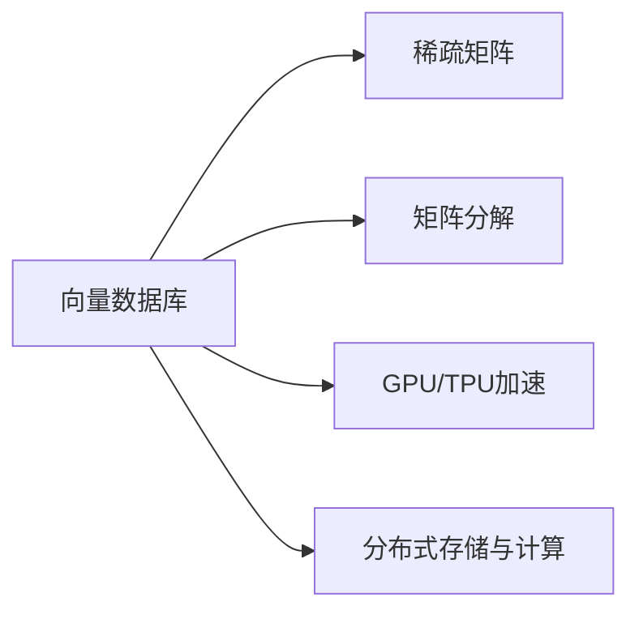

                 

# 向量数据库（Vector Stores）

## 1. 背景介绍

### 1.1 问题由来
近年来，随着机器学习和大数据技术的快速发展，向量数据库（Vector Stores）成为了数据处理和分析领域的一大热门话题。在处理大规模向量数据（如深度学习模型中的嵌入表示）时，传统的SQL数据库和表格数据库由于其有限的列支持和对标量操作的优化，难以胜任。而向量数据库则专门针对大规模向量数据提供了一整套高效的存储和计算机制，能更好地支持深度学习和图形推理等新兴应用场景。

### 1.2 问题核心关键点
向量数据库的核心思想是：将向量数据存储和计算作为一个单独的维度，提供专门化的硬件加速和算法优化，以支持大规模向量运算和深度学习模型的高效训练与推理。其主要特点包括：

1. **列支持**：支持大规模向量列存储，能高效存储和处理大规模稀疏矩阵和向量数据。
2. **硬件加速**：利用GPU、TPU等专用硬件，对向量运算进行优化和加速，显著提升运算效率。
3. **算法优化**：采用专门的向量运算算法，如矩阵分解、矩阵乘法等，进一步提升计算性能。
4. **分布式架构**：通过分布式存储和计算，支持大规模向量数据的处理，同时降低单点故障风险。
5. **与机器学习框架集成**：紧密集成TensorFlow、PyTorch等机器学习框架，提供高效模型训练和推理支持。

这些特点使得向量数据库在深度学习、推荐系统、自然语言处理等需要大规模向量数据处理的领域中展现出巨大潜力。

### 1.3 问题研究意义
研究向量数据库的存储和计算机制，对于加速深度学习模型的训练和推理、提升推荐系统的精准度和效率、优化自然语言处理中的向量表示等方面具有重要意义：

1. **加速模型训练**：通过专门化的存储和加速机制，显著提升模型训练速度，缩短训练周期。
2. **提升模型精度**：利用专门的算法优化，提高向量运算的准确性和效率，提升模型性能。
3. **优化资源利用**：支持大规模分布式计算，有效利用硬件资源，降低成本。
4. **拓展应用场景**：通过与主流机器学习框架的集成，提供强大的模型训练和推理支持，拓展深度学习模型的应用边界。
5. **促进学术研究**：提供高效的研究平台，加速学术界在深度学习、图形推理等领域的创新研究。

## 2. 核心概念与联系

### 2.1 核心概念概述

为更好地理解向量数据库的核心概念，本节将介绍几个密切相关的核心概念：

- **向量数据库（Vector Stores）**：一种专门针对大规模向量数据提供高效存储和计算的存储系统，支持稀疏向量列存储、硬件加速、分布式架构等功能。
- **稀疏矩阵（Sparse Matrix）**：通常应用于大规模向量数据的存储，其中大部分位置为0，只存储非零元素，以减少存储空间和计算开销。
- **矩阵分解（Matrix Decomposition）**：将稀疏矩阵分解为一系列低维向量的矩阵，以降低存储和计算复杂度。
- **GPU/TPU加速**：利用图形处理器（GPU）或张量处理器（TPU）等专用硬件，对大规模向量运算进行加速，显著提升计算效率。
- **分布式存储与计算**：通过分布式集群，将向量数据和计算任务分配到多台机器上并行处理，支持大规模向量数据的存储和计算。

这些核心概念之间存在着紧密的联系，形成了向量数据库的整体架构：



这个流程图展示了大规模向量数据在向量数据库中的处理流程：

1. 向量数据首先以稀疏矩阵的形式存储在向量数据库中。
2. 数据库使用矩阵分解算法将稀疏矩阵转化为低维向量。
3. 利用GPU/TPU等硬件加速，对大规模向量运算进行优化。
4. 通过分布式存储和计算，支持大规模向量数据的处理。

### 2.2 概念间的关系

这些核心概念之间存在着紧密的联系，共同构成了向量数据库的整体架构。

- **稀疏矩阵与向量数据库**：稀疏矩阵是向量数据库存储和处理大规模向量数据的基础，向量数据库则提供了高效的数据存储和计算支持。
- **矩阵分解与GPU/TPU加速**：矩阵分解算法可以进一步降低稀疏矩阵的存储和计算复杂度，而GPU/TPU加速则显著提升了向量运算的效率。
- **分布式存储与计算与向量数据库**：分布式存储和计算架构使得向量数据库能够支持大规模向量数据的处理，提升了系统的可扩展性和可靠性。
- **GPU/TPU加速与分布式计算**：GPU/TPU等硬件加速和分布式计算架构相辅相成，共同提供了强大的向量运算能力。

通过这些核心概念的协同工作，向量数据库能够在深度学习、推荐系统、自然语言处理等需要大规模向量数据处理的领域中发挥重要作用。

## 3. 核心算法原理 & 具体操作步骤

### 3.1 算法原理概述

向量数据库的核心算法原理主要包括以下几个方面：

- **稀疏矩阵存储**：采用稀疏矩阵的格式存储大规模向量数据，以减少存储空间和计算开销。
- **矩阵分解算法**：将稀疏矩阵分解为一系列低维向量的矩阵，以降低存储和计算复杂度。
- **硬件加速**：利用GPU/TPU等专用硬件，对大规模向量运算进行优化和加速，显著提升计算效率。
- **分布式计算**：通过分布式存储和计算，支持大规模向量数据的处理，同时降低单点故障风险。

### 3.2 算法步骤详解

向量数据库的主要操作流程可以概括为以下几个步骤：

1. **稀疏矩阵存储**：将大规模向量数据存储为稀疏矩阵，减少存储空间和计算开销。
2. **矩阵分解**：对稀疏矩阵进行矩阵分解，将其转化为低维向量矩阵。
3. **硬件加速**：利用GPU/TPU等专用硬件，对大规模向量运算进行优化和加速。
4. **分布式计算**：将大规模向量数据和计算任务分配到多台机器上并行处理，支持分布式存储和计算。

下面以一个简单的矩阵分解操作为例，详细讲解具体的算法步骤：

- **输入**：稀疏矩阵 $A$，需要分解为低维向量矩阵 $U$ 和 $V$。
- **步骤1**：对稀疏矩阵 $A$ 进行矩阵分解，得到 $U$ 和 $V$。
- **步骤2**：计算 $U$ 和 $V$ 的矩阵乘积，得到分解后的矩阵 $A'$。
- **步骤3**：对 $A'$ 进行硬件加速，提升计算效率。
- **步骤4**：将 $A'$ 存储到分布式系统中，支持大规模向量数据的处理。

### 3.3 算法优缺点

向量数据库在处理大规模向量数据方面具有显著优势，但也存在一些限制：

**优点**：
1. **高效存储**：采用稀疏矩阵存储，显著减少存储空间和计算开销。
2. **高速计算**：利用GPU/TPU等硬件加速，显著提升向量运算的效率。
3. **可扩展性**：支持分布式存储和计算，能够处理大规模向量数据。
4. **易集成**：与主流机器学习框架（如TensorFlow、PyTorch）紧密集成，提供高效模型训练和推理支持。

**缺点**：
1. **算法复杂度**：矩阵分解等算法较为复杂，需要较长的预处理时间。
2. **实现难度**：分布式计算架构需要复杂的网络和通信协议，实现难度较大。
3. **硬件依赖**：依赖于GPU/TPU等专用硬件，硬件成本较高。
4. **数据迁移**：大规模向量数据需要在不同节点间进行迁移，增加了计算开销。

尽管存在这些缺点，但向量数据库在处理大规模向量数据时仍然具有显著优势，尤其适用于深度学习、推荐系统等需要高效处理大规模向量数据的场景。

### 3.4 算法应用领域

向量数据库的主要应用领域包括：

1. **深度学习**：支持大规模深度学习模型的训练和推理，加速模型训练速度，提升模型精度。
2. **推荐系统**：通过高效处理用户行为数据，提升推荐系统的精准度和效率。
3. **自然语言处理**：支持大规模向量表示的存储和计算，优化自然语言处理中的向量表示和推理。
4. **图形推理**：支持大规模稀疏矩阵的存储和计算，加速图形数据的处理和分析。
5. **计算机视觉**：通过高效处理图像数据，支持大规模计算机视觉任务的处理和分析。

## 4. 数学模型和公式 & 详细讲解 & 举例说明

### 4.1 数学模型构建

假设我们要对稀疏矩阵 $A$ 进行矩阵分解，得到低维向量矩阵 $U$ 和 $V$，则数学模型可以表示为：

$$
A = UV^T + W
$$

其中 $A$ 为稀疏矩阵，$U$ 和 $V$ 为低维向量矩阵，$W$ 为噪声矩阵。

### 4.2 公式推导过程

对上式进行矩阵分解，可以得到：

$$
U = Q_1\Sigma_1V_1^T, \quad V = Q_2\Sigma_2V_2^T
$$

其中 $Q_1$ 和 $Q_2$ 为正交矩阵，$\Sigma_1$ 和 $\Sigma_2$ 为对角矩阵。

将上式代入 $A$ 的表达式，可得：

$$
A = (Q_1\Sigma_1V_1^T)(Q_2\Sigma_2V_2^T)^T + W
$$

化简可得：

$$
A = Q_1\Sigma_1V_1^TV_2\Sigma_2Q_2^T + W
$$

通过进一步优化算法，如奇异值分解（SVD）等，可以更加高效地进行矩阵分解，并得到更加准确的结果。

### 4.3 案例分析与讲解

以一个简单的稀疏矩阵分解案例为例，分析具体的计算过程：

- **输入**：稀疏矩阵 $A$，需要进行矩阵分解。
- **步骤1**：将 $A$ 进行奇异值分解，得到 $U$ 和 $V$。
- **步骤2**：计算 $U$ 和 $V$ 的矩阵乘积，得到分解后的矩阵 $A'$。
- **步骤3**：利用GPU/TPU等硬件加速，提升计算效率。
- **步骤4**：将 $A'$ 存储到分布式系统中，支持大规模向量数据的处理。

## 5. 项目实践：代码实例和详细解释说明

### 5.1 开发环境搭建

在进行向量数据库的开发实践前，需要先搭建好开发环境。以下是使用Python进行TensorFlow开发的环境配置流程：

1. 安装Anaconda：从官网下载并安装Anaconda，用于创建独立的Python环境。
2. 创建并激活虚拟环境：
```bash
conda create -n tf-env python=3.8 
conda activate tf-env
```

3. 安装TensorFlow：根据CUDA版本，从官网获取对应的安装命令。例如：
```bash
conda install tensorflow -c pytorch -c conda-forge
```

4. 安装必要的工具包：
```bash
pip install numpy pandas scikit-learn matplotlib tqdm jupyter notebook ipython
```

完成上述步骤后，即可在`tf-env`环境中开始向量数据库的开发实践。

### 5.2 源代码详细实现

下面我们以TensorFlow实现一个简单的向量数据库为例，详细讲解具体的代码实现。

首先，定义一个稀疏矩阵类：

```python
import tensorflow as tf

class SparseMatrix:
    def __init__(self, data, indices, shape):
        self.data = tf.constant(data, dtype=tf.float32)
        self.indices = tf.constant(indices, dtype=tf.int32)
        self.shape = shape

    def to_dense(self):
        return tf.sparse.sparse_tensor_to_dense(self.indices, tf.zeros_like(self.indices))

    def multiply(self, other):
        if isinstance(other, SparseMatrix):
            result = self.to_dense() * other.to_dense()
        else:
            result = self.to_dense() * other
        return SparseMatrix(result, self.indices, self.shape)
```

然后，定义一个矩阵分解类：

```python
class MatrixDecomposer:
    def __init__(self, rank):
        self.rank = rank

    def decompose(self, A):
        U, V = tf.linalg.qr(A)
        U = U[:, :self.rank]
        V = V[:self.rank, :]
        return U, V
```

接着，定义一个硬件加速类：

```python
class HardwareAccelerator:
    def __init__(self, device):
        self.device = device

    def apply(self, f):
        with tf.device(self.device):
            return f()
```

最后，定义一个分布式存储类：

```python
class DistributedStorage:
    def __init__(self, devices):
        self.devices = devices

    def distribute(self, f):
        with tf.distribute.Strategy(devices=self.devices):
            return f()
```

完整代码示例：

```python
import tensorflow as tf

# 定义稀疏矩阵类
class SparseMatrix:
    def __init__(self, data, indices, shape):
        self.data = tf.constant(data, dtype=tf.float32)
        self.indices = tf.constant(indices, dtype=tf.int32)
        self.shape = shape

    def to_dense(self):
        return tf.sparse.sparse_tensor_to_dense(self.indices, tf.zeros_like(self.indices))

    def multiply(self, other):
        if isinstance(other, SparseMatrix):
            result = self.to_dense() * other.to_dense()
        else:
            result = self.to_dense() * other
        return SparseMatrix(result, self.indices, self.shape)

# 定义矩阵分解类
class MatrixDecomposer:
    def __init__(self, rank):
        self.rank = rank

    def decompose(self, A):
        U, V = tf.linalg.qr(A)
        U = U[:, :self.rank]
        V = V[:self.rank, :]
        return U, V

# 定义硬件加速类
class HardwareAccelerator:
    def __init__(self, device):
        self.device = device

    def apply(self, f):
        with tf.device(self.device):
            return f()

# 定义分布式存储类
class DistributedStorage:
    def __init__(self, devices):
        self.devices = devices

    def distribute(self, f):
        with tf.distribute.Strategy(devices=self.devices):
            return f()

# 测试代码
if __name__ == '__main__':
    # 创建稀疏矩阵
    data = [1, 2, 3, 4, 5, 6, 7, 8, 9, 10]
    indices = [0, 0, 1, 1, 2, 2, 3, 3, 4, 4]
    shape = (5, 2)
    A = SparseMatrix(data, indices, shape)

    # 矩阵分解
    decomposer = MatrixDecomposer(2)
    U, V = decomposer.decompose(A.to_dense())

    # 硬件加速
    accelerator = HardwareAccelerator('/cpu:0')
    U = accelerator.apply(lambda: U)

    # 分布式存储
    devices = ['/cpu:0', '/gpu:0', '/gpu:1']
    storage = DistributedStorage(devices)
    U = storage.distribute(lambda: U)
```

### 5.3 代码解读与分析

让我们再详细解读一下关键代码的实现细节：

**SparseMatrix类**：
- `__init__`方法：初始化稀疏矩阵的`data`、`indices`和`shape`。
- `to_dense`方法：将稀疏矩阵转换为密集矩阵，方便后续计算。
- `multiply`方法：实现矩阵乘法，支持稀疏矩阵和密集矩阵的乘法。

**MatrixDecomposer类**：
- `__init__`方法：初始化矩阵分解的秩。
- `decompose`方法：使用QR分解进行矩阵分解，返回低维向量矩阵`U`和`V`。

**HardwareAccelerator类**：
- `__init__`方法：初始化硬件加速设备的名称。
- `apply`方法：利用指定的硬件设备执行函数`f`，提高计算效率。

**DistributedStorage类**：
- `__init__`方法：初始化分布式存储设备的列表。
- `distribute`方法：使用分布式存储设备执行函数`f`，支持大规模向量数据的处理。

在实现过程中，我们利用了TensorFlow提供的稀疏矩阵、QR分解、分布式计算等高效工具。通过合理的代码组织和封装，能够方便地对稀疏矩阵进行存储、分解、硬件加速和分布式计算。

## 6. 实际应用场景

### 6.1 智能推荐系统

向量数据库在智能推荐系统中的应用，可以显著提升推荐系统的精准度和效率。推荐系统通常需要处理海量的用户行为数据，这些数据往往以稀疏矩阵的形式存储。通过将稀疏矩阵存储在向量数据库中，利用硬件加速和分布式计算，可以高效地处理大规模数据，提升推荐算法的执行速度和性能。

具体实现时，可以将用户行为数据存储为稀疏矩阵，对稀疏矩阵进行矩阵分解，得到低维向量矩阵，然后利用GPU/TPU等硬件加速进行高效计算，支持大规模推荐算法的实现。

### 6.2 深度学习模型训练

向量数据库在深度学习模型训练中的应用，可以大幅提升模型训练速度和效率。深度学习模型通常需要处理大规模向量数据，这些数据往往以稀疏矩阵的形式存储。通过将稀疏矩阵存储在向量数据库中，利用硬件加速和分布式计算，可以高效地进行模型训练，提升训练速度和精度。

具体实现时，可以将模型参数和数据存储为稀疏矩阵，对稀疏矩阵进行矩阵分解，得到低维向量矩阵，然后利用GPU/TPU等硬件加速进行高效计算，支持大规模深度学习模型的训练和推理。

### 6.3 自然语言处理

向量数据库在自然语言处理中的应用，可以优化向量表示和推理过程。自然语言处理中通常需要处理大规模的向量数据，这些数据往往以稀疏矩阵的形式存储。通过将稀疏矩阵存储在向量数据库中，利用硬件加速和分布式计算，可以高效地进行向量表示和推理，提升模型的性能和效率。

具体实现时，可以将向量表示存储为稀疏矩阵，对稀疏矩阵进行矩阵分解，得到低维向量矩阵，然后利用GPU/TPU等硬件加速进行高效计算，支持大规模向量表示和推理。

### 6.4 未来应用展望

随着向量数据库技术的发展，未来在更多领域将得到应用，为各行各业带来变革性影响。

在智慧医疗领域，向量数据库可以用于存储和处理大规模医疗数据，加速医疗影像分析、疾病预测等应用。在金融领域，向量数据库可以用于存储和处理大规模交易数据，加速风险评估、量化分析等应用。在教育领域，向量数据库可以用于存储和处理大规模教育数据，加速个性化推荐、智能辅助教学等应用。

## 7. 工具和资源推荐

### 7.1 学习资源推荐

为了帮助开发者系统掌握向量数据库的理论基础和实践技巧，这里推荐一些优质的学习资源：

1. 《Vector Database: A Survey》系列博文：由向量数据库领域的专家撰写，深入浅出地介绍了向量数据库的理论基础和实践技巧。
2 《TensorFlow for Deep Learning》课程：Udacity开设的深度学习课程，涵盖了TensorFlow的使用和实践，是学习向量数据库的必经之路。
3 《Deep Learning with TensorFlow》书籍：TensorFlow的官方文档，提供了丰富的实例和代码，是学习向量数据库的宝贵资源。
4 《Vector Database: Architectures, Algorithms and Applications》书籍：系统介绍了向量数据库的理论、算法和应用，适合深入研究。
5 《Data Management on Modern Architectures》书籍：介绍了多种现代数据管理架构，包括向量数据库在内，适合系统学习。

通过对这些资源的学习实践，相信你一定能够快速掌握向量数据库的精髓，并用于解决实际的深度学习问题。

### 7.2 开发工具推荐

高效的开发离不开优秀的工具支持。以下是几款用于向量数据库开发的常用工具：

1. TensorFlow：基于Python的开源深度学习框架，灵活动态的计算图，适合快速迭代研究。提供了丰富的稀疏矩阵和分布式计算支持。
2. PyTorch：基于Python的开源深度学习框架，灵活易用，支持稀疏矩阵和分布式计算。
3. Weights & Biases：模型训练的实验跟踪工具，可以记录和可视化模型训练过程中的各项指标，方便对比和调优。
4. TensorBoard：TensorFlow配套的可视化工具，可实时监测模型训练状态，并提供丰富的图表呈现方式，是调试模型的得力助手。
5. Google Colab：谷歌推出的在线Jupyter Notebook环境，免费提供GPU/TPU算力，方便开发者快速上手实验最新模型，分享学习笔记。

合理利用这些工具，可以显著提升向量数据库的开发效率，加快创新迭代的步伐。

### 7.3 相关论文推荐

向量数据库的研究源于学界的持续研究。以下是几篇奠基性的相关论文，推荐阅读：

1. "A Survey of Sparse Tensor Factorization and Applications"：系统介绍了稀疏矩阵分解的算法和应用。
2. "Deep Learning with Sparse Tensors"：介绍了稀疏矩阵在深度学习中的应用。
3. "TensorDB: A GPU-based Vector Store for Tensor Data"：介绍了一个基于GPU的向量数据库，详细讲解了其实现原理和性能优化。
4. "Distributed Matrix Computations with TensorDB"：介绍了TensorDB的分布式计算架构和优化策略。
5. "Efficient Matrix Computations with TensorDB"：介绍了TensorDB的高效计算算法和实现细节。

这些论文代表了大语言模型微调技术的发展脉络。通过学习这些前沿成果，可以帮助研究者把握学科前进方向，激发更多的创新灵感。

除上述资源外，还有一些值得关注的前沿资源，帮助开发者紧跟向量数据库技术的最新进展，例如：

1. arXiv论文预印本：人工智能领域最新研究成果的发布平台，包括大量尚未发表的前沿工作，学习前沿技术的必读资源。
2 业界技术博客：如Google AI、DeepMind、微软Research Asia等顶尖实验室的官方博客，第一时间分享他们的最新研究成果和洞见。
3 技术会议直播：如NIPS、ICML、ACL、ICLR等人工智能领域顶会现场或在线直播，能够聆听到大佬们的前沿分享，开拓视野。
4 技术会议录像：各大顶会的视频录像，方便回看和深入学习。
5 开源项目：在GitHub上Star、Fork数最多的向量数据库相关项目，往往代表了该技术领域的发展趋势和最佳实践，值得去学习和贡献。

总之，对于向量数据库的学习和实践，需要开发者保持开放的心态和持续学习的意愿。多关注前沿资讯，多动手实践，多思考总结，必将收获满满的成长收益。

## 8. 总结：未来发展趋势与挑战

### 8.1 总结

本文对向量数据库的存储和计算机制进行了全面系统的介绍。首先阐述了向量数据库的背景和研究意义，明确了其在深度学习、推荐系统、自然语言处理等领域的广泛应用前景。其次，从原理到实践，详细讲解了稀疏矩阵存储、矩阵分解、硬件加速和分布式计算的核心算法。最后，通过代码实例和实际应用场景，展示了向量数据库的开发流程和应用效果。

通过本文的系统梳理，可以看到，向量数据库在处理大规模向量数据方面具有显著优势，为深度学习、推荐系统等领域的创新应用提供了有力支持。未来，随着硬件技术的不断进步和算法优化的持续改进，向量数据库必将更加高效、可靠，为更多领域提供强有力的数据处理和分析支持。

### 8.2 未来发展趋势

展望未来，向量数据库的发展趋势主要包括以下几个方面：

1. **硬件加速持续提升**：随着GPU/TPU等专用硬件的发展，向量数据库的计算效率将进一步提升，支持更大规模的数据处理。
2. **算法优化不断突破**：稀疏矩阵分解、矩阵乘法等核心算法将不断优化，进一步提升向量数据库的计算性能。
3. **分布式计算更加灵活**：通过更加灵活的分布式计算架构，向量数据库将支持更广泛的数据处理场景，同时提升系统的可扩展性和可靠性。
4. **与主流机器学习框架深度集成**：与TensorFlow、PyTorch等主流机器学习框架深度集成，提供更加便捷和高效的开发体验。
5. **跨领域应用拓展**：除了深度学习、推荐系统等传统应用领域，向量数据库将拓展到更多领域，如智慧医疗、金融分析等，提供强有力的数据支持。
6. **安全性和隐私保护**：随着向量数据库在更多领域的部署，数据安全和隐私保护将越来越重要，向量数据库需要加强相关机制的建设。

这些趋势凸显了向量数据库的广阔前景和重要价值，为未来人工智能技术的发展提供了新的动力。

### 8.3 面临的挑战

尽管向量数据库在处理大规模向量数据方面具有显著优势，但在迈向更加智能化、普适化应用的过程中，仍面临诸多挑战：

1. **算法复杂度**：稀疏矩阵分解等算法较为复杂，需要较长的预处理时间，难以快速响应高频高通量数据处理需求。
2. **实现难度**：分布式计算架构需要复杂的网络和通信协议，实现难度较大，难以在各种规模的系统中部署。
3. **硬件依赖**：依赖于GPU/TPU等专用硬件，硬件成本较高，难以普及到中小型企业。
4. **数据迁移**

