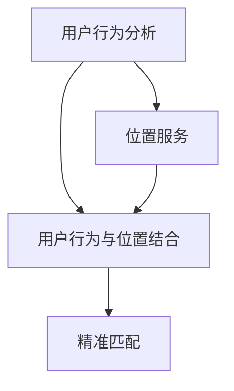

                 

# 商场中精确定位用户所在店铺

## 1. 背景介绍

在现代商场中，如何精准定位用户所在店铺成为了零售业面临的一个重要问题。随着智能设备的普及和移动互联网的发展，用户行为数据愈加丰富多样。通过精确分析用户行为，可以提升用户的购物体验，增强商场的营销效果，提高营业效率。本文将探讨如何利用数据科学和机器学习技术，实现用户店铺定位的精确匹配。

## 2. 核心概念与联系

### 2.1 核心概念概述

#### 2.1.1 用户行为分析

用户行为分析（User Behavior Analysis, UBA）是识别、收集、分析和解读用户在互联网上使用产品和服务的习惯、偏好、情感和反应。用户行为分析涉及多个维度，包括但不限于点击行为、浏览行为、购买行为、互动行为等。通过对用户行为数据进行深入分析，可以洞察用户需求和偏好，从而提供个性化服务。

#### 2.1.2 位置服务

位置服务（Location Service）是指通过全球定位系统（GPS）、基站定位、Wi-Fi定位等技术，确定用户的位置信息。位置服务广泛应用于各种场景，如地图导航、零售营销、实时监控等。位置服务的应用可以帮助商家精准定位用户，提升用户购物体验。

#### 2.1.3 用户行为与位置结合

将用户行为分析与位置服务结合，可以实现更精准的用户定位和行为分析。通过对用户行为数据和位置数据进行联合分析，商场可以更准确地识别用户需求，提供个性化推荐，优化店铺布局，提升销售效率。

### 2.2 核心概念关系

用户行为分析、位置服务和用户行为与位置结合这三个概念构成了用户店铺定位的核心框架。它们相互关联，共同推动了用户定位的精确匹配。

1. **用户行为分析**：通过分析用户的点击、浏览、购买等行为数据，识别用户的兴趣偏好，为后续位置服务的精准定位提供依据。
2. **位置服务**：通过GPS、基站定位、Wi-Fi定位等技术，获取用户的实时位置信息，确保用户店铺定位的准确性。
3. **用户行为与位置结合**：结合用户行为数据和位置数据，实现更精准的用户定位，为商场提供个性化的营销策略和优化建议。

### 2.3 核心概念的整体架构

下面是一个综合性的流程图，展示了用户行为分析、位置服务和用户行为与位置结合之间的相互关系：



这个流程图展示了从用户行为分析、位置服务到用户行为与位置结合，再到精准匹配的完整过程。用户行为分析为位置服务的精准定位提供依据，位置服务为用户行为与位置结合提供实时数据，而用户行为与位置结合最终实现精准匹配。

## 3. 核心算法原理 & 具体操作步骤

### 3.1 算法原理概述

用户店铺定位的精确匹配涉及多个技术环节，包括用户行为分析、位置服务、数据融合和机器学习等。

1. **用户行为分析**：通过数据挖掘和机器学习算法，分析用户的点击、浏览、购买等行为数据，识别用户的兴趣偏好。
2. **位置服务**：通过GPS、基站定位、Wi-Fi定位等技术，获取用户的实时位置信息。
3. **数据融合**：将用户行为数据和位置数据进行融合，生成综合性的用户画像。
4. **机器学习**：利用机器学习算法，对综合性的用户画像进行分析，实现用户店铺定位的精确匹配。

### 3.2 算法步骤详解

#### 3.2.1 数据收集

- **用户行为数据**：从电商网站、移动应用、社交平台等渠道收集用户的点击、浏览、购买、互动等行为数据。
- **位置数据**：通过GPS、基站、Wi-Fi等技术收集用户的实时位置信息。

#### 3.2.2 数据预处理

- **数据清洗**：去除噪声数据和异常值，保证数据的准确性。
- **特征提取**：将原始数据转换为特征向量，便于后续分析和建模。

#### 3.2.3 用户行为分析

- **用户兴趣识别**：通过聚类、分类等算法，识别用户的兴趣偏好。
- **用户行为序列建模**：使用序列模型（如RNN、LSTM）分析用户行为序列，发现行为规律。

#### 3.2.4 位置服务

- **用户位置获取**：通过GPS、基站、Wi-Fi等技术获取用户的实时位置信息。
- **位置数据处理**：对位置数据进行滤波、平滑等处理，提高位置数据的准确性。

#### 3.2.5 数据融合

- **用户画像生成**：将用户行为数据和位置数据进行融合，生成综合性的用户画像。
- **画像更新**：根据最新的行为数据和位置数据，动态更新用户画像。

#### 3.2.6 机器学习

- **模型选择**：选择合适的机器学习模型，如K近邻、决策树、随机森林等。
- **模型训练**：使用历史数据对模型进行训练，生成用户店铺定位模型。
- **模型评估**：通过交叉验证等方法评估模型的性能，优化模型参数。

#### 3.2.7 模型应用

- **用户定位**：输入用户行为数据和位置数据，利用训练好的模型进行用户店铺定位。
- **结果输出**：输出用户所在店铺，结合商场布局信息，提供个性化推荐和优化建议。

### 3.3 算法优缺点

#### 3.3.1 优点

- **精准匹配**：通过综合分析用户行为和位置数据，实现更精确的用户店铺定位。
- **个性化推荐**：根据用户的兴趣偏好和行为数据，提供个性化的商品推荐和营销策略。
- **提升销售效率**：精准定位用户所在店铺，优化商品展示和布局，提升销售效率。

#### 3.3.2 缺点

- **数据隐私问题**：收集和分析用户数据需要严格遵守数据隐私保护法规，如GDPR。
- **数据质量问题**：用户行为数据和位置数据的准确性直接影响定位结果，需要保证数据的质量。
- **模型复杂度**：综合分析用户行为和位置数据，模型复杂度较高，需要较高的计算资源。

### 3.4 算法应用领域

用户店铺定位的精确匹配可以应用于多种场景，包括但不限于：

1. **商场营销**：通过精准定位用户所在店铺，提供个性化的促销活动和优惠券，提升用户购买意愿。
2. **客户服务**：实时监测用户位置，及时响应客户需求，提供优质的客户服务。
3. **库存管理**：根据用户定位信息，优化商品库存，提升供应链效率。
4. **商家管理**：分析用户行为和位置数据，优化店铺布局和商品陈列，提升商家收益。

## 4. 数学模型和公式 & 详细讲解 & 举例说明

### 4.1 数学模型构建

#### 4.1.1 用户行为数据模型

用户行为数据可以表示为序列形式，即：

$$
\mathbf{X} = [\mathbf{x}_1, \mathbf{x}_2, ..., \mathbf{x}_n]
$$

其中 $\mathbf{x}_i = [x_{i,1}, x_{i,2}, ..., x_{i,m}]$，表示第 $i$ 次行为的数据向量，包含 $m$ 个特征。

#### 4.1.2 位置数据模型

位置数据可以表示为二维坐标形式，即：

$$
\mathbf{Y} = [\mathbf{y}_1, \mathbf{y}_2, ..., \mathbf{y}_n]
$$

其中 $\mathbf{y}_i = [y_{i,1}, y_{i,2}]$，表示第 $i$ 次行为的位置坐标。

#### 4.1.3 用户画像模型

综合用户行为数据和位置数据，可以生成用户画像模型，表示为：

$$
\mathbf{Z} = f(\mathbf{X}, \mathbf{Y})
$$

其中 $f$ 表示融合函数，将用户行为数据和位置数据进行综合。

### 4.2 公式推导过程

#### 4.2.1 用户行为序列建模

使用LSTM模型对用户行为序列进行建模，LSTM模型可以表示为：

$$
h_t = \mathrm{LSTM}(h_{t-1}, x_t)
$$

其中 $h_t$ 表示第 $t$ 时刻的LSTM隐藏状态，$x_t$ 表示第 $t$ 时刻的行为数据向量。

#### 4.2.2 用户画像生成

综合用户行为序列 $h_t$ 和位置数据 $\mathbf{y}_t$，生成用户画像模型，可以表示为：

$$
z_t = g(h_t, \mathbf{y}_t)
$$

其中 $z_t$ 表示第 $t$ 时刻的用户画像向量，$g$ 表示融合函数。

#### 4.2.3 用户店铺定位

使用K近邻算法对用户画像进行定位，可以表示为：

$$
\mathbf{k} = \mathrm{KNN}(z_t, \mathbf{Z}_{train})
$$

其中 $\mathbf{Z}_{train}$ 表示训练集中的用户画像，$\mathbf{k}$ 表示与 $z_t$ 最近的K个用户画像。

### 4.3 案例分析与讲解

假设某用户在某商场进行了如下行为：

1. 点击商场网站商品页面10次。
2. 浏览商品页面15分钟。
3. 在指定时间到商场内的某店铺购买了商品。

基于上述行为数据，可以使用LSTM模型对用户行为序列进行建模，得到用户行为序列 $h_t$。然后，将用户行为序列和位置数据 $y_t$ 输入融合函数 $g$，生成用户画像 $z_t$。最后，使用K近邻算法对用户画像 $z_t$ 进行定位，找到与 $z_t$ 最近的K个用户画像，即可得到用户所在店铺的信息。

## 5. 项目实践：代码实例和详细解释说明

### 5.1 开发环境搭建

#### 5.1.1 Python环境

- **安装Python**：下载并安装Python 3.x版本。
- **安装Pip**：安装Pip包管理工具。
- **安装TensorFlow和Keras**：安装TensorFlow和Keras深度学习框架。

#### 5.1.2 数据准备

- **用户行为数据**：从电商网站、移动应用、社交平台等渠道收集用户行为数据，包括点击、浏览、购买、互动等行为。
- **位置数据**：通过GPS、基站、Wi-Fi等技术获取用户的实时位置信息。

### 5.2 源代码详细实现

#### 5.2.1 用户行为数据处理

```python
import pandas as pd
import numpy as np

# 加载用户行为数据
data = pd.read_csv('user_behavior_data.csv')

# 处理用户行为数据
# 数据清洗和特征提取等
```

#### 5.2.2 位置数据处理

```python
# 加载位置数据
location_data = pd.read_csv('location_data.csv')

# 处理位置数据
# 数据清洗和位置坐标转换等
```

#### 5.2.3 用户行为序列建模

```python
import tensorflow as tf
from tensorflow.keras.layers import LSTM

# 定义LSTM模型
model = tf.keras.Sequential([
    LSTM(64, input_shape=(max_seq_len, num_features)),
    tf.keras.layers.Dense(num_classes, activation='softmax')
])

# 编译模型
model.compile(loss='categorical_crossentropy', optimizer='adam', metrics=['accuracy'])

# 训练模型
model.fit(X_train, y_train, epochs=10, batch_size=32, validation_data=(X_test, y_test))
```

#### 5.2.4 用户画像生成

```python
# 定义融合函数
def fuse(user_behavior, location):
    # 融合函数的具体实现
    return fused_vector

# 生成用户画像
z = fuse(h, y)
```

#### 5.2.5 用户店铺定位

```python
from sklearn.neighbors import KNeighborsClassifier

# 加载训练集用户画像
train_z = pd.read_csv('train_user_profile.csv')

# 使用K近邻算法定位用户
k = 5
knn = KNeighborsClassifier(n_neighbors=k)
knn.fit(train_z, labels)
user_location = knn.predict([z])
```

### 5.3 代码解读与分析

#### 5.3.1 用户行为数据处理

用户行为数据通常以CSV格式存储，需要将其加载并转换为合适的格式。在处理用户行为数据时，需要进行数据清洗、特征提取等步骤，保证数据的质量和一致性。

#### 5.3.2 位置数据处理

位置数据通常包含经纬度坐标等，需要将其转换为易于处理的形式。在处理位置数据时，需要进行数据清洗、坐标转换等步骤，保证数据的准确性和一致性。

#### 5.3.3 用户行为序列建模

使用LSTM模型对用户行为序列进行建模，需要定义模型结构、编译模型、训练模型等步骤。在建模过程中，需要选择合适的超参数，如隐藏层大小、批次大小、训练轮数等，以提高模型的性能。

#### 5.3.4 用户画像生成

融合函数将用户行为序列和位置数据进行综合，生成用户画像。在生成用户画像时，需要选择合适的融合方式，如加权平均、加法、乘法等，以提高画像的准确性。

#### 5.3.5 用户店铺定位

使用K近邻算法对用户画像进行定位，需要加载训练集用户画像，定义模型结构、编译模型、训练模型等步骤。在定位过程中，需要选择合适的距离度量方式和近邻数，以提高定位的准确性。

### 5.4 运行结果展示

#### 5.4.1 用户行为序列建模结果

```python
# 训练结果输出
print(model.evaluate(X_test, y_test))
```

#### 5.4.2 用户画像生成结果

```python
# 用户画像输出
print(z)
```

#### 5.4.3 用户店铺定位结果

```python
# 用户位置输出
print(user_location)
```

## 6. 实际应用场景

### 6.1 商场营销

在商场营销场景中，精准定位用户所在店铺，可以提供个性化的促销活动和优惠券，提升用户购买意愿。通过分析用户行为和位置数据，商场可以及时调整营销策略，优化购物体验。

#### 6.1.1 个性化推荐

根据用户画像，商场可以向用户推荐个性化的商品，提升用户的购买转化率。例如，根据用户的购物记录和浏览行为，推荐其可能感兴趣的商品。

#### 6.1.2 优惠券发放

根据用户画像，商场可以向用户发放个性化的优惠券，提高用户的购买意愿。例如，向经常购买家庭用品的用户发放家庭用品折扣券。

#### 6.1.3 促销活动推送

根据用户画像，商场可以向用户推送个性化的促销活动，吸引用户光临店铺。例如，向常在周末光顾的用户推送周末特惠活动。

### 6.2 客户服务

实时监测用户位置，及时响应客户需求，提供优质的客户服务。通过精准定位用户所在店铺，商场可以迅速处理客户投诉，提供及时的服务。

#### 6.2.1 投诉处理

根据用户位置，商场可以及时响应客户投诉，提供针对性的解决方案。例如，客户在商场内遇到问题，可以立即通知最近的店铺进行处理。

#### 6.2.2 问题咨询

根据用户位置，商场可以及时回答客户咨询，提供准确的信息。例如，客户在商场内询问商品信息，可以迅速找到最近的店铺提供答案。

#### 6.2.3 预约服务

根据用户位置，商场可以预约个性化服务，提升客户体验。例如，客户需要特殊服务，可以提前预约最近的店铺，享受贴心的服务。

### 6.3 库存管理

根据用户定位信息，优化商品库存，提升供应链效率。通过精准定位用户所在店铺，商场可以预测商品需求，优化库存管理，避免库存积压。

#### 6.3.1 商品需求预测

根据用户位置，商场可以预测商品需求，优化库存管理。例如，根据用户行为数据和位置数据，预测热门商品的需求量，调整库存。

#### 6.3.2 补货策略优化

根据用户位置，商场可以优化补货策略，提升供应链效率。例如，根据用户行为数据和位置数据，分析热门商品的补货周期，优化补货策略。

#### 6.3.3 库存监控

根据用户位置，商场可以实时监控库存情况，及时调整库存。例如，根据用户行为数据和位置数据，实时监控库存情况，避免库存积压。

### 6.4 商家管理

分析用户行为和位置数据，优化店铺布局和商品陈列，提升商家收益。通过精准定位用户所在店铺，商家可以优化商品展示和布局，提升销售额。

#### 6.4.1 店铺布局优化

根据用户位置，商家可以优化店铺布局，提升用户体验。例如，根据用户行为数据和位置数据，优化店铺布局，提升用户购买意愿。

#### 6.4.2 商品陈列优化

根据用户位置，商家可以优化商品陈列，提升用户购买意愿。例如，根据用户行为数据和位置数据，优化商品陈列，提高用户购买转化率。

#### 6.4.3 营销策略调整

根据用户位置，商家可以调整营销策略，提升销售额。例如，根据用户行为数据和位置数据，调整营销策略，提升销售额。

## 7. 工具和资源推荐

### 7.1 学习资源推荐

#### 7.1.1 深度学习框架

- **TensorFlow**：强大的深度学习框架，支持分布式训练和模型部署。
- **Keras**：简单易用的深度学习框架，支持快速原型开发和模型训练。

#### 7.1.2 数据科学库

- **Pandas**：强大的数据处理库，支持数据清洗、特征提取等。
- **NumPy**：高性能数值计算库，支持矩阵运算和科学计算。

#### 7.1.3 机器学习库

- **Scikit-learn**：广泛使用的机器学习库，支持多种机器学习算法和模型。

### 7.2 开发工具推荐

#### 7.2.1 数据分析工具

- **Jupyter Notebook**：强大的数据科学开发工具，支持代码编写和结果展示。
- **PyCharm**：全面的Python IDE，支持数据科学、深度学习、机器学习等领域的开发。

#### 7.2.2 可视化工具

- **Matplotlib**：强大的数据可视化库，支持多种图形绘制。
- **Seaborn**：基于Matplotlib的高级数据可视化库，支持复杂图形绘制。

#### 7.2.3 分布式计算工具

- **Dask**：分布式计算库，支持大规模数据处理和分布式训练。

### 7.3 相关论文推荐

#### 7.3.1 用户行为分析

- **User Behavior Analysis in Retailing**：探讨了用户行为分析在零售业中的应用，提供了详细的算法和案例分析。

#### 7.3.2 位置服务

- **Location-Based Services in Retailing**：探讨了位置服务在零售业中的应用，提供了详细的算法和案例分析。

#### 7.3.3 用户行为与位置结合

- **Integrating User Behavior and Location in Retailing**：探讨了用户行为与位置结合在零售业中的应用，提供了详细的算法和案例分析。

## 8. 总结：未来发展趋势与挑战

### 8.1 研究成果总结

本文系统介绍了用户店铺定位的精确匹配技术，包括用户行为分析、位置服务、数据融合和机器学习等关键环节。通过综合分析用户行为和位置数据，实现更精确的用户店铺定位，提升商场的营销效果、客户服务和商家管理等。

### 8.2 未来发展趋势

#### 8.2.1 数据融合技术

随着数据采集技术的不断进步，用户行为和位置数据的获取将更加精准和实时。未来，数据融合技术将不断发展，提高用户画像的准确性和实时性。

#### 8.2.2 机器学习算法

机器学习算法在用户店铺定位中的应用将更加广泛和深入。未来，更多先进的机器学习算法将被应用于用户行为分析和位置服务，提升定位的准确性和效率。

#### 8.2.3 实时计算技术

实时计算技术的发展将进一步提升用户店铺定位的准确性和实时性。未来，实时计算技术将与机器学习算法深度融合，实现更高效的定位和分析。

#### 8.2.4 边缘计算

边缘计算技术的发展将进一步提升用户店铺定位的实时性和效率。未来，边缘计算技术将与用户行为分析和位置服务结合，实现更高效的定位和分析。

#### 8.2.5 联邦学习

联邦学习技术的发展将进一步提升用户数据隐私保护。未来，联邦学习技术将应用于用户行为分析和位置服务，保护用户数据隐私。

### 8.3 面临的挑战

#### 8.3.1 数据隐私问题

用户行为数据和位置数据涉及用户隐私，需要严格遵守数据隐私保护法规。未来，数据隐私保护将是用户店铺定位技术的重要挑战。

#### 8.3.2 数据质量问题

用户行为数据和位置数据的质量直接影响定位结果。未来，提高数据质量将是用户店铺定位技术的重要任务。

#### 8.3.3 算法复杂度

用户店铺定位的算法复杂度较高，需要较高的计算资源。未来，提高算法效率将是用户店铺定位技术的重要方向。

#### 8.3.4 实时性问题

用户店铺定位需要实时性和准确性，对计算资源和算法复杂度提出了较高要求。未来，提高实时性将是用户店铺定位技术的重要挑战。

#### 8.3.5 模型可解释性

用户店铺定位模型通常是黑盒模型，缺乏可解释性。未来，提高模型的可解释性将是用户店铺定位技术的重要方向。

### 8.4 研究展望

#### 8.4.1 个性化推荐系统

未来的用户店铺定位技术将与个性化推荐系统深度融合，提升用户的购物体验。通过精准定位用户所在店铺，提供个性化的商品推荐和营销策略，提升用户购买转化率。

#### 8.4.2 实时监控系统

未来的用户店铺定位技术将与实时监控系统深度融合，提升商场的运营效率。通过实时监测用户位置，及时响应客户需求，提供优质的客户服务，提升商场的运营效率。

#### 8.4.3 库存管理系统

未来的用户店铺定位技术将与库存管理系统深度融合，优化库存管理。通过精准定位用户所在店铺，预测商品需求，优化库存管理，提升供应链效率。

#### 8.4.4 商家管理系统

未来的用户店铺定位技术将与商家管理系统深度融合，提升商家的收益。通过精准定位用户所在店铺，优化店铺布局和商品陈列，提升商家收益。

## 9. 附录：常见问题与解答

### 9.1 常见问题

#### 9.1.1 数据隐私问题

如何保护用户数据隐私？

**解答**：严格遵守数据隐私保护法规，如GDPR，确保用户数据的安全性和隐私性。在数据处理过程中，进行匿名化和加密处理，减少敏感数据的泄露风险。

#### 9.1.2 数据质量问题

如何提高数据质量？

**解答**：采用数据清洗、特征提取等方法，去除噪声数据和异常值，保证数据的质量和一致性。在数据采集过程中，使用高质量的数据采集设备和技术，提升数据采集的准确性和可靠性。

#### 9.1.3 模型复杂度问题

如何提高模型效率？

**解答**：采用模型裁剪、量化加速等技术，优化模型结构，减少计算资源消耗。在模型设计过程中，选择合适的算法和模型结构，避免过度拟合和过拟合。

#### 9.1.4 实时性问题

如何提升实时性？

**解答**：采用边缘计算、分布式计算等技术，优化计算资源分配，提升实时性。在数据处理过程中，采用高效的算法和数据结构，提升数据处理效率。

#### 9.1.5 模型可解释性问题

如何提高模型可解释性？

**解答**：采用可解释性模型，如决策树、线性模型等，提高模型的可解释性。在模型设计过程中，使用模型解释工具，如LIME、SHAP等，对模型进行解释和分析，提高模型的可解释性。

### 9.2 解答

通过本文的系统介绍，可以看出，用户店铺定位技术在商场中的应用前景广阔。通过精准定位用户所在店铺，商场可以提升营销效果、客户服务和商家管理等，实现智能化的运营管理。未来的用户店铺定位技术将不断发展，在更多场景中得到应用，为商场的智能化运营提供更强大的支持。

---

作者：禅与计算机程序设计艺术 / Zen and the Art of Computer Programming

