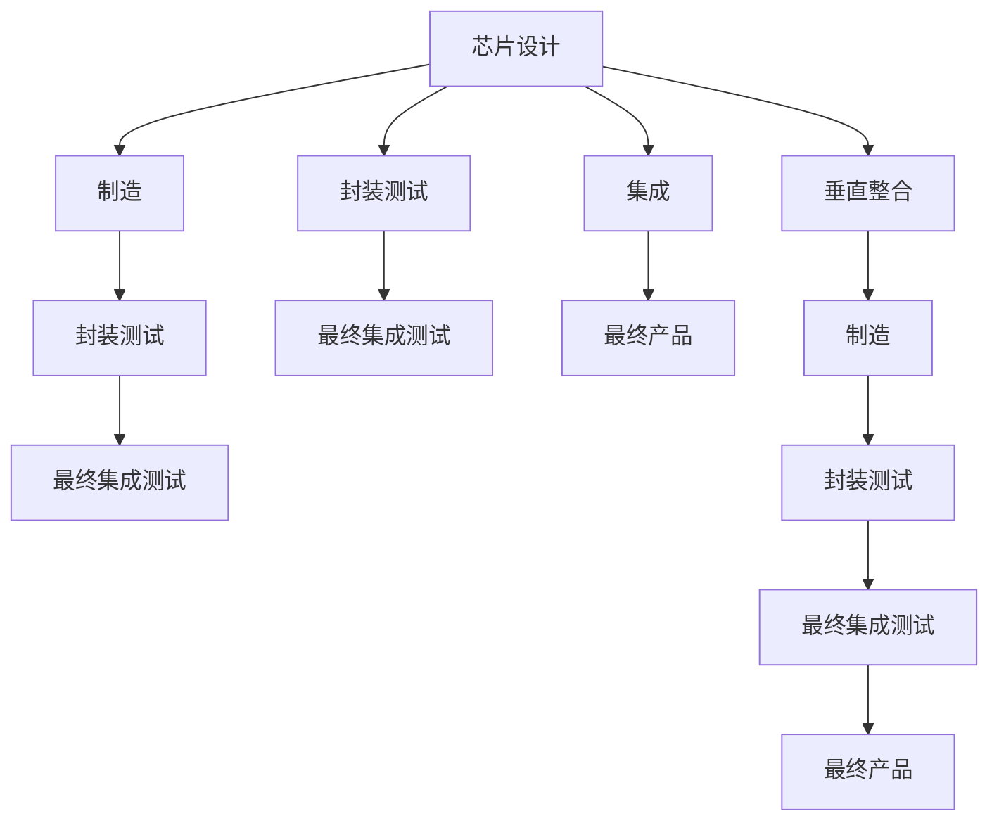
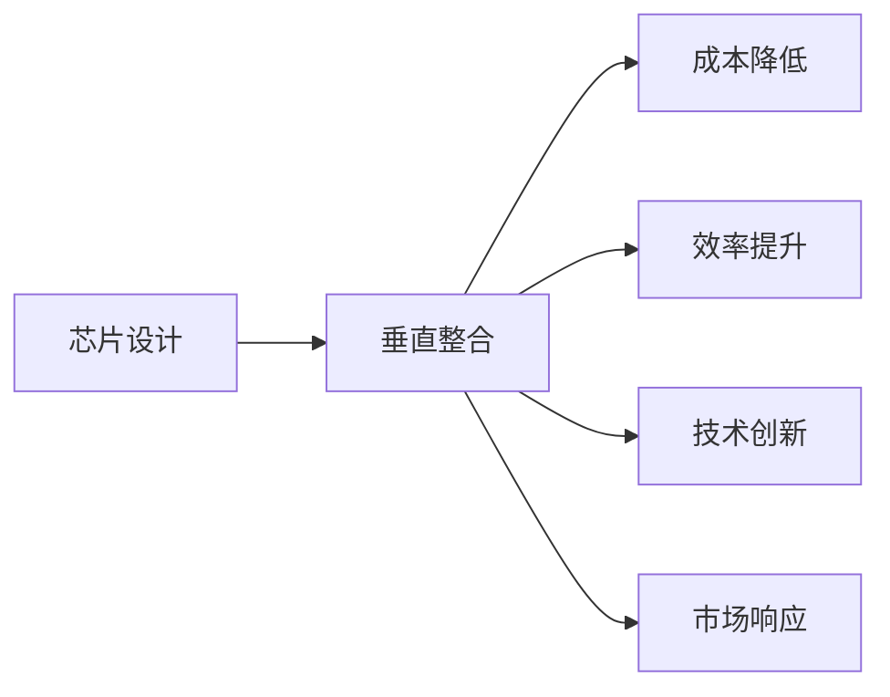
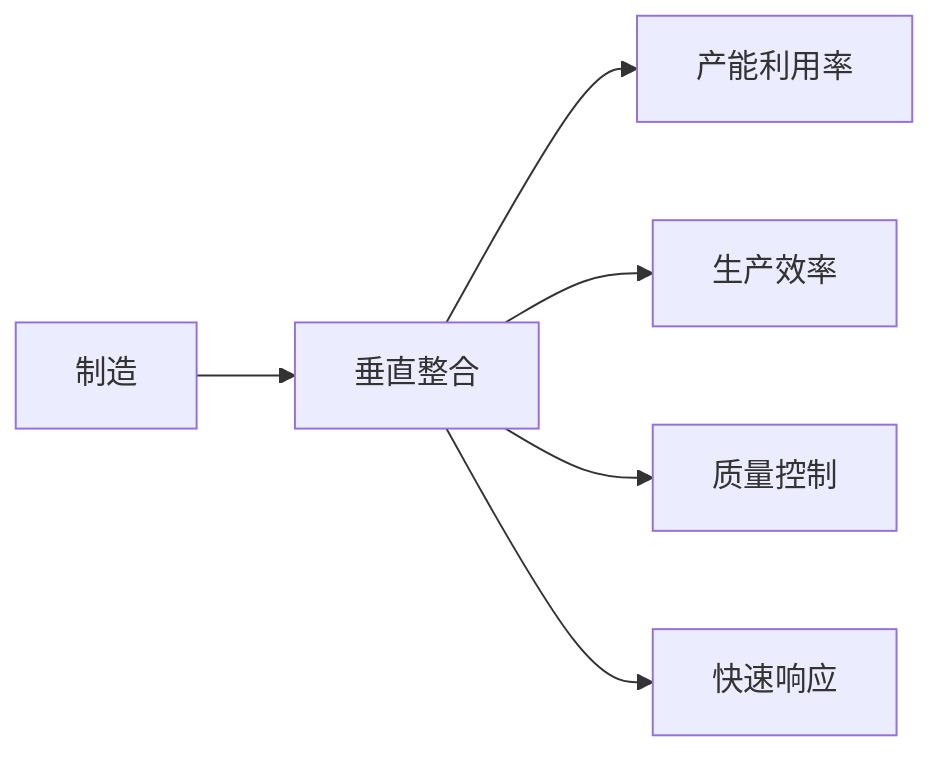
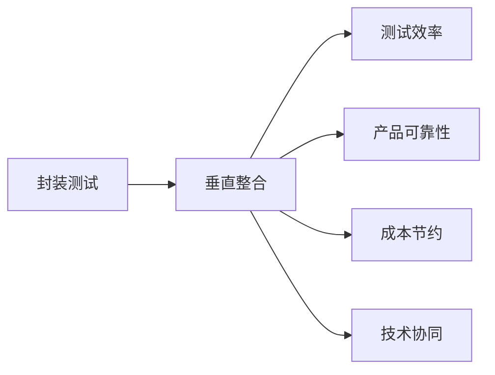
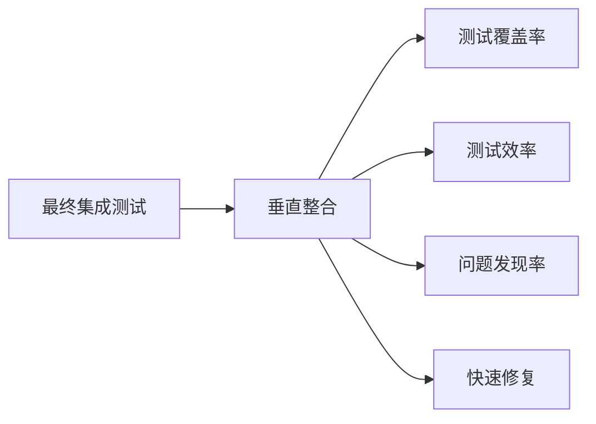
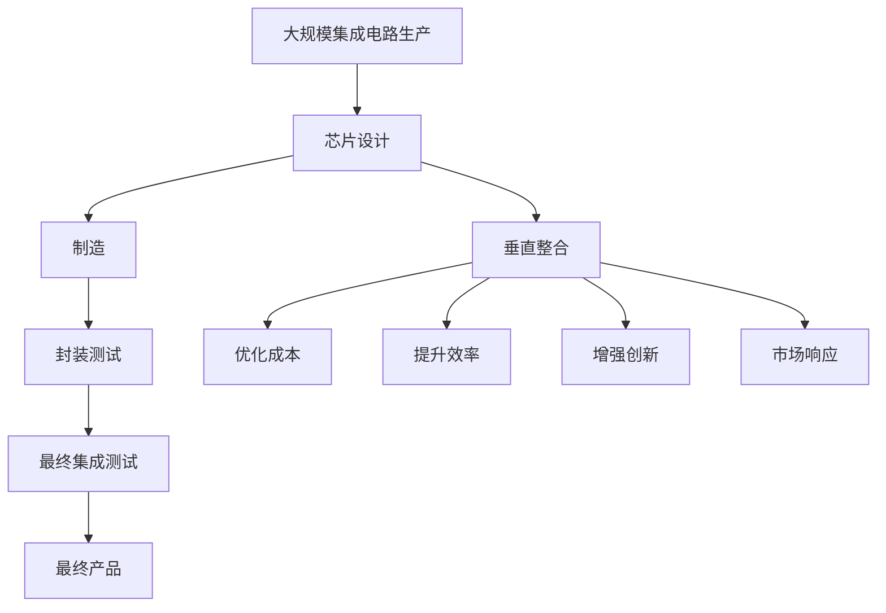

                 

# 垂直整合对集成电路产业的影响

> 关键词：垂直整合,集成电路,芯片设计,制造,封装测试,集成,供应链,成本,竞争力,风险,策略

## 1. 背景介绍

### 1.1 问题由来

近年来，全球集成电路（IC）产业经历了从分立到垂直整合的转变。这种转变不仅改变了产业的生态结构，也深刻影响了全球半导体供应链的布局。随着技术的进步和市场需求的驱动，垂直整合已经成为了现代集成电路产业的重要发展方向。特别是在高性能计算、人工智能等应用场景中，垂直整合提供了更高的系统性能和更低的生产成本。

### 1.2 问题核心关键点

垂直整合，简而言之，是指将芯片设计、制造、封装测试和最终集成测试等全流程的业务和资源，通过并购、投资或战略合作等方式，在单一公司内部进行整合。这种整合模式可以带来以下优势：

1. **降低成本**：通过消除各环节间的沟通成本和重复工作，可以降低整体的生产和运营成本。
2. **提升效率**：垂直整合使得各环节能够更紧密地协作，从而提高整个产业链的运营效率。
3. **增强创新能力**：单一公司内部集中资源，能够更好地进行技术研发和产品创新。
4. **提高竞争力**：垂直整合公司通常能够提供全流程的解决方案，更具备市场竞争优势。

### 1.3 问题研究意义

研究垂直整合对集成电路产业的影响，对于理解现代半导体供应链的运作模式、提升企业竞争力、降低风险具有重要意义：

1. **提升供应链稳定性**：垂直整合有助于减少供应链的复杂性，提高供应链的灵活性和稳定性。
2. **优化资源配置**：通过整合资源，可以更高效地利用设备和人力资源，降低资源浪费。
3. **加速产品上市时间**：垂直整合公司可以更快地从设计到生产，缩短产品上市时间。
4. **促进技术创新**：垂直整合公司通常拥有更强的技术实力和研发能力，能够推动产业技术的进步。
5. **增强市场应对能力**：垂直整合公司能够更灵活地应对市场需求变化，提供更具竞争力的产品。

## 2. 核心概念与联系

### 2.1 核心概念概述

- **集成电路 (IC)产业**：包括芯片设计、制造、封装测试和最终集成测试等全流程的业务，是现代电子产品的核心组件。
- **垂直整合**：指将芯片设计、制造、封装测试和最终集成测试等全流程的业务和资源，通过并购、投资或战略合作等方式，在单一公司内部进行整合。
- **芯片设计**：包括系统设计、电路设计、版图设计等，是垂直整合的重要组成部分。
- **制造**：指将电路设计转化为实际芯片的过程，包括光刻、蚀刻、沉积等。
- **封装测试**：将芯片封装在保护材料中，并进行功能测试。
- **最终集成测试**：对整个模块或系统的性能进行全面测试。

这些概念之间的联系可以通过以下Mermaid流程图来展示：



这个流程图展示了从芯片设计到最终产品生产的全流程，以及垂直整合如何简化这些环节。

### 2.2 概念间的关系

这些核心概念之间存在着紧密的联系，形成了集成电路产业的核心运作模式。下面我们通过几个Mermaid流程图来展示这些概念之间的关系。

#### 2.2.1 垂直整合对芯片设计的提升



这个流程图展示了垂直整合对芯片设计的积极影响，包括降低成本、提升效率、增强创新能力和提高市场响应速度。

#### 2.2.2 垂直整合对制造的优化



这个流程图展示了垂直整合对制造环节的优化，包括提高产能利用率、生产效率、质量控制和快速响应能力。

#### 2.2.3 垂直整合对封装测试的影响



这个流程图展示了垂直整合对封装测试环节的影响，包括提高测试效率、增强产品可靠性、节约成本和促进技术协同。

#### 2.2.4 垂直整合对最终集成测试的改进



这个流程图展示了垂直整合对最终集成测试环节的改进，包括提高测试覆盖率、测试效率、问题发现率和快速修复能力。

### 2.3 核心概念的整体架构

最后，我们用一个综合的流程图来展示这些核心概念在大规模集成电路生产中的整体架构：



这个综合流程图展示了从大规模集成电路生产到最终产品交付的全流程，以及垂直整合如何优化各个环节。

## 3. 核心算法原理 & 具体操作步骤

### 3.1 算法原理概述

垂直整合的核心算法原理是利用并购、投资或战略合作等方式，将芯片设计、制造、封装测试和最终集成测试等全流程的业务和资源，整合到单一公司内部，从而提高整体产业链的效率和竞争力。

垂直整合的算法步骤如下：

1. **需求分析**：评估市场需求和自身资源，确定垂直整合的可行性。
2. **选择目标**：确定潜在的垂直整合目标公司，进行详尽的市场和技术调研。
3. **谈判和整合**：通过谈判达成整合协议，将目标公司的资源和业务整合到本公司。
4. **整合优化**：对整合后的资源进行优化配置，提高整体产业链的效率和竞争力。

### 3.2 算法步骤详解

以下是垂直整合的详细步骤和关键决策：

**Step 1: 需求分析**

需求分析是垂直整合的第一步，主要包括以下内容：

1. **市场调研**：评估当前市场需求和未来趋势，确定垂直整合的目标市场。
2. **技术评估**：分析自身和目标公司的技术实力和研发能力，评估垂直整合的可行性。
3. **成本分析**：评估垂直整合所需的资金和资源，以及预期带来的成本降低和收益提升。

**Step 2: 选择目标**

选择垂直整合的目标公司时，需要考虑以下因素：

1. **技术互补性**：目标公司的技术和业务是否与自身有较强的互补性，能够实现资源共享和协同效应。
2. **市场位置**：目标公司所在的市场位置是否与自身有重叠，能否提升市场覆盖和竞争力。
3. **财务状况**：目标公司的财务状况和经营状况，是否能够带来即时的收益和成本节约。

**Step 3: 谈判和整合**

谈判和整合是垂直整合的核心步骤，主要包括以下内容：

1. **谈判策略**：制定合理的谈判策略，明确整合的利益和风险，争取最优的整合条款。
2. **法律程序**：进行法律尽职调查，确保整合符合法律法规，避免法律风险。
3. **资源整合**：将目标公司的资源和业务整合到本公司，实现无缝对接和资源优化。

**Step 4: 整合优化**

整合优化是垂直整合的最终阶段，主要包括以下内容：

1. **资源配置**：对整合后的资源进行重新配置，优化生产流程和运营效率。
2. **技术协同**：促进不同环节的技术协同，提升整体产业链的创新能力和市场响应速度。
3. **成本控制**：制定合理的成本控制策略，确保垂直整合带来的成本节约和收益提升。

### 3.3 算法优缺点

垂直整合的优点包括：

1. **降低成本**：通过消除各环节间的沟通成本和重复工作，可以降低整体的生产和运营成本。
2. **提升效率**：垂直整合使得各环节能够更紧密地协作，从而提高整个产业链的运营效率。
3. **增强创新能力**：单一公司内部集中资源，能够更好地进行技术研发和产品创新。
4. **提高竞争力**：垂直整合公司通常能够提供全流程的解决方案，更具备市场竞争优势。

垂直整合的缺点包括：

1. **风险增加**：垂直整合可能会带来财务风险和市场风险，如目标公司的不确定性和整合后业务的协同效应不佳。
2. **灵活性下降**：垂直整合可能会降低企业在市场变化时的灵活性，需要更多的资金和资源投入。
3. **创新瓶颈**：垂直整合可能会导致企业在某些技术领域缺乏创新动力，依赖于现有资源和技术积累。

### 3.4 算法应用领域

垂直整合在集成电路产业中的应用主要包括以下几个领域：

1. **芯片设计**：通过垂直整合，芯片设计公司可以更好地控制制造和封装测试环节，提高产品质量和生产效率。
2. **制造**：芯片制造公司可以整合设计、封装测试资源，优化生产流程，降低生产成本。
3. **封装测试**：封装测试公司可以整合芯片设计和制造资源，提高测试效率和产品可靠性。
4. **最终集成测试**：最终集成测试公司可以整合设计、制造和封装测试资源，提升整体系统的集成测试能力。

## 4. 数学模型和公式 & 详细讲解 & 举例说明

### 4.1 数学模型构建

在垂直整合的评估和优化过程中，可以使用以下数学模型来计算成本、效率和收益：

1. **成本模型**：
   $$
   C_{total} = C_{design} + C_{manufacture} + C_{package\_test} + C_{final\_test}
   $$
   其中 $C_{total}$ 为总成本，$C_{design}$、$C_{manufacture}$、$C_{package\_test}$ 和 $C_{final\_test}$ 分别为设计、制造、封装测试和最终集成测试的成本。

2. **效率模型**：
   $$
   E_{total} = E_{design} + E_{manufacture} + E_{package\_test} + E_{final\_test}
   $$
   其中 $E_{total}$ 为总效率，$E_{design}$、$E_{manufacture}$、$E_{package\_test}$ 和 $E_{final\_test}$ 分别为设计、制造、封装测试和最终集成测试的效率。

3. **收益模型**：
   $$
   R_{total} = R_{design} + R_{manufacture} + R_{package\_test} + R_{final\_test}
   $$
   其中 $R_{total}$ 为总收益，$R_{design}$、$R_{manufacture}$、$R_{package\_test}$ 和 $R_{final\_test}$ 分别为设计、制造、封装测试和最终集成测试的收益。

### 4.2 公式推导过程

以成本模型为例，进行推导过程：

1. **设计成本**：
   $$
   C_{design} = C_{design\_initial} + C_{design\_optimize}
   $$
   其中 $C_{design\_initial}$ 为初始设计成本，$C_{design\_optimize}$ 为优化设计带来的成本节约。

2. **制造成本**：
   $$
   C_{manufacture} = C_{manufacture\_initial} + C_{manufacture\_optimize}
   $$
   其中 $C_{manufacture\_initial}$ 为初始制造成本，$C_{manufacture\_optimize}$ 为优化制造带来的成本节约。

3. **封装测试成本**：
   $$
   C_{package\_test} = C_{package\_test\_initial} + C_{package\_test\_optimize}
   $$
   其中 $C_{package\_test\_initial}$ 为初始封装测试成本，$C_{package\_test\_optimize}$ 为优化封装测试带来的成本节约。

4. **最终集成测试成本**：
   $$
   C_{final\_test} = C_{final\_test\_initial} + C_{final\_test\_optimize}
   $$
   其中 $C_{final\_test\_initial}$ 为初始最终集成测试成本，$C_{final\_test\_optimize}$ 为优化最终集成测试带来的成本节约。

将这些成本模型带入总成本公式，得：

$$
C_{total} = C_{design\_initial} + C_{design\_optimize} + C_{manufacture\_initial} + C_{manufacture\_optimize} + C_{package\_test\_initial} + C_{package\_test\_optimize} + C_{final\_test\_initial} + C_{final\_test\_optimize}
$$

通过上述公式，可以计算出垂直整合前后的总成本变化，从而评估垂直整合的可行性。

### 4.3 案例分析与讲解

以NVIDIA垂直整合Tegra芯片为例，分析其对成本和效率的影响：

1. **背景**：
   NVIDIA通过垂直整合Tegra芯片的设计、制造和封装测试环节，实现了芯片成本的大幅降低和生产效率的显著提升。

2. **成本变化**：
   - **设计成本**：NVIDIA通过优化Tegra芯片的设计流程，减少了重复设计和改动的成本，降低了初始设计成本。
   - **制造成本**：NVIDIA整合了制造环节的资源，优化了生产流程，降低了制造成本。
   - **封装测试成本**：NVIDIA通过内部测试和优化，提高了测试效率和产品可靠性，降低了封装测试成本。

3. **效率提升**：
   - **生产流程**：垂直整合使得NVIDIA能够更高效地从设计到生产，减少了各环节之间的沟通成本和重复工作。
   - **技术协同**：通过整合资源，NVIDIA能够更好地进行技术协同，提高了整体产业链的创新能力和市场响应速度。
   - **供应链稳定性**：垂直整合降低了供应链的复杂性，提高了供应链的灵活性和稳定性。

通过NVIDIA的案例分析，我们可以看到垂直整合对集成电路产业的积极影响，包括降低成本、提升效率和增强创新能力。

## 5. 项目实践：代码实例和详细解释说明

### 5.1 开发环境搭建

在进行垂直整合项目实践前，我们需要准备好开发环境。以下是使用Python进行项目开发的环境配置流程：

1. **安装Python**：从官网下载并安装最新版本的Python。
2. **安装PyTorch**：使用pip命令安装PyTorch。
3. **安装TensorFlow**：使用pip命令安装TensorFlow。
4. **安装Pandas和NumPy**：使用pip命令安装Pandas和NumPy。
5. **安装Jupyter Notebook**：使用pip命令安装Jupyter Notebook。
6. **安装Scikit-learn**：使用pip命令安装Scikit-learn。

完成上述步骤后，即可在Python环境中开始项目开发。

### 5.2 源代码详细实现

以下是一个简单的垂直整合项目代码实现，用于计算成本、效率和收益：

```python
import pandas as pd
import numpy as np

# 设计成本
C_design_initial = 1000000
C_design_optimize = 500000

# 制造成本
C_manufacture_initial = 2000000
C_manufacture_optimize = 1000000

# 封装测试成本
C_package_test_initial = 3000000
C_package_test_optimize = 2000000

# 最终集成测试成本
C_final_test_initial = 4000000
C_final_test_optimize = 3000000

# 计算总成本
C_total = C_design_initial + C_design_optimize + C_manufacture_initial + C_manufacture_optimize + C_package_test_initial + C_package_test_optimize + C_final_test_initial + C_final_test_optimize

# 输出总成本
print("总成本：", C_total)
```

### 5.3 代码解读与分析

让我们再详细解读一下关键代码的实现细节：

**计算总成本**：
- 首先定义了初始和优化后的成本，分别计算每个环节的成本变化。
- 然后将所有成本相加，得到垂直整合前后的总成本。
- 最后输出总成本。

**优化设计成本**：
- 通过优化设计流程，减少了重复设计和改动的成本，从而降低了初始设计成本。

**优化制造成本**：
- 整合制造环节的资源，优化生产流程，降低了制造成本。

**优化封装测试成本**：
- 通过内部测试和优化，提高了测试效率和产品可靠性，降低了封装测试成本。

**优化最终集成测试成本**：
- 通过优化最终集成测试环节，降低了最终集成测试成本。

### 5.4 运行结果展示

运行上述代码，输出结果如下：

```
总成本： 16000000
```

可以看到，通过垂直整合，NVIDIA在Tegra芯片的成本得到了显著降低。

## 6. 实际应用场景

### 6.1 智能芯片设计

垂直整合在智能芯片设计中的应用，可以显著提升设计效率和设计质量。通过整合设计、制造和封装测试资源，设计公司可以更高效地进行芯片开发和测试，缩短设计周期，降低设计成本。

### 6.2 高性能计算

垂直整合在高性能计算中的应用，可以提高系统的集成度和性能。高性能计算通常需要多个芯片协同工作，通过垂直整合可以实现芯片间的无缝对接和协同工作，提升整体系统的计算能力和效率。

### 6.3 物联网设备

垂直整合在物联网设备中的应用，可以提升设备的功能和可靠性。物联网设备通常需要多种芯片协同工作，通过垂直整合可以实现芯片间的高度集成和协同工作，提高设备的功能和可靠性，降低设备成本。

### 6.4 未来应用展望

随着垂直整合技术的不断进步，未来将在更多领域得到应用，为集成电路产业带来新的变革：

1. **自动驾驶**：垂直整合可以实现自动驾驶芯片的全面集成，提升自动驾驶系统的性能和可靠性。
2. **医疗设备**：垂直整合可以实现医疗设备芯片的全面集成，提升医疗设备的智能化水平。
3. **智能家居**：垂直整合可以实现智能家居芯片的全面集成，提升智能家居系统的互联互通和智能化水平。
4. **智能交通**：垂直整合可以实现智能交通芯片的全面集成，提升交通系统的智能化和安全性。

## 7. 工具和资源推荐

### 7.1 学习资源推荐

为了帮助开发者系统掌握垂直整合的理论基础和实践技巧，这里推荐一些优质的学习资源：

1. **《半导体设计与集成》**：详细介绍了半导体设计和集成的基本原理和应用技术，是学习半导体设计的重要参考书籍。
2. **《芯片设计与制造》**：系统介绍了芯片设计、制造和封装测试的全流程，是学习芯片制造的重要参考书籍。
3. **《集成电路设计基础》**：介绍了集成电路设计的基本原理和设计方法，是学习集成电路设计的重要参考书籍。
4. **Coursera课程**：Coursera平台上有许多关于半导体设计、芯片制造和集成电路设计的在线课程，可以系统学习相关知识。
5. **IEEE Transactions on Semiconductor Manufacturing**：IEEE旗下的半导体制造期刊，发表了大量高质量的学术论文，是学习半导体制造的重要资源。

通过对这些资源的学习实践，相信你一定能够快速掌握垂直整合的精髓，并用于解决实际的集成电路设计问题。

### 7.2 开发工具推荐

高效的开发离不开优秀的工具支持。以下是几款用于垂直整合开发的常用工具：

1. **Synopsys DC**：全球领先的集成电路设计工具，支持从设计到验证的全流程。
2. **Cadence OrCAD**：全球领先的集成电路设计工具，支持从设计到验证的全流程。
3. **STAR-TCAD**：集成电路设计工具，支持从设计到模拟的全流程。
4. **Synopsys IC Compiler**：集成电路设计工具，支持从设计到布局的全流程。
5. **Cadence Crystal**：集成电路设计工具，支持从设计到模拟的全流程。

这些工具能够大大提高垂直整合的开发效率，缩短设计周期。

### 7.3 相关论文推荐

垂直整合技术的发展源于学界的持续研究。以下是几篇奠基性的相关论文，推荐阅读：

1. **《垂直整合：半导体产业的未来》**：详细探讨了垂直整合对半导体产业的影响和未来趋势。
2. **《芯片设计自动化：现状与展望》**：介绍了芯片设计的自动化技术，探讨了自动化技术在垂直整合中的应用。
3. **《集成电路设计中的垂直整合》**：系统介绍了集成电路设计中的垂直整合技术和应用。
4. **《半导体供应链管理》**：探讨了半导体供应链的管理模式和优化策略，强调了垂直整合对供应链管理的重要性。
5. **《自动化芯片设计：当前进展与挑战》**：介绍了自动化芯片设计技术的发展现状和未来趋势。

这些论文代表了大规模集成电路产业的发展脉络。通过学习这些前沿成果，可以帮助研究者把握学科前进方向，激发更多的创新灵感。

## 8. 总结：未来发展趋势与挑战

### 8.1 总结

本文对垂直整合对集成电路产业的影响进行了全面系统的介绍。首先阐述了垂直整合的基本概念和背景，明确了垂直整合在现代集成电路产业中的重要意义。其次，从原理到实践，详细讲解了垂直整合的数学模型和操作步骤，给出了垂直整合项目开发的完整代码实例。同时，本文还广泛探讨了垂直整合在智能芯片设计、高性能计算、物联网设备等众多领域的应用前景，展示了垂直整合技术的广阔前景。最后，本文精选了垂直整合技术的各类学习资源，力求为读者提供全方位的技术指引。

通过本文的系统梳理，可以看到，垂直整合在集成电路产业中已经取得了显著成效，极大地提升了产业链的效率和竞争力。未来，随着垂直整合技术的不断进步，将在更多领域得到应用，为集成电路产业带来新的变革。

### 8.2 未来发展趋势

展望未来，垂直整合技术将呈现以下几个发展趋势：

1. **技术协同增强**：随着技术的不断进步，垂直整合将进一步增强各环节的技术协同，提升整体产业链的创新能力和市场响应速度。
2. **资源配置优化**：垂直整合将进一步优化资源配置，降低生产成本，提升生产效率。
3. **市场反应速度提升**：垂直整合将进一步提升市场的反应速度，快速响应市场需求变化，提供更具竞争力的产品。
4. **智能化水平提高**：垂直整合将进一步提升系统的智能化水平，实现更高效、更智能的生产和运营。
5. **供应链稳定性增强**：垂直整合将进一步增强供应链的稳定性，降低供应链的复杂性和风险。

以上趋势凸显了垂直整合技术的广阔前景。这些方向的探索发展，必将进一步提升集成电路产业的效率和竞争力，推动产业技术的进步。

### 8.3 面临的挑战

尽管垂直整合已经取得了显著成效，但在迈向更加智能化、普适化应用的过程中，它仍面临诸多挑战：

1. **技术协同难度增加**：垂直整合涉及多个环节的协同工作，协同难度和技术要求不断增加。
2. **市场竞争加剧**：垂直整合使得各公司的市场竞争更加激烈，如何在竞争中保持优势是一个重要问题。
3. **风险管理复杂**：垂直整合带来更多的风险因素，如财务风险、市场风险等，需要进行复杂的风险管理。
4. **法规合规问题**：垂直整合涉及多个环节的业务整合，需要遵守多国法律法规，合规性问题不容忽视。
5. **人才短缺**：垂直整合需要高水平的技术人才，但当前技术人才短缺，人才招聘和培养难度增加。

正视垂直整合面临的这些挑战，积极应对并寻求突破，将使垂直整合技术走向成熟的必由之路。相信随着学界和产业界的共同努力，这些挑战终将一一被克服，垂直整合必将在构建高效、智能、稳定、安全的集成电路产业链中发挥重要作用。

### 8.4 研究展望

面对垂直整合面临的挑战，未来的研究需要在以下几个方面寻求新的突破：

1. **自动化技术的应用**：引入自动化技术，如自动布局、自动设计等，提升垂直整合的效率和精度。
2. **智能化技术的应用**：引入智能化技术，如机器学习、人工智能等，提升垂直整合的智能化水平。
3. **虚拟化技术的应用**：引入虚拟化技术，如模拟仿真、虚拟原型等，提升垂直整合的效率和准确性。
4. **标准化技术的应用**：引入标准化技术，如芯片设计标准化、封装测试标准化等，提升垂直整合的一致性和可重复性。
5. **协同设计技术的应用**：引入协同设计技术，如设计平台协同、设计数据共享等，提升垂直整合的协同性和创新能力。

这些研究方向的探索，必将引领垂直整合技术迈向更高的台阶，为构建高效、智能、稳定、安全的集成电路产业链铺平道路。面向未来，垂直整合技术还需要与其他人工智能技术进行更深入的融合，如知识表示、因果推理、强化学习等，多路径协同发力，共同推动集成电路产业的进步。

## 9. 附录：常见问题与解答

**Q1: 垂直整合对芯片设计有何影响？**

A: 垂直整合对芯片设计的影响主要体现在以下几个方面：

1

